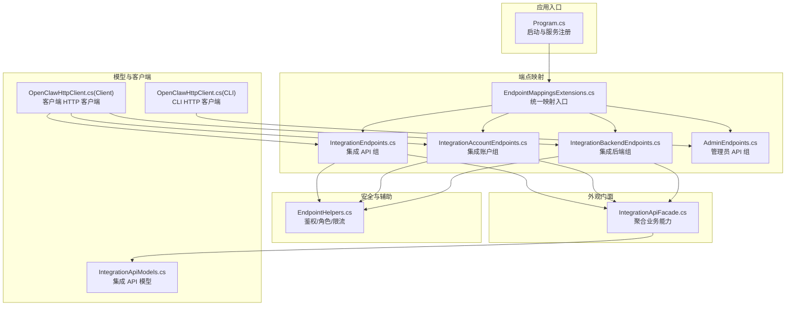
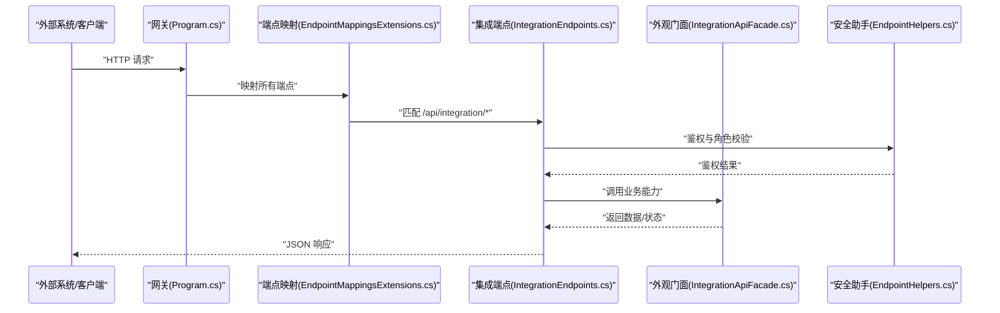
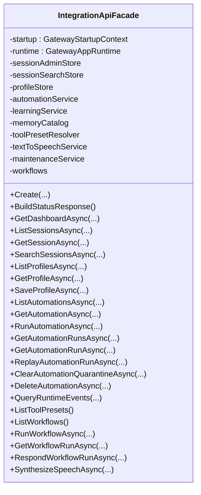
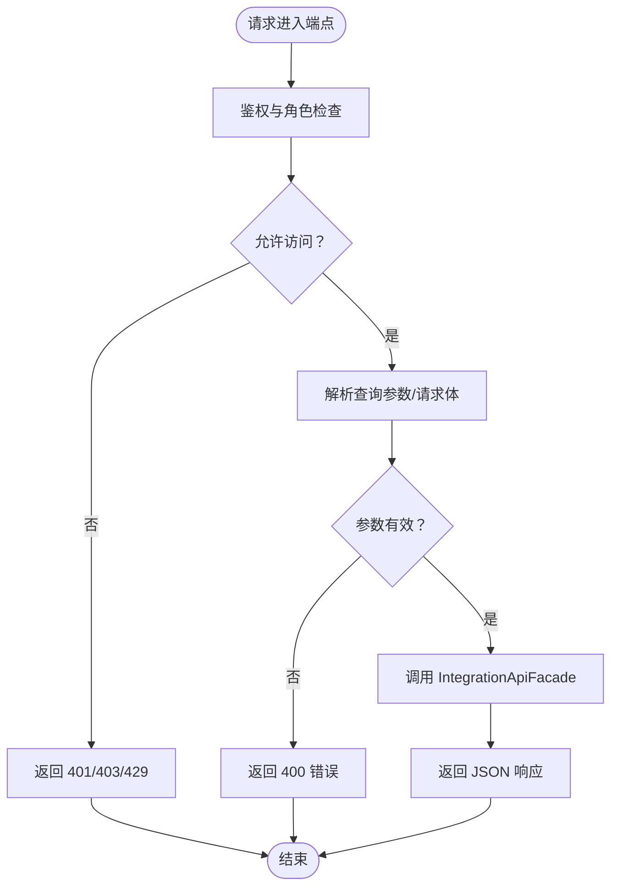
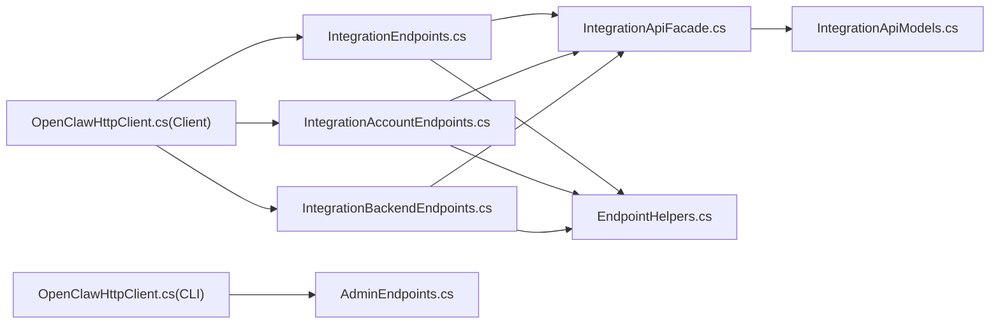

# 集成 API 层

<cite>
**本文引用的文件**
- [Program.cs](file://src/OpenClaw.Gateway/Program.cs)
- [EndpointMappingsExtensions.cs](file://src/OpenClaw.Gateway/Endpoints/EndpointMappingsExtensions.cs)
- [IntegrationEndpoints.cs](file://src/OpenClaw.Gateway/Endpoints/IntegrationEndpoints.cs)
- [IntegrationAccountEndpoints.cs](file://src/OpenClaw.Gateway/Endpoints/IntegrationAccountEndpoints.cs)
- [IntegrationBackendEndpoints.cs](file://src/OpenClaw.Gateway/Endpoints/IntegrationBackendEndpoints.cs)
- [AdminEndpoints.cs](file://src/OpenClaw.Gateway/Endpoints/AdminEndpoints.cs)
- [EndpointHelpers.cs](file://src/OpenClaw.Gateway/Endpoints/EndpointHelpers.cs)
- [IntegrationApiFacade.cs](file://src/OpenClaw.Gateway/Composition/IntegrationApiFacade.cs)
- [IntegrationApiModels.cs](file://src/OpenClaw.Core/Models/IntegrationApiModels.cs)
- [OpenClawHttpClient.cs（客户端）](file://src/OpenClaw.Client/OpenClawHttpClient.cs)
- [OpenClawHttpClient.cs（CLI）](file://src/OpenClaw.Cli/OpenClawHttpClient.cs)
- [GatewayAdminEndpointTests.cs](file://src/OpenClaw.Tests/GatewayAdminEndpointTests.cs)
</cite>

## 目录
1. [简介](#简介)
2. [项目结构](#项目结构)
3. [核心组件](#核心组件)
4. [架构总览](#架构总览)
5. [详细组件分析](#详细组件分析)
6. [依赖关系分析](#依赖关系分析)
7. [性能考量](#性能考量)
8. [故障排查指南](#故障排查指南)
9. [结论](#结论)
10. [附录：端点与使用示例](#附录端点与使用示例)

## 简介
本文件面向 OpenClaw.NET 的“集成 API 层”，系统性阐述其外观模式实现、端点路由与请求处理流程、管理员 API 与集成 API 的边界、以及与外部系统的对接机制。文档还覆盖 API 配置选项、认证授权策略、速率限制与版本管理建议，并提供架构图与端点使用示例，帮助开发者快速理解并正确集成。

## 项目结构
集成 API 层位于网关服务中，采用“分层+外观”的组织方式：
- 入口与启动：在应用启动时注册 OpenAPI 文档、安全中间件与管道，随后映射各类端点组。
- 端点分组：通过扩展方法将不同领域的端点统一映射到 /api/integration、/admin、/auth 等前缀下。
- 外观门面：由 IntegrationApiFacade 聚合会话、自动化、学习、记忆、工具预设等能力，供端点调用。
- 客户端与 CLI：提供 OpenClawHttpClient 与 OpenClawHttpClient（CLI），用于外部系统对接与命令行操作。

**图表来源**
- [Program.cs:60-96](file://src/OpenClaw.Gateway/Program.cs#L60-L96)
- [EndpointMappingsExtensions.cs:8-25](file://src/OpenClaw.Gateway/Endpoints/EndpointMappingsExtensions.cs#L8-L25)
- [IntegrationEndpoints.cs:13-21](file://src/OpenClaw.Gateway/Endpoints/IntegrationEndpoints.cs#L13-L21)
- [IntegrationAccountEndpoints.cs:12-19](file://src/OpenClaw.Gateway/Endpoints/IntegrationAccountEndpoints.cs#L12-L19)
- [IntegrationBackendEndpoints.cs:12-20](file://src/OpenClaw.Gateway/Endpoints/IntegrationBackendEndpoints.cs#L12-L20)
- [AdminEndpoints.cs:32-162](file://src/OpenClaw.Gateway/Endpoints/AdminEndpoints.cs#L32-L162)
- [EndpointHelpers.cs:47-131](file://src/OpenClaw.Gateway/Endpoints/EndpointHelpers.cs#L47-L131)
- [IntegrationApiFacade.cs:32-59](file://src/OpenClaw.Gateway/Composition/IntegrationApiFacade.cs#L32-L59)
- [IntegrationApiModels.cs:1-203](file://src/OpenClaw.Core/Models/IntegrationApiModels.cs#L1-L203)
- [OpenClawHttpClient.cs（客户端）:107-122](file://src/OpenClaw.Client/OpenClawHttpClient.cs#L107-L122)
- [OpenClawHttpClient.cs（CLI）:73-92](file://src/OpenClaw.Cli/OpenClawHttpClient.cs#L73-L92)

**章节来源**
- [Program.cs:60-96](file://src/OpenClaw.Gateway/Program.cs#L60-L96)
- [EndpointMappingsExtensions.cs:8-25](file://src/OpenClaw.Gateway/Endpoints/EndpointMappingsExtensions.cs#L8-L25)

## 核心组件
- 端点映射扩展：集中注册诊断、OpenAI 兼容、集成 API、集成账户、集成后端、Web UI、管理员、控制、WebSocket、Webhook、合约等端点。
- 集成 API 组：提供状态、审批、会话、工作流、自动化、运行事件、支付等集成能力。
- 集成账户组：提供连接账户的增删查能力，支持凭据脱敏返回。
- 集成后端组：提供后端列表、探测、会话生命周期管理与事件流。
- 管理员 API 组：提供会话、自动化、内存、配置、插件、通道等管理能力。
- 外观门面：整合会话、搜索、用户画像、自动化、学习、记忆、工具预设、TTS、维护、工作流等服务，屏蔽内部复杂度。
- 安全与限流：统一鉴权（浏览器会话、账号令牌、引导令牌）、角色判定、IP/会话/账号多维限流。
- 客户端与 CLI：封装常用集成端点的访问路径，便于外部系统对接。

**章节来源**
- [IntegrationEndpoints.cs:13-800](file://src/OpenClaw.Gateway/Endpoints/IntegrationEndpoints.cs#L13-L800)
- [IntegrationAccountEndpoints.cs:12-84](file://src/OpenClaw.Gateway/Endpoints/IntegrationAccountEndpoints.cs#L12-L84)
- [IntegrationBackendEndpoints.cs:12-173](file://src/OpenClaw.Gateway/Endpoints/IntegrationBackendEndpoints.cs#L12-L173)
- [AdminEndpoints.cs:32-162](file://src/OpenClaw.Gateway/Endpoints/AdminEndpoints.cs#L32-L162)
- [IntegrationApiFacade.cs:32-84](file://src/OpenClaw.Gateway/Composition/IntegrationApiFacade.cs#L32-L84)
- [EndpointHelpers.cs:47-240](file://src/OpenClaw.Gateway/Endpoints/EndpointHelpers.cs#L47-L240)
- [OpenClawHttpClient.cs（客户端）:107-122](file://src/OpenClaw.Client/OpenClawHttpClient.cs#L107-L122)
- [OpenClawHttpClient.cs（CLI）:73-92](file://src/OpenClaw.Cli/OpenClawHttpClient.cs#L73-L92)

## 架构总览
集成 API 层采用外观模式对外暴露统一入口，内部通过门面聚合多领域服务，端点层仅负责路由、鉴权与参数解析，业务逻辑集中在门面与服务层。

**图表来源**
- [Program.cs:80-96](file://src/OpenClaw.Gateway/Program.cs#L80-L96)
- [EndpointMappingsExtensions.cs:8-25](file://src/OpenClaw.Gateway/Endpoints/EndpointMappingsExtensions.cs#L8-L25)
- [IntegrationEndpoints.cs:13-40](file://src/OpenClaw.Gateway/Endpoints/IntegrationEndpoints.cs#L13-L40)
- [IntegrationApiFacade.cs:32-59](file://src/OpenClaw.Gateway/Composition/IntegrationApiFacade.cs#L32-L59)
- [EndpointHelpers.cs:47-131](file://src/OpenClaw.Gateway/Endpoints/EndpointHelpers.cs#L47-L131)

## 详细组件分析

### 外观模式与门面职责
- 职责聚合：会话管理、搜索、用户画像、自动化、学习、记忆、工具预设、TTS、维护、工作流等。
- 生命周期：在门面创建时注入 GatewayStartupContext、GatewayAppRuntime 及各服务，确保端点调用时可直接获取所需能力。
- 返回模型：统一使用 CoreJsonContext/PaymentJsonContext 序列化响应，类型来自 IntegrationApiModels 与支付相关上下文。

**图表来源**
- [IntegrationApiFacade.cs:32-84](file://src/OpenClaw.Gateway/Composition/IntegrationApiFacade.cs#L32-L84)

**章节来源**
- [IntegrationApiFacade.cs:32-84](file://src/OpenClaw.Gateway/Composition/IntegrationApiFacade.cs#L32-L84)

### 端点路由与请求处理
- 路由分组：/api/integration、/api/integration/accounts、/api/integration/backends、/admin 等。
- 鉴权与限流：每个端点在处理前调用 AuthorizeAndConsume，统一进行浏览器会话/令牌鉴权、角色判定与速率限制。
- 参数解析：支持查询参数与 JSON 请求体，异常时返回标准化错误响应。
- SSE 事件流：后端会话事件流以 Server-Sent Events 推送，支持断线重连与序列号续传。

**图表来源**
- [IntegrationEndpoints.cs:33-40](file://src/OpenClaw.Gateway/Endpoints/IntegrationEndpoints.cs#L33-L40)
- [IntegrationAccountEndpoints.cs:21-43](file://src/OpenClaw.Gateway/Endpoints/IntegrationAccountEndpoints.cs#L21-L43)
- [IntegrationBackendEndpoints.cs:44-60](file://src/OpenClaw.Gateway/Endpoints/IntegrationBackendEndpoints.cs#L44-L60)
- [EndpointHelpers.cs:47-131](file://src/OpenClaw.Gateway/Endpoints/EndpointHelpers.cs#L47-L131)

**章节来源**
- [IntegrationEndpoints.cs:33-800](file://src/OpenClaw.Gateway/Endpoints/IntegrationEndpoints.cs#L33-L800)
- [IntegrationAccountEndpoints.cs:21-84](file://src/OpenClaw.Gateway/Endpoints/IntegrationAccountEndpoints.cs#L21-L84)
- [IntegrationBackendEndpoints.cs:44-173](file://src/OpenClaw.Gateway/Endpoints/IntegrationBackendEndpoints.cs#L44-L173)
- [EndpointHelpers.cs:180-240](file://src/OpenClaw.Gateway/Endpoints/EndpointHelpers.cs#L180-L240)

### 管理员 API 与集成 API 边界
- 管理员 API：提供会话、自动化、内存、配置、插件、通道等管理能力，端点前缀为 /admin，多数需要更高权限。
- 集成 API：面向集成方的只读/变更接口，如状态、审批、会话、工作流、自动化、运行事件、支付等，端点前缀为 /api/integration。
- 权限模型：通过 endpointScope 与角色映射，严格区分 Viewer、Operator、Admin 三类角色。

**章节来源**
- [AdminEndpoints.cs:32-162](file://src/OpenClaw.Gateway/Endpoints/AdminEndpoints.cs#L32-L162)
- [EndpointHelpers.cs:242-307](file://src/OpenClaw.Gateway/Endpoints/EndpointHelpers.cs#L242-L307)

### 外部系统对接机制
- 客户端封装：OpenClawHttpClient（客户端）与 OpenClawHttpClient（CLI）分别定义了集成 API 与管理员 API 的 URI 前缀，便于外部系统按需调用。
- 支付对接：集成 API 提供支付相关端点（setup、funding、virtual-card、execute、status），并与支付运行时交互。
- 后端会话：通过 /api/integration/backends 提供后端探测、会话启动、输入发送、会话查询与事件流订阅。

**章节来源**
- [OpenClawHttpClient.cs（客户端）:107-122](file://src/OpenClaw.Client/OpenClawHttpClient.cs#L107-L122)
- [OpenClawHttpClient.cs（CLI）:73-92](file://src/OpenClaw.Cli/OpenClawHttpClient.cs#L73-L92)
- [IntegrationEndpoints.cs:666-800](file://src/OpenClaw.Gateway/Endpoints/IntegrationEndpoints.cs#L666-L800)
- [IntegrationBackendEndpoints.cs:12-173](file://src/OpenClaw.Gateway/Endpoints/IntegrationBackendEndpoints.cs#L12-L173)

## 依赖关系分析
- 端点到门面：集成端点直接依赖 IntegrationApiFacade；账户与后端端点同样依赖门面或对应服务。
- 安全依赖：端点依赖 EndpointHelpers 进行鉴权与限流；鉴权依赖 BrowserSessionAuthService、OperatorAccountService、OrganizationPolicyService 等。
- 客户端依赖：客户端与 CLI 通过预定义的 URI 访问端点，减少耦合。
- 模型依赖：响应模型来自 IntegrationApiModels，请求模型来自 CoreJsonContext/PaymentJsonContext。

**图表来源**
- [IntegrationEndpoints.cs:13-21](file://src/OpenClaw.Gateway/Endpoints/IntegrationEndpoints.cs#L13-L21)
- [IntegrationAccountEndpoints.cs:12-19](file://src/OpenClaw.Gateway/Endpoints/IntegrationAccountEndpoints.cs#L12-L19)
- [IntegrationBackendEndpoints.cs:12-20](file://src/OpenClaw.Gateway/Endpoints/IntegrationBackendEndpoints.cs#L12-L20)
- [EndpointHelpers.cs:47-131](file://src/OpenClaw.Gateway/Endpoints/EndpointHelpers.cs#L47-L131)
- [IntegrationApiFacade.cs:32-59](file://src/OpenClaw.Gateway/Composition/IntegrationApiFacade.cs#L32-L59)
- [IntegrationApiModels.cs:1-203](file://src/OpenClaw.Core/Models/IntegrationApiModels.cs#L1-L203)
- [OpenClawHttpClient.cs（客户端）:107-122](file://src/OpenClaw.Client/OpenClawHttpClient.cs#L107-L122)
- [OpenClawHttpClient.cs（CLI）:73-92](file://src/OpenClaw.Cli/OpenClawHttpClient.cs#L73-L92)
- [AdminEndpoints.cs:32-162](file://src/OpenClaw.Gateway/Endpoints/AdminEndpoints.cs#L32-L162)

**章节来源**
- [IntegrationEndpoints.cs:13-800](file://src/OpenClaw.Gateway/Endpoints/IntegrationEndpoints.cs#L13-L800)
- [IntegrationAccountEndpoints.cs:12-84](file://src/OpenClaw.Gateway/Endpoints/IntegrationAccountEndpoints.cs#L12-L84)
- [IntegrationBackendEndpoints.cs:12-173](file://src/OpenClaw.Gateway/Endpoints/IntegrationBackendEndpoints.cs#L12-L173)
- [EndpointHelpers.cs:47-240](file://src/OpenClaw.Gateway/Endpoints/EndpointHelpers.cs#L47-L240)
- [IntegrationApiFacade.cs:32-84](file://src/OpenClaw.Gateway/Composition/IntegrationApiFacade.cs#L32-L84)
- [IntegrationApiModels.cs:1-203](file://src/OpenClaw.Core/Models/IntegrationApiModels.cs#L1-L203)
- [OpenClawHttpClient.cs（客户端）:107-122](file://src/OpenClaw.Client/OpenClawHttpClient.cs#L107-L122)
- [OpenClawHttpClient.cs（CLI）:73-92](file://src/OpenClaw.Cli/OpenClawHttpClient.cs#L73-L92)
- [AdminEndpoints.cs:32-162](file://src/OpenClaw.Gateway/Endpoints/AdminEndpoints.cs#L32-L162)

## 性能考量
- 流量整形：通过 EndpointHelpers 的 TryConsumeOperatorRateLimit 实现基于账号/会话/IP 的多维限流，避免热点端点被刷爆。
- 请求体大小：EndpointHelpers 提供 TrySetMaxRequestBodySize 与 TryReadBodyTextAsync，防止过大请求导致内存压力。
- SSE 事件流：后端会话事件流采用异步订阅与序列号续传，降低长连接开销。
- 序列化优化：统一使用 System.Text.Json 与预构建的 JsonTypeInfo，减少反射与装箱。

**章节来源**
- [EndpointHelpers.cs:133-143](file://src/OpenClaw.Gateway/Endpoints/EndpointHelpers.cs#L133-L143)
- [EndpointHelpers.cs:180-201](file://src/OpenClaw.Gateway/Endpoints/EndpointHelpers.cs#L180-L201)
- [IntegrationBackendEndpoints.cs:175-215](file://src/OpenClaw.Gateway/Endpoints/IntegrationBackendEndpoints.cs#L175-L215)

## 故障排查指南
- 鉴权失败（401/403）：确认是否满足组织策略允许的鉴权模式（浏览器会话、账号令牌、引导令牌），并检查端点 scope 对应的角色要求。
- 速率限制（429）：检查当前 IP/会话/账号的限流策略，必要时调整策略或降频重试。
- 端点不存在：通过 /openapi/{documentName}.json 校验已映射的路由集合，参考测试用例中的期望路由清单。
- 支付相关错误：检查支付开关、提供商 ID、环境参数与策略限制，关注 BadPaymentRequest 的错误信息。
- 后端会话异常：确认后端 ID、会话 ID 是否正确，请求体 JSON 是否符合预期。

**章节来源**
- [EndpointHelpers.cs:203-240](file://src/OpenClaw.Gateway/Endpoints/EndpointHelpers.cs#L203-L240)
- [GatewayAdminEndpointTests.cs:6831-6853](file://src/OpenClaw.Tests/GatewayAdminEndpointTests.cs#L6831-L6853)
- [IntegrationEndpoints.cs:701-785](file://src/OpenClaw.Gateway/Endpoints/IntegrationEndpoints.cs#L701-L785)
- [IntegrationBackendEndpoints.cs:44-113](file://src/OpenClaw.Gateway/Endpoints/IntegrationBackendEndpoints.cs#L44-L113)

## 结论
集成 API 层通过外观模式将复杂的内部能力封装为简洁的 REST 接口，配合统一的安全与限流策略，既保证了易用性，也兼顾了安全性与稳定性。管理员 API 与集成 API 明确分离，满足不同场景下的治理与集成需求。建议在生产环境中启用非回环绑定的安全策略与速率限制，并通过 OpenAPI 文档持续验证端点契约。

## 附录：端点与使用示例
以下示例展示常见集成场景的端点与调用要点（以路径与方法为主，不包含具体请求体内容）：

- 获取集成仪表盘
  - 方法：GET
  - 路径：/api/integration/dashboard
  - 鉴权：integration.read
  - 响应：IntegrationDashboardResponse

- 查询会话列表
  - 方法：GET
  - 路径：/api/integration/sessions
  - 查询参数：page/pageSize/search/channelId/senderId/fromUtc/toUtc/state/starred/tag
  - 鉴权：integration.read
  - 响应：IntegrationSessionsResponse

- 获取单一会话详情
  - 方法：GET
  - 路径：/api/integration/sessions/{id}
  - 鉴权：integration.read
  - 响应：IntegrationSessionDetailResponse

- 会话时间线
  - 方法：GET
  - 路径：/api/integration/sessions/{id}/timeline
  - 查询参数：limit
  - 鉴权：integration.read
  - 响应：IntegrationSessionTimelineResponse

- 工作流运行
  - 方法：POST
  - 路径：/api/integration/workflows/{workflowId}/runs
  - 鉴权：integration.mutate（CSRF）
  - 请求体：AgentWorkflowRequest
  - 响应：AgentWorkflowRunResult（202）

- 自动化运行
  - 方法：POST
  - 路径：/api/integration/automations/{id}/run
  - 鉴权：integration.mutate（CSRF）
  - 查询参数：dryRun
  - 响应：MutationResponse（202/404）

- 创建集成账户
  - 方法：POST
  - 路径：/api/integration/accounts
  - 鉴权：integration.accounts（CSRF）
  - 请求体：ConnectedAccountCreateRequest
  - 响应：IntegrationConnectedAccountResponse

- 后端会话事件流
  - 方法：GET
  - 路径：/api/integration/backends/{id}/sessions/{sessionId}/events/stream
  - 查询参数：afterSequence/limit
  - 鉴权：integration.read
  - 响应：SSE 事件流

- 支付虚拟卡
  - 方法：POST
  - 路径：/api/integration/payment/virtual-card
  - 鉴权：integration.mutate
  - 请求体：VirtualCardRequest
  - 响应：VirtualCardHandle

- 管理员端点（示例）
  - 路径：/admin/external-cli/connectors/{connector}
  - 方法：GET
  - 鉴权：admin.external-cli
  - 响应：ExternalCliConnectorStatus

**章节来源**
- [IntegrationEndpoints.cs:22-800](file://src/OpenClaw.Gateway/Endpoints/IntegrationEndpoints.cs#L22-L800)
- [IntegrationAccountEndpoints.cs:21-84](file://src/OpenClaw.Gateway/Endpoints/IntegrationAccountEndpoints.cs#L21-L84)
- [IntegrationBackendEndpoints.cs:115-173](file://src/OpenClaw.Gateway/Endpoints/IntegrationBackendEndpoints.cs#L115-L173)
- [AdminEndpoints.cs:30-56](file://src/OpenClaw.Gateway/Endpoints/AdminEndpoints.cs#L30-L56)
- [OpenClawHttpClient.cs（客户端）:107-122](file://src/OpenClaw.Client/OpenClawHttpClient.cs#L107-L122)
- [OpenClawHttpClient.cs（CLI）:73-92](file://src/OpenClaw.Cli/OpenClawHttpClient.cs#L73-L92)