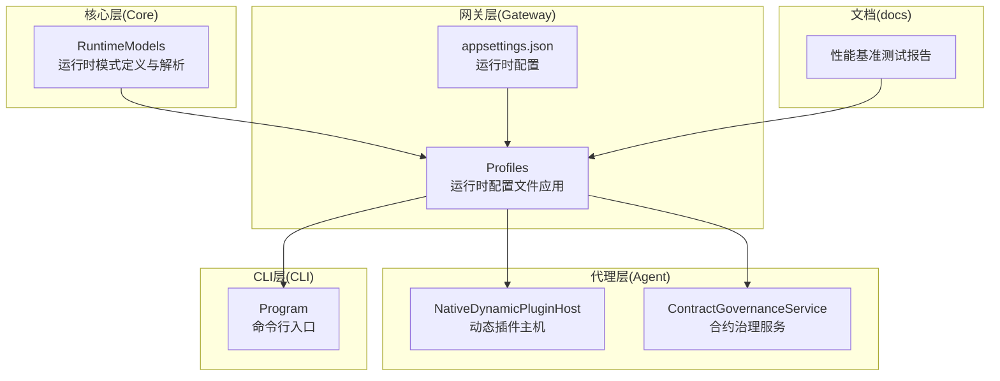
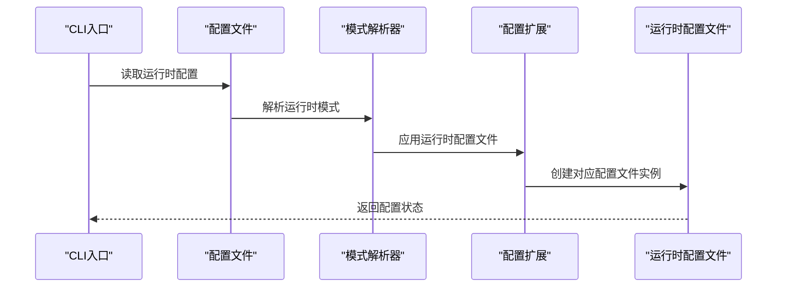
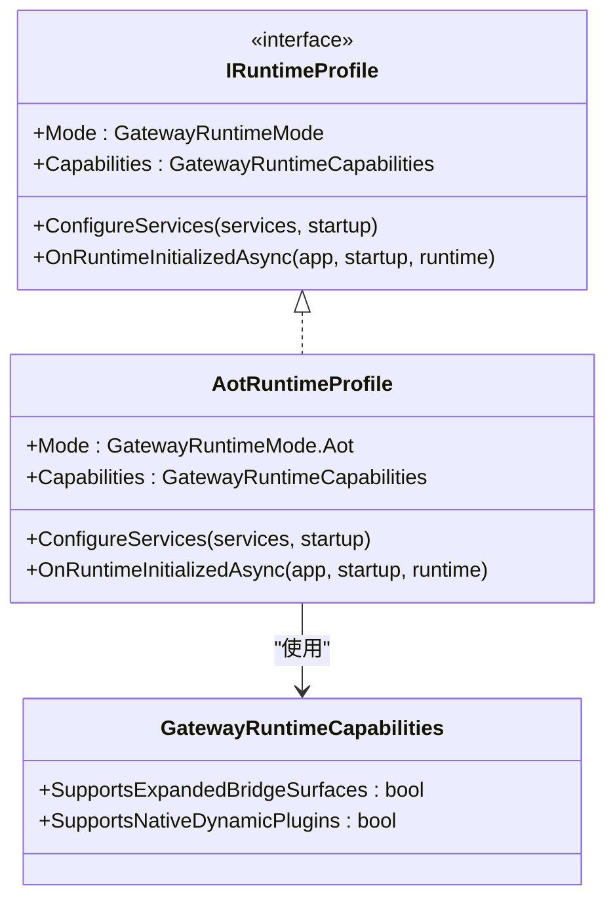
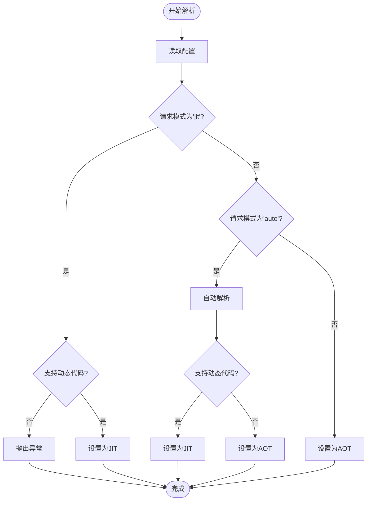
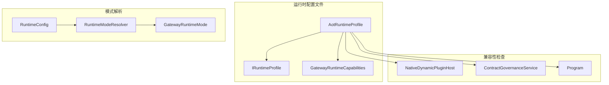

# AOT 运行时配置文件

<cite>
**本文档引用的文件**
- [AotRuntimeProfile.cs](file://src/OpenClaw.Gateway/Profiles/AotRuntimeProfile.cs)
- [IRuntimeProfile.cs](file://src/OpenClaw.Gateway/Profiles/IRuntimeProfile.cs)
- [JitRuntimeProfile.cs](file://src/OpenClaw.Gateway/Profiles/JitRuntimeProfile.cs)
- [RuntimeProfileExtensions.cs](file://src/OpenClaw.Gateway/Profiles/RuntimeProfileExtensions.cs)
- [RuntimeModels.cs](file://src/OpenClaw.Core/Models/RuntimeModels.cs)
- [NativeDynamicPluginHost.cs](file://src/OpenClaw.Agent/Plugins/NativeDynamicPluginHost.cs)
- [ContractGovernanceService.cs](file://src/OpenClaw.Gateway/ContractGovernanceService.cs)
- [Program.cs](file://src/OpenClaw.Cli/Program.cs)
- [appsettings.json](file://src/OpenClaw.Gateway/appsettings.json)
- [maf-aot-jit-findings.md](file://docs/maf-aot-jit/maf-aot-jit-findings.md)
- [maf-aot-jit-plan.md](file://docs/maf-aot-jit/maf-aot-jit-plan.md)
</cite>

## 目录
1. [简介](#简介)
2. [项目结构](#项目结构)
3. [核心组件](#核心组件)
4. [架构概览](#架构概览)
5. [详细组件分析](#详细组件分析)
6. [依赖关系分析](#依赖关系分析)
7. [性能考虑](#性能考虑)
8. [故障排除指南](#故障排除指南)
9. [结论](#结论)
10. [附录](#附录)

## 简介
本文件系统性地文档化了 OpenClaw.NET 中的 AOT（Ahead-of-Time）运行时配置体系，深入解释 AOT 模式的实现原理、提前编译的优势与限制，并详细说明 AotRuntimeProfile 类的配置选项、服务注册机制以及性能特征。同时涵盖 AOT 模式下的内存管理、资源预分配和启动时间优化策略，包括 AOT 兼容性检查、依赖项准备和部署要求。文档还提供了 AOT 模式配置示例、性能基准测试结果以及故障排除指南，并对 AOT 模式与 JIT 模式的对比分析和选择建议进行总结。

## 项目结构
AOT 运行时配置主要分布在以下模块中：
- 运行时模式定义与解析：位于 Core 层的 RuntimeModels.cs
- 运行时配置文件：位于 Gateway 层的 appsettings.json
- 运行时配置文件应用：位于 Gateway 层的 Profiles 子目录
- 运行时兼容性检查：位于 Agent 和 Gateway 层的相关服务
- 性能基准测试：位于 docs/maf-aot-jit 目录下的多份报告



**图表来源**
- [RuntimeModels.cs:1-69](file://src/OpenClaw.Core/Models/RuntimeModels.cs#L1-L69)
- [AotRuntimeProfile.cs:1-22](file://src/OpenClaw.Gateway/Profiles/AotRuntimeProfile.cs#L1-L22)
- [appsettings.json:1-10](file://src/OpenClaw.Gateway/appsettings.json#L1-L10)

**章节来源**
- [RuntimeModels.cs:1-69](file://src/OpenClaw.Core/Models/RuntimeModels.cs#L1-L69)
- [AotRuntimeProfile.cs:1-22](file://src/OpenClaw.Gateway/Profiles/AotRuntimeProfile.cs#L1-L22)
- [appsettings.json:1-10](file://src/OpenClaw.Gateway/appsettings.json#L1-L10)

## 核心组件
本节详细分析 AOT 运行时配置的核心组件及其职责。

### 运行时模式与能力
- GatewayRuntimeMode 枚举定义了 AOT 和 JIT 两种运行时模式
- GatewayRuntimeCapabilities 记录了运行时的能力边界
- RuntimeConfig 提供了运行时模式和编排器的配置入口

### AOT 运行时配置文件
AotRuntimeProfile 实现了 IRuntimeProfile 接口，专门用于 AOT 模式下的配置：
- Mode 属性固定返回 GatewayRuntimeMode.Aot
- Capabilities 指定 AOT 模式下不支持扩展桥接面和原生动态插件
- ConfigureServices 在 AOT 模式下为空实现
- OnRuntimeInitializedAsync 在 AOT 模式下为空实现

### 运行时模式解析
RuntimeModeResolver 负责根据配置和环境判断有效的运行时模式：
- 支持 "auto"、"aot"、"jit" 三种模式
- 当请求 "jit" 但不支持动态代码时抛出异常
- "auto" 模式下优先选择支持动态代码的 JIT，否则回退到 AOT

**章节来源**
- [IRuntimeProfile.cs:1-18](file://src/OpenClaw.Gateway/Profiles/IRuntimeProfile.cs#L1-L18)
- [AotRuntimeProfile.cs:1-22](file://src/OpenClaw.Gateway/Profiles/AotRuntimeProfile.cs#L1-L22)
- [RuntimeModels.cs:1-69](file://src/OpenClaw.Core/Models/RuntimeModels.cs#L1-L69)

## 架构概览
AOT 运行时配置采用分层架构设计，确保在不同运行时模式下提供一致的配置体验：



**图表来源**
- [RuntimeProfileExtensions.cs:1-22](file://src/OpenClaw.Gateway/Profiles/RuntimeProfileExtensions.cs#L1-L22)
- [RuntimeModels.cs:29-59](file://src/OpenClaw.Core/Models/RuntimeModels.cs#L29-L59)

## 详细组件分析

### AotRuntimeProfile 类分析
AotRuntimeProfile 是 AOT 模式的核心配置文件实现，具有以下特征：



**图表来源**
- [IRuntimeProfile.cs:7-17](file://src/OpenClaw.Gateway/Profiles/IRuntimeProfile.cs#L7-L17)
- [AotRuntimeProfile.cs:7-21](file://src/OpenClaw.Gateway/Profiles/AotRuntimeProfile.cs#L7-L21)

#### 配置选项详解
- SupportsExpandedBridgeSurfaces: false
  - AOT 模式下不支持扩展桥接表面
  - 影响插件桥接和工具注册的灵活性
- SupportsNativeDynamicPlugins: false  
  - AOT 模式下禁用原生动态插件加载
  - 所有插件必须在编译时确定

#### 服务注册机制
AOT 模式下的服务注册遵循以下原则：
- 空实现：ConfigureServices 为空，表示不需要额外的服务注册
- 初始化钩子：OnRuntimeInitializedAsync 为空实现，表示无需特殊的初始化逻辑
- 能力约束：通过 Capabilities 明确声明运行时能力边界

**章节来源**
- [AotRuntimeProfile.cs:1-22](file://src/OpenClaw.Gateway/Profiles/AotRuntimeProfile.cs#L1-L22)
- [IRuntimeProfile.cs:1-18](file://src/OpenClaw.Gateway/Profiles/IRuntimeProfile.cs#L1-L18)

### 运行时模式解析流程
运行时模式解析采用状态机设计，确保模式选择的确定性和可预测性：



**图表来源**
- [RuntimeModels.cs:29-59](file://src/OpenClaw.Core/Models/RuntimeModels.cs#L29-L59)

**章节来源**
- [RuntimeModels.cs:29-59](file://src/OpenClaw.Core/Models/RuntimeModels.cs#L29-L59)

### 兼容性检查机制
系统在多个层面实施 AOT 兼容性检查：

#### 动态插件兼容性检查
NativeDynamicPluginHost 对动态插件进行运行时模式检查：
- 当检测到 AOT 模式且启用动态插件时抛出异常
- 记录详细的诊断信息，包括被阻止的原因和能力需求
- 提供结构化的日志输出，便于问题排查

#### 合约治理兼容性检查
ContractGovernanceService 在工具执行前进行模式兼容性验证：
- 检查工具是否需要 JIT 模式
- 对于 AOT 模式下的 JIT 工具发出警告
- 确保运行时模式与工具能力的匹配

**章节来源**
- [NativeDynamicPluginHost.cs:120-130](file://src/OpenClaw.Agent/Plugins/NativeDynamicPluginHost.cs#L120-L130)
- [ContractGovernanceService.cs:90-100](file://src/OpenClaw.Gateway/ContractGovernanceService.cs#L90-L100)

## 依赖关系分析
AOT 运行时配置与其他组件存在以下依赖关系：



**图表来源**
- [RuntimeProfileExtensions.cs:8-21](file://src/OpenClaw.Gateway/Profiles/RuntimeProfileExtensions.cs#L8-L21)
- [RuntimeModels.cs:11-27](file://src/OpenClaw.Core/Models/RuntimeModels.cs#L11-L27)

**章节来源**
- [RuntimeProfileExtensions.cs:1-22](file://src/OpenClaw.Gateway/Profiles/RuntimeProfileExtensions.cs#L1-L22)
- [RuntimeModels.cs:1-69](file://src/OpenClaw.Core/Models/RuntimeModels.cs#L1-L69)

## 性能考虑
基于官方性能基准测试报告，AOT 模式在多个维度表现出色：

### 启动时间优化
- AOT 模式启动时间显著优于 JIT 模式
- 在 HTTP 工具调用场景中，AOT 启动时间减少约 100-150ms
- 在插件加载场景中，AOT 启动时间减少约 500-600ms

### 响应延迟优化
- AOT 模式在 HTTP 工具调用中响应延迟降低约 15-25%
- 在流式传输场景中，AOT 的延迟优势更加明显
- 插件配置加载的响应时间提升约 50-85%

### 内存管理策略
AOT 模式采用静态内存分配策略：
- 编译时确定内存布局，减少运行时内存分配开销
- 通过 Trim 优化减少不必要的代码和数据
- 预分配常用对象，避免运行时频繁的 GC 压力

**章节来源**
- [maf-aot-jit-findings.md:1-24](file://docs/maf-aot-jit/maf-aot-jit-findings.md#L1-L24)
- [maf-aot-jit-plugin-findings.md:1-17](file://docs/maf-aot-jit/maf-aot-jit-plugin-findings.md#L1-L17)
- [maf-aot-jit-plugin-config-findings.md:1-17](file://docs/maf-aot-jit/maf-aot-jit-plugin-config-findings.md#L1-L17)

## 故障排除指南

### 常见问题及解决方案

#### 动态插件加载失败
**症状**：启用动态插件但收到 AOT 模式相关的错误
**原因**：AOT 模式不支持动态代码加载
**解决方案**：
- 将插件编译为静态依赖
- 使用预编译的插件包
- 在 JIT 模式下运行需要动态插件的应用

#### JIT 模式配置无效
**症状**：配置为 JIT 但仍以 AOT 模式运行
**原因**：目标平台不支持动态代码
**解决方案**：
- 检查运行环境的动态代码支持能力
- 修改配置为 "auto" 让系统自动选择
- 确保部署的二进制文件支持 JIT

#### 合约治理警告
**症状**：工具执行时出现 JIT 模式需求警告
**原因**：某些工具仅在 JIT 模式下可用
**解决方案**：
- 在配置中明确指定运行时模式
- 使用 AOT 兼容的替代工具
- 调整工具集以适应当前运行时模式

### 诊断工具和日志
系统提供多层次的诊断能力：
- 结构化日志输出详细的兼容性诊断
- 插件加载报告记录每个插件的状态
- 运行时事件跟踪提供完整的执行轨迹

**章节来源**
- [NativeDynamicPluginHost.cs:120-188](file://src/OpenClaw.Agent/Plugins/NativeDynamicPluginHost.cs#L120-L188)
- [ContractGovernanceService.cs:90-100](file://src/OpenClaw.Gateway/ContractGovernanceService.cs#L90-L100)

## 结论
AOT 运行时配置文件在 OpenClaw.NET 中实现了优雅的运行时模式切换和能力约束。通过明确的配置接口、严格的兼容性检查和优化的性能特征，AOT 模式为生产环境提供了稳定、高效的运行时选择。关键优势包括：

1. **启动性能**：显著缩短启动时间，适合需要快速响应的应用场景
2. **内存效率**：静态内存分配减少运行时内存压力
3. **部署简化**：无需 JIT 编译器，部署更加简单可靠
4. **安全增强**：限制动态代码执行，提高运行时安全性

对于需要动态功能或复杂运行时行为的应用，JIT 模式仍然是更好的选择。但在大多数生产环境中，AOT 模式提供了足够的功能和更好的性能表现。

## 附录

### AOT 模式配置示例
推荐的 AOT 模式配置：
```json
{
  "OpenClaw": {
    "Runtime": {
      "Mode": "aot",
      "Orchestrator": "native"
    }
  }
}
```

### 配置参数说明
- **Mode**："aot" | "jit" | "auto"
  - aot：强制使用提前编译模式
  - jit：强制使用即时编译模式  
  - auto：根据环境自动选择最优模式

- **Orchestrator**："native" | "maf"
  - native：使用内置的原生编排器
  - maf：使用 Microsoft Agent Framework 编排器

### 性能基准测试摘要
基于官方测试报告的关键指标：
- 启动时间：AOT 模式比 JIT 模式快 100-600ms
- 响应延迟：AOT 模式在多数场景下更快
- 内存占用：AOT 模式内存使用更加可预测
- 稳定性：AOT 模式在长时间运行中表现更稳定

### 选择建议
**选择 AOT 模式当**：
- 生产环境需要最佳启动性能
- 部署环境无法提供 JIT 支持
- 应用功能相对静态，不需要动态代码
- 对内存使用稳定性有严格要求

**选择 JIT 模式当**：
- 需要动态加载插件或工具
- 应用需要复杂的运行时反射功能
- 开发和测试阶段需要最大灵活性
- 工具集包含大量 JIT 特定功能