# JIT 运行时配置文件

<cite>
**本文档引用的文件**
- [JitRuntimeProfile.cs](file://src/OpenClaw.Gateway/Profiles/JitRuntimeProfile.cs)
- [RuntimeProfileExtensions.cs](file://src/OpenClaw.Gateway/Profiles/RuntimeProfileExtensions.cs)
- [IRuntimeProfile.cs](file://src/OpenClaw.Gateway/Profiles/IRuntimeProfile.cs)
- [AotRuntimeProfile.cs](file://src/OpenClaw.Gateway/Profiles/AotRuntimeProfile.cs)
- [RuntimeModels.cs](file://src/OpenClaw.Core/Models/RuntimeModels.cs)
- [GatewayBootstrapExtensions.cs](file://src/OpenClaw.Gateway/Bootstrap/GatewayBootstrapExtensions.cs)
- [NativeDynamicPluginHost.cs](file://src/OpenClaw.Agent/Plugins/NativeDynamicPluginHost.cs)
- [ContractGovernanceService.cs](file://src/OpenClaw.Gateway/ContractGovernanceService.cs)
- [RuntimePulseService.cs](file://src/OpenClaw.Gateway/RuntimePulseService.cs)
- [GatewayTool.cs](file://src/OpenClaw.Gateway/Tools/GatewayTool.cs)
- [PluginHealthService.cs](file://src/OpenClaw.Gateway/PluginHealthService.cs)
- [SetupVerificationService.cs](file://src/OpenClaw.Core/Validation/SetupVerificationService.cs)
- [architecture-startup-refactor.md](file://docs/architecture-startup-refactor.md)
- [maf-aot-jit-plan.md](file://docs/maf-aot-jit/maf-aot-jit-plan.md)
- [COMPATIBILITY.md](file://COMPATIBILITY.md)
</cite>

## 目录
1. [简介](#简介)
2. [项目结构](#项目结构)
3. [核心组件](#核心组件)
4. [架构概览](#架构概览)
5. [详细组件分析](#详细组件分析)
6. [依赖关系分析](#依赖关系分析)
7. [性能考虑](#性能考虑)
8. [故障排除指南](#故障排除指南)
9. [结论](#结论)

## 简介

JIT（Just-In-Time）运行时配置文件是 OpenClaw.NET 项目中的关键组件，它实现了动态编译和运行时灵活性的核心机制。本文档深入解释了 JIT 模式的实现原理、动态编译特性以及运行时灵活性，详细说明了 JitRuntimeProfile 类的配置选项、服务注册机制和性能特征。

JIT 模式提供了比 AOT（Ahead-of-Time）模式更丰富的框架兼容性，特别是在动态代码执行、反射操作和原生动态插件支持方面。这种模式特别适合需要高度灵活性和兼容性的应用场景。

## 项目结构

OpenClaw.NET 项目采用分层架构设计，JIT 运行时配置位于以下关键位置：

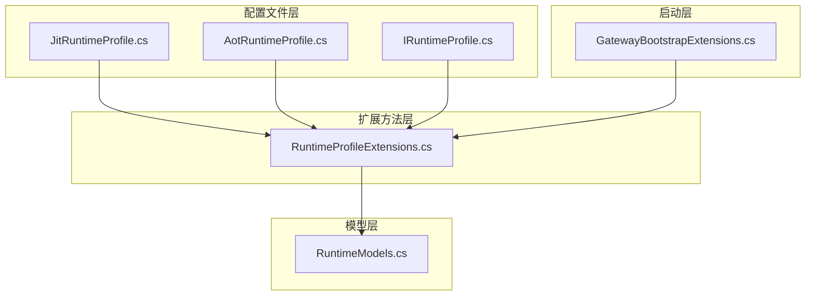

**图表来源**
- [JitRuntimeProfile.cs:1-22](file://src/OpenClaw.Gateway/Profiles/JitRuntimeProfile.cs#L1-L22)
- [RuntimeProfileExtensions.cs:1-23](file://src/OpenClaw.Gateway/Profiles/RuntimeProfileExtensions.cs#L1-L23)
- [IRuntimeProfile.cs:1-18](file://src/OpenClaw.Gateway/Profiles/IRuntimeProfile.cs#L1-L18)

**章节来源**
- [JitRuntimeProfile.cs:1-22](file://src/OpenClaw.Gateway/Profiles/JitRuntimeProfile.cs#L1-L22)
- [RuntimeProfileExtensions.cs:1-23](file://src/OpenClaw.Gateway/Profiles/RuntimeProfileExtensions.cs#L1-L23)
- [IRuntimeProfile.cs:1-18](file://src/OpenClaw.Gateway/Profiles/IRuntimeProfile.cs#L1-L18)

## 核心组件

### JitRuntimeProfile 类

JitRuntimeProfile 是 JIT 运行时配置的核心实现，它继承自 IRuntimeProfile 接口并提供特定的运行时能力配置。

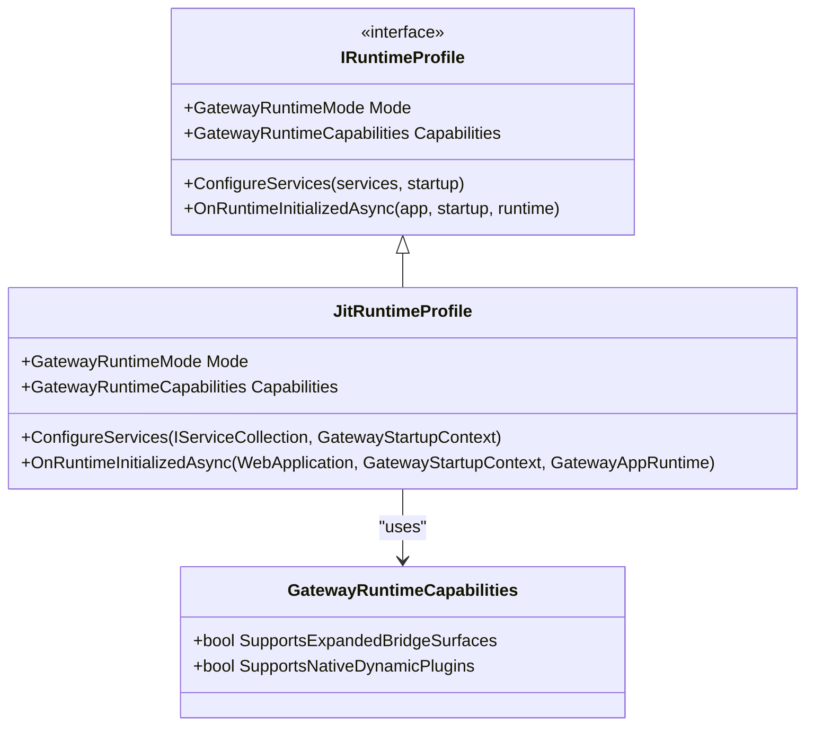

**图表来源**
- [IRuntimeProfile.cs:7-17](file://src/OpenClaw.Gateway/Profiles/IRuntimeProfile.cs#L7-L17)
- [JitRuntimeProfile.cs:7-21](file://src/OpenClaw.Gateway/Profiles/JitRuntimeProfile.cs#L7-L21)

JitRuntimeProfile 的主要特性包括：

1. **运行时模式设置**：将 Mode 属性设置为 GatewayRuntimeMode.Jit
2. **能力配置**：启用 SupportsExpandedBridgeSurfaces 和 SupportsNativeDynamicPlugins
3. **服务注册**：提供空的 ConfigureServices 方法
4. **初始化回调**：提供空的 OnRuntimeInitializedAsync 方法

### 运行时配置模型

运行时配置通过 GatewayRuntimeState 和 RuntimeConfig 模型实现：

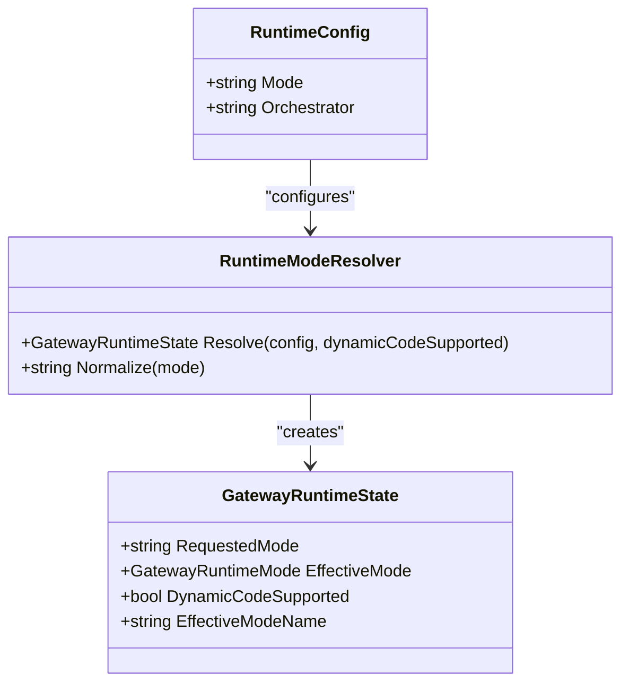

**图表来源**
- [RuntimeModels.cs:11-59](file://src/OpenClaw.Core/Models/RuntimeModels.cs#L11-L59)

**章节来源**
- [JitRuntimeProfile.cs:7-21](file://src/OpenClaw.Gateway/Profiles/JitRuntimeProfile.cs#L7-L21)
- [IRuntimeProfile.cs:7-17](file://src/OpenClaw.Gateway/Profiles/IRuntimeProfile.cs#L7-L17)
- [RuntimeModels.cs:5-59](file://src/OpenClaw.Core/Models/RuntimeModels.cs#L5-L59)

## 架构概览

JIT 运行时配置在整个系统架构中的位置如下：

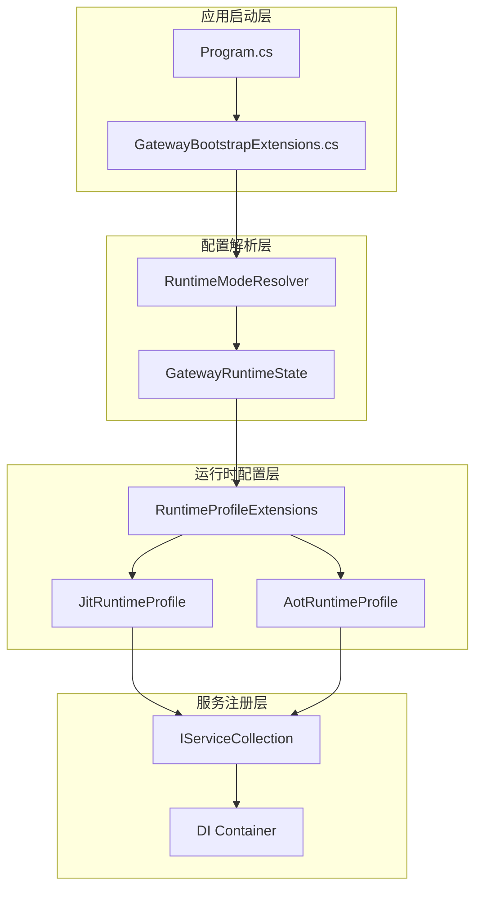

**图表来源**
- [GatewayBootstrapExtensions.cs:86-105](file://src/OpenClaw.Gateway/Bootstrap/GatewayBootstrapExtensions.cs#L86-L105)
- [RuntimeProfileExtensions.cs:8-21](file://src/OpenClaw.Gateway/Profiles/RuntimeProfileExtensions.cs#L8-L21)

**章节来源**
- [GatewayBootstrapExtensions.cs:86-105](file://src/OpenClaw.Gateway/Bootstrap/GatewayBootstrapExtensions.cs#L86-L105)
- [architecture-startup-refactor.md:1-33](file://docs/architecture-startup-refactor.md#L1-L33)

## 详细组件分析

### JIT 运行时配置实现

JIT 运行时配置通过以下机制实现动态编译和运行时灵活性：

#### 1. 能力配置机制

JitRuntimeProfile 提供了两个关键能力：

- **SupportsExpandedBridgeSurfaces**: 启用扩展的桥接表面支持
- **SupportsNativeDynamicPlugins**: 启用原生动态插件支持

这些能力使得 JIT 模式能够支持更丰富的功能集，包括动态代码加载和反射操作。

#### 2. 服务注册流程

运行时配置通过 ApplyOpenClawRuntimeProfile 扩展方法进行注册：

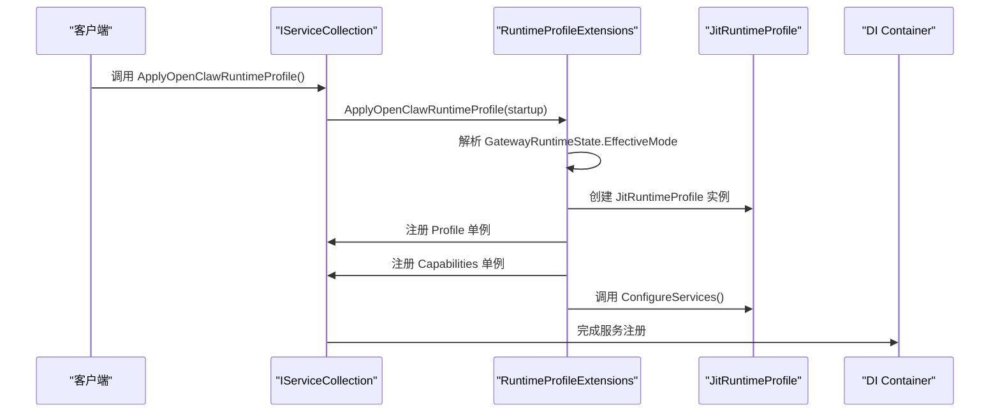

**图表来源**
- [RuntimeProfileExtensions.cs:8-21](file://src/OpenClaw.Gateway/Profiles/RuntimeProfileExtensions.cs#L8-L21)

#### 3. 动态代码支持

JIT 模式通过 RuntimeModeResolver 实现动态代码支持：

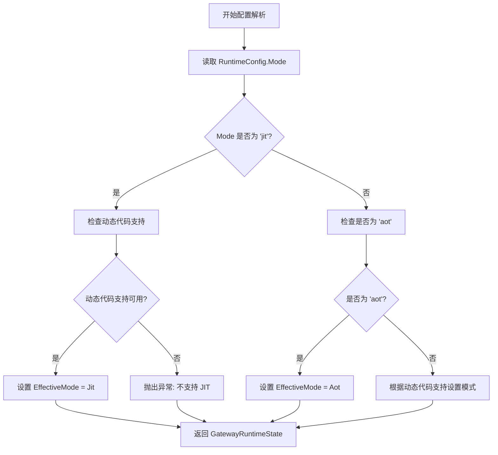

**图表来源**
- [RuntimeModels.cs:29-55](file://src/OpenClaw.Core/Models/RuntimeModels.cs#L29-L55)

**章节来源**
- [JitRuntimeProfile.cs:9-13](file://src/OpenClaw.Gateway/Profiles/JitRuntimeProfile.cs#L9-L13)
- [RuntimeProfileExtensions.cs:10-15](file://src/OpenClaw.Gateway/Profiles/RuntimeProfileExtensions.cs#L10-L15)
- [RuntimeModels.cs:29-55](file://src/OpenClaw.Core/Models/RuntimeModels.cs#L29-L55)

### 动态加载机制

JIT 模式下的动态加载主要通过 NativeDynamicPluginHost 实现：

#### 1. 插件加载流程

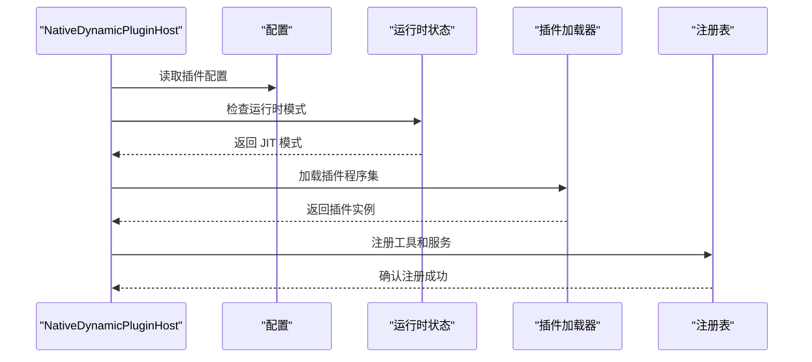

**图表来源**
- [NativeDynamicPluginHost.cs:64-169](file://src/OpenClaw.Agent/Plugins/NativeDynamicPluginHost.cs#L64-L169)

#### 2. 反射优化策略

JIT 模式通过以下方式优化反射操作：

- **延迟加载**: 插件在需要时才被加载
- **缓存机制**: 经常使用的类型和方法被缓存
- **元数据预热**: 在启动时预热常用的反射元数据

**章节来源**
- [NativeDynamicPluginHost.cs:16-18](file://src/OpenClaw.Agent/Plugins/NativeDynamicPluginHost.cs#L16-L18)
- [NativeDynamicPluginHost.cs:87-130](file://src/OpenClaw.Agent/Plugins/NativeDynamicPluginHost.cs#L87-L130)

### 运行时资源管理

JIT 模式提供了完善的资源管理机制：

#### 1. 内存管理

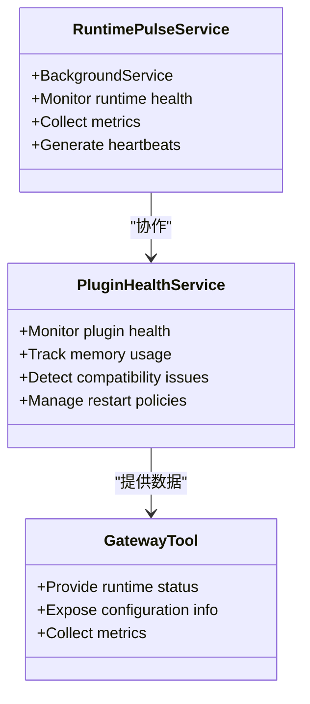

**图表来源**
- [RuntimePulseService.cs:16-38](file://src/OpenClaw.Gateway/RuntimePulseService.cs#L16-L38)
- [PluginHealthService.cs:306-340](file://src/OpenClaw.Gateway/PluginHealthService.cs#L306-L340)
- [GatewayTool.cs:13-37](file://src/OpenClaw.Gateway/Tools/GatewayTool.cs#L13-L37)

#### 2. 性能监控

JIT 模式集成了全面的性能监控功能：

- **运行时脉搏服务**: 定期收集运行时健康状况
- **插件健康服务**: 监控插件内存使用和兼容性
- **网关工具**: 提供运行时状态和配置摘要

**章节来源**
- [RuntimePulseService.cs:16-38](file://src/OpenClaw.Gateway/RuntimePulseService.cs#L16-L38)
- [PluginHealthService.cs:306-340](file://src/OpenClaw.Gateway/PluginHealthService.cs#L306-L340)
- [GatewayTool.cs:13-37](file://src/OpenClaw.Gateway/Tools/GatewayTool.cs#L13-L37)

## 依赖关系分析

JIT 运行时配置与其他组件的依赖关系如下：

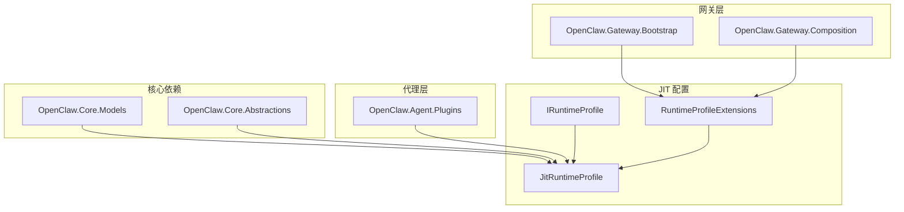

**图表来源**
- [JitRuntimeProfile.cs:1-3](file://src/OpenClaw.Gateway/Profiles/JitRuntimeProfile.cs#L1-L3)
- [RuntimeProfileExtensions.cs:1-3](file://src/OpenClaw.Gateway/Profiles/RuntimeProfileExtensions.cs#L1-L3)

**章节来源**
- [JitRuntimeProfile.cs:1-3](file://src/OpenClaw.Gateway/Profiles/JitRuntimeProfile.cs#L1-L3)
- [RuntimeProfileExtensions.cs:1-3](file://src/OpenClaw.Gateway/Profiles/RuntimeProfileExtensions.cs#L1-L3)

## 性能考虑

### JIT 模式性能特征

JIT 模式相比 AOT 模式具有以下性能特征：

#### 1. 启动时间
- **JIT**: 启动时进行动态编译，启动时间较长但运行时性能优化
- **AOT**: 启动速度快，但缺少运行时优化机会

#### 2. 内存使用
- **JIT**: 需要额外的内存用于编译缓存和运行时优化
- **AOT**: 内存占用相对较低

#### 3. 运行时性能
- **JIT**: 可以根据实际使用模式进行优化
- **AOT**: 性能稳定但缺乏动态优化

### 性能调优建议

#### 1. JIT 模式调优

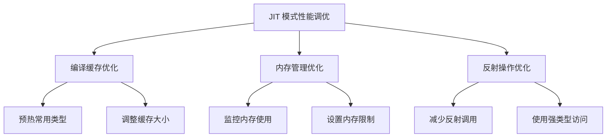

#### 2. 资源管理最佳实践

- **动态插件管理**: 合理控制动态插件的数量和生命周期
- **内存监控**: 定期检查内存使用情况，防止内存泄漏
- **性能监控**: 使用内置的性能监控工具跟踪运行时表现

**章节来源**
- [COMPATIBILITY.md:1-10](file://COMPATIBILITY.md#L1-L10)
- [PluginHealthService.cs:306-340](file://src/OpenClaw.Gateway/PluginHealthService.cs#L306-L340)

## 故障排除指南

### 常见问题及解决方案

#### 1. JIT 模式配置错误

**问题**: 运行时模式配置无效
**解决方案**: 检查 RuntimeConfig.Mode 设置，确保值为 "jit"、"aot" 或 "auto"

#### 2. 动态代码支持问题

**问题**: JIT 模式无法加载
**解决方案**: 验证运行时环境是否支持动态代码，检查 RuntimeFeature.IsDynamicCodeSupported

#### 3. 原生动态插件加载失败

**问题**: 原生动态插件无法加载
**解决方案**: 确认插件请求的能力是否需要 JIT 模式，检查插件清单配置

### 调试支持

#### 1. 医生检查

系统提供了完整的医生检查功能，可以诊断运行时配置问题：

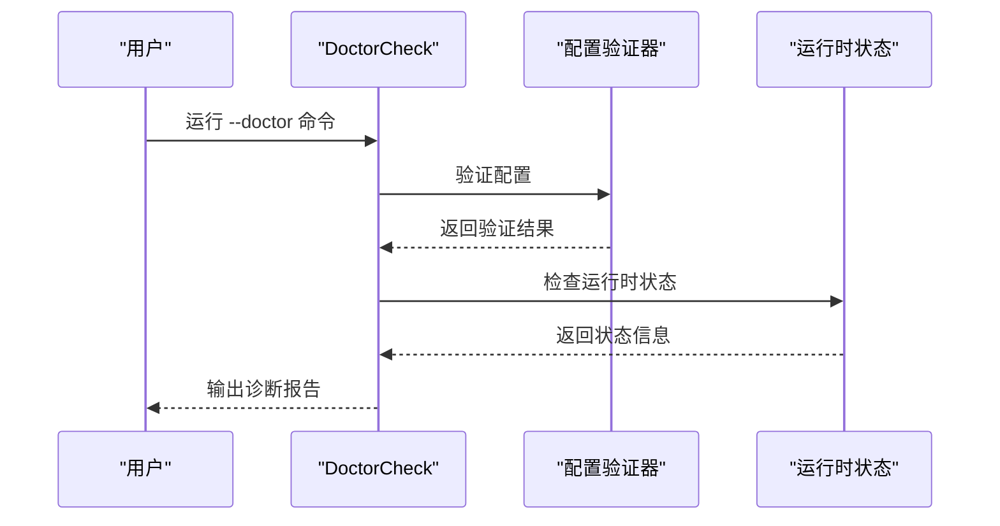

**图表来源**
- [GatewayBootstrapExtensions.cs:107-112](file://src/OpenClaw.Gateway/Bootstrap/GatewayBootstrapExtensions.cs#L107-L112)

#### 2. 日志记录

JIT 模式提供了详细的日志记录机制：

- **插件加载日志**: 记录插件发现、过滤和加载过程
- **兼容性诊断**: 记录插件与运行时模式的兼容性问题
- **性能指标**: 收集和记录运行时性能指标

**章节来源**
- [GatewayBootstrapExtensions.cs:86-105](file://src/OpenClaw.Gateway/Bootstrap/GatewayBootstrapExtensions.cs#L86-L105)
- [NativeDynamicPluginHost.cs:171-188](file://src/OpenClaw.Agent/Plugins/NativeDynamicPluginHost.cs#L171-L188)
- [SetupVerificationService.cs:313-321](file://src/OpenClaw.Core/Validation/SetupVerificationService.cs#L313-L321)

## 结论

JIT 运行时配置文件为 OpenClaw.NET 提供了强大的动态编译和运行时灵活性机制。通过 JitRuntimeProfile 类，系统实现了：

1. **动态编译支持**: 允许在运行时进行代码编译和优化
2. **扩展能力**: 支持原生动态插件和扩展的桥接表面
3. **灵活配置**: 通过 RuntimeConfig 和 RuntimeModeResolver 实现灵活的运行时模式选择
4. **完整监控**: 集成了全面的性能监控和故障排除功能

JIT 模式特别适合需要高度灵活性和兼容性的应用场景，虽然在启动时间和内存使用方面可能不如 AOT 模式高效，但在功能丰富性和运行时优化方面具有显著优势。

对于生产环境部署，建议根据具体需求选择合适的运行时模式，并充分利用系统的监控和诊断功能来确保系统的稳定运行。