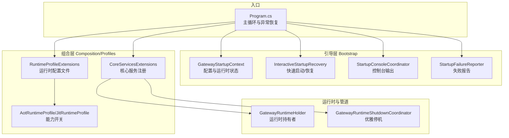
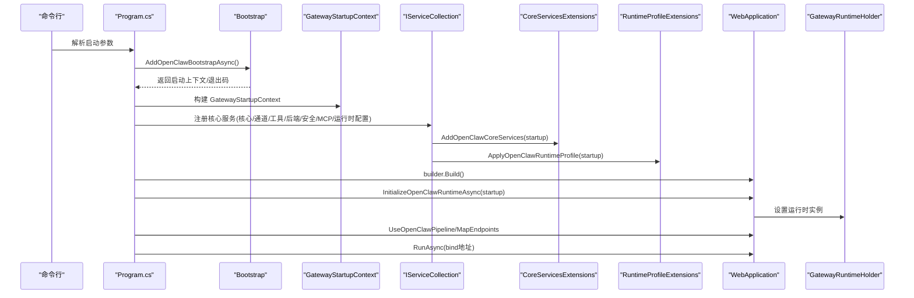
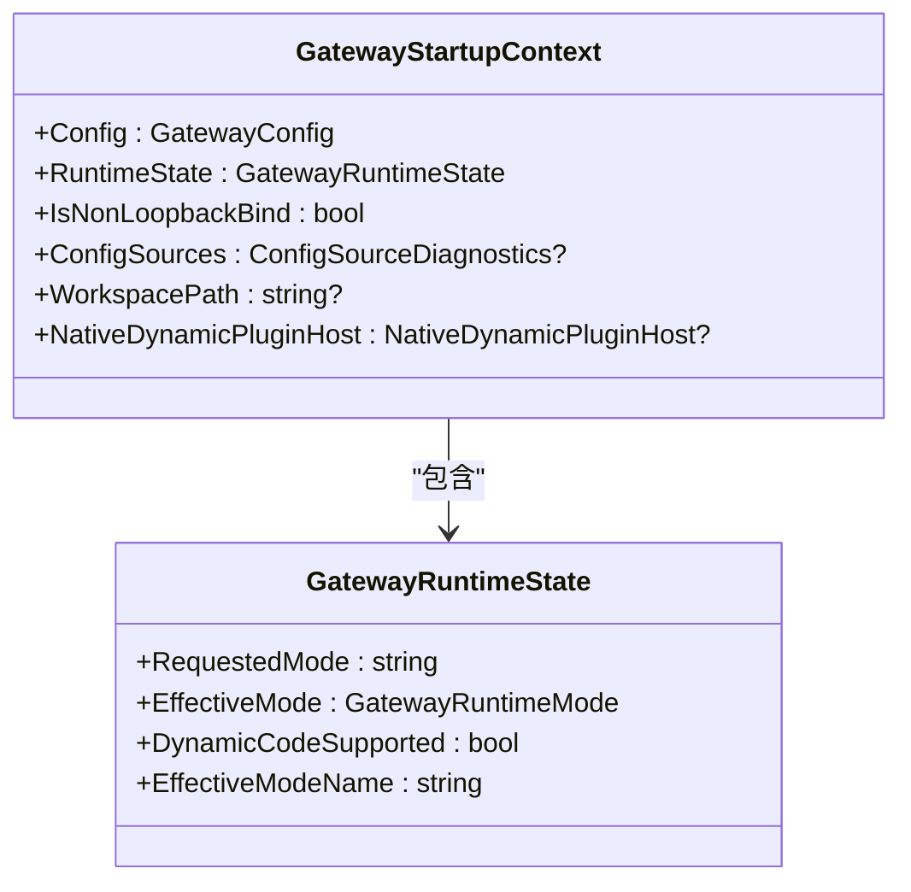
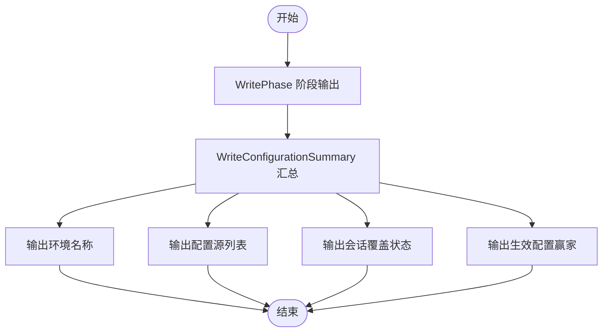
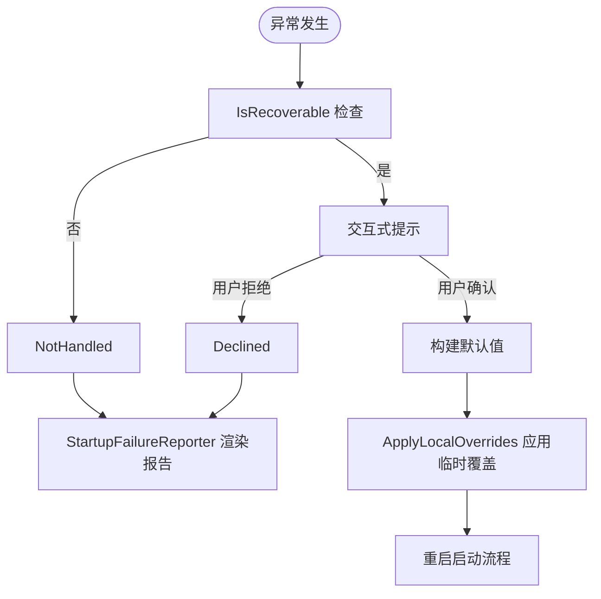
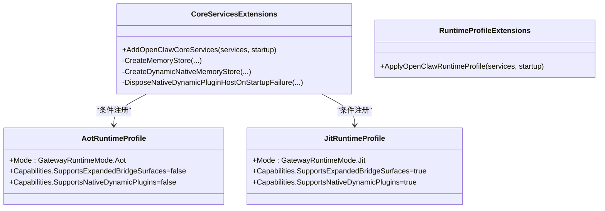
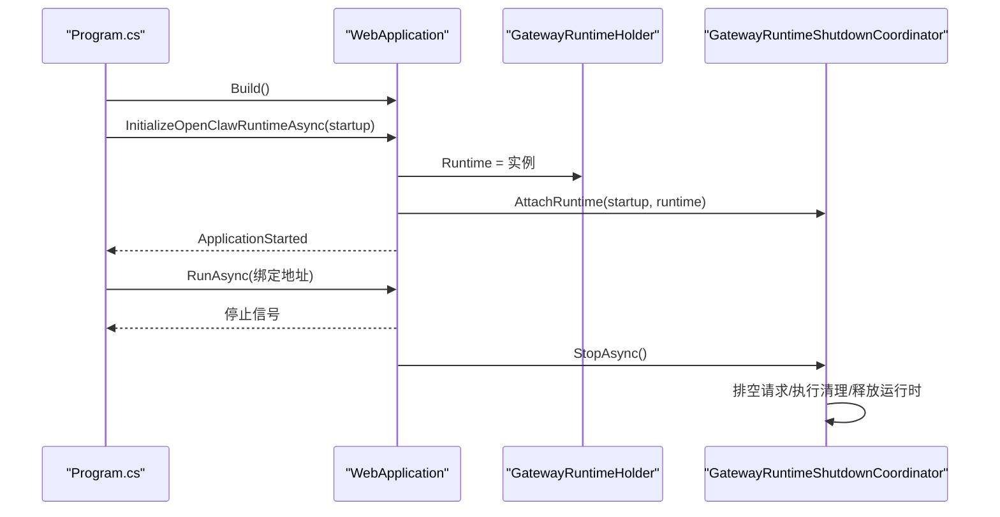
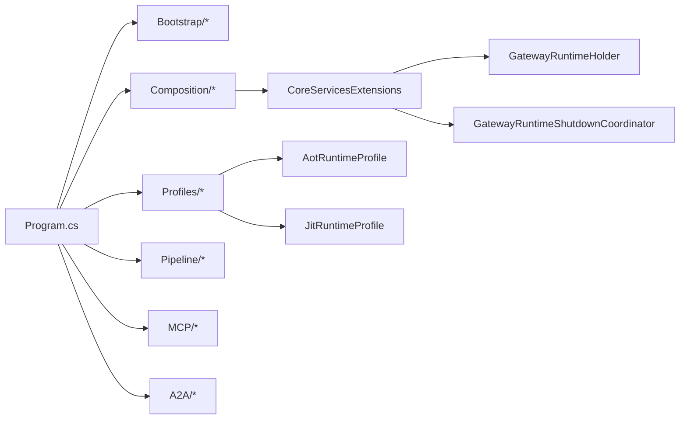

# 运行时初始化流程

<cite>
**本文引用的文件**
- [Program.cs](file://src/OpenClaw.Gateway/Program.cs)
- [GatewayStartupContext.cs](file://src/OpenClaw.Gateway/Bootstrap/GatewayStartupContext.cs)
- [CoreServicesExtensions.cs](file://src/OpenClaw.Gateway/Composition/CoreServicesExtensions.cs)
- [InteractiveStartupRecovery.cs](file://src/OpenClaw.Gateway/Bootstrap/InteractiveStartupRecovery.cs)
- [StartupConsoleCoordinator.cs](file://src/OpenClaw.Gateway/Bootstrap/StartupConsoleCoordinator.cs)
- [StartupFailureReporter.cs](file://src/OpenClaw.Gateway/Bootstrap/StartupFailureReporter.cs)
- [StartupRecoveryOutcome.cs](file://src/OpenClaw.Gateway/Bootstrap/StartupRecoveryOutcome.cs)
- [StartupRecoveryResult.cs](file://src/OpenClaw.Gateway/Bootstrap/StartupRecoveryResult.cs)
- [LocalStartupStateStore.cs](file://src/OpenClaw.Gateway/Bootstrap/LocalStartupStateStore.cs)
- [StartupJsonContext.cs](file://src/OpenClaw.Gateway/Bootstrap/StartupJsonContext.cs)
- [LocalStartupPostReadyActions.cs](file://src/OpenClaw.Gateway/Bootstrap/LocalStartupPostReadyActions.cs)
- [RuntimeProfileExtensions.cs](file://src/OpenClaw.Gateway/Profiles/RuntimeProfileExtensions.cs)
- [AotRuntimeProfile.cs](file://src/OpenClaw.Gateway/Profiles/AotRuntimeProfile.cs)
- [JitRuntimeProfile.cs](file://src/OpenClaw.Gateway/Profiles/JitRuntimeProfile.cs)
- [GatewayRuntimeShutdownCoordinator.cs](file://src/OpenClaw.Gateway/Pipeline/GatewayRuntimeShutdownCoordinator.cs)
- [GatewayRuntimeHolder.cs](file://src/OpenClaw.Gateway/Mcp/GatewayRuntimeHolder.cs)
- [RuntimeModels.cs](file://src/OpenClaw.Core/Models/RuntimeModels.cs)
- [SetupVerificationService.cs](file://src/OpenClaw.Core/Validation/SetupVerificationService.cs)
- [GatewayRuntimeLifecycleTests.cs](file://src/OpenClaw.Tests/GatewayRuntimeLifecycleTests.cs)
- [StartupConsoleCoordinatorTests.cs](file://src/OpenClaw.Tests/StartupConsoleCoordinatorTests.cs)
- [architecture-startup-refactor.md](file://docs/architecture-startup-refactor.md)
</cite>

## 目录
1. [简介](#简介)
2. [项目结构](#项目结构)
3. [核心组件](#核心组件)
4. [架构总览](#架构总览)
5. [详细组件分析](#详细组件分析)
6. [依赖关系分析](#依赖关系分析)
7. [性能考虑](#性能考虑)
8. [故障排查指南](#故障排查指南)
9. [结论](#结论)
10. [附录](#附录)

## 简介
本文件系统性梳理了 OpenClaw 网关的运行时初始化生命周期，覆盖从 GatewayStartupContext 初始化到服务注册完成的全过程。重点阐述 RuntimeInitializationExtensions（通过 CoreServicesExtensions 及相关扩展）中的服务注册与依赖注入配置，以及启动状态管理、控制台协调器、启动失败恢复机制。同时给出启动顺序控制、并行初始化优化、资源清理策略、调试方法、性能监控指标与故障诊断工具，并补充启动配置验证、环境检查与兼容性测试流程。

## 项目结构
启动流程位于网关应用入口 Program.cs，采用“分层”设计：
- Bootstrap：加载配置、解析运行时模式、早期退出处理（健康检查、医生模式）、非回环绑定安全加固
- Composition/Profiles：按运行时模式注册预构建服务，构建运行时对象，保留 Core/Agent 运行时模型作为 AOT/JIT 的权威来源
- Pipeline/Endpoints：转发头、CORS、WebSocket、工作线程与通道启动、关闭处理、路由映射

**图表来源**
- [Program.cs:42-124](file://src/OpenClaw.Gateway/Program.cs#L42-L124)
- [GatewayStartupContext.cs:6-15](file://src/OpenClaw.Gateway/Bootstrap/GatewayStartupContext.cs#L6-L15)
- [InteractiveStartupRecovery.cs:17-150](file://src/OpenClaw.Gateway/Bootstrap/InteractiveStartupRecovery.cs#L17-L150)
- [StartupConsoleCoordinator.cs:6-37](file://src/OpenClaw.Gateway/Bootstrap/StartupConsoleCoordinator.cs#L6-L37)
- [StartupFailureReporter.cs:5-76](file://src/OpenClaw.Gateway/Bootstrap/StartupFailureReporter.cs#L5-L76)
- [CoreServicesExtensions.cs:36-249](file://src/OpenClaw.Gateway/Composition/CoreServicesExtensions.cs#L36-L249)
- [RuntimeProfileExtensions.cs:8-21](file://src/OpenClaw.Gateway/Profiles/RuntimeProfileExtensions.cs#L8-L21)
- [AotRuntimeProfile.cs:7-21](file://src/OpenClaw.Gateway/Profiles/AotRuntimeProfile.cs#L7-L21)
- [JitRuntimeProfile.cs:7-21](file://src/OpenClaw.Gateway/Profiles/JitRuntimeProfile.cs#L7-L21)
- [GatewayRuntimeHolder.cs:10-20](file://src/OpenClaw.Gateway/Mcp/GatewayRuntimeHolder.cs#L10-L20)
- [GatewayRuntimeShutdownCoordinator.cs:8-115](file://src/OpenClaw.Gateway/Pipeline/GatewayRuntimeShutdownCoordinator.cs#L8-L115)

**章节来源**
- [architecture-startup-refactor.md:1-33](file://docs/architecture-startup-refactor.md#L1-L33)
- [Program.cs:42-124](file://src/OpenClaw.Gateway/Program.cs#L42-L124)

## 核心组件
- 启动上下文 GatewayStartupContext：承载 GatewayConfig、运行时状态、是否非回环绑定、配置源诊断、工作区路径、动态插件宿主等
- 控制台协调器 StartupConsoleCoordinator：输出启动阶段与配置摘要
- 失败报告 StartupFailureReporter：生成可操作的错误信息与修复建议
- 启动恢复 InteractiveStartupRecovery：快速启动与交互式恢复，支持端口冲突、存储权限、鉴权令牌、模型密钥等场景
- 核心服务注册 CoreServicesExtensions：集中注册内存、会话、工具执行、支付、可观测性、自动化、多模态、提示缓存等服务
- 运行时配置文件 RuntimeProfileExtensions：根据有效运行时模式（AOT/JIT）应用能力开关与服务配置
- 运行时持有者 GatewayRuntimeHolder：在容器构建后桥接 DI 与 GatewayAppRuntime
- 优雅停机 GatewayRuntimeShutdownCoordinator：在停机前排空请求、执行异步清理、释放运行时

**章节来源**
- [GatewayStartupContext.cs:6-15](file://src/OpenClaw.Gateway/Bootstrap/GatewayStartupContext.cs#L6-L15)
- [StartupConsoleCoordinator.cs:6-37](file://src/OpenClaw.Gateway/Bootstrap/StartupConsoleCoordinator.cs#L6-L37)
- [StartupFailureReporter.cs:5-76](file://src/OpenClaw.Gateway/Bootstrap/StartupFailureReporter.cs#L5-L76)
- [InteractiveStartupRecovery.cs:5-150](file://src/OpenClaw.Gateway/Bootstrap/InteractiveStartupRecovery.cs#L5-L150)
- [CoreServicesExtensions.cs:36-249](file://src/OpenClaw.Gateway/Composition/CoreServicesExtensions.cs#L36-L249)
- [RuntimeProfileExtensions.cs:8-21](file://src/OpenClaw.Gateway/Profiles/RuntimeProfileExtensions.cs#L8-L21)
- [GatewayRuntimeHolder.cs:10-20](file://src/OpenClaw.Gateway/Mcp/GatewayRuntimeHolder.cs#L10-L20)
- [GatewayRuntimeShutdownCoordinator.cs:8-115](file://src/OpenClaw.Gateway/Pipeline/GatewayRuntimeShutdownCoordinator.cs#L8-L115)

## 架构总览
下图展示启动主循环、引导、服务注册与运行时初始化的关键交互：

**图表来源**
- [Program.cs:42-98](file://src/OpenClaw.Gateway/Program.cs#L42-L98)
- [CoreServicesExtensions.cs:36-249](file://src/OpenClaw.Gateway/Composition/CoreServicesExtensions.cs#L36-L249)
- [RuntimeProfileExtensions.cs:8-21](file://src/OpenClaw.Gateway/Profiles/RuntimeProfileExtensions.cs#L8-L21)
- [GatewayRuntimeHolder.cs:10-20](file://src/OpenClaw.Gateway/Mcp/GatewayRuntimeHolder.cs#L10-L20)

## 详细组件分析

### 启动上下文与运行时状态
- GatewayStartupContext 聚合配置、运行时状态、非回环绑定标志、配置源诊断、工作区路径与动态插件宿主
- 运行时状态由 RuntimeModeResolver 基于配置与运行时特性计算，支持 AOT/JIT 模式选择与动态代码能力检测

**图表来源**
- [GatewayStartupContext.cs:6-15](file://src/OpenClaw.Gateway/Bootstrap/GatewayStartupContext.cs#L6-L15)
- [RuntimeModels.cs:20-59](file://src/OpenClaw.Core/Models/RuntimeModels.cs#L20-L59)

**章节来源**
- [GatewayStartupContext.cs:6-15](file://src/OpenClaw.Gateway/Bootstrap/GatewayStartupContext.cs#L6-L15)
- [RuntimeModels.cs:20-59](file://src/OpenClaw.Core/Models/RuntimeModels.cs#L20-L59)

### 控制台协调器与配置摘要
- StartupConsoleCoordinator 输出启动阶段与配置摘要，包括环境、配置源、会话覆盖与最终生效配置
- 测试用例验证其包含环境来源与会话覆盖信息

**图表来源**
- [StartupConsoleCoordinator.cs:6-37](file://src/OpenClaw.Gateway/Bootstrap/StartupConsoleCoordinator.cs#L6-L37)
- [StartupConsoleCoordinatorTests.cs:11-33](file://src/OpenClaw.Tests/StartupConsoleCoordinatorTests.cs#L11-L33)

**章节来源**
- [StartupConsoleCoordinator.cs:6-37](file://src/OpenClaw.Gateway/Bootstrap/StartupConsoleCoordinator.cs#L6-L37)
- [StartupConsoleCoordinatorTests.cs:11-33](file://src/OpenClaw.Tests/StartupConsoleCoordinatorTests.cs#L11-L33)

### 启动失败恢复机制
- InteractiveStartupRecovery 提供快速启动与交互式恢复，支持端口占用、存储权限、鉴权令牌缺失、模型密钥/端点缺失等场景
- StartupFailureReporter 将异常分析为可读报告，包含标题、摘要、详情与建议修复项
- StartupRecoveryOutcome/Result 定义恢复结果枚举（未处理/已恢复/拒绝）

**图表来源**
- [InteractiveStartupRecovery.cs:72-150](file://src/OpenClaw.Gateway/Bootstrap/InteractiveStartupRecovery.cs#L72-L150)
- [StartupFailureReporter.cs:20-76](file://src/OpenClaw.Gateway/Bootstrap/StartupFailureReporter.cs#L20-L76)
- [StartupRecoveryOutcome.cs:3-10](file://src/OpenClaw.Gateway/Bootstrap/StartupRecoveryOutcome.cs#L3-L10)
- [StartupRecoveryResult.cs:3-8](file://src/OpenClaw.Gateway/Bootstrap/StartupRecoveryResult.cs#L3-L8)

**章节来源**
- [InteractiveStartupRecovery.cs:5-150](file://src/OpenClaw.Gateway/Bootstrap/InteractiveStartupRecovery.cs#L5-L150)
- [StartupFailureReporter.cs:5-76](file://src/OpenClaw.Gateway/Bootstrap/StartupFailureReporter.cs#L5-L76)
- [StartupRecoveryOutcome.cs:3-10](file://src/OpenClaw.Gateway/Bootstrap/StartupRecoveryOutcome.cs#L3-L10)
- [StartupRecoveryResult.cs:3-8](file://src/OpenClaw.Gateway/Bootstrap/StartupRecoveryResult.cs#L3-L8)

### 服务注册与依赖注入配置
- CoreServicesExtensions 统一注册核心领域服务：内存、会话、工具执行、支付、可观测性、自动化、多模态、提示缓存、模型选择、速率限制、心跳、脉搏、保留清理、消息管线、定时任务等
- 动态原生内存提供程序在需要时通过 NativeDynamicPluginHost 加载，失败时进行资源清理
- 运行时配置文件根据有效模式（AOT/JIT）启用不同能力集

**图表来源**
- [CoreServicesExtensions.cs:36-249](file://src/OpenClaw.Gateway/Composition/CoreServicesExtensions.cs#L36-L249)
- [RuntimeProfileExtensions.cs:8-21](file://src/OpenClaw.Gateway/Profiles/RuntimeProfileExtensions.cs#L8-L21)
- [AotRuntimeProfile.cs:7-21](file://src/OpenClaw.Gateway/Profiles/AotRuntimeProfile.cs#L7-L21)
- [JitRuntimeProfile.cs:7-21](file://src/OpenClaw.Gateway/Profiles/JitRuntimeProfile.cs#L7-L21)

**章节来源**
- [CoreServicesExtensions.cs:36-249](file://src/OpenClaw.Gateway/Composition/CoreServicesExtensions.cs#L36-L249)
- [RuntimeProfileExtensions.cs:8-21](file://src/OpenClaw.Gateway/Profiles/RuntimeProfileExtensions.cs#L8-L21)
- [AotRuntimeProfile.cs:7-21](file://src/OpenClaw.Gateway/Profiles/AotRuntimeProfile.cs#L7-L21)
- [JitRuntimeProfile.cs:7-21](file://src/OpenClaw.Gateway/Profiles/JitRuntimeProfile.cs#L7-L21)

### 运行时初始化与生命周期
- Program.cs 主循环负责：加载配置、构建服务、初始化运行时、映射管道与端点、启动监听
- 异常捕获在未标记 started 前触发恢复逻辑；成功启动后注册 ApplicationStarted 标记
- GatewayRuntimeHolder 在运行时初始化后设置运行时实例，供后续组件使用
- GatewayRuntimeShutdownCoordinator 在停机时进行请求排空、异步清理与运行时释放

**图表来源**
- [Program.cs:80-98](file://src/OpenClaw.Gateway/Program.cs#L80-L98)
- [GatewayRuntimeHolder.cs:10-20](file://src/OpenClaw.Gateway/Mcp/GatewayRuntimeHolder.cs#L10-L20)
- [GatewayRuntimeShutdownCoordinator.cs:22-82](file://src/OpenClaw.Gateway/Pipeline/GatewayRuntimeShutdownCoordinator.cs#L22-L82)

**章节来源**
- [Program.cs:42-124](file://src/OpenClaw.Gateway/Program.cs#L42-L124)
- [GatewayRuntimeHolder.cs:10-20](file://src/OpenClaw.Gateway/Mcp/GatewayRuntimeHolder.cs#L10-L20)
- [GatewayRuntimeShutdownCoordinator.cs:8-115](file://src/OpenClaw.Gateway/Pipeline/GatewayRuntimeShutdownCoordinator.cs#L8-L115)

### 启动顺序控制与并行初始化优化
- 分层设计确保顺序可控：Bootstrap → Composition/Profiles → Pipeline/Endpoints
- 服务注册集中在 CoreServicesExtensions，避免跨模块重复与竞态
- 并行优化体现在：
  - 使用 TryAddSingleton 与单例注册减少重复实例
  - 批量注册工具与后端服务，降低 DI 构造成本
  - 宿主服务（如内存保留清理、脉搏、提示缓存预热）以后台任务形式并行运行

**章节来源**
- [CoreServicesExtensions.cs:36-249](file://src/OpenClaw.Gateway/Composition/CoreServicesExtensions.cs#L36-L249)
- [Program.cs:64-98](file://src/OpenClaw.Gateway/Program.cs#L64-L98)

### 资源清理策略
- 动态原生内存提供程序加载失败时，调用 DisposeNativeDynamicPluginHostOnStartupFailure 进行清理
- 优雅停机：GatewayRuntimeShutdownCoordinator 在停机前等待所有会话锁释放、执行异步清理、释放运行时

**章节来源**
- [CoreServicesExtensions.cs:382-392](file://src/OpenClaw.Gateway/Composition/CoreServicesExtensions.cs#L382-L392)
- [GatewayRuntimeShutdownCoordinator.cs:84-115](file://src/OpenClaw.Gateway/Pipeline/GatewayRuntimeShutdownCoordinator.cs#L84-L115)

## 依赖关系分析
- Program.cs 依赖 Bootstrap、Composition、Profiles、Pipeline、MCP、A2A 等模块
- CoreServicesExtensions 依赖 Core/Agent/Channels/Payments 等子域
- 运行时配置文件依赖运行时状态决定能力开关
- 优雅停机依赖运行时持有的会话锁集合

**图表来源**
- [Program.cs:1-12](file://src/OpenClaw.Gateway/Program.cs#L1-L12)
- [CoreServicesExtensions.cs:36-249](file://src/OpenClaw.Gateway/Composition/CoreServicesExtensions.cs#L36-L249)
- [RuntimeProfileExtensions.cs:8-21](file://src/OpenClaw.Gateway/Profiles/RuntimeProfileExtensions.cs#L8-L21)
- [GatewayRuntimeHolder.cs:10-20](file://src/OpenClaw.Gateway/Mcp/GatewayRuntimeHolder.cs#L10-L20)
- [GatewayRuntimeShutdownCoordinator.cs:8-115](file://src/OpenClaw.Gateway/Pipeline/GatewayRuntimeShutdownCoordinator.cs#L8-L115)

**章节来源**
- [Program.cs:1-12](file://src/OpenClaw.Gateway/Program.cs#L1-L12)
- [CoreServicesExtensions.cs:36-249](file://src/OpenClaw.Gateway/Composition/CoreServicesExtensions.cs#L36-L249)
- [RuntimeProfileExtensions.cs:8-21](file://src/OpenClaw.Gateway/Profiles/RuntimeProfileExtensions.cs#L8-L21)
- [GatewayRuntimeHolder.cs:10-20](file://src/OpenClaw.Gateway/Mcp/GatewayRuntimeHolder.cs#L10-L20)
- [GatewayRuntimeShutdownCoordinator.cs:8-115](file://src/OpenClaw.Gateway/Pipeline/GatewayRuntimeShutdownCoordinator.cs#L8-L115)

## 性能考虑
- 启动阶段尽量使用单例与延迟初始化，避免不必要的 I/O
- 后台任务（脉搏、保留清理、提示缓存预热）在独立线程中运行，不阻塞主监听
- 动态原生插件仅在需要时加载，失败立即清理，防止资源泄漏
- 观测性指标（RuntimeMetrics）贯穿执行链路，便于定位瓶颈

[本节为通用指导，无需特定文件引用]

## 故障排查指南
- 启动失败报告：使用 StartupFailureReporter 获取标题、摘要、详情与建议修复项
- 医生模式：SetupVerificationService 提供静态配置校验与运行时模式检查，输出分类化的诊断项
- 快速启动/恢复：InteractiveStartupRecovery 支持在交互式终端中应用最小本地配置并重试
- 本地状态持久化：LocalStartupStateStore 与 StartupJsonContext 保证状态原子写入
- 停机排空：GatewayRuntimeShutdownCoordinator 等待会话锁释放，避免请求中断

**章节来源**
- [StartupFailureReporter.cs:5-76](file://src/OpenClaw.Gateway/Bootstrap/StartupFailureReporter.cs#L5-L76)
- [SetupVerificationService.cs:288-356](file://src/OpenClaw.Core/Validation/SetupVerificationService.cs#L288-L356)
- [InteractiveStartupRecovery.cs:17-150](file://src/OpenClaw.Gateway/Bootstrap/InteractiveStartupRecovery.cs#L17-L150)
- [LocalStartupStateStore.cs:5-26](file://src/OpenClaw.Gateway/Bootstrap/LocalStartupStateStore.cs#L5-L26)
- [StartupJsonContext.cs:5-8](file://src/OpenClaw.Gateway/Bootstrap/StartupJsonContext.cs#L5-L8)
- [GatewayRuntimeShutdownCoordinator.cs:84-115](file://src/OpenClaw.Gateway/Pipeline/GatewayRuntimeShutdownCoordinator.cs#L84-L115)

## 结论
该启动流程通过分层设计与集中服务注册，实现了清晰的启动顺序、可控的运行时能力与完善的失败恢复机制。结合控制台协调器与可观测性，开发者可以高效地调试与优化启动性能，并在生产环境中实现安全、稳定的运行时生命周期管理。

[本节为总结，无需特定文件引用]

## 附录

### 启动流程调试方法
- 使用 StartupConsoleCoordinator 输出阶段与配置摘要，核对配置源与生效项
- 在 Doctor 模式下运行 SetupVerificationService，获取静态配置与运行时模式诊断
- 通过 StartupFailureReporter 获取可操作的错误与修复建议
- 使用 LocalStartupPostReadyActions 保存本地配置示例，便于后续复现与对比

**章节来源**
- [StartupConsoleCoordinator.cs:6-37](file://src/OpenClaw.Gateway/Bootstrap/StartupConsoleCoordinator.cs#L6-L37)
- [SetupVerificationService.cs:288-356](file://src/OpenClaw.Core/Validation/SetupVerificationService.cs#L288-L356)
- [StartupFailureReporter.cs:5-76](file://src/OpenClaw.Gateway/Bootstrap/StartupFailureReporter.cs#L5-L76)
- [LocalStartupPostReadyActions.cs:86-95](file://src/OpenClaw.Gateway/Bootstrap/LocalStartupPostReadyActions.cs#L86-L95)

### 性能监控指标
- RuntimeMetrics：贯穿内存、工具执行、会话管理等关键路径
- 后台任务指标：脉搏、保留清理、提示缓存预热的执行时间与频率
- 观测性集成：AddOpenClawObservability 提供统一指标与日志

**章节来源**
- [CoreServicesExtensions.cs:92-92](file://src/OpenClaw.Gateway/Composition/CoreServicesExtensions.cs#L92-L92)
- [Program.cs:66-66](file://src/OpenClaw.Gateway/Program.cs#L66-L66)

### 启动配置验证与兼容性测试
- 静态配置验证：SetupVerificationService 对配置进行分类校验，输出通过/失败项与下一步建议
- 运行时模式兼容：RuntimeModeResolver 基于动态代码支持与配置决定 AOT/JIT
- 测试用例覆盖：GatewayRuntimeLifecycleTests、StartupConsoleCoordinatorTests 等验证关键行为

**章节来源**
- [SetupVerificationService.cs:288-356](file://src/OpenClaw.Core/Validation/SetupVerificationService.cs#L288-L356)
- [RuntimeModels.cs:29-59](file://src/OpenClaw.Core/Models/RuntimeModels.cs#L29-L59)
- [GatewayRuntimeLifecycleTests.cs:31-44](file://src/OpenClaw.Tests/GatewayRuntimeLifecycleTests.cs#L31-L44)
- [StartupConsoleCoordinatorTests.cs:11-33](file://src/OpenClaw.Tests/StartupConsoleCoordinatorTests.cs#L11-L33)