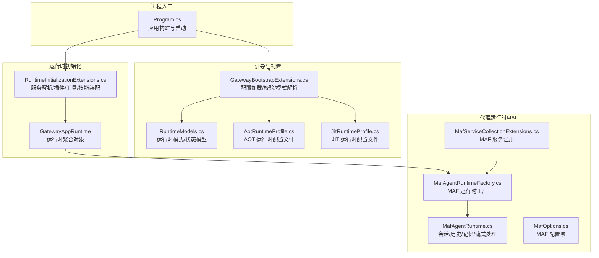
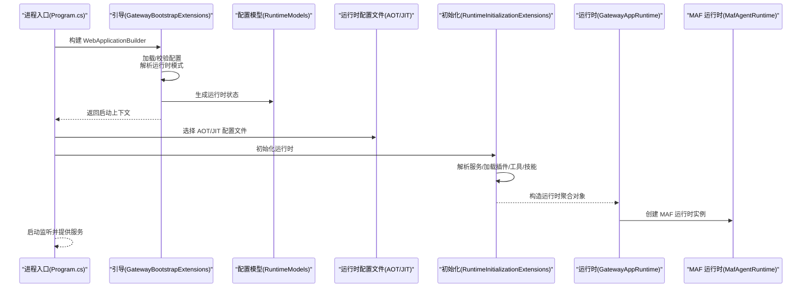
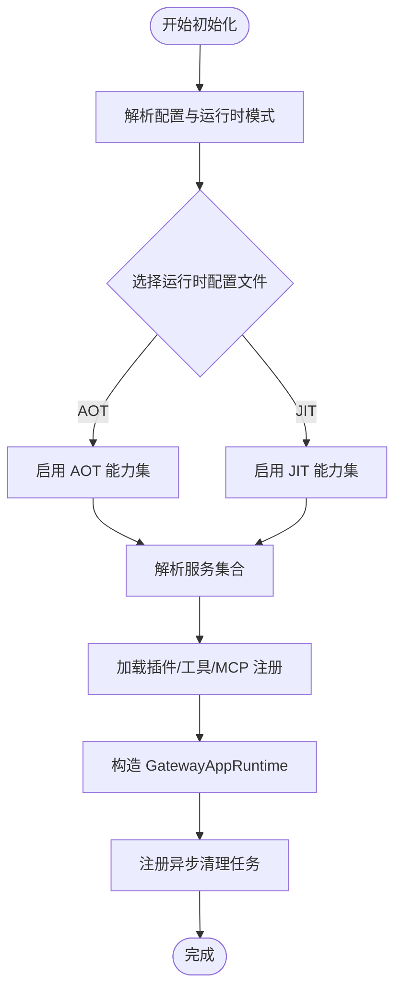
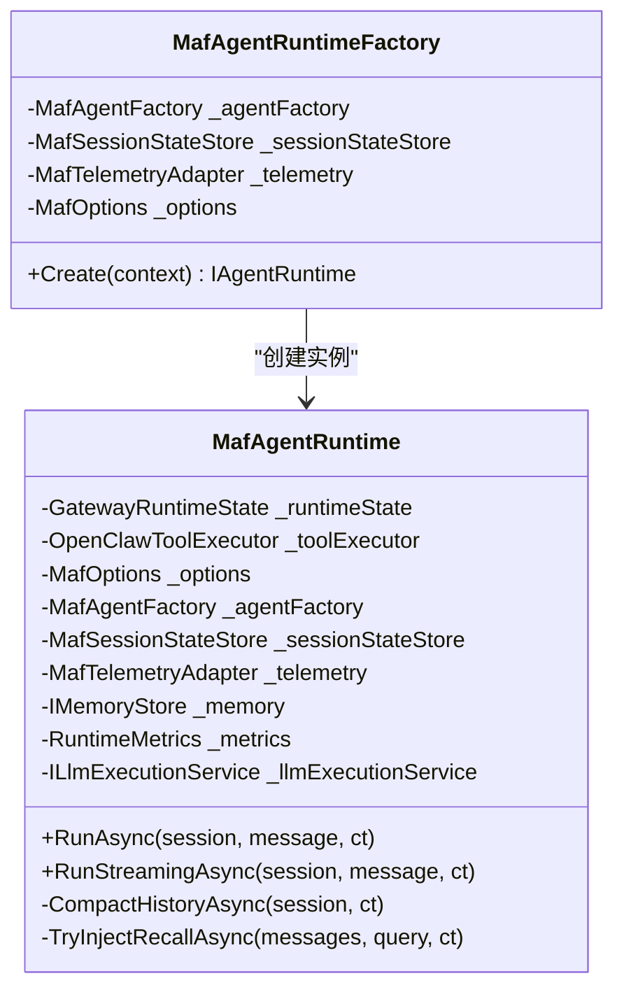
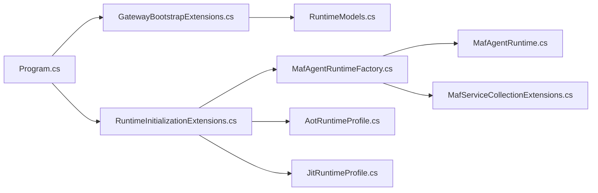

# 运行时架构

<cite>
**本文引用的文件**
- [Program.cs](file://src/OpenClaw.Gateway/Program.cs)
- [GatewayBootstrapExtensions.cs](file://src/OpenClaw.Gateway/Bootstrap/GatewayBootstrapExtensions.cs)
- [RuntimeInitializationExtensions.cs](file://src/OpenClaw.Gateway/Composition/RuntimeInitializationExtensions.cs)
- [RuntimeModels.cs](file://src/OpenClaw.Core/Models/RuntimeModels.cs)
- [AotRuntimeProfile.cs](file://src/OpenClaw.Gateway/Profiles/AotRuntimeProfile.cs)
- [JitRuntimeProfile.cs](file://src/OpenClaw.Gateway/Profiles/JitRuntimeProfile.cs)
- [MafAgentRuntime.cs](file://src/OpenClaw.Agent/MafAgentRuntime.cs)
- [MafAgentRuntimeFactory.cs](file://src/OpenClaw.Agent/MafAgentRuntimeFactory.cs)
- [MafOptions.cs](file://src/OpenClaw.Agent/MafOptions.cs)
- [MafServiceCollectionExtensions.cs](file://src/OpenClaw.Agent/MafServiceCollectionExtensions.cs)
- [COMPATIBILITY.md](file://COMPATIBILITY.md)
</cite>

## 目录
1. [引言](#引言)
2. [项目结构](#项目结构)
3. [核心组件](#核心组件)
4. [架构总览](#架构总览)
5. [详细组件分析](#详细组件分析)
6. [依赖关系分析](#依赖关系分析)
7. [性能考虑](#性能考虑)
8. [故障排查指南](#故障排查指南)
9. [结论](#结论)
10. [附录](#附录)

## 引言
本文件系统性阐述 OpenClaw.NET 的运行时架构与实现，重点覆盖以下主题：
- AOT（Ahead-of-Time）与 JIT（Just-in-Time）两种运行模式的区别、适用场景与性能特征
- 运行时配置文件的作用与管理机制
- 运行时初始化流程、服务注册与依赖注入容器配置
- 运行时性能优化策略、内存管理与资源分配
- 运行时模式选择指南与配置示例
- 运行时监控、调试支持与故障诊断方法

## 项目结构
OpenClaw.NET 的运行时由“网关启动”“引导与配置加载”“运行时初始化与装配”“代理运行时（MAF）”四层构成，形成从进程入口到业务执行的完整链路。

图示来源
- [Program.cs:1-124](file://src/OpenClaw.Gateway/Program.cs#L1-L124)
- [GatewayBootstrapExtensions.cs:18-135](file://src/OpenClaw.Gateway/Bootstrap/GatewayBootstrapExtensions.cs#L18-L135)
- [RuntimeModels.cs:29-59](file://src/OpenClaw.Core/Models/RuntimeModels.cs#L29-L59)
- [AotRuntimeProfile.cs:7-21](file://src/OpenClaw.Gateway/Profiles/AotRuntimeProfile.cs#L7-L21)
- [JitRuntimeProfile.cs:7-21](file://src/OpenClaw.Gateway/Profiles/JitRuntimeProfile.cs#L7-L21)
- [RuntimeInitializationExtensions.cs:35-242](file://src/OpenClaw.Gateway/Composition/RuntimeInitializationExtensions.cs#L35-L242)
- [MafAgentRuntime.cs:17-118](file://src/OpenClaw.Agent/MafAgentRuntime.cs#L17-L118)
- [MafAgentRuntimeFactory.cs:9-41](file://src/OpenClaw.Agent/MafAgentRuntimeFactory.cs#L9-L41)
- [MafOptions.cs:3-35](file://src/OpenClaw.Agent/MafOptions.cs#L3-L35)
- [MafServiceCollectionExtensions.cs:7-20](file://src/OpenClaw.Agent/MafServiceCollectionExtensions.cs#L7-L20)

章节来源
- [Program.cs:1-124](file://src/OpenClaw.Gateway/Program.cs#L1-L124)
- [GatewayBootstrapExtensions.cs:18-135](file://src/OpenClaw.Gateway/Bootstrap/GatewayBootstrapExtensions.cs#L18-L135)
- [RuntimeModels.cs:29-59](file://src/OpenClaw.Core/Models/RuntimeModels.cs#L29-L59)
- [AotRuntimeProfile.cs:7-21](file://src/OpenClaw.Gateway/Profiles/AotRuntimeProfile.cs#L7-L21)
- [JitRuntimeProfile.cs:7-21](file://src/OpenClaw.Gateway/Profiles/JitRuntimeProfile.cs#L7-L21)
- [RuntimeInitializationExtensions.cs:35-242](file://src/OpenClaw.Gateway/Composition/RuntimeInitializationExtensions.cs#L35-L242)
- [MafAgentRuntime.cs:17-118](file://src/OpenClaw.Agent/MafAgentRuntime.cs#L17-L118)
- [MafAgentRuntimeFactory.cs:9-41](file://src/OpenClaw.Agent/MafAgentRuntimeFactory.cs#L9-L41)
- [MafOptions.cs:3-35](file://src/OpenClaw.Agent/MafOptions.cs#L3-L35)
- [MafServiceCollectionExtensions.cs:7-20](file://src/OpenClaw.Agent/MafServiceCollectionExtensions.cs#L7-L20)

## 核心组件
- 运行时模式与状态
  - 模型定义：运行时模式枚举、配置结构、运行时状态与模式解析器
  - 解析逻辑：根据请求模式与动态代码能力确定有效模式，并在不满足条件时抛出异常
- 引导与配置
  - 配置加载：合并多源配置（文件、环境变量、命令行），执行工具覆盖、路径归一化、密钥解析
  - 校验与诊断：非回环绑定安全校验、可选特性兼容性检查、健康检查与医生模式
- 运行时初始化
  - 服务解析：解析运行时所需服务集合，记录浏览器可用性提示与审批队列指标
  - 插件与工具：加载内置与插件工具，注册 MCP 工具，建立默认 LLM 提供者
  - 技能与钩子：加载技能、创建钩子、装配中间件管道、启动自动化与事件桥接
  - 聚合运行时：构造 GatewayAppRuntime，注册清理任务，按运行时配置文件启用扩展能力
- 代理运行时（MAF）
  - 会话与历史：支持历史压缩/修剪、记忆检索注入、令牌预算控制
  - 执行与流式：同步与流式对话，工具调用收集与会话持久化
  - 工具与技能：工具声明适配、技能热加载、系统事件注入

章节来源
- [RuntimeModels.cs:5-27](file://src/OpenClaw.Core/Models/RuntimeModels.cs#L5-L27)
- [RuntimeModels.cs:29-59](file://src/OpenClaw.Core/Models/RuntimeModels.cs#L29-L59)
- [GatewayBootstrapExtensions.cs:143-159](file://src/OpenClaw.Gateway/Bootstrap/GatewayBootstrapExtensions.cs#L143-L159)
- [GatewayBootstrapExtensions.cs:161-171](file://src/OpenClaw.Gateway/Bootstrap/GatewayBootstrapExtensions.cs#L161-L171)
- [RuntimeInitializationExtensions.cs:35-242](file://src/OpenClaw.Gateway/Composition/RuntimeInitializationExtensions.cs#L35-L242)
- [MafAgentRuntime.cs:17-118](file://src/OpenClaw.Agent/MafAgentRuntime.cs#L17-L118)

## 架构总览
下图展示从进程启动到运行时就绪的关键交互：

图示来源
- [Program.cs:48-98](file://src/OpenClaw.Gateway/Program.cs#L48-L98)
- [GatewayBootstrapExtensions.cs:18-135](file://src/OpenClaw.Gateway/Bootstrap/GatewayBootstrapExtensions.cs#L18-L135)
- [RuntimeModels.cs:29-59](file://src/OpenClaw.Core/Models/RuntimeModels.cs#L29-L59)
- [AotRuntimeProfile.cs:7-21](file://src/OpenClaw.Gateway/Profiles/AotRuntimeProfile.cs#L7-L21)
- [JitRuntimeProfile.cs:7-21](file://src/OpenClaw.Gateway/Profiles/JitRuntimeProfile.cs#L7-L21)
- [RuntimeInitializationExtensions.cs:35-242](file://src/OpenClaw.Gateway/Composition/RuntimeInitializationExtensions.cs#L35-L242)
- [MafAgentRuntime.cs:17-118](file://src/OpenClaw.Agent/MafAgentRuntime.cs#L17-L118)

## 详细组件分析

### AOT 与 JIT 运行模式对比
- 模式解析
  - 支持 auto/aot/jit；当请求 jit 但不支持动态代码时抛出异常
  - 默认策略：有动态代码则优先 JIT，否则强制 AOT
- 能力差异
  - AOT：不支持扩展桥面与原生动态插件
  - JIT：支持扩展桥面与原生动态插件
- 兼容性定位
  - AOT 作为严格低内存兼容路径，JIT 作为更广兼容路径
- 选择建议
  - 生产部署优先 AOT；需要动态插件或扩展能力时选择 JIT

章节来源
- [RuntimeModels.cs:29-59](file://src/OpenClaw.Core/Models/RuntimeModels.cs#L29-L59)
- [AotRuntimeProfile.cs:11-13](file://src/OpenClaw.Gateway/Profiles/AotRuntimeProfile.cs#L11-L13)
- [JitRuntimeProfile.cs:11-13](file://src/OpenClaw.Gateway/Profiles/JitRuntimeProfile.cs#L11-L13)
- [COMPATIBILITY.md:1-9](file://COMPATIBILITY.md#L1-L9)

### 运行时配置文件与管理机制
- 配置加载与合并
  - 多源配置：JSON 文件、环境变量、命令行参数
  - 工具覆盖：允许对工具路径等进行覆盖
  - 路径归一化：展开相对路径与用户目录
  - 密钥解析：支持 env/raw 引用
- 安全与诊断
  - 非回环绑定必须设置鉴权令牌
  - 医生模式与健康检查：用于诊断与自检
  - 可选特性兼容性检查：如 OpenSandbox 编译开关
- 运行时模式与编排器
  - 运行时模式：auto/aot/jit
  - 编排器：native/maf（当前 MAF 为默认）

章节来源
- [GatewayBootstrapExtensions.cs:143-159](file://src/OpenClaw.Gateway/Bootstrap/GatewayBootstrapExtensions.cs#L143-L159)
- [GatewayBootstrapExtensions.cs:161-171](file://src/OpenClaw.Gateway/Bootstrap/GatewayBootstrapExtensions.cs#L161-L171)
- [GatewayBootstrapExtensions.cs:173-217](file://src/OpenClaw.Gateway/Bootstrap/GatewayBootstrapExtensions.cs#L173-L217)
- [GatewayBootstrapExtensions.cs:219-252](file://src/OpenClaw.Gateway/Bootstrap/GatewayBootstrapExtensions.cs#L219-L252)
- [GatewayBootstrapExtensions.cs:254-400](file://src/OpenClaw.Gateway/Bootstrap/GatewayBootstrapExtensions.cs#L254-L400)
- [RuntimeModels.cs:11-18](file://src/OpenClaw.Core/Models/RuntimeModels.cs#L11-L18)

### 运行时初始化流程与服务注册
- 初始化阶段
  - 应用构建后进入引导，解析配置与运行时模式
  - 依据运行时配置文件选择 AOT/JIT 能力集
  - 解析服务集合，记录浏览器可用性与审批队列指标
  - 加载插件与工具，注册 MCP 工具，建立默认 LLM 提供者
  - 装配技能、钩子、中间件管道，启动自动化与事件桥接
  - 构造 GatewayAppRuntime 并注册异步清理任务
- 依赖注入容器
  - MAF 服务注册：MAF 选项、遥测、会话存储、工厂、运行时工厂
  - 运行时工厂：根据上下文创建 MAF 运行时实例

图示来源
- [Program.cs:74-98](file://src/OpenClaw.Gateway/Program.cs#L74-L98)
- [RuntimeInitializationExtensions.cs:35-242](file://src/OpenClaw.Gateway/Composition/RuntimeInitializationExtensions.cs#L35-L242)
- [MafServiceCollectionExtensions.cs:7-20](file://src/OpenClaw.Agent/MafServiceCollectionExtensions.cs#L7-L20)

章节来源
- [Program.cs:74-98](file://src/OpenClaw.Gateway/Program.cs#L74-L98)
- [RuntimeInitializationExtensions.cs:35-242](file://src/OpenClaw.Gateway/Composition/RuntimeInitializationExtensions.cs#L35-L242)
- [MafServiceCollectionExtensions.cs:7-20](file://src/OpenClaw.Agent/MafServiceCollectionExtensions.cs#L7-L20)

### MAF 代理运行时（会话/历史/记忆/流式）
- 关键职责
  - 会话状态管理：加载/保存 AgentSession，维护历史回合
  - 历史压缩与修剪：基于阈值与保留策略进行压缩或简单修剪
  - 记忆检索注入：按查询与前缀检索笔记并插入消息列表
  - 令牌预算与合同限制：会话级令牌上限与合同预算检查
  - 流式与非流式对话：同步响应与流式增量文本输出
  - 工具与技能：工具声明适配、技能热加载、系统事件注入
- 并发与线程安全
  - 技能列表与工具列表使用锁保护，避免并发修改
- 错误处理
  - 模型选择失败、LLM 执行异常等均记录指标并返回友好错误信息

图示来源
- [MafAgentRuntime.cs:17-118](file://src/OpenClaw.Agent/MafAgentRuntime.cs#L17-L118)
- [MafAgentRuntimeFactory.cs:9-41](file://src/OpenClaw.Agent/MafAgentRuntimeFactory.cs#L9-L41)

章节来源
- [MafAgentRuntime.cs:17-118](file://src/OpenClaw.Agent/MafAgentRuntime.cs#L17-L118)
- [MafAgentRuntime.cs:203-337](file://src/OpenClaw.Agent/MafAgentRuntime.cs#L203-L337)
- [MafAgentRuntime.cs:339-423](file://src/OpenClaw.Agent/MafAgentRuntime.cs#L339-L423)
- [MafAgentRuntime.cs:684-764](file://src/OpenClaw.Agent/MafAgentRuntime.cs#L684-L764)
- [MafAgentRuntime.cs:625-682](file://src/OpenClaw.Agent/MafAgentRuntime.cs#L625-L682)

### MAF 配置与服务注册
- MAF 选项
  - 支持流式、A2A 端点、会话侧车路径、技能清单等
- 服务注册
  - 将 MAF 选项、遥测、会话存储、工厂与运行时工厂注册到容器
  - 自动从配置节读取并兼容旧节名

章节来源
- [MafOptions.cs:3-35](file://src/OpenClaw.Agent/MafOptions.cs#L3-L35)
- [MafServiceCollectionExtensions.cs:7-20](file://src/OpenClaw.Agent/MafServiceCollectionExtensions.cs#L7-L20)
- [MafServiceCollectionExtensions.cs:22-105](file://src/OpenClaw.Agent/MafServiceCollectionExtensions.cs#L22-L105)

## 依赖关系分析
- 组件耦合
  - Program 通过引导扩展加载配置并解析运行时模式
  - 初始化扩展负责服务解析、插件/工具/技能装配与运行时聚合
  - MAF 运行时工厂依赖容器中的工厂、存储、遥测与选项
- 运行时配置文件
  - AOT/JIT 配置文件仅影响能力集，不影响核心初始化流程
- 外部依赖
  - LLM 提供者注册与默认标记、MCP 工具注册、浏览器工具可用性评估

图示来源
- [Program.cs:74-98](file://src/OpenClaw.Gateway/Program.cs#L74-L98)
- [GatewayBootstrapExtensions.cs:18-135](file://src/OpenClaw.Gateway/Bootstrap/GatewayBootstrapExtensions.cs#L18-L135)
- [RuntimeInitializationExtensions.cs:35-242](file://src/OpenClaw.Gateway/Composition/RuntimeInitializationExtensions.cs#L35-L242)
- [MafAgentRuntimeFactory.cs:9-41](file://src/OpenClaw.Agent/MafAgentRuntimeFactory.cs#L9-L41)
- [MafServiceCollectionExtensions.cs:7-20](file://src/OpenClaw.Agent/MafServiceCollectionExtensions.cs#L7-L20)
- [AotRuntimeProfile.cs:7-21](file://src/OpenClaw.Gateway/Profiles/AotRuntimeProfile.cs#L7-L21)
- [JitRuntimeProfile.cs:7-21](file://src/OpenClaw.Gateway/Profiles/JitRuntimeProfile.cs#L7-L21)

章节来源
- [Program.cs:74-98](file://src/OpenClaw.Gateway/Program.cs#L74-L98)
- [GatewayBootstrapExtensions.cs:18-135](file://src/OpenClaw.Gateway/Bootstrap/GatewayBootstrapExtensions.cs#L18-L135)
- [RuntimeInitializationExtensions.cs:35-242](file://src/OpenClaw.Gateway/Composition/RuntimeInitializationExtensions.cs#L35-L242)

## 性能考虑
- 历史压缩
  - 当历史长度超过阈值且保留最近若干轮时，对早期对话进行摘要压缩，降低上下文开销
- 记忆检索
  - 按最大条数与字符上限注入相关记忆，避免无界增长
- 令牌预算与合同限制
  - 会话级令牌上限与合同预算检查，防止超支
- 流式处理
  - 流式对话使用有界通道缓冲，平衡延迟与吞吐
- 运行时模式
  - AOT 更强调低内存占用与稳定性；JIT 在动态能力与扩展性上更灵活

章节来源
- [MafAgentRuntime.cs:684-764](file://src/OpenClaw.Agent/MafAgentRuntime.cs#L684-L764)
- [MafAgentRuntime.cs:625-682](file://src/OpenClaw.Agent/MafAgentRuntime.cs#L625-L682)
- [MafAgentRuntime.cs:339-423](file://src/OpenClaw.Agent/MafAgentRuntime.cs#L339-L423)
- [RuntimeModels.cs:29-59](file://src/OpenClaw.Core/Models/RuntimeModels.cs#L29-L59)

## 故障排查指南
- 启动失败与恢复
  - 非回环绑定未设置鉴权令牌：需设置 OPENCLAW_AUTH_TOKEN 或改为回环绑定
  - 医生模式：打印配置来源与诊断信息，便于定位问题
  - 快速启动：交互式恢复流程，自动尝试修复常见问题
- 运行时模式错误
  - 请求 JIT 但动态代码不可用：需切换到 JIT 构建或改为 AOT
- 健康检查
  - 使用 --health-check 参数快速验证服务可达性
- 日志与指标
  - 启动日志记录运行时模式与能力集
  - 审批队列指标可用于观察工具审批积压

章节来源
- [GatewayBootstrapExtensions.cs:48-63](file://src/OpenClaw.Gateway/Bootstrap/GatewayBootstrapExtensions.cs#L48-L63)
- [GatewayBootstrapExtensions.cs:107-118](file://src/OpenClaw.Gateway/Bootstrap/GatewayBootstrapExtensions.cs#L107-L118)
- [Program.cs:99-122](file://src/OpenClaw.Gateway/Program.cs#L99-L122)
- [RuntimeModels.cs:36-40](file://src/OpenClaw.Core/Models/RuntimeModels.cs#L36-L40)

## 结论
OpenClaw.NET 的运行时架构以清晰的分层设计实现了从配置加载到运行时装配再到业务执行的完整闭环。AOT 与 JIT 两种模式分别面向稳定低内存与动态扩展需求，配合完善的配置管理、初始化流程与监控手段，能够满足多样化的生产与开发场景。通过合理的模式选择与配置优化，可在性能、安全与可维护性之间取得良好平衡。

## 附录

### 运行时模式选择指南
- 优先选择 AOT 的场景
  - 生产环境、资源受限、对动态能力无强需求
- 选择 JIT 的场景
  - 需要原生动态插件、扩展桥面能力或更广泛的兼容性
- 诊断与回退
  - 若 JIT 不可用，系统将自动回退至 AOT；必要时通过医生模式与健康检查辅助诊断

章节来源
- [COMPATIBILITY.md:1-9](file://COMPATIBILITY.md#L1-L9)
- [RuntimeModels.cs:36-40](file://src/OpenClaw.Core/Models/RuntimeModels.cs#L36-L40)

### 运行时配置示例（要点）
- 运行时模式
  - OpenClaw:Runtime:Mode=auto|aot|jit
- 编排器
  - OpenClaw:Runtime:Orchestrator=maf
- MAF 选项
  - OpenClaw:MicrosoftAgentFramework:EnableStreaming=true
  - OpenClaw:MicrosoftAgentFramework:A2APathPrefix=/a2a
  - OpenClaw:MicrosoftAgentFramework:A2ASkills:*（技能清单）
- 安全与网络
  - OPENCLAW_AUTH_TOKEN（非回环绑定必填）
  - OpenClaw:Channels:*（通道配置）
- 记忆与会话
  - OpenClaw:Memory:*（最大历史轮次、压缩阈值、召回配置等）

章节来源
- [MafServiceCollectionExtensions.cs:22-105](file://src/OpenClaw.Agent/MafServiceCollectionExtensions.cs#L22-L105)
- [GatewayBootstrapExtensions.cs:143-159](file://src/OpenClaw.Gateway/Bootstrap/GatewayBootstrapExtensions.cs#L143-L159)
- [GatewayBootstrapExtensions.cs:211-217](file://src/OpenClaw.Gateway/Bootstrap/GatewayBootstrapExtensions.cs#L211-L217)