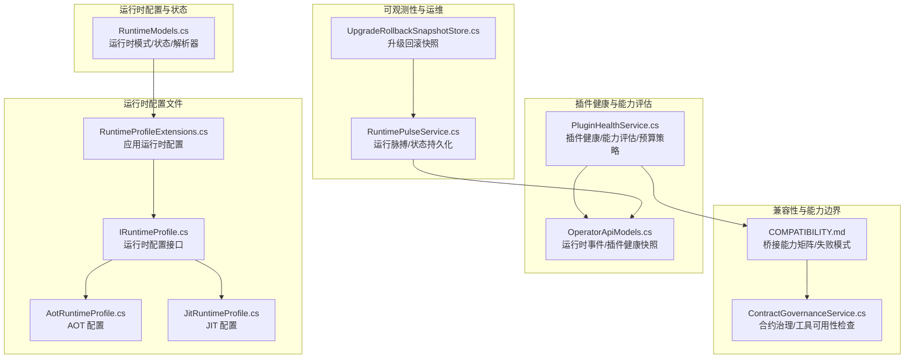
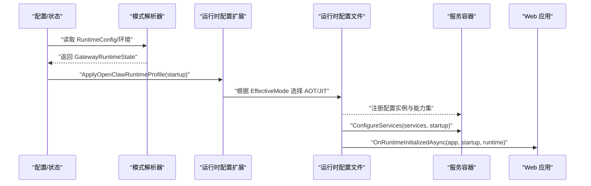
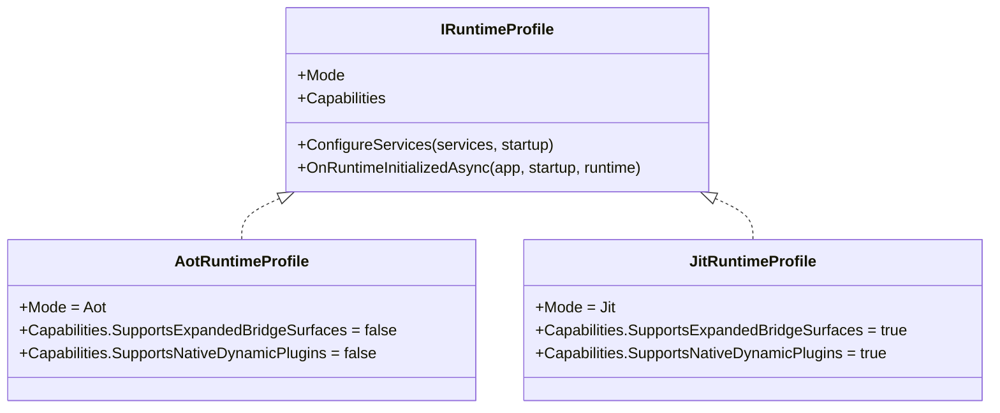
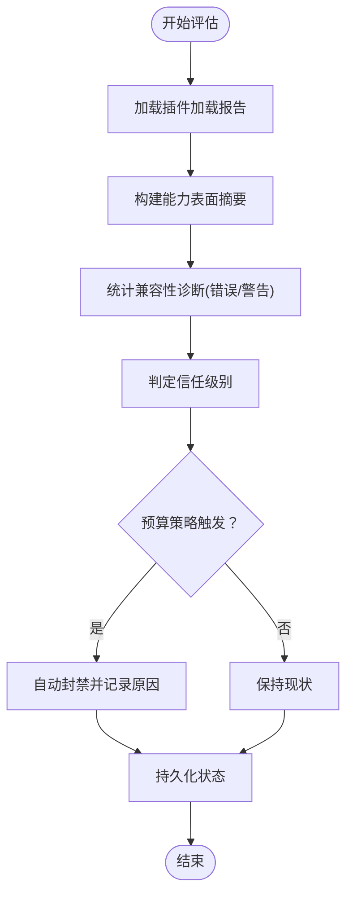
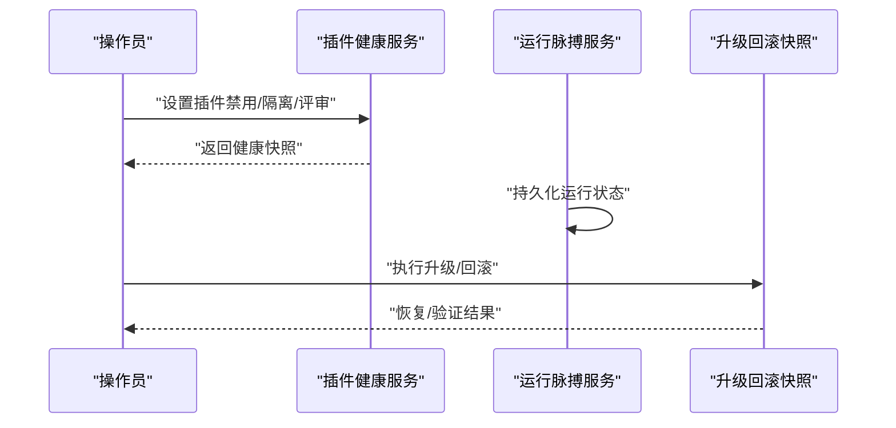
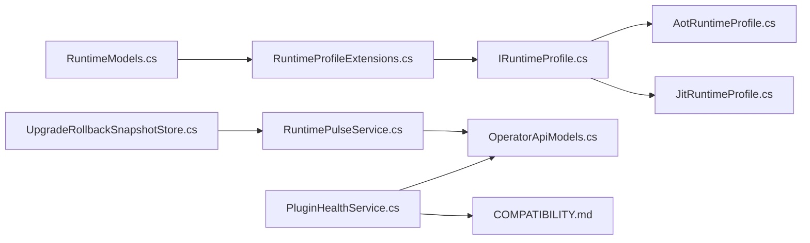

# 运行时能力管理

<cite>
**本文引用的文件**
- [IRuntimeProfile.cs](file://src/OpenClaw.Gateway/Profiles/IRuntimeProfile.cs)
- [AotRuntimeProfile.cs](file://src/OpenClaw.Gateway/Profiles/AotRuntimeProfile.cs)
- [JitRuntimeProfile.cs](file://src/OpenClaw.Gateway/Profiles/JitRuntimeProfile.cs)
- [RuntimeProfileExtensions.cs](file://src/OpenClaw.Gateway/Profiles/RuntimeProfileExtensions.cs)
- [RuntimeModels.cs](file://src/OpenClaw.Core/Models/RuntimeModels.cs)
- [PluginHealthService.cs](file://src/OpenClaw.Gateway/PluginHealthService.cs)
- [OperatorApiModels.cs](file://src/OpenClaw.Core/Models/OperatorApiModels.cs)
- [COMPATIBILITY.md](file://docs/COMPATIBILITY.md)
- [RuntimeDiscovery.cs](file://src/OpenClaw.Agent/Plugins/RuntimeDiscovery.cs)
- [ContractGovernanceService.cs](file://src/OpenClaw.Gateway/ContractGovernanceService.cs)
- [RuntimePulseService.cs](file://src/OpenClaw.Gateway/RuntimePulseService.cs)
- [UpgradeRollbackSnapshotStore.cs](file://src/OpenClaw.Core/Setup/UpgradeRollbackSnapshotStore.cs)
- [RuntimeProfileExtensions.cs](file://src/OpenClaw.Gateway/Profiles/RuntimeProfileExtensions.cs)
</cite>

## 目录
1. [简介](#简介)
2. [项目结构](#项目结构)
3. [核心组件](#核心组件)
4. [架构总览](#架构总览)
5. [详细组件分析](#详细组件分析)
6. [依赖分析](#依赖分析)
7. [性能考虑](#性能考虑)
8. [故障排查指南](#故障排查指南)
9. [结论](#结论)
10. [附录](#附录)

## 简介
本文件系统化阐述运行时能力管理的设计与实现，围绕 IRuntimeProfile 接口的能力抽象、运行时能力的发现与评估、动态配置与运行模式交互，以及能力注册表、优先级与冲突处理策略进行深入说明。文档同时覆盖能力扩展点、插件集成能力、自定义能力开发指南、能力配置示例、性能影响分析、兼容性检查方法、热更新与回滚机制，以及能力与运行模式的最佳实践。

## 项目结构
运行时能力管理主要分布在以下模块：
- 运行时配置与状态：核心模型与运行时模式解析
- 运行时配置文件：运行时配置与启动上下文
- 运行时配置应用：根据有效运行时模式选择配置文件
- 插件健康与能力评估：能力声明、兼容性诊断与预算策略
- 兼容性矩阵与能力边界：桥接能力支持与失败模式
- 运行时脉搏与可观测性：运行状态持久化与事件记录
- 回滚与升级：升级回滚快照与恢复流程

**图表来源**
- [RuntimeModels.cs:1-69](file://src/OpenClaw.Core/Models/RuntimeModels.cs#L1-L69)
- [IRuntimeProfile.cs:1-18](file://src/OpenClaw.Gateway/Profiles/IRuntimeProfile.cs#L1-L18)
- [AotRuntimeProfile.cs:1-22](file://src/OpenClaw.Gateway/Profiles/AotRuntimeProfile.cs#L1-L22)
- [JitRuntimeProfile.cs:1-22](file://src/OpenClaw.Gateway/Profiles/JitRuntimeProfile.cs#L1-L22)
- [RuntimeProfileExtensions.cs:1-23](file://src/OpenClaw.Gateway/Profiles/RuntimeProfileExtensions.cs#L1-L23)
- [PluginHealthService.cs:1-449](file://src/OpenClaw.Gateway/PluginHealthService.cs#L1-L449)
- [OperatorApiModels.cs:100-199](file://src/OpenClaw.Core/Models/OperatorApiModels.cs#L100-L199)
- [COMPATIBILITY.md:1-131](file://docs/COMPATIBILITY.md#L1-L131)
- [ContractGovernanceService.cs:68-103](file://src/OpenClaw.Gateway/ContractGovernanceService.cs#L68-L103)
- [RuntimePulseService.cs:775-811](file://src/OpenClaw.Gateway/RuntimePulseService.cs#L775-L811)
- [UpgradeRollbackSnapshotStore.cs:39-144](file://src/OpenClaw.Core/Setup/UpgradeRollbackSnapshotStore.cs#L39-L144)

**章节来源**
- [RuntimeModels.cs:1-69](file://src/OpenClaw.Core/Models/RuntimeModels.cs#L1-L69)
- [IRuntimeProfile.cs:1-18](file://src/OpenClaw.Gateway/Profiles/IRuntimeProfile.cs#L1-L18)
- [RuntimeProfileExtensions.cs:1-23](file://src/OpenClaw.Gateway/Profiles/RuntimeProfileExtensions.cs#L1-L23)

## 核心组件
- 运行时模式与状态
  - 运行时模式枚举与状态对象，负责将用户配置转换为有效运行时模式，并提供动态代码支持检测。
  - 关键路径：[RuntimeModels.cs:1-69](file://src/OpenClaw.Core/Models/RuntimeModels.cs#L1-L69)

- 运行时配置文件（IRuntimeProfile）
  - 定义运行时配置接口，包含模式、能力集、服务注册与初始化回调。
  - 关键路径：[IRuntimeProfile.cs:1-18](file://src/OpenClaw.Gateway/Profiles/IRuntimeProfile.cs#L1-L18)

- AOT/JIT 配置实现
  - AOT：不支持扩展桥面与原生动态插件。
  - JIT：支持扩展桥面与原生动态插件。
  - 关键路径：[AotRuntimeProfile.cs:1-22](file://src/OpenClaw.Gateway/Profiles/AotRuntimeProfile.cs#L1-L22)，[JitRuntimeProfile.cs:1-22](file://src/OpenClaw.Gateway/Profiles/JitRuntimeProfile.cs#L1-L22)

- 应用运行时配置
  - 根据有效运行时模式选择对应配置文件，注册到服务容器并调用配置阶段。
  - 关键路径：[RuntimeProfileExtensions.cs:1-23](file://src/OpenClaw.Gateway/Profiles/RuntimeProfileExtensions.cs#L1-L23)

- 插件健康与能力评估
  - 统计插件能力声明、兼容性诊断、重启次数、内存占用等，实施预算策略自动封禁。
  - 关键路径：[PluginHealthService.cs:1-449](file://src/OpenClaw.Gateway/PluginHealthService.cs#L1-L449)，[OperatorApiModels.cs:100-199](file://src/OpenClaw.Core/Models/OperatorApiModels.cs#L100-L199)

- 兼容性矩阵与能力边界
  - 明确各桥接能力在 AOT/JIT 中的支持情况与失败码，指导插件设计与诊断。
  - 关键路径：[COMPATIBILITY.md:1-131](file://docs/COMPATIBILITY.md#L1-L131)

**章节来源**
- [RuntimeModels.cs:1-69](file://src/OpenClaw.Core/Models/RuntimeModels.cs#L1-L69)
- [IRuntimeProfile.cs:1-18](file://src/OpenClaw.Gateway/Profiles/IRuntimeProfile.cs#L1-L18)
- [AotRuntimeProfile.cs:1-22](file://src/OpenClaw.Gateway/Profiles/AotRuntimeProfile.cs#L1-L22)
- [JitRuntimeProfile.cs:1-22](file://src/OpenClaw.Gateway/Profiles/JitRuntimeProfile.cs#L1-L22)
- [RuntimeProfileExtensions.cs:1-23](file://src/OpenClaw.Gateway/Profiles/RuntimeProfileExtensions.cs#L1-L23)
- [PluginHealthService.cs:1-449](file://src/OpenClaw.Gateway/PluginHealthService.cs#L1-L449)
- [OperatorApiModels.cs:100-199](file://src/OpenClaw.Core/Models/OperatorApiModels.cs#L100-L199)
- [COMPATIBILITY.md:1-131](file://docs/COMPATIBILITY.md#L1-L131)

## 架构总览
运行时能力管理通过“模式解析 → 配置选择 → 服务注册 → 初始化回调”的流水线，将运行模式与能力边界注入到网关生命周期。插件健康服务在运行期对能力声明与兼容性进行持续评估，并依据预算策略进行自动封禁与人工干预。

**图表来源**
- [RuntimeModels.cs:29-59](file://src/OpenClaw.Core/Models/RuntimeModels.cs#L29-L59)
- [RuntimeProfileExtensions.cs:8-21](file://src/OpenClaw.Gateway/Profiles/RuntimeProfileExtensions.cs#L8-L21)
- [IRuntimeProfile.cs:11-17](file://src/OpenClaw.Gateway/Profiles/IRuntimeProfile.cs#L11-L17)
- [AotRuntimeProfile.cs:7-22](file://src/OpenClaw.Gateway/Profiles/AotRuntimeProfile.cs#L7-L22)
- [JitRuntimeProfile.cs:7-22](file://src/OpenClaw.Gateway/Profiles/JitRuntimeProfile.cs#L7-L22)

## 详细组件分析

### IRuntimeProfile 设计理念与能力抽象
- 设计理念
  - 将“运行时模式”与“能力集”解耦，通过接口统一抽象不同运行时的差异化能力。
  - 能力集以布尔标志表达，如扩展桥面与原生动态插件支持，简洁直观。
- 能力抽象机制
  - 能力集封装在记录类型中，随配置文件实例化并注入服务容器。
  - 配置文件在 ConfigureServices 阶段可按需注册与模式相关的服务，在 OnRuntimeInitializedAsync 阶段执行后置初始化。
- 关键路径
  - [IRuntimeProfile.cs:7-17](file://src/OpenClaw.Gateway/Profiles/IRuntimeProfile.cs#L7-L17)

**图表来源**
- [IRuntimeProfile.cs:11-17](file://src/OpenClaw.Gateway/Profiles/IRuntimeProfile.cs#L11-L17)
- [AotRuntimeProfile.cs:7-13](file://src/OpenClaw.Gateway/Profiles/AotRuntimeProfile.cs#L7-L13)
- [JitRuntimeProfile.cs:7-13](file://src/OpenClaw.Gateway/Profiles/JitRuntimeProfile.cs#L7-L13)

**章节来源**
- [IRuntimeProfile.cs:1-18](file://src/OpenClaw.Gateway/Profiles/IRuntimeProfile.cs#L1-L18)
- [AotRuntimeProfile.cs:1-22](file://src/OpenClaw.Gateway/Profiles/AotRuntimeProfile.cs#L1-L22)
- [JitRuntimeProfile.cs:1-22](file://src/OpenClaw.Gateway/Profiles/JitRuntimeProfile.cs#L1-L22)

### 运行时能力的发现、评估与动态配置
- 能力发现
  - 插件通过加载报告声明其能力表面（工具数、命令数、通道数、提供者数、技能目录数、能力标签等）。
  - 关键路径：[PluginHealthService.cs:64-108](file://src/OpenClaw.Gateway/PluginHealthService.cs#L64-L108)
- 能力评估
  - 基于兼容性诊断统计错误/警告数量，结合能力声明与运行时模式进行信任级别判定。
  - 关键路径：[PluginHealthService.cs:389-428](file://src/OpenClaw.Gateway/PluginHealthService.cs#L389-L428)
- 动态配置
  - 运行时模式解析决定有效模式；配置扩展根据有效模式选择具体配置文件并注册到容器。
  - 关键路径：[RuntimeModels.cs:29-59](file://src/OpenClaw.Core/Models/RuntimeModels.cs#L29-L59)，[RuntimeProfileExtensions.cs:8-21](file://src/OpenClaw.Gateway/Profiles/RuntimeProfileExtensions.cs#L8-L21)

**图表来源**
- [PluginHealthService.cs:58-158](file://src/OpenClaw.Gateway/PluginHealthService.cs#L58-L158)
- [PluginHealthService.cs:239-291](file://src/OpenClaw.Gateway/PluginHealthService.cs#L239-L291)

**章节来源**
- [PluginHealthService.cs:1-449](file://src/OpenClaw.Gateway/PluginHealthService.cs#L1-L449)
- [RuntimeModels.cs:29-59](file://src/OpenClaw.Core/Models/RuntimeModels.cs#L29-L59)
- [RuntimeProfileExtensions.cs:1-23](file://src/OpenClaw.Gateway/Profiles/RuntimeProfileExtensions.cs#L1-L23)

### 能力注册表、优先级排序与冲突解决
- 能力注册表
  - 插件加载报告作为能力注册表，记录插件 ID、来源、能力标签、技能目录、诊断信息等。
  - 关键路径：[PluginHealthService.cs:64-108](file://src/OpenClaw.Gateway/PluginHealthService.cs#L64-L108)，[OperatorApiModels.cs:131-165](file://src/OpenClaw.Core/Models/OperatorApiModels.cs#L131-L165)
- 优先级排序
  - 兼容性矩阵文档指出能力优先级仅用于“平局时的选择”，而非“无视请求语义的全局覆盖”。
  - 关键路径：[COMPATIBILITY.md:410-423](file://docs/COMPATIBILITY.md#L410-L423)
- 冲突解决策略
  - 工具名称冲突采用“先到先得”原则，后续重复声明被跳过并记录。
  - 关键路径：[COMPATIBILITY.md:103-104](file://docs/COMPATIBILITY.md#L103-L104)

**章节来源**
- [PluginHealthService.cs:64-108](file://src/OpenClaw.Gateway/PluginHealthService.cs#L64-L108)
- [OperatorApiModels.cs:131-165](file://src/OpenClaw.Core/Models/OperatorApiModels.cs#L131-L165)
- [COMPATIBILITY.md:410-423](file://docs/COMPATIBILITY.md#L410-L423)
- [COMPATIBILITY.md:103-104](file://docs/COMPATIBILITY.md#L103-L104)

### 能力扩展点、插件集成能力与自定义能力开发
- 能力扩展点
  - 通过运行时配置文件扩展能力集；AOT/JIT 提供不同的能力边界。
  - 关键路径：[IRuntimeProfile.cs:7-17](file://src/OpenClaw.Gateway/Profiles/IRuntimeProfile.cs#L7-L17)，[RuntimeProfileExtensions.cs:8-21](file://src/OpenClaw.Gateway/Profiles/RuntimeProfileExtensions.cs#L8-L21)
- 插件集成能力
  - 支持桥接能力：工具、服务、通道、命令、事件钩子、LLM 提供者；支持原生动态插件（JIT）。
  - 关键路径：[COMPATIBILITY.md:11-30](file://docs/COMPATIBILITY.md#L11-L30)，[COMPATIBILITY.md:40-48](file://docs/COMPATIBILITY.md#L40-L48)
- 自定义能力开发
  - 使用兼容性矩阵核对能力清单；遵循配置模式与安全约束；利用诊断端点定位问题。
  - 关键路径：[COMPATIBILITY.md:72-94](file://docs/COMPATIBILITY.md#L72-L94)，[COMPATIBILITY.md:96-104](file://docs/COMPATIBILITY.md#L96-L104)

**章节来源**
- [IRuntimeProfile.cs:1-18](file://src/OpenClaw.Gateway/Profiles/IRuntimeProfile.cs#L1-L18)
- [RuntimeProfileExtensions.cs:1-23](file://src/OpenClaw.Gateway/Profiles/RuntimeProfileExtensions.cs#L1-L23)
- [COMPATIBILITY.md:11-30](file://docs/COMPATIBILITY.md#L11-L30)
- [COMPATIBILITY.md:40-48](file://docs/COMPATIBILITY.md#L40-L48)
- [COMPATIBILITY.md:72-94](file://docs/COMPATIBILITY.md#L72-L94)
- [COMPATIBILITY.md:96-104](file://docs/COMPATIBILITY.md#L96-L104)

### 能力配置示例、性能影响分析与兼容性检查
- 能力配置示例
  - 在配置中指定运行时模式与编排器；通过兼容性矩阵核对桥接能力。
  - 关键路径：[COMPATIBILITY.md:31-49](file://docs/COMPATIBILITY.md#L31-L49)
- 性能影响分析
  - JIT 模式支持更广能力集，但可能带来更高的内存占用与重启风险；AOT 模式更保守，适合低内存场景。
  - 关键路径：[COMPATIBILITY.md:1-9](file://docs/COMPATIBILITY.md#L1-L9)
- 兼容性检查方法
  - 利用诊断端点查看加载、配置与兼容性失败；遵循“先到先得”的工具名冲突规则。
  - 关键路径：[COMPATIBILITY.md:96-104](file://docs/COMPATIBILITY.md#L96-L104)

**章节来源**
- [COMPATIBILITY.md:1-9](file://docs/COMPATIBILITY.md#L1-L9)
- [COMPATIBILITY.md:31-49](file://docs/COMPATIBILITY.md#L31-L49)
- [COMPATIBILITY.md:96-104](file://docs/COMPATIBILITY.md#L96-L104)

### 能力热更新、运行时调整与回滚机制
- 能力热更新
  - 通过运行时脉搏与状态持久化记录运行状态；插件健康服务在运行期持续评估并应用预算策略。
  - 关键路径：[RuntimePulseService.cs:775-811](file://src/OpenClaw.Gateway/RuntimePulseService.cs#L775-L811)，[PluginHealthService.cs:239-291](file://src/OpenClaw.Gateway/PluginHealthService.cs#L239-L291)
- 运行时调整
  - 运行时模式解析与配置扩展确保在启动阶段即确定能力边界；运行期通过健康服务与预算策略进行动态治理。
  - 关键路径：[RuntimeModels.cs:29-59](file://src/OpenClaw.Core/Models/RuntimeModels.cs#L29-L59)，[RuntimeProfileExtensions.cs:8-21](file://src/OpenClaw.Gateway/Profiles/RuntimeProfileExtensions.cs#L8-L21)
- 回滚机制
  - 升级回滚快照存储与替换流程保障配置与部署文件的安全恢复。
  - 关键路径：[UpgradeRollbackSnapshotStore.cs:39-144](file://src/OpenClaw.Core/Setup/UpgradeRollbackSnapshotStore.cs#L39-L144)

**图表来源**
- [PluginHealthService.cs:160-189](file://src/OpenClaw.Gateway/PluginHealthService.cs#L160-L189)
- [RuntimePulseService.cs:775-811](file://src/OpenClaw.Gateway/RuntimePulseService.cs#L775-L811)
- [UpgradeRollbackSnapshotStore.cs:109-136](file://src/OpenClaw.Core/Setup/UpgradeRollbackSnapshotStore.cs#L109-L136)

**章节来源**
- [PluginHealthService.cs:160-189](file://src/OpenClaw.Gateway/PluginHealthService.cs#L160-L189)
- [RuntimePulseService.cs:775-811](file://src/OpenClaw.Gateway/RuntimePulseService.cs#L775-L811)
- [UpgradeRollbackSnapshotStore.cs:39-144](file://src/OpenClaw.Core/Setup/UpgradeRollbackSnapshotStore.cs#L39-L144)

### 能力与运行模式的交互关系与最佳实践
- 交互关系
  - 运行时模式决定能力边界；AOT/JIT 配置文件分别定义能力集；合约治理在工具可用性检查中强制模式一致性。
  - 关键路径：[RuntimeModels.cs:29-59](file://src/OpenClaw.Core/Models/RuntimeModels.cs#L29-L59)，[AotRuntimeProfile.cs:7-13](file://src/OpenClaw.Gateway/Profiles/AotRuntimeProfile.cs#L7-L13)，[JitRuntimeProfile.cs:7-13](file://src/OpenClaw.Gateway/Profiles/JitRuntimeProfile.cs#L7-L13)，[ContractGovernanceService.cs:68-103](file://src/OpenClaw.Gateway/ContractGovernanceService.cs#L68-L103)
- 最佳实践
  - 在 AOT 模式下优先使用轻量能力与静态资源；在 JIT 模式下谨慎启用高风险能力并监控预算指标。
  - 使用兼容性矩阵与诊断端点进行持续验证，避免工具名冲突与越界能力使用。
  - 关键路径：[COMPATIBILITY.md:1-9](file://docs/COMPATIBILITY.md#L1-L9)，[COMPATIBILITY.md:11-30](file://docs/COMPATIBILITY.md#L11-L30)

**章节来源**
- [RuntimeModels.cs:29-59](file://src/OpenClaw.Core/Models/RuntimeModels.cs#L29-L59)
- [AotRuntimeProfile.cs:7-13](file://src/OpenClaw.Gateway/Profiles/AotRuntimeProfile.cs#L7-L13)
- [JitRuntimeProfile.cs:7-13](file://src/OpenClaw.Gateway/Profiles/JitRuntimeProfile.cs#L7-L13)
- [ContractGovernanceService.cs:68-103](file://src/OpenClaw.Gateway/ContractGovernanceService.cs#L68-L103)
- [COMPATIBILITY.md:1-9](file://docs/COMPATIBILITY.md#L1-L9)
- [COMPATIBILITY.md:11-30](file://docs/COMPATIBILITY.md#L11-L30)

## 依赖分析
- 组件耦合
  - 运行时模式解析器与配置扩展紧密耦合，共同决定有效运行时模式。
  - 配置文件与服务容器强耦合，通过 ConfigureServices 注册模式相关服务。
  - 插件健康服务依赖运行时遥测与预算配置，形成闭环治理。
- 外部依赖
  - 兼容性矩阵文档提供能力边界与失败码，指导开发与诊断。
  - 运行脉搏与升级回滚服务提供可观测性与运维保障。

**图表来源**
- [RuntimeModels.cs:29-59](file://src/OpenClaw.Core/Models/RuntimeModels.cs#L29-L59)
- [RuntimeProfileExtensions.cs:8-21](file://src/OpenClaw.Gateway/Profiles/RuntimeProfileExtensions.cs#L8-L21)
- [IRuntimeProfile.cs:11-17](file://src/OpenClaw.Gateway/Profiles/IRuntimeProfile.cs#L11-L17)
- [AotRuntimeProfile.cs:7-13](file://src/OpenClaw.Gateway/Profiles/AotRuntimeProfile.cs#L7-L13)
- [JitRuntimeProfile.cs:7-13](file://src/OpenClaw.Gateway/Profiles/JitRuntimeProfile.cs#L7-L13)
- [PluginHealthService.cs:58-158](file://src/OpenClaw.Gateway/PluginHealthService.cs#L58-L158)
- [OperatorApiModels.cs:131-165](file://src/OpenClaw.Core/Models/OperatorApiModels.cs#L131-L165)
- [COMPATIBILITY.md:1-131](file://docs/COMPATIBILITY.md#L1-L131)
- [RuntimePulseService.cs:775-811](file://src/OpenClaw.Gateway/RuntimePulseService.cs#L775-L811)
- [UpgradeRollbackSnapshotStore.cs:39-144](file://src/OpenClaw.Core/Setup/UpgradeRollbackSnapshotStore.cs#L39-L144)

**章节来源**
- [RuntimeModels.cs:29-59](file://src/OpenClaw.Core/Models/RuntimeModels.cs#L29-L59)
- [RuntimeProfileExtensions.cs:8-21](file://src/OpenClaw.Gateway/Profiles/RuntimeProfileExtensions.cs#L8-L21)
- [IRuntimeProfile.cs:11-17](file://src/OpenClaw.Gateway/Profiles/IRuntimeProfile.cs#L11-L17)
- [AotRuntimeProfile.cs:7-13](file://src/OpenClaw.Gateway/Profiles/AotRuntimeProfile.cs#L7-L13)
- [JitRuntimeProfile.cs:7-13](file://src/OpenClaw.Gateway/Profiles/JitRuntimeProfile.cs#L7-L13)
- [PluginHealthService.cs:58-158](file://src/OpenClaw.Gateway/PluginHealthService.cs#L58-L158)
- [OperatorApiModels.cs:131-165](file://src/OpenClaw.Core/Models/OperatorApiModels.cs#L131-L165)
- [COMPATIBILITY.md:1-131](file://docs/COMPATIBILITY.md#L1-L131)
- [RuntimePulseService.cs:775-811](file://src/OpenClaw.Gateway/RuntimePulseService.cs#L775-L811)
- [UpgradeRollbackSnapshotStore.cs:39-144](file://src/OpenClaw.Core/Setup/UpgradeRollbackSnapshotStore.cs#L39-L144)

## 性能考虑
- 模式选择对性能的影响
  - AOT 模式在内存占用与启动时间上更具优势，适合大规模部署与低延迟场景。
  - JIT 模式在能力丰富度上占优，但需关注内存与重启风险，建议配合预算策略与健康监控。
- 能力评估与诊断的成本
  - 插件健康服务在运行期持续评估，建议合理设置诊断频率与缓存策略，避免过度开销。
- 运行脉搏与回滚
  - 运行脉搏状态持久化与升级回滚快照均涉及磁盘 IO，建议优化序列化与文件权限控制。

[本节为通用性能讨论，无需列出具体文件来源]

## 故障排查指南
- 运行时模式不匹配
  - 合约治理在工具可用性检查中强制要求运行时模式一致，若不一致将拒绝工具并给出明确错误。
  - 关键路径：[ContractGovernanceService.cs:68-103](file://src/OpenClaw.Gateway/ContractGovernanceService.cs#L68-L103)
- 能力声明与兼容性问题
  - 使用插件健康快照查看诊断统计、错误/警告数量与信任级别；依据预算策略判断是否被自动封禁。
  - 关键路径：[PluginHealthService.cs:58-158](file://src/OpenClaw.Gateway/PluginHealthService.cs#L58-L158)，[OperatorApiModels.cs:131-165](file://src/OpenClaw.Core/Models/OperatorApiModels.cs#L131-L165)
- 回滚与升级问题
  - 升级回滚快照加载失败时检查清单有效性与权限；回滚完成后进行验证。
  - 关键路径：[UpgradeRollbackSnapshotStore.cs:45-72](file://src/OpenClaw.Core/Setup/UpgradeRollbackSnapshotStore.cs#L45-L72)，[UpgradeRollbackSnapshotStore.cs:109-136](file://src/OpenClaw.Core/Setup/UpgradeRollbackSnapshotStore.cs#L109-L136)

**章节来源**
- [ContractGovernanceService.cs:68-103](file://src/OpenClaw.Gateway/ContractGovernanceService.cs#L68-L103)
- [PluginHealthService.cs:58-158](file://src/OpenClaw.Gateway/PluginHealthService.cs#L58-L158)
- [OperatorApiModels.cs:131-165](file://src/OpenClaw.Core/Models/OperatorApiModels.cs#L131-L165)
- [UpgradeRollbackSnapshotStore.cs:45-72](file://src/OpenClaw.Core/Setup/UpgradeRollbackSnapshotStore.cs#L45-L72)
- [UpgradeRollbackSnapshotStore.cs:109-136](file://src/OpenClaw.Core/Setup/UpgradeRollbackSnapshotStore.cs#L109-L136)

## 结论
运行时能力管理通过 IRuntimeProfile 接口将运行时模式与能力边界清晰分离，结合插件健康服务与预算策略实现动态治理。AOT/JIT 配置文件定义了能力集差异，兼容性矩阵明确了能力边界与失败模式。通过运行脉搏与升级回滚机制，系统在保证稳定性的同时支持热更新与快速恢复。最佳实践建议在 AOT 模式下聚焦轻量能力，在 JIT 模式下审慎启用高风险能力并加强监控与诊断。

[本节为总结性内容，无需列出具体文件来源]

## 附录
- 运行时能力与模式对照
  - AOT：不支持扩展桥面与原生动态插件
  - JIT：支持扩展桥面与原生动态插件
  - 关键路径：[AotRuntimeProfile.cs:7-13](file://src/OpenClaw.Gateway/Profiles/AotRuntimeProfile.cs#L7-L13)，[JitRuntimeProfile.cs:7-13](file://src/OpenClaw.Gateway/Profiles/JitRuntimeProfile.cs#L7-L13)
- 能力发现与运行时发现工具
  - 插件加载报告作为能力注册表；运行时发现工具用于定位外部运行时（如 Node.js）。
  - 关键路径：[PluginHealthService.cs:64-108](file://src/OpenClaw.Gateway/PluginHealthService.cs#L64-L108)，[RuntimeDiscovery.cs:1-115](file://src/OpenClaw.Agent/Plugins/RuntimeDiscovery.cs#L1-L115)

**章节来源**
- [AotRuntimeProfile.cs:7-13](file://src/OpenClaw.Gateway/Profiles/AotRuntimeProfile.cs#L7-L13)
- [JitRuntimeProfile.cs:7-13](file://src/OpenClaw.Gateway/Profiles/JitRuntimeProfile.cs#L7-L13)
- [PluginHealthService.cs:64-108](file://src/OpenClaw.Gateway/PluginHealthService.cs#L64-L108)
- [RuntimeDiscovery.cs:1-115](file://src/OpenClaw.Agent/Plugins/RuntimeDiscovery.cs#L1-L115)