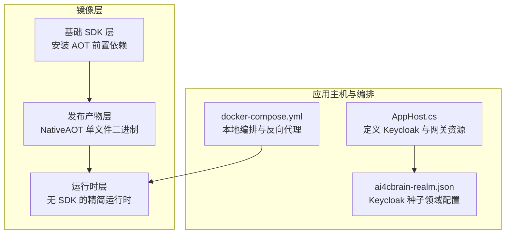
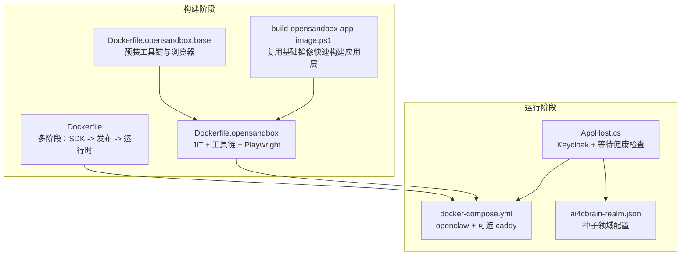
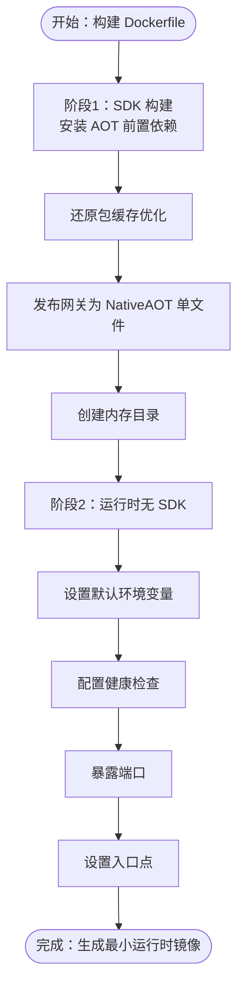
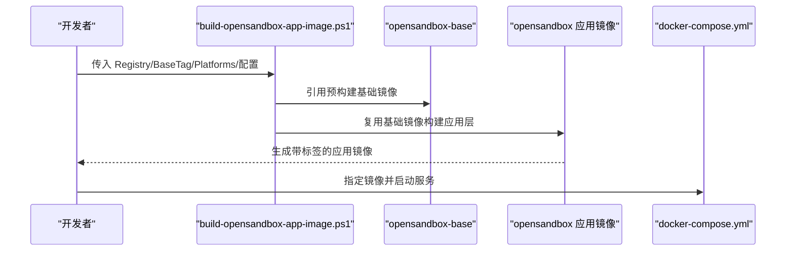
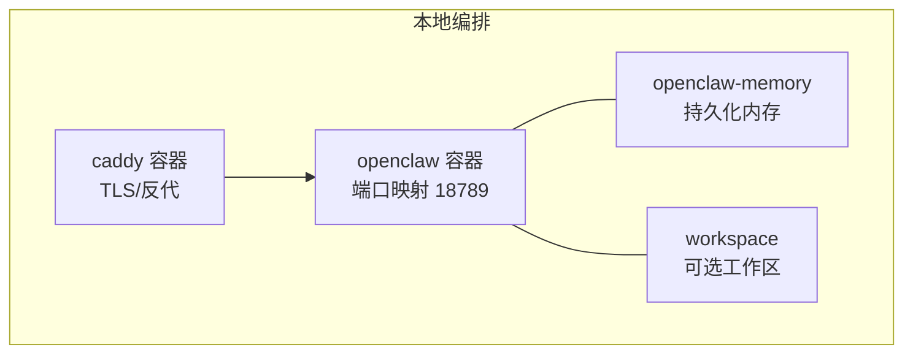
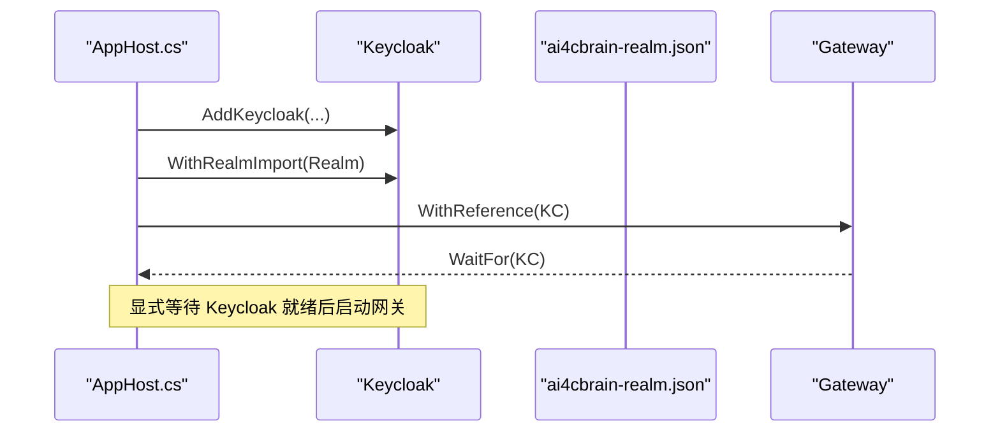
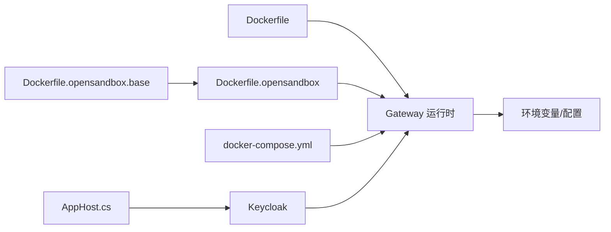

# 部署架构

<cite>
**本文引用的文件**
- [Dockerfile](file://Dockerfile)
- [docker-compose.yml](file://docker-compose.yml)
- [Dockerfile.opensandbox](file://Dockerfile.opensandbox)
- [Dockerfile.opensandbox.base](file://Dockerfile.opensandbox.base)
- [scripts/build-opensandbox-app-image.ps1](file://scripts/build-opensandbox-app-image.ps1)
- [Kingcrab.AppHost/AppHost.cs](file://Kingcrab.AppHost/AppHost.cs)
- [Kingcrab.AppHost/appsettings.json](file://Kingcrab.AppHost/appsettings.json)
- [Kingcrab.AppHost/appsettings.Development.json](file://Kingcrab.AppHost/appsettings.Development.json)
- [Kingcrab.AppHost/Properties/launchSettings.json](file://Kingcrab.AppHost/Properties/launchSettings.json)
- [.dockerignore](file://.dockerignore)
- [.gitignore](file://.gitignore)
- [Kingcrab.AppHost/Configs/ai4cbrain-realm.json](file://Kingcrab.AppHost/Configs/ai4cbrain-realm.json)
</cite>

## 目录
1. [简介](#简介)
2. [项目结构](#项目结构)
3. [核心组件](#核心组件)
4. [架构总览](#架构总览)
5. [详细组件分析](#详细组件分析)
6. [依赖关系分析](#依赖关系分析)
7. [性能考量](#性能考量)
8. [故障排查指南](#故障排查指南)
9. [结论](#结论)
10. [附录](#附录)

## 简介
本文件面向 OpenClaw.NET 的生产与开发部署，系统化阐述容器化策略、镜像构建与多阶段流程、环境变量与配置管理、微服务模式与服务发现/负载均衡建议、Kubernetes 部署要点（含资源与扩缩容）、部署拓扑与网络配置、运维监控与日志、备份与恢复、以及安全加固与合规性要求。内容基于仓库中的 Dockerfile、Compose、Aspire 应用主机与 Keycloak 配置等实际文件进行归纳总结。

## 项目结构
OpenClaw.NET 的部署相关资产主要分布在以下位置：
- 容器镜像构建：根目录 Dockerfile、Dockerfile.opensandbox、Dockerfile.opensandbox.base
- 编排与本地开发：docker-compose.yml
- Aspire 应用主机与 Keycloak：Kingcrab.AppHost 下的 AppHost.cs、appsettings.*、Properties/launchSettings.json、Configs/ai4cbrain-realm.json
- 构建脚本：scripts/build-opensandbox-app-image.ps1
- 忽略规则：.dockerignore、.gitignore

**图表来源**
- [Dockerfile:1-59](file://Dockerfile#L1-L59)
- [Dockerfile.opensandbox:1-113](file://Dockerfile.opensandbox#L1-L113)
- [Dockerfile.opensandbox.base:1-76](file://Dockerfile.opensandbox.base#L1-L76)
- [Kingcrab.AppHost/AppHost.cs:1-25](file://Kingcrab.AppHost/AppHost.cs#L1-L25)
- [Kingcrab.AppHost/Configs/ai4cbrain-realm.json:1-800](file://Kingcrab.AppHost/Configs/ai4cbrain-realm.json#L1-L800)
- [docker-compose.yml:1-68](file://docker-compose.yml#L1-L68)

**章节来源**
- [Dockerfile:1-59](file://Dockerfile#L1-L59)
- [Dockerfile.opensandbox:1-113](file://Dockerfile.opensandbox#L1-L113)
- [Dockerfile.opensandbox.base:1-76](file://Dockerfile.opensandbox.base#L1-L76)
- [docker-compose.yml:1-68](file://docker-compose.yml#L1-L68)
- [Kingcrab.AppHost/AppHost.cs:1-25](file://Kingcrab.AppHost/AppHost.cs#L1-L25)
- [Kingcrab.AppHost/Configs/ai4cbrain-realm.json:1-800](file://Kingcrab.AppHost/Configs/ai4cbrain-realm.json#L1-L800)

## 核心组件
- 网关服务（Gateway）：作为对外统一入口，支持本地 AOT 发布与 OpenSandbox JIT 模式两种运行形态；通过环境变量与配置文件驱动行为。
- Keycloak 身份服务：在 Aspire 应用主机中以种子领域配置导入，用于认证与授权。
- 反向代理（可选）：Compose 中提供 Caddy 示例，便于本地或边缘场景启用 TLS。
- OpenSandbox 运行时镜像：在基础镜像之上预装浏览器与工具链，支持更丰富的沙箱能力。

**章节来源**
- [Kingcrab.AppHost/AppHost.cs:9-22](file://Kingcrab.AppHost/AppHost.cs#L9-L22)
- [Kingcrab.AppHost/Configs/ai4cbrain-realm.json:1-800](file://Kingcrab.AppHost/Configs/ai4cbrain-realm.json#L1-L800)
- [docker-compose.yml:44-62](file://docker-compose.yml#L44-L62)
- [Dockerfile.opensandbox.base:1-76](file://Dockerfile.opensandbox.base#L1-L76)

## 架构总览
下图展示从镜像构建到本地编排的关键路径，以及 Keycloak 与网关的关系。

**图表来源**
- [Dockerfile:1-59](file://Dockerfile#L1-L59)
- [Dockerfile.opensandbox:1-113](file://Dockerfile.opensandbox#L1-L113)
- [Dockerfile.opensandbox.base:1-76](file://Dockerfile.opensandbox.base#L1-L76)
- [scripts/build-opensandbox-app-image.ps1:1-141](file://scripts/build-opensandbox-app-image.ps1#L1-L141)
- [docker-compose.yml:1-68](file://docker-compose.yml#L1-L68)
- [Kingcrab.AppHost/AppHost.cs:1-25](file://Kingcrab.AppHost/AppHost.cs#L1-L25)
- [Kingcrab.AppHost/Configs/ai4cbrain-realm.json:1-800](file://Kingcrab.AppHost/Configs/ai4cbrain-realm.json#L1-L800)

## 详细组件分析

### 组件一：容器镜像构建与多阶段流程
- 基础镜像与 AOT 发布
  - 使用 .NET SDK 基础镜像，安装 clang 与 zlib 等 AOT 前置依赖。
  - 在发布阶段针对网关项目执行 NativeAOT 单文件发布，并创建内存目录。
  - 运行时阶段采用无 SDK 的 chiseled 运行时镜像，降低攻击面与体积。
- 环境变量默认值
  - 默认绑定地址、端口、内存存储路径、工具沙箱权限、插件开关等均通过环境变量设定，便于在不同环境覆盖。
- 健康检查
  - 通过命令行参数触发内置健康检查，便于容器编排平台进行存活/就绪探针。

**图表来源**
- [Dockerfile:1-59](file://Dockerfile#L1-L59)

**章节来源**
- [Dockerfile:1-59](file://Dockerfile#L1-L59)

### 组件二：OpenSandbox 运行时镜像
- 基于预构建的基础镜像（Dockerfile.opensandbox.base），在应用镜像（Dockerfile.opensandbox）中仅做“应用层”构建，显著缩短构建时间。
- 基础镜像预装 Node、Playwright、Python、poppler 等工具，确保浏览器与多语言执行能力。
- 应用镜像通过构建参数控制是否启用 OpenSandbox，并设置运行时模式（JIT）与工作区路径。
- 提供 PowerShell 脚本以复用基础镜像快速构建应用镜像，支持多平台与推送。

**图表来源**
- [Dockerfile.opensandbox.base:1-76](file://Dockerfile.opensandbox.base#L1-L76)
- [Dockerfile.opensandbox:1-113](file://Dockerfile.opensandbox#L1-L113)
- [scripts/build-opensandbox-app-image.ps1:1-141](file://scripts/build-opensandbox-app-image.ps1#L1-L141)
- [docker-compose.yml:1-68](file://docker-compose.yml#L1-L68)

**章节来源**
- [Dockerfile.opensandbox.base:1-76](file://Dockerfile.opensandbox.base#L1-L76)
- [Dockerfile.opensandbox:1-113](file://Dockerfile.opensandbox#L1-L113)
- [scripts/build-opensandbox-app-image.ps1:1-141](file://scripts/build-opensandbox-app-image.ps1#L1-L141)

### 组件三：本地编排与反向代理
- openclaw 服务
  - 通过环境变量注入模型密钥、认证令牌、绑定地址与端口、工具沙箱根路径等。
  - 挂载持久化卷用于内存数据与可选工作区。
  - 健康检查使用网关内置健康检查命令。
- 可选反向代理（Caddy）
  - 条件启用 with-tls profile，监听 80/443，挂载配置与证书数据卷，依赖网关健康状态。

**图表来源**
- [docker-compose.yml:1-68](file://docker-compose.yml#L1-L68)

**章节来源**
- [docker-compose.yml:1-68](file://docker-compose.yml#L1-L68)

### 组件四：Aspire 应用主机与 Keycloak
- AppHost.cs
  - 创建分布式应用构建器，添加 Keycloak 资源并导入 ai4cbrain-realm.json。
  - 将网关服务引用 Keycloak 并显式等待其健康检查。
- 日志与开发配置
  - appsettings.* 控制日志级别；launchSettings.json 提供本地 HTTPS/HTTP 启动配置与 Aspire 仪表盘端点。
- Keycloak 领域配置
  - ai4cbrain-realm.json 包含角色、客户端、会话策略等完整种子配置，便于一键初始化。

**图表来源**
- [Kingcrab.AppHost/AppHost.cs:1-25](file://Kingcrab.AppHost/AppHost.cs#L1-L25)
- [Kingcrab.AppHost/Configs/ai4cbrain-realm.json:1-800](file://Kingcrab.AppHost/Configs/ai4cbrain-realm.json#L1-L800)

**章节来源**
- [Kingcrab.AppHost/AppHost.cs:1-25](file://Kingcrab.AppHost/AppHost.cs#L1-L25)
- [Kingcrab.AppHost/appsettings.json:1-10](file://Kingcrab.AppHost/appsettings.json#L1-L10)
- [Kingcrab.AppHost/appsettings.Development.json:1-9](file://Kingcrab.AppHost/appsettings.Development.json#L1-L9)
- [Kingcrab.AppHost/Properties/launchSettings.json:1-32](file://Kingcrab.AppHost/Properties/launchSettings.json#L1-L32)
- [Kingcrab.AppHost/Configs/ai4cbrain-realm.json:1-800](file://Kingcrab.AppHost/Configs/ai4cbrain-realm.json#L1-L800)

## 依赖关系分析
- 构建期依赖
  - Dockerfile 依赖 .NET SDK 与 AOT 工具链；OpenSandbox 镜像依赖基础镜像复用。
- 运行期依赖
  - 网关服务依赖 Keycloak（在 Aspire 场景）或外部 OIDC 提供商（在独立部署场景）。
  - 反向代理（如 Caddy）依赖网关健康状态。
- 配置与环境变量
  - 网关通过双下划线分隔的环境变量键（如 OpenClaw__BindAddress）映射到配置节，实现灵活覆盖。

**图表来源**
- [Dockerfile:1-59](file://Dockerfile#L1-L59)
- [Dockerfile.opensandbox:1-113](file://Dockerfile.opensandbox#L1-L113)
- [Dockerfile.opensandbox.base:1-76](file://Dockerfile.opensandbox.base#L1-L76)
- [docker-compose.yml:1-68](file://docker-compose.yml#L1-L68)
- [Kingcrab.AppHost/AppHost.cs:1-25](file://Kingcrab.AppHost/AppHost.cs#L1-L25)

**章节来源**
- [Dockerfile:1-59](file://Dockerfile#L1-L59)
- [Dockerfile.opensandbox:1-113](file://Dockerfile.opensandbox#L1-L113)
- [Dockerfile.opensandbox.base:1-76](file://Dockerfile.opensandbox.base#L1-L76)
- [docker-compose.yml:1-68](file://docker-compose.yml#L1-L68)
- [Kingcrab.AppHost/AppHost.cs:1-25](file://Kingcrab.AppHost/AppHost.cs#L1-L25)

## 性能考量
- AOT 发布
  - 使用 NativeAOT 单文件发布，减少启动延迟与运行时开销，适合生产环境稳定部署。
- 运行时镜像精简
  - 采用无 SDK 的 chiseled 运行时镜像，缩小镜像体积与攻击面。
- OpenSandbox 镜像
  - 预装浏览器与工具链，提升交互体验，但镜像较大，建议按需启用。
- 健康检查与探针
  - 内置健康检查命令，便于容器编排平台进行快速失败检测与自愈。

**章节来源**
- [Dockerfile:27-59](file://Dockerfile#L27-L59)
- [Dockerfile.opensandbox:30-113](file://Dockerfile.opensandbox#L30-L113)

## 故障排查指南
- 健康检查失败
  - 检查容器日志与网关健康检查命令返回码；确认环境变量与配置正确。
- 认证问题
  - 若使用 Keycloak，请核对领域配置与客户端设置；确保网关已正确引用并等待 Keycloak 就绪。
- 反向代理异常
  - 确认 Caddy 配置与域名解析；检查网关健康状态后再启动反向代理。
- OpenSandbox 浏览器问题
  - 确认 Playwright 浏览器已预装且缓存路径正确；必要时清理缓存后重试。

**章节来源**
- [docker-compose.yml:37-42](file://docker-compose.yml#L37-L42)
- [Kingcrab.AppHost/AppHost.cs:20-22](file://Kingcrab.AppHost/AppHost.cs#L20-L22)
- [Kingcrab.AppHost/Configs/ai4cbrain-realm.json:1-800](file://Kingcrab.AppHost/Configs/ai4cbrain-realm.json#L1-L800)
- [Dockerfile.opensandbox:86-90](file://Dockerfile.opensandbox#L86-L90)

## 结论
OpenClaw.NET 的部署体系以多阶段 Docker 构建为核心，结合 Aspire 应用主机与 Keycloak 实现一体化身份与服务编排。通过环境变量与配置文件实现灵活覆盖，配合健康检查与可选反向代理，满足本地开发与生产部署需求。OpenSandbox 镜像进一步扩展了运行时能力，适用于需要浏览器与多语言执行的场景。

## 附录

### 生产环境配置与环境变量管理
- 关键环境变量（示例）
  - 模型提供商密钥与模型名称
  - 绑定地址与端口
  - 工具沙箱读写根路径与是否允许 Shell
  - 插件启用状态
  - 反向代理信任头与已知代理 IP
- 配置来源
  - Dockerfile 与 docker-compose.yml 中的 ENV/环境变量段落
  - Aspire AppHost 的 Keycloak 配置与等待逻辑

**章节来源**
- [Dockerfile:43-51](file://Dockerfile#L43-L51)
- [docker-compose.yml:13-31](file://docker-compose.yml#L13-L31)
- [Kingcrab.AppHost/AppHost.cs:9-22](file://Kingcrab.AppHost/AppHost.cs#L9-L22)

### 微服务部署模式、服务发现与负载均衡
- 模式建议
  - 将网关作为单一入口，结合 Keycloak 进行集中认证；其他组件（如后台任务、消息桥接）以独立服务形式运行。
- 服务发现
  - 在容器编排平台内使用服务名进行内部通信；在独立部署场景可结合 DNS 或服务网格。
- 负载均衡
  - 使用反向代理或编排平台的负载均衡能力；为网关配置多个副本并启用健康检查。

[本节为通用实践建议，不直接分析具体文件]

### Kubernetes 部署要点（资源限制与扩缩容）
- 资源请求与限制
  - 为网关设置合理的 CPU/内存请求与限制，避免过度分配导致抖动。
- 扩缩容策略
  - 基于 CPU/内存或自定义指标进行水平自动扩缩容；为网关设置最小/最大副本数。
- 健康检查
  - 使用内置健康检查命令作为存活/就绪探针；合理设置探测间隔与超时。
- 存储与持久化
  - 将内存数据目录映射到持久化卷；为工作区提供可读写挂载。

[本节为通用实践建议，不直接分析具体文件]

### 部署拓扑与网络配置
- 本地拓扑
  - openclaw 容器直连；可选 caddy 作为反向代理与 TLS 终止。
- 生产拓扑
  - Ingress/NLB 作为入口；Keycloak 作为 OIDC 提供商；网关多副本高可用。
- 网络策略
  - 限制出站访问；为反向代理与网关开放必要端口；启用网络隔离与最小权限原则。

**章节来源**
- [docker-compose.yml:44-62](file://docker-compose.yml#L44-L62)

### 监控告警、日志聚合、备份恢复
- 监控与告警
  - 使用容器编排平台的指标与日志采集；为网关配置健康检查与错误率阈值。
- 日志聚合
  - 收集容器标准输出与应用日志；结合结构化日志与追踪 ID 进行关联分析。
- 备份与恢复
  - 对持久化卷（内存数据）定期快照；备份 Keycloak 领域配置；制定回滚与灾难恢复流程。

[本节为通用实践建议，不直接分析具体文件]

### 安全加固与合规性
- 最小权限与非 root 用户
  - 运行时镜像尽量使用非 root 用户；限制文件系统写权限。
- 网络与传输安全
  - 在生产环境启用 TLS；限制反向代理信任范围；校验上游代理头。
- 配置与密钥管理
  - 使用环境变量注入敏感信息；避免将密钥写入镜像；定期轮换密钥。
- 合规性
  - 遵循所在区域的数据保护法规；对日志与数据处理进行合规评估。

**章节来源**
- [Dockerfile:38-51](file://Dockerfile#L38-L51)
- [docker-compose.yml:29-31](file://docker-compose.yml#L29-L31)