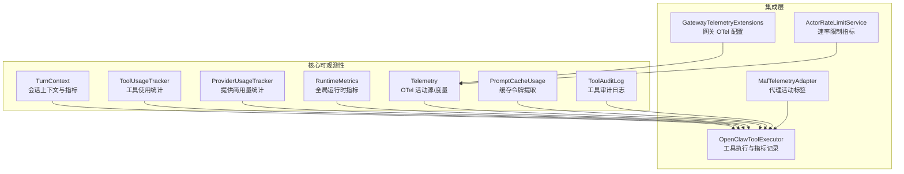
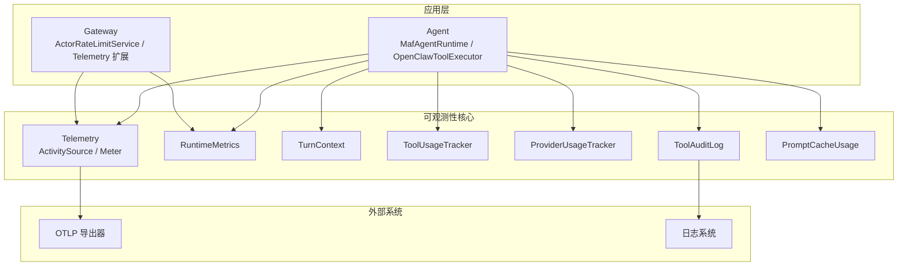
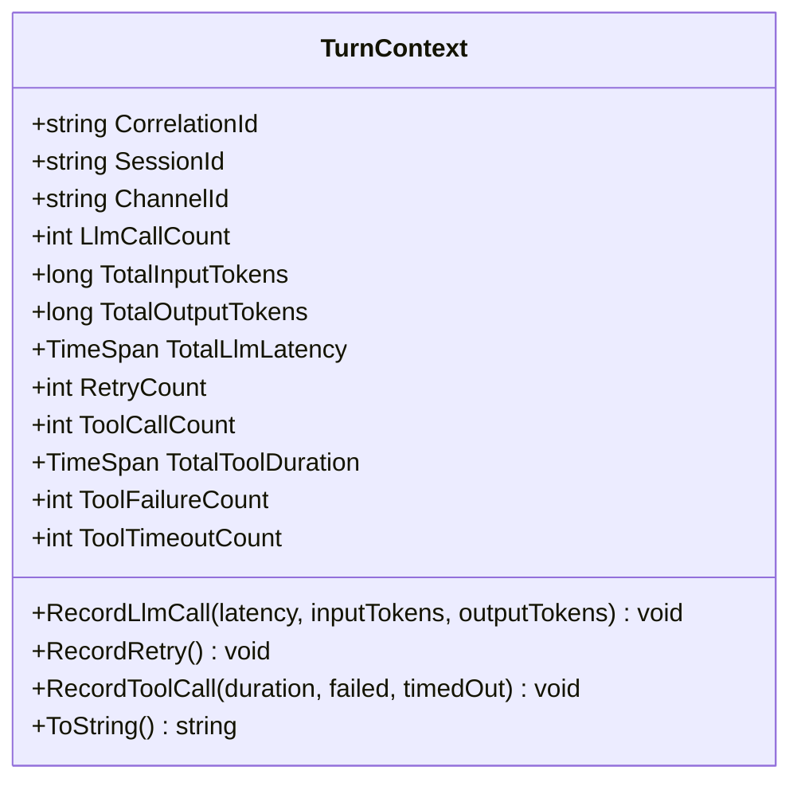
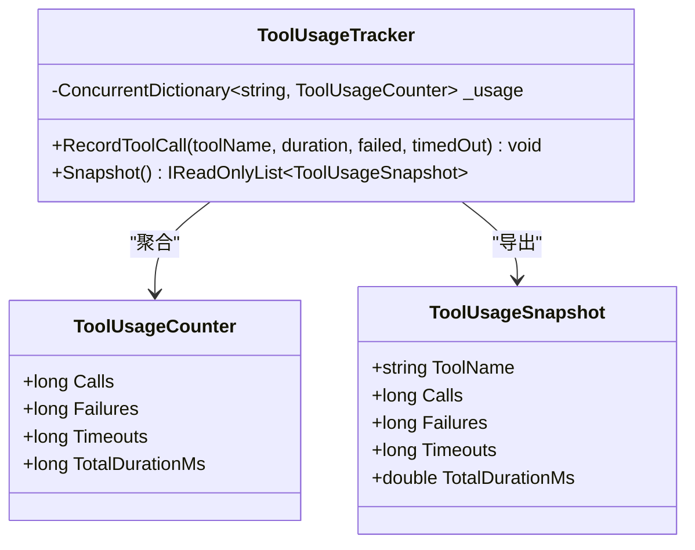
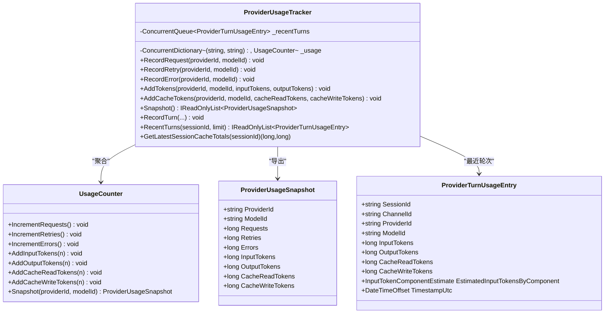
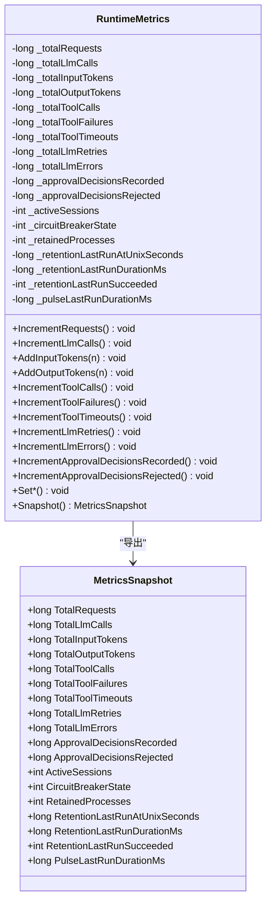
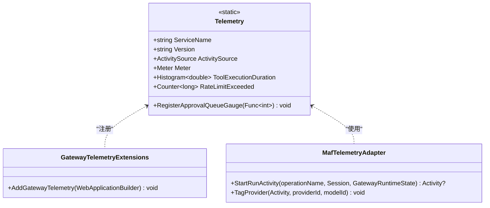
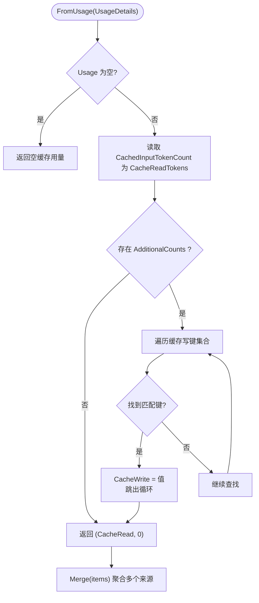
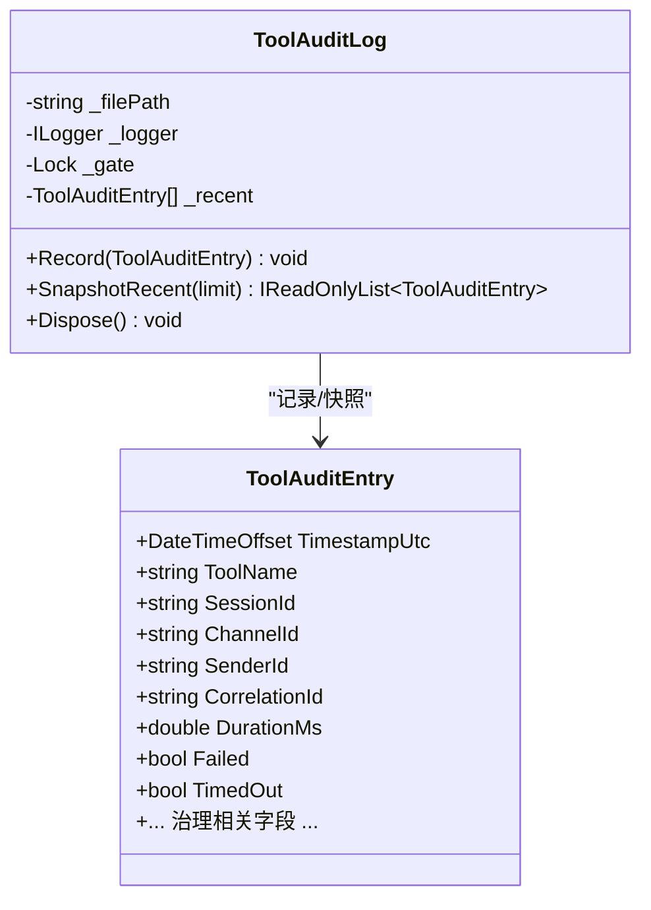
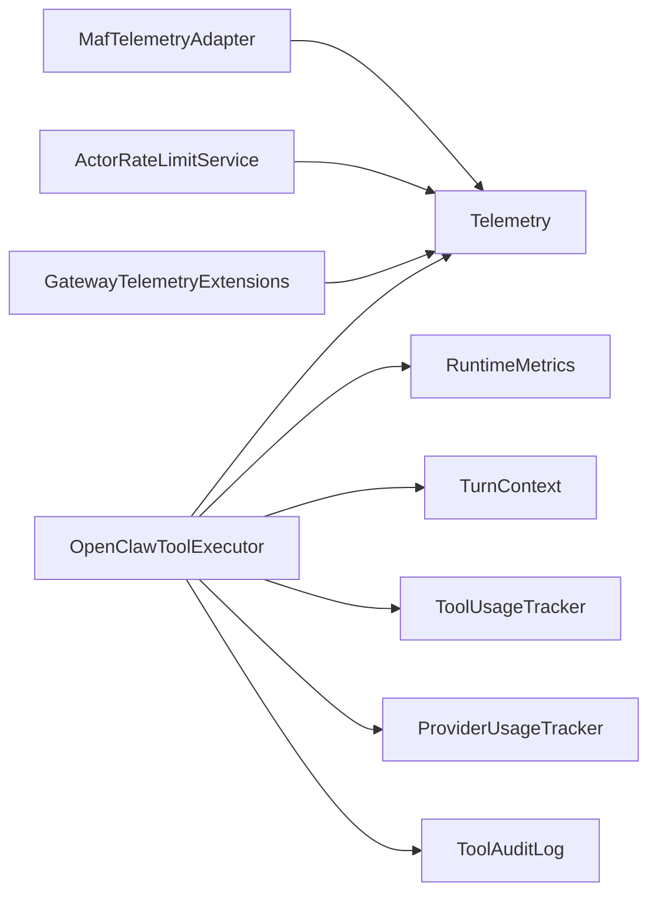

# 可观测性支持

<cite>
**本文引用的文件**
- [TurnContext.cs](file://src/OpenClaw.Core/Observability/TurnContext.cs)
- [ToolUsageTracker.cs](file://src/OpenClaw.Core/Observability/ToolUsageTracker.cs)
- [ProviderUsageTracker.cs](file://src/OpenClaw.Core/Observability/ProviderUsageTracker.cs)
- [RuntimeMetrics.cs](file://src/OpenClaw.Core/Observability/RuntimeMetrics.cs)
- [Telemetry.cs](file://src/OpenClaw.Core/Observability/Telemetry.cs)
- [PromptCacheUsage.cs](file://src/OpenClaw.Core/Observability/PromptCacheUsage.cs)
- [ToolAuditLog.cs](file://src/OpenClaw.Core/Observability/ToolAuditLog.cs)
- [GatewayTelemetryExtensions.cs](file://src/OpenClaw.Gateway/Extensions/GatewayTelemetryExtensions.cs)
- [MafTelemetryAdapter.cs](file://src/OpenClaw.Agent/MafTelemetryAdapter.cs)
- [OpenClawToolExecutor.cs](file://src/OpenClaw.Agent/OpenClawToolExecutor.cs)
- [ActorRateLimitService.cs](file://src/OpenClaw.Gateway/ActorRateLimitService.cs)
- [MafAgentRuntime.cs](file://src/OpenClaw.Agent/MafAgentRuntime.cs)
</cite>

## 目录
1. [简介](#简介)
2. [项目结构](#项目结构)
3. [核心组件](#核心组件)
4. [架构总览](#架构总览)
5. [详细组件分析](#详细组件分析)
6. [依赖关系分析](#依赖关系分析)
7. [性能考量](#性能考量)
8. [故障排查指南](#故障排查指南)
9. [结论](#结论)
10. [附录：配置与最佳实践](#附录配置与最佳实践)

## 简介
本文件系统化介绍 OpenClaw 项目中的可观测性支持模块，覆盖以下关键能力：
- TurnContext：每轮对话（turn）级上下文，统一关联 ID 并采集 LLM/工具调用级指标
- ToolUsageTracker：按工具维度的并发使用统计与快照
- ProviderUsageTracker：按提供商/模型维度的用量统计、缓存用量、最近轮次明细与会话缓存汇总
- RuntimeMetrics：运行时全局指标快照，面向健康检查与告警
- Telemetry：集中式 OpenTelemetry 活动源与度量计数器
- PromptCacheUsage：从使用详情中提取提示词缓存读写令牌
- ToolAuditLog：工具执行审计日志（JSON Lines），默认不记录敏感载荷
- 集成点：网关 Telemetry 扩展、代理适配器、工具执行器、限流服务等

目标是帮助读者理解各组件的数据采集方式、输出格式、典型使用场景，并给出监控配置示例、指标分析方法与分布式追踪、性能监控、故障诊断的最佳实践。

## 项目结构
可观测性相关代码主要位于 OpenClaw.Core 的 Observability 命名空间内，并在 Agent/Gateway 层通过扩展与适配器进行集成。

图表来源
- [TurnContext.cs:12-76](file://src/OpenClaw.Core/Observability/TurnContext.cs#L12-L76)
- [ToolUsageTracker.cs:5-59](file://src/OpenClaw.Core/Observability/ToolUsageTracker.cs#L5-L59)
- [ProviderUsageTracker.cs:7-176](file://src/OpenClaw.Core/Observability/ProviderUsageTracker.cs#L7-L176)
- [RuntimeMetrics.cs:10-312](file://src/OpenClaw.Core/Observability/RuntimeMetrics.cs#L10-L312)
- [Telemetry.cs:9-54](file://src/OpenClaw.Core/Observability/Telemetry.cs#L9-L54)
- [PromptCacheUsage.cs:5-55](file://src/OpenClaw.Core/Observability/PromptCacheUsage.cs#L5-L55)
- [ToolAuditLog.cs:39-125](file://src/OpenClaw.Core/Observability/ToolAuditLog.cs#L39-L125)
- [GatewayTelemetryExtensions.cs:18-51](file://src/OpenClaw.Gateway/Extensions/GatewayTelemetryExtensions.cs#L18-L51)
- [MafTelemetryAdapter.cs:7-25](file://src/OpenClaw.Agent/MafTelemetryAdapter.cs#L7-L25)
- [OpenClawToolExecutor.cs:162-165](file://src/OpenClaw.Agent/OpenClawToolExecutor.cs#L162-L165)
- [ActorRateLimitService.cs:133-133](file://src/OpenClaw.Gateway/ActorRateLimitService.cs#L133-L133)

章节来源
- [TurnContext.cs:1-76](file://src/OpenClaw.Core/Observability/TurnContext.cs#L1-L76)
- [ToolUsageTracker.cs:1-59](file://src/OpenClaw.Core/Observability/ToolUsageTracker.cs#L1-L59)
- [ProviderUsageTracker.cs:1-176](file://src/OpenClaw.Core/Observability/ProviderUsageTracker.cs#L1-L176)
- [RuntimeMetrics.cs:1-312](file://src/OpenClaw.Core/Observability/RuntimeMetrics.cs#L1-L312)
- [Telemetry.cs:1-54](file://src/OpenClaw.Core/Observability/Telemetry.cs#L1-L54)
- [PromptCacheUsage.cs:1-55](file://src/OpenClaw.Core/Observability/PromptCacheUsage.cs#L1-L55)
- [ToolAuditLog.cs:1-125](file://src/OpenClaw.Core/Observability/ToolAuditLog.cs#L1-L125)
- [GatewayTelemetryExtensions.cs:1-53](file://src/OpenClaw.Gateway/Extensions/GatewayTelemetryExtensions.cs#L1-L53)
- [MafTelemetryAdapter.cs:1-25](file://src/OpenClaw.Agent/MafTelemetryAdapter.cs#L1-L25)
- [OpenClawToolExecutor.cs:160-359](file://src/OpenClaw.Agent/OpenClawToolExecutor.cs#L160-L359)
- [ActorRateLimitService.cs:133-133](file://src/OpenClaw.Gateway/ActorRateLimitService.cs#L133-L133)

## 核心组件
- TurnContext：轻量每轮上下文，自动继承分布式追踪的 TraceId 或回退为短 GUID；线程安全地累积 LLM 调用、工具调用、重试、令牌用量与耗时等指标；提供结构化字符串摘要，便于日志关联
- ToolUsageTracker：基于并发字典的工具级使用统计，支持并发累加调用次数、失败次数、超时次数与总耗时（毫秒）
- ProviderUsageTracker：按提供商/模型聚合请求、重试、错误、输入/输出/缓存读写令牌；维护最近轮次队列用于会话级洞察；提供快照与最近轮次查询
- RuntimeMetrics：全局运行时指标快照，包含请求数、LLM/工具调用、令牌用量、审批决策、进程/沙箱/保留项、内存召回、提示词缓存、脉冲（Pulse）等；提供原子增减与读取接口
- Telemetry：集中式 OTel ActivitySource 与 Meter，定义工具执行耗时直方图、速率限制计数器、待审批队列可观测量表等
- PromptCacheUsage：从使用详情中提取缓存读写令牌，支持合并多个来源
- ToolAuditLog：线程安全的 JSON Lines 审计记录器，默认仅记录字节长度，避免泄露敏感载荷；提供最近条目快照

章节来源
- [TurnContext.cs:12-76](file://src/OpenClaw.Core/Observability/TurnContext.cs#L12-L76)
- [ToolUsageTracker.cs:5-59](file://src/OpenClaw.Core/Observability/ToolUsageTracker.cs#L5-L59)
- [ProviderUsageTracker.cs:7-176](file://src/OpenClaw.Core/Observability/ProviderUsageTracker.cs#L7-L176)
- [RuntimeMetrics.cs:10-312](file://src/OpenClaw.Core/Observability/RuntimeMetrics.cs#L10-L312)
- [Telemetry.cs:9-54](file://src/OpenClaw.Core/Observability/Telemetry.cs#L9-L54)
- [PromptCacheUsage.cs:5-55](file://src/OpenClaw.Core/Observability/PromptCacheUsage.cs#L5-L55)
- [ToolAuditLog.cs:39-125](file://src/OpenClaw.Core/Observability/ToolAuditLog.cs#L39-L125)

## 架构总览
可观测性在系统中的位置如下：

图表来源
- [MafAgentRuntime.cs:26-27](file://src/OpenClaw.Agent/MafAgentRuntime.cs#L26-L27)
- [OpenClawToolExecutor.cs:162-165](file://src/OpenClaw.Agent/OpenClawToolExecutor.cs#L162-L165)
- [ActorRateLimitService.cs:133-133](file://src/OpenClaw.Gateway/ActorRateLimitService.cs#L133-L133)
- [GatewayTelemetryExtensions.cs:18-51](file://src/OpenClaw.Gateway/Extensions/GatewayTelemetryExtensions.cs#L18-L51)
- [Telemetry.cs:9-54](file://src/OpenClaw.Core/Observability/Telemetry.cs#L9-L54)

## 详细组件分析

### TurnContext 组件
- 功能要点
  - 自动继承分布式追踪的 TraceId，否则生成短 GUID 作为 CorrelationId
  - 提供 SessionId/ChannelId 字段，便于跨服务关联
  - LLM 指标：调用次数、输入/输出令牌总量、总耗时、重试次数（单线程累加）
  - 工具指标：调用次数、总耗时、失败次数、超时次数（并发累加）
  - 线程安全：所有可变计数使用原子操作或 Volatile 读取
  - 输出格式：字符串摘要，包含关键指标，适合结构化日志
- 典型使用
  - 在代理执行循环中创建 TurnContext，贯穿一次用户回合的所有调用
  - 工具执行完成后调用 RecordToolCall/RecordLlmCall 记录指标
- 数据复杂度
  - 读取为 O(1)，写入为原子操作，整体开销极低

图表来源
- [TurnContext.cs:12-76](file://src/OpenClaw.Core/Observability/TurnContext.cs#L12-L76)

章节来源
- [TurnContext.cs:12-76](file://src/OpenClaw.Core/Observability/TurnContext.cs#L12-L76)

### ToolUsageTracker 组件
- 功能要点
  - 按工具名称聚合：调用次数、失败次数、超时次数、总耗时（毫秒）
  - 使用并发字典与原子操作保证并发安全
  - 快照导出：按调用次数降序、工具名升序排序
- 数据结构
  - 内部计数器包含长整型字段，总耗时以双精度位模式存储，使用 CompareExchange 实现无锁累加
- 输出格式
  - ToolUsageSnapshot 列表，包含工具名、调用次数、失败次数、超时次数、总耗时（毫秒）

图表来源
- [ToolUsageTracker.cs:5-59](file://src/OpenClaw.Core/Observability/ToolUsageTracker.cs#L5-L59)

章节来源
- [ToolUsageTracker.cs:5-59](file://src/OpenClaw.Core/Observability/ToolUsageTracker.cs#L5-L59)

### ProviderUsageTracker 组件
- 功能要点
  - 按 (ProviderId, ModelId) 聚合：请求次数、重试次数、错误次数、输入/输出令牌、缓存读写令牌
  - 维护最近轮次队列（固定上限），支持按会话筛选与限制数量
  - 提供最近轮次查询、获取最新会话缓存总计等辅助方法
  - 快照导出：按提供商/模型排序
- 数据结构
  - 使用并发字典与原子操作；最近轮次使用有界队列
- 输出格式
  - ProviderUsageSnapshot 列表；ProviderTurnUsageEntry 用于最近轮次明细

图表来源
- [ProviderUsageTracker.cs:7-176](file://src/OpenClaw.Core/Observability/ProviderUsageTracker.cs#L7-L176)

章节来源
- [ProviderUsageTracker.cs:7-176](file://src/OpenClaw.Core/Observability/ProviderUsageTracker.cs#L7-L176)

### RuntimeMetrics 组件
- 功能要点
  - 全局运行时指标，涵盖请求、LLM/工具调用、令牌用量、审批、进程/沙箱、保留项、内存召回、提示词缓存、脉冲等
  - 提供原子增减与读取接口；快照为不可变结构，便于序列化
  - 通过健康端点暴露，便于监控与告警
- 输出格式
  - MetricsSnapshot 结构体，包含所有指标字段

图表来源
- [RuntimeMetrics.cs:10-312](file://src/OpenClaw.Core/Observability/RuntimeMetrics.cs#L10-L312)

章节来源
- [RuntimeMetrics.cs:10-312](file://src/OpenClaw.Core/Observability/RuntimeMetrics.cs#L10-L312)

### Telemetry 组件
- 功能要点
  - 集中式 ActivitySource 与 Meter，服务名为固定值
  - 定义工具执行耗时直方图、速率限制计数器、待审批队列可观测量表
  - 通过网关扩展注册到 ASP.NET Core/HTTP/运行时仪器化与 OTLP 导出器
- 使用场景
  - 代理执行工具时启动活动并设置标签
  - 网关限流时增加速率限制计数器
  - 启动时注册待审批队列深度可观测量表

图表来源
- [Telemetry.cs:9-54](file://src/OpenClaw.Core/Observability/Telemetry.cs#L9-L54)
- [GatewayTelemetryExtensions.cs:18-51](file://src/OpenClaw.Gateway/Extensions/GatewayTelemetryExtensions.cs#L18-L51)
- [MafTelemetryAdapter.cs:7-25](file://src/OpenClaw.Agent/MafTelemetryAdapter.cs#L7-L25)

章节来源
- [Telemetry.cs:9-54](file://src/OpenClaw.Core/Observability/Telemetry.cs#L9-L54)
- [GatewayTelemetryExtensions.cs:18-51](file://src/OpenClaw.Gateway/Extensions/GatewayTelemetryExtensions.cs#L18-L51)
- [MafTelemetryAdapter.cs:7-25](file://src/OpenClaw.Agent/MafTelemetryAdapter.cs#L7-L25)

### PromptCacheUsage 组件
- 功能要点
  - 从使用详情中提取缓存读令牌与缓存写令牌，支持多种键名变体
  - 提供合并多个来源的缓存用量
- 使用场景
  - 与 ProviderUsageTracker 结合，计算输入令牌构成与缓存节省效果

图表来源
- [PromptCacheUsage.cs:20-54](file://src/OpenClaw.Core/Observability/PromptCacheUsage.cs#L20-L54)

章节来源
- [PromptCacheUsage.cs:5-55](file://src/OpenClaw.Core/Observability/PromptCacheUsage.cs#L5-L55)

### ToolAuditLog 组件
- 功能要点
  - 线程安全的 JSON Lines 审计记录器，支持最近条目缓冲
  - 默认不记录原始参数与结果，仅记录字节长度，降低敏感信息泄露风险
  - 初始化失败会降级禁用文件写入并记录警告
- 输出格式
  - ToolAuditEntry 结构体，包含时间戳、工具名、会话/通道/发送者 ID、关联 ID、耗时、失败/超时标记、治理评估结果等

图表来源
- [ToolAuditLog.cs:39-125](file://src/OpenClaw.Core/Observability/ToolAuditLog.cs#L39-L125)

章节来源
- [ToolAuditLog.cs:39-125](file://src/OpenClaw.Core/Observability/ToolAuditLog.cs#L39-L125)

## 依赖关系分析
- 组件耦合
  - OpenClawToolExecutor 是可观测性数据的主要采集点：记录工具执行耗时直方图、增量全局指标、更新 TurnContext、记录工具审计
  - MafTelemetryAdapter 为代理运行活动打标签，增强分布式追踪上下文
  - ActorRateLimitService 通过 Telemetry.RateLimitExceeded 记录被限流的请求数
  - GatewayTelemetryExtensions 将自定义 Meter 注册到 OTel 管道
- 外部依赖
  - OpenTelemetry 日志、指标、追踪与 OTLP 导出器
  - ASP.NET Core 与 HttpClient 仪器化
- 潜在循环依赖
  - 观测性组件均为纯数据结构与静态工具，未见循环依赖迹象

图表来源
- [OpenClawToolExecutor.cs:162-165](file://src/OpenClaw.Agent/OpenClawToolExecutor.cs#L162-L165)
- [MafTelemetryAdapter.cs:9-23](file://src/OpenClaw.Agent/MafTelemetryAdapter.cs#L9-L23)
- [ActorRateLimitService.cs:133-133](file://src/OpenClaw.Gateway/ActorRateLimitService.cs#L133-L133)
- [GatewayTelemetryExtensions.cs:33-50](file://src/OpenClaw.Gateway/Extensions/GatewayTelemetryExtensions.cs#L33-L50)

章节来源
- [OpenClawToolExecutor.cs:536-542](file://src/OpenClaw.Agent/OpenClawToolExecutor.cs#L536-L542)
- [MafTelemetryAdapter.cs:9-23](file://src/OpenClaw.Agent/MafTelemetryAdapter.cs#L9-L23)
- [ActorRateLimitService.cs:133-133](file://src/OpenClaw.Gateway/ActorRateLimitService.cs#L133-L133)
- [GatewayTelemetryExtensions.cs:18-51](file://src/OpenClaw.Gateway/Extensions/GatewayTelemetryExtensions.cs#L18-L51)

## 性能考量
- 原子操作与无锁设计
  - TurnContext/ToolUsageTracker/ProviderUsageTracker/RuntimeMetrics 均采用 Interlocked/Volatile，避免锁竞争，适合高并发场景
- 序列化与内存分配
  - RuntimeMetrics.Snapshot 返回结构体，减少 AOT 场景下的分配
  - ToolAuditLog 使用 JSON Source Generation，避免反射与额外分配
- I/O 与缓冲
  - ToolAuditLog 内置最近条目缓冲，降低频繁文件 IO；初始化失败会降级禁用文件写入
- 指标粒度
  - ToolExecutionDuration 按工具名与成功状态打标签，便于细粒度分析

## 故障排查指南
- 分布式追踪
  - 确认上游是否设置了 Activity.Current，TurnContext 会自动继承 TraceId；若无则使用短 GUID
  - 在代理执行工具时，确保已启动 Activity 并设置工具与治理相关标签
- 指标缺失
  - 检查 OpenClawToolExecutor 是否正确调用增量接口（如 IncrementToolCalls、RecordToolCall、RecordLlmCall）
  - 确认 Telemetry 已注册到 OTel 管道（GatewayTelemetryExtensions）
- 审计日志异常
  - 若初始化目录失败，会记录警告并禁用文件写入；检查路径权限与磁盘空间
  - 审计日志默认不记录原始参数/结果，仅记录字节长度，避免敏感信息泄露
- 缓存用量
  - 使用 PromptCacheUsage.FromUsage 提取缓存读写令牌，核对治理侧返回的附加计数键名

章节来源
- [TurnContext.cs:19-20](file://src/OpenClaw.Core/Observability/TurnContext.cs#L19-L20)
- [OpenClawToolExecutor.cs:162-165](file://src/OpenClaw.Agent/OpenClawToolExecutor.cs#L162-L165)
- [OpenClawToolExecutor.cs:536-542](file://src/OpenClaw.Agent/OpenClawToolExecutor.cs#L536-L542)
- [GatewayTelemetryExtensions.cs:18-51](file://src/OpenClaw.Gateway/Extensions/GatewayTelemetryExtensions.cs#L18-L51)
- [ToolAuditLog.cs:54-70](file://src/OpenClaw.Core/Observability/ToolAuditLog.cs#L54-L70)
- [PromptCacheUsage.cs:20-40](file://src/OpenClaw.Core/Observability/PromptCacheUsage.cs#L20-L40)

## 结论
该可观测性支持模块以轻量、线程安全、低开销为核心设计原则，围绕每轮对话上下文、工具与提供商维度的使用统计、全局运行时指标以及集中式 Telemetry，构建了完整的可观测性基础。结合网关 Telemetry 扩展与代理适配器，能够实现从分布式追踪到指标导出的全链路观测。建议在生产环境启用 OTLP 导出、定期审查审计日志、关注缓存命中与令牌用量趋势，并基于 RuntimeMetrics 快照建立健康检查与告警策略。

## 附录：配置与最佳实践

### 监控配置示例
- 启用网关 Telemetry（OTLP）
  - 在应用构建阶段调用 AddGatewayTelemetry，自动注册日志、指标与追踪，并启用 OTLP 导出器
  - 参考路径：[GatewayTelemetryExtensions.cs:18-51](file://src/OpenClaw.Gateway/Extensions/GatewayTelemetryExtensions.cs#L18-L51)
- 注册待审批队列深度可观测量表
  - 在启动后注册队列深度函数，以便持续观测审批积压
  - 参考路径：[Telemetry.cs:46-52](file://src/OpenClaw.Core/Observability/Telemetry.cs#L46-L52)
- 速率限制告警
  - 在限流触发处增加 RateLimitExceeded 计数器，结合阈值告警
  - 参考路径：[ActorRateLimitService.cs:133-133](file://src/OpenClaw.Gateway/ActorRateLimitService.cs#L133-L133)

### 指标分析方法
- 工具执行耗时
  - 使用 ToolExecutionDuration 直方图，按工具名与成功状态分组，识别慢调用与失败热点
  - 参考路径：[Telemetry.cs:28-32](file://src/OpenClaw.Core/Observability/Telemetry.cs#L28-L32)
- 令牌与缓存效率
  - 结合 ProviderUsageTracker 与 PromptCacheUsage，计算缓存节省率与输入令牌构成
  - 参考路径：[ProviderUsageTracker.cs:31-38](file://src/OpenClaw.Core/Observability/ProviderUsageTracker.cs#L31-L38), [PromptCacheUsage.cs:20-40](file://src/OpenClaw.Core/Observability/PromptCacheUsage.cs#L20-L40)
- 运行时健康
  - 通过 RuntimeMetrics 快照监控请求量、错误、重试、进程/沙箱状态、内存召回与脉冲运行情况
  - 参考路径：[RuntimeMetrics.cs:192-250](file://src/OpenClaw.Core/Observability/RuntimeMetrics.cs#L192-L250)

### 分布式追踪最佳实践
- 在代理执行工具前启动 Activity，设置工具名、会话/通道/运行态等标签
- 在治理决策处设置治理相关标签，便于端到端追踪
- 参考路径：[MafTelemetryAdapter.cs:9-23](file://src/OpenClaw.Agent/MafTelemetryAdapter.cs#L9-L23), [OpenClawToolExecutor.cs:162-165](file://src/OpenClaw.Agent/OpenClawToolExecutor.cs#L162-L165), [OpenClawToolExecutor.cs:675-688](file://src/OpenClaw.Agent/OpenClawToolExecutor.cs#L675-L688)

### 性能监控与故障诊断
- 高并发下优先使用原子操作组件（TurnContext/ToolUsageTracker/ProviderUsageTracker/RuntimeMetrics）
- 审计日志默认不记录敏感载荷，必要时通过结构化日志补充脱敏摘要
- 使用最近轮次明细与会话缓存总计辅助定位会话级问题
- 参考路径：[ToolAuditLog.cs:39-125](file://src/OpenClaw.Core/Observability/ToolAuditLog.cs#L39-L125), [ProviderUsageTracker.cs:95-121](file://src/OpenClaw.Core/Observability/ProviderUsageTracker.cs#L95-L121)