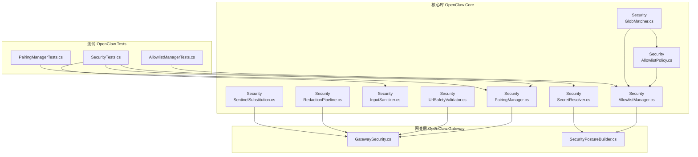
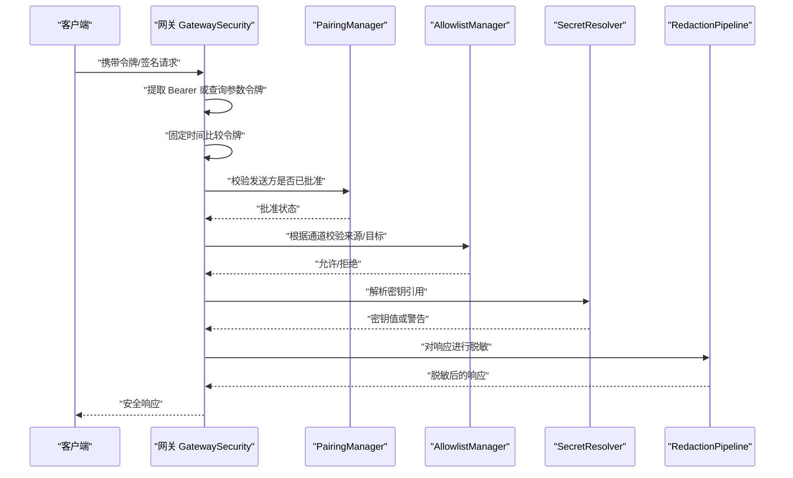
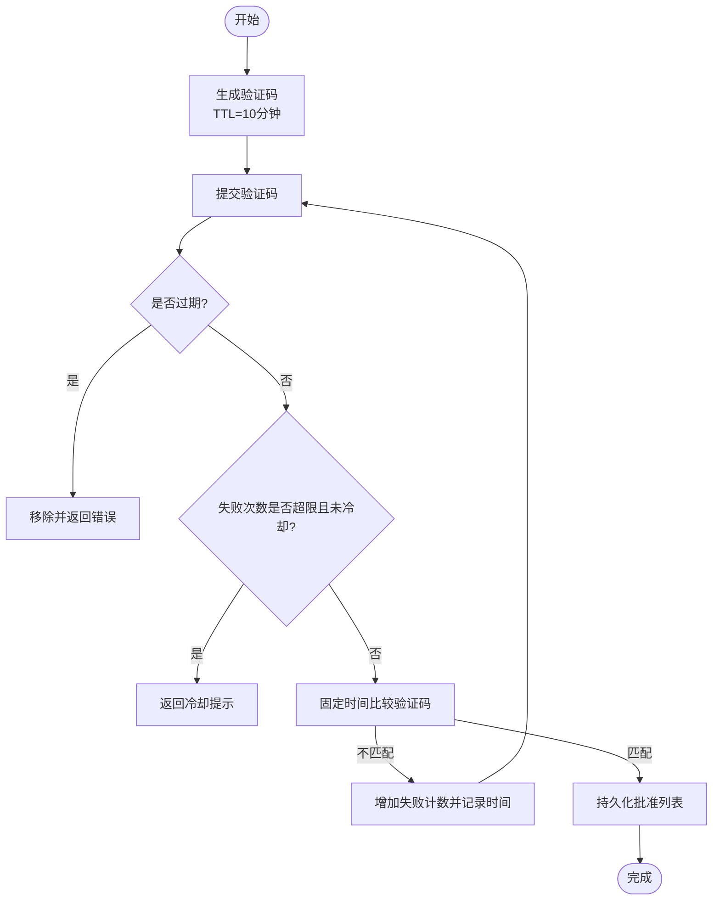
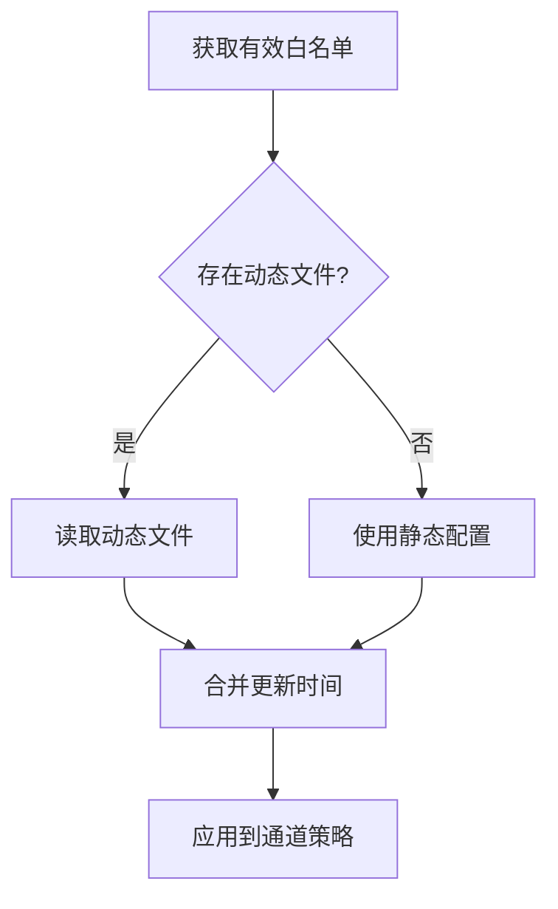
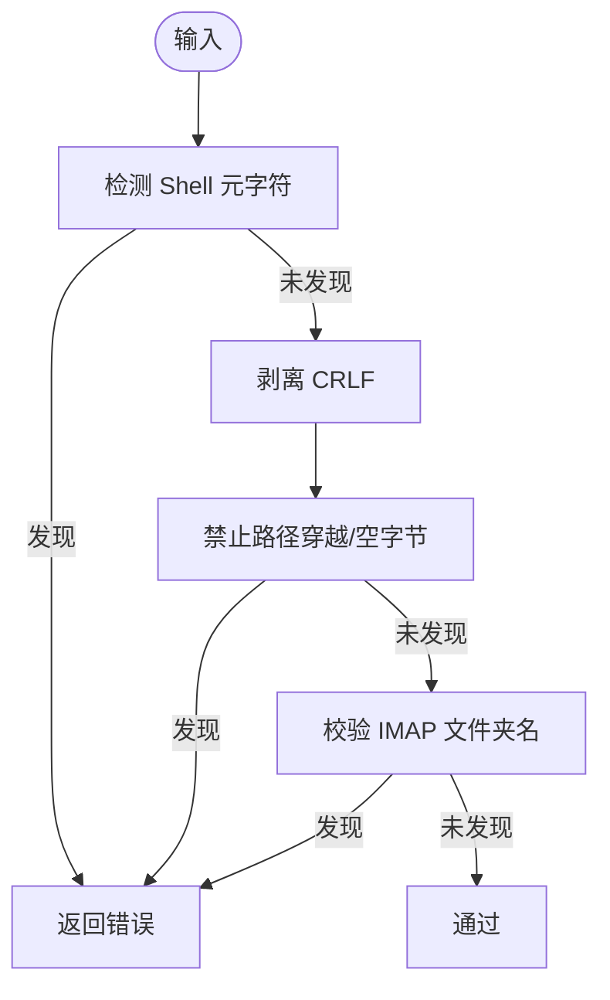
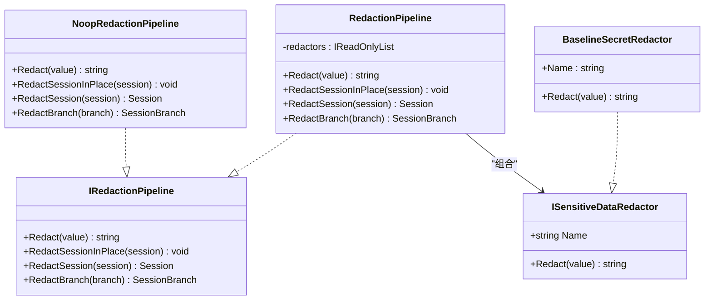
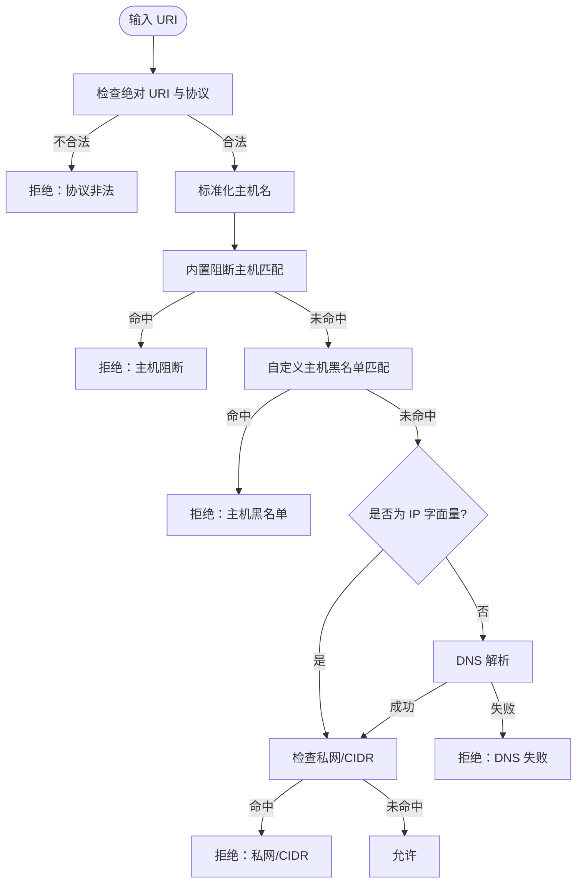
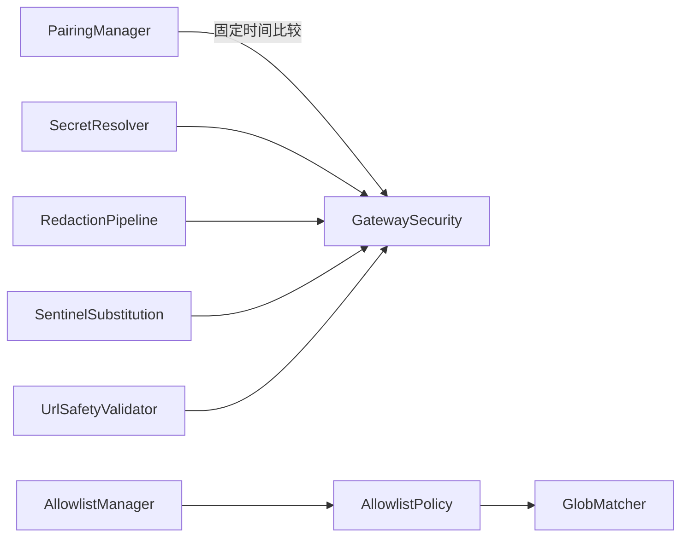

# 安全控制

<cite>
**本文引用的文件**
- [PairingManager.cs](file://src/OpenClaw.Core/Src/OpenClaw.Core/Security/PairingManager.cs)
- [AllowlistManager.cs](file://src/OpenClaw.Core/Src/OpenClaw.Core/Security/AllowlistManager.cs)
- [AllowlistPolicy.cs](file://src/OpenClaw.Core/Src/OpenClaw.Core/Security/AllowlistPolicy.cs)
- [InputSanitizer.cs](file://src/OpenClaw.Core/Src/OpenClaw.Core/Security/InputSanitizer.cs)
- [SecretResolver.cs](file://src/OpenClaw.Core/Src/OpenClaw.Core/Security/SecretResolver.cs)
- [RedactionPipeline.cs](file://src/OpenClaw.Core/Src/OpenClaw.Core/Security/RedactionPipeline.cs)
- [SentinelSubstitution.cs](file://src/OpenClaw.Core/Src/OpenClaw.Core/Security/SentinelSubstitution.cs)
- [GlobMatcher.cs](file://src/OpenClaw.Core/Src/OpenClaw.Core/Security/GlobMatcher.cs)
- [UrlSafetyValidator.cs](file://src/OpenClaw.Core/Src/OpenClaw.Core/Security/UrlSafetyValidator.cs)
- [GatewaySecurity.cs](file://src/OpenClaw.Gateway/Src/OpenClaw.Gateway/GatewaySecurity.cs)
- [SecurityPostureBuilder.cs](file://src/OpenClaw.Gateway/Src/OpenClaw.Gateway/SecurityPostureBuilder.cs)
- [SecurityTests.cs](file://src/OpenClaw.Tests/Src/OpenClaw.Tests/SecurityTests.cs)
- [PairingManagerTests.cs](file://src/OpenClaw.Tests/Src/OpenClaw.Tests/PairingManagerTests.cs)
- [AllowlistManagerTests.cs](file://src/OpenClaw.Tests/Src/OpenClaw.Tests/AllowlistManagerTests.cs)
</cite>

## 目录
1. [简介](#简介)
2. [项目结构](#项目结构)
3. [核心组件](#核心组件)
4. [架构总览](#架构总览)
5. [组件详解](#组件详解)
6. [依赖关系分析](#依赖关系分析)
7. [性能与安全特性](#性能与安全特性)
8. [故障排查指南](#故障排查指南)
9. [结论](#结论)
10. [附录：配置与最佳实践](#附录配置与最佳实践)

## 简介
本文件面向安全控制模块，系统化梳理并解释核心库中实现的关键安全机制，包括：
- PairingManager：直连消息配对流程（生成验证码、审批发送方、持久化）
- AllowlistManager：通道级白名单控制（动态/静态合并、并发安全）
- AllowlistPolicy：白名单语义（兼容/严格）与匹配策略
- InputSanitizer：输入清理（防注入、路径穿越、CRLF剥离）
- SecretResolver：密钥解析（env/raw/裸字符串回退）
- RedactionPipeline：敏感数据脱敏流水线（会话/工具调用参数/结果）
- SentinelSubstitution：哨兵替换服务（执行参数与持久化参数分离）
- GlobMatcher：通配符匹配（支持“*”）
- UrlSafetyValidator：HTTP(S) URL 安全校验（私网阻断、CIDR 黑名单）

同时给出安全策略配置示例、威胁防护机制、审计与脱敏最佳实践，以及在整体系统中的集成方式。

## 项目结构
安全相关代码主要位于 OpenClaw.Core 的 Security 目录，并在 Gateway 层提供运行时安全能力与安全态势评估；测试用例覆盖了各组件的行为与边界条件。

图表来源
- [PairingManager.cs:1-211](file://src/OpenClaw.Core/Src/OpenClaw.Core/Security/PairingManager.cs#L1-L211)
- [AllowlistManager.cs:1-126](file://src/OpenClaw.Core/Src/OpenClaw.Core/Security/AllowlistManager.cs#L1-L126)
- [AllowlistPolicy.cs:1-43](file://src/OpenClaw.Core/Src/OpenClaw.Core/Security/AllowlistPolicy.cs#L1-L43)
- [InputSanitizer.cs:1-84](file://src/OpenClaw.Core/Src/OpenClaw.Core/Security/InputSanitizer.cs#L1-L84)
- [SecretResolver.cs:1-66](file://src/OpenClaw.Core/Src/OpenClaw.Core/Security/SecretResolver.cs#L1-L66)
- [RedactionPipeline.cs:1-131](file://src/OpenClaw.Core/Src/OpenClaw.Core/Security/RedactionPipeline.cs#L1-L131)
- [SentinelSubstitution.cs:1-38](file://src/OpenClaw.Core/Src/OpenClaw.Core/Security/SentinelSubstitution.cs#L1-L38)
- [GlobMatcher.cs:1-89](file://src/OpenClaw.Core/Src/OpenClaw.Core/Security/GlobMatcher.cs#L1-L89)
- [UrlSafetyValidator.cs:1-219](file://src/OpenClaw.Core/Src/OpenClaw.Core/Security/UrlSafetyValidator.cs#L1-L219)
- [GatewaySecurity.cs:1-109](file://src/OpenClaw.Gateway/Src/OpenClaw.Gateway/GatewaySecurity.cs#L1-L109)
- [SecurityPostureBuilder.cs:1-169](file://src/OpenClaw.Gateway/Src/OpenClaw.Gateway/SecurityPostureBuilder.cs#L1-L169)
- [SecurityTests.cs:1-318](file://src/OpenClaw.Tests/Src/OpenClaw.Tests/SecurityTests.cs#L1-L318)
- [PairingManagerTests.cs:1-61](file://src/OpenClaw.Tests/Src/OpenClaw.Tests/PairingManagerTests.cs#L1-L61)
- [AllowlistManagerTests.cs:1-43](file://src/OpenClaw.Tests/Src/OpenClaw.Tests/AllowlistManagerTests.cs#L1-L43)

章节来源
- [GatewaySecurity.cs:1-109](file://src/OpenClaw.Gateway/Src/OpenClaw.Gateway/GatewaySecurity.cs#L1-L109)
- [SecurityPostureBuilder.cs:1-169](file://src/OpenClaw.Gateway/Src/OpenClaw.Gateway/SecurityPostureBuilder.cs#L1-L169)

## 核心组件
- PairingManager：管理直连消息通道的配对流程，支持一次性验证码生成、固定时间比较防时序攻击、失败冷却与持久化批准列表。
- AllowlistManager：按通道维护允许来源/目标列表，支持动态文件覆盖静态配置，提供并发安全的增删改与持久化。
- AllowlistPolicy：定义白名单语义（兼容/严格），支持通配符匹配与“*”通配。
- InputSanitizer：提供多种输入清理规则（Shell 元字符检测、CRLF 剥离、路径穿越禁止、IMAP 文件夹名控制）。
- SecretResolver：统一解析密钥引用（env:/raw:/裸字符串），在生产中推荐显式前缀避免泄露。
- RedactionPipeline：对会话历史、工具调用参数/结果进行多级脱敏，输出可审计版本。
- SentinelSubstitution：将执行参数与持久化参数进行替换，便于审计与最小暴露面。
- GlobMatcher：高性能通配符匹配，避免分配开销。
- UrlSafetyValidator：对 HTTP(S) URL 进行安全校验（仅绝对 URI、私网阻断、CIDR 黑名单、DNS 解析失败处理）。

章节来源
- [PairingManager.cs:1-211](file://src/OpenClaw.Core/Src/OpenClaw.Core/Security/PairingManager.cs#L1-L211)
- [AllowlistManager.cs:1-126](file://src/OpenClaw.Core/Src/OpenClaw.Core/Security/AllowlistManager.cs#L1-L126)
- [AllowlistPolicy.cs:1-43](file://src/OpenClaw.Core/Src/OpenClaw.Core/Security/AllowlistPolicy.cs#L1-L43)
- [InputSanitizer.cs:1-84](file://src/OpenClaw.Core/Src/OpenClaw.Core/Security/InputSanitizer.cs#L1-L84)
- [SecretResolver.cs:1-66](file://src/OpenClaw.Core/Src/OpenClaw.Core/Security/SecretResolver.cs#L1-L66)
- [RedactionPipeline.cs:1-131](file://src/OpenClaw.Core/Src/OpenClaw.Core/Security/RedactionPipeline.cs#L1-L131)
- [SentinelSubstitution.cs:1-38](file://src/OpenClaw.Core/Src/OpenClaw.Core/Security/SentinelSubstitution.cs#L1-L38)
- [GlobMatcher.cs:1-89](file://src/OpenClaw.Core/Src/OpenClaw.Core/Security/GlobMatcher.cs#L1-L89)
- [UrlSafetyValidator.cs:1-219](file://src/OpenClaw.Core/Src/OpenClaw.Core/Security/UrlSafetyValidator.cs#L1-L219)

## 架构总览
安全控制模块在运行时通过网关层进行鉴权与签名验证，并结合安全态势构建器对部署风险进行评估与建议。核心库提供输入清理、白名单、配对、密钥解析与脱敏等基础能力。

图表来源
- [GatewaySecurity.cs:1-109](file://src/OpenClaw.Gateway/Src/OpenClaw.Gateway/GatewaySecurity.cs#L1-L109)
- [PairingManager.cs:1-211](file://src/OpenClaw.Core/Src/OpenClaw.Core/Security/PairingManager.cs#L1-L211)
- [AllowlistManager.cs:1-126](file://src/OpenClaw.Core/Src/OpenClaw.Core/Security/AllowlistManager.cs#L1-L126)
- [SecretResolver.cs:1-66](file://src/OpenClaw.Core/Src/OpenClaw.Core/Security/SecretResolver.cs#L1-L66)
- [RedactionPipeline.cs:1-131](file://src/OpenClaw.Core/Src/OpenClaw.Core/Security/RedactionPipeline.cs#L1-L131)

## 组件详解

### PairingManager：配对管理
- 功能要点
  - 生成一次性验证码（6 位数字），带 TTL（默认 10 分钟）
  - 固定时间比较验证码，防止时序攻击
  - 失败次数限制与冷却（默认 5 次失败后 5 分钟内禁止尝试）
  - 批准/撤销发送方，持久化到磁盘，重启后仍有效
- 使用场景
  - 直连消息通道（如短信、Telegram）的首次接入授权
  - 防止未授权来源的消息进入系统
- 关键行为（来自测试）
  - 正确验证码批准成功且标记为已批准
  - 超过最大失败次数后触发冷却，无法继续尝试
- 安全特性
  - 固定时间比较，避免时序侧信道
  - 临时文件写入与原子移动，降低竞态风险

图表来源
- [PairingManager.cs:1-211](file://src/OpenClaw.Core/Src/OpenClaw.Core/Security/PairingManager.cs#L1-L211)
- [PairingManagerTests.cs:1-61](file://src/OpenClaw.Tests/Src/OpenClaw.Tests/PairingManagerTests.cs#L1-L61)

章节来源
- [PairingManager.cs:1-211](file://src/OpenClaw.Core/Src/OpenClaw.Core/Security/PairingManager.cs#L1-L211)
- [PairingManagerTests.cs:1-61](file://src/OpenClaw.Tests/Src/OpenClaw.Tests/PairingManagerTests.cs#L1-L61)

### AllowlistManager：白名单控制
- 功能要点
  - 按通道维护允许来源/目标列表
  - 支持动态文件覆盖静态配置，动态文件优先
  - 并发安全：按通道加锁，避免竞态
  - 路径安全：动态文件名清洗，防止目录穿越
- 使用场景
  - 控制特定通道的发送方/接收方范围
  - 在运行时动态调整白名单，无需重启
- 关键行为（来自测试）
  - 动态白名单覆盖静态配置
  - 动态文件名清洗，非法字符被过滤

图表来源
- [AllowlistManager.cs:1-126](file://src/OpenClaw.Core/Src/OpenClaw.Core/Security/AllowlistManager.cs#L1-L126)
- [AllowlistPolicy.cs:1-43](file://src/OpenClaw.Core/Src/OpenClaw.Core/Security/AllowlistPolicy.cs#L1-L43)
- [GlobMatcher.cs:1-89](file://src/OpenClaw.Core/Src/OpenClaw.Core/Security/GlobMatcher.cs#L1-L89)
- [AllowlistManagerTests.cs:1-43](file://src/OpenClaw.Tests/Src/OpenClaw.Tests/AllowlistManagerTests.cs#L1-L43)

章节来源
- [AllowlistManager.cs:1-126](file://src/OpenClaw.Core/Src/OpenClaw.Core/Security/AllowlistManager.cs#L1-L126)
- [AllowlistPolicy.cs:1-43](file://src/OpenClaw.Core/Src/OpenClaw.Core/Security/AllowlistPolicy.cs#L1-L43)
- [GlobMatcher.cs:1-89](file://src/OpenClaw.Core/Src/OpenClaw.Core/Security/GlobMatcher.cs#L1-L89)
- [AllowlistManagerTests.cs:1-43](file://src/OpenClaw.Tests/Src/OpenClaw.Tests/AllowlistManagerTests.cs#L1-L43)

### AllowlistPolicy：白名单策略
- 语义
  - 兼容模式：空白名单即允许全部（历史兼容）
  - 严格模式：空白名单即拒绝全部
- 匹配
  - 支持通配符“*”
  - 忽略空白条目与首尾空白
  - 与 GlobMatcher 协作实现高效匹配

章节来源
- [AllowlistPolicy.cs:1-43](file://src/OpenClaw.Core/Src/OpenClaw.Core/Security/AllowlistPolicy.cs#L1-L43)
- [GlobMatcher.cs:1-89](file://src/OpenClaw.Core/Src/OpenClaw.Core/Security/GlobMatcher.cs#L1-L89)

### InputSanitizer：输入清理
- 清理规则
  - Shell 元字符检测（分号、管道、重定向、反引号、美元、花括号、换行等）
  - CRLF 剥离（IMAP/SMTP 防注入）
  - 路径穿越禁止（禁止“..”、路径分隔符、空字节）
  - IMAP 文件夹名控制（禁止控制字符）
- 使用场景
  - 工具参数校验、邮件工具、数据库工具、文件读取工具等

图表来源
- [InputSanitizer.cs:1-84](file://src/OpenClaw.Core/Src/OpenClaw.Core/Security/InputSanitizer.cs#L1-L84)
- [SecurityTests.cs:1-318](file://src/OpenClaw.Tests/Src/OpenClaw.Tests/SecurityTests.cs#L1-L318)

章节来源
- [InputSanitizer.cs:1-84](file://src/OpenClaw.Core/Src/OpenClaw.Core/Security/InputSanitizer.cs#L1-L84)
- [SecurityTests.cs:1-318](file://src/OpenClaw.Tests/Src/OpenClaw.Tests/SecurityTests.cs#L1-L318)

### SecretResolver：密钥解析
- 解析策略
  - env:VAR_NAME：从环境变量读取
  - raw:literal：原始字面量（不推荐生产）
  - bare string：视为环境变量名，不存在则回退到字面量，并在日志中警告
- 安全建议
  - 生产环境必须显式使用 env: 或 raw: 前缀
  - 对于公网暴露部署，禁止使用 raw: 引用
- 关键行为（来自测试）
  - 空/空白返回 null
  - raw: 返回字面量
  - env: 读取环境变量
  - 裸字符串且类似环境变量名时发出警告但回退字面量

章节来源
- [SecretResolver.cs:1-66](file://src/OpenClaw.Core/Src/OpenClaw.Core/Security/SecretResolver.cs#L1-L66)
- [SecurityTests.cs:1-318](file://src/OpenClaw.Tests/Src/OpenClaw.Tests/SecurityTests.cs#L1-L318)
- [SecurityPostureBuilder.cs:1-169](file://src/OpenClaw.Gateway/Src/OpenClaw.Gateway/SecurityPostureBuilder.cs#L1-L169)

### RedactionPipeline：敏感数据脱敏
- 接口
  - ISensitiveDataRedactor：单值脱敏
  - IRedactionPipeline：对会话历史、工具调用参数/结果进行批量脱敏
- 默认脱敏器
  - BaselineSecretRedactor：识别 Authorization Bearer、OpenAI 密钥、API Key 字段并替换
- 使用场景
  - 审计日志输出、可观测性数据导出、调试信息打印

图表来源
- [RedactionPipeline.cs:1-131](file://src/OpenClaw.Core/Src/OpenClaw.Core/Security/RedactionPipeline.cs#L1-L131)

章节来源
- [RedactionPipeline.cs:1-131](file://src/OpenClaw.Core/Src/OpenClaw.Core/Security/RedactionPipeline.cs#L1-L131)

### SentinelSubstitution：哨兵替换
- 角色
  - 将工具执行参数与持久化参数进行替换，便于最小化暴露面与审计
- 接口
  - ISentinelSubstitutionService：异步替换上下文
  - NoopSentinelSubstitutionService：无操作实现

章节来源
- [SentinelSubstitution.cs:1-38](file://src/OpenClaw.Core/Src/OpenClaw.Core/Security/SentinelSubstitution.cs#L1-L38)

### GlobMatcher：通配符匹配
- 特性
  - 支持“*”作为任意序列匹配
  - 不使用 Split('*') 避免分配
  - 提供 Allow/Deny 评估（deny 优先）
- 应用
  - 白名单/黑名单匹配、URL 主机匹配

章节来源
- [GlobMatcher.cs:1-89](file://src/OpenClaw.Core/Src/OpenClaw.Core/Security/GlobMatcher.cs#L1-L89)
- [UrlSafetyValidator.cs:1-219](file://src/OpenClaw.Core/Src/OpenClaw.Core/Security/UrlSafetyValidator.cs#L1-L219)

### UrlSafetyValidator：URL 安全校验
- 校验维度
  - 仅允许绝对 http/https URL
  - 内置阻断主机（localhost/metadata 等）
  - 可选阻断私有网络目标与 CIDR 黑名单
  - DNS 解析失败与空结果处理
- 结果
  - 允许/拒绝及原因，可转换为工具错误消息

图表来源
- [UrlSafetyValidator.cs:1-219](file://src/OpenClaw.Core/Src/OpenClaw.Core/Security/UrlSafetyValidator.cs#L1-L219)
- [GlobMatcher.cs:1-89](file://src/OpenClaw.Core/Src/OpenClaw.Core/Security/GlobMatcher.cs#L1-L89)

章节来源
- [UrlSafetyValidator.cs:1-219](file://src/OpenClaw.Core/Src/OpenClaw.Core/Security/UrlSafetyValidator.cs#L1-L219)

## 依赖关系分析
- PairingManager 依赖固定时间比较与 JSON 持久化，确保安全性与可靠性
- AllowlistManager 依赖 AllowlistPolicy 与 GlobMatcher 实现灵活匹配
- SecretResolver 与网关安全工具协作，用于令牌与签名验证
- RedactionPipeline 与 SentinelSubstitution 为审计与最小暴露面提供支撑
- UrlSafetyValidator 与网关安全工具共同保障外联安全

图表来源
- [PairingManager.cs:1-211](file://src/OpenClaw.Core/Src/OpenClaw.Core/Security/PairingManager.cs#L1-L211)
- [AllowlistManager.cs:1-126](file://src/OpenClaw.Core/Src/OpenClaw.Core/Security/AllowlistManager.cs#L1-L126)
- [AllowlistPolicy.cs:1-43](file://src/OpenClaw.Core/Src/OpenClaw.Core/Security/AllowlistPolicy.cs#L1-L43)
- [GlobMatcher.cs:1-89](file://src/OpenClaw.Core/Src/OpenClaw.Core/Security/GlobMatcher.cs#L1-L89)
- [SecretResolver.cs:1-66](file://src/OpenClaw.Core/Src/OpenClaw.Core/Security/SecretResolver.cs#L1-L66)
- [RedactionPipeline.cs:1-131](file://src/OpenClaw.Core/Src/OpenClaw.Core/Security/RedactionPipeline.cs#L1-L131)
- [SentinelSubstitution.cs:1-38](file://src/OpenClaw.Core/Src/OpenClaw.Core/Security/SentinelSubstitution.cs#L1-L38)
- [UrlSafetyValidator.cs:1-219](file://src/OpenClaw.Core/Src/OpenClaw.Core/Security/UrlSafetyValidator.cs#L1-L219)
- [GatewaySecurity.cs:1-109](file://src/OpenClaw.Gateway/Src/OpenClaw.Gateway/GatewaySecurity.cs#L1-L109)

## 性能与安全特性
- 性能
  - InputSanitizer 使用 SIMD 加速的 SearchValues 与 Span 匹配，避免分配
  - GlobMatcher 使用 Span 与一次性扫描，避免 Split 分割
  - PairingManager 使用并发字典与原子持久化，降低锁竞争
- 安全
  - 固定时间比较（令牌/验证码）防止时序攻击
  - 私网阻断与 CIDR 黑名单减少 SSRF 风险
  - 动态白名单与并发锁避免竞态与越权
  - 脱敏流水线对敏感字段进行统一替换

[本节为通用讨论，不直接分析具体文件]

## 故障排查指南
- 配对失败
  - 检查验证码是否过期或失败次数过多导致冷却
  - 确认存储目录权限与磁盘可用空间
- 白名单不生效
  - 确认动态文件是否覆盖静态配置
  - 检查动态文件名清洗与路径合法性
- 输入被拒绝
  - 检查是否包含 Shell 元字符、CRLF、路径穿越或控制字符
- 密钥解析告警
  - 生产环境应使用 env: 显式声明，避免裸字符串回退
- URL 访问被拒
  - 检查是否为私网地址、是否命中 CIDR 黑名单或 DNS 解析异常

章节来源
- [PairingManagerTests.cs:1-61](file://src/OpenClaw.Tests/Src/OpenClaw.Tests/PairingManagerTests.cs#L1-L61)
- [AllowlistManagerTests.cs:1-43](file://src/OpenClaw.Tests/Src/OpenClaw.Tests/AllowlistManagerTests.cs#L1-L43)
- [SecurityTests.cs:1-318](file://src/OpenClaw.Tests/Src/OpenClaw.Tests/SecurityTests.cs#L1-L318)

## 结论
安全控制模块通过“输入清理—身份配对—白名单—密钥解析—脱敏—URL 安全—签名与令牌”的多层防御，构建了从入口到输出的全链路安全体系。建议在公网部署中强制启用 env: 密钥前缀、私网阻断、严格白名单与脱敏审计，并结合安全态势评估持续优化。

[本节为总结性内容，不直接分析具体文件]

## 附录：配置与最佳实践

- 安全策略配置示例
  - 白名单语义
    - 兼容模式：空白白名单允许全部（历史兼容）
    - 严格模式：空白白名单拒绝全部（默认推荐）
  - URL 安全策略
    - 启用私网阻断与 CIDR 黑名单
    - 仅允许 http/https 绝对 URL
  - 密钥引用
    - 生产环境必须使用 env: 或 raw: 前缀
    - 公网暴露部署禁止使用 raw: 引用

- 威胁防护机制
  - 时序攻击防护：固定时间比较
  - 注入攻击防护：Shell 元字符检测、CRLF 剥离、路径穿越禁止
  - SSRF 防护：私网阻断、CIDR 黑名单、DNS 失败处理
  - 越权访问防护：通道级白名单、动态覆盖、并发安全

- 审计与脱敏最佳实践
  - 对会话历史与工具调用参数/结果进行脱敏
  - 使用哨兵替换区分执行参数与持久化参数
  - 审计日志中避免输出明文敏感信息

- 集成方式
  - 网关层负责令牌/签名验证与安全态势评估
  - 核心库提供输入清理、白名单、配对、密钥解析与脱敏等基础能力
  - 测试用例覆盖关键边界条件，保障稳定性与安全性

章节来源
- [AllowlistPolicy.cs:1-43](file://src/OpenClaw.Core/Src/OpenClaw.Core/Security/AllowlistPolicy.cs#L1-L43)
- [UrlSafetyValidator.cs:1-219](file://src/OpenClaw.Core/Src/OpenClaw.Core/Security/UrlSafetyValidator.cs#L1-L219)
- [SecretResolver.cs:1-66](file://src/OpenClaw.Core/Src/OpenClaw.Core/Security/SecretResolver.cs#L1-L66)
- [RedactionPipeline.cs:1-131](file://src/OpenClaw.Core/Src/OpenClaw.Core/Security/RedactionPipeline.cs#L1-L131)
- [SecurityPostureBuilder.cs:1-169](file://src/OpenClaw.Gateway/Src/OpenClaw.Gateway/SecurityPostureBuilder.cs#L1-L169)