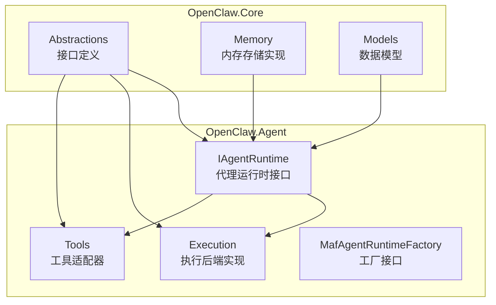
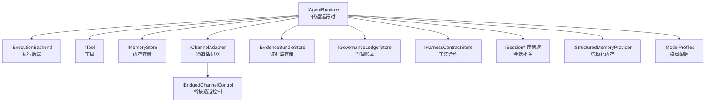
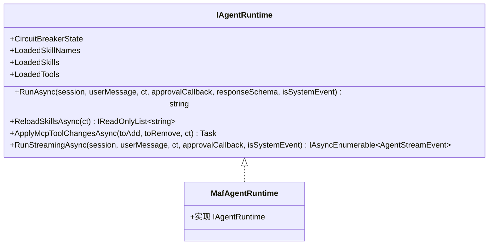
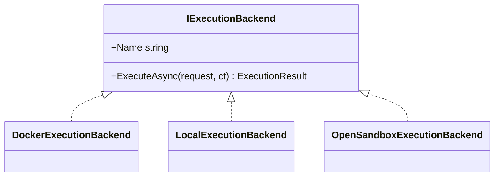
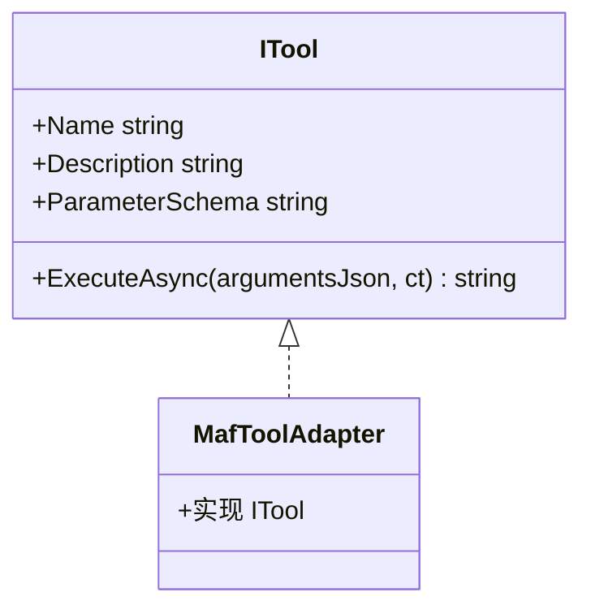
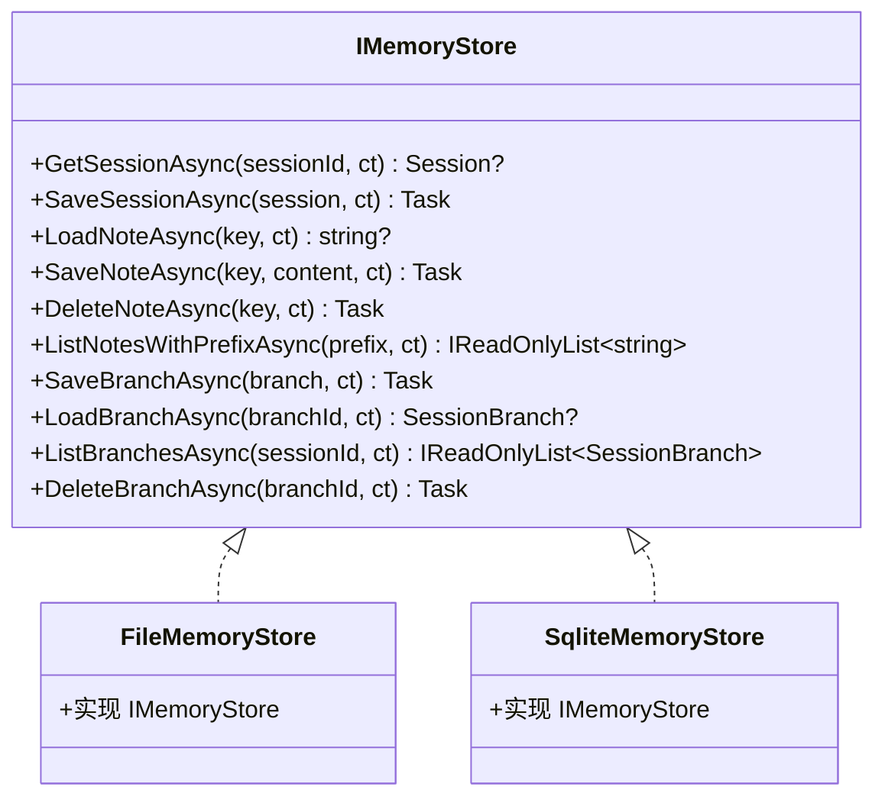
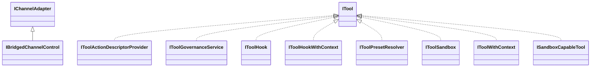
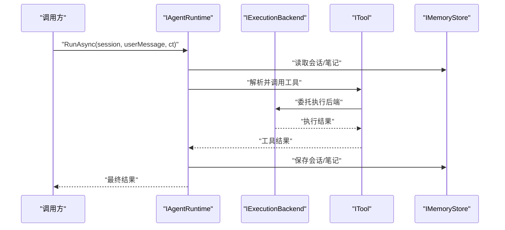
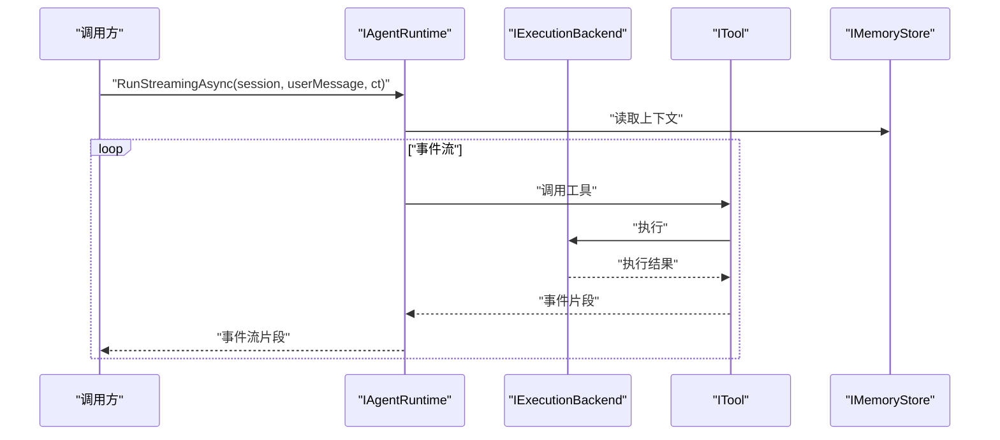
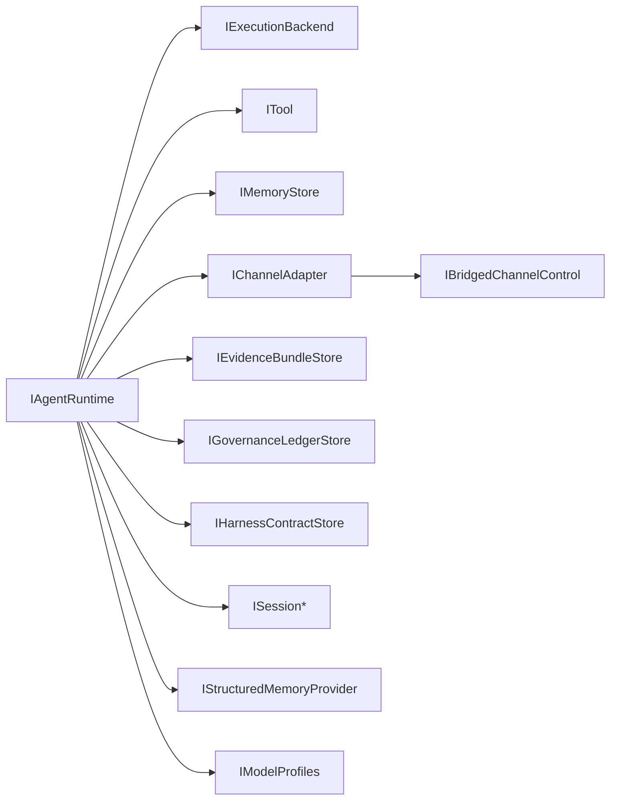

# 抽象接口

<cite>
**本文引用的文件**
- [IAgentRuntime.cs](file://src/OpenClaw.Agent/IAgentRuntime.cs)
- [IExecutionBackend.cs](file://src/OpenClaw.Core/Abstractions/IExecutionBackend.cs)
- [ITool.cs](file://src/OpenClaw.Core/Abstractions/ITool.cs)
- [IMemoryStore.cs](file://src/OpenClaw.Core/Abstractions/IMemoryStore.cs)
- [IChannelAdapter.cs](file://src/OpenClaw.Core/Abstractions/IChannelAdapter.cs)
- [IBridgedChannelControl.cs](file://src/OpenClaw.Core/Abstractions/IBridgedChannelControl.cs)
- [IEvidenceBundleStore.cs](file://src/OpenClaw.Core/Abstractions/IEvidenceBundleStore.cs)
- [IGovernanceLedgerStore.cs](file://src/OpenClaw.Core/Abstractions/IGovernanceLedgerStore.cs)
- [IHarnessContractStore.cs](file://src/OpenClaw.Core/Abstractions/IHarnessContractStore.cs)
- [ISessionAdminStore.cs](file://src/OpenClaw.Core/Abstractions/ISessionAdminStore.cs)
- [ISessionMetadataStore.cs](file://src/OpenClaw.Core/Abstractions/ISessionMetadataStore.cs)
- [ISessionSearchStore.cs](file://src/OpenClaw.Core/Abstractions/ISessionSearchStore.cs)
- [ISharedHarnessStateStore.cs](file://src/OpenClaw.Core/Abstractions/ISharedHarnessStateStore.cs)
- [IUserProfi leStore.cs](file://src/OpenClaw.Core/Abstractions/IUserProfileStore.cs)
- [IMemoryRetentionStore.cs](file://src/OpenClaw.Core/Abstractions/IMemoryRetentionStore.cs)
- [IMemoryNoteSearch.cs](file://src/OpenClaw.Core/Abstractions/IMemoryNoteSearch.cs)
- [IStructuredMemoryProvider.cs](file://src/OpenClaw.Core/Abstractions/IStructuredMemoryProvider.cs)
- [IModelProfiles.cs](file://src/OpenClaw.Core/Abstractions/IModelProfiles.cs)
- [ICodingAgentBackend.cs](file://src/OpenClaw.Core/Abstractions/ICodingAgentBackend.cs)
- [ICodingAgentBackendRegistry.cs](file://src/OpenClaw.Core/Abstractions/ICodingAgentBackendRegistry.cs)
- [IConnectedAccountStore.cs](file://src/OpenClaw.Core/Abstractions/IConnectedAccountStore.cs)
- [IBackendSessionStore.cs](file://src/OpenClaw.Core/Abstractions/IBackendSessionStore.cs)
- [IBackendCredentialResolver.cs](file://src/OpenClaw.Core/Abstractions/IBackendCredentialResolver.cs)
- [IBackendSessionRuntime.cs](file://src/OpenClaw.Core/Abstractions/IBackendSessionRuntime.cs)
- [IAgentWorkflowRunner.cs](file://src/OpenClaw.Core/Abstractions/IAgentWorkflowRunner.cs)
- [IAutomationRunDispatcher.cs](file://src/OpenClaw.Core/Abstractions/IAutomationRunDispatcher.cs)
- [IPlanExecuteVerifyOrchestrator.cs](file://src/OpenClaw.Core/Abstractions/IPlanExecuteVerifyOrchestrator.cs)
- [IStreamingTool.cs](file://src/OpenClaw.Core/Abstractions/IStreamingTool.cs)
- [ITool.cs](file://src/OpenClaw.Core/Abstractions/ITool.cs)
- [IToolActionDescriptorProvider.cs](file://src/OpenClaw.Core/Abstractions/IToolActionDescriptorProvider.cs)
- [IToolGovernanceService.cs](file://src/OpenClaw.Core/Abstractions/IToolGovernanceService.cs)
- [IToolHook.cs](file://src/OpenClaw.Core/Abstractions/IToolHook.cs)
- [IToolHookWithContext.cs](file://src/OpenClaw.Core/Abstractions/IToolHookWithContext.cs)
- [IToolPresetResolver.cs](file://src/OpenClaw.Core/Abstractions/IToolPresetResolver.cs)
- [IToolSandbox.cs](file://src/OpenClaw.Core/Abstractions/IToolSandbox.cs)
- [IToolWithContext.cs](file://src/OpenClaw.Core/Abstractions/IToolWithContext.cs)
- [ISandboxCapableTool.cs](file://src/OpenClaw.Core/Abstractions/ISandboxCapableTool.cs)
- [ToolHookContext.cs](file://src/OpenClaw.Core/Abstractions/ToolHookContext.cs)
- [ToolSandboxException.cs](file://src/OpenClaw.Core/Abstractions/ToolSandboxException.cs)
- [MafAgentRuntime.cs](file://src/OpenClaw.Agent/MafAgentRuntime.cs)
- [MafExecutionBackend.cs](file://src/OpenClaw.Agent/Execution/DockerExecutionBackend.cs)
- [LocalExecutionBackend.cs](file://src/OpenClaw.Agent/Execution/LocalExecutionBackend.cs)
- [OpenSandboxExecutionBackend.cs](file://src/OpenClaw.Agent/Execution/OpenSandboxExecutionBackend.cs)
- [FileMemoryStore.cs](file://src/OpenClaw.Core/Memory/FileMemoryStore.cs)
- [SqliteMemoryStore.cs](file://src/OpenClaw.Core/Memory/SqliteMemoryStore.cs)
- [MafToolAdapter.cs](file://src/OpenClaw.Agent/MafToolAdapter.cs)
- [MafExecutionServiceChatClient.cs](file://src/OpenClaw.Agent/MafExecutionServiceChatClient.cs)
- [MafSessionStateStore.cs](file://src/OpenClaw.Agent/MafSessionStateStore.cs)
- [MafTelemetryAdapter.cs](file://src/OpenClaw.Agent/MafTelemetryAdapter.cs)
- [MafAgentRuntimeFactory.cs](file://src/OpenClaw.Agent/MafAgentRuntimeFactory.cs)
- [MafAgentFactory.cs](file://src/OpenClaw.Agent/MafAgentFactory.cs)
- [MafExecutionContext.cs](file://src/OpenClaw.Agent/MafExecutionContext.cs)
- [MafOptions.cs](file://src/OpenClaw.Agent/MafOptions.cs)
- [MafJsonContext.cs](file://src/OpenClaw.Agent/MafJsonContext.cs)
- [MafCapabilities.cs](file://src/OpenClaw.Agent/MafCapabilities.cs)
- [MafServiceCollectionExtensions.cs](file://src/OpenClaw.Agent/MafServiceCollectionExtensions.cs)
- [MafAgentRuntimeFactory.cs](file://src/OpenClaw.Agent/IAgentRuntimeFactory.cs)
- [MafAgentRuntime.cs](file://src/OpenClaw.Agent/IAgentRuntime.cs)
- [MafExecutionBackend.cs](file://src/OpenClaw.Agent/Execution/DockerExecutionBackend.cs)
- [LocalExecutionBackend.cs](file://src/OpenClaw.Agent/Execution/LocalExecutionBackend.cs)
- [OpenSandboxExecutionBackend.cs](file://src/OpenClaw.Agent/Execution/OpenSandboxExecutionBackend.cs)
- [FileMemoryStore.cs](file://src/OpenClaw.Core/Memory/FileMemoryStore.cs)
- [SqliteMemoryStore.cs](file://src/OpenClaw.Core/Memory/SqliteMemoryStore.cs)
- [MafToolAdapter.cs](file://src/OpenClaw.Agent/MafToolAdapter.cs)
- [MafExecutionServiceChatClient.cs](file://src/OpenClaw.Agent/MafExecutionServiceChatClient.cs)
- [MafSessionStateStore.cs](file://src/OpenClaw.Agent/MafSessionStateStore.cs)
- [MafTelemetryAdapter.cs](file://src/OpenClaw.Agent/MafTelemetryAdapter.cs)
- [MafAgentRuntimeFactory.cs](file://src/OpenClaw.Agent/MafAgentRuntimeFactory.cs)
- [MafAgentFactory.cs](file://src/OpenClaw.Agent/MafAgentFactory.cs)
- [MafExecutionContext.cs](file://src/OpenClaw.Agent/MafExecutionContext.cs)
- [MafOptions.cs](file://src/OpenClaw.Agent/MafOptions.cs)
- [MafJsonContext.cs](file://src/OpenClaw.Agent/MafJsonContext.cs)
- [MafCapabilities.cs](file://src/OpenClaw.Agent/MafCapabilities.cs)
- [MafServiceCollectionExtensions.cs](file://src/OpenClaw.Agent/MafServiceCollectionExtensions.cs)
</cite>

## 目录
1. [引言](#引言)
2. [项目结构](#项目结构)
3. [核心组件](#核心组件)
4. [架构总览](#架构总览)
5. [详细组件分析](#详细组件分析)
6. [依赖分析](#依赖分析)
7. [性能考虑](#性能考虑)
8. [故障排除指南](#故障排除指南)
9. [结论](#结论)
10. [附录](#附录)

## 引言
本文件聚焦于抽象接口模块，系统梳理并深入解析核心库与代理运行时中定义的关键抽象接口，包括但不限于 IAgentRuntime、IExecutionBackend、ITool、IMemoryStore 等。文档从设计理念、方法签名、参数与返回值、使用场景、最佳实践、扩展指南与常见实现模式等维度展开，辅以接口关系图与调用序列图，帮助读者快速理解这些接口在整体架构中的职责边界与协作方式。

## 项目结构
抽象接口主要分布在以下两个工程中：
- OpenClaw.Core：定义通用抽象与模型契约，如 IExecutionBackend、ITool、IMemoryStore、各类存储与治理相关接口等。
- OpenClaw.Agent：定义代理运行时相关抽象，如 IAgentRuntime、工厂接口、执行后端适配器等。

**图表来源**
- [IAgentRuntime.cs:1-51](file://src/OpenClaw.Agent/IAgentRuntime.cs#L1-L51)
- [IExecutionBackend.cs:1-13](file://src/OpenClaw.Core/Abstractions/IExecutionBackend.cs#L1-L13)
- [ITool.cs:1-17](file://src/OpenClaw.Core/Abstractions/ITool.cs#L1-L17)
- [IMemoryStore.cs:1-24](file://src/OpenClaw.Core/Abstractions/IMemoryStore.cs#L1-L24)

**章节来源**
- [IAgentRuntime.cs:1-51](file://src/OpenClaw.Agent/IAgentRuntime.cs#L1-L51)
- [IExecutionBackend.cs:1-13](file://src/OpenClaw.Core/Abstractions/IExecutionBackend.cs#L1-L13)
- [ITool.cs:1-17](file://src/OpenClaw.Core/Abstractions/ITool.cs#L1-L17)
- [IMemoryStore.cs:1-24](file://src/OpenClaw.Core/Abstractions/IMemoryStore.cs#L1-L24)

## 核心组件
本节对关键抽象接口进行逐项解析，涵盖设计目标、方法语义、参数与返回值、典型使用场景与实现建议。

- IAgentRuntime（代理运行时）
  - 设计理念：统一代理生命周期管理、技能加载与热替换、流式与非流式对话执行、MCP 工具表面变更应用等。
  - 关键方法与语义
    - RunAsync：执行一次非流式对话，支持会话上下文、用户消息、工具审批回调、可选响应模式与系统事件标记。
    - RunStreamingAsync：执行流式对话，返回事件流，便于前端实时渲染或增量处理。
    - ReloadSkillsAsync：重载已加载技能集合，支持动态更新。
    - ApplyMcpToolChangesAsync：应用 MCP 工具增删变更，用于动态扩展工具面。
    - 属性：电路状态、已加载技能快照、已加载工具声明（扩展属性）。
  - 使用场景：作为代理调度中心，协调工具执行、会话状态与外部服务交互。
  - 实现要点：需保证并发安全、资源释放与可观测性；支持取消令牌与异步枚举。

- IExecutionBackend（执行后端）
  - 设计理念：抽象工具执行的底层执行环境，屏蔽本地、容器、远程等差异。
  - 关键方法与语义
    - Name：后端标识。
    - ExecuteAsync：执行请求并返回结果，支持取消。
  - 使用场景：工具执行路由与后端选择，结合工具沙箱策略。
  - 实现要点：确保幂等与可恢复性；错误隔离与超时控制。

- ITool（工具）
  - 设计理念：最小化以适配 AOT 削减，仅暴露名称、描述、参数模式与异步执行。
  - 关键方法与语义
    - Name、Description：元信息。
    - ParameterSchema：JSON Schema 描述参数结构。
    - ExecuteAsync：以 JSON 字符串形式接收参数，返回字符串结果，支持取消。
  - 使用场景：统一工具注册、调用与治理，便于跨后端复用。
  - 实现要点：严格遵守参数 Schema；输出结果应为可序列化文本；避免阻塞操作。

- IMemoryStore（内存存储）
  - 设计理念：持久化会话与笔记，支持前缀列表、分支会话等能力，文件系统优先。
  - 关键方法与语义
    - 会话：读取、保存、删除、列出分支。
    - 笔记：读取、保存、删除、按前缀列出。
  - 使用场景：会话记忆、知识检索、多分支探索与回溯。
  - 实现要点：并发一致性、事务性写入、索引优化与清理策略。

**章节来源**
- [IAgentRuntime.cs:1-51](file://src/OpenClaw.Agent/IAgentRuntime.cs#L1-L51)
- [IExecutionBackend.cs:1-13](file://src/OpenClaw.Core/Abstractions/IExecutionBackend.cs#L1-L13)
- [ITool.cs:1-17](file://src/OpenClaw.Core/Abstractions/ITool.cs#L1-L17)
- [IMemoryStore.cs:1-24](file://src/OpenClaw.Core/Abstractions/IMemoryStore.cs#L1-L24)

## 架构总览
下图展示抽象接口在整体架构中的位置与交互关系，突出 IAgentRuntime 作为中枢，协调 IExecutionBackend、ITool、IMemoryStore 等组件。

**图表来源**
- [IAgentRuntime.cs:1-51](file://src/OpenClaw.Agent/IAgentRuntime.cs#L1-L51)
- [IExecutionBackend.cs:1-13](file://src/OpenClaw.Core/Abstractions/IExecutionBackend.cs#L1-L13)
- [ITool.cs:1-17](file://src/OpenClaw.Core/Abstractions/ITool.cs#L1-L17)
- [IMemoryStore.cs:1-24](file://src/OpenClaw.Core/Abstractions/IMemoryStore.cs#L1-L24)
- [IChannelAdapter.cs](file://src/OpenClaw.Core/Abstractions/IChannelAdapter.cs)
- [IBridgedChannelControl.cs](file://src/OpenClaw.Core/Abstractions/IBridgedChannelControl.cs)
- [IEvidenceBundleStore.cs](file://src/OpenClaw.Core/Abstractions/IEvidenceBundleStore.cs)
- [IGovernanceLedgerStore.cs](file://src/OpenClaw.Core/Abstractions/IGovernanceLedgerStore.cs)
- [IHarnessContractStore.cs](file://src/OpenClaw.Core/Abstractions/IHarnessContractStore.cs)
- [ISessionAdminStore.cs](file://src/OpenClaw.Core/Abstractions/ISessionAdminStore.cs)
- [ISessionMetadataStore.cs](file://src/OpenClaw.Core/Abstractions/ISessionMetadataStore.cs)
- [ISessionSearchStore.cs](file://src/OpenClaw.Core/Abstractions/ISessionSearchStore.cs)
- [ISharedHarnessStateStore.cs](file://src/OpenClaw.Core/Abstractions/ISharedHarnessStateStore.cs)
- [IUserProfi leStore.cs](file://src/OpenClaw.Core/Abstractions/IUserProfileStore.cs)
- [IMemoryRetentionStore.cs](file://src/OpenClaw.Core/Abstractions/IMemoryRetentionStore.cs)
- [IMemoryNoteSearch.cs](file://src/OpenClaw.Core/Abstractions/IMemoryNoteSearch.cs)
- [IStructuredMemoryProvider.cs](file://src/OpenClaw.Core/Abstractions/IStructuredMemoryProvider.cs)
- [IModelProfiles.cs](file://src/OpenClaw.Core/Abstractions/IModelProfiles.cs)

## 详细组件分析

### IAgentRuntime 分析
- 角色定位：代理运行时的核心抽象，负责对话执行、技能管理、工具应用与事件流输出。
- 方法与参数
  - RunAsync：会话对象、用户消息、取消令牌、工具审批回调、可选响应模式、系统事件标记。
  - RunStreamingAsync：会话对象、用户消息、取消令牌、工具审批回调、系统事件标记。
  - ReloadSkillsAsync：无参或带取消令牌。
  - ApplyMcpToolChangesAsync：新增工具集合、移除工具名集合。
- 返回值与异常：非流式返回字符串结果；流式返回事件枚举；异常通过运行时传播。
- 典型实现：MafAgentRuntime 提供具体实现，配合工厂、执行服务、工具适配器与会话状态存储。

**图表来源**
- [IAgentRuntime.cs:1-51](file://src/OpenClaw.Agent/IAgentRuntime.cs#L1-L51)
- [MafAgentRuntime.cs](file://src/OpenClaw.Agent/MafAgentRuntime.cs)

**章节来源**
- [IAgentRuntime.cs:1-51](file://src/OpenClaw.Agent/IAgentRuntime.cs#L1-L51)
- [MafAgentRuntime.cs](file://src/OpenClaw.Agent/MafAgentRuntime.cs)

### IExecutionBackend 分析
- 角色定位：封装工具执行的具体后端，屏蔽本地、容器、远程等差异。
- 方法与参数
  - Name：后端名称。
  - ExecuteAsync：执行请求、取消令牌。
- 返回值与异常：返回执行结果；异常通过后端实现处理。
- 典型实现：DockerExecutionBackend、LocalExecutionBackend、OpenSandboxExecutionBackend 等。

**图表来源**
- [IExecutionBackend.cs:1-13](file://src/OpenClaw.Core/Abstractions/IExecutionBackend.cs#L1-L13)
- [MafExecutionBackend.cs](file://src/OpenClaw.Agent/Execution/DockerExecutionBackend.cs)
- [LocalExecutionBackend.cs](file://src/OpenClaw.Agent/Execution/LocalExecutionBackend.cs)
- [OpenSandboxExecutionBackend.cs](file://src/OpenClaw.Agent/Execution/OpenSandboxExecutionBackend.cs)

**章节来源**
- [IExecutionBackend.cs:1-13](file://src/OpenClaw.Core/Abstractions/IExecutionBackend.cs#L1-L13)
- [MafExecutionBackend.cs](file://src/OpenClaw.Agent/Execution/DockerExecutionBackend.cs)
- [LocalExecutionBackend.cs](file://src/OpenClaw.Agent/Execution/LocalExecutionBackend.cs)
- [OpenSandboxExecutionBackend.cs](file://src/OpenClaw.Agent/Execution/OpenSandboxExecutionBackend.cs)

### ITool 分析
- 角色定位：工具的最小契约，强调 AOT 友好与跨后端复用。
- 方法与参数
  - Name、Description：元信息。
  - ParameterSchema：JSON Schema。
  - ExecuteAsync：参数 JSON、取消令牌。
- 返回值与异常：返回字符串结果；异常通过工具实现处理。
- 典型实现：多种内置工具（浏览器、文件读写、Git、数据库、Home Assistant 等），均实现 ITool。

**图表来源**
- [ITool.cs:1-17](file://src/OpenClaw.Core/Abstractions/ITool.cs#L1-L17)
- [MafToolAdapter.cs](file://src/OpenClaw.Agent/MafToolAdapter.cs)

**章节来源**
- [ITool.cs:1-17](file://src/OpenClaw.Core/Abstractions/ITool.cs#L1-L17)
- [MafToolAdapter.cs](file://src/OpenClaw.Agent/MafToolAdapter.cs)

### IMemoryStore 分析
- 角色定位：会话与笔记的持久化存储抽象，支持分支会话与前缀查询。
- 方法与参数
  - 会话：GetSessionAsync、SaveSessionAsync、DeleteNoteAsync、ListNotesWithPrefixAsync。
  - 分支：SaveBranchAsync、LoadBranchAsync、ListBranchesAsync、DeleteBranchAsync。
- 返回值与异常：ValueTask 包裹结果；异常通过存储实现处理。
- 典型实现：FileMemoryStore（文件系统）、SqliteMemoryStore（SQLite）。

**图表来源**
- [IMemoryStore.cs:1-24](file://src/OpenClaw.Core/Abstractions/IMemoryStore.cs#L1-L24)
- [FileMemoryStore.cs](file://src/OpenClaw.Core/Memory/FileMemoryStore.cs)
- [SqliteMemoryStore.cs](file://src/OpenClaw.Core/Memory/SqliteMemoryStore.cs)

**章节来源**
- [IMemoryStore.cs:1-24](file://src/OpenClaw.Core/Abstractions/IMemoryStore.cs#L1-L24)
- [FileMemoryStore.cs](file://src/OpenClaw.Core/Memory/FileMemoryStore.cs)
- [SqliteMemoryStore.cs](file://src/OpenClaw.Core/Memory/SqliteMemoryStore.cs)

### 接口继承与组合关系
- IChannelAdapter 与 IBridgedChannelControl：通道适配器基础接口与桥接控制接口，用于消息通道的统一抽象与控制。
- IAgentWorkflowRunner、IAutomationRunDispatcher、IPlanExecuteVerifyOrchestrator：工作流与自动化编排相关接口。
- ITool 家族：IToolActionDescriptorProvider、IToolGovernanceService、IToolHook、IToolHookWithContext、IToolPresetResolver、IToolSandbox、IToolWithContext、ISandboxCapableTool 等，构成工具全生命周期的治理与扩展点。
- 存储族：IEvidenceBundleStore、IGovernanceLedgerStore、IHarnessContractStore、ISession*、ISharedHarnessStateStore、IUserProfileStore、IMemoryRetentionStore、IMemoryNoteSearch、IStructuredMemoryProvider、IModelProfiles 等，覆盖证据、治理、合约、会话、共享状态、用户档案、记忆保留、检索与结构化内存等。

**图表来源**
- [IChannelAdapter.cs](file://src/OpenClaw.Core/Abstractions/IChannelAdapter.cs)
- [IBridgedChannelControl.cs](file://src/OpenClaw.Core/Abstractions/IBridgedChannelControl.cs)
- [ITool.cs](file://src/OpenClaw.Core/Abstractions/ITool.cs)
- [IToolActionDescriptorProvider.cs](file://src/OpenClaw.Core/Abstractions/IToolActionDescriptorProvider.cs)
- [IToolGovernanceService.cs](file://src/OpenClaw.Core/Abstractions/IToolGovernanceService.cs)
- [IToolHook.cs](file://src/OpenClaw.Core/Abstractions/IToolHook.cs)
- [IToolHookWithContext.cs](file://src/OpenClaw.Core/Abstractions/IToolHookWithContext.cs)
- [IToolPresetResolver.cs](file://src/OpenClaw.Core/Abstractions/IToolPresetResolver.cs)
- [IToolSandbox.cs](file://src/OpenClaw.Core/Abstractions/IToolSandbox.cs)
- [IToolWithContext.cs](file://src/OpenClaw.Core/Abstractions/IToolWithContext.cs)
- [ISandboxCapableTool.cs](file://src/OpenClaw.Core/Abstractions/ISandboxCapableTool.cs)

**章节来源**
- [IChannelAdapter.cs](file://src/OpenClaw.Core/Abstractions/IChannelAdapter.cs)
- [IBridgedChannelControl.cs](file://src/OpenClaw.Core/Abstractions/IBridgedChannelControl.cs)
- [ITool.cs](file://src/OpenClaw.Core/Abstractions/ITool.cs)
- [IToolActionDescriptorProvider.cs](file://src/OpenClaw.Core/Abstractions/IToolActionDescriptorProvider.cs)
- [IToolGovernanceService.cs](file://src/OpenClaw.Core/Abstractions/IToolGovernanceService.cs)
- [IToolHook.cs](file://src/OpenClaw.Core/Abstractions/IToolHook.cs)
- [IToolHookWithContext.cs](file://src/OpenClaw.Core/Abstractions/IToolHookWithContext.cs)
- [IToolPresetResolver.cs](file://src/OpenClaw.Core/Abstractions/IToolPresetResolver.cs)
- [IToolSandbox.cs](file://src/OpenClaw.Core/Abstractions/IToolSandbox.cs)
- [IToolWithContext.cs](file://src/OpenClaw.Core/Abstractions/IToolWithContext.cs)
- [ISandboxCapableTool.cs](file://src/OpenClaw.Core/Abstractions/ISandboxCapableTool.cs)

### 调用序列示例

#### 非流式对话执行流程

**图表来源**
- [IAgentRuntime.cs:25-31](file://src/OpenClaw.Agent/IAgentRuntime.cs#L25-L31)
- [IExecutionBackend.cs:9-11](file://src/OpenClaw.Core/Abstractions/IExecutionBackend.cs#L9-L11)
- [ITool.cs:14-15](file://src/OpenClaw.Core/Abstractions/ITool.cs#L14-L15)
- [IMemoryStore.cs:11-16](file://src/OpenClaw.Core/Abstractions/IMemoryStore.cs#L11-L16)

#### 流式对话执行流程

**图表来源**
- [IAgentRuntime.cs:44-49](file://src/OpenClaw.Agent/IAgentRuntime.cs#L44-L49)
- [IExecutionBackend.cs:9-11](file://src/OpenClaw.Core/Abstractions/IExecutionBackend.cs#L9-L11)
- [ITool.cs:14-15](file://src/OpenClaw.Core/Abstractions/ITool.cs#L14-L15)
- [IMemoryStore.cs:11-16](file://src/OpenClaw.Core/Abstractions/IMemoryStore.cs#L11-L16)

## 依赖分析
- 组件耦合与内聚
  - IAgentRuntime 对外依赖 IExecutionBackend、ITool、IMemoryStore 等，体现高内聚低耦合的设计。
  - ITool 与 IExecutionBackend 解耦，通过 ExecuteAsync 参数传递实现解耦。
  - IMemoryStore 与会话模型强相关，但不直接依赖具体后端，利于替换。
- 外部依赖与集成点
  - 运行时与通道适配器、证据存储、治理账本、工装合约等存在横向集成点。
  - 工具家族接口提供治理、钩子、预设、沙箱等扩展点，便于治理与安全控制。
- 循环依赖
  - 当前接口设计避免循环依赖，各接口职责清晰。

**图表来源**
- [IAgentRuntime.cs:1-51](file://src/OpenClaw.Agent/IAgentRuntime.cs#L1-L51)
- [IExecutionBackend.cs:1-13](file://src/OpenClaw.Core/Abstractions/IExecutionBackend.cs#L1-L13)
- [ITool.cs:1-17](file://src/OpenClaw.Core/Abstractions/ITool.cs#L1-L17)
- [IMemoryStore.cs:1-24](file://src/OpenClaw.Core/Abstractions/IMemoryStore.cs#L1-L24)
- [IChannelAdapter.cs](file://src/OpenClaw.Core/Abstractions/IChannelAdapter.cs)
- [IBridgedChannelControl.cs](file://src/OpenClaw.Core/Abstractions/IBridgedChannelControl.cs)
- [IEvidenceBundleStore.cs](file://src/OpenClaw.Core/Abstractions/IEvidenceBundleStore.cs)
- [IGovernanceLedgerStore.cs](file://src/OpenClaw.Core/Abstractions/IGovernanceLedgerStore.cs)
- [IHarnessContractStore.cs](file://src/OpenClaw.Core/Abstractions/IHarnessContractStore.cs)
- [ISessionAdminStore.cs](file://src/OpenClaw.Core/Abstractions/ISessionAdminStore.cs)
- [ISessionMetadataStore.cs](file://src/OpenClaw.Core/Abstractions/ISessionMetadataStore.cs)
- [ISessionSearchStore.cs](file://src/OpenClaw.Core/Abstractions/ISessionSearchStore.cs)
- [ISharedHarnessStateStore.cs](file://src/OpenClaw.Core/Abstractions/ISharedHarnessStateStore.cs)
- [IUserProfi leStore.cs](file://src/OpenClaw.Core/Abstractions/IUserProfileStore.cs)
- [IMemoryRetentionStore.cs](file://src/OpenClaw.Core/Abstractions/IMemoryRetentionStore.cs)
- [IMemoryNoteSearch.cs](file://src/OpenClaw.Core/Abstractions/IMemoryNoteSearch.cs)
- [IStructuredMemoryProvider.cs](file://src/OpenClaw.Core/Abstractions/IStructuredMemoryProvider.cs)
- [IModelProfiles.cs](file://src/OpenClaw.Core/Abstractions/IModelProfiles.cs)

**章节来源**
- [IAgentRuntime.cs:1-51](file://src/OpenClaw.Agent/IAgentRuntime.cs#L1-L51)
- [IExecutionBackend.cs:1-13](file://src/OpenClaw.Core/Abstractions/IExecutionBackend.cs#L1-L13)
- [ITool.cs:1-17](file://src/OpenClaw.Core/Abstractions/ITool.cs#L1-L17)
- [IMemoryStore.cs:1-24](file://src/OpenClaw.Core/Abstractions/IMemoryStore.cs#L1-L24)

## 性能考虑
- 异步与取消：所有关键方法采用 ValueTask/Task 与 CancellationToken，避免阻塞与资源泄漏。
- AOT 友好：ITool 参数最小化，ParameterSchema 严格约束，降低裁剪成本。
- 并发与一致性：IMemoryStore 的读写需保证一致性与并发安全，必要时引入锁或事务。
- 执行后端：IExecutionBackend 应尽量短路失败、设置合理超时与重试策略，避免长尾延迟。
- 流式处理：RunStreamingAsync 应分片输出，减少一次性大对象传输。

## 故障排除指南
- 工具执行失败
  - 检查 ParameterSchema 是否与传入 JSON 匹配。
  - 查看 ExecuteAsync 返回值是否包含可诊断信息。
  - 若涉及沙箱，参考 IToolSandbox 与 ISandboxCapableTool 的异常处理。
- 会话与笔记异常
  - 确认 IMemoryStore 的实现是否正确处理并发写入与事务。
  - 检查分支会话的保存/加载逻辑。
- 执行后端异常
  - 核查 IExecutionBackend.ExecuteAsync 的请求构造与取消信号。
  - 结合 CircuitBreakerState 判断是否触发熔断。
- 工具治理与权限
  - 通过 IToolGovernanceService 与 IToolHook 系列接口排查审批与拦截问题。

**章节来源**
- [ITool.cs:11-16](file://src/OpenClaw.Core/Abstractions/ITool.cs#L11-L16)
- [IMemoryStore.cs:11-22](file://src/OpenClaw.Core/Abstractions/IMemoryStore.cs#L11-L22)
- [IExecutionBackend.cs:9-11](file://src/OpenClaw.Core/Abstractions/IExecutionBackend.cs#L9-L11)
- [IAgentRuntime.cs:10-11](file://src/OpenClaw.Agent/IAgentRuntime.cs#L10-L11)
- [IToolGovernanceService.cs](file://src/OpenClaw.Core/Abstractions/IToolGovernanceService.cs)
- [IToolHook.cs](file://src/OpenClaw.Core/Abstractions/IToolHook.cs)
- [IToolHookWithContext.cs](file://src/OpenClaw.Core/Abstractions/IToolHookWithContext.cs)
- [IToolSandbox.cs](file://src/OpenClaw.Core/Abstractions/IToolSandbox.cs)
- [ISandboxCapableTool.cs](file://src/OpenClaw.Core/Abstractions/ISandboxCapableTool.cs)

## 结论
抽象接口模块通过清晰的职责划分与最小化契约，实现了代理运行时、工具、执行后端与存储之间的松耦合协作。IAgentRuntime 作为中枢，协调 IExecutionBackend、ITool、IMemoryStore 等组件，形成可扩展、可观测、可治理的运行时体系。遵循本文的最佳实践与扩展指南，可在保证性能与安全的前提下快速实现新功能与后端适配。

## 附录
- 最佳实践
  - 保持接口最小化，避免过度设计。
  - 明确参数与返回值的契约，严格遵守 JSON Schema。
  - 在实现中处理取消与异常，提供可观测性指标。
  - 对存储与执行后端进行单元测试与压力测试。
- 扩展指南
  - 新增执行后端：实现 IExecutionBackend 并在路由中注册。
  - 新增工具：实现 ITool 或其扩展接口，提供参数 Schema 与执行逻辑。
  - 新增存储实现：实现 IMemoryStore 或相关存储接口，确保并发安全与一致性。
- 常见实现模式
  - 工厂模式：通过 IAgentRuntimeFactory 创建运行时实例。
  - 适配器模式：通过 MafToolAdapter 将第三方能力适配为 ITool。
  - 策略模式：根据配置选择不同 IExecutionBackend 实现。