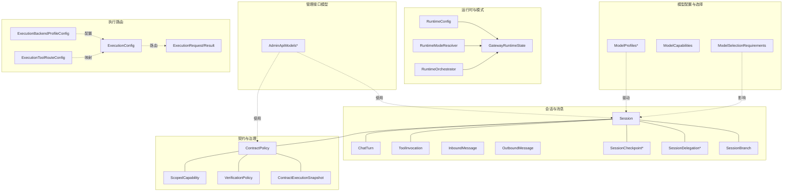
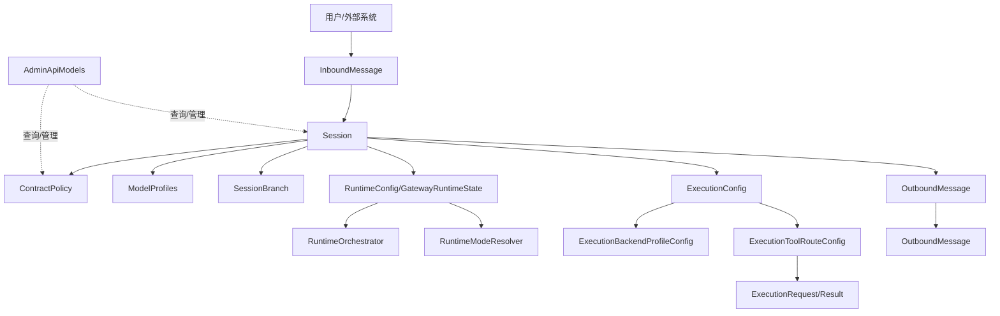
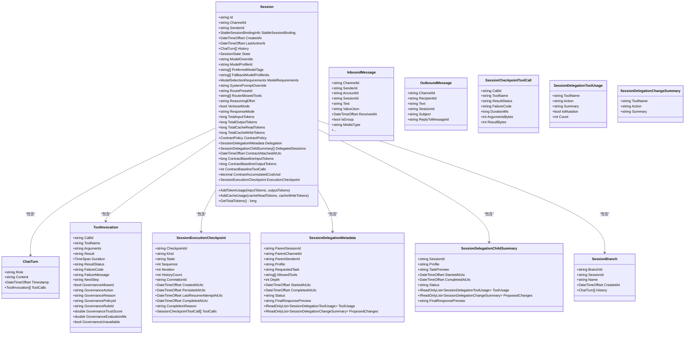
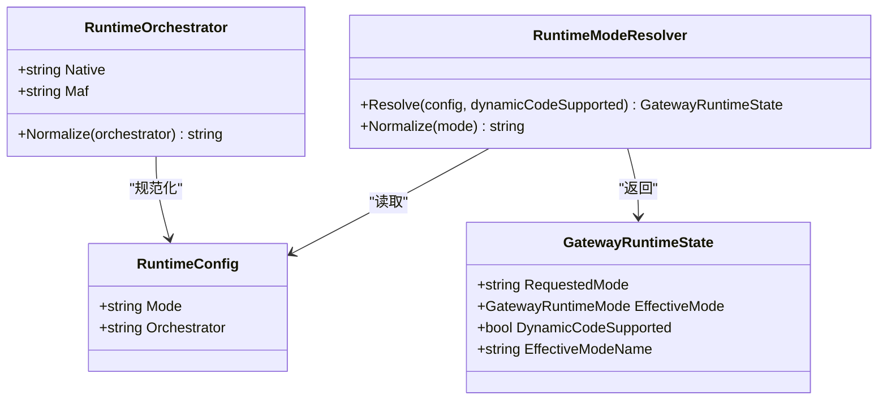
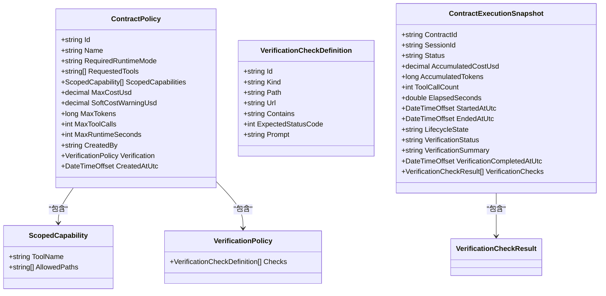
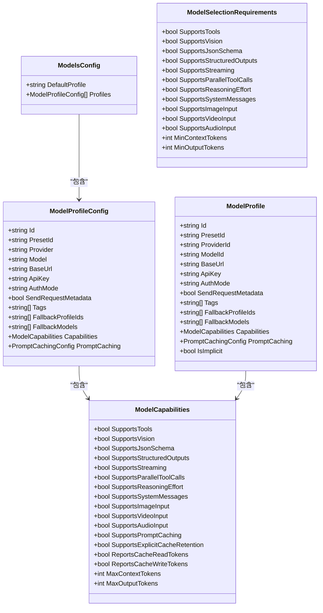
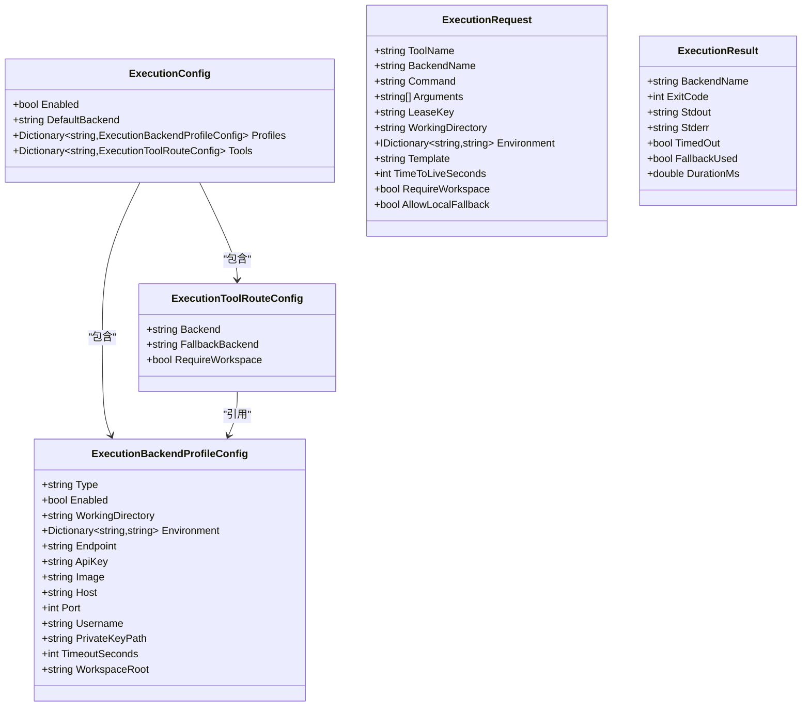
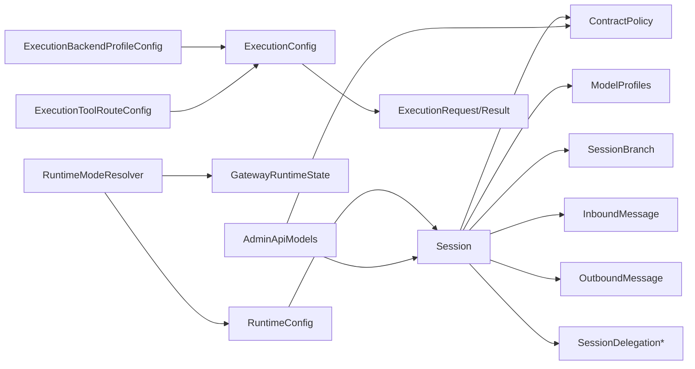

# 数据模型

<cite>
**本文引用的文件**
- [Session.cs](file://src/OpenClaw.Core/Models/Session.cs)
- [Messages.cs](file://src/OpenClaw.Core/Models/Messages.cs)
- [RuntimeModels.cs](file://src/OpenClaw.Core/Models/RuntimeModels.cs)
- [ContractModels.cs](file://src/OpenClaw.Core/Models/ContractModels.cs)
- [SessionBranch.cs](file://src/OpenClaw.Core/Models/SessionBranch.cs)
- [AdminApiModels.cs](file://src/OpenClaw.Core/Models/AdminApiModels.cs)
- [ModelProfiles.cs](file://src/OpenClaw.Core/Models/ModelProfiles.cs)
- [ExecutionModels.cs](file://src/OpenClaw.Core/Models/ExecutionModels.cs)
</cite>

## 目录
1. [简介](#简介)
2. [项目结构](#项目结构)
3. [核心组件](#核心组件)
4. [架构总览](#架构总览)
5. [详细组件分析](#详细组件分析)
6. [依赖分析](#依赖分析)
7. [性能考虑](#性能考虑)
8. [故障排查指南](#故障排查指南)
9. [结论](#结论)
10. [附录](#附录)

## 简介
本文件系统性梳理 OpenClaw.Core 模块中的数据模型，重点覆盖会话与消息、运行时与契约、模型配置与选择、执行路由等关键实体。文档从属性定义、数据类型、验证规则与业务含义出发，结合序列化配置、模型间关系与依赖、数据流转与持久化策略，给出最佳实践与常见问题规避建议，帮助开发者在多组件协作场景中正确使用与扩展数据模型。

## 项目结构
OpenClaw.Core 的数据模型集中于 Models 命名空间，围绕以下主题分层组织：
- 会话与消息：Session、ChatTurn、ToolInvocation、InboundMessage、OutboundMessage 及其相关检查点与委托元数据
- 运行时与模式：RuntimeConfig、GatewayRuntimeState、RuntimeModeResolver、RuntimeOrchestrator
- 契约与治理：ContractPolicy、ScopedCapability、VerificationPolicy、ContractExecutionSnapshot 等
- 会话分支：SessionBranch
- 管理接口模型：AdminApiModels 中的认证、审批、通道就绪度等响应与请求体
- 模型配置与选择：ModelProfiles、ModelCapabilities、ModelSelectionRequirements、ModelProfile 等
- 执行路由：ExecutionConfig、ExecutionBackendProfileConfig、ExecutionToolRouteConfig、ExecutionRequest/Result 等

**图表来源**
- [Session.cs:15-135](file://src/OpenClaw.Core/Models/Session.cs#L15-L135)
- [Messages.cs:6-61](file://src/OpenClaw.Core/Models/Messages.cs#L6-L61)
- [RuntimeModels.cs:11-68](file://src/OpenClaw.Core/Models/RuntimeModels.cs#L11-L68)
- [ContractModels.cs:41-130](file://src/OpenClaw.Core/Models/ContractModels.cs#L41-L130)
- [SessionBranch.cs:8-15](file://src/OpenClaw.Core/Models/SessionBranch.cs#L8-L15)
- [AdminApiModels.cs:164-182](file://src/OpenClaw.Core/Models/AdminApiModels.cs#L164-L182)
- [ModelProfiles.cs:3-80](file://src/OpenClaw.Core/Models/ModelProfiles.cs#L3-L80)
- [ExecutionModels.cs:8-179](file://src/OpenClaw.Core/Models/ExecutionModels.cs#L8-L179)

**章节来源**
- [Session.cs:1-1109](file://src/OpenClaw.Core/Models/Session.cs#L1-L1109)
- [Messages.cs:1-62](file://src/OpenClaw.Core/Models/Messages.cs#L1-L62)
- [RuntimeModels.cs:1-69](file://src/OpenClaw.Core/Models/RuntimeModels.cs#L1-L69)
- [ContractModels.cs:1-131](file://src/OpenClaw.Core/Models/ContractModels.cs#L1-L131)
- [SessionBranch.cs:1-16](file://src/OpenClaw.Core/Models/SessionBranch.cs#L1-L16)
- [AdminApiModels.cs:1-320](file://src/OpenClaw.Core/Models/AdminApiModels.cs#L1-L320)
- [ModelProfiles.cs:1-169](file://src/OpenClaw.Core/Models/ModelProfiles.cs#L1-L169)
- [ExecutionModels.cs:1-179](file://src/OpenClaw.Core/Models/ExecutionModels.cs#L1-L179)

## 核心组件
本节对关键数据模型进行逐项解析，涵盖属性定义、数据类型、验证规则与业务语义，并指出序列化上下文与典型使用场景。

- 会话 Session
  - 关键属性：标识、渠道与发送方、稳定绑定信息、创建/活跃时间、历史记录、状态、模型选择参数（覆盖、标签、回退、能力要求）、系统提示覆盖、路由预设与工具白名单、推理努力、详细模式、令牌计数器（输入/输出/缓存读写）、合约策略与委托元数据、执行检查点、会话分支摘要等
  - 数据类型：字符串、列表、枚举、时间戳、数值累加器（原子读写）
  - 验证规则：必填字段（如 Id、ChannelId、SenderId）；令牌计数器通过原子操作更新；合约预算与工具调用上限用于运行期治理
  - 序列化：通过 JsonSerializable 注解纳入源生成上下文，支持零分配序列化
  - 业务含义：承载一次用户与代理交互的完整生命周期，包含对话历史、治理策略、成本与用量统计、可恢复的执行检查点

- 消息 InboundMessage/OutboundMessage
  - InboundMessage：渠道、发送方、会话、自动化/定时任务关联、消息类型、文本内容、附加信息（主题、引用、事件、值、序列号、系统消息标记、群聊字段、媒体字段）、接收时间、取消令牌
  - OutboundMessage：目标渠道、接收方、文本、会话/自动化关联、回复引用等
  - 数据类型：字符串、可空字符串、布尔、整数、时间戳、集合
  - 验证规则：必要字段（如 ChannelId、SenderId、Text）；群聊/媒体字段按需填充
  - 序列化：纳入源生成上下文
  - 业务含义：跨渠道的消息桥接载体，贯穿网关到适配器与工具执行的全链路

- 运行时与模式 RuntimeConfig/GatewayRuntimeState/RuntimeModeResolver/RuntimeOrchestrator
  - RuntimeConfig：请求模式（auto/aot/jit）、编排器（native/maf）
  - GatewayRuntimeState：生效模式、动态代码支持状态、生效模式名称
  - RuntimeModeResolver：规范化输入、校验 JIT 支持、计算生效模式
  - RuntimeOrchestrator：编排器常量与规范化
  - 数据类型：字符串、布尔
  - 验证规则：JIT 模式需动态代码支持；auto 模式在不支持 JIT 时回退至 AOT
  - 序列化：纳入源生成上下文
  - 业务含义：统一运行时模式与编排器选择，确保部署环境与配置一致

- 契约与治理 ContractPolicy/ScopedCapability/VerificationPolicy/ContractExecutionSnapshot
  - ContractPolicy：唯一标识、名称、所需运行时模式、请求工具集、路径作用域能力、最大成本/令牌/工具调用/运行时长、创建者、后置验证策略、创建时间
  - ScopedCapability：工具名与允许路径根
  - VerificationPolicy：检查项数组
  - ContractExecutionSnapshot：会话快照、状态、累计成本/令牌/工具调用/耗时、生命周期状态、验证状态与结果
  - 数据类型：字符串、数值、布尔、时间戳、集合
  - 验证规则：软/硬预算约束；路径白名单；后置验证检查
  - 序列化：纳入源生成上下文
  - 业务含义：对会话执行进行治理与审计，保障成本与安全边界

- 会话分支 SessionBranch
  - 属性：分支标识、会话标识、名称、创建时间、历史快照
  - 数据类型：字符串、时间戳、列表
  - 业务含义：保存对话快照以支持分支探索与回溯

- 管理接口模型 AdminApiModels
  - 包含认证、令牌交换、审批历史、通道就绪度、会话分支列表、会话详情等请求/响应体
  - 数据类型：字符串、布尔、枚举、集合、嵌套对象
  - 业务含义：支撑管理端与仪表盘的数据交互

- 模型配置与选择 ModelProfiles/ModelCapabilities/ModelSelectionRequirements
  - ModelProfiles：默认配置、模型配置列表
  - ModelProfileConfig：提供者、模型、基础地址、鉴权、标签、回退配置、能力、提示缓存
  - ModelCapabilities：工具/视觉/结构化输出/流式/并行工具/推理努力/系统消息/多模态输入/提示缓存等能力开关与容量
  - ModelSelectionRequirements：能力最小需求与容量阈值
  - ModelProfile/ModelProfileStatus：已解析与状态化模型档案
  - 数据类型：字符串、布尔、数值、集合、嵌套对象
  - 业务含义：驱动会话级模型选择与能力匹配，支持回退与兼容性评估

- 执行路由 ExecutionConfig/ExecutionBackendProfileConfig/ExecutionToolRouteConfig/ExecutionRequest/Result
  - ExecutionConfig：启用、默认后端、后端配置字典、工具路由字典
  - ExecutionBackendProfileConfig：后端类型、工作目录、环境变量、端点/凭据、镜像/主机/端口、超时、工作区根
  - ExecutionToolRouteConfig：工具到后端映射、回退后端、是否需要工作区
  - ExecutionRequest/Result：工具名、后端名、命令、参数、租约、工作目录、环境、模板、TTL、工作区要求、本地回退、退出码、标准输出/错误、超时、耗时
  - 数据类型：字符串、布尔、数值、字典、集合
  - 业务含义：将工具调用路由到本地或远端执行后端，支持进程生命周期管理与日志/输入控制

**章节来源**
- [Session.cs:15-135](file://src/OpenClaw.Core/Models/Session.cs#L15-L135)
- [Messages.cs:6-61](file://src/OpenClaw.Core/Models/Messages.cs#L6-L61)
- [RuntimeModels.cs:11-68](file://src/OpenClaw.Core/Models/RuntimeModels.cs#L11-L68)
- [ContractModels.cs:41-130](file://src/OpenClaw.Core/Models/ContractModels.cs#L41-L130)
- [SessionBranch.cs:8-15](file://src/OpenClaw.Core/Models/SessionBranch.cs#L8-L15)
- [AdminApiModels.cs:164-182](file://src/OpenClaw.Core/Models/AdminApiModels.cs#L164-L182)
- [ModelProfiles.cs:3-80](file://src/OpenClaw.Core/Models/ModelProfiles.cs#L3-L80)
- [ExecutionModels.cs:8-179](file://src/OpenClaw.Core/Models/ExecutionModels.cs#L8-L179)

## 架构总览
下图展示数据模型在系统中的角色与交互：会话作为核心实体贯穿消息、运行时、契约、分支与管理接口；模型配置驱动会话的模型选择；执行路由决定工具调用的后端；契约与治理在运行期实施限制与验证。

**图表来源**
- [Session.cs:15-135](file://src/OpenClaw.Core/Models/Session.cs#L15-L135)
- [Messages.cs:6-61](file://src/OpenClaw.Core/Models/Messages.cs#L6-L61)
- [RuntimeModels.cs:11-68](file://src/OpenClaw.Core/Models/RuntimeModels.cs#L11-L68)
- [ContractModels.cs:41-130](file://src/OpenClaw.Core/Models/ContractModels.cs#L41-L130)
- [SessionBranch.cs:8-15](file://src/OpenClaw.Core/Models/SessionBranch.cs#L8-L15)
- [AdminApiModels.cs:164-182](file://src/OpenClaw.Core/Models/AdminApiModels.cs#L164-L182)
- [ModelProfiles.cs:3-80](file://src/OpenClaw.Core/Models/ModelProfiles.cs#L3-L80)
- [ExecutionModels.cs:8-179](file://src/OpenClaw.Core/Models/ExecutionModels.cs#L8-L179)

## 详细组件分析

### 会话与消息组件
- 类关系与职责
  - Session：会话主实体，聚合历史、状态、治理策略、成本与用量、委托元数据、执行检查点、分支摘要
  - ChatTurn/ToolInvocation：对话轮次与工具调用明细
  - InboundMessage/OutboundMessage：跨渠道消息载体
  - SessionCheckpoint*：执行检查点与工具调用快照
  - SessionDelegation*：委托会话的元数据、工具使用与变更摘要
  - SessionBranch：会话历史快照

**图表来源**
- [Session.cs:15-265](file://src/OpenClaw.Core/Models/Session.cs#L15-L265)
- [Messages.cs:6-61](file://src/OpenClaw.Core/Models/Messages.cs#L6-L61)

**章节来源**
- [Session.cs:15-265](file://src/OpenClaw.Core/Models/Session.cs#L15-L265)
- [Messages.cs:6-61](file://src/OpenClaw.Core/Models/Messages.cs#L6-L61)

### 运行时与模式组件
- 类关系与职责
  - RuntimeConfig：请求模式与编排器
  - GatewayRuntimeState：生效模式与动态代码支持
  - RuntimeModeResolver：规范化与解析逻辑
  - RuntimeOrchestrator：编排器常量与规范化

**图表来源**
- [RuntimeModels.cs:11-68](file://src/OpenClaw.Core/Models/RuntimeModels.cs#L11-L68)

**章节来源**
- [RuntimeModels.cs:11-68](file://src/OpenClaw.Core/Models/RuntimeModels.cs#L11-L68)

### 契约与治理组件
- 类关系与职责
  - ContractPolicy：会话治理策略，包含运行时模式要求、工具集、路径作用域、预算与验证策略
  - ScopedCapability：工具路径白名单
  - VerificationPolicy/Check：后置验证检查定义
  - ContractExecutionSnapshot：会话执行快照与验证结果

**图表来源**
- [ContractModels.cs:41-130](file://src/OpenClaw.Core/Models/ContractModels.cs#L41-L130)

**章节来源**
- [ContractModels.cs:41-130](file://src/OpenClaw.Core/Models/ContractModels.cs#L41-L130)

### 模型配置与选择组件
- 类关系与职责
  - ModelsConfig/ModelProfileConfig：模型配置与档案
  - ModelCapabilities：能力开关与容量
  - ModelSelectionRequirements：能力与容量需求
  - ModelProfile/ModelProfileStatus：解析与状态化档案
  - 会话通过模型配置与需求选择合适模型

**图表来源**
- [ModelProfiles.cs:3-80](file://src/OpenClaw.Core/Models/ModelProfiles.cs#L3-L80)

**章节来源**
- [ModelProfiles.cs:3-80](file://src/OpenClaw.Core/Models/ModelProfiles.cs#L3-L80)

### 执行路由组件
- 类关系与职责
  - ExecutionConfig：启用、默认后端、后端配置字典、工具路由字典
  - ExecutionBackendProfileConfig：后端类型与连接参数
  - ExecutionToolRouteConfig：工具到后端映射
  - ExecutionRequest/Result：执行请求与结果

**图表来源**
- [ExecutionModels.cs:8-179](file://src/OpenClaw.Core/Models/ExecutionModels.cs#L8-L179)

**章节来源**
- [ExecutionModels.cs:8-179](file://src/OpenClaw.Core/Models/ExecutionModels.cs#L8-L179)

## 依赖分析
- 组件耦合
  - Session 依赖 ContractPolicy、ModelProfiles、SessionBranch、InboundMessage/OutboundMessage、SessionDelegation*
  - 运行时配置影响会话的模型选择与执行后端
  - 契约策略在运行期对工具调用与资源使用进行限制
  - 管理接口模型依赖会话与契约以提供查询与管理能力

**图表来源**
- [Session.cs:15-135](file://src/OpenClaw.Core/Models/Session.cs#L15-L135)
- [RuntimeModels.cs:11-68](file://src/OpenClaw.Core/Models/RuntimeModels.cs#L11-L68)
- [ContractModels.cs:41-130](file://src/OpenClaw.Core/Models/ContractModels.cs#L41-L130)
- [SessionBranch.cs:8-15](file://src/OpenClaw.Core/Models/SessionBranch.cs#L8-L15)
- [AdminApiModels.cs:164-182](file://src/OpenClaw.Core/Models/AdminApiModels.cs#L164-L182)
- [ModelProfiles.cs:3-80](file://src/OpenClaw.Core/Models/ModelProfiles.cs#L3-L80)
- [ExecutionModels.cs:8-179](file://src/OpenClaw.Core/Models/ExecutionModels.cs#L8-L179)

**章节来源**
- [Session.cs:15-135](file://src/OpenClaw.Core/Models/Session.cs#L15-L135)
- [RuntimeModels.cs:11-68](file://src/OpenClaw.Core/Models/RuntimeModels.cs#L11-L68)
- [ContractModels.cs:41-130](file://src/OpenClaw.Core/Models/ContractModels.cs#L41-L130)
- [SessionBranch.cs:8-15](file://src/OpenClaw.Core/Models/SessionBranch.cs#L8-L15)
- [AdminApiModels.cs:164-182](file://src/OpenClaw.Core/Models/AdminApiModels.cs#L164-L182)
- [ModelProfiles.cs:3-80](file://src/OpenClaw.Core/Models/ModelProfiles.cs#L3-L80)
- [ExecutionModels.cs:8-179](file://src/OpenClaw.Core/Models/ExecutionModels.cs#L8-L179)

## 性能考虑
- 零分配序列化：通过 JsonSerializable 注解与源生成上下文，减少反射与装箱开销，提升序列化/反序列化性能
- 原子计数器：会话令牌与缓存计数采用 Interlocked 操作，保证并发安全与低锁争用
- 路由与后端：ExecutionConfig 提供默认后端与工具映射，合理设置超时与工作区要求，避免阻塞与资源泄漏
- 模型选择：ModelSelectionRequirements 与 ModelProfiles 的组合应尽量减少回退与兼容性检测成本

## 故障排查指南
- 运行时模式错误
  - 现象：请求 JIT 模式但运行环境不支持动态代码
  - 处理：检查 RuntimeModeResolver 的异常提示，确认部署产物与运行时支持情况
  - 参考
    - [RuntimeModels.cs:29-59](file://src/OpenClaw.Core/Models/RuntimeModels.cs#L29-L59)

- 会话令牌/缓存计数异常
  - 现象：输入/输出/缓存读写计数不一致或为负
  - 处理：核对 AddTokenUsage/AddCacheUsage 调用路径，确保并发访问通过原子操作更新
  - 参考
    - [Session.cs:117-134](file://src/OpenClaw.Core/Models/Session.cs#L117-L134)

- 契约预算触发
  - 现象：达到最大成本/令牌/工具调用/运行时长
  - 处理：检查 ContractPolicy 配置与 ContractExecutionSnapshot 的累计值，调整策略或回退模型
  - 参考
    - [ContractModels.cs:41-130](file://src/OpenClaw.Core/Models/ContractModels.cs#L41-L130)

- 工具执行失败或超时
  - 现象：ExecutionResult 标记超时或回退
  - 处理：检查 ExecutionConfig 的后端配置、超时与工作区要求，必要时切换后端或增加 TTL
  - 参考
    - [ExecutionModels.cs:62-86](file://src/OpenClaw.Core/Models/ExecutionModels.cs#L62-L86)

- 模型选择不匹配
  - 现象：能力需求无法满足或回退链过长
  - 处理：核对 ModelSelectionRequirements 与 ModelProfiles 的能力与回退配置
  - 参考
    - [ModelProfiles.cs:47-80](file://src/OpenClaw.Core/Models/ModelProfiles.cs#L47-L80)

**章节来源**
- [RuntimeModels.cs:29-59](file://src/OpenClaw.Core/Models/RuntimeModels.cs#L29-L59)
- [Session.cs:117-134](file://src/OpenClaw.Core/Models/Session.cs#L117-L134)
- [ContractModels.cs:41-130](file://src/OpenClaw.Core/Models/ContractModels.cs#L41-L130)
- [ExecutionModels.cs:62-86](file://src/OpenClaw.Core/Models/ExecutionModels.cs#L62-L86)
- [ModelProfiles.cs:47-80](file://src/OpenClaw.Core/Models/ModelProfiles.cs#L47-L80)

## 结论
OpenClaw.Core 的数据模型以会话为核心，围绕消息、运行时、契约、分支与执行路由构建了完整的数据骨架。通过严格的属性定义、序列化配置与运行期治理，模型在多组件协作中实现了高内聚、低耦合与可扩展性。遵循本文的最佳实践与故障排查建议，可有效提升系统的稳定性与性能。

## 附录
- 序列化上下文
  - Session.cs 中包含大量 JsonSerializable 注解，覆盖会话、消息、运行时、模型、执行、治理等核心类型
  - 参考
    - [Session.cs:267-529](file://src/OpenClaw.Core/Models/Session.cs#L267-L529)

- JSON Schema 与数据转换
  - 本仓库未提供独立 JSON Schema 文件；模型通过源生成上下文实现强类型序列化
  - 如需 Schema 校验，可在上层服务中基于模型定义生成 Schema 或使用第三方工具

- 模型传递与持久化
  - 会话与消息在组件间通过序列化/反序列化传递；持久化可通过文件存储或数据库实现（例如会话分支与管理接口模型）
  - 参考
    - [SessionBranch.cs:8-15](file://src/OpenClaw.Core/Models/SessionBranch.cs#L8-L15)
    - [AdminApiModels.cs:164-182](file://src/OpenClaw.Core/Models/AdminApiModels.cs#L164-L182)