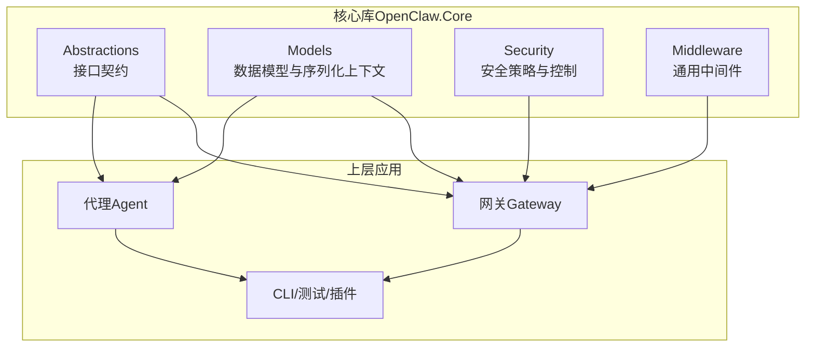
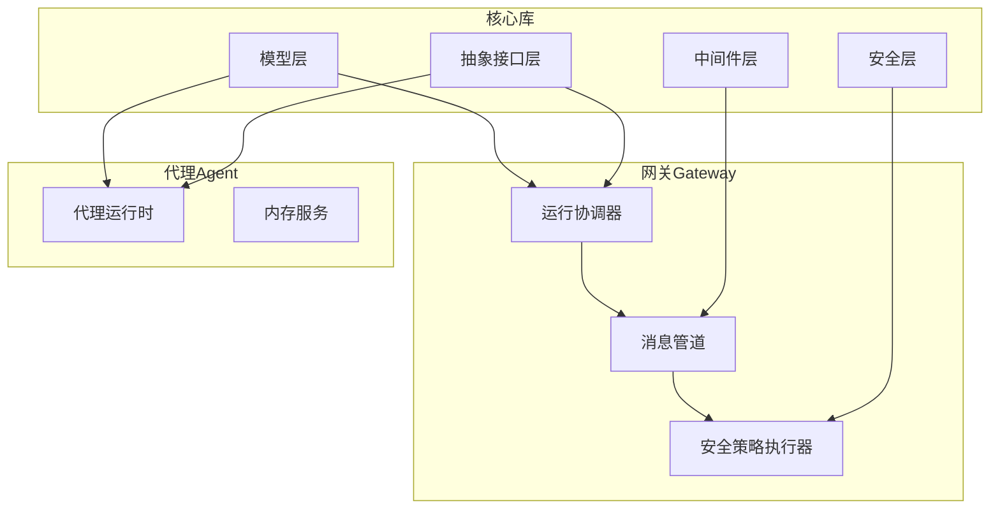
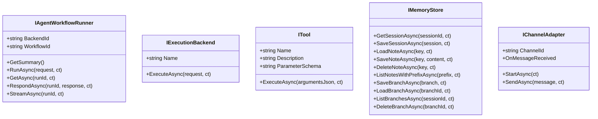
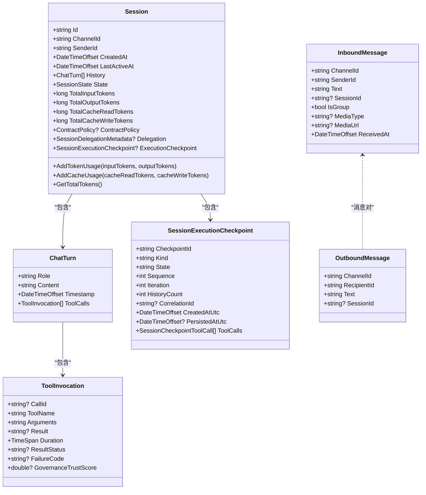
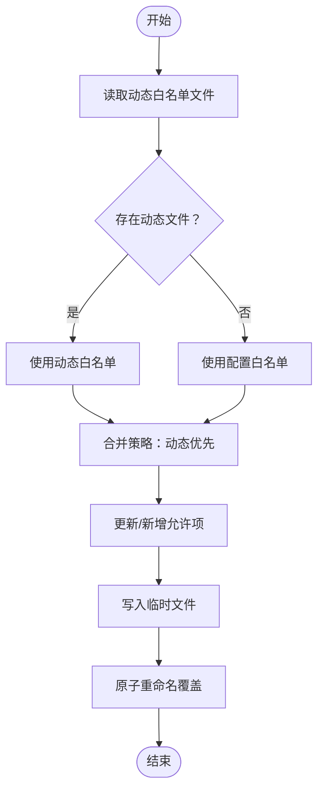
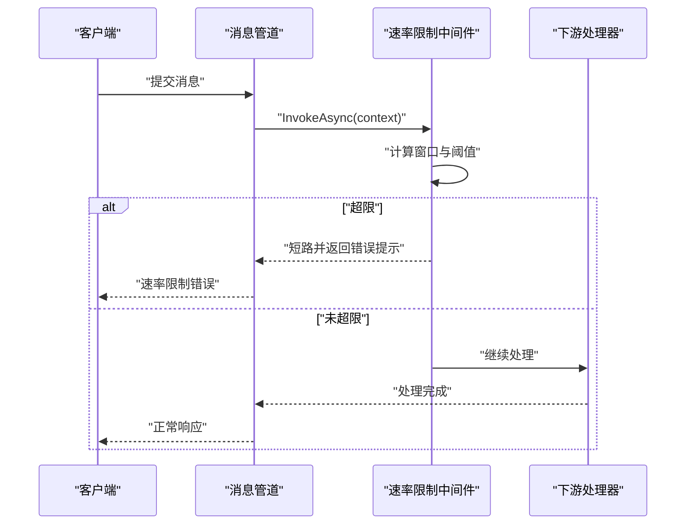
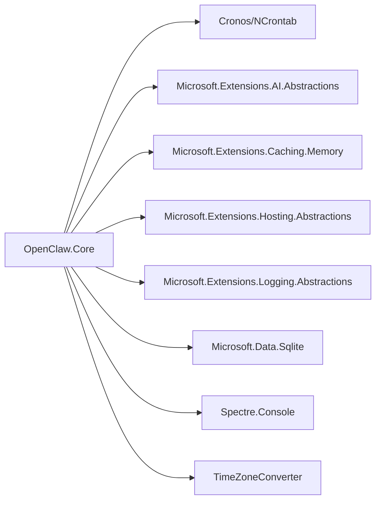

# 核心库

<cite>
**本文引用的文件**
- [OpenClaw.Core.csproj](file://src/OpenClaw.Core/OpenClaw.Core.csproj)
- [IAgentWorkflowRunner.cs](file://src/OpenClaw.Core/Abstractions/IAgentWorkflowRunner.cs)
- [IExecutionBackend.cs](file://src/OpenClaw.Core/Abstractions/IExecutionBackend.cs)
- [ITool.cs](file://src/OpenClaw.Core/Abstractions/ITool.cs)
- [IMemoryStore.cs](file://src/OpenClaw.Core/Abstractions/IMemoryStore.cs)
- [IChannelAdapter.cs](file://src/OpenClaw.Core/Abstractions/IChannelAdapter.cs)
- [Session.cs](file://src/OpenClaw.Core/Models/Session.cs)
- [Messages.cs](file://src/OpenClaw.Core/Models/Messages.cs)
- [AllowlistManager.cs](file://src/OpenClaw.Core/Security/AllowlistManager.cs)
- [ToolPathPolicy.cs](file://src/OpenClaw.Core/Security/ToolPathPolicy.cs)
- [RateLimitMiddleware.cs](file://src/OpenClaw.Core/Middleware/RateLimitMiddleware.cs)
</cite>

## 目录
1. [简介](#简介)
2. [项目结构](#项目结构)
3. [核心组件](#核心组件)
4. [架构总览](#架构总览)
5. [详细组件分析](#详细组件分析)
6. [依赖分析](#依赖分析)
7. [性能考虑](#性能考虑)
8. [故障排查指南](#故障排查指南)
9. [结论](#结论)
10. [附录](#附录)

## 简介
本技术文档面向 OpenClaw.NET 的核心库（OpenClaw.Core），系统性阐述其抽象接口设计、数据模型定义、通用服务组件与安全控制机制。文档聚焦以下目标：
- 抽象接口设计：明确运行时、执行后端、工具、内存存储与通道适配器等核心契约。
- 数据模型定义：以会话、消息、令牌统计、治理与配置等为中心的数据结构与序列化上下文。
- 通用服务组件：中间件（速率限制）、安全策略（白名单管理）与工具路径策略等。
- 安全控制机制：基于动态白名单、输入清理与路径策略的多层防护。
- 模块化设计与实现规范：接口最小化、AOT 友好、零分配序列化与可观测性集成。
- 使用指南与扩展方法：如何在网关与代理中接入核心库，以及扩展点与最佳实践。

## 项目结构
OpenClaw.Core 作为核心抽象与基础模型库，采用按职责分层的组织方式：
- Abstractions：定义运行时、执行、工具、存储与通道适配器等抽象接口。
- Models：定义会话、消息、令牌统计、治理与配置等数据模型，并提供 AOT 友好的 JSON 序列化上下文。
- Security：提供安全策略与控制能力，如动态白名单管理、工具路径策略等。
- Middleware：提供通用中间件能力，如速率限制。
- 其他子目录：Features、Observability、Pipeline、Skills、Validation 等在其他项目中实现或复用。

图表来源
- [OpenClaw.Core.csproj:1-24](file://src/OpenClaw.Core/OpenClaw.Core.csproj#L1-L24)

章节来源
- [OpenClaw.Core.csproj:1-24](file://src/OpenClaw.Core/OpenClaw.Core.csproj#L1-L24)

## 核心组件
本节从抽象接口、数据模型与通用服务三个维度梳理核心库的关键构件。

- 抽象接口
  - 运行时与工作流：IAgentWorkflowRunner 提供工作流运行、快照查询与事件流式输出的能力。
  - 执行后端：IExecutionBackend 定义统一的执行请求/结果契约，便于替换不同后端。
  - 工具接口：ITool 保持极简设计，满足 AOT 削减与低分配要求。
  - 内存存储：IMemoryStore 提供会话与笔记的持久化能力，支持分支会话。
  - 通道适配器：IChannelAdapter 定义消息收发与事件回调，强调 AOT 兼容与低分配。

- 数据模型
  - 会话模型：Session、ChatTurn、ToolInvocation、SessionExecutionCheckpoint 等，支持零分配序列化。
  - 消息模型：InboundMessage、OutboundMessage，覆盖多渠道消息字段与媒体属性。
  - 序列化上下文：通过 JsonSerializable 注解为大量核心类型生成源生成器，提升 AOT 友好度。

- 通用服务
  - 中间件：RateLimitMiddleware 实现每会话速率限制，带空闲窗口清理。
  - 安全：AllowlistManager 支持动态白名单文件持久化与合并；ToolPathPolicy 提供路径访问策略骨架（当前为占位实现，便于后续扩展）。

章节来源
- [IAgentWorkflowRunner.cs:1-29](file://src/OpenClaw.Core/Abstractions/IAgentWorkflowRunner.cs#L1-L29)
- [IExecutionBackend.cs:1-13](file://src/OpenClaw.Core/Abstractions/IExecutionBackend.cs#L1-L13)
- [ITool.cs:1-17](file://src/OpenClaw.Core/Abstractions/ITool.cs#L1-L17)
- [IMemoryStore.cs:1-24](file://src/OpenClaw.Core/Abstractions/IMemoryStore.cs#L1-L24)
- [IChannelAdapter.cs:1-22](file://src/OpenClaw.Core/Abstractions/IChannelAdapter.cs#L1-L22)
- [Session.cs:1-135](file://src/OpenClaw.Core/Models/Session.cs#L1-L135)
- [Messages.cs:1-62](file://src/OpenClaw.Core/Models/Messages.cs#L1-L62)
- [RateLimitMiddleware.cs:1-93](file://src/OpenClaw.Core/Middleware/RateLimitMiddleware.cs#L1-L93)
- [AllowlistManager.cs:1-126](file://src/OpenClaw.Core/Security/AllowlistManager.cs#L1-L126)
- [ToolPathPolicy.cs:1-136](file://src/OpenClaw.Core/Security/ToolPathPolicy.cs#L1-L136)

## 架构总览
核心库通过“接口契约 + 数据模型 + 安全与中间件”的组合，向上支撑网关与代理的运行时行为，向下对接具体实现（如文件系统、数据库、外部服务）。下图展示核心库与上层组件的关系：

图表来源
- [IAgentWorkflowRunner.cs:1-29](file://src/OpenClaw.Core/Abstractions/IAgentWorkflowRunner.cs#L1-L29)
- [IExecutionBackend.cs:1-13](file://src/OpenClaw.Core/Abstractions/IExecutionBackend.cs#L1-L13)
- [IMemoryStore.cs:1-24](file://src/OpenClaw.Core/Abstractions/IMemoryStore.cs#L1-L24)
- [IChannelAdapter.cs:1-22](file://src/OpenClaw.Core/Abstractions/IChannelAdapter.cs#L1-L22)
- [Session.cs:1-135](file://src/OpenClaw.Core/Models/Session.cs#L1-L135)
- [Messages.cs:1-62](file://src/OpenClaw.Core/Models/Messages.cs#L1-L62)
- [RateLimitMiddleware.cs:1-93](file://src/OpenClaw.Core/Middleware/RateLimitMiddleware.cs#L1-L93)
- [AllowlistManager.cs:1-126](file://src/OpenClaw.Core/Security/AllowlistManager.cs#L1-L126)

## 详细组件分析

### 接口契约与实现规范
- IAgentWorkflowRunner
  - 职责：封装工作流运行生命周期（启动、查询、响应、事件流）。
  - 设计要点：返回值与事件均采用异步枚举，便于流式处理；摘要信息用于状态展示。
- IExecutionBackend
  - 职责：统一执行请求/结果契约，便于替换不同执行后端。
  - 设计要点：参数与结果最小化，避免不必要的序列化开销。
- ITool
  - 职责：最小化工具接口，仅暴露名称、描述、参数模式与异步执行入口。
  - 设计要点：参数以 JSON 字符串传递，降低泛型约束带来的 AOT 压力。
- IMemoryStore
  - 职责：会话与笔记的持久化，支持分支会话。
  - 设计要点：提供列表前缀匹配与分支 CRUD，满足多会话场景。
- IChannelAdapter
  - 职责：通道适配器抽象，负责消息收发与事件回调。
  - 设计要点：强调 AOT 兼容与低分配，事件采用异步委托回调。

图表来源
- [IAgentWorkflowRunner.cs:1-29](file://src/OpenClaw.Core/Abstractions/IAgentWorkflowRunner.cs#L1-L29)
- [IExecutionBackend.cs:1-13](file://src/OpenClaw.Core/Abstractions/IExecutionBackend.cs#L1-L13)
- [ITool.cs:1-17](file://src/OpenClaw.Core/Abstractions/ITool.cs#L1-L17)
- [IMemoryStore.cs:1-24](file://src/OpenClaw.Core/Abstractions/IMemoryStore.cs#L1-L24)
- [IChannelAdapter.cs:1-22](file://src/OpenClaw.Core/Abstractions/IChannelAdapter.cs#L1-L22)

章节来源
- [IAgentWorkflowRunner.cs:1-29](file://src/OpenClaw.Core/Abstractions/IAgentWorkflowRunner.cs#L1-L29)
- [IExecutionBackend.cs:1-13](file://src/OpenClaw.Core/Abstractions/IExecutionBackend.cs#L1-L13)
- [ITool.cs:1-17](file://src/OpenClaw.Core/Abstractions/ITool.cs#L1-L17)
- [IMemoryStore.cs:1-24](file://src/OpenClaw.Core/Abstractions/IMemoryStore.cs#L1-L24)
- [IChannelAdapter.cs:1-22](file://src/OpenClaw.Core/Abstractions/IChannelAdapter.cs#L1-L22)

### 数据模型与序列化
- 会话模型（Session）
  - 关键字段：标识、渠道、发送者、稳定绑定、时间戳、历史记录、状态、模型选择偏好、令牌统计、合同与委托元数据、执行检查点等。
  - 统计字段：使用原子读写保证并发安全；提供总令牌数计算方法。
  - 检查点：支持工具批处理检查点与工具调用明细。
- 消息模型（InboundMessage/OutboundMessage）
  - 入站消息：覆盖渠道、发送者、会话、自动化触发、类型、文本、媒体、群聊与系统标记等。
  - 出站消息：覆盖渠道、接收者、文本、会话与回复引用等。
- 序列化上下文（MafJsonContext 等）
  - 通过 JsonSerializable 注解为大量核心类型生成源生成器，确保 AOT 场景下的零分配序列化。

图表来源
- [Session.cs:1-135](file://src/OpenClaw.Core/Models/Session.cs#L1-L135)
- [Session.cs:137-265](file://src/OpenClaw.Core/Models/Session.cs#L137-L265)
- [Session.cs:193-219](file://src/OpenClaw.Core/Models/Session.cs#L193-L219)
- [Messages.cs:1-62](file://src/OpenClaw.Core/Models/Messages.cs#L1-L62)

章节来源
- [Session.cs:1-135](file://src/OpenClaw.Core/Models/Session.cs#L1-L135)
- [Session.cs:137-265](file://src/OpenClaw.Core/Models/Session.cs#L137-L265)
- [Session.cs:193-219](file://src/OpenClaw.Core/Models/Session.cs#L193-L219)
- [Messages.cs:1-62](file://src/OpenClaw.Core/Models/Messages.cs#L1-L62)

### 安全控制机制
- 动态白名单管理（AllowlistManager）
  - 动态文件：每个通道维护独立的允许列表文件，优先于静态配置。
  - 并发安全：使用锁与临时文件写入，保证原子更新与失败回滚。
  - 常用操作：添加/设置允许发送方、获取有效白名单、读取动态文件。
- 工具路径策略（ToolPathPolicy）
  - 当前为占位实现，预留路径读写根目录白名单、符号链接解析与路径判断逻辑，便于后续扩展。
- 输入清理与脱敏（RedactionPipeline 等）
  - 在其他项目中提供输入清理与敏感数据替换，核心库通过接口与上下文进行集成。

图表来源
- [AllowlistManager.cs:32-84](file://src/OpenClaw.Core/Security/AllowlistManager.cs#L32-L84)

章节来源
- [AllowlistManager.cs:1-126](file://src/OpenClaw.Core/Security/AllowlistManager.cs#L1-L126)
- [ToolPathPolicy.cs:1-136](file://src/OpenClaw.Core/Security/ToolPathPolicy.cs#L1-L136)

### 通用服务组件
- 速率限制中间件（RateLimitMiddleware）
  - 窗口模型：每会话维护一个时间窗口，移除过期条目并拒绝超限请求。
  - 清理策略：周期性清理空闲窗口，避免内存膨胀。
  - 配置参数：最大消息数/分钟、日志器、空闲 TTL、清理频率。

图表来源
- [RateLimitMiddleware.cs:39-68](file://src/OpenClaw.Core/Middleware/RateLimitMiddleware.cs#L39-L68)

章节来源
- [RateLimitMiddleware.cs:1-93](file://src/OpenClaw.Core/Middleware/RateLimitMiddleware.cs#L1-L93)

## 依赖分析
- 外部包依赖
  - Cronos、NCrontab：定时任务与表达式解析。
  - Microsoft.Extensions.AI.Abstractions：AI 抽象与集成。
  - Microsoft.Extensions.Caching.Memory、Hosting.Abstractions、Logging.Abstractions：缓存、主机与日志抽象。
  - Microsoft.Data.Sqlite：SQLite 访问（用于特性存储与内存存储）。
  - Spectre.Console、TimeZoneConverter：控制台与时区转换。
- 内部可见性
  - 对 OpenClaw.Tests 内部可见，便于单元测试访问内部实现细节。

图表来源
- [OpenClaw.Core.csproj:10-23](file://src/OpenClaw.Core/OpenClaw.Core.csproj#L10-L23)

章节来源
- [OpenClaw.Core.csproj:1-24](file://src/OpenClaw.Core/OpenClaw.Core.csproj#L1-L24)

## 性能考虑
- AOT 友好
  - 接口最小化，减少泛型与反射依赖；大量模型通过 JsonSerializable 生成源生成器，避免运行时反射。
- 低分配与并发
  - 会话令牌统计使用原子读写；速率限制中间件使用队列与锁，避免频繁 GC。
- 存储与序列化
  - 文件系统与 SQLite 后端结合，兼顾本地优先与可扩展性；序列化上下文集中注册，减少重复生成。
- 中间件链
  - 中间件按需插入，避免不必要开销；清理策略降低内存占用。

## 故障排查指南
- 白名单文件读取失败
  - 现象：动态白名单文件读取异常，记录警告日志。
  - 排查：检查文件路径、权限与 JSON 格式；确认临时文件是否残留。
  - 参考
    - [AllowlistManager.cs:38-48](file://src/OpenClaw.Core/Security/AllowlistManager.cs#L38-L48)
- 速率限制触发
  - 现象：短时间内消息过多被拒绝。
  - 排查：调整最大消息数/分钟、日志观察短路提示；确认空闲 TTL 是否导致窗口过早清理。
  - 参考
    - [RateLimitMiddleware.cs:52-58](file://src/OpenClaw.Core/Middleware/RateLimitMiddleware.cs#L52-L58)
- 会话令牌统计异常
  - 现象：输入/输出令牌统计不一致。
  - 排查：确认并发调用路径是否正确使用原子读写；核对 AddTokenUsage 调用时机。
  - 参考
    - [Session.cs:117-131](file://src/OpenClaw.Core/Models/Session.cs#L117-L131)

章节来源
- [AllowlistManager.cs:38-48](file://src/OpenClaw.Core/Security/AllowlistManager.cs#L38-L48)
- [RateLimitMiddleware.cs:52-58](file://src/OpenClaw.Core/Middleware/RateLimitMiddleware.cs#L52-L58)
- [Session.cs:117-131](file://src/OpenClaw.Core/Models/Session.cs#L117-L131)

## 结论
OpenClaw.Core 以“接口最小化 + 数据模型 AOT 友好 + 安全与中间件”为核心设计思想，既满足多渠道、多后端的灵活扩展，又在性能与安全性之间取得平衡。通过清晰的契约与稳健的实现，为核心运行时提供了坚实的基础。

## 附录
- 使用指南与扩展方法
  - 接入运行时：实现 IAgentWorkflowRunner 与 IExecutionBackend，注册到服务集合，配合模型上下文进行序列化。
  - 接入通道：实现 IChannelAdapter，订阅 OnMessageReceived 事件并处理消息路由。
  - 扩展工具：实现 ITool，提供参数 JSON Schema 与异步执行逻辑。
  - 安全加固：使用 AllowlistManager 管理动态白名单；在需要时扩展 ToolPathPolicy 实现路径访问控制。
  - 中间件扩展：实现 IMessageMiddleware 接口，按需插入到消息管道中。
- 最佳实践
  - 保持接口最小化，避免引入不必要的泛型与反射。
  - 使用 JsonSerializable 集中声明模型，确保 AOT 场景可用。
  - 对并发敏感的统计字段使用原子操作，避免竞态。
  - 将安全策略下沉到中间件与适配器层，统一入口控制。