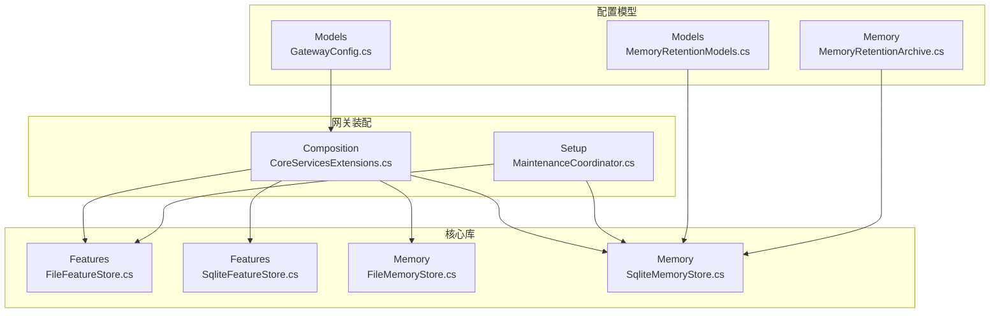
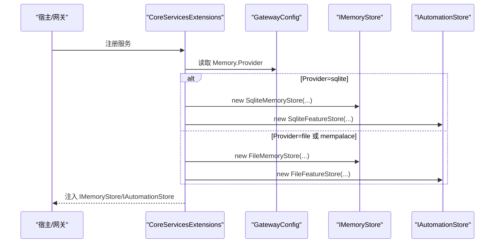
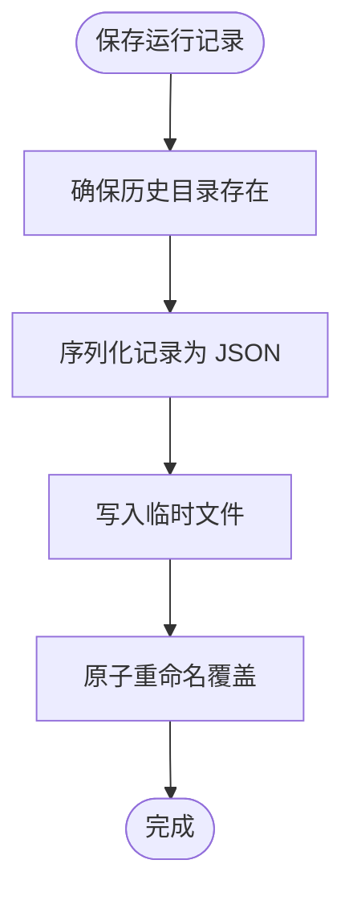
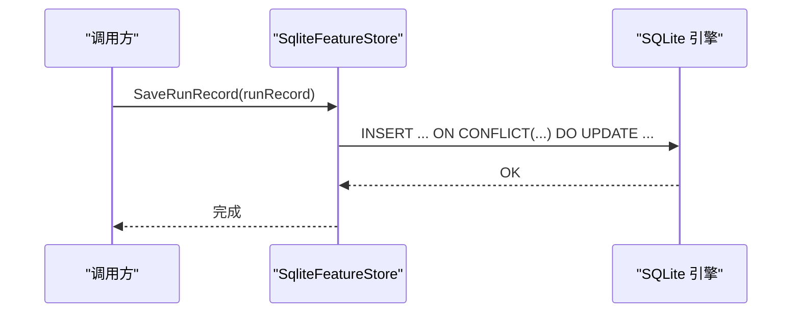
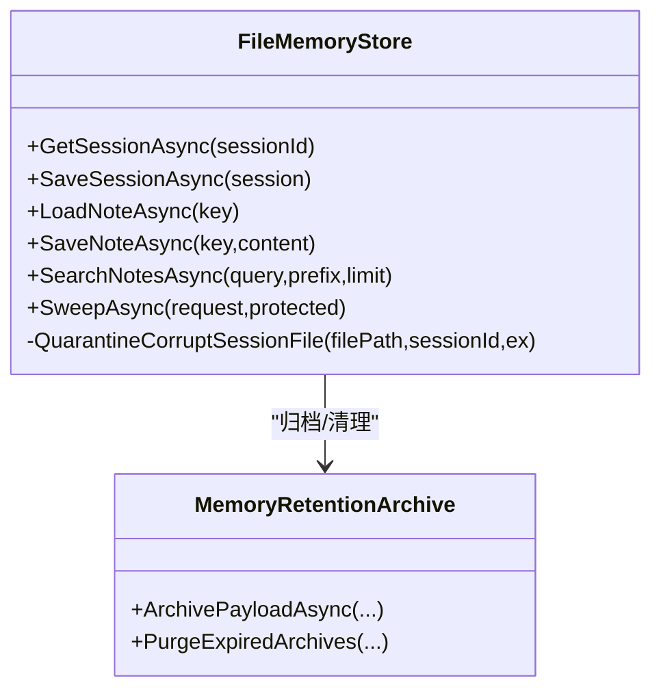
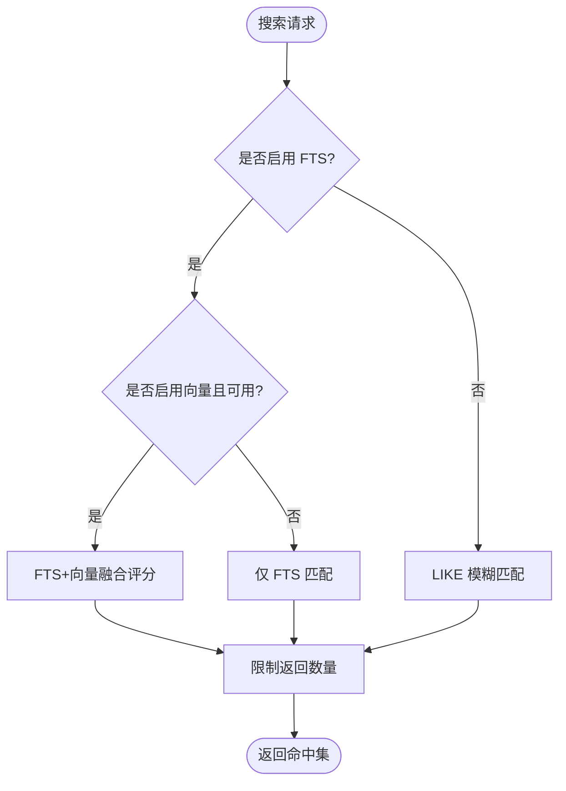
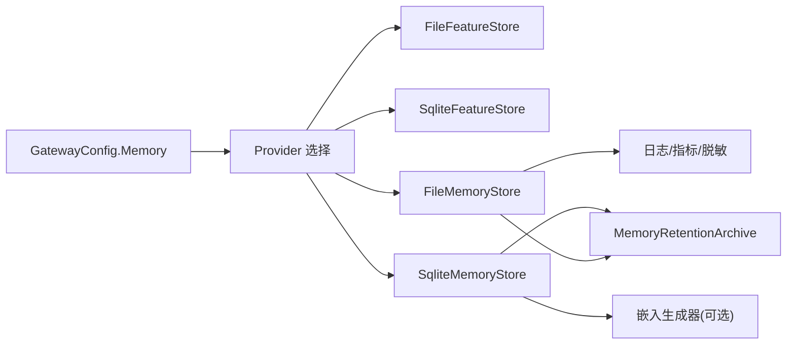

# 通用服务

<cite>
**本文引用的文件**
- [FileFeatureStore.cs](file://src/OpenClaw.Core/Features/FileFeatureStore.cs)
- [SqliteFeatureStore.cs](file://src/OpenClaw.Core/Features/SqliteFeatureStore.cs)
- [FileMemoryStore.cs](file://src/OpenClaw.Core/Memory/FileMemoryStore.cs)
- [SqliteMemoryStore.cs](file://src/OpenClaw.Core/Memory/SqliteMemoryStore.cs)
- [CoreServicesExtensions.cs](file://src/OpenClaw.Gateway/Composition/CoreServicesExtensions.cs)
- [MaintenanceCoordinator.cs](file://src/OpenClaw.Core/Setup/MaintenanceCoordinator.cs)
- [GatewayConfig.cs](file://src/OpenClaw.Core/Models/GatewayConfig.cs)
- [MemoryRetentionModels.cs](file://src/OpenClaw.Core/Models/MemoryRetentionModels.cs)
- [MemoryRetentionArchive.cs](file://src/OpenClaw.Core/Memory/MemoryRetentionArchive.cs)
- [openclaw-memory-recall-and-retention.md](file://docs/openclaw-memory-recall-and-retention.md)
- [SqliteMemoryStoreRetentionTests.cs](file://src/OpenClaw.Tests/SqliteMemoryStoreRetentionTests.cs)
- [FileMemoryStoreTests.cs](file://src/OpenClaw.Tests/FileMemoryStoreTests.cs)
- [SqliteSessionSearchTests.cs](file://src/OpenClaw.Tests/SqliteSessionSearchTests.cs)
</cite>

## 目录
1. [简介](#简介)
2. [项目结构](#项目结构)
3. [核心组件](#核心组件)
4. [架构总览](#架构总览)
5. [详细组件分析](#详细组件分析)
6. [依赖关系分析](#依赖关系分析)
7. [性能考量](#性能考量)
8. [故障排查指南](#故障排查指南)
9. [结论](#结论)
10. [附录](#附录)

## 简介
本技术文档聚焦于通用服务模块中的持久化组件，系统性阐述以下四类通用服务：
- 文件特征存储：FileFeatureStore
- SQLite 特征存储：SqliteFeatureStore
- 文件内存存储：FileMemoryStore
- SQLite 内存存储：SqliteMemoryStore

文档将从配置选项、初始化与注册、数据访问模式、性能特性、配置验证、系统维护与故障恢复等方面进行深入说明，并给出在不同部署环境下的适用性与优化建议。

## 项目结构
通用服务模块位于 OpenClaw.Core 的 Features 与 Memory 子命名空间中，分别提供“特征”与“记忆/会话”的持久化能力；在网关启动阶段通过 Composition 扩展进行服务注册与选择。

图示来源
- [CoreServicesExtensions.cs:260-331](file://src/OpenClaw.Gateway/Composition/CoreServicesExtensions.cs#L260-L331)
- [MaintenanceCoordinator.cs:769-793](file://src/OpenClaw.Core/Setup/MaintenanceCoordinator.cs#L769-L793)
- [GatewayConfig.cs:175-227](file://src/OpenClaw.Core/Models/GatewayConfig.cs#L175-L227)
- [MemoryRetentionModels.cs:7-37](file://src/OpenClaw.Core/Models/MemoryRetentionModels.cs#L7-L37)
- [MemoryRetentionArchive.cs:1-77](file://src/OpenClaw.Core/Memory/MemoryRetentionArchive.cs#L1-L77)

章节来源
- [CoreServicesExtensions.cs:260-331](file://src/OpenClaw.Gateway/Composition/CoreServicesExtensions.cs#L260-L331)
- [GatewayConfig.cs:175-227](file://src/OpenClaw.Core/Models/GatewayConfig.cs#L175-L227)

## 核心组件
本节概述四类通用服务的能力边界与职责：
- FileFeatureStore：面向自动化定义、运行状态、运行记录、用户画像、学习提案、连接账户、后端会话与事件等特征数据的文件级持久化。
- SqliteFeatureStore：同上，但以 SQLite 表结构与索引实现，具备更强的查询与事务能力。
- FileMemoryStore：面向会话、分支、笔记的文件级持久化，内置缓存、并发加载栅栏、损坏隔离与归档保留策略。
- SqliteMemoryStore：同上，但以 SQLite 实现，支持可选全文检索（FTS5）与向量嵌入列，适合更复杂的检索与分析场景。

章节来源
- [FileFeatureStore.cs:8-39](file://src/OpenClaw.Core/Features/FileFeatureStore.cs#L8-L39)
- [SqliteFeatureStore.cs:8-99](file://src/OpenClaw.Core/Features/SqliteFeatureStore.cs#L8-L99)
- [FileMemoryStore.cs:27-76](file://src/OpenClaw.Core/Memory/FileMemoryStore.cs#L27-L76)
- [SqliteMemoryStore.cs:12-148](file://src/OpenClaw.Core/Memory/SqliteMemoryStore.cs#L12-L148)

## 架构总览
通用服务在运行时由网关装配层根据配置选择具体实现，并注入到 DI 容器中，供各业务模块使用。

图示来源
- [CoreServicesExtensions.cs:262-279](file://src/OpenClaw.Gateway/Composition/CoreServicesExtensions.cs#L262-L279)
- [CoreServicesExtensions.cs:295-331](file://src/OpenClaw.Gateway/Composition/CoreServicesExtensions.cs#L295-L331)
- [MaintenanceCoordinator.cs:769-793](file://src/OpenClaw.Core/Setup/MaintenanceCoordinator.cs#L769-L793)

章节来源
- [CoreServicesExtensions.cs:262-331](file://src/OpenClaw.Gateway/Composition/CoreServicesExtensions.cs#L262-L331)
- [MaintenanceCoordinator.cs:769-793](file://src/OpenClaw.Core/Setup/MaintenanceCoordinator.cs#L769-L793)

## 详细组件分析

### FileFeatureStore（文件特征存储）
- 职责与范围
  - 维护自动化定义、运行状态、运行历史、用户画像、学习提案、连接账户、后端会话与事件等。
  - 使用 JSON 文件与 URL 安全的 Base64 编码键避免路径遍历风险。
- 关键实现要点
  - 目录结构：automations、automation-runs、automation-run-history、profiles、learning-proposals、connected-accounts、backend-sessions、backend-session-events。
  - 读写采用临时文件 + 原子重命名，保证一致性。
  - 列表/筛选/分页基于目录枚举与 JSON 反序列化。
  - 运行记录裁剪与事件追加基于有序集合与索引字段。
- 性能与复杂度
  - 列表/筛选为 O(N) 遍历文件；删除/保存为 O(1) 文件操作。
  - 键编码避免文件系统路径问题，提升安全性。
- 使用建议
  - 适用于小规模、低并发、对查询能力要求不高的场景。
  - 注意磁盘 IO 与文件句柄开销，避免频繁小文件写入。

图示来源
- [FileFeatureStore.cs:83-92](file://src/OpenClaw.Core/Features/FileFeatureStore.cs#L83-L92)

章节来源
- [FileFeatureStore.cs:8-39](file://src/OpenClaw.Core/Features/FileFeatureStore.cs#L8-L39)
- [FileFeatureStore.cs:41-111](file://src/OpenClaw.Core/Features/FileFeatureStore.cs#L41-L111)
- [FileFeatureStore.cs:170-187](file://src/OpenClaw.Core/Features/FileFeatureStore.cs#L170-L187)

### SqliteFeatureStore（SQLite 特征存储）
- 职责与范围
  - 同 FileFeatureStore 的特征数据域，但以 SQLite 表与索引实现。
- 关键实现要点
  - 初始化建表与索引，涵盖 automations、automation_runs、automation_run_history、user_profiles、connected_accounts、backend_sessions、backend_session_events、learning_proposals。
  - UPSERT/查询/删除均通过参数化 SQL，支持并发与事务。
  - 运行记录裁剪与事件列表查询使用排序与 LIMIT 控制结果集。
- 性能与复杂度
  - 查询通过索引加速；UPSERT 使用冲突处理减少分支判断。
  - 适合中高并发与复杂筛选场景。
- 使用建议
  - 推荐在需要多维筛选、排序与事务一致性的场景使用。
  - 注意数据库文件锁与 WAL/同步参数的权衡。

图示来源
- [SqliteFeatureStore.cs:164-183](file://src/OpenClaw.Core/Features/SqliteFeatureStore.cs#L164-L183)

章节来源
- [SqliteFeatureStore.cs:8-99](file://src/OpenClaw.Core/Features/SqliteFeatureStore.cs#L8-L99)
- [SqliteFeatureStore.cs:101-204](file://src/OpenClaw.Core/Features/SqliteFeatureStore.cs#L101-L204)
- [SqliteFeatureStore.cs:206-347](file://src/OpenClaw.Core/Features/SqliteFeatureStore.cs#L206-L347)

### FileMemoryStore（文件内存存储）
- 职责与范围
  - 会话、分支、笔记的文件级持久化，支持检索目录与索引。
- 关键实现要点
  - 目录结构：sessions、notes、branches；键名 URL 安全 Base64 编码。
  - 会话缓存：LRU 内存缓存 + 分段加载栅栏，降低并发读写压力。
  - 损坏隔离：读取异常自动移动为 .corrupt-* 并抛出 MemoryStoreCorruptionException。
  - 笔记索引：维护内存索引条目，支持前缀与模糊匹配。
  - 保留策略：支持按 TTL 清理、归档与统计。
- 性能与复杂度
  - 会话读取命中缓存为 O(1)，未命中为磁盘 IO；并发通过分段栅栏串行化。
  - 笔记搜索基于内存索引与前缀过滤，复杂度与候选集大小相关。
- 使用建议
  - 适用于中小规模、文件系统稳定、对检索能力有基础需求的场景。
  - 注意磁盘 IO 与损坏隔离带来的运维成本。

图示来源
- [FileMemoryStore.cs:78-170](file://src/OpenClaw.Core/Memory/FileMemoryStore.cs#L78-L170)
- [FileMemoryStore.cs:279-405](file://src/OpenClaw.Core/Memory/FileMemoryStore.cs#L279-L405)
- [FileMemoryStore.cs:570-623](file://src/OpenClaw.Core/Memory/FileMemoryStore.cs#L570-L623)
- [MemoryRetentionArchive.cs:9-77](file://src/OpenClaw.Core/Memory/MemoryRetentionArchive.cs#L9-L77)

章节来源
- [FileMemoryStore.cs:27-76](file://src/OpenClaw.Core/Memory/FileMemoryStore.cs#L27-L76)
- [FileMemoryStore.cs:78-170](file://src/OpenClaw.Core/Memory/FileMemoryStore.cs#L78-L170)
- [FileMemoryStore.cs:279-405](file://src/OpenClaw.Core/Memory/FileMemoryStore.cs#L279-L405)
- [FileMemoryStore.cs:570-623](file://src/OpenClaw.Core/Memory/FileMemoryStore.cs#L570-L623)

### SqliteMemoryStore（SQLite 内存存储）
- 职责与范围
  - 会话、分支、笔记的 SQLite 持久化，支持可选 FTS5 全文检索与向量嵌入。
- 关键实现要点
  - 初始化：WAL 模式、外键开启、必要索引；可选创建 FTS5 虚表与触发器。
  - 会话/分支/笔记的增删改查均通过参数化 SQL 与 UPSERT。
  - 搜索：优先 FTS5 匹配，可选向量相似度融合；否则回退到 LIKE 模糊匹配。
  - 保留策略：按 TTL 扫描、归档、删除，支持 DryRun 与错误聚合。
- 性能与复杂度
  - FTS5 提升文本检索效率；向量列需外部嵌入生成器支持。
  - WAL 模式提升并发读写；注意同步级别与崩溃恢复权衡。
- 使用建议
  - 需要强检索能力与可扩展性的场景优先选择。
  - 开启向量时需配置嵌入模型与维度，关注写入时延。

图示来源
- [SqliteMemoryStore.cs:319-490](file://src/OpenClaw.Core/Memory/SqliteMemoryStore.cs#L319-L490)

章节来源
- [SqliteMemoryStore.cs:12-148](file://src/OpenClaw.Core/Memory/SqliteMemoryStore.cs#L12-L148)
- [SqliteMemoryStore.cs:150-220](file://src/OpenClaw.Core/Memory/SqliteMemoryStore.cs#L150-L220)
- [SqliteMemoryStore.cs:319-490](file://src/OpenClaw.Core/Memory/SqliteMemoryStore.cs#L319-L490)
- [SqliteMemoryStore.cs:654-732](file://src/OpenClaw.Core/Memory/SqliteMemoryStore.cs#L654-L732)

## 依赖关系分析
- 配置驱动选择
  - Memory.Provider 决定使用 file 或 sqlite；sqlite 下可进一步配置 DbPath、EnableFts、EnableVectors、EmbeddingModel 等。
- 服务注册
  - CoreServicesExtensions 根据配置实例化对应存储，并注册为 IMemoryStore/IAutomationStore 等接口。
- 运行期依赖
  - SqliteMemoryStore 可依赖嵌入生成器；FileMemoryStore 依赖日志、指标与脱敏管道。
- 维护与归档
  - 保留策略通过 RetentionSweepRequest/Result 驱动，归档采用 MemoryRetentionArchive。

图示来源
- [GatewayConfig.cs:175-227](file://src/OpenClaw.Core/Models/GatewayConfig.cs#L175-L227)
- [CoreServicesExtensions.cs:295-331](file://src/OpenClaw.Gateway/Composition/CoreServicesExtensions.cs#L295-L331)
- [MemoryRetentionArchive.cs:1-77](file://src/OpenClaw.Core/Memory/MemoryRetentionArchive.cs#L1-L77)

章节来源
- [GatewayConfig.cs:175-227](file://src/OpenClaw.Core/Models/GatewayConfig.cs#L175-L227)
- [CoreServicesExtensions.cs:295-331](file://src/OpenClaw.Gateway/Composition/CoreServicesExtensions.cs#L295-L331)

## 性能考量
- 文件存储
  - 优点：零依赖、易备份、简单可靠；适合小规模与开发/测试环境。
  - 限制：无索引、列表/筛选为 O(N)、并发控制依赖文件系统语义。
- SQLite 存储
  - 优点：索引、事务、并发、可扩展检索（FTS/向量）；适合生产与中大规模场景。
  - 限制：数据库文件锁、WAL/同步参数需权衡；向量写入带来额外开销。
- 建议
  - 小规模：FileFeatureStore/FileMemoryStore 即可满足。
  - 中大规模：优先 SqliteFeatureStore/SqliteMemoryStore，并启用 FTS 与向量（如需要）。
  - 混合策略：特征与会话分离后端，按负载与查询模式选择。

## 故障排查指南
- 常见问题与定位
  - 文件损坏：FileMemoryStore 会在读取异常时将文件移动至 .corrupt-* 并抛出 MemoryStoreCorruptionException，检查日志与隔离文件。
  - SQLite 损坏：SqliteMemoryStore 在反序列化失败时抛出 MemoryStoreCorruptionException，检查数据库文件与 WAL。
  - 权限不足：启动失败提示存储路径不可写，检查权限与挂载点。
- 保留与归档
  - 使用 RetentionSweepRequest.DryRun 预演清理效果，确认 TTL 阈值合理后再执行真实清理。
  - 归档采用按日期分区与 SHA256 编码文件名，便于审计与恢复。
- 测试参考
  - FileMemoryStore 与 SqliteMemoryStore 的保留策略、损坏隔离与搜索行为均有单元测试覆盖。

章节来源
- [FileMemoryStore.cs:191-223](file://src/OpenClaw.Core/Memory/FileMemoryStore.cs#L191-L223)
- [SqliteMemoryStore.cs:166-178](file://src/OpenClaw.Core/Memory/SqliteMemoryStore.cs#L166-L178)
- [SqliteSessionSearchTests.cs:160-190](file://src/OpenClaw.Tests/SqliteSessionSearchTests.cs#L160-L190)
- [SqliteMemoryStoreRetentionTests.cs:1-200](file://src/OpenClaw.Tests/SqliteMemoryStoreRetentionTests.cs#L1-L200)
- [FileMemoryStoreTests.cs:158-182](file://src/OpenClaw.Tests/FileMemoryStoreTests.cs#L158-L182)

## 结论
通用服务模块提供了灵活的特征与记忆持久化方案，既可满足轻量场景的快速落地，也能支撑生产环境的高可用与高性能需求。通过配置驱动的选择机制与完善的保留/归档体系，可在不同部署环境下实现稳健的数据治理与运维保障。

## 附录

### 配置选项速览（Memory 与 Sqlite）
- Memory.Provider：file | sqlite | mempalace
- Memory.StoragePath：文件存储根目录
- Memory.Sqlite.DbPath：SQLite 数据库文件路径（相对或绝对）
- Memory.Sqlite.EnableFts：启用 FTS5 全文检索
- Memory.Sqlite.EnableVectors：启用向量列（需嵌入模型）
- Memory.Sqlite.EmbeddingModel：嵌入模型名称
- Memory.Retention.*：保留策略与归档参数

章节来源
- [GatewayConfig.cs:175-227](file://src/OpenClaw.Core/Models/GatewayConfig.cs#L175-L227)
- [openclaw-memory-recall-and-retention.md:159-182](file://docs/openclaw-memory-recall-and-retention.md#L159-L182)