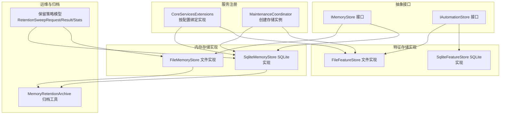
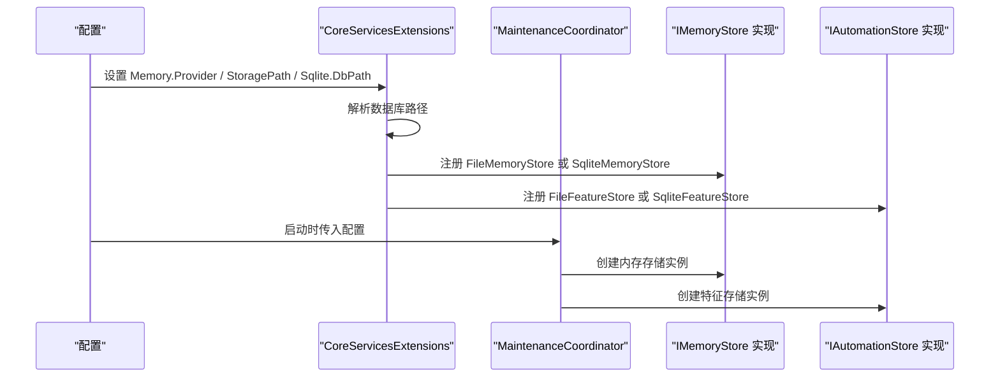
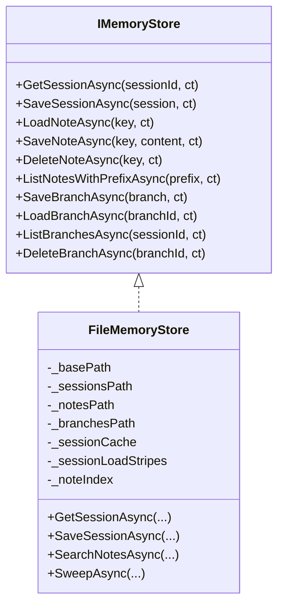
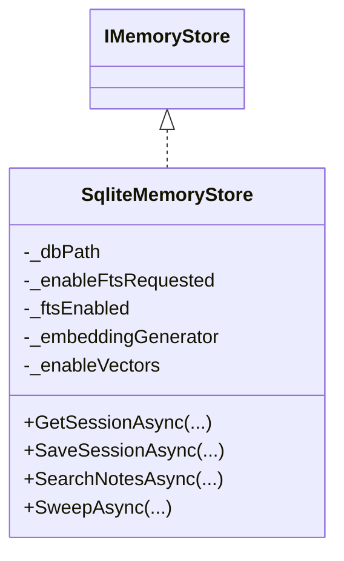
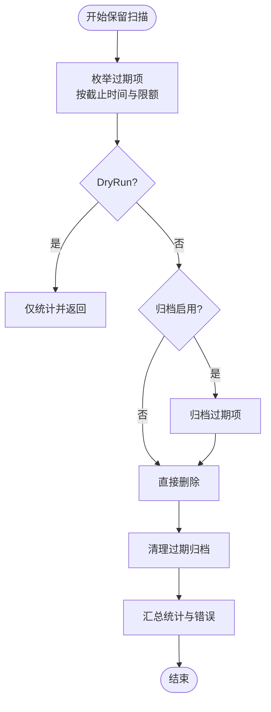
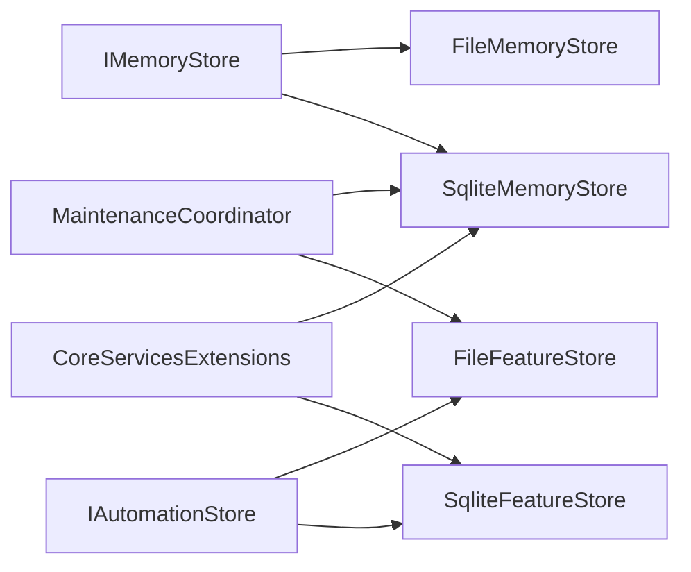
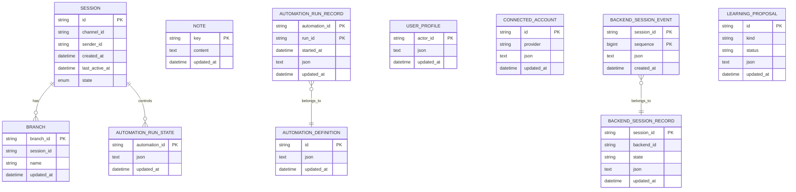

# 内存存储基元

<cite>
**本文引用的文件**
- [FileMemoryStore.cs](file://src/OpenClaw.Core/Memory/FileMemoryStore.cs)
- [SqliteMemoryStore.cs](file://src/OpenClaw.Core/Memory/SqliteMemoryStore.cs)
- [FileFeatureStore.cs](file://src/OpenClaw.Core/Features/FileFeatureStore.cs)
- [SqliteFeatureStore.cs](file://src/OpenClaw.Core/Features/SqliteFeatureStore.cs)
- [IMemoryStore.cs](file://src/OpenClaw.Core/Abstractions/IMemoryStore.cs)
- [IAutomationStore.cs](file://src/OpenClaw.Core/Abstractions/IAutomationStore.cs)
- [MemoryRetentionArchive.cs](file://src/OpenClaw.Core/Memory/MemoryRetentionArchive.cs)
- [CoreServicesExtensions.cs](file://src/OpenClaw.Gateway/Composition/CoreServicesExtensions.cs)
- [MaintenanceCoordinator.cs](file://src/OpenClaw.Core/Setup/MaintenanceCoordinator.cs)
- [Session.cs](file://src/OpenClaw.Core/Models/Session.cs)
- [MemoryRetentionModels.cs](file://src/OpenClaw.Core/Models/MemoryRetentionModels.cs)
</cite>

## 目录
1. [简介](#简介)
2. [项目结构](#项目结构)
3. [核心组件](#核心组件)
4. [架构总览](#架构总览)
5. [详细组件分析](#详细组件分析)
6. [依赖关系分析](#依赖关系分析)
7. [性能考量](#性能考量)
8. [故障排除指南](#故障排除指南)
9. [结论](#结论)
10. [附录](#附录)

## 简介
本文件系统性地阐述内存存储基元的设计与实现，覆盖会话与笔记（内存）存储、自动化特征存储等能力。重点包括：
- 统一抽象接口与多后端实现（文件系统与SQLite）
- 数据持久化策略、缓存机制与并发控制
- 搜索与索引优化（含FTS5与可选向量嵌入）
- 容量管理、归档与清理、迁移与兼容
- 配置方法、性能优化建议、备份恢复与迁移策略
- 一致性、事务与查询性能调优

## 项目结构
围绕“内存存储基元”的关键模块分布如下：
- 抽象层：IMemoryStore、IAutomationStore 等接口定义
- 实现层：FileMemoryStore、SqliteMemoryStore、FileFeatureStore、SqliteFeatureStore
- 运维与归档：MemoryRetentionArchive 及相关保留策略模型
- 服务注册与选择：在网关启动时按配置选择具体实现

图表来源
- [IMemoryStore.cs:1-24](file://src/OpenClaw.Core/Abstractions/IMemoryStore.cs#L1-L24)
- [IAutomationStore.cs:1-18](file://src/OpenClaw.Core/Abstractions/IAutomationStore.cs#L1-L18)
- [FileMemoryStore.cs:1-1263](file://src/OpenClaw.Core/Memory/FileMemoryStore.cs#L1-L1263)
- [SqliteMemoryStore.cs:1-1401](file://src/OpenClaw.Core/Memory/SqliteMemoryStore.cs#L1-L1401)
- [FileFeatureStore.cs:1-272](file://src/OpenClaw.Core/Features/FileFeatureStore.cs#L1-L272)
- [SqliteFeatureStore.cs:1-480](file://src/OpenClaw.Core/Features/SqliteFeatureStore.cs#L1-L480)
- [MemoryRetentionArchive.cs:1-218](file://src/OpenClaw.Core/Memory/MemoryRetentionArchive.cs#L1-L218)
- [CoreServicesExtensions.cs:263-282](file://src/OpenClaw.Gateway/Composition/CoreServicesExtensions.cs#L263-L282)
- [MaintenanceCoordinator.cs:769-793](file://src/OpenClaw.Core/Setup/MaintenanceCoordinator.cs#L769-L793)
- [MemoryRetentionModels.cs:1-83](file://src/OpenClaw.Core/Models/MemoryRetentionModels.cs#L1-L83)

章节来源
- [IMemoryStore.cs:1-24](file://src/OpenClaw.Core/Abstractions/IMemoryStore.cs#L1-L24)
- [IAutomationStore.cs:1-18](file://src/OpenClaw.Core/Abstractions/IAutomationStore.cs#L1-L18)
- [CoreServicesExtensions.cs:263-282](file://src/OpenClaw.Gateway/Composition/CoreServicesExtensions.cs#L263-L282)
- [MaintenanceCoordinator.cs:769-793](file://src/OpenClaw.Core/Setup/MaintenanceCoordinator.cs#L769-L793)

## 核心组件
- IMemoryStore：统一的会话与笔记存储接口，支持会话加载/保存、分支管理、笔记读写与目录浏览、检索等。
- IAutomationStore：统一的自动化特征存储接口，涵盖自动化定义、运行状态、历史记录、用户画像、学习提案、连接账户、后端会话与事件等。
- FileMemoryStore：基于文件系统的内存存储实现，采用URL安全Base64编码键名、LRU内存缓存、分段信号量并发控制、原子写入与损坏隔离。
- SqliteMemoryStore：基于SQLite的内存存储实现，支持WAL模式、外键、索引；可选启用FTS5全文检索与向量嵌入；提供混合检索与BM25+余弦相似度融合评分。
- FileFeatureStore：基于文件系统的特征存储实现，按目录组织各类实体，采用原子写入与路径编码。
- SqliteFeatureStore：基于SQLite的特征存储实现，多表设计、复合主键与多处索引，提供高效查询与裁剪。
- MemoryRetentionArchive：保留策略归档工具，按日期分层归档过期数据并清理过期归档。
- 保留策略模型：RetentionSweepRequest/Result/Stats/RunStatus，用于描述保留扫描请求、结果统计与运行状态。

章节来源
- [IMemoryStore.cs:1-24](file://src/OpenClaw.Core/Abstractions/IMemoryStore.cs#L1-L24)
- [IAutomationStore.cs:1-18](file://src/OpenClaw.Core/Abstractions/IAutomationStore.cs#L1-L18)
- [FileMemoryStore.cs:1-1263](file://src/OpenClaw.Core/Memory/FileMemoryStore.cs#L1-L1263)
- [SqliteMemoryStore.cs:1-1401](file://src/OpenClaw.Core/Memory/SqliteMemoryStore.cs#L1-L1401)
- [FileFeatureStore.cs:1-272](file://src/OpenClaw.Core/Features/FileFeatureStore.cs#L1-L272)
- [SqliteFeatureStore.cs:1-480](file://src/OpenClaw.Core/Features/SqliteFeatureStore.cs#L1-L480)
- [MemoryRetentionArchive.cs:1-218](file://src/OpenClaw.Core/Memory/MemoryRetentionArchive.cs#L1-L218)
- [MemoryRetentionModels.cs:1-83](file://src/OpenClaw.Core/Models/MemoryRetentionModels.cs#L1-L83)

## 架构总览
内存存储基元通过统一接口屏蔽底层差异，运行时根据配置选择具体实现：
- 网关启动时依据配置决定使用文件或SQLite后端，并注册相应的服务实现。
- 维护协调器负责在运行时创建内存与特征存储实例，确保路径解析与参数传递正确。
- 保留策略贯穿所有实现，支持干跑、限额、归档与清理。

图表来源
- [CoreServicesExtensions.cs:263-282](file://src/OpenClaw.Gateway/Composition/CoreServicesExtensions.cs#L263-L282)
- [MaintenanceCoordinator.cs:769-793](file://src/OpenClaw.Core/Setup/MaintenanceCoordinator.cs#L769-L793)

## 详细组件分析

### FileMemoryStore 分析
- 设计要点
  - 目录结构：sessions、notes、branches 三类数据分离存放，键名经URL安全Base64编码以避免路径遍历风险。
  - 缓存与并发：内存LRU缓存用于会话热点命中；通过64路分段信号量对同一sessionId的并发加载进行串行化，降低竞争。
  - 原子写入：临时文件+原子重命名，失败清理临时文件，保证一致性。
  - 损坏隔离：读取异常时将文件移动到带时间戳的“隔离”位置，抛出特定异常便于上层处理。
  - 检索：笔记列表与前缀匹配；搜索通过内存索引（首次访问构建）与文本规范化、词项提取、评分排序实现。
  - 保留策略：枚举sessions/branches目录，按过期条件筛选，支持归档与删除，DryRun与限额控制。
- 适用场景
  - 单机本地优先、无需复杂查询与高并发写入的场景。
  - 对部署简单性要求高、不希望引入外部依赖的环境。
- 配置与路径
  - 基于配置的存储根路径，自动创建缺失目录。
- 性能特性
  - 读多写少场景受益于LRU缓存；写入采用异步流与原子重命名，减少碎片。
  - 并发加载通过分段栅栏降低争用，避免热点会话阻塞。

图表来源
- [IMemoryStore.cs:1-24](file://src/OpenClaw.Core/Abstractions/IMemoryStore.cs#L1-L24)
- [FileMemoryStore.cs:1-1263](file://src/OpenClaw.Core/Memory/FileMemoryStore.cs#L1-L1263)

章节来源
- [FileMemoryStore.cs:1-1263](file://src/OpenClaw.Core/Memory/FileMemoryStore.cs#L1-L1263)

### SqliteMemoryStore 分析
- 设计要点
  - WAL模式与外键开启，提升并发与一致性；索引覆盖updated_at字段。
  - 可选启用FTS5全文检索与触发器自动同步；可选向量嵌入列，结合嵌入生成器实现语义检索。
  - 混合检索：当启用向量且可用时，采用BM25与余弦相似度加权融合评分；否则回退至FTS5或普通LIKE查询。
  - 保留策略：按updated_at扫描过期项，支持归档与删除，DryRun与限额控制。
- 适用场景
  - 需要全文检索、结构化查询与更高吞吐的场景；对数据一致性和并发有更高要求。
- 配置与路径
  - 支持通过构造函数注入是否启用FTS与向量；数据库路径解析遵循网关配置规则。
- 性能特性
  - FTS5提供高性能全文检索；向量列与触发器带来额外写入开销，需权衡启用条件。
  - 索引与LIMIT限制配合，控制扫描规模与响应时间。

图表来源
- [SqliteMemoryStore.cs:1-1401](file://src/OpenClaw.Core/Memory/SqliteMemoryStore.cs#L1-L1401)
- [IMemoryStore.cs:1-24](file://src/OpenClaw.Core/Abstractions/IMemoryStore.cs#L1-L24)

章节来源
- [SqliteMemoryStore.cs:1-1401](file://src/OpenClaw.Core/Memory/SqliteMemoryStore.cs#L1-L1401)

### FileFeatureStore 分析
- 设计要点
  - 多目录组织：automations、automation-runs、automation-run-history、profiles、learning-proposals、connected-accounts、backend-sessions、backend-session-events。
  - 原子写入：临时文件+原子重命名，失败清理临时文件。
  - 路径编码：键名经Base64编码，避免非法字符与路径问题。
  - 查询与裁剪：支持按状态/类型过滤学习提案；支持按会话ID列出/追加后端事件；支持裁剪运行历史数量。
- 适用场景
  - 特征数据体量中等、对查询复杂度要求不高、偏好文件系统简单部署的场景。
- 配置与路径
  - 基于配置的存储根路径，自动创建各子目录。

章节来源
- [FileFeatureStore.cs:1-272](file://src/OpenClaw.Core/Features/FileFeatureStore.cs#L1-L272)

### SqliteFeatureStore 分析
- 设计要点
  - 多表设计：automations、automation_runs、automation_run_history、user_profiles、connected_accounts、backend_sessions、backend_session_events。
  - 复合主键与多处索引，覆盖常用查询维度（如状态/类型、会话ID、序列号等）。
  - UPSERT语句统一更新与插入，保持updated_at一致性。
  - 支持按会话ID列出/追加后端事件；支持裁剪运行历史记录数量。
- 适用场景
  - 特征数据体量较大、需要结构化查询与高并发的场景。
- 配置与路径
  - 数据库路径解析遵循网关配置规则。

章节来源
- [SqliteFeatureStore.cs:1-480](file://src/OpenClaw.Core/Features/SqliteFeatureStore.cs#L1-L480)

### 保留策略与归档流程
- 流程概述
  - 扫描过期会话/分支，DryRun模式下仅统计；实际执行时可先归档再删除。
  - 归档按日期分层（年/月/日/类型），归档文件包含元数据与原始负载。
  - 清理过期归档，支持错误收集与上限控制。
- 关键模型
  - RetentionSweepRequest：请求参数（截止时间、限额、是否归档、归档路径与保留天数、DryRun）。
  - RetentionSweepResult：扫描结果统计与错误集合。
  - RetentionStoreStats：存储后端统计（会话/分支数量）。
  - RetentionRunStatus：运行状态聚合（是否启用、上次运行时间、成功与否、累计统计等）。

图表来源
- [SqliteMemoryStore.cs:654-701](file://src/OpenClaw.Core/Memory/SqliteMemoryStore.cs#L654-L701)
- [FileMemoryStore.cs:570-612](file://src/OpenClaw.Core/Memory/FileMemoryStore.cs#L570-L612)
- [MemoryRetentionArchive.cs:79-166](file://src/OpenClaw.Core/Memory/MemoryRetentionArchive.cs#L79-L166)
- [MemoryRetentionModels.cs:7-83](file://src/OpenClaw.Core/Models/MemoryRetentionModels.cs#L7-L83)

章节来源
- [SqliteMemoryStore.cs:654-701](file://src/OpenClaw.Core/Memory/SqliteMemoryStore.cs#L654-L701)
- [FileMemoryStore.cs:570-612](file://src/OpenClaw.Core/Memory/FileMemoryStore.cs#L570-L612)
- [MemoryRetentionArchive.cs:1-218](file://src/OpenClaw.Core/Memory/MemoryRetentionArchive.cs#L1-L218)
- [MemoryRetentionModels.cs:1-83](file://src/OpenClaw.Core/Models/MemoryRetentionModels.cs#L1-L83)

## 依赖关系分析
- 接口与实现
  - IMemoryStore 被 FileMemoryStore 与 SqliteMemoryStore 实现。
  - IAutomationStore 被 FileFeatureStore 与 SqliteFeatureStore 实现。
- 服务注册
  - CoreServicesExtensions 根据配置选择注入相应实现，并将多个存储接口映射到同一具体实现。
- 运行时创建
  - MaintenanceCoordinator 在启动时根据配置创建内存与特征存储实例，确保路径解析与参数传递正确。

图表来源
- [IMemoryStore.cs:1-24](file://src/OpenClaw.Core/Abstractions/IMemoryStore.cs#L1-L24)
- [IAutomationStore.cs:1-18](file://src/OpenClaw.Core/Abstractions/IAutomationStore.cs#L1-L18)
- [CoreServicesExtensions.cs:263-282](file://src/OpenClaw.Gateway/Composition/CoreServicesExtensions.cs#L263-L282)
- [MaintenanceCoordinator.cs:769-793](file://src/OpenClaw.Core/Setup/MaintenanceCoordinator.cs#L769-L793)

章节来源
- [CoreServicesExtensions.cs:263-282](file://src/OpenClaw.Gateway/Composition/CoreServicesExtensions.cs#L263-L282)
- [MaintenanceCoordinator.cs:769-793](file://src/OpenClaw.Core/Setup/MaintenanceCoordinator.cs#L769-L793)

## 性能考量
- 读性能
  - FileMemoryStore：LRU缓存显著降低重复读取开销；分段栅栏避免热点会话争用。
  - SqliteMemoryStore：WAL模式与索引提升并发与查询效率；FTS5提供快速全文检索。
- 写性能
  - 原子写入（临时文件+重命名）避免部分写入；SQLite UPSERT减少往返。
  - 向量嵌入写入可能带来额外CPU与I/O开销，建议按需启用。
- 搜索性能
  - FTS5+BM25在大文本检索中表现优异；向量+FTS融合评分在语义检索中更准确。
- 并发与一致性
  - 文件实现通过分段栅栏与原子写入保障一致性；SQLite通过WAL与外键约束提供ACID特性。
- 索引优化
  - SQLite实现已内置关键索引；可根据查询模式增加复合索引或物化视图（需评估维护成本）。

[本节为通用性能指导，不直接分析具体文件]

## 故障排除指南
- 常见问题
  - 存储路径不可写：检查配置中的存储根路径权限与可写性。
  - 会话/笔记损坏：文件实现会将损坏文件移动到隔离位置；SQLite实现抛出特定异常并记录日志。
  - FTS5初始化失败：若启用FTS但环境不支持，将降级为非FTS模式。
  - 归档清理失败：归档清理过程会收集错误消息，检查磁盘空间与权限。
- 定位手段
  - 查看保留扫描结果中的错误集合与跳过计数。
  - 使用保留统计接口查看后端持久化数量。
  - 检查日志输出，定位具体异常与文件路径。

章节来源
- [FileMemoryStore.cs:191-223](file://src/OpenClaw.Core/Memory/FileMemoryStore.cs#L191-L223)
- [SqliteMemoryStore.cs:127-133](file://src/OpenClaw.Core/Memory/SqliteMemoryStore.cs#L127-L133)
- [MemoryRetentionModels.cs:22-51](file://src/OpenClaw.Core/Models/MemoryRetentionModels.cs#L22-L51)

## 结论
内存存储基元通过统一抽象与多后端实现，兼顾易用性与性能。文件实现适合轻量部署与本地优先场景；SQLite实现适合需要全文检索、结构化查询与更高并发的场景。配合保留策略、归档与清理机制，可在生产环境中实现稳定的数据生命周期管理。

[本节为总结性内容，不直接分析具体文件]

## 附录

### 配置示例与最佳实践
- 选择后端
  - 文件后端：适用于单机、无外部依赖、部署简单的场景。
  - SQLite后端：适用于需要FTS检索、结构化查询与更高吞吐的场景。
- 路径与权限
  - 确保存储根路径存在且具备读写权限；SQLite数据库所在目录需可创建。
- FTS与向量
  - FTS5在大文本检索中收益明显；向量嵌入需考虑生成器成本与存储体积。
- 保留策略
  - 合理设置过期截止时间、限额与归档保留天数；定期审查保留统计与错误日志。

章节来源
- [CoreServicesExtensions.cs:263-282](file://src/OpenClaw.Gateway/Composition/CoreServicesExtensions.cs#L263-L282)
- [MaintenanceCoordinator.cs:769-793](file://src/OpenClaw.Core/Setup/MaintenanceCoordinator.cs#L769-L793)
- [MemoryRetentionModels.cs:7-17](file://src/OpenClaw.Core/Models/MemoryRetentionModels.cs#L7-L17)

### 数据模型与接口概览

图表来源
- [Session.cs:15-200](file://src/OpenClaw.Core/Models/Session.cs#L15-L200)
- [SqliteMemoryStore.cs:66-84](file://src/OpenClaw.Core/Memory/SqliteMemoryStore.cs#L66-L84)
- [SqliteFeatureStore.cs:34-96](file://src/OpenClaw.Core/Features/SqliteFeatureStore.cs#L34-L96)