# 可观测性和遥测

<cite>
**本文引用的文件**
- [Telemetry.cs](file://src/OpenClaw.Core/Observability/Telemetry.cs)
- [RuntimeMetrics.cs](file://src/OpenClaw.Core/Observability/RuntimeMetrics.cs)
- [ToolUsageTracker.cs](file://src/OpenClaw.Core/Observability/ToolUsageTracker.cs)
- [TurnContext.cs](file://src/OpenClaw.Core/Observability/TurnContext.cs)
- [ProviderUsageTracker.cs](file://src/OpenClaw.Core/Observability/ProviderUsageTracker.cs)
- [PromptCacheUsage.cs](file://src/OpenClaw.Core/Observability/PromptCacheUsage.cs)
- [ToolAuditLog.cs](file://src/OpenClaw.Core/Observability/ToolAuditLog.cs)
- [GatewayTelemetryExtensions.cs](file://src/OpenClaw.Gateway/Extensions/GatewayTelemetryExtensions.cs)
- [ObservabilityExtensions.cs](file://src/OpenClaw.Gateway/Composition/ObservabilityExtensions.cs)
- [DiagnosticsEndpoints.cs](file://src/OpenClaw.Gateway/Endpoints/DiagnosticsEndpoints.cs)
- [AdminObservabilityService.cs](file://src/OpenClaw.Gateway/AdminObservabilityService.cs)
- [RuntimeEventStore.cs](file://src/OpenClaw.Gateway/RuntimeEventStore.cs)
- [OperatorAuditStore.cs](file://src/OpenClaw.Gateway/OperatorAuditStore.cs)
- [RuntimePulseService.cs](file://src/OpenClaw.Gateway/RuntimePulseService.cs)
- [OperatorGovernanceModels.cs](file://src/OpenClaw.Core/Models/OperatorGovernanceModels.cs)
- [PulseModels.cs](file://src/OpenClaw.Core/Models/PulseModels.cs)
- [admin.html](file://src/OpenClaw.Gateway/wwwroot/admin.html)
- [appsettings.json](file://src/OpenClaw.Gateway/appsettings.json)
</cite>

## 目录
1. [简介](#简介)
2. [项目结构](#项目结构)
3. [核心组件](#核心组件)
4. [架构总览](#架构总览)
5. [详细组件分析](#详细组件分析)
6. [依赖关系分析](#依赖关系分析)
7. [性能考量](#性能考量)
8. [故障排查指南](#故障排查指南)
9. [结论](#结论)
10. [附录](#附录)

## 简介
本文件系统性阐述 OpenClaw 的可观测性与遥测体系，覆盖监控指标采集、性能追踪、日志记录与告警机制。重点文档化以下观测性组件：Telemetry（集中式遥测入口）、RuntimeMetrics（轻量运行时指标）、ToolUsageTracker（工具调用统计）、TurnContext（请求级上下文与指标）。同时说明指标定义、采样与聚合策略、可视化展示方式，并给出性能监控、业务指标、用户体验指标与基础设施监控的综合方案，以及分布式追踪、链路分析、根因分析与容量规划支持。

## 项目结构
可观测性相关代码主要分布在 Core 层的 Observability 命名空间与 Gateway 层的遥测扩展、诊断端点与运营服务中。整体采用“指标度量 + 分布式追踪 + 结构化日志 + 运行事件 + 审计日志”的多维度观测方案。

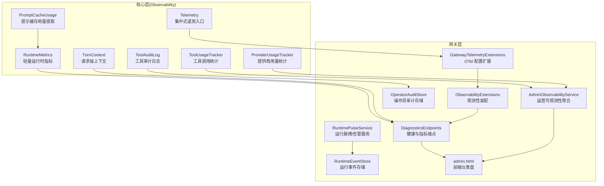

图表来源
- [Telemetry.cs:1-54](file://src/OpenClaw.Core/Observability/Telemetry.cs#L1-L54)
- [RuntimeMetrics.cs:1-312](file://src/OpenClaw.Core/Observability/RuntimeMetrics.cs#L1-L312)
- [ToolUsageTracker.cs:1-59](file://src/OpenClaw.Core/Observability/ToolUsageTracker.cs#L1-L59)
- [TurnContext.cs:1-76](file://src/OpenClaw.Core/Observability/TurnContext.cs#L1-L76)
- [ProviderUsageTracker.cs:1-176](file://src/OpenClaw.Core/Observability/ProviderUsageTracker.cs#L1-L176)
- [PromptCacheUsage.cs:1-55](file://src/OpenClaw.Core/Observability/PromptCacheUsage.cs#L1-L55)
- [ToolAuditLog.cs:1-125](file://src/OpenClaw.Core/Observability/ToolAuditLog.cs#L1-L125)
- [GatewayTelemetryExtensions.cs:1-52](file://src/OpenClaw.Gateway/Extensions/GatewayTelemetryExtensions.cs#L1-L52)
- [ObservabilityExtensions.cs:1-14](file://src/OpenClaw.Gateway/Composition/ObservabilityExtensions.cs#L1-L14)
- [DiagnosticsEndpoints.cs:51-80](file://src/OpenClaw.Gateway/Endpoints/DiagnosticsEndpoints.cs#L51-L80)
- [AdminObservabilityService.cs:107-182](file://src/OpenClaw.Gateway/AdminObservabilityService.cs#L107-L182)
- [RuntimeEventStore.cs:1-87](file://src/OpenClaw.Gateway/RuntimeEventStore.cs#L1-L87)
- [OperatorAuditStore.cs:1-41](file://src/OpenClaw.Gateway/OperatorAuditStore.cs#L1-L41)
- [RuntimePulseService.cs:1-38](file://src/OpenClaw.Gateway/RuntimePulseService.cs#L1-L38)
- [admin.html:2943-2971](file://src/OpenClaw.Gateway/wwwroot/admin.html#L2943-L2971)

章节来源
- [Telemetry.cs:1-54](file://src/OpenClaw.Core/Observability/Telemetry.cs#L1-L54)
- [GatewayTelemetryExtensions.cs:1-52](file://src/OpenClaw.Gateway/Extensions/GatewayTelemetryExtensions.cs#L1-L52)
- [DiagnosticsEndpoints.cs:51-80](file://src/OpenClaw.Gateway/Endpoints/DiagnosticsEndpoints.cs#L51-L80)

## 核心组件
- Telemetry：集中式 OpenTelemetry 入口，提供 ActivitySource 与 Meter，并注册关键指标（如工具执行时延直方图、限流超限计数器、待审批队列深度可观测量）。
- RuntimeMetrics：轻量运行时指标计数器集合，全部基于 Interlocked/Volatile 实现无锁读写，暴露快照用于健康检查与告警。
- ToolUsageTracker：按工具维度统计调用次数、失败次数、超时次数与总耗时，支持快照导出。
- TurnContext：单次用户回合的轻量上下文，记录 LLM 与工具调用指标，支持结构化日志输出。
- ProviderUsageTracker：按提供商/模型维度统计请求、重试、错误、输入/输出/缓存令牌用量，并维护最近回合明细。
- PromptCacheUsage：从 UsageDetails 中提取缓存读/写令牌用量，支持合并。
- ToolAuditLog：工具执行审计日志（JSON Lines），记录关键元数据并避免泄露敏感参数细节。
- 运营可观测性服务：聚合审批、运行时事件、操作员动作、死信、自动化运行等指标，生成摘要卡片与时间序列。
- 运行脉搏服务：周期性健康检查与告警生成，维护最近告警列表与心跳状态。

章节来源
- [Telemetry.cs:1-54](file://src/OpenClaw.Core/Observability/Telemetry.cs#L1-L54)
- [RuntimeMetrics.cs:1-312](file://src/OpenClaw.Core/Observability/RuntimeMetrics.cs#L1-L312)
- [ToolUsageTracker.cs:1-59](file://src/OpenClaw.Core/Observability/ToolUsageTracker.cs#L1-L59)
- [TurnContext.cs:1-76](file://src/OpenClaw.Core/Observability/TurnContext.cs#L1-L76)
- [ProviderUsageTracker.cs:1-176](file://src/OpenClaw.Core/Observability/ProviderUsageTracker.cs#L1-L176)
- [PromptCacheUsage.cs:1-55](file://src/OpenClaw.Core/Observability/PromptCacheUsage.cs#L1-L55)
- [ToolAuditLog.cs:1-125](file://src/OpenClaw.Core/Observability/ToolAuditLog.cs#L1-L125)
- [AdminObservabilityService.cs:107-182](file://src/OpenClaw.Gateway/AdminObservabilityService.cs#L107-L182)
- [RuntimePulseService.cs:1-38](file://src/OpenClaw.Gateway/RuntimePulseService.cs#L1-L38)

## 架构总览
下图展示了从请求进入、指标采集、遥测上报到运营面板可视化的完整链路。

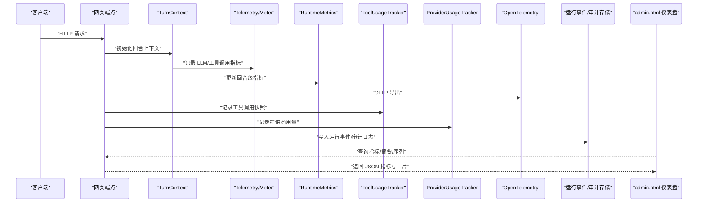

图表来源
- [DiagnosticsEndpoints.cs:51-80](file://src/OpenClaw.Gateway/Endpoints/DiagnosticsEndpoints.cs#L51-L80)
- [Telemetry.cs:1-54](file://src/OpenClaw.Core/Observability/Telemetry.cs#L1-L54)
- [RuntimeMetrics.cs:1-312](file://src/OpenClaw.Core/Observability/RuntimeMetrics.cs#L1-L312)
- [ToolUsageTracker.cs:1-59](file://src/OpenClaw.Core/Observability/ToolUsageTracker.cs#L1-L59)
- [ProviderUsageTracker.cs:1-176](file://src/OpenClaw.Core/Observability/ProviderUsageTracker.cs#L1-L176)
- [RuntimeEventStore.cs:1-87](file://src/OpenClaw.Gateway/RuntimeEventStore.cs#L1-L87)
- [OperatorAuditStore.cs:1-41](file://src/OpenClaw.Gateway/OperatorAuditStore.cs#L1-L41)
- [admin.html:2943-2971](file://src/OpenClaw.Gateway/wwwroot/admin.html#L2943-L2971)

## 详细组件分析

### Telemetry（集中式遥测）
- 职责：提供统一的 ActivitySource 与 Meter，注册应用级指标。
- 关键指标：
  - 工具执行时延直方图（毫秒），按工具名与成功/失败标签分组。
  - 限流超限计数器，按行为者类型与策略标签分组。
  - 待审批队列深度可观测量（通过注册可观察量实现）。
- 集成：通过 GatewayTelemetryExtensions 注册 OTLP 导出器，启用日志、指标与追踪。

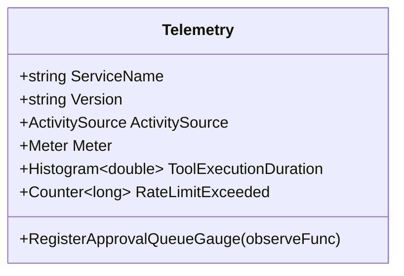

图表来源
- [Telemetry.cs:1-54](file://src/OpenClaw.Core/Observability/Telemetry.cs#L1-L54)
- [GatewayTelemetryExtensions.cs:1-52](file://src/OpenClaw.Gateway/Extensions/GatewayTelemetryExtensions.cs#L1-L52)

章节来源
- [Telemetry.cs:1-54](file://src/OpenClaw.Core/Observability/Telemetry.cs#L1-L54)
- [GatewayTelemetryExtensions.cs:1-52](file://src/OpenClaw.Gateway/Extensions/GatewayTelemetryExtensions.cs#L1-L52)

### RuntimeMetrics（轻量运行时指标）
- 职责：以 Interlocked/Volatile 实现的无锁计数器集合，暴露快照供健康端点与告警使用。
- 指标类别：请求总量、LLM 调用/令牌、工具调用/失败/超时、会话管理、进程与沙箱租约、保留清理、脉搏运行状态等。
- 使用场景：/metrics 端点返回快照；运行脉搏服务更新活跃会话与熔断器状态。

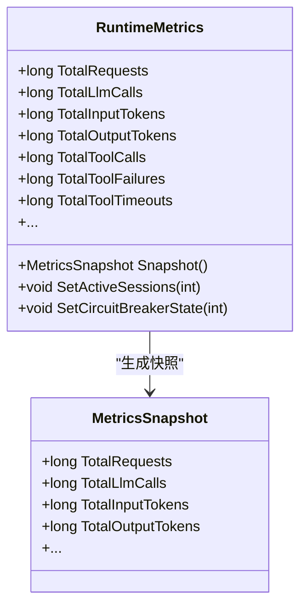

图表来源
- [RuntimeMetrics.cs:1-312](file://src/OpenClaw.Core/Observability/RuntimeMetrics.cs#L1-L312)

章节来源
- [RuntimeMetrics.cs:1-312](file://src/OpenClaw.Core/Observability/RuntimeMetrics.cs#L1-L312)
- [DiagnosticsEndpoints.cs:51-80](file://src/OpenClaw.Gateway/Endpoints/DiagnosticsEndpoints.cs#L51-L80)

### ToolUsageTracker（工具调用统计）
- 职责：按工具名聚合调用次数、失败次数、超时次数与总耗时（毫秒）。
- 并发安全：使用 Interlocked 与双精度位模式累加总耗时，保证线程安全。
- 输出：提供快照列表，按调用次数降序排列。

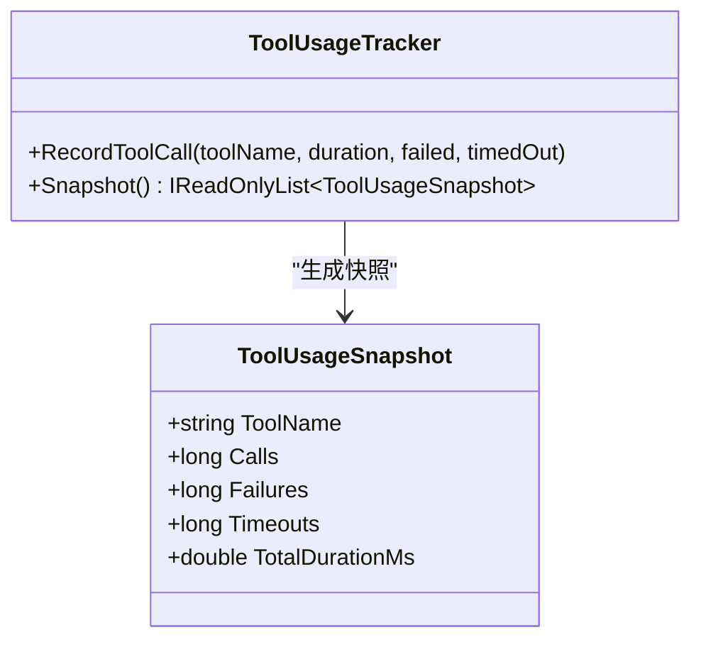

图表来源
- [ToolUsageTracker.cs:1-59](file://src/OpenClaw.Core/Observability/ToolUsageTracker.cs#L1-L59)

章节来源
- [ToolUsageTracker.cs:1-59](file://src/OpenClaw.Core/Observability/ToolUsageTracker.cs#L1-L59)

### TurnContext（请求级上下文与指标）
- 职责：携带 CorrelationId、SessionId、ChannelId；记录回合内 LLM 与工具调用指标。
- 特性：优先使用 Activity.Current.TraceId，否则回退 GUID 截断；并发安全的工具指标通过 Interlocked 更新。
- 输出：ToString 返回结构化日志摘要，便于统一日志格式。

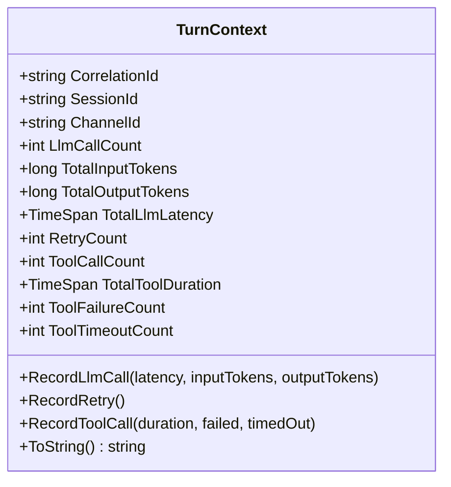

图表来源
- [TurnContext.cs:1-76](file://src/OpenClaw.Core/Observability/TurnContext.cs#L1-L76)

章节来源
- [TurnContext.cs:1-76](file://src/OpenClaw.Core/Observability/TurnContext.cs#L1-L76)

### ProviderUsageTracker（提供商用量统计）
- 职责：按 ProviderId/ModelId 维度统计请求、重试、错误与输入/输出/缓存令牌用量。
- 最近回合：维护固定大小队列，记录最近会话回合的令牌与估算构成。
- 输出：快照列表与最近回合查询接口。

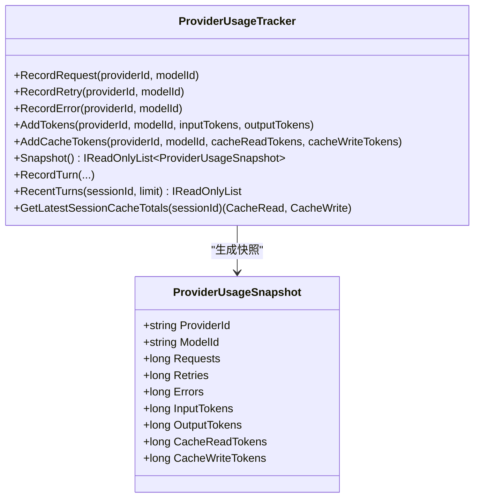

图表来源
- [ProviderUsageTracker.cs:1-176](file://src/OpenClaw.Core/Observability/ProviderUsageTracker.cs#L1-L176)

章节来源
- [ProviderUsageTracker.cs:1-176](file://src/OpenClaw.Core/Observability/ProviderUsageTracker.cs#L1-L176)

### PromptCacheUsage（提示缓存用量提取）
- 职责：从 UsageDetails 中提取缓存读取与写入令牌用量，支持合并多个来源。
- 应用：与 ProviderUsageTracker 协同，用于成本与缓存效率分析。

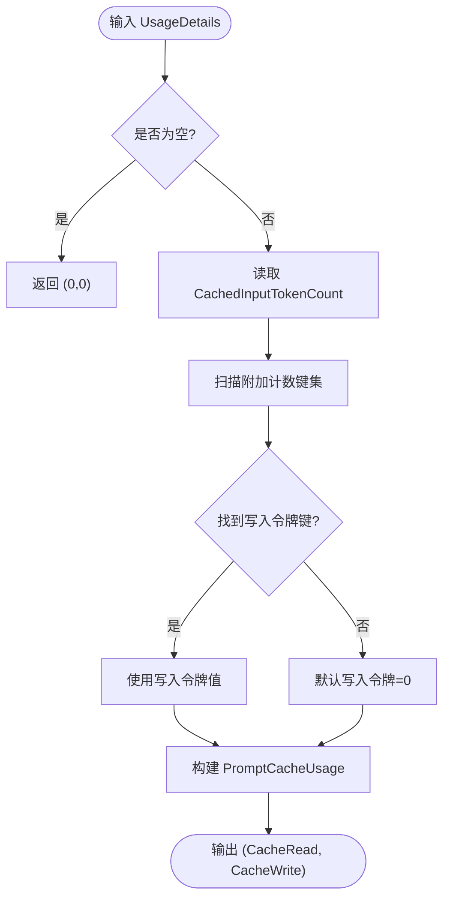

图表来源
- [PromptCacheUsage.cs:1-55](file://src/OpenClaw.Core/Observability/PromptCacheUsage.cs#L1-L55)

章节来源
- [PromptCacheUsage.cs:1-55](file://src/OpenClaw.Core/Observability/PromptCacheUsage.cs#L1-L55)

### ToolAuditLog（工具审计日志）
- 职责：线程安全的 JSON Lines 审计日志，记录工具执行关键元数据（不包含原始参数与结果）。
- 安全：默认不记录敏感载荷，仅记录字节数；提供最近条目快照。
- 存储：失败时通过 RuntimeMetrics 计数器进行告警埋点。

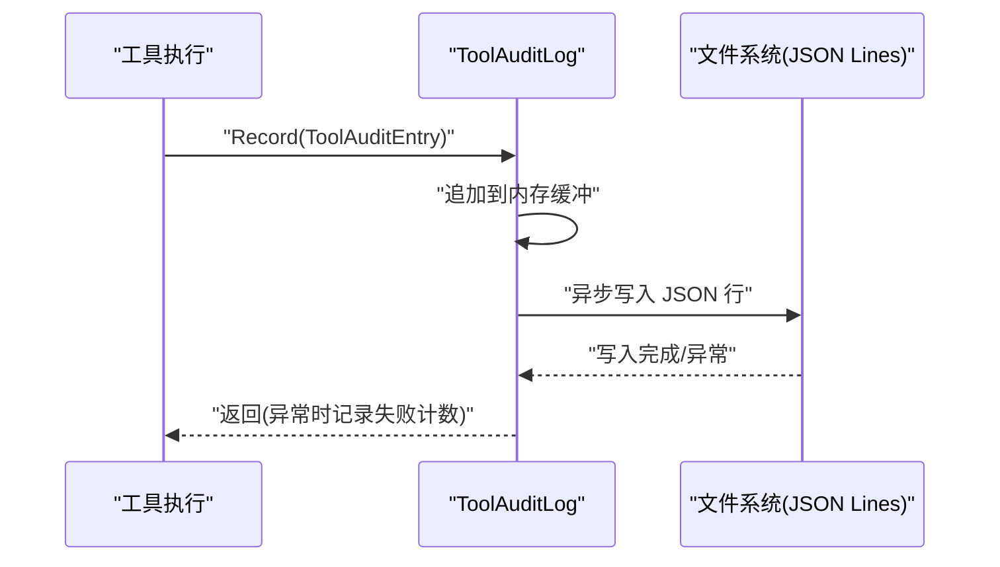

图表来源
- [ToolAuditLog.cs:1-125](file://src/OpenClaw.Core/Observability/ToolAuditLog.cs#L1-L125)
- [RuntimeEventStore.cs:1-87](file://src/OpenClaw.Gateway/RuntimeEventStore.cs#L1-L87)

章节来源
- [ToolAuditLog.cs:1-125](file://src/OpenClaw.Core/Observability/ToolAuditLog.cs#L1-L125)
- [RuntimeEventStore.cs:1-87](file://src/OpenClaw.Gateway/RuntimeEventStore.cs#L1-L87)

### 运营可观测性服务与端点
- AdminObservabilityService：聚合审批历史、运行时事件、操作员审计、死信、自动化运行、提供商用量与路由、通道就绪度等，生成摘要卡片与时间序列。
- 诊断端点：/metrics 返回 RuntimeMetrics 快照；/metrics/providers 返回提供商用量快照。
- 前端仪表盘：admin.html 展示摘要卡片、错误/重试分布、操作员动作趋势等。

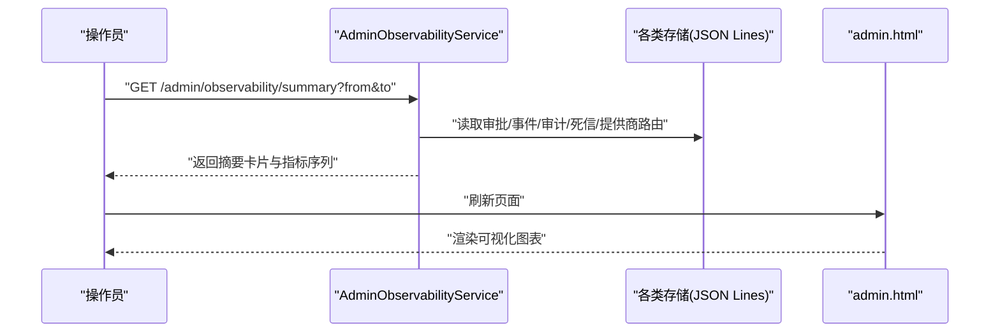

图表来源
- [AdminObservabilityService.cs:107-182](file://src/OpenClaw.Gateway/AdminObservabilityService.cs#L107-L182)
- [DiagnosticsEndpoints.cs:51-80](file://src/OpenClaw.Gateway/Endpoints/DiagnosticsEndpoints.cs#L51-L80)
- [admin.html:2943-2971](file://src/OpenClaw.Gateway/wwwroot/admin.html#L2943-L2971)

章节来源
- [AdminObservabilityService.cs:107-182](file://src/OpenClaw.Gateway/AdminObservabilityService.cs#L107-L182)
- [DiagnosticsEndpoints.cs:51-80](file://src/OpenClaw.Gateway/Endpoints/DiagnosticsEndpoints.cs#L51-L80)
- [admin.html:2943-2971](file://src/OpenClaw.Gateway/wwwroot/admin.html#L2943-L2971)

### 运行脉搏服务（RuntimePulseService）
- 职责：周期性运行健康检查，生成“心跳”或“告警”，维护最近告警列表与任务执行时间戳，更新 RuntimeMetrics。
- 可视化：admin.html 提供手动触发与查看最近告警的能力。

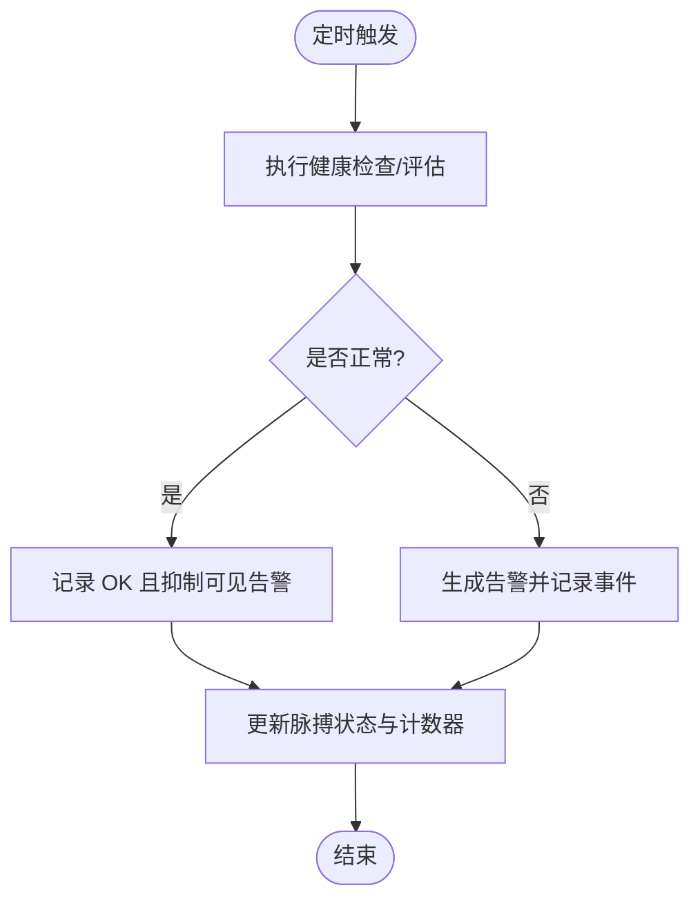

图表来源
- [RuntimePulseService.cs:241-279](file://src/OpenClaw.Gateway/RuntimePulseService.cs#L241-L279)
- [PulseModels.cs:68-102](file://src/OpenClaw.Core/Models/PulseModels.cs#L68-L102)
- [admin.html:3942-3970](file://src/OpenClaw.Gateway/wwwroot/admin.html#L3942-L3970)

章节来源
- [RuntimePulseService.cs:1-38](file://src/OpenClaw.Gateway/RuntimePulseService.cs#L1-L38)
- [PulseModels.cs:68-102](file://src/OpenClaw.Core/Models/PulseModels.cs#L68-L102)
- [admin.html:3942-3970](file://src/OpenClaw.Gateway/wwwroot/admin.html#L3942-L3970)

## 依赖关系分析
- Telemetry 与 GatewayTelemetryExtensions：遥测配置与导出。
- RuntimeMetrics 与 DiagnosticsEndpoints：健康端点与指标暴露。
- ToolUsageTracker 与 ProviderUsageTracker：运营可观测性服务的数据源。
- ToolAuditLog 与 RuntimeEventStore/OperatorAuditStore：结构化日志与审计归档。
- admin.html：前端可视化与交互。

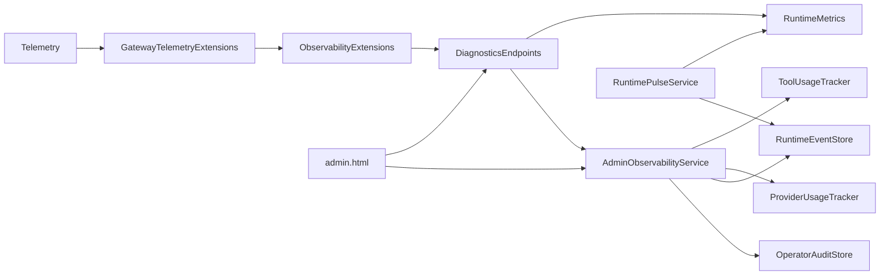

图表来源
- [GatewayTelemetryExtensions.cs:1-52](file://src/OpenClaw.Gateway/Extensions/GatewayTelemetryExtensions.cs#L1-L52)
- [ObservabilityExtensions.cs:1-14](file://src/OpenClaw.Gateway/Composition/ObservabilityExtensions.cs#L1-L14)
- [DiagnosticsEndpoints.cs:51-80](file://src/OpenClaw.Gateway/Endpoints/DiagnosticsEndpoints.cs#L51-L80)
- [AdminObservabilityService.cs:107-182](file://src/OpenClaw.Gateway/AdminObservabilityService.cs#L107-L182)
- [RuntimeEventStore.cs:1-87](file://src/OpenClaw.Gateway/RuntimeEventStore.cs#L1-L87)
- [OperatorAuditStore.cs:1-41](file://src/OpenClaw.Gateway/OperatorAuditStore.cs#L1-L41)
- [RuntimePulseService.cs:1-38](file://src/OpenClaw.Gateway/RuntimePulseService.cs#L1-L38)
- [admin.html:2943-2971](file://src/OpenClaw.Gateway/wwwroot/admin.html#L2943-L2971)

章节来源
- [GatewayTelemetryExtensions.cs:1-52](file://src/OpenClaw.Gateway/Extensions/GatewayTelemetryExtensions.cs#L1-L52)
- [ObservabilityExtensions.cs:1-14](file://src/OpenClaw.Gateway/Composition/ObservabilityExtensions.cs#L1-L14)
- [DiagnosticsEndpoints.cs:51-80](file://src/OpenClaw.Gateway/Endpoints/DiagnosticsEndpoints.cs#L51-L80)
- [AdminObservabilityService.cs:107-182](file://src/OpenClaw.Gateway/AdminObservabilityService.cs#L107-L182)

## 性能考量
- 指标采集路径：
  - Telemetry 使用 Histogram/Counter/可观察量，建议在高并发场景下合理设置桶边界与采样率，避免直方图过度膨胀。
  - RuntimeMetrics 与 TurnContext 全部采用 Interlocked/Volatile，读写开销极低，适合高频采集。
  - ToolUsageTracker 对总耗时使用双精度位模式累加，避免浮点锁竞争。
- I/O 与持久化：
  - ToolAuditLog/运行事件/审计日志均为 JSON Lines，采用追加写入；失败时通过 RuntimeMetrics 计数器进行告警埋点，避免阻塞主流程。
- 可视化与查询：
  - /metrics 与运营摘要端点返回 JSON，建议前端按需拉取与缓存；时间序列端点支持桶大小与时间窗口参数，避免一次性返回过大数据集。

[本节为通用性能指导，无需特定文件引用]

## 故障排查指南
- 健康检查失败：
  - 检查 /metrics 是否返回快照；确认 RuntimeMetrics.ActiveSessions 与 CircuitBreakerState 是否异常。
  - 参考：[DiagnosticsEndpoints.cs:51-80](file://src/OpenClaw.Gateway/Endpoints/DiagnosticsEndpoints.cs#L51-L80)
- 审计/事件写入失败：
  - 观察 RuntimeMetrics.RuntimeEventWriteFailures 与 OperatorAuditWriteFailures 是否递增；检查磁盘权限与路径。
  - 参考：[RuntimeEventStore.cs:1-87](file://src/OpenClaw.Gateway/RuntimeEventStore.cs#L1-L87)，[OperatorAuditStore.cs:1-41](file://src/OpenClaw.Gateway/OperatorAuditStore.cs#L1-L41)
- 运行脉搏告警：
  - 通过 admin.html 查看最近告警列表与运行状态；必要时手动触发运行脉搏。
  - 参考：[RuntimePulseService.cs:241-279](file://src/OpenClaw.Gateway/RuntimePulseService.cs#L241-L279)，[admin.html:3942-3970](file://src/OpenClaw.Gateway/wwwroot/admin.html#L3942-L3970)
- 指标缺失或异常：
  - 确认 Telemetry 已正确注册 Meter 与导出器；检查 OTLP 端点可达性与认证。
  - 参考：[GatewayTelemetryExtensions.cs:1-52](file://src/OpenClaw.Gateway/Extensions/GatewayTelemetryExtensions.cs#L1-L52)

章节来源
- [DiagnosticsEndpoints.cs:51-80](file://src/OpenClaw.Gateway/Endpoints/DiagnosticsEndpoints.cs#L51-L80)
- [RuntimeEventStore.cs:1-87](file://src/OpenClaw.Gateway/RuntimeEventStore.cs#L1-L87)
- [OperatorAuditStore.cs:1-41](file://src/OpenClaw.Gateway/OperatorAuditStore.cs#L1-L41)
- [RuntimePulseService.cs:241-279](file://src/OpenClaw.Gateway/RuntimePulseService.cs#L241-L279)
- [admin.html:3942-3970](file://src/OpenClaw.Gateway/wwwroot/admin.html#L3942-L3970)
- [GatewayTelemetryExtensions.cs:1-52](file://src/OpenClaw.Gateway/Extensions/GatewayTelemetryExtensions.cs#L1-L52)

## 结论
本可观测性体系以 Telemetry 为核心，结合 RuntimeMetrics、TurnContext、ToolUsageTracker、ProviderUsageTracker 与审计/运行事件存储，形成“指标—追踪—日志—可视化—告警”的闭环。通过运营可观测性服务与前端仪表盘，实现对审批、提供商、通道、自动化与会话等多维度的综合监控与告警，支撑性能优化、根因分析与容量规划。

[本节为总结性内容，无需特定文件引用]

## 附录

### 指标定义与用途
- 工具执行时延直方图：衡量工具执行性能与稳定性。
- 限流超限计数器：识别流量高峰与策略配置问题。
- 待审批队列深度：评估治理与审批吞吐瓶颈。
- 运行时指标（RuntimeMetrics）：基础设施与运行状态概览。
- 工具调用统计（ToolUsageTracker）：工具使用频次与失败/超时趋势。
- 提供商用量（ProviderUsageTracker）：成本与资源消耗分析。
- 审计日志（ToolAuditLog）：合规与安全审计依据。

章节来源
- [Telemetry.cs:1-54](file://src/OpenClaw.Core/Observability/Telemetry.cs#L1-L54)
- [RuntimeMetrics.cs:1-312](file://src/OpenClaw.Core/Observability/RuntimeMetrics.cs#L1-L312)
- [ToolUsageTracker.cs:1-59](file://src/OpenClaw.Core/Observability/ToolUsageTracker.cs#L1-L59)
- [ProviderUsageTracker.cs:1-176](file://src/OpenClaw.Core/Observability/ProviderUsageTracker.cs#L1-L176)
- [ToolAuditLog.cs:1-125](file://src/OpenClaw.Core/Observability/ToolAuditLog.cs#L1-L125)

### 采样策略与聚合
- 采样：Telemetry 的 Histogram 默认由 OTel SDK 控制桶与采样；建议根据业务峰值调整桶边界。
- 聚合：ToolUsageTracker/ProviderUsageTracker 提供 Snapshot 与 RecentTurns 查询，支持按工具/提供商/会话维度聚合。
- 时间序列：运营摘要服务支持时间窗口与桶大小参数，前端按需渲染。

章节来源
- [AdminObservabilityService.cs:107-182](file://src/OpenClaw.Gateway/AdminObservabilityService.cs#L107-L182)
- [ToolUsageTracker.cs:1-59](file://src/OpenClaw.Core/Observability/ToolUsageTracker.cs#L1-L59)
- [ProviderUsageTracker.cs:1-176](file://src/OpenClaw.Core/Observability/ProviderUsageTracker.cs#L1-L176)

### 可视化与仪表盘
- 摘要卡片：审批延迟分布、提供商错误/重试分布、操作员动作趋势、通道漂移等。
- 时间序列：按分钟桶聚合的指标折线图。
- 前端：admin.html 提供查询与展示能力。

章节来源
- [AdminObservabilityService.cs:107-182](file://src/OpenClaw.Gateway/AdminObservabilityService.cs#L107-L182)
- [OperatorGovernanceModels.cs:344-433](file://src/OpenClaw.Core/Models/OperatorGovernanceModels.cs#L344-L433)
- [admin.html:2943-2971](file://src/OpenClaw.Gateway/wwwroot/admin.html#L2943-L2971)

### 监控配置示例与告警规则
- 遥测配置：通过 GatewayTelemetryExtensions 注册 OTLP 导出器；可选集成 Langfuse 或自定义 OTLP 端点。
- 告警规则建议：
  - 运行时错误/告警计数持续上升
  - 工具超时/失败率超过阈值
  - 审批队列深度长时间处于高位
  - 通道就绪度低于阈值
  - 提供商错误/重试率异常升高
- 参考配置：appsettings.json 中的遥测与运行参数。

章节来源
- [GatewayTelemetryExtensions.cs:1-52](file://src/OpenClaw.Gateway/Extensions/GatewayTelemetryExtensions.cs#L1-L52)
- [appsettings.json:1-800](file://src/OpenClaw.Gateway/appsettings.json#L1-L800)

### 分布式追踪、链路分析与根因分析
- 分布式追踪：使用 Telemetry.ActivitySource 与 AspNetCore/HttpClient Instrumentation 自动追踪；OTLP 导出至外部后端。
- 链路分析：结合 TurnContext.CorrelationId 与 Activity.TraceId，跨服务串联请求链路。
- 根因分析：结合 ToolAuditLog、运行事件与运行脉搏告警，定位失败环节与异常模式。

章节来源
- [Telemetry.cs:1-54](file://src/OpenClaw.Core/Observability/Telemetry.cs#L1-L54)
- [GatewayTelemetryExtensions.cs:1-52](file://src/OpenClaw.Gateway/Extensions/GatewayTelemetryExtensions.cs#L1-L52)
- [TurnContext.cs:1-76](file://src/OpenClaw.Core/Observability/TurnContext.cs#L1-L76)
- [ToolAuditLog.cs:1-125](file://src/OpenClaw.Core/Observability/ToolAuditLog.cs#L1-L125)
- [RuntimePulseService.cs:241-279](file://src/OpenClaw.Gateway/RuntimePulseService.cs#L241-L279)

### 容量规划支持
- 指标来源：RuntimeMetrics（会话数、进程/租约、保留清理）、ProviderUsageTracker（令牌用量）、ToolUsageTracker（调用与耗时）。
- 建议：基于时间序列趋势预测峰值，结合熔断与重试策略优化资源利用率。

章节来源
- [RuntimeMetrics.cs:1-312](file://src/OpenClaw.Core/Observability/RuntimeMetrics.cs#L1-L312)
- [ProviderUsageTracker.cs:1-176](file://src/OpenClaw.Core/Observability/ProviderUsageTracker.cs#L1-L176)
- [ToolUsageTracker.cs:1-59](file://src/OpenClaw.Core/Observability/ToolUsageTracker.cs#L1-L59)