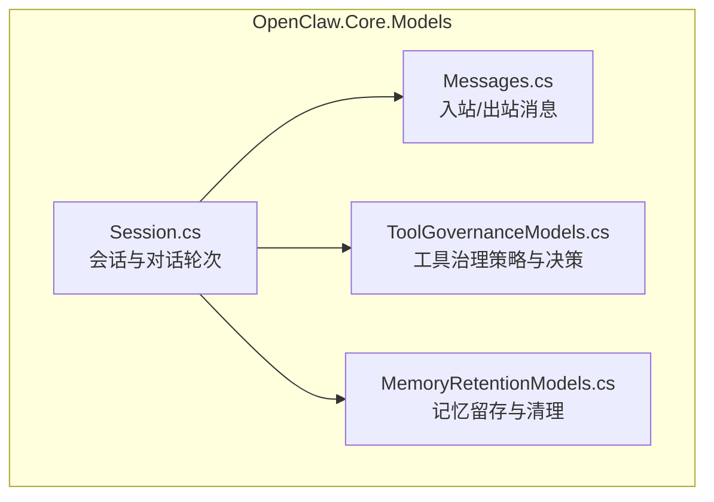
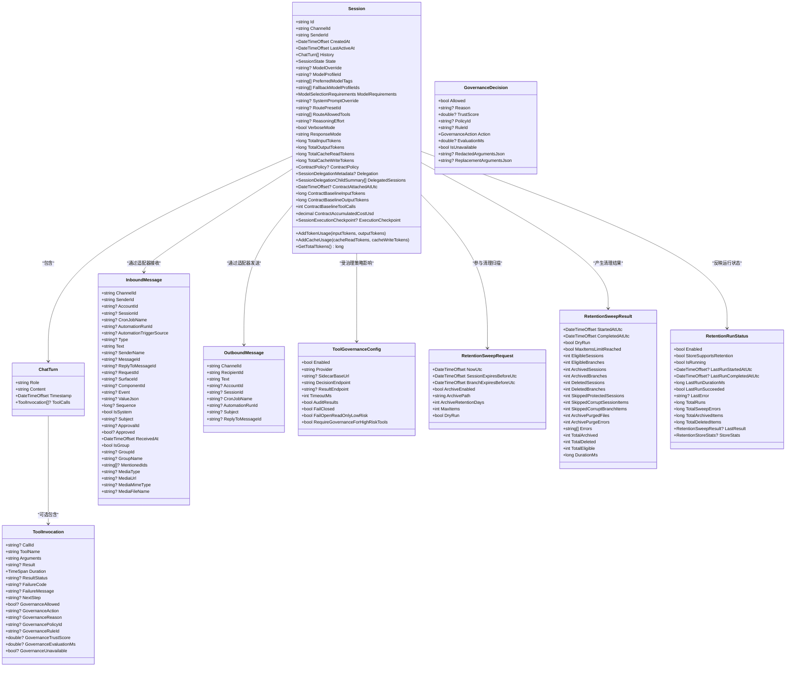
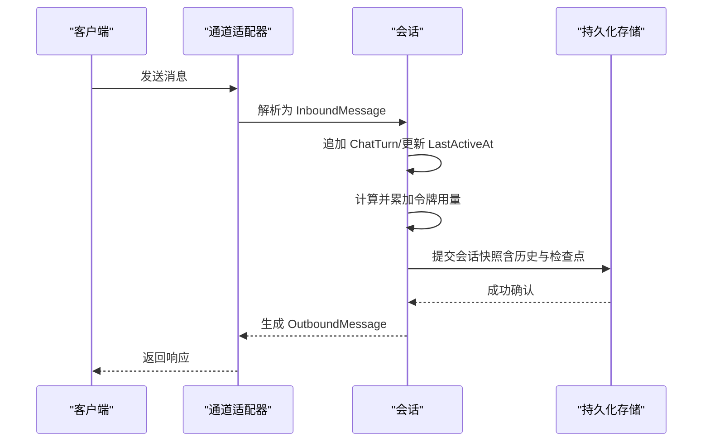
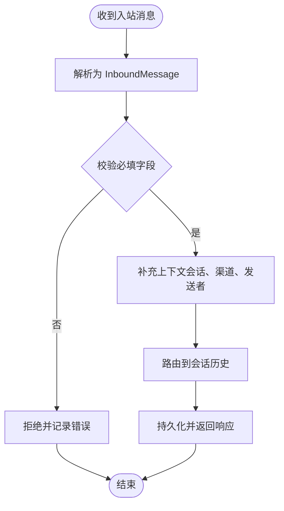
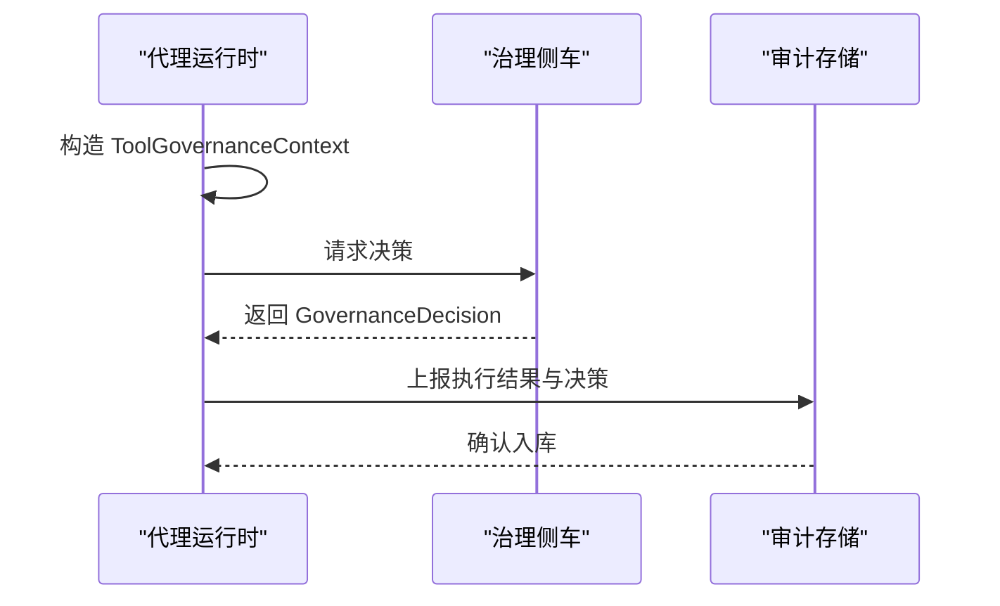
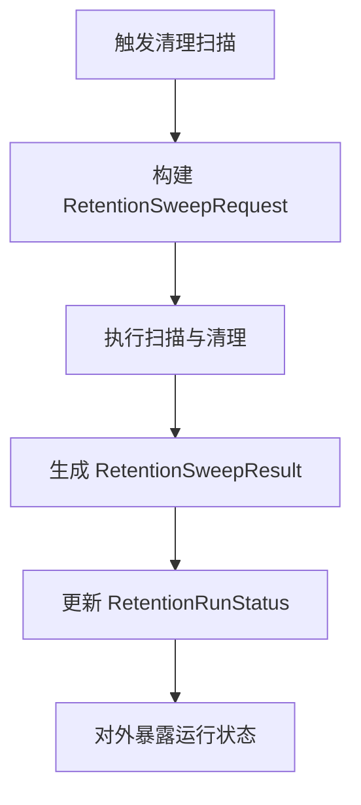
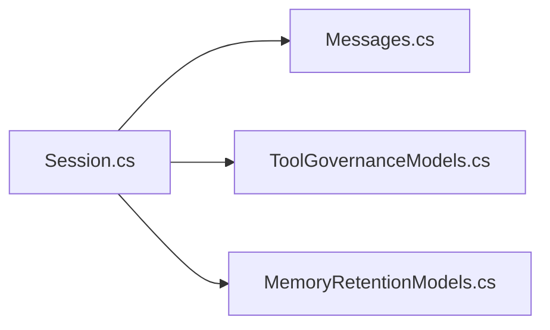

# 数据模型和实体

<cite>
**本文引用的文件**
- [Session.cs](file://src/OpenClaw.Core/Models/Session.cs)
- [Messages.cs](file://src/OpenClaw.Core/Models/Messages.cs)
- [ToolGovernanceModels.cs](file://src/OpenClaw.Core/Models/ToolGovernanceModels.cs)
- [MemoryRetentionModels.cs](file://src/OpenClaw.Core/Models/MemoryRetentionModels.cs)
</cite>

## 目录
1. [引言](#引言)
2. [项目结构](#项目结构)
3. [核心组件](#核心组件)
4. [架构总览](#架构总览)
5. [详细组件分析](#详细组件分析)
6. [依赖分析](#依赖分析)
7. [性能考量](#性能考量)
8. [故障排查指南](#故障排查指南)
9. [结论](#结论)
10. [附录](#附录)

## 引言
本文件聚焦于数据模型与实体，系统化梳理会话、消息、工具治理与记忆留存等核心实体的设计理念、字段定义、关系映射、约束规则与序列化机制。文档同时覆盖验证策略、转换规则、默认值与空值处理，并给出 ORM 映射建议、查询优化与性能考虑，以及数据完整性、并发控制、事务与一致性策略的实践建议。

## 项目结构
OpenClaw.Core 的模型位于 Models 命名空间下，采用强类型记录与类组合表达业务实体，配合 AOT 友好的源生成上下文实现零分配序列化。消息模型用于跨通道适配器的数据交换；会话模型承载对话历史、状态与令牌统计；工具治理模型描述治理策略与决策；记忆留存模型支撑过期清理与归档。

**图表来源**
- [Session.cs:15-135](file://src/OpenClaw.Core/Models/Session.cs#L15-L135)
- [Messages.cs:6-45](file://src/OpenClaw.Core/Models/Messages.cs#L6-L45)
- [ToolGovernanceModels.cs:24-63](file://src/OpenClaw.Core/Models/ToolGovernanceModels.cs#L24-L63)
- [MemoryRetentionModels.cs:7-51](file://src/OpenClaw.Core/Models/MemoryRetentionModels.cs#L7-L51)

**章节来源**
- [Session.cs:1-1115](file://src/OpenClaw.Core/Models/Session.cs#L1-L1115)
- [Messages.cs:1-62](file://src/OpenClaw.Core/Models/Messages.cs#L1-L62)
- [ToolGovernanceModels.cs:1-150](file://src/OpenClaw.Core/Models/ToolGovernanceModels.cs#L1-L150)
- [MemoryRetentionModels.cs:1-83](file://src/OpenClaw.Core/Models/MemoryRetentionModels.cs#L1-L83)

## 核心组件
- 会话（Session）：承载用户与代理之间的交互生命周期，包含历史轮次、状态、令牌用量、合同策略、委托元数据与执行检查点等。
- 消息（InboundMessage/OutboundMessage）：标准化跨通道的消息载体，支持文本、媒体、群聊、自动化触发等扩展字段。
- 工具治理（ToolGovernance*）：定义治理配置、风险等级、决策结果、上下文与侧车通信协议。
- 记忆留存（MemoryRetention*）：定义清理扫描请求、结果与运行状态，支持归档与删除策略。

**章节来源**
- [Session.cs:15-135](file://src/OpenClaw.Core/Models/Session.cs#L15-L135)
- [Messages.cs:6-61](file://src/OpenClaw.Core/Models/Messages.cs#L6-L61)
- [ToolGovernanceModels.cs:24-150](file://src/OpenClaw.Core/Models/ToolGovernanceModels.cs#L24-L150)
- [MemoryRetentionModels.cs:7-82](file://src/OpenClaw.Core/Models/MemoryRetentionModels.cs#L7-L82)

## 架构总览
以下图展示核心实体之间的关系与典型交互：会话持有对话轮次与工具调用信息；消息在通道适配器与会话之间传递；工具治理贯穿工具执行前后的安全决策；记忆留存模型用于会话与分支的生命周期管理。

**图表来源**
- [Session.cs:15-265](file://src/OpenClaw.Core/Models/Session.cs#L15-L265)
- [Messages.cs:6-61](file://src/OpenClaw.Core/Models/Messages.cs#L6-L61)
- [ToolGovernanceModels.cs:24-150](file://src/OpenClaw.Core/Models/ToolGovernanceModels.cs#L24-L150)
- [MemoryRetentionModels.cs:7-82](file://src/OpenClaw.Core/Models/MemoryRetentionModels.cs#L7-L82)

## 详细组件分析

### 会话模型（Session）
- 设计理念
  - 面向零分配序列化的源生成上下文设计，确保高性能 JSON 序列化与反序列化。
  - 将令牌用量、缓存读写、合同基线与成本累积等运营指标内嵌到会话对象中，便于统一追踪与审计。
  - 支持稳定会话绑定、委托元数据、执行检查点与工具调用链路的完整记录。
- 关键字段与约束
  - 标识与归属：Id、ChannelId、SenderId 必填且不可变更（init-only），Created/LastActiveAt 默认当前时间。
  - 历史与状态：History 初始为空列表；State 使用枚举（Active/Paused/Expired）。
  - 模型选择：支持覆盖模型、模型档案、偏好标签、回退档案与能力要求。
  - 合同与计费：ContractPolicy、ContractAttachedAtUtc、基线令牌数、工具调用数与累计成本。
  - 委托与检查点：Delegation、DelegatedSessions、ExecutionCheckpoint。
  - 并发计数：TotalInputTokens/OutputTokens/CacheRead/CacheWrite 使用原子操作保障并发安全。
- 序列化机制
  - 通过 [JsonSerializable] 标注会话及其相关类型，配合 CoreJsonContext 实现 AOT 友好序列化。
  - 默认忽略 null 字段，命名策略为 camelCase，避免冗余输出。
- 使用示例
  - 创建新会话：设置 ChannelId、SenderId、可选模型档案与路由预设。
  - 追加对话轮次：向 History 添加 ChatTurn，必要时更新 LastActiveAt。
  - 记录令牌与缓存：调用 AddTokenUsage/AddCacheUsage 更新累计值。
  - 写入检查点：在工具批处理完成后更新 ExecutionCheckpoint。
- ORM 映射建议
  - 表结构：以 Session.Id 为主键；History 作为 JSON 文本存储或拆分为独立表（见“查询优化”）。
  - 索引：对 ChannelId、SenderId、CreatedAt、LastActiveAt 建立索引；对 Delegation.ParentSessionId 建立外键索引。
  - 版本兼容：History 与 Checkpoint 字段采用 JSON 存储，便于演进；提供迁移脚本处理字段变更。
- 查询优化与性能
  - 历史检索：若 History 拆分存储，按 SessionId+Timestamp 排序；否则使用 JSON 路径查询。
  - 统计聚合：利用 TotalInputTokens/OutputTokens/CacheRead/CacheWrite 的原子字段进行快速汇总。
  - 批量写入：使用批量插入与事务提交减少往返开销。
- 完整性与一致性
  - 并发控制：令牌与缓存计数使用 Interlocked 操作；会话状态变更需在单线程上下文中完成。
  - 事务处理：会话创建、历史追加与检查点写入应置于同一事务，失败回滚。
  - 一致性策略：检查点状态（ready_to_resume/completed/failed）与历史长度保持一致。

**图表来源**
- [Session.cs:15-135](file://src/OpenClaw.Core/Models/Session.cs#L15-L135)
- [Messages.cs:6-61](file://src/OpenClaw.Core/Models/Messages.cs#L6-L61)

**章节来源**
- [Session.cs:15-265](file://src/OpenClaw.Core/Models/Session.cs#L15-L265)
- [Session.cs:270-520](file://src/OpenClaw.Core/Models/Session.cs#L270-L520)
- [Session.cs:520-800](file://src/OpenClaw.Core/Models/Session.cs#L520-L800)
- [Session.cs:800-1115](file://src/OpenClaw.Core/Models/Session.cs#L800-L1115)

### 消息模型（InboundMessage/OutboundMessage）
- 设计理念
  - 统一跨通道的消息格式，支持文本、媒体、群聊、自动化触发与审批流程。
  - 入站消息携带接收时间与取消令牌，便于可观测性与超时控制。
- 关键字段与约束
  - 入站：ChannelId/SenderId/AccountId/SessionId/Cron/Automation/Type/Text/Subject/Approval 等；支持群聊与媒体字段。
  - 出站：RecipientId/ChannelId/Text/AccountId/SessionId/Cron/Automation/Subject/ReplyToMessageId。
  - 时间戳：ReceivedAt 默认当前时间；序列号 Sequence 用于顺序控制。
- 序列化机制
  - 采用源生成上下文，字段命名 camelCase，忽略 null。
- 使用示例
  - 入站：通道适配器解析后构造 InboundMessage，注入到会话历史。
  - 出站：根据会话状态与路由规则生成 OutboundMessage。
- ORM 映射建议
  - 表结构：以 MessageId 为主键；Text/ValueJson 采用 TEXT；群聊与媒体字段拆分存储或 JSON。
  - 索引：对 ChannelId、SenderId、SessionId、ReceivedAt 建立索引。
- 查询优化与性能
  - 分页与排序：按 ReceivedAt/Sequence 分页；对 SessionId 进行过滤。
  - 缓存：热点消息可缓存至内存数据库以降低延迟。
- 完整性与一致性
  - 并发控制：消息写入采用队列与事务，保证不丢不重。
  - 一致性策略：入站与出站消息通过 RequestId/ReplyToMessageId 关联，形成端到端跟踪。

**图表来源**
- [Messages.cs:6-61](file://src/OpenClaw.Core/Models/Messages.cs#L6-L61)

**章节来源**
- [Messages.cs:6-61](file://src/OpenClaw.Core/Models/Messages.cs#L6-L61)

### 工具治理模型（ToolGovernance*）
- 设计理念
  - 通过治理配置与风险等级定义工具行为边界；决策结果支持允许、拒绝、需要审批、脱敏与仅审计。
  - 上下文包含会话、渠道、发送者、调用 ID、工具描述与动作描述，便于溯源与审计。
- 关键字段与约束
  - 配置：启用开关、提供方、侧车地址、端点、超时、审计、闭合策略与高危工具强制治理。
  - 决策：Allowed/Reason/TrustScore/PolicyId/RuleId/Action/EvaluationMs/IsUnavailable/脱敏参数。
  - 描述：名称、类别、风险等级、是否只读、网络/文件系统/执行/外发访问权限与能力集合。
  - 上下文：AgentId/SessionId/ChannelId/SenderId/CorrelationId/CallId/ToolName/ArgumentsJson/ActionDescriptor/Descriptor/IsStreaming。
- 序列化机制
  - 枚举使用字符串转换器；治理相关类型纳入源生成上下文。
- 使用示例
  - 工具执行前：构造 ToolGovernanceContext，调用侧车获取 GovernanceDecision。
  - 工具执行后：上报 ToolGovernanceExecutionResult 与 GovernanceDecision。
- ORM 映射建议
  - 表结构：治理决策与执行结果可拆表存储；侧车请求/响应采用 JSON 文本。
  - 索引：对 SessionId、ToolName、PolicyId、RuleId 建立索引。
- 查询优化与性能
  - 决策缓存：对相同上下文的决策进行短期缓存；超时与失败回退策略明确。
  - 批量上报：工具执行结果批量上报，减少网络往返。
- 完整性与一致性
  - 并发控制：决策与结果上报需幂等；重复请求返回相同结果。
  - 一致性策略：FailClosed/FailOpenReadOnlyLowRisk 控制异常场景下的安全策略。

**图表来源**
- [ToolGovernanceModels.cs:24-150](file://src/OpenClaw.Core/Models/ToolGovernanceModels.cs#L24-L150)

**章节来源**
- [ToolGovernanceModels.cs:5-150](file://src/OpenClaw.Core/Models/ToolGovernanceModels.cs#L5-L150)

### 记忆留存模型（MemoryRetention*）
- 设计理念
  - 通过扫描请求定义过期阈值、归档路径与保留天数；扫描结果统计归档/删除数量与错误。
  - 运行状态记录启用、运行次数、持续时间与最后结果，便于运维监控。
- 关键字段与约束
  - 扫描请求：NowUtc、Session/分支过期阈值、归档开关与路径、最大条目数、DryRun。
  - 扫描结果：开始/结束时间、DryRun、各阶段计数、跳过项、归档清理统计与错误列表。
  - 运行状态：Enabled/StoreSupportsRetention/IsRunning/LastRun*、LastError、TotalRuns/SweepErrors/Archived/Deleted、LastResult/StoreStats。
- 序列化机制
  - 采用源生成上下文，字段命名 camelCase，忽略 null。
- 使用示例
  - 触发扫描：构造 RetentionSweepRequest，调用存储后端执行清理。
  - 查看状态：读取 RetentionRunStatus 获取最近一次运行详情。
- ORM 映射建议
  - 表结构：扫描结果与运行状态分别存储；归档文件路径与清理日志可作为外部文件系统管理。
  - 索引：对 LastRunStartedAtUtc/StoreStats.Backend 建立索引。
- 查询优化与性能
  - 分批处理：MaxItems 控制单次扫描上限；支持 DryRun 预演。
  - 清理策略：归档保留天数与清理错误统计用于容量规划。
- 完整性与一致性
  - 并发控制：清理任务串行执行，避免重复扫描。
  - 一致性策略：归档与删除操作需原子化，失败回滚并记录错误。

**图表来源**
- [MemoryRetentionModels.cs:7-82](file://src/OpenClaw.Core/Models/MemoryRetentionModels.cs#L7-L82)

**章节来源**
- [MemoryRetentionModels.cs:7-82](file://src/OpenClaw.Core/Models/MemoryRetentionModels.cs#L7-L82)

## 依赖分析
- 组件耦合
  - Session 与 Messages：会话承载消息历史，二者强耦合；消息作为输入/输出通道。
  - Session 与 ToolGovernance：工具执行前后均与治理模型交互，存在条件依赖。
  - Session 与 MemoryRetention：清理扫描基于会话与分支的生命周期，存在运行时依赖。
- 外部依赖
  - JSON 源生成上下文依赖 System.Text.Json.SourceGeneration。
  - 并发计数依赖 System.Threading.Interlocked。
- 循环依赖
  - 模型间无循环引用；治理与消息通过上下文参数传递，避免编译期循环。

**图表来源**
- [Session.cs:15-135](file://src/OpenClaw.Core/Models/Session.cs#L15-L135)
- [Messages.cs:6-61](file://src/OpenClaw.Core/Models/Messages.cs#L6-L61)
- [ToolGovernanceModels.cs:24-150](file://src/OpenClaw.Core/Models/ToolGovernanceModels.cs#L24-L150)
- [MemoryRetentionModels.cs:7-82](file://src/OpenClaw.Core/Models/MemoryRetentionModels.cs#L7-L82)

**章节来源**
- [Session.cs:15-135](file://src/OpenClaw.Core/Models/Session.cs#L15-L135)
- [Messages.cs:6-61](file://src/OpenClaw.Core/Models/Messages.cs#L6-L61)
- [ToolGovernanceModels.cs:24-150](file://src/OpenClaw.Core/Models/ToolGovernanceModels.cs#L24-L150)
- [MemoryRetentionModels.cs:7-82](file://src/OpenClaw.Core/Models/MemoryRetentionModels.cs#L7-L82)

## 性能考量
- 序列化
  - 使用源生成上下文避免反射开销；camelCase 与忽略 null 降低体积。
- 并发
  - 令牌与缓存计数使用原子操作；会话状态变更集中处理。
- 存储
  - 历史与消息采用 JSON 文本存储或拆分表；建立必要索引提升查询效率。
- 治理
  - 决策缓存与批量上报减少网络往返；FailClosed/FailOpen 策略平衡安全与可用性。
- 留存
  - 分批扫描与 DryRun 预演；归档保留天数与清理错误统计辅助容量规划。

## 故障排查指南
- 会话令牌异常
  - 现象：TotalInputTokens/OutputTokens 不增。
  - 排查：确认 AddTokenUsage 是否被调用；检查并发写入是否正确使用 Interlocked。
- 消息丢失
  - 现象：入站消息未进入会话历史。
  - 排查：检查 InboundMessage 的必填字段；核对通道适配器解析逻辑。
- 治理决策失败
  - 现象：工具执行被拒绝或超时。
  - 排查：检查 ToolGovernanceConfig 的超时与端点；确认侧车可达性与返回内容。
- 清理未生效
  - 现象：过期会话未被删除或归档。
  - 排查：核对 RetentionSweepRequest 的阈值与路径；查看 RetentionRunStatus 的错误信息。

**章节来源**
- [Session.cs:117-135](file://src/OpenClaw.Core/Models/Session.cs#L117-L135)
- [Messages.cs:6-61](file://src/OpenClaw.Core/Models/Messages.cs#L6-L61)
- [ToolGovernanceModels.cs:24-63](file://src/OpenClaw.Core/Models/ToolGovernanceModels.cs#L24-L63)
- [MemoryRetentionModels.cs:22-51](file://src/OpenClaw.Core/Models/MemoryRetentionModels.cs#L22-L51)

## 结论
本文档从设计理念、字段定义、关系映射、约束规则、序列化机制、验证与转换策略、默认值与空值处理、ORM 映射、查询优化与性能、数据完整性与一致性等方面，全面阐述了会话、消息、工具治理与记忆留存等核心实体。建议在生产环境中结合源生成上下文与原子计数实现高性能与高可靠的数据层。

## 附录
- 版本兼容性
  - 模型字段采用 JSON 存储，便于演进；建议通过迁移脚本与版本化命名策略管理字段变更。
- 多态处理
  - 治理描述与上下文通过接口/记录组合表达，便于扩展新的工具类别与能力。
- 最佳实践
  - 为高频查询建立索引；对大字段采用压缩或外部存储；对关键路径使用缓存与批量处理。