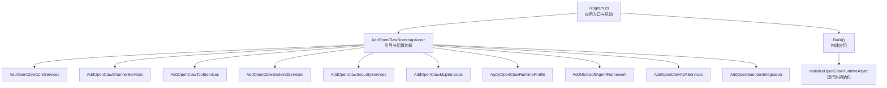
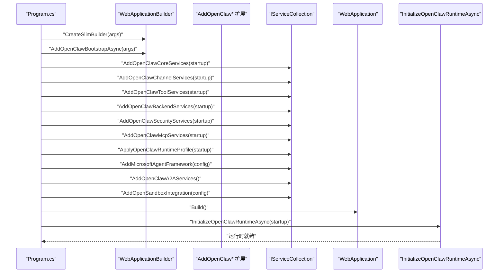
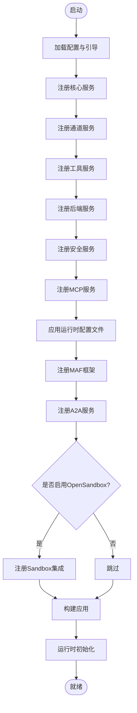
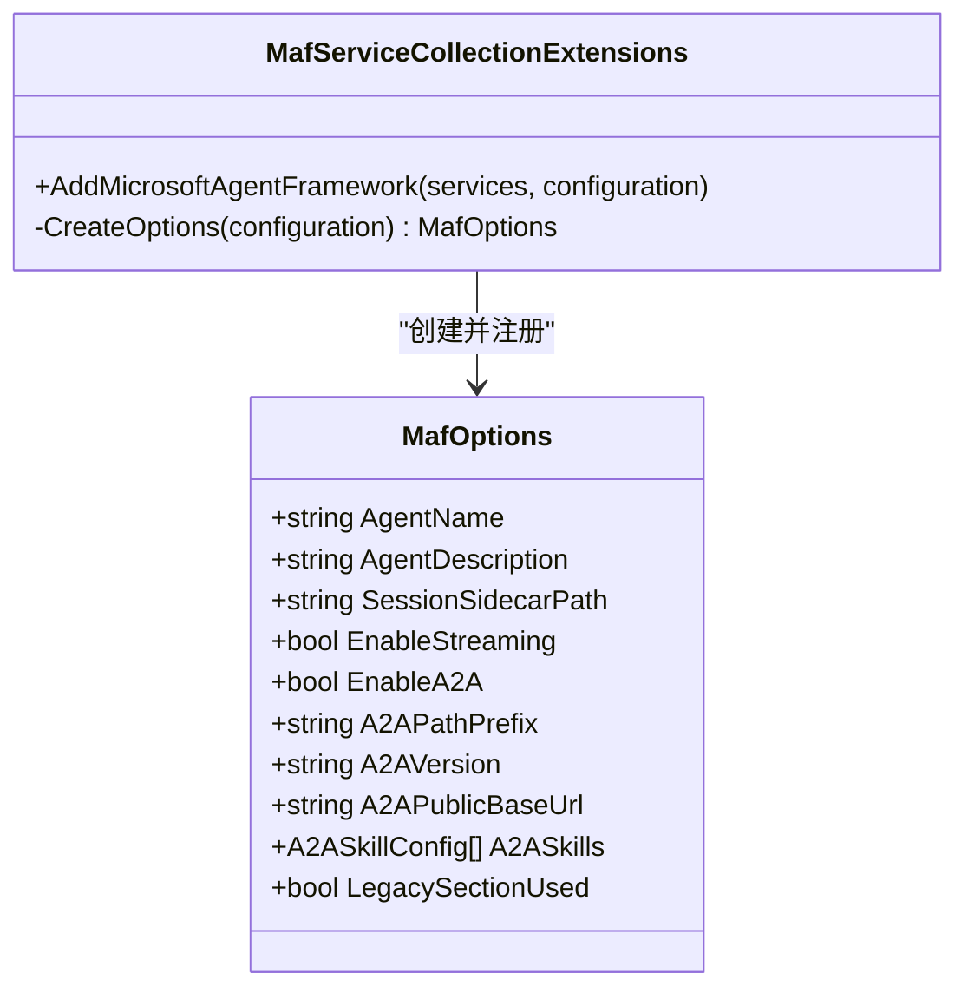
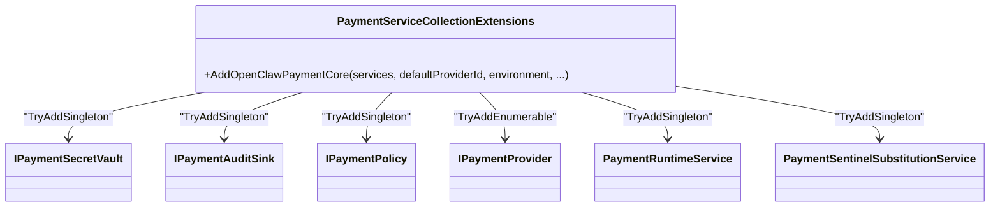
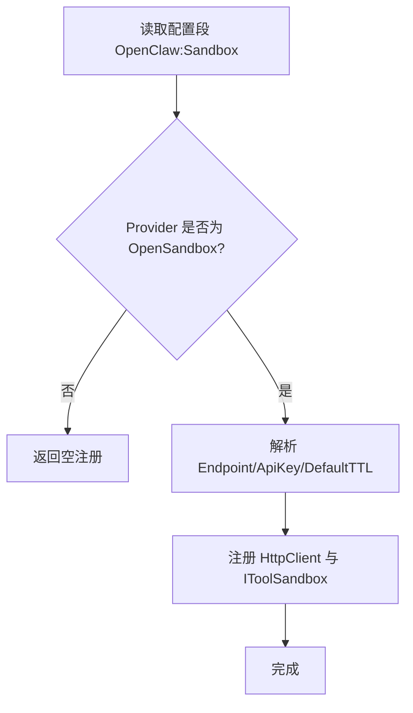
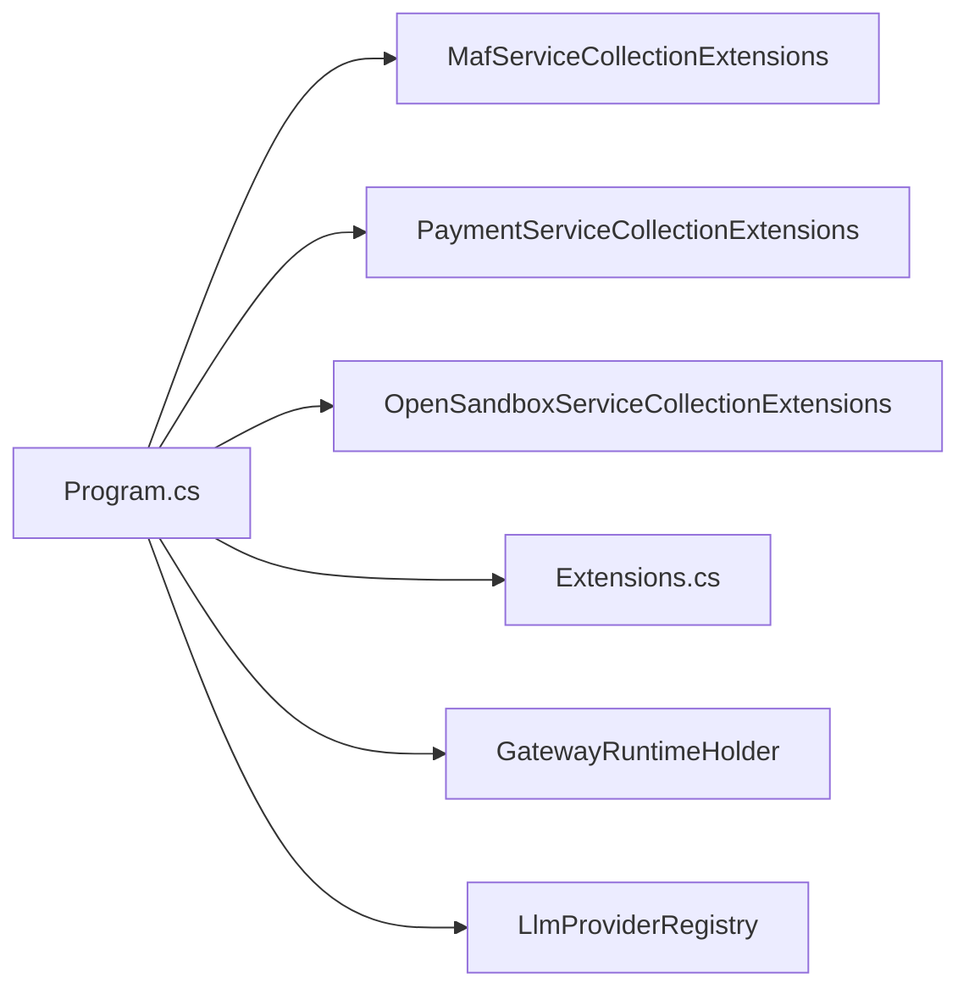

# 服务注册和依赖注入

<cite>
**本文引用的文件**
- [Program.cs](file://src/OpenClaw.Gateway/Program.cs)
- [MafServiceCollectionExtensions.cs](file://src/OpenClaw.Agent/MafServiceCollectionExtensions.cs)
- [MafOptions.cs](file://src/OpenClaw.Agent/MafOptions.cs)
- [Extensions.cs](file://Kingcrab.ServiceDefaults/Extensions.cs)
- [PaymentServiceCollectionExtensions.cs](file://src/OpenClaw.Payments.Core/PaymentServiceCollectionExtensions.cs)
- [OpenSandboxServiceCollectionExtensions.cs](file://src/OpenClawNet.Sandbox.OpenSandbox/OpenSandboxServiceCollectionExtensions.cs)
- [GatewayBootstrapExtensions.cs](file://src/OpenClaw.Gateway/Bootstrap/GatewayBootstrapExtensions.cs)
- [ConfigurationSourceDiagnosticsBuilder.cs](file://src/OpenClaw.Gateway/Bootstrap/ConfigurationSourceDiagnosticsBuilder.cs)
- [GatewayRuntimeHolder.cs](file://src/OpenClaw.Gateway/Mcp/GatewayRuntimeHolder.cs)
- [LlmProviderRegistry.cs](file://src/OpenClaw.Gateway/LlmProviderRegistry.cs)
- [openclaw-gateway-startup-layers.md](file://docs/openclaw-gateway-startup-layers.md)
</cite>

## 目录
1. [引言](#引言)
2. [项目结构](#项目结构)
3. [核心组件](#核心组件)
4. [架构总览](#架构总览)
5. [详细组件分析](#详细组件分析)
6. [依赖关系分析](#依赖关系分析)
7. [性能考量](#性能考量)
8. [故障排除指南](#故障排除指南)
9. [结论](#结论)
10. [附录](#附录)

## 引言
本文件系统性阐述本仓库中的服务注册与依赖注入体系，围绕服务容器配置、服务生命周期管理、依赖解析机制与注册模式展开。重点覆盖以下主题：
- 服务类型注册方法与作用域设置（单例、瞬态、跨请求）
- 条件注册与延迟初始化策略
- 配置优先级、覆盖机制、环境特定配置与动态配置更新
- 服务发现、循环依赖检测、服务验证与调试技巧
- 最佳实践、性能优化、内存管理与资源清理
- 具体注册示例路径、配置模板与故障排除清单

## 项目结构
本项目的依赖注入以 ASP.NET Core HostApplicationBuilder/IServiceCollection 为核心，结合各子模块的扩展方法实现分层注册。启动流程在网关入口 Program.cs 中完成，随后通过一系列 AddOpenClaw* 扩展方法注册核心服务、通道、工具、后端、安全、MCP 与 A2A 等服务，并在构建应用后执行运行时初始化。

图表来源
- [Program.cs:50-96](file://src/OpenClaw.Gateway/Program.cs#L50-L96)
- [openclaw-gateway-startup-layers.md:101-142](file://docs/openclaw-gateway-startup-layers.md#L101-L142)

章节来源
- [Program.cs:14-96](file://src/OpenClaw.Gateway/Program.cs#L14-L96)
- [openclaw-gateway-startup-layers.md:101-142](file://docs/openclaw-gateway-startup-layers.md#L101-L142)

## 核心组件
- 服务容器与引导
  - 在 Program.cs 中使用 WebApplicationBuilder 创建容器，调用 AddOpenClaw* 系列扩展注册各类服务，随后 Build 并 InitializeOpenClawRuntimeAsync 完成运行时装配。
- Microsoft Agent Framework 注册
  - MafServiceCollectionExtensions 将 MAF 相关选项与运行时工厂、会话存储等注册为单例，同时从 IConfiguration 解析 MafOptions。
- 支付核心注册
  - PaymentServiceCollectionExtensions 提供支付相关接口与默认实现的注册，采用 TryAdd 语义避免重复注册。
- Sandbox 集成注册
  - OpenSandboxServiceCollectionExtensions 基于配置条件注册 OpenSandbox 工具沙箱与 HTTP 客户端。
- 服务默认与可观测性
  - Extensions 提供 AddServiceDefaults、健康检查、服务发现、OpenTelemetry 等通用基础设施注册。

章节来源
- [Program.cs:50-96](file://src/OpenClaw.Gateway/Program.cs#L50-L96)
- [MafServiceCollectionExtensions.cs:9-20](file://src/OpenClaw.Agent/MafServiceCollectionExtensions.cs#L9-L20)
- [MafOptions.cs:5-35](file://src/OpenClaw.Agent/MafOptions.cs#L5-L35)
- [PaymentServiceCollectionExtensions.cs:10-41](file://src/OpenClaw.Payments.Core/PaymentServiceCollectionExtensions.cs#L10-L41)
- [OpenSandboxServiceCollectionExtensions.cs:12-48](file://src/OpenClawNet.Sandbox.OpenSandbox/OpenSandboxServiceCollectionExtensions.cs#L12-L48)
- [Extensions.cs:23-47](file://Kingcrab.ServiceDefaults/Extensions.cs#L23-L47)

## 架构总览
下图展示启动阶段的服务注册与运行时初始化的关键交互：

图表来源
- [Program.cs:50-96](file://src/OpenClaw.Gateway/Program.cs#L50-L96)

章节来源
- [Program.cs:50-96](file://src/OpenClaw.Gateway/Program.cs#L50-L96)

## 详细组件分析

### 组件一：服务容器与引导（Program.cs）
- 关键点
  - 使用 WebApplicationBuilder 创建容器，加载配置与引导扩展。
  - 通过 AddOpenClaw* 系列扩展按功能域注册服务。
  - Build 后执行 InitializeOpenClawRuntimeAsync 完成运行时装配。
  - 使用 ApplicationStarted 标记启动状态，便于异常恢复与诊断。
- 生命周期
  - 单例服务贯穿应用生命周期；中间件与管道在 Build 后启用。
- 条件注册与延迟初始化
  - 通过配置开关与编译符号控制可选功能（如 OpenSandbox）。
  - 运行时初始化阶段再装配复杂组合（通道、插件等）。

图表来源
- [Program.cs:50-96](file://src/OpenClaw.Gateway/Program.cs#L50-L96)

章节来源
- [Program.cs:14-124](file://src/OpenClaw.Gateway/Program.cs#L14-L124)

### 组件二：Microsoft Agent Framework 注册（MAF）
- 关键点
  - 从 IConfiguration 读取 MafOptions，兼容新旧配置段落。
  - 将 IOptions<MafOptions>、MafTelemetryAdapter、MafSessionStateStore、MafAgentFactory、IAgentRuntimeFactory 等注册为单例。
- 作用域与生命周期
  - 所有 MAF 相关组件均注册为单例，确保全局共享与一致行为。
- 配置优先级
  - 新段落优先；若未找到则回退到旧段落，并记录 LegacySectionUsed 标志。

图表来源
- [MafServiceCollectionExtensions.cs:9-20](file://src/OpenClaw.Agent/MafServiceCollectionExtensions.cs#L9-L20)
- [MafOptions.cs:5-35](file://src/OpenClaw.Agent/MafOptions.cs#L5-L35)

章节来源
- [MafServiceCollectionExtensions.cs:9-106](file://src/OpenClaw.Agent/MafServiceCollectionExtensions.cs#L9-L106)
- [MafOptions.cs:5-44](file://src/OpenClaw.Agent/MafOptions.cs#L5-L44)

### 组件三：支付核心注册（Payments）
- 关键点
  - 使用 TryAdd 语义注册 IPaymentSecretVault、IPaymentAuditSink、IPaymentPolicy、IPaymentProvider（Mock）、PaymentRuntimeService、PaymentSentinelSubstitutionService。
  - 通过构造函数注入多个 IPaymentProvider，形成可枚举的服务集合。
- 作用域与生命周期
  - 默认注册为单例；TryAdd 保证幂等性，避免重复注册。
- 条件注册
  - 该扩展不包含条件逻辑，建议在上层根据配置开关调用。

图表来源
- [PaymentServiceCollectionExtensions.cs:10-41](file://src/OpenClaw.Payments.Core/PaymentServiceCollectionExtensions.cs#L10-L41)

章节来源
- [PaymentServiceCollectionExtensions.cs:10-43](file://src/OpenClaw.Payments.Core/PaymentServiceCollectionExtensions.cs#L10-L43)

### 组件四：Sandbox 集成注册（OpenSandbox）
- 关键点
  - 仅当配置段“OpenClaw:Sandbox:Provider”等于“OpenSandbox”时才注册。
  - 解析密钥引用（env:/raw:），支持超时与默认 TTL。
  - 注册 HttpClient 与 IToolSandbox 实现。
- 作用域与生命周期
  - OpenSandboxOptions 单例；HTTP 客户端通过工厂创建；IToolSandbox 单例。
- 条件注册
  - 基于配置值进行条件注册，避免不必要的依赖。

图表来源
- [OpenSandboxServiceCollectionExtensions.cs:12-48](file://src/OpenClawNet.Sandbox.OpenSandbox/OpenSandboxServiceCollectionExtensions.cs#L12-L48)

章节来源
- [OpenSandboxServiceCollectionExtensions.cs:12-61](file://src/OpenClawNet.Sandbox.OpenSandbox/OpenSandboxServiceCollectionExtensions.cs#L12-L61)

### 组件五：服务默认与可观测性（ServiceDefaults）
- 关键点
  - AddServiceDefaults：统一添加健康检查、服务发现、标准弹性策略与 OTel。
  - ConfigureOpenTelemetry：配置日志、指标与追踪导出器（OTLP 或 Langfuse）。
  - MapDefaultEndpoints：开发环境下映射 /health 与 /alive。
- 作用域与生命周期
  - 健康检查与服务发现注册为单例；HTTP 客户端默认策略在容器内复用。

章节来源
- [Extensions.cs:23-147](file://Kingcrab.ServiceDefaults/Extensions.cs#L23-L147)

### 组件六：运行时持有者与运行时初始化（GatewayRuntimeHolder）
- 关键点
  - GatewayRuntimeHolder 作为单例持有 GatewayAppRuntime，用于在 DI 构建后桥接运行时对象。
  - Program.cs 在应用启动前设置 Runtime，确保请求处理前可用。
- 生命周期
  - 单例持有，线程安全（volatile 字段）。

章节来源
- [GatewayRuntimeHolder.cs:10-20](file://src/OpenClaw.Gateway/Mcp/GatewayRuntimeHolder.cs#L10-L20)
- [Program.cs:83-85](file://src/OpenClaw.Gateway/Program.cs#L83-L85)

### 组件七：动态提供者注册与默认标记（LlmProviderRegistry）
- 关键点
  - 支持注册动态提供者（带所有者标识），并可将某提供者标记为默认。
  - 提供按所有者注销的能力，避免悬挂注册。
  - 快照接口用于读取非默认快照列表。
- 生命周期
  - 注册表内部维护字典，动态注册与变更即时生效。

章节来源
- [LlmProviderRegistry.cs:35-90](file://src/OpenClaw.Gateway/LlmProviderRegistry.cs#L35-L90)

## 依赖关系分析
- 组件耦合
  - Program.cs 作为入口，依赖各扩展方法；扩展方法之间低耦合，职责清晰。
  - MAF 与支付、Sandbox 等模块相互独立，通过配置或运行时组合连接。
- 外部依赖
  - 通过 ServiceDefaults 统一接入服务发现、健康检查与 OTel。
- 循环依赖
  - 未见直接循环依赖迹象；运行时初始化通过持有者模式解耦 DI 与运行时对象。

图表来源
- [Program.cs:50-96](file://src/OpenClaw.Gateway/Program.cs#L50-L96)
- [MafServiceCollectionExtensions.cs:9-20](file://src/OpenClaw.Agent/MafServiceCollectionExtensions.cs#L9-L20)
- [PaymentServiceCollectionExtensions.cs:10-41](file://src/OpenClaw.Payments.Core/PaymentServiceCollectionExtensions.cs#L10-L41)
- [OpenSandboxServiceCollectionExtensions.cs:12-48](file://src/OpenClawNet.Sandbox.OpenSandbox/OpenSandboxServiceCollectionExtensions.cs#L12-L48)
- [Extensions.cs:23-47](file://Kingcrab.ServiceDefaults/Extensions.cs#L23-L47)
- [GatewayRuntimeHolder.cs:10-20](file://src/OpenClaw.Gateway/Mcp/GatewayRuntimeHolder.cs#L10-L20)
- [LlmProviderRegistry.cs:35-90](file://src/OpenClaw.Gateway/LlmProviderRegistry.cs#L35-L90)

## 性能考量
- 服务注册性能
  - 优先使用单例注册高频服务（如 MAF、支付策略、Sandbox 选项），减少实例化开销。
  - 对可选功能采用条件注册，避免无谓的依赖解析。
- 配置与热更新
  - 配置文件 reloadOnChange: true 支持动态刷新；建议对关键配置采用节流与缓存策略。
- 内存与资源
  - 运行时持有者使用 volatile 字段，避免竞态；注意释放 IToolSandbox 等外部资源。
- 观测性
  - 通过 ServiceDefaults 启用 OTel，结合健康检查与服务发现，提升可观测性与弹性。

## 故障排除指南
- 启动失败与自动恢复
  - Program.cs 在未启动成功时捕获异常并尝试交互式恢复；若无法处理则输出诊断信息。
- 配置来源诊断
  - 通过 ConfigurationSourceDiagnosticsBuilder 输出配置来源与密钥引用描述，辅助定位问题。
- 环境变量与命令行覆盖
  - GatewayBootstrapExtensions 支持 --config 参数与环境变量覆盖，确保覆盖顺序正确。
- 常见问题
  - MAF 配置段缺失：检查新旧段落是否存在；确认 LegacySectionUsed 标志。
  - Sandbox 未注册：确认配置段 Provider 值与大小写匹配。
  - 运行时未初始化：确保在请求处理前设置 GatewayRuntimeHolder.Runtime。

章节来源
- [Program.cs:99-122](file://src/OpenClaw.Gateway/Program.cs#L99-L122)
- [ConfigurationSourceDiagnosticsBuilder.cs:121-161](file://src/OpenClaw.Gateway/Bootstrap/ConfigurationSourceDiagnosticsBuilder.cs#L121-L161)
- [GatewayBootstrapExtensions.cs:174-212](file://src/OpenClaw.Gateway/Bootstrap/GatewayBootstrapExtensions.cs#L174-L212)

## 结论
本仓库的服务注册与依赖注入体系以 ASP.NET Core 容器为核心，通过分层扩展方法实现高内聚、低耦合的服务装配。配合条件注册、动态配置与运行时初始化，既满足生产环境的稳定性要求，又具备良好的可维护性与可观测性。建议在实际部署中遵循本文最佳实践，结合监控与诊断工具，持续优化服务性能与可靠性。

## 附录

### 服务注册最佳实践
- 优先使用单例注册全局共享服务，避免频繁实例化。
- 对可选功能采用条件注册，减少不必要的依赖。
- 使用 TryAdd 语义注册默认实现，允许上层覆盖。
- 将配置解析与服务注册分离，便于测试与替换。

### 配置模板与优先级
- 配置文件优先级（从低到高）
  - 默认值
  - 环境变量（OPENCLAW_*）
  - 命令行参数 --config 指定的 JSON 文件
  - 运行时内存覆盖
- 环境特定配置
  - 通过环境变量与用户机密（env:/raw:）引用敏感值。
- 动态配置更新
  - 使用 reloadOnChange: true 的 JSON 文件实现热更新；对关键配置增加节流与校验。

章节来源
- [GatewayBootstrapExtensions.cs:174-212](file://src/OpenClaw.Gateway/Bootstrap/GatewayBootstrapExtensions.cs#L174-L212)
- [OpenSandboxServiceCollectionExtensions.cs:50-60](file://src/OpenClawNet.Sandbox.OpenSandbox/OpenSandboxServiceCollectionExtensions.cs#L50-L60)