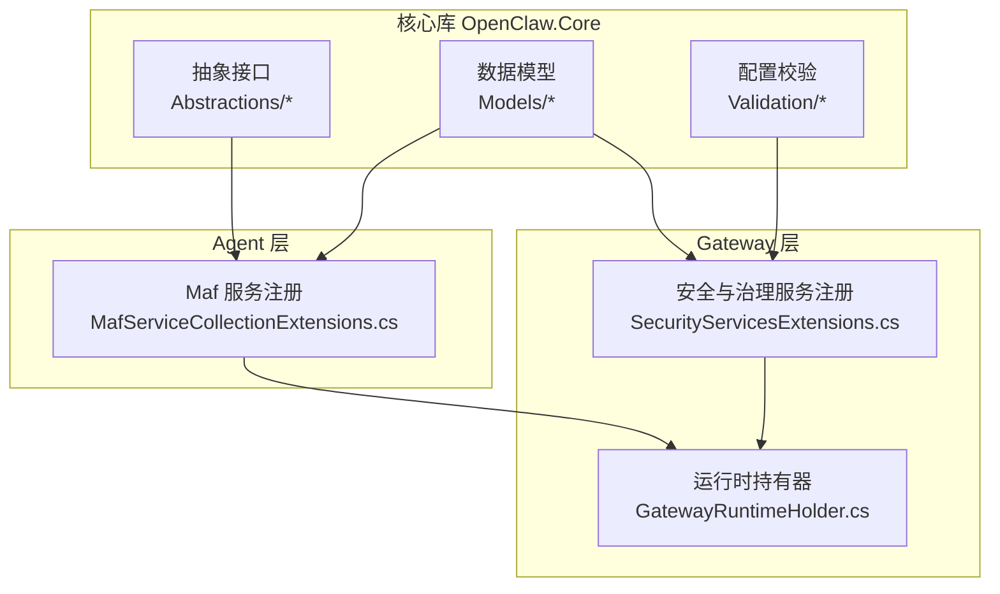
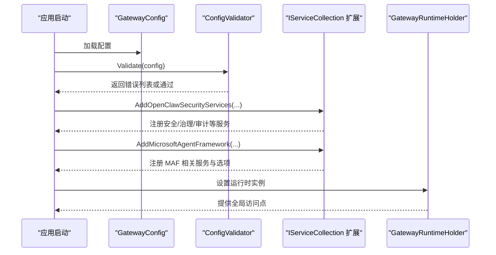
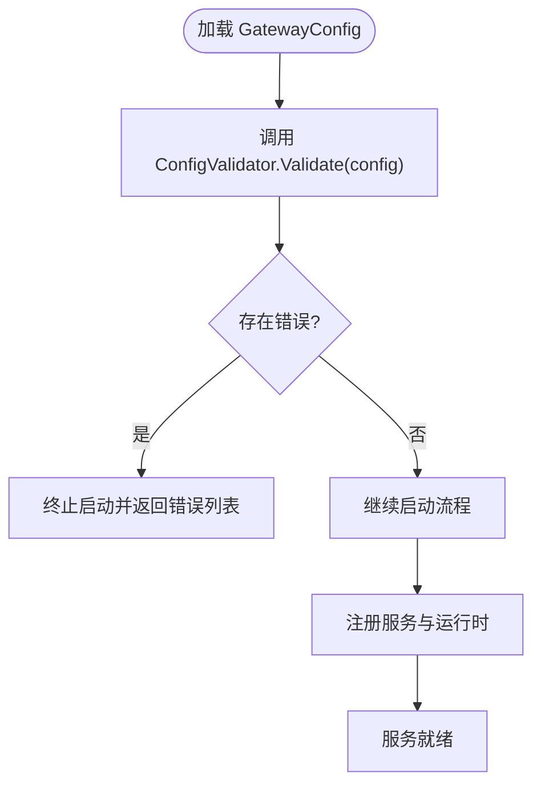
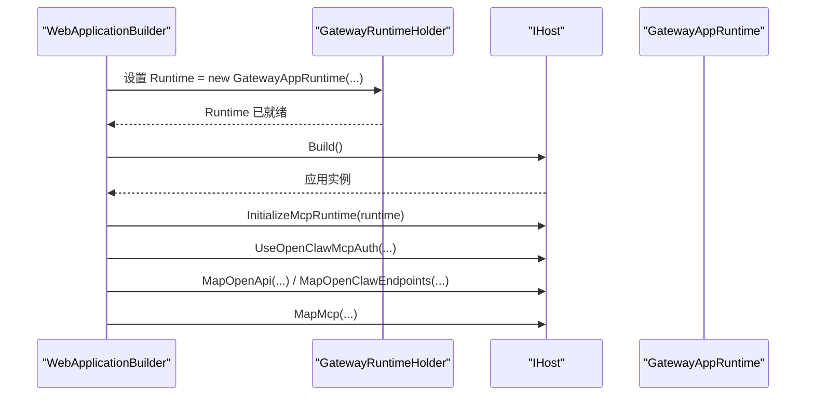
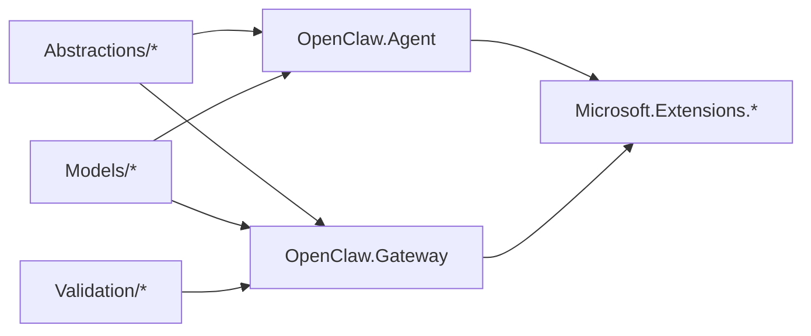

# 核心抽象和基础服务

<cite>
**本文引用的文件**
- [OpenClaw.Core.csproj](file://src/OpenClaw.Core/OpenClaw.Core.csproj)
- [CodingBackendAbstractions.cs](file://src/OpenClaw.Core/Abstractions/CodingBackendAbstractions.cs)
- [IAgentWorkflowRunner.cs](file://src/OpenClaw.Core/Abstractions/IAgentWorkflowRunner.cs)
- [IExecutionBackend.cs](file://src/OpenClaw.Core/Abstractions/IExecutionBackend.cs)
- [ITool.cs](file://src/OpenClaw.Core/Abstractions/ITool.cs)
- [IMemoryStore.cs](file://src/OpenClaw.Core/Abstractions/IMemoryStore.cs)
- [ISessionMetadataStore.cs](file://src/OpenClaw.Core/Abstractions/ISessionMetadataStore.cs)
- [IEvidenceBundleStore.cs](file://src/OpenClaw.Core/Abstractions/IEvidenceBundleStore.cs)
- [IGovernanceLedgerStore.cs](file://src/OpenClaw.Core/Abstractions/IGovernanceLedgerStore.cs)
- [ISessionSearchStore.cs](file://src/OpenClaw.Core/Abstractions/ISessionSearchStore.cs)
- [MafServiceCollectionExtensions.cs](file://src/OpenClaw.Agent/MafServiceCollectionExtensions.cs)
- [SecurityServicesExtensions.cs](file://src/OpenClaw.Gateway/Composition/SecurityServicesExtensions.cs)
- [GatewayConfig.cs](file://src/OpenClaw.Core/Models/GatewayConfig.cs)
- [ModelProfiles.cs](file://src/OpenClaw.Core/Models/ModelProfiles.cs)
- [ConfigValidator.cs](file://src/OpenClaw.Core/Validation/ConfigValidator.cs)
- [GatewayRuntimeHolder.cs](file://src/OpenClaw.Gateway/Mcp/GatewayRuntimeHolder.cs)
</cite>

## 目录
1. [简介](#简介)
2. [项目结构](#项目结构)
3. [核心组件](#核心组件)
4. [架构总览](#架构总览)
5. [详细组件分析](#详细组件分析)
6. [依赖关系分析](#依赖关系分析)
7. [性能考量](#性能考量)
8. [故障排查指南](#故障排查指南)
9. [结论](#结论)
10. [附录](#附录)

## 简介
本文件面向“核心抽象与基础服务”，系统化梳理并文档化以下内容：
- 核心接口设计：抽象接口定义、职责边界、扩展点与实现约束
- 服务注册机制：基于依赖注入的服务注册扩展方法、生命周期与作用域
- 配置管理：配置模型、校验规则、默认值与兼容性策略
- 通用工具：运行时持有器、选项绑定、序列化上下文等基础设施
- 数据模型：会话、证据、治理、内存等关键实体的数据结构与约束
- 使用示例与最佳实践：如何在应用启动中正确注册与使用这些抽象
- 架构设计原则：可插拔、可组合、安全优先、可观测性与可维护性

## 项目结构
OpenClaw.Core 作为核心库，提供抽象接口、数据模型、验证器与通用设施；Agent 与 Gateway 分别通过扩展方法将抽象对接到具体实现，并以配置驱动行为。

**图表来源**
- [OpenClaw.Core.csproj:1-24](file://src/OpenClaw.Core/OpenClaw.Core.csproj#L1-L24)
- [MafServiceCollectionExtensions.cs:1-107](file://src/OpenClaw.Agent/MafServiceCollectionExtensions.cs#L1-L107)
- [SecurityServicesExtensions.cs:1-86](file://src/OpenClaw.Gateway/Composition/SecurityServicesExtensions.cs#L1-L86)
- [GatewayRuntimeHolder.cs:1-20](file://src/OpenClaw.Gateway/Mcp/GatewayRuntimeHolder.cs#L1-L20)

**章节来源**
- [OpenClaw.Core.csproj:1-24](file://src/OpenClaw.Core/OpenClaw.Core.csproj#L1-L24)

## 核心组件
本节聚焦核心抽象接口与关键数据模型，阐明其职责、约束与扩展点。

- 编码后端抽象
  - IConnectedAccountStore、IBackendSessionStore、IBackendCredentialResolver、IBackendSessionRuntime、ICodingAgentBackend、ICodingAgentBackendRegistry
  - 职责：账户与会话持久化、凭据解析、会话事件记录、后端生命周期管理
  - 扩展点：支持多后端注册与按后端ID选择

- 工作流执行抽象
  - IAgentWorkflowRunner：工作流后端标识、摘要、运行、快照、响应与事件流式输出
  - 适用场景：可插拔的工作流后端（如 MAF 持久化 HTTP 后端）

- 执行后端抽象
  - IExecutionBackend：统一的执行入口，屏蔽底层执行细节

- 工具抽象
  - ITool：最小化 AOT 友好接口，包含名称、描述、参数 Schema 与异步执行

- 内存与会话抽象
  - IMemoryStore：会话与笔记的持久化、分支管理
  - ISessionMetadataStore：元数据快照的增删改查
  - IEvidenceBundleStore、IGovernanceLedgerStore、ISessionSearchStore：证据、治理账本与会话检索

- 关键数据模型
  - GatewayConfig：网关配置总线，涵盖运行、LLM、本地推理、内存、安全、通道、插件、技能、工作流等子配置
  - ModelProfiles：模型配置、能力、选择需求与评估报告等

**章节来源**
- [CodingBackendAbstractions.cs:1-50](file://src/OpenClaw.Core/Abstractions/CodingBackendAbstractions.cs#L1-L50)
- [IAgentWorkflowRunner.cs:1-29](file://src/OpenClaw.Core/Abstractions/IAgentWorkflowRunner.cs#L1-L29)
- [IExecutionBackend.cs:1-13](file://src/OpenClaw.Core/Abstractions/IExecutionBackend.cs#L1-L13)
- [ITool.cs:1-17](file://src/OpenClaw.Core/Abstractions/ITool.cs#L1-L17)
- [IMemoryStore.cs:1-24](file://src/OpenClaw.Core/Abstractions/IMemoryStore.cs#L1-L24)
- [ISessionMetadataStore.cs:1-11](file://src/OpenClaw.Core/Abstractions/ISessionMetadataStore.cs#L1-L11)
- [IEvidenceBundleStore.cs:1-12](file://src/OpenClaw.Core/Abstractions/IEvidenceBundleStore.cs#L1-L12)
- [IGovernanceLedgerStore.cs:1-12](file://src/OpenClaw.Core/Abstractions/IGovernanceLedgerStore.cs#L1-L12)
- [ISessionSearchStore.cs:1-9](file://src/OpenClaw.Core/Abstractions/ISessionSearchStore.cs#L1-L9)
- [GatewayConfig.cs:1-800](file://src/OpenClaw.Core/Models/GatewayConfig.cs#L1-L800)
- [ModelProfiles.cs:1-169](file://src/OpenClaw.Core/Models/ModelProfiles.cs#L1-L169)

## 架构总览
下图展示从配置到服务注册再到运行时的总体流程，体现“配置驱动 + 抽象解耦 + 依赖注入”的设计原则。

**图表来源**
- [ConfigValidator.cs:1-800](file://src/OpenClaw.Core/Validation/ConfigValidator.cs#L1-L800)
- [SecurityServicesExtensions.cs:1-86](file://src/OpenClaw.Gateway/Composition/SecurityServicesExtensions.cs#L1-L86)
- [MafServiceCollectionExtensions.cs:1-107](file://src/OpenClaw.Agent/MafServiceCollectionExtensions.cs#L1-L107)
- [GatewayRuntimeHolder.cs:1-20](file://src/OpenClaw.Gateway/Mcp/GatewayRuntimeHolder.cs#L1-L20)

## 详细组件分析

### 服务注册机制（依赖注入）
- 安全与治理服务注册
  - 在 Gateway 的 Composition 层通过扩展方法集中注册：审批、配对、浏览器会话认证、运营审计、工具授权、插件健康度、合同存储与治理服务等
  - 作用域：单例，依赖配置路径与指标收集器
- MAF 服务注册
  - 将 IConfiguration 绑定为 MafOptions 并注册 MafTelemetryAdapter、MafSessionStateStore、MafAgentFactory、IAgentRuntimeFactory 等

```mermaid
classDiagram
class SecurityServicesExtensions {
+AddOpenClawSecurityServices(services, startup)
}
class MafServiceCollectionExtensions {
+AddMicrosoftAgentFramework(services, configuration)
-CreateOptions(configuration)
}
class ToolApprovalService
class PairingManager
class BrowserSessionAuthService
class OperatorAccountService
class OrganizationPolicyService
class AdminSettingsService
class PluginAdminSettingsService
class ApprovalAuditStore
class RuntimeEventStore
class ExternalCliAuditStore
class OperatorAuditStore
class ToolApprovalGrantStore
class WebhookDeliveryStore
class PluginHealthService
class ContractStore
class ContractGovernanceService
class MafTelemetryAdapter
class MafSessionStateStore
class MafAgentFactory
class IAgentRuntimeFactory
SecurityServicesExtensions --> ToolApprovalService
SecurityServicesExtensions --> PairingManager
SecurityServicesExtensions --> BrowserSessionAuthService
SecurityServicesExtensions --> OperatorAccountService
SecurityServicesExtensions --> OrganizationPolicyService
SecurityServicesExtensions --> AdminSettingsService
SecurityServicesExtensions --> PluginAdminSettingsService
SecurityServicesExtensions --> ApprovalAuditStore
SecurityServicesExtensions --> RuntimeEventStore
SecurityServicesExtensions --> ExternalCliAuditStore
SecurityServicesExtensions --> OperatorAuditStore
SecurityServicesExtensions --> ToolApprovalGrantStore
SecurityServicesExtensions --> WebhookDeliveryStore
SecurityServicesExtensions --> PluginHealthService
SecurityServicesExtensions --> ContractStore
SecurityServicesExtensions --> ContractGovernanceService
MafServiceCollectionExtensions --> MafTelemetryAdapter
MafServiceCollectionExtensions --> MafSessionStateStore
MafServiceCollectionExtensions --> MafAgentFactory
MafServiceCollectionExtensions --> IAgentRuntimeFactory
```

**图表来源**
- [SecurityServicesExtensions.cs:1-86](file://src/OpenClaw.Gateway/Composition/SecurityServicesExtensions.cs#L1-L86)
- [MafServiceCollectionExtensions.cs:1-107](file://src/OpenClaw.Agent/MafServiceCollectionExtensions.cs#L1-L107)

**章节来源**
- [SecurityServicesExtensions.cs:1-86](file://src/OpenClaw.Gateway/Composition/SecurityServicesExtensions.cs#L1-L86)
- [MafServiceCollectionExtensions.cs:1-107](file://src/OpenClaw.Agent/MafServiceCollectionExtensions.cs#L1-L107)

### 配置管理与校验
- 配置模型
  - GatewayConfig：集中承载所有运行期配置项，包含运行模式、LLM、本地推理、内存、安全、通道、插件、技能、工作流、脉搏、定时任务、自动化、学习、Webhook、路由、部署、Tailscale、Gmail Pub/Sub、MDNS、诊断等
  - ModelProfiles：模型配置、能力、选择需求与评估报告
- 配置校验
  - ConfigValidator：对端口、LLM 参数、内存、会话、WebSocket、工具、沙箱、委托、工作流、中间件、运行时模式/编排器、插件桥、通道、Cron、Webhook 等进行严格校验，失败即拒绝启动
  - 默认成本费率与明细解析：TokenCostRateResolver 支持按 provider:model 或 provider 解析

**图表来源**
- [ConfigValidator.cs:1-800](file://src/OpenClaw.Core/Validation/ConfigValidator.cs#L1-L800)
- [GatewayConfig.cs:1-800](file://src/OpenClaw.Core/Models/GatewayConfig.cs#L1-L800)
- [ModelProfiles.cs:1-169](file://src/OpenClaw.Core/Models/ModelProfiles.cs#L1-L169)

**章节来源**
- [ConfigValidator.cs:1-800](file://src/OpenClaw.Core/Validation/ConfigValidator.cs#L1-L800)
- [GatewayConfig.cs:1-800](file://src/OpenClaw.Core/Models/GatewayConfig.cs#L1-L800)
- [ModelProfiles.cs:1-169](file://src/OpenClaw.Core/Models/ModelProfiles.cs#L1-L169)

### 运行时生命周期与依赖注入
- 运行时持有器
  - GatewayRuntimeHolder：在容器构建完成后设置 GatewayAppRuntime 实例，确保请求处理前已初始化
- 典型启动流程
  - 构建服务集合 -> 注册安全/治理服务 -> 注册 MAF 服务 -> 构建应用 -> 初始化运行时 -> 映射端点与中间件

**图表来源**
- [GatewayRuntimeHolder.cs:1-20](file://src/OpenClaw.Gateway/Mcp/GatewayRuntimeHolder.cs#L1-L20)

**章节来源**
- [GatewayRuntimeHolder.cs:1-20](file://src/OpenClaw.Gateway/Mcp/GatewayRuntimeHolder.cs#L1-L20)

### 数据模型与序列化
- 关键实体
  - 会话、分支、笔记、证据包、治理条目、会话搜索结果等
- 序列化上下文
  - 通过 [JsonSerializable] 标注用于 System.Text.Json Source Generation，提升 AOT 友好性与性能
- 建议
  - 对新增模型补充 JsonSerializable 标注，保持一致的序列化策略

**章节来源**
- [IMemoryStore.cs:1-24](file://src/OpenClaw.Core/Abstractions/IMemoryStore.cs#L1-L24)
- [ISessionMetadataStore.cs:1-11](file://src/OpenClaw.Core/Abstractions/ISessionMetadataStore.cs#L1-L11)
- [IEvidenceBundleStore.cs:1-12](file://src/OpenClaw.Core/Abstractions/IEvidenceBundleStore.cs#L1-L12)
- [IGovernanceLedgerStore.cs:1-12](file://src/OpenClaw.Core/Abstractions/IGovernanceLedgerStore.cs#L1-L12)
- [ISessionSearchStore.cs:1-9](file://src/OpenClaw.Core/Abstractions/ISessionSearchStore.cs#L1-L9)
- [GatewayConfig.cs:300-350](file://src/OpenClaw.Core/Models/GatewayConfig.cs#L300-L350)

## 依赖关系分析
- 组件内聚与耦合
  - 抽象层（Abstractions）与实现层（Agent/Gateway）通过接口解耦，降低耦合度
  - 配置校验器独立于实现，保证启动前的强一致性
- 外部依赖
  - 核心库引用 AI 抽象、缓存、主机、日志、SQLite、Cron 等基础库
- 循环依赖
  - 当前结构未见循环依赖迹象，扩展新服务时应避免反向依赖

**图表来源**
- [OpenClaw.Core.csproj:10-23](file://src/OpenClaw.Core/OpenClaw.Core.csproj#L10-L23)

**章节来源**
- [OpenClaw.Core.csproj:1-24](file://src/OpenClaw.Core/OpenClaw.Core.csproj#L1-L24)

## 性能考量
- AOT 友好性
  - 抽象接口最小化，减少反射依赖；序列化采用 Source Generation
- 启动与校验
  - 启动阶段集中校验配置，避免运行期抖动
- 服务作用域
  - 长生命周期服务（单例）减少对象分配；短生命周期服务按需创建
- 缓存与压缩
  - 内存与沙箱配置支持压缩与保留策略，平衡存储与查询性能

## 故障排查指南
- 启动失败
  - 检查配置校验错误列表，逐项修正端口、LLM 参数、内存路径、工具根路径、沙箱模板等
- 服务未注册
  - 确认是否调用了 AddOpenClawSecurityServices 与 AddMicrosoftAgentFramework
- 运行时未初始化
  - 确保在应用启动后设置了 GatewayRuntimeHolder.Runtime

**章节来源**
- [ConfigValidator.cs:1-800](file://src/OpenClaw.Core/Validation/ConfigValidator.cs#L1-L800)
- [SecurityServicesExtensions.cs:1-86](file://src/OpenClaw.Gateway/Composition/SecurityServicesExtensions.cs#L1-L86)
- [MafServiceCollectionExtensions.cs:1-107](file://src/OpenClaw.Agent/MafServiceCollectionExtensions.cs#L1-L107)
- [GatewayRuntimeHolder.cs:1-20](file://src/OpenClaw.Gateway/Mcp/GatewayRuntimeHolder.cs#L1-L20)

## 结论
通过清晰的抽象分层、严格的配置校验与完善的依赖注入机制，OpenClaw.Core 提供了高可扩展、安全可控且 AOT 友好的基础能力。遵循本文档的接口设计原则、服务注册流程与最佳实践，可在不破坏整体架构的前提下快速扩展新的后端、工具与治理能力。

## 附录

### 接口使用示例（步骤指引）
- 注册安全与治理服务
  - 在服务集合上调用 AddOpenClawSecurityServices(startup)，完成审批、配对、审计、合同治理等服务注册
- 注册 MAF 相关服务
  - AddMicrosoftAgentFramework(services, configuration)，将 IConfiguration 绑定为 MafOptions 并注册运行时工厂与适配器
- 初始化运行时
  - 在应用启动后设置 GatewayRuntimeHolder.Runtime，确保后续请求可用

**章节来源**
- [SecurityServicesExtensions.cs:1-86](file://src/OpenClaw.Gateway/Composition/SecurityServicesExtensions.cs#L1-L86)
- [MafServiceCollectionExtensions.cs:1-107](file://src/OpenClaw.Agent/MafServiceCollectionExtensions.cs#L1-L107)
- [GatewayRuntimeHolder.cs:1-20](file://src/OpenClaw.Gateway/Mcp/GatewayRuntimeHolder.cs#L1-L20)

### 扩展开发指南
- 新增抽象接口
  - 保持接口最小化，仅暴露必要成员；避免复杂继承层次
- 实现扩展点
  - 通过扩展方法注册到 IServiceCollection，遵循单例与按需创建的原则
- 配置绑定
  - 在扩展方法中读取 IConfiguration 并映射到选项类，确保默认值与兼容性
- 数据模型
  - 新增模型时补充 [JsonSerializable] 标注，确保 Source Generation 生效

### 最佳实践
- 启动即校验：在应用启动阶段完成配置校验，失败即终止
- 作用域明确：长生命周期服务单例，短生命周期服务按需创建
- AOT 友好：减少反射与动态特性，使用 Source Generation 与最小接口
- 可观测性：为关键服务注入指标与日志，便于问题定位与性能分析