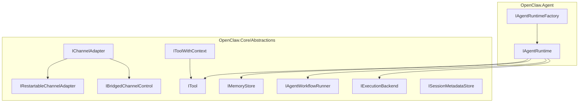
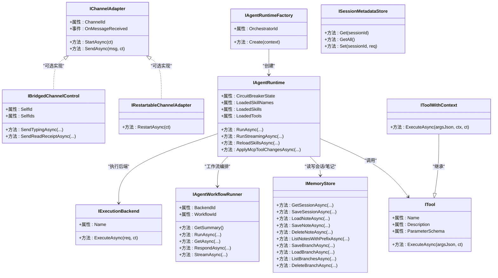
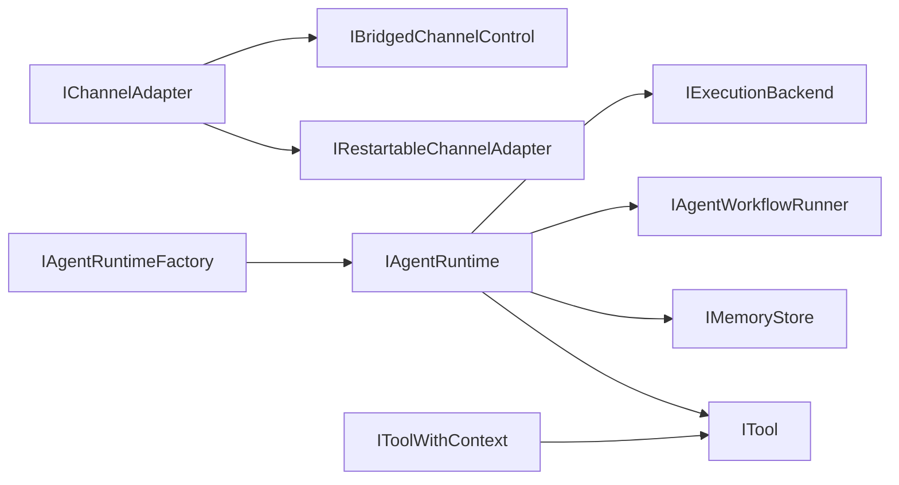

# 核心接口设计

<cite>
**本文档引用的文件**
- [IAgentRuntime.cs](file://src/OpenClaw.Agent/IAgentRuntime.cs)
- [IAgentRuntimeFactory.cs](file://src/OpenClaw.Agent/IAgentRuntimeFactory.cs)
- [IChannelAdapter.cs](file://src/OpenClaw.Core/Abstractions/IChannelAdapter.cs)
- [ITool.cs](file://src/OpenClaw.Core/Abstractions/ITool.cs)
- [IMemoryStore.cs](file://src/OpenClaw.Core/Abstractions/IMemoryStore.cs)
- [IAgentWorkflowRunner.cs](file://src/OpenClaw.Core/Abstractions/IAgentWorkflowRunner.cs)
- [IRestartableChannelAdapter.cs](file://src/OpenClaw.Core/Abstractions/IRestartableChannelAdapter.cs)
- [ISessionMetadataStore.cs](file://src/OpenClaw.Core/Abstractions/ISessionMetadataStore.cs)
- [IExecutionBackend.cs](file://src/OpenClaw.Core/Abstractions/IExecutionBackend.cs)
- [IBridgedChannelControl.cs](file://src/OpenClaw.Core/Abstractions/IBridgedChannelControl.cs)
- [IToolWithContext.cs](file://src/OpenClaw.Core/Abstractions/IToolWithContext.cs)
</cite>

## 目录
1. [引言](#引言)
2. [项目结构](#项目结构)
3. [核心组件](#核心组件)
4. [架构总览](#架构总览)
5. [详细组件分析](#详细组件分析)
6. [依赖分析](#依赖分析)
7. [性能考虑](#性能考虑)
8. [故障排除指南](#故障排除指南)
9. [结论](#结论)
10. [附录](#附录)

## 引言
本文件聚焦于Kingcrab项目的核心接口设计，系统阐述抽象接口的设计理念、职责边界、实现要求与扩展机制。重点覆盖以下关键接口：IAgentRuntime、IAgentRuntimeFactory、IChannelAdapter、ITool、IMemoryStore，并补充相关接口如 IAgentWorkflowRunner、IRestartableChannelAdapter、ISessionMetadataStore、IExecutionBackend、IBridgedChannelControl、IToolWithContext 的定义与交互关系。文档同时给出接口间依赖关系、继承层次与组合模式，以及最佳实践、性能考量、错误处理策略、实现示例路径、扩展开发指南与测试策略。

## 项目结构
核心接口主要分布在两个工程中：
- OpenClaw.Core/Abstractions：定义跨模块通用抽象（通道适配器、工具、内存存储、工作流等）
- OpenClaw.Agent：定义代理运行时与工厂接口，负责会话执行、工具注册、MCP工具表面热更新等

图表来源
- [IChannelAdapter.cs:1-22](file://src/OpenClaw.Core/Abstractions/IChannelAdapter.cs#L1-L22)
- [IRestartableChannelAdapter.cs:1-10](file://src/OpenClaw.Core/Abstractions/IRestartableChannelAdapter.cs#L1-L10)
- [IBridgedChannelControl.cs:1-12](file://src/OpenClaw.Core/Abstractions/IBridgedChannelControl.cs#L1-L12)
- [ITool.cs:1-17](file://src/OpenClaw.Core/Abstractions/ITool.cs#L1-L17)
- [IToolWithContext.cs:1-16](file://src/OpenClaw.Core/Abstractions/IToolWithContext.cs#L1-L16)
- [IMemoryStore.cs:1-24](file://src/OpenClaw.Core/Abstractions/IMemoryStore.cs#L1-L24)
- [IAgentWorkflowRunner.cs:1-29](file://src/OpenClaw.Core/Abstractions/IAgentWorkflowRunner.cs#L1-L29)
- [IExecutionBackend.cs:1-13](file://src/OpenClaw.Core/Abstractions/IExecutionBackend.cs#L1-L13)
- [ISessionMetadataStore.cs:1-11](file://src/OpenClaw.Core/Abstractions/ISessionMetadataStore.cs#L1-L11)
- [IAgentRuntime.cs:1-51](file://src/OpenClaw.Agent/IAgentRuntime.cs#L1-L51)
- [IAgentRuntimeFactory.cs:1-66](file://src/OpenClaw.Agent/IAgentRuntimeFactory.cs#L1-L66)

章节来源
- [IAgentRuntime.cs:1-51](file://src/OpenClaw.Agent/IAgentRuntime.cs#L1-L51)
- [IAgentRuntimeFactory.cs:1-66](file://src/OpenClaw.Agent/IAgentRuntimeFactory.cs#L1-L66)
- [IChannelAdapter.cs:1-22](file://src/OpenClaw.Core/Abstractions/IChannelAdapter.cs#L1-L22)
- [ITool.cs:1-17](file://src/OpenClaw.Core/Abstractions/ITool.cs#L1-L17)
- [IMemoryStore.cs:1-24](file://src/OpenClaw.Core/Abstractions/IMemoryStore.cs#L1-L24)
- [IAgentWorkflowRunner.cs:1-29](file://src/OpenClaw.Core/Abstractions/IAgentWorkflowRunner.cs#L1-L29)
- [IRestartableChannelAdapter.cs:1-10](file://src/OpenClaw.Core/Abstractions/IRestartableChannelAdapter.cs#L1-L10)
- [ISessionMetadataStore.cs:1-11](file://src/OpenClaw.Core/Abstractions/ISessionMetadataStore.cs#L1-L11)
- [IExecutionBackend.cs:1-13](file://src/OpenClaw.Core/Abstractions/IExecutionBackend.cs#L1-L13)
- [IBridgedChannelControl.cs:1-12](file://src/OpenClaw.Core/Abstractions/IBridgedChannelControl.cs#L1-L12)
- [IToolWithContext.cs:1-16](file://src/OpenClaw.Core/Abstractions/IToolWithContext.cs#L1-L16)

## 核心组件
本节对关键接口进行逐项解析，包括职责、方法签名要点、参数约束与返回值规范、AOT兼容性与性能要求。

- IAgentRuntime
  - 职责：承载代理运行时生命周期与能力，支持同步与流式对话、技能重载、MCP工具表面热更新、电路状态监控与工具审批回调。
  - 关键方法与要点：
    - RunAsync：执行一次对话，支持工具审批回调、可选响应模式与系统事件标记。
    - RunStreamingAsync：流式对话，返回事件序列，便于实时渲染与中断控制。
    - ReloadSkillsAsync：按需重载已加载技能集合。
    - ApplyMcpToolChangesAsync：增量添加/移除MCP工具，支持动态工作区变更。
    - 属性：CircuitBreakerState、LoadedSkillNames、LoadedSkills、LoadedTools（默认空列表）。
  - AOT与性能：方法签名简洁，避免复杂泛型与反射；流式接口返回异步枚举以降低内存峰值。
  
  章节来源
  - [IAgentRuntime.cs:8-50](file://src/OpenClaw.Agent/IAgentRuntime.cs#L8-L50)

- IAgentRuntimeFactory
  - 职责：根据上下文创建具体代理运行时实例，支持多编排器选择与异常提示。
  - 关键点：
    - AgentRuntimeFactoryContext：聚合服务容器、配置、聊天客户端、工具集、内存存储、指标、LLM执行服务、技能集、钩子、治理服务、沙箱等。
    - Select：按编排器标识选择工厂，未匹配时抛出明确异常，提示缺失对应适配器。
  - 扩展机制：通过注册多个工厂实现多后端编排器支持。
  
  章节来源
  - [IAgentRuntimeFactory.cs:10-66](file://src/OpenClaw.Agent/IAgentRuntimeFactory.cs#L10-L66)

- IChannelAdapter
  - 职责：抽象消息通道（如WhatsApp、Telegram、Discord），负责接收与发送消息。
  - 关键点：
    - StartAsync：启动监听。
    - SendAsync：发送出站消息。
    - OnMessageReceived：入站消息事件。
    - 生命周期：实现IAsyncDisposable。
  - AOT与性能：事件委托使用ValueTask/ValueTask<T>，减少装箱与分配。
  
  章节来源
  - [IChannelAdapter.cs:1-22](file://src/OpenClaw.Core/Abstractions/IChannelAdapter.cs#L1-L22)

- IRestartableChannelAdapter
  - 职责：可选能力，允许在运行时重启或重连通道适配器。
  - 方法：RestartAsync。
  
  章节来源
  - [IRestartableChannelAdapter.cs:1-10](file://src/OpenClaw.Core/Abstractions/IRestartableChannelAdapter.cs#L1-L10)

- IBridgedChannelControl
  - 职责：桥接类通道控制能力，支持打字指示、已读回执等。
  - 继承：IChannelAdapter。
  - 新增：SelfId/SelfIds、SendTypingAsync、SendReadReceiptAsync。
  
  章节来源
  - [IBridgedChannelControl.cs:1-12](file://src/OpenClaw.Core/Abstractions/IBridgedChannelControl.cs#L1-L12)

- ITool
  - 职责：最小化工具接口，面向AOT裁剪。
  - 关键点：Name、Description、ParameterSchema（JSON Schema）、ExecuteAsync（参数为JSON字符串）。
  - 实现建议：参数Schema严格、返回内容结构化，便于工具治理与审计。
  
  章节来源
  - [ITool.cs:1-17](file://src/OpenClaw.Core/Abstractions/ITool.cs#L1-L17)

- IToolWithContext
  - 职责：带上下文的工具执行，便于访问会话与回合上下文。
  - 继承：ITool。
  - 新增：ExecuteAsync(argumentsJson, ToolExecutionContext, ct)。
  - 上下文：包含Session与TurnContext。
  
  章节来源
  - [IToolWithContext.cs:1-16](file://src/OpenClaw.Core/Abstractions/IToolWithContext.cs#L1-L16)

- IMemoryStore
  - 职责：会话与笔记的持久化存储，默认文件系统实现。
  - 关键点：会话读写、笔记读写/删除/前缀列举；会话分支的保存/加载/列举/删除。
  - 性能：ValueTask用于读写操作，减少异步开销。
  
  章节来源
  - [IMemoryStore.cs:1-24](file://src/OpenClaw.Core/Abstractions/IMemoryStore.cs#L1-L24)

- IAgentWorkflowRunner
  - 职责：代理工作流运行器，支持运行、快照查询、响应提交与事件流。
  - 关键点：RunAsync、GetAsync、RespondAsync、StreamAsync；返回摘要信息。
  
  章节来源
  - [IAgentWorkflowRunner.cs:1-29](file://src/OpenClaw.Core/Abstractions/IAgentWorkflowRunner.cs#L1-L29)

- IExecutionBackend
  - 职责：执行后端抽象，统一工具/动作执行请求与结果。
  - 关键点：ExecuteAsync(ExecutionRequest, ct) -> ExecutionResult。
  
  章节来源
  - [IExecutionBackend.cs:1-13](file://src/OpenClaw.Core/Abstractions/IExecutionBackend.cs#L1-L13)

- ISessionMetadataStore
  - 职责：会话元数据的增删改查与全量快照。
  - 关键点：Get/Set/GetAll。
  
  章节来源
  - [ISessionMetadataStore.cs:1-11](file://src/OpenClaw.Core/Abstractions/ISessionMetadataStore.cs#L1-L11)

## 架构总览
下图展示核心接口之间的依赖与协作关系，突出IAgentRuntime作为运行时中枢，连接工具、内存、工作流与执行后端；通道适配器负责消息输入输出；可选桥接控制增强消息体验；工具上下文提供执行时会话信息。

图表来源
- [IAgentRuntime.cs:8-50](file://src/OpenClaw.Agent/IAgentRuntime.cs#L8-L50)
- [IAgentRuntimeFactory.cs:40-45](file://src/OpenClaw.Agent/IAgentRuntimeFactory.cs#L40-L45)
- [IChannelAdapter.cs:9-21](file://src/OpenClaw.Core/Abstractions/IChannelAdapter.cs#L9-L21)
- [IRestartableChannelAdapter.cs:6-9](file://src/OpenClaw.Core/Abstractions/IRestartableChannelAdapter.cs#L6-L9)
- [IBridgedChannelControl.cs:5-11](file://src/OpenClaw.Core/Abstractions/IBridgedChannelControl.cs#L5-L11)
- [ITool.cs:6-16](file://src/OpenClaw.Core/Abstractions/ITool.cs#L6-L16)
- [IToolWithContext.cs:12-15](file://src/OpenClaw.Core/Abstractions/IToolWithContext.cs#L12-L15)
- [IMemoryStore.cs:9-23](file://src/OpenClaw.Core/Abstractions/IMemoryStore.cs#L9-L23)
- [IAgentWorkflowRunner.cs:5-28](file://src/OpenClaw.Core/Abstractions/IAgentWorkflowRunner.cs#L5-L28)
- [IExecutionBackend.cs:5-12](file://src/OpenClaw.Core/Abstractions/IExecutionBackend.cs#L5-L12)
- [ISessionMetadataStore.cs:5-10](file://src/OpenClaw.Core/Abstractions/ISessionMetadataStore.cs#L5-L10)

## 详细组件分析

### IAgentRuntime 运行时接口
- 设计理念：围绕“会话驱动”的代理执行模型，提供同步与流式两种执行路径，支持工具审批、MCP动态工具表面、技能热加载与电路状态监控。
- 方法签名与约束：
  - RunAsync：Session必填；userMessage非空；approvalCallback可空；responseSchema为可选JSON模式；isSystemEvent用于区分系统事件。
  - RunStreamingAsync：返回异步枚举事件，便于UI实时渲染与中断。
  - ReloadSkillsAsync：刷新已加载技能集合。
  - ApplyMcpToolChangesAsync：支持增量添加/移除工具，ct为取消令牌。
- 返回值规范：RunAsync返回字符串（最终响应），流式接口返回事件序列；工具执行返回JSON字符串。
- 错误处理：工具执行异常应包装为可审计的异常；流式执行应支持取消与异常传播。
- 性能考虑：流式接口避免一次性缓冲大量中间结果；工具参数Schema严格以减少解析成本。
- 扩展机制：通过IAgentRuntimeFactory注入工具集、内存存储、工作流运行器与执行后端。

章节来源
- [IAgentRuntime.cs:25-49](file://src/OpenClaw.Agent/IAgentRuntime.cs#L25-L49)

### IAgentRuntimeFactory 工厂接口
- 设计理念：解耦运行时创建与具体编排器实现，支持多后端选择与运行时状态注入。
- 关键上下文字段：服务容器、配置、聊天客户端、工具集、内存存储、指标、LLM执行服务、技能集、插件目录、日志、钩子、治理服务、沙箱、计划-执行-验证编排器、工具使用追踪与审计、合同预算回调等。
- 选择逻辑：按编排器标识标准化匹配，未找到时抛出明确异常，提示缺少对应适配器。
- 最佳实践：工厂实现应延迟初始化昂贵资源；确保上下文字段完整性与类型安全。

章节来源
- [IAgentRuntimeFactory.cs:10-66](file://src/OpenClaw.Agent/IAgentRuntimeFactory.cs#L10-L66)

### IChannelAdapter 通道适配器
- 设计理念：统一消息通道接入，支持AOT与低分配。
- 方法与事件：StartAsync监听、SendAsync发送、OnMessageReceived事件；实现IAsyncDisposable。
- AOT兼容：事件委托使用ValueTask，避免装箱；接口保持最小化以利于裁剪。
- 扩展机制：可通过IRestartableChannelAdapter实现运行时重启；IBridgedChannelControl扩展桥接控制能力。

章节来源
- [IChannelAdapter.cs:9-21](file://src/OpenClaw.Core/Abstractions/IChannelAdapter.cs#L9-L21)
- [IRestartableChannelAdapter.cs:6-9](file://src/OpenClaw.Core/Abstractions/IRestartableChannelAdapter.cs#L6-L9)
- [IBridgedChannelControl.cs:5-11](file://src/OpenClaw.Core/Abstractions/IBridgedChannelControl.cs#L5-L11)

### ITool 与 IToolWithContext 工具接口
- 设计理念：最小化工具接口，面向AOT裁剪；IToolWithContext提供执行上下文访问。
- 参数约束：ParameterSchema必须是合法JSON Schema；ExecuteAsync参数为JSON字符串。
- 返回值规范：工具执行返回JSON字符串，便于统一处理与审计。
- 上下文：ToolExecutionContext包含Session与TurnContext，便于工具实现基于会话状态的决策。
- 最佳实践：工具参数Schema应精确描述必填/可选字段；工具内部应处理超时与重试策略。

章节来源
- [ITool.cs:6-16](file://src/OpenClaw.Core/Abstractions/ITool.cs#L6-L16)
- [IToolWithContext.cs:6-15](file://src/OpenClaw.Core/Abstractions/IToolWithContext.cs#L6-L15)

### IMemoryStore 内存存储
- 设计理念：本地优先的持久化存储，支持会话、笔记与会话分支管理。
- 方法与约束：GetSessionAsync/SaveSessionAsync；LoadNoteAsync/SaveNoteAsync/DeleteNoteAsync/ListNotesWithPrefixAsync；SaveBranchAsync/LoadBranchAsync/ListBranchesAsync/DeleteBranchAsync。
- 性能：ValueTask用于读写，减少异步开销；前缀列举支持高效检索。
- 最佳实践：实现应保证幂等与一致性；注意大文本分块存储与压缩策略。

章节来源
- [IMemoryStore.cs:9-23](file://src/OpenClaw.Core/Abstractions/IMemoryStore.cs#L9-L23)

### IAgentWorkflowRunner 工作流运行器
- 设计理念：统一工作流生命周期管理，支持运行、快照、响应与事件流。
- 方法与约束：RunAsync、GetAsync、RespondAsync、StreamAsync；GetSummary返回后端摘要。
- 最佳实践：事件流应支持断点续传与去重；响应提交需校验运行ID与状态。

章节来源
- [IAgentWorkflowRunner.cs:5-28](file://src/OpenClaw.Core/Abstractions/IAgentWorkflowRunner.cs#L5-L28)

### IExecutionBackend 执行后端
- 设计理念：抽象工具/动作执行，统一请求与结果格式。
- 方法与约束：ExecuteAsync(ExecutionRequest, ct) -> ExecutionResult。
- 最佳实践：实现应支持超时与重试；结果包含成功/失败与上下文信息。

章节来源
- [IExecutionBackend.cs:5-12](file://src/OpenClaw.Core/Abstractions/IExecutionBackend.cs#L5-L12)

### ISessionMetadataStore 会话元数据
- 设计理念：集中管理会话元数据的增删改查与全量快照。
- 方法与约束：Get/Set/GetAll。
- 最佳实践：实现应支持并发读写与一致性；提供默认值与回退策略。

章节来源
- [ISessionMetadataStore.cs:5-10](file://src/OpenClaw.Core/Abstractions/ISessionMetadataStore.cs#L5-L10)

## 依赖分析
- 耦合与内聚：
  - IAgentRuntime高内聚地封装代理执行所需能力，与工具、内存、工作流、执行后端形成清晰边界。
  - IChannelAdapter与IBridgedChannelControl/IRestartableChannelAdapter体现可选能力的组合模式。
- 外部依赖：
  - IAgentRuntimeFactory依赖Microsoft.Extensions.AI（IChatClient）、DI容器、观测性组件（RuntimeMetrics、ProviderUsageTracker、ToolUsageTracker、ToolAuditLog）。
- 潜在循环依赖：
  - 接口间无直接循环依赖；通过工厂与服务注入避免。
- 集成点：
  - 工具执行链路：ITool/IToolWithContext -> IExecutionBackend；工具治理与沙箱由工厂上下文注入。

图表来源
- [IAgentRuntimeFactory.cs:40-45](file://src/OpenClaw.Agent/IAgentRuntimeFactory.cs#L40-L45)
- [IAgentRuntime.cs:25-49](file://src/OpenClaw.Agent/IAgentRuntime.cs#L25-L49)
- [IChannelAdapter.cs:9-21](file://src/OpenClaw.Core/Abstractions/IChannelAdapter.cs#L9-L21)
- [IRestartableChannelAdapter.cs:6-9](file://src/OpenClaw.Core/Abstractions/IRestartableChannelAdapter.cs#L6-L9)
- [IBridgedChannelControl.cs:5-11](file://src/OpenClaw.Core/Abstractions/IBridgedChannelControl.cs#L5-L11)
- [IToolWithContext.cs:12-15](file://src/OpenClaw.Core/Abstractions/IToolWithContext.cs#L12-L15)
- [ITool.cs:6-16](file://src/OpenClaw.Core/Abstractions/ITool.cs#L6-L16)
- [IMemoryStore.cs:9-23](file://src/OpenClaw.Core/Abstractions/IMemoryStore.cs#L9-L23)
- [IAgentWorkflowRunner.cs:5-28](file://src/OpenClaw.Core/Abstractions/IAgentWorkflowRunner.cs#L5-L28)
- [IExecutionBackend.cs:5-12](file://src/OpenClaw.Core/Abstractions/IExecutionBackend.cs#L5-L12)

## 性能考虑
- AOT与裁剪友好：接口字段与方法签名尽量简单，避免复杂泛型与反射；事件委托使用ValueTask。
- 异步与流式：RunStreamingAsync与IAgentWorkflowRunner.StreamAsync采用异步枚举，降低内存占用与延迟。
- 存储与IO：IMemoryStore使用ValueTask与前缀列举，减少分配与提升检索效率。
- 工具执行：ParameterSchema严格定义参数，减少解析与校验成本；工具内部实现超时与重试策略。
- 并发与一致性：ISessionMetadataStore与IMemoryStore实现应支持并发读写与一致性保障。

## 故障排除指南
- 工具执行异常：检查ParameterSchema是否与实际参数一致；捕获异常并记录审计日志；必要时启用重试与降级。
- 流式执行中断：确保取消令牌正确传递至RunStreamingAsync与事件流消费方；消费方应处理取消与异常。
- 通道适配器问题：若实现IRestartableChannelAdapter，定期调用RestartAsync恢复连接；否则检查StartAsync与OnMessageReceived事件绑定。
- 工厂选择异常：当编排器标识不匹配时，依据异常提示确认是否缺少对应适配器实现。
- 内存存储异常：检查会话/笔记/分支的Key命名规范与大小限制；实现应提供幂等与回滚策略。

## 结论
本接口体系以IAgentRuntime为核心，围绕工具、通道、内存、工作流与执行后端构建了清晰的职责边界与扩展机制。通过最小化接口设计、AOT友好约束与流式/异步范式，既满足高性能需求，又便于多后端与多通道集成。工厂模式与组合模式（IRestartableChannelAdapter、IBridgedChannelControl）进一步增强了系统的灵活性与可维护性。

## 附录
- 实现示例路径（供参考，不展示具体代码）：
  - IAgentRuntime：参见 [IAgentRuntime.cs:25-49](file://src/OpenClaw.Agent/IAgentRuntime.cs#L25-L49)
  - IAgentRuntimeFactory：参见 [IAgentRuntimeFactory.cs:40-45](file://src/OpenClaw.Agent/IAgentRuntimeFactory.cs#L40-L45)
  - IChannelAdapter：参见 [IChannelAdapter.cs:9-21](file://src/OpenClaw.Core/Abstractions/IChannelAdapter.cs#L9-L21)
  - ITool：参见 [ITool.cs:6-16](file://src/OpenClaw.Core/Abstractions/ITool.cs#L6-L16)
  - IMemoryStore：参见 [IMemoryStore.cs:9-23](file://src/OpenClaw.Core/Abstractions/IMemoryStore.cs#L9-L23)
  - IAgentWorkflowRunner：参见 [IAgentWorkflowRunner.cs:5-28](file://src/OpenClaw.Core/Abstractions/IAgentWorkflowRunner.cs#L5-L28)
  - IExecutionBackend：参见 [IExecutionBackend.cs:5-12](file://src/OpenClaw.Core/Abstractions/IExecutionBackend.cs#L5-L12)
  - ISessionMetadataStore：参见 [ISessionMetadataStore.cs:5-10](file://src/OpenClaw.Core/Abstractions/ISessionMetadataStore.cs#L5-L10)
  - IToolWithContext：参见 [IToolWithContext.cs:12-15](file://src/OpenClaw.Core/Abstractions/IToolWithContext.cs#L12-L15)
- 扩展开发指南：
  - 新增工具：实现ITool或IToolWithContext，提供准确的ParameterSchema；在工厂上下文中注册。
  - 新增通道：实现IChannelAdapter，必要时实现IRestartableChannelAdapter或IBridgedChannelControl。
  - 新增工作流后端：实现IAgentWorkflowRunner；在工厂中注入后端标识与摘要信息。
  - 新增执行后端：实现IExecutionBackend；在IAgentRuntime中注入并路由到相应后端。
- 测试策略：
  - 单元测试：针对接口方法的参数校验、返回值规范与异常路径。
  - 集成测试：通道适配器的收发流程、工具执行链路、内存存储的并发读写。
  - 回归测试：工厂选择逻辑、运行时热更新（ApplyMcpToolChangesAsync）、流式执行的中断与恢复。