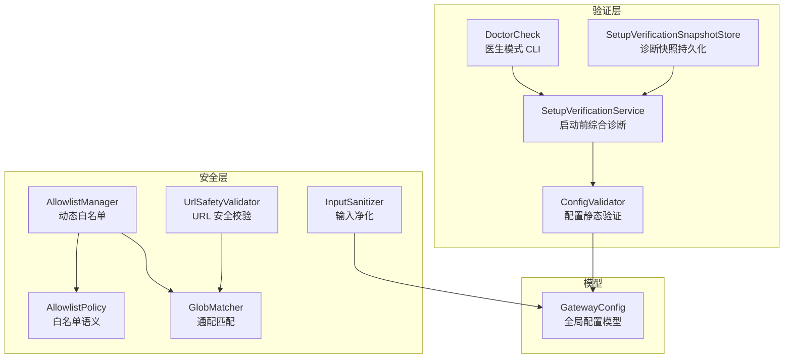
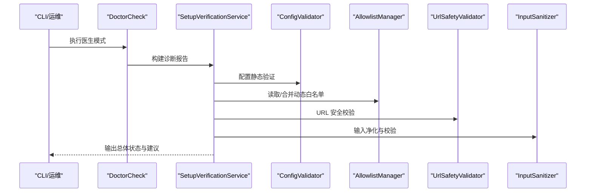
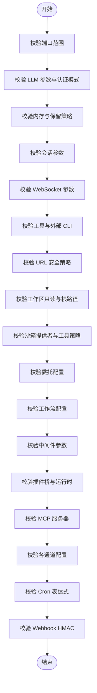
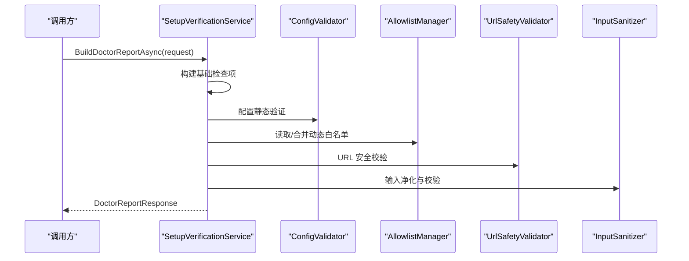
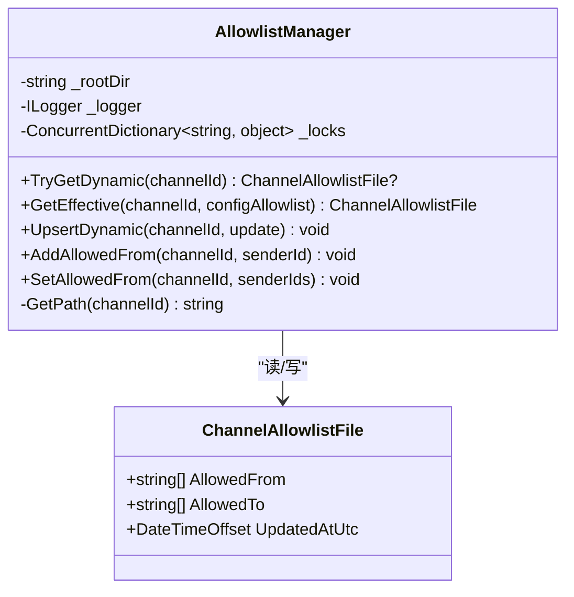
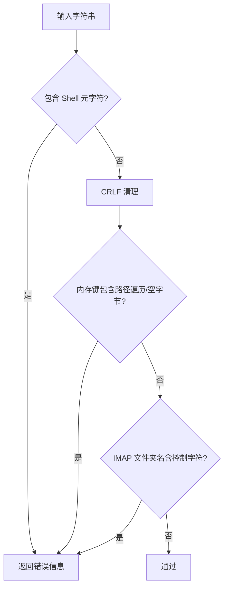
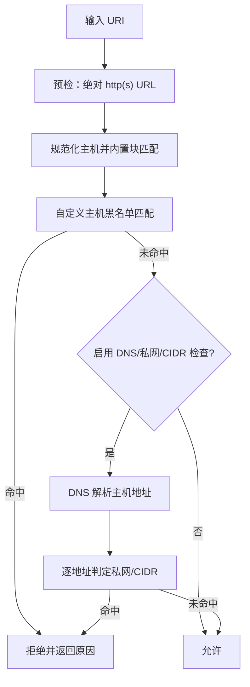
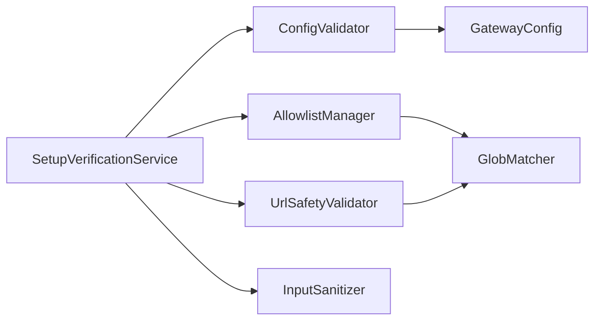

# 验证和安全组件

<cite>
**本文引用的文件**
- [ConfigValidator.cs](file://src/OpenClaw.Core/Validation/ConfigValidator.cs)
- [SetupVerificationService.cs](file://src/OpenClaw.Core/Validation/SetupVerificationService.cs)
- [DoctorCheck.cs](file://src/OpenClaw.Core/Validation/DoctorCheck.cs)
- [SetupVerificationSnapshotStore.cs](file://src/OpenClaw.Core/Validation/SetupVerificationSnapshotStore.cs)
- [AllowlistManager.cs](file://src/OpenClaw.Core/Security/AllowlistManager.cs)
- [AllowlistPolicy.cs](file://src/OpenClaw.Core/Security/AllowlistPolicy.cs)
- [GlobMatcher.cs](file://src/OpenClaw.Core/Security/GlobMatcher.cs)
- [InputSanitizer.cs](file://src/OpenClaw.Core/Security/InputSanitizer.cs)
- [UrlSafetyValidator.cs](file://src/OpenClaw.Core/Security/UrlSafetyValidator.cs)
- [GatewayConfig.cs](file://src/OpenClaw.Core/Models/GatewayConfig.cs)
- [SecurityTests.cs](file://src/OpenClaw.Tests/SecurityTests.cs)
- [ConfigValidatorTests.cs](file://src/OpenClaw.Tests/ConfigValidatorTests.cs)
- [UrlSafetyValidatorTests.cs](file://src/OpenClaw.Tests/UrlSafetyValidatorTests.cs)
</cite>

## 目录
1. [简介](#简介)
2. [项目结构](#项目结构)
3. [核心组件](#核心组件)
4. [架构总览](#架构总览)
5. [详细组件分析](#详细组件分析)
6. [依赖关系分析](#依赖关系分析)
7. [性能考量](#性能考量)
8. [故障排查指南](#故障排查指南)
9. [结论](#结论)
10. [附录](#附录)

## 简介
本文件系统性梳理 Kingcrab 项目中的验证与安全组件，覆盖配置验证、输入验证、安全策略与防护机制。重点文档化以下组件：ConfigValidator（配置静态验证）、SetupVerificationService（启动前综合诊断）、AllowlistManager（动态通道白名单管理）、InputSanitizer（输入净化）、UrlSafetyValidator（URL 安全校验）。同时阐述验证规则定义、执行流程、错误处理与日志记录，给出安全设计原则、威胁模型、防护措施与合规建议，并提供验证示例、安全配置模板、漏洞检测与修复指南，以及安全审计、异常监控与入侵检测响应机制。

## 项目结构
验证与安全相关代码主要分布在 OpenClaw.Core 的 Validation 与 Security 命名空间中，配合 Models 中的配置模型与 Tests 中的单元测试进行行为验证。

图示来源
- [ConfigValidator.cs](file://src/OpenClaw.Core/Validation/ConfigValidator.cs)
- [SetupVerificationService.cs](file://src/OpenClaw.Core/Validation/SetupVerificationService.cs)
- [DoctorCheck.cs](file://src/OpenClaw.Core/Validation/DoctorCheck.cs)
- [SetupVerificationSnapshotStore.cs](file://src/OpenClaw.Core/Validation/SetupVerificationSnapshotStore.cs)
- [AllowlistManager.cs](file://src/OpenClaw.Core/Security/AllowlistManager.cs)
- [AllowlistPolicy.cs](file://src/OpenClaw.Core/Security/AllowlistPolicy.cs)
- [GlobMatcher.cs](file://src/OpenClaw.Core/Security/GlobMatcher.cs)
- [InputSanitizer.cs](file://src/OpenClaw.Core/Security/InputSanitizer.cs)
- [UrlSafetyValidator.cs](file://src/OpenClaw.Core/Security/UrlSafetyValidator.cs)
- [GatewayConfig.cs](file://src/OpenClaw.Core/Models/GatewayConfig.cs)

章节来源
- [ConfigValidator.cs](file://src/OpenClaw.Core/Validation/ConfigValidator.cs)
- [SetupVerificationService.cs](file://src/OpenClaw.Core/Validation/SetupVerificationService.cs)
- [DoctorCheck.cs](file://src/OpenClaw.Core/Validation/DoctorCheck.cs)
- [SetupVerificationSnapshotStore.cs](file://src/OpenClaw.Core/Validation/SetupVerificationSnapshotStore.cs)
- [AllowlistManager.cs](file://src/OpenClaw.Core/Security/AllowlistManager.cs)
- [AllowlistPolicy.cs](file://src/OpenClaw.Core/Security/AllowlistPolicy.cs)
- [GlobMatcher.cs](file://src/OpenClaw.Core/Security/GlobMatcher.cs)
- [InputSanitizer.cs](file://src/OpenClaw.Core/Security/InputSanitizer.cs)
- [UrlSafetyValidator.cs](file://src/OpenClaw.Core/Security/UrlSafetyValidator.cs)
- [GatewayConfig.cs](file://src/OpenClaw.Core/Models/GatewayConfig.cs)

## 核心组件
- ConfigValidator：对 GatewayConfig 进行静态验证，涵盖端口、LLM 提供商与认证、内存与保留策略、会话与 WebSocket、工具与外部 CLI、沙箱、委托、工作流、中间件、插件桥传输、运行时模式与编排器、MCP 服务器、通道（短信、电报、WhatsApp、Teams 等）等，返回错误列表以实现 fail-fast。
- SetupVerificationService：构建“医生”报告，整合配置检查、源诊断、提示缓存兼容性、模型配置一致性、工作区就绪、文件系统根策略、安全态势、浏览器能力、操作员就绪度、模型医生、插件运行时与依赖、MCP、通道、OpenSandbox、存储可写与空间、端口可用性、提供商探活等，输出总体状态与建议动作。
- AllowlistManager：在存储目录下按通道持久化动态白名单文件，优先于静态配置；支持读取、合并有效白名单、原子更新与并发锁。
- InputSanitizer：提供多种输入净化与校验能力，包括 Shell 元字符检测、CRLF 清理、内存键路径遍历检测、IMAP 文件夹名控制字符检测。
- UrlSafetyValidator：对 http(s) 绝对 URL 进行预检、主机块、私网与 CIDR 黑名单、DNS 解析与地址判定，支持异步与同步两种调用形式。
- DoctorCheck：CLI 医生模式入口，打印诊断文本并返回是否阻断启动。
- SetupVerificationSnapshotStore：将诊断结果序列化保存到存储目录，提供加载与保存能力。

章节来源
- [ConfigValidator.cs](file://src/OpenClaw.Core/Validation/ConfigValidator.cs)
- [SetupVerificationService.cs](file://src/OpenClaw.Core/Validation/SetupVerificationService.cs)
- [DoctorCheck.cs](file://src/OpenClaw.Core/Validation/DoctorCheck.cs)
- [SetupVerificationSnapshotStore.cs](file://src/OpenClaw.Core/Validation/SetupVerificationSnapshotStore.cs)
- [AllowlistManager.cs](file://src/OpenClaw.Core/Security/AllowlistManager.cs)
- [InputSanitizer.cs](file://src/OpenClaw.Core/Security/InputSanitizer.cs)
- [UrlSafetyValidator.cs](file://src/OpenClaw.Core/Security/UrlSafetyValidator.cs)

## 架构总览
验证与安全组件通过“静态配置验证 + 启动前综合诊断”的双层保障，结合动态白名单、输入净化与 URL 安全校验，形成纵深防御体系。

图示来源
- [DoctorCheck.cs](file://src/OpenClaw.Core/Validation/DoctorCheck.cs)
- [SetupVerificationService.cs](file://src/OpenClaw.Core/Validation/SetupVerificationService.cs)
- [ConfigValidator.cs](file://src/OpenClaw.Core/Validation/ConfigValidator.cs)
- [AllowlistManager.cs](file://src/OpenClaw.Core/Security/AllowlistManager.cs)
- [UrlSafetyValidator.cs](file://src/OpenClaw.Core/Security/UrlSafetyValidator.cs)
- [InputSanitizer.cs](file://src/OpenClaw.Core/Security/InputSanitizer.cs)

## 详细组件分析

### ConfigValidator 组件分析
- 功能概述
  - 对 GatewayConfig 进行全面静态验证，发现配置错误即刻阻止启动。
  - 覆盖端口范围、LLM 参数与认证模式、本地推理、内存与保留策略、会话与 WebSocket、工具与外部 CLI、URL 安全、工作区只读模式与根路径、沙箱提供者与工具策略、编码后端、委托、工作流、中间件、插件桥传输、运行时模式与编排器、MCP 服务器、各通道配置（Twilio、Telegram、WhatsApp、Teams 等）以及 Cron 表达式与 Webhook HMAC 等。
- 关键规则与边界
  - 数值范围：端口、令牌数、温度、超时、重试、上下文大小、启动超时、电路断路阈值与冷却、最大历史轮次、连接上限、请求体大小、最大请求数等。
  - 字符串约束：绝对路径、CIDR、URL 形式、枚举值集合、必填字段、认证模式与提供商组合有效性。
  - 结构一致性：模型配置 ID 唯一性、默认配置存在性、回退链一致性、路由与模型配置关联。
- 错误处理与日志
  - 返回字符串列表作为错误摘要；不抛出异常，便于上层统一渲染与决策。
- 使用方法
  - 在启动阶段调用静态方法 Validate(config)，根据返回错误列表决定是否允许启动。
- 性能特征
  - 复杂度近似线性于配置项数量；无显著 IO 开销，主要为字符串与数值比较。

图示来源
- [ConfigValidator.cs](file://src/OpenClaw.Core/Validation/ConfigValidator.cs)

章节来源
- [ConfigValidator.cs](file://src/OpenClaw.Core/Validation/ConfigValidator.cs)
- [ConfigValidatorTests.cs](file://src/OpenClaw.Tests/ConfigValidatorTests.cs)

### SetupVerificationService 组件分析
- 功能概述
  - 构建 Doctor 报告，聚合多项检查项，输出总体状态（Pass/Warn/Fail），并给出推荐下一步动作。
  - 检查内容包括：运行时模式、配置静态验证、配置源诊断、提示缓存兼容性、模型配置一致性、工作区就绪、文件系统根策略、安全态势、浏览器能力、操作员就绪度、模型医生、插件运行时与依赖、MCP、通道、OpenSandbox、存储可写与空间、端口可用性、提供商探活。
- 关键流程
  - BuildDoctorReportAsync：按顺序构建检查项，必要时异步探测 Tailscale Serve、提供商探活。
  - BuildSetupVerificationResponse：筛选关键检查项生成 SetupVerificationResponse。
  - RenderDoctorText：将报告渲染为人类可读文本。
- 安全态势检查要点
  - 公网绑定时要求鉴权令牌、HTTP 工具审批需 requester 匹配、Canvas 前向需显式允许、信任转发头影响 Cookie 安全标记、Shell 工具在公网绑定时需强制沙箱。
- 推荐动作
  - 基于当前环境与策略生成具体建议，如创建工作区、完善提供商凭据、配置非本地浏览器执行后端、关闭引导令牌等。

图示来源
- [SetupVerificationService.cs](file://src/OpenClaw.Core/Validation/SetupVerificationService.cs)
- [ConfigValidator.cs](file://src/OpenClaw.Core/Validation/ConfigValidator.cs)
- [AllowlistManager.cs](file://src/OpenClaw.Core/Security/AllowlistManager.cs)
- [UrlSafetyValidator.cs](file://src/OpenClaw.Core/Security/UrlSafetyValidator.cs)
- [InputSanitizer.cs](file://src/OpenClaw.Core/Security/InputSanitizer.cs)

章节来源
- [SetupVerificationService.cs](file://src/OpenClaw.Core/Validation/SetupVerificationService.cs)
- [DoctorCheck.cs](file://src/OpenClaw.Core/Validation/DoctorCheck.cs)
- [SetupVerificationSnapshotStore.cs](file://src/OpenClaw.Core/Validation/SetupVerificationSnapshotStore.cs)

### AllowlistManager 组件分析
- 功能概述
  - 将每个通道的动态白名单文件持久化至 {StoragePath}/allowlists/{channel}.json，若存在动态文件则优先于静态配置。
  - 支持读取、合并有效白名单、原子更新（临时文件 + 移动覆盖）、并发锁保护。
- 关键接口
  - TryGetDynamic：读取动态白名单。
  - GetEffective：合并静态与动态白名单。
  - UpsertDynamic：原子更新动态白名单。
  - AddAllowedFrom/SetAllowedFrom：便捷维护发送方白名单。
- 安全与可靠性
  - 使用 ConcurrentDictionary 为通道级加锁，避免并发写入冲突。
  - 写入采用临时文件策略，失败时清理临时文件，降低损坏风险。
- 使用场景
  - 通道消息来源控制、动态授权与审计。

图示来源
- [AllowlistManager.cs](file://src/OpenClaw.Core/Security/AllowlistManager.cs)
- [AllowlistPolicy.cs](file://src/OpenClaw.Core/Security/AllowlistPolicy.cs)
- [GlobMatcher.cs](file://src/OpenClaw.Core/Security/GlobMatcher.cs)

章节来源
- [AllowlistManager.cs](file://src/OpenClaw.Core/Security/AllowlistManager.cs)
- [AllowlistPolicy.cs](file://src/OpenClaw.Core/Security/AllowlistPolicy.cs)
- [GlobMatcher.cs](file://src/OpenClaw.Core/Security/GlobMatcher.cs)

### InputSanitizer 组件分析
- 功能概述
  - 防御注入攻击的多层净化与校验：
    - Shell 元字符检测：禁用分号、管道、重定向、反引号、美元、括号、尖括号及换行符等。
    - CRLF 清理：移除 IMAP/SMTP 协议输入中的回车与换行，防止命令注入。
    - 内存键路径遍历检测：禁止 “..”、斜杠、反斜杠与空字节。
    - IMAP 文件夹名控制字符检测：仅允许可打印字符。
- 使用建议
  - 在工具执行前对用户输入进行净化与校验，拒绝包含危险字符的参数。
  - 与白名单策略结合，限制可访问的资源路径或目标。

图示来源
- [InputSanitizer.cs](file://src/OpenClaw.Core/Security/InputSanitizer.cs)

章节来源
- [InputSanitizer.cs](file://src/OpenClaw.Core/Security/InputSanitizer.cs)
- [SecurityTests.cs](file://src/OpenClaw.Tests/SecurityTests.cs)

### UrlSafetyValidator 组件分析
- 功能概述
  - 对 http(s) 绝对 URL 进行安全校验：
    - 预检：仅接受绝对 http/https URL，规范化主机名。
    - 主机块：内置 localhost/metadata 等模式，可被策略启用阻断。
    - 自定义主机黑名单：支持通配匹配。
    - 私网与 CIDR：可阻断私有/环回/链路本地/组播等地址与指定 CIDR。
    - DNS 解析：在需要时解析主机地址并逐条判定。
- 关键接口
  - ValidateHttpUrl/ValidateHttpUrlAsync：同步/异步校验。
  - UrlSafetyValidationResult：封装允许/拒绝与原因，提供工具错误格式化。
- 使用建议
  - 在网络工具（如 WebFetch、Browser）发起请求前调用校验，拒绝高风险目标。
  - 结合通道白名单与动态白名单，形成多层防护。

图示来源
- [UrlSafetyValidator.cs](file://src/OpenClaw.Core/Security/UrlSafetyValidator.cs)

章节来源
- [UrlSafetyValidator.cs](file://src/OpenClaw.Core/Security/UrlSafetyValidator.cs)
- [UrlSafetyValidatorTests.cs](file://src/OpenClaw.Tests/UrlSafetyValidatorTests.cs)

### DoctorCheck 与 SetupVerificationSnapshotStore
- DoctorCheck
  - CLI 医生模式入口，加载本地状态、构建报告并输出文本，返回是否阻断启动。
- SetupVerificationSnapshotStore
  - 将 SetupVerificationService 的诊断结果持久化到存储目录下的 JSON 文件，支持加载与保存，采用临时文件策略保证原子性。

章节来源
- [DoctorCheck.cs](file://src/OpenClaw.Core/Validation/DoctorCheck.cs)
- [SetupVerificationSnapshotStore.cs](file://src/OpenClaw.Core/Validation/SetupVerificationSnapshotStore.cs)

## 依赖关系分析
- 组件耦合
  - ConfigValidator 依赖模型与工具（如 SecretResolver、ConfigPathResolver、GlobMatcher 等）进行配置解析与校验。
  - SetupVerificationService 依赖 ConfigValidator、AllowlistManager、UrlSafetyValidator、InputSanitizer 等进行综合检查。
  - AllowlistManager 依赖 GlobMatcher 实现通配匹配。
  - UrlSafetyValidator 依赖 GlobMatcher 与 DNS 解析。
- 外部依赖
  - DNS 解析用于地址判定。
  - 文件系统用于动态白名单与诊断快照的读写。
- 循环依赖
  - 未见循环依赖，模块职责清晰。

图示来源
- [ConfigValidator.cs](file://src/OpenClaw.Core/Validation/ConfigValidator.cs)
- [SetupVerificationService.cs](file://src/OpenClaw.Core/Validation/SetupVerificationService.cs)
- [AllowlistManager.cs](file://src/OpenClaw.Core/Security/AllowlistManager.cs)
- [UrlSafetyValidator.cs](file://src/OpenClaw.Core/Security/UrlSafetyValidator.cs)
- [GlobMatcher.cs](file://src/OpenClaw.Core/Security/GlobMatcher.cs)
- [GatewayConfig.cs](file://src/OpenClaw.Core/Models/GatewayConfig.cs)

章节来源
- [ConfigValidator.cs](file://src/OpenClaw.Core/Validation/ConfigValidator.cs)
- [SetupVerificationService.cs](file://src/OpenClaw.Core/Validation/SetupVerificationService.cs)
- [AllowlistManager.cs](file://src/OpenClaw.Core/Security/AllowlistManager.cs)
- [UrlSafetyValidator.cs](file://src/OpenClaw.Core/Security/UrlSafetyValidator.cs)
- [GlobMatcher.cs](file://src/OpenClaw.Core/Security/GlobMatcher.cs)
- [GatewayConfig.cs](file://src/OpenClaw.Core/Models/GatewayConfig.cs)

## 性能考量
- 配置验证
  - 复杂度近似线性，主要为常量时间比较与少量字符串处理；建议在启动阶段一次性完成，避免重复计算。
- URL 安全校验
  - 异步版本在 DNS 解析时引入网络等待，建议在工具链路中尽早调用，减少无效请求。
- 白名单与通配匹配
  - GlobMatcher 使用 Span 与首段/中间段匹配算法，避免 Split 分割带来的分配；建议合理控制通配模式数量。
- 存储与并发
  - AllowlistManager 使用通道级锁与临时文件策略，写入开销可控；建议批量更新时合并多次变更。

## 故障排查指南
- 启动失败（配置错误）
  - 使用医生模式查看详细错误摘要与下一步建议，定位端口、路径、认证模式、提供商配置等问题。
- URL 访问被拒
  - 检查 UrlSafetyConfig 的 BlockPrivateNetworkTargets、BlockedHostGlobs、BlockedCidrs 设置；确认目标是否为私网或环回地址。
- 白名单不生效
  - 确认动态白名单文件存在且 JSON 结构正确；检查 AllowlistManager 的存储路径权限。
- 输入注入风险
  - 检查工具执行前是否调用了 InputSanitizer 的相应校验函数；确保参数未绕过净化。
- 诊断结果持久化失败
  - 检查存储目录权限与磁盘空间；确认临时文件策略未被中断。

章节来源
- [DoctorCheck.cs](file://src/OpenClaw.Core/Validation/DoctorCheck.cs)
- [SetupVerificationService.cs](file://src/OpenClaw.Core/Validation/SetupVerificationService.cs)
- [UrlSafetyValidatorTests.cs](file://src/OpenClaw.Tests/UrlSafetyValidatorTests.cs)
- [SecurityTests.cs](file://src/OpenClaw.Tests/SecurityTests.cs)

## 结论
通过“静态配置验证 + 启动前综合诊断”的双层验证与“动态白名单 + 输入净化 + URL 安全校验”的多层安全防护，系统在启动阶段即可发现并阻断潜在风险，运行阶段持续拦截注入与越权访问。建议在生产环境中默认启用严格安全策略（如公网绑定时的鉴权令牌、强制沙箱、私网阻断、严格的白名单与输入净化），并定期运行医生模式进行健康巡检与合规审查。

## 附录

### 安全设计原则
- 最小暴露面：默认 loopback 绑定，公网暴露需经严格安全加固。
- 默认拒绝：URL 安全与白名单默认阻断私网与环回，除非明确放行。
- 防御纵深：输入净化、URL 校验、白名单、沙箱、鉴权与审计共同构成防护体系。
- 可观测性：所有检查项输出明确状态与原因，便于快速定位问题。

### 威胁模型与防护措施
- 注入攻击（命令/SQL/IMAP）
  - 防护：Shell 元字符检测、CRLF 清理、路径遍历检测、控制字符过滤。
- 私网/环回访问
  - 防护：默认阻断私网与环回地址，CIDR 黑名单补充。
- 未授权通道访问
  - 防护：动态白名单优先，严格匹配发送方与接收方标识。
- 配置漂移与错误
  - 防护：静态验证与医生模式，确保配置一致性与完整性。

### 验证示例与最佳实践
- 配置验证
  - 示例路径：[ConfigValidatorTests.cs](file://src/OpenClaw.Tests/ConfigValidatorTests.cs)
  - 建议：在 CI 中集成静态验证，确保每次变更均通过验证。
- URL 安全校验
  - 示例路径：[UrlSafetyValidatorTests.cs](file://src/OpenClaw.Tests/UrlSafetyValidatorTests.cs)
  - 建议：在网络工具调用前统一执行校验，拒绝高风险目标。
- 输入净化
  - 示例路径：[SecurityTests.cs](file://src/OpenClaw.Tests/SecurityTests.cs)
  - 建议：在工具执行前对所有用户输入进行净化与校验。

### 安全配置模板
- URL 安全策略
  - 开启 BlockPrivateNetworkTargets，设置 BlockedHostGlobs 与 BlockedCidrs，按需启用 DNS 解析。
- 白名单策略
  - Channels.AllowlistSemantics 设为 strict 或 legacy，结合动态白名单文件精细化控制。
- 沙箱策略
  - 对 Shell 等高危工具在公网绑定时强制 Require 模式，并提供模板与 TTL 控制。

### 漏洞检测与修复指南
- 常见问题
  - 私网/环回地址访问：启用私网阻断并检查 CIDR。
  - 未配置鉴权令牌：公网绑定时必须设置 AuthToken。
  - 工作区路径非绝对：在 WorkspaceOnly 模式下必须使用绝对路径。
  - MCP 服务器缺少必要字段：stdio 需 Command，http 需绝对 URL。
- 修复步骤
  - 根据医生模式输出逐项修正配置。
  - 更新动态白名单文件或调整静态白名单策略。
  - 强化输入净化与 URL 校验逻辑。

### 安全审计、异常监控与响应
- 审计
  - 使用 DoctorCheck 与 SetupVerificationSnapshotStore 记录诊断快照，定期比对差异。
- 异常监控
  - 在 URL 校验与输入净化处埋点，记录拒绝原因与触发次数。
- 入侵检测与响应
  - 对频繁触发拒绝的来源与目标建立告警，必要时临时加入黑名单或收紧白名单。