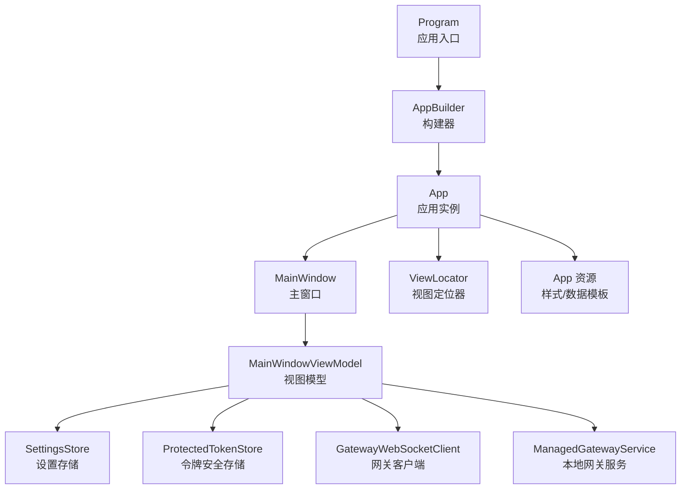
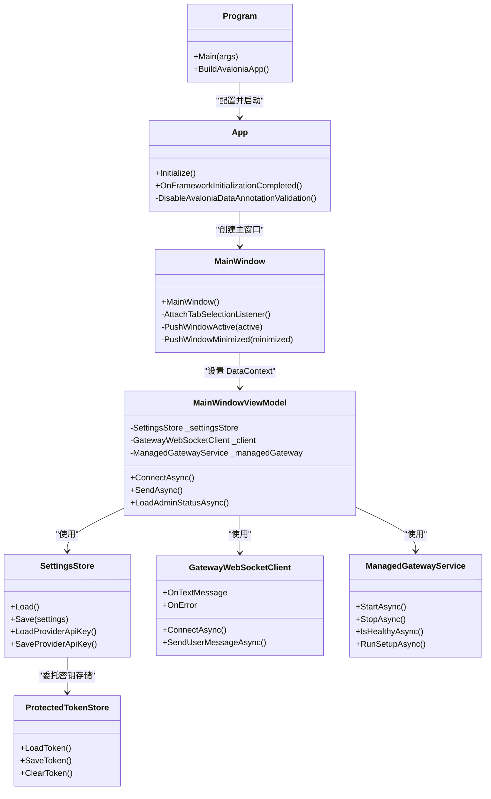
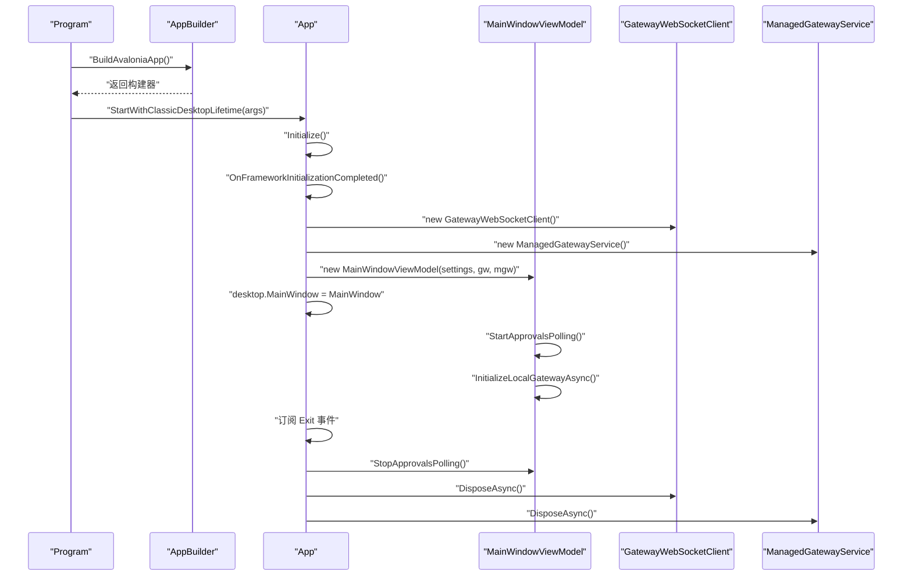
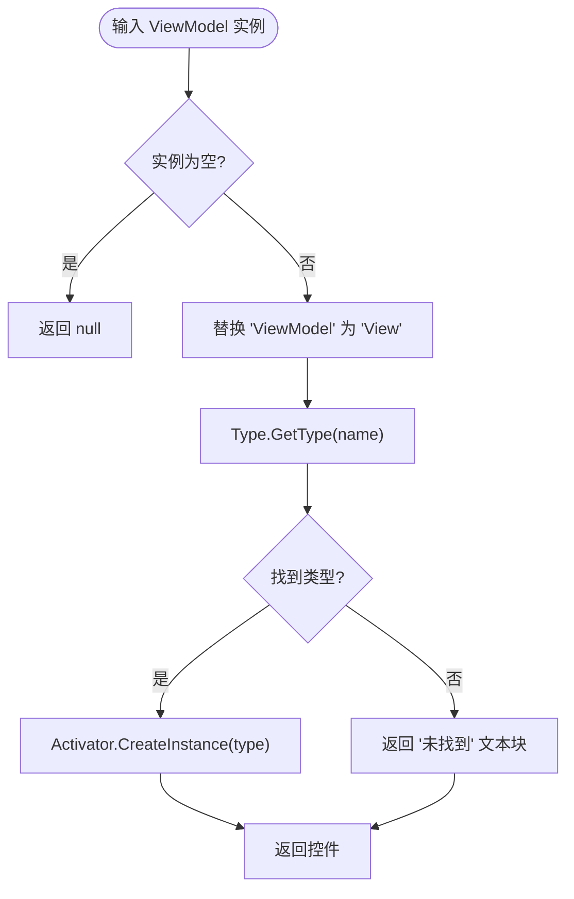
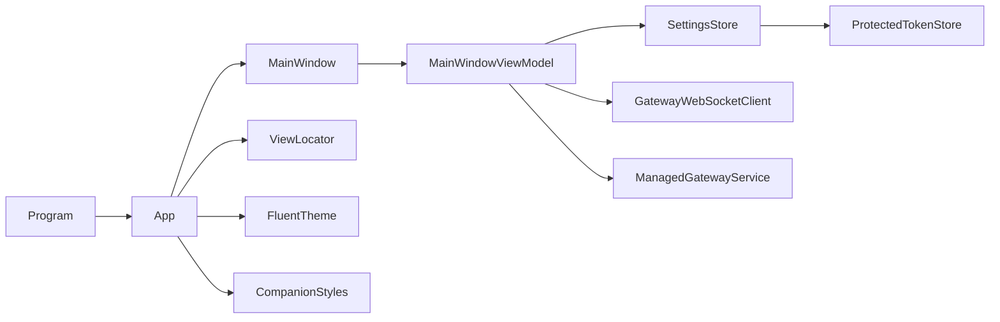

# Companion 应用架构

<cite>
**本文档引用的文件**
- [App.axaml.cs](file://src/OpenClaw.Companion/App.axaml.cs)
- [Program.cs](file://src/OpenClaw.Companion/Program.cs)
- [App.axaml](file://src/OpenClaw.Companion/App.axaml)
- [ViewLocator.cs](file://src/OpenClaw.Companion/ViewLocator.cs)
- [OpenClaw.Companion.csproj](file://src/OpenClaw.Companion/OpenClaw.Companion.csproj)
- [MainWindow.axaml](file://src/OpenClaw.Companion/Views/MainWindow.axaml)
- [MainWindow.axaml.cs](file://src/OpenClaw.Companion/Views/MainWindow.axaml.cs)
- [MainWindowViewModel.cs](file://src/OpenClaw.Companion/ViewModels/MainWindowViewModel.cs)
- [ViewModelBase.cs](file://src/OpenClaw.Companion/ViewModels/ViewModelBase.cs)
- [SettingsStore.cs](file://src/OpenClaw.Companion/Services/SettingsStore.cs)
- [ProtectedTokenStore.cs](file://src/OpenClaw.Companion/Services/ProtectedTokenStore.cs)
- [GatewayWebSocketClient.cs](file://src/OpenClaw.Companion/Services/GatewayWebSocketClient.cs)
- [ManagedGatewayService.cs](file://src/OpenClaw.Companion/Services/ManagedGatewayService.cs)
- [CompanionStyles.axaml](file://src/OpenClaw.Companion/Styles/CompanionStyles.axaml)
- [CompanionSettings.cs](file://src/OpenClaw.Companion/Models/CompanionSettings.cs)
</cite>

## 目录
1. [简介](#简介)
2. [项目结构](#项目结构)
3. [核心组件](#核心组件)
4. [架构总览](#架构总览)
5. [详细组件分析](#详细组件分析)
6. [依赖关系分析](#依赖关系分析)
7. [性能考虑](#性能考虑)
8. [故障排除指南](#故障排除指南)
9. [结论](#结论)
10. [附录](#附录)

## 简介
本文件系统性梳理 Companion（OpenClaw.Companion）桌面应用的 Avalonia 架构与实现，覆盖应用启动流程、配置与生命周期管理、视图定位器、资源与主题、国际化基础、平台检测与构建器配置、日志与字体配置、以及安全存储与网关集成等关键主题。文档面向开发者与架构师，既提供代码级细节，也给出可视化图示与最佳实践建议。

## 项目结构
Companion 是一个基于 Avalonia 的跨平台桌面应用，采用 MVVM 架构，主要模块包括：
- 应用入口与构建器：Program、App
- 视图层：MainWindow 及其视图模型 MainWindowViewModel
- 视图定位器：ViewLocator
- 资源与样式：App 资源、CompanionStyles
- 配置与安全存储：SettingsStore、ProtectedTokenStore
- 网关通信：GatewayWebSocketClient
- 本地网关管理：ManagedGatewayService
- 模型：CompanionSettings

**图表来源**
- [Program.cs:11-21](file://src/OpenClaw.Companion/Program.cs#L11-L21)
- [App.axaml.cs:18-62](file://src/OpenClaw.Companion/App.axaml.cs#L18-L62)
- [MainWindow.axaml.cs:9-28](file://src/OpenClaw.Companion/Views/MainWindow.axaml.cs#L9-L28)
- [MainWindowViewModel.cs:93-115](file://src/OpenClaw.Companion/ViewModels/MainWindowViewModel.cs#L93-L115)
- [ViewLocator.cs:15-37](file://src/OpenClaw.Companion/ViewLocator.cs#L15-L37)
- [App.axaml:9-21](file://src/OpenClaw.Companion/App.axaml#L9-L21)

**章节来源**
- [Program.cs:11-21](file://src/OpenClaw.Companion/Program.cs#L11-L21)
- [App.axaml.cs:18-62](file://src/OpenClaw.Companion/App.axaml.cs#L18-L62)
- [OpenClaw.Companion.csproj:1-41](file://src/OpenClaw.Companion/OpenClaw.Companion.csproj#L1-L41)

## 核心组件
- 应用入口与构建器：Program 提供 Main 入口与 BuildAvaloniaApp 构建器，使用 UsePlatformDetect 自动检测平台，WithInterFont 注入字体，LogToTrace 输出日志。
- 应用实例 App：重写 Initialize 与 OnFrameworkInitializationCompleted，完成视图定位器、数据模板、样式加载，并在桌面生命周期中初始化视图模型、网关客户端与本地网关服务。
- 视图定位器 ViewLocator：通过反射将 ViewModel 类名映射到 View，匹配 ViewModelBase 基类。
- 主窗口与视图模型：MainWindow 完成窗口状态与标签页选择事件绑定；MainWindowViewModel 负责连接网关、消息处理、设置加载与保存、审批轮询等。
- 设置与安全存储：SettingsStore 负责序列化/反序列化设置并集成 ProtectedTokenStore；ProtectedTokenStore 根据平台选择 macOS Keychain、Windows DPAPI 或 Linux Secret-tool。
- 网关通信：GatewayWebSocketClient 封装底层 OpenClawWebSocketClient，暴露文本消息、信封与错误事件。
- 本地网关服务：ManagedGatewayService 负责解析可执行路径、启动/停止进程、健康检查、配置读取与命令执行。
- 资源与样式：App 资源注册转换器、数据模板与 Fluent 主题；CompanionStyles 定义页面标题、卡片、徽章等通用样式。

**章节来源**
- [Program.cs:11-21](file://src/OpenClaw.Companion/Program.cs#L11-L21)
- [App.axaml.cs:18-62](file://src/OpenClaw.Companion/App.axaml.cs#L18-L62)
- [ViewLocator.cs:15-37](file://src/OpenClaw.Companion/ViewLocator.cs#L15-L37)
- [MainWindowViewModel.cs:93-115](file://src/OpenClaw.Companion/ViewModels/MainWindowViewModel.cs#L93-L115)
- [SettingsStore.cs:37-118](file://src/OpenClaw.Companion/Services/SettingsStore.cs#L37-L118)
- [ProtectedTokenStore.cs:45-106](file://src/OpenClaw.Companion/Services/ProtectedTokenStore.cs#L45-L106)
- [GatewayWebSocketClient.cs:5-39](file://src/OpenClaw.Companion/Services/GatewayWebSocketClient.cs#L5-L39)
- [ManagedGatewayService.cs:8-67](file://src/OpenClaw.Companion/Services/ManagedGatewayService.cs#L8-L67)
- [App.axaml:9-21](file://src/OpenClaw.Companion/App.axaml#L9-L21)
- [CompanionStyles.axaml:1-73](file://src/OpenClaw.Companion/Styles/CompanionStyles.axaml#L1-L73)

## 架构总览
Companion 采用经典的 MVVM + 服务层架构：
- 视图层：MainWindow 通过 DataContext 绑定 MainWindowViewModel
- 视图模型层：MainWindowViewModel 聚合 SettingsStore、GatewayWebSocketClient、ManagedGatewayService
- 服务层：SettingsStore/ProtectedTokenStore 负责配置与密钥存储；GatewayWebSocketClient 负责与网关通信；ManagedGatewayService 负责本地网关生命周期
- 资源层：App 资源与 CompanionStyles 提供统一的主题与样式

**图表来源**
- [Program.cs:11-21](file://src/OpenClaw.Companion/Program.cs#L11-L21)
- [App.axaml.cs:18-62](file://src/OpenClaw.Companion/App.axaml.cs#L18-L62)
- [MainWindow.axaml.cs:9-28](file://src/OpenClaw.Companion/Views/MainWindow.axaml.cs#L9-L28)
- [MainWindowViewModel.cs:93-115](file://src/OpenClaw.Companion/ViewModels/MainWindowViewModel.cs#L93-L115)
- [SettingsStore.cs:37-118](file://src/OpenClaw.Companion/Services/SettingsStore.cs#L37-L118)
- [ProtectedTokenStore.cs:45-106](file://src/OpenClaw.Companion/Services/ProtectedTokenStore.cs#L45-L106)
- [GatewayWebSocketClient.cs:5-39](file://src/OpenClaw.Companion/Services/GatewayWebSocketClient.cs#L5-L39)
- [ManagedGatewayService.cs:8-67](file://src/OpenClaw.Companion/Services/ManagedGatewayService.cs#L8-L67)

## 详细组件分析

### 应用启动与生命周期
- 启动流程：Program.Main 调用 BuildAvaloniaApp，配置平台检测、字体与日志后以经典桌面生命周期启动。
- 初始化：App.Initialize 加载 XAML；OnFrameworkInitializationCompleted 中禁用 Avalonia 数据注解验证插件，避免与 CommunityToolkit 重复校验；创建 GatewayWebSocketClient、ManagedGatewayService、SettingsStore 与 MainWindowViewModel；设置 MainWindow.DataContext 并附加通知与对话框服务；订阅退出事件进行资源释放。
- 生命周期：桌面生命周期结束时，停止审批轮询并异步释放网关客户端与本地网关服务。

**图表来源**
- [Program.cs:11-21](file://src/OpenClaw.Companion/Program.cs#L11-L21)
- [App.axaml.cs:23-62](file://src/OpenClaw.Companion/App.axaml.cs#L23-L62)
- [MainWindowViewModel.cs:485-520](file://src/OpenClaw.Companion/ViewModels/MainWindowViewModel.cs#L485-L520)

**章节来源**
- [Program.cs:11-21](file://src/OpenClaw.Companion/Program.cs#L11-L21)
- [App.axaml.cs:23-62](file://src/OpenClaw.Companion/App.axaml.cs#L23-L62)

### 视图定位器与数据模板
- ViewLocator 通过将 ViewModel 类名中的 ViewModel 替换为 View 并反射创建对应视图控件；Match 判断数据类型是否继承自 ViewModelBase。
- App 资源中注册 ViewLocator 作为数据模板，使 Avalonia 在绑定 DataContext 时自动解析视图。

**图表来源**
- [ViewLocator.cs:17-36](file://src/OpenClaw.Companion/ViewLocator.cs#L17-L36)
- [App.axaml:13-15](file://src/OpenClaw.Companion/App.axaml#L13-L15)

**章节来源**
- [ViewLocator.cs:15-37](file://src/OpenClaw.Companion/ViewLocator.cs#L15-L37)
- [App.axaml:13-15](file://src/OpenClaw.Companion/App.axaml#L13-L15)

### 字体与日志配置
- 字体：WithInterFont 注入 Inter 字体，提升可读性与一致性。
- 日志：LogToTrace 将日志输出到调试跟踪，便于开发与诊断。

**章节来源**
- [Program.cs:16-20](file://src/OpenClaw.Companion/Program.cs#L16-L20)

### 跨平台检测与平台特定配置
- UsePlatformDetect 自动检测运行平台并启用相应平台特性。
- 平台安全存储：ProtectedTokenStore 根据操作系统选择不同密钥存储后端（macOS Keychain、Windows DPAPI、Linux Secret-tool），若均不可用则回退到明文文件存储（受 AllowPlaintextTokenFallback 控制）。

**章节来源**
- [Program.cs:18-18](file://src/OpenClaw.Companion/Program.cs#L18-L18)
- [ProtectedTokenStore.cs:121-136](file://src/OpenClaw.Companion/Services/ProtectedTokenStore.cs#L121-L136)
- [ProtectedTokenStore.cs:45-106](file://src/OpenClaw.Companion/Services/ProtectedTokenStore.cs#L45-L106)

### 应用资源管理与主题
- App 资源：注册转换器 InverseBooleanConverter；数据模板使用 ViewLocator；样式包含 FluentTheme 与自定义 CompanionStyles。
- CompanionStyles：定义页面标题、段落标题、卡片、徽章、危险按钮、错误横幅等通用样式，统一 UI 设计语言。

**章节来源**
- [App.axaml:9-21](file://src/OpenClaw.Companion/App.axaml#L9-L21)
- [CompanionStyles.axaml:1-73](file://src/OpenClaw.Companion/Styles/CompanionStyles.axaml#L1-L73)

### 国际化支持
- 当前项目未见显式多语言资源或区域性配置，国际化能力未在 Companion 中启用。如需国际化，可在 App 资源中引入本地化资源字典并在视图模型中绑定区域性切换逻辑。

[本节为概念性说明，不直接分析具体文件]

### 配置与设置存储
- SettingsStore：负责 settings.json 的读写，集成 ProtectedTokenStore 存储操作员令牌；支持从旧版 JSON 迁移令牌字段；保存时仅写入非敏感设置，令牌单独加密存储。
- ProtectedTokenStore：按平台选择安全存储；支持明文回退（受 AllowPlaintextTokenFallback 控制）；提供 LastWarning 用于提示存储可用性与回退情况。

**章节来源**
- [SettingsStore.cs:37-118](file://src/OpenClaw.Companion/Services/SettingsStore.cs#L37-L118)
- [ProtectedTokenStore.cs:45-106](file://src/OpenClaw.Companion/Services/ProtectedTokenStore.cs#L45-L106)
- [CompanionSettings.cs:5-24](file://src/OpenClaw.Companion/Models/CompanionSettings.cs#L5-L24)

### 网关通信与本地网关管理
- GatewayWebSocketClient：封装底层 WebSocket 客户端，暴露 OnTextMessage、OnEnvelopeReceived、OnError 事件，提供连接、断开与消息发送接口。
- ManagedGatewayService：解析网关与 CLI 可执行文件路径；启动/停止本地网关进程；健康检查；根据配置生成 WebSocket URL；执行模型安装/验证等命令；支持环境变量注入（如模型提供商密钥）。

**章节来源**
- [GatewayWebSocketClient.cs:5-39](file://src/OpenClaw.Companion/Services/GatewayWebSocketClient.cs#L5-L39)
- [ManagedGatewayService.cs:8-67](file://src/OpenClaw.Companion/Services/ManagedGatewayService.cs#L8-L67)
- [ManagedGatewayService.cs:161-202](file://src/OpenClaw.Companion/Services/ManagedGatewayService.cs#L161-L202)
- [ManagedGatewayService.cs:455-492](file://src/OpenClaw.Companion/Services/ManagedGatewayService.cs#L455-L492)

### 主窗口与视图模型交互
- MainWindow：在构造函数中绑定窗口激活/最小化事件与标签页选择事件，向 MainWindowViewModel 推送窗口状态与当前标签页活跃状态。
- MainWindowViewModel：负责连接/断开网关、发送消息、加载管理员状态、处理网关信封消息、维护消息列表、设置加载与保存、审批轮询与历史加载等。

**章节来源**
- [MainWindow.axaml.cs:9-66](file://src/OpenClaw.Companion/Views/MainWindow.axaml.cs#L9-L66)
- [MainWindowViewModel.cs:93-115](file://src/OpenClaw.Companion/ViewModels/MainWindowViewModel.cs#L93-L115)
- [MainWindowViewModel.cs:198-265](file://src/OpenClaw.Companion/ViewModels/MainWindowViewModel.cs#L198-L265)

## 依赖关系分析
- 组件耦合：MainWindowViewModel 对 SettingsStore、GatewayWebSocketClient、ManagedGatewayService 存在直接依赖；App 通过构造函数注入依赖并传递给 MainWindowViewModel。
- 外部依赖：Avalonia（UI）、CommunityToolkit.Mvvm（MVVM）、Avalonia.Themes.Fluent（主题）、Avalonia.Fonts.Inter（字体）、Avalonia.Diagnostics（仅 Debug）。
- 项目内依赖：OpenClaw.Client（网关通信）、OpenClaw.Core（模型与工具）。

**图表来源**
- [Program.cs:11-21](file://src/OpenClaw.Companion/Program.cs#L11-L21)
- [App.axaml.cs:18-62](file://src/OpenClaw.Companion/App.axaml.cs#L18-L62)
- [MainWindowViewModel.cs:93-115](file://src/OpenClaw.Companion/ViewModels/MainWindowViewModel.cs#L93-L115)
- [SettingsStore.cs:37-118](file://src/OpenClaw.Companion/Services/SettingsStore.cs#L37-L118)
- [GatewayWebSocketClient.cs:5-39](file://src/OpenClaw.Companion/Services/GatewayWebSocketClient.cs#L5-L39)
- [ManagedGatewayService.cs:8-67](file://src/OpenClaw.Companion/Services/ManagedGatewayService.cs#L8-L67)
- [App.axaml:17-21](file://src/OpenClaw.Companion/App.axaml#L17-L21)

**章节来源**
- [OpenClaw.Companion.csproj:19-35](file://src/OpenClaw.Companion/OpenClaw.Companion.csproj#L19-L35)

## 性能考虑
- UI 线程调度：MainWindowViewModel 使用 Dispatcher.UIThread.Post 更新 UI，避免跨线程访问。
- 异步任务：连接、断开、启动/停止网关、健康检查均为异步，避免阻塞 UI。
- 事件驱动：GatewayWebSocketClient 通过事件分发消息，减少轮询与阻塞等待。
- 资源释放：在 App 退出事件中释放网关客户端与本地网关服务，防止资源泄漏。
- 字体与日志：Inter 字体与 Trace 日志在开发阶段有助于性能分析与问题定位。

[本节提供一般性指导，不直接分析具体文件]

## 故障排除指南
- 连接失败：检查 ServerUrl 是否为有效 WebSocket URL；确认网络可达与认证令牌正确；查看 MainWindowViewModel 中的异常消息。
- 令牌存储问题：若提示“安全令牌存储不可用”，可启用 AllowPlaintextTokenFallback 使用明文回退；查看 ProtectedTokenStore.LastWarning 获取详细提示。
- 本地网关启动失败：检查 GatewayExecutable 解析结果与配置文件存在性；确认已执行首次 Setup；查看 ManagedGatewayService 的启动结果与超时信息。
- 审批轮询：若审批未刷新，确认 StartApprovalsPolling 已调用且未被 StopApprovalsPolling 停止。

**章节来源**
- [MainWindowViewModel.cs:485-520](file://src/OpenClaw.Companion/ViewModels/MainWindowViewModel.cs#L485-L520)
- [SettingsStore.cs:37-77](file://src/OpenClaw.Companion/Services/SettingsStore.cs#L37-L77)
- [ProtectedTokenStore.cs:45-106](file://src/OpenClaw.Companion/Services/ProtectedTokenStore.cs#L45-L106)
- [ManagedGatewayService.cs:161-202](file://src/OpenClaw.Companion/Services/ManagedGatewayService.cs#L161-L202)

## 结论
Companion 应用通过清晰的 MVVM 分层与服务化设计，实现了跨平台桌面应用的启动、配置、通信与本地网关管理。其架构具备良好的可扩展性与安全性（密钥存储抽象），同时保持了简洁的视图定位与统一的样式体系。建议在后续迭代中引入国际化支持、完善错误恢复策略与性能监控。

## 附录
- 项目构建与运行：使用 .NET 10，Avalonia 11.3.12，按需启用 Avalonia.Diagnostics（仅 Debug）。
- 资源与图标：MainWindow 指定应用图标路径，确保打包时资源可用。
- 扩展建议：增加单元测试覆盖率、引入依赖注入容器、增强日志分级与持久化、支持多语言资源字典。

**章节来源**
- [OpenClaw.Companion.csproj:1-41](file://src/OpenClaw.Companion/OpenClaw.Companion.csproj#L1-L41)
- [MainWindow.axaml:10-11](file://src/OpenClaw.Companion/Views/MainWindow.axaml#L10-L11)