# 主窗口界面

<cite>
**本文档引用的文件**
- [MainWindow.axaml](file://src/OpenClaw.Companion/Views/MainWindow.axaml)
- [MainWindow.axaml.cs](file://src/OpenClaw.Companion/Views/MainWindow.axaml.cs)
- [MainWindowViewModel.cs](file://src/OpenClaw.Companion/ViewModels/MainWindowViewModel.cs)
- [ViewModelBase.cs](file://src/OpenClaw.Companion/ViewModels/ViewModelBase.cs)
- [CompanionStyles.axaml](file://src/OpenClaw.Companion/Styles/CompanionStyles.axaml)
- [App.axaml](file://src/OpenClaw.Companion/App.axaml)
- [MainWindowViewModel.Dashboard.cs](file://src/OpenClaw.Companion/ViewModels/MainWindowViewModel.Dashboard.cs)
- [MainWindowViewModel.Canvas.cs](file://src/OpenClaw.Companion/ViewModels/MainWindowViewModel.Canvas.cs)
- [MainWindowViewModel.Sessions.cs](file://src/OpenClaw.Companion/ViewModels/MainWindowViewModel.Sessions.cs)
- [MainWindowViewModel.Approvals.cs](file://src/OpenClaw.Companion/ViewModels/MainWindowViewModel.Approvals.cs)
- [MainWindowViewModel.ManagedGateway.cs](file://src/OpenClaw.Companion/ViewModels/MainWindowViewModel.ManagedGateway.cs)
- [MainWindowViewModel.WhatsApp.cs](file://src/OpenClaw.Companion/ViewModels/MainWindowViewModel.WhatsApp.cs)
- [MainWindowViewModel.Workflows.cs](file://src/OpenClaw.Companion/ViewModels/MainWindowViewModel.Workflows.cs)
- [MainWindowViewModel.Automations.cs](file://src/OpenClaw.Companion/ViewModels/MainWindowViewModel.Automations.cs)
</cite>

## 目录
1. [简介](#简介)
2. [项目结构](#项目结构)
3. [核心组件](#核心组件)
4. [架构概览](#架构概览)
5. [详细组件分析](#详细组件分析)
6. [依赖关系分析](#依赖关系分析)
7. [性能考虑](#性能考虑)
8. [故障排除指南](#故障排除指南)
9. [结论](#结论)

## 简介

OpenClaw.NET Companion 的主窗口界面是一个基于 AvaloniaUI 构建的现代化桌面应用程序，提供了丰富的运行时管理和控制功能。该界面采用 MVVM 设计模式，实现了完整的数据绑定、命令处理和用户交互机制。

本系统集成了多个核心功能模块，包括：
- 运行时连接管理（WebSocket）
- 本地网关管理
- Canvas 用户界面渲染
- 会话和工作流管理
- 自动化任务调度
- 审批流程管理
- WhatsApp 集成
- 支付实验室功能

## 项目结构

主窗口界面位于 OpenClaw.Companion 项目中，采用标准的 MVVM 分层架构：

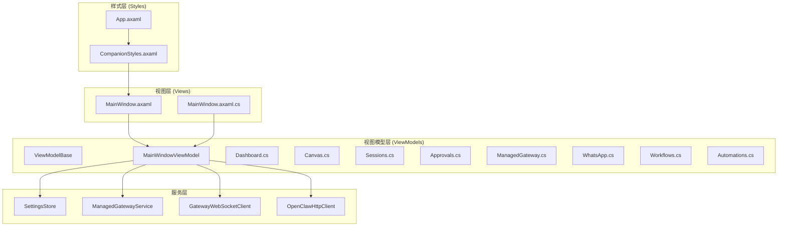

**图表来源**
- [MainWindow.axaml:1-501](file://src/OpenClaw.Companion/Views/MainWindow.axaml#L1-L501)
- [MainWindowViewModel.cs:1-701](file://src/OpenClaw.Companion/ViewModels/MainWindowViewModel.cs#L1-L701)
- [CompanionStyles.axaml:1-73](file://src/OpenClaw.Companion/Styles/CompanionStyles.axaml#L1-L73)

**章节来源**
- [MainWindow.axaml:1-501](file://src/OpenClaw.Companion/Views/MainWindow.axaml#L1-L501)
- [MainWindowViewModel.cs:88-115](file://src/OpenClaw.Companion/ViewModels/MainWindowViewModel.cs#L88-L115)

## 核心组件

### 主窗口布局设计

主窗口采用网格布局系统，实现了响应式设计和灵活的内容组织：

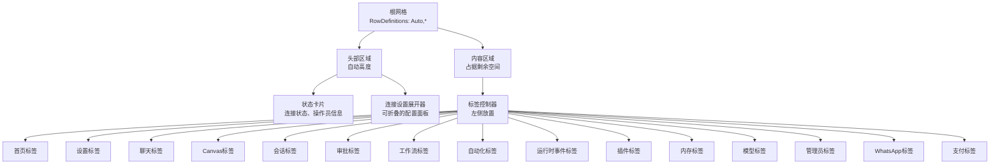

**图表来源**
- [MainWindow.axaml:17-66](file://src/OpenClaw.Companion/Views/MainWindow.axaml#L17-L66)
- [MainWindow.axaml:68-498](file://src/OpenClaw.Companion/Views/MainWindow.axaml#L68-L498)

### 样式系统架构

应用采用了统一的样式管理系统，通过 Avalonia 的样式系统实现主题化和自定义：

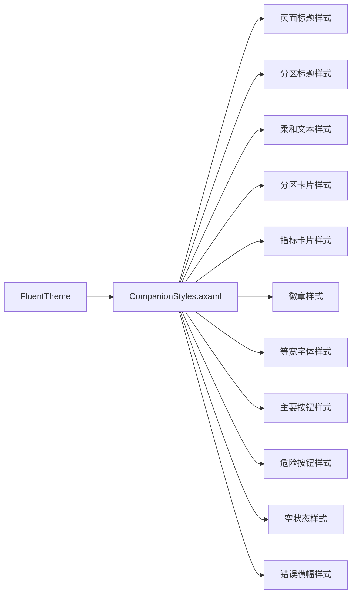

**图表来源**
- [CompanionStyles.axaml:1-73](file://src/OpenClaw.Companion/Styles/CompanionStyles.axaml#L1-L73)
- [App.axaml:17-21](file://src/OpenClaw.Companion/App.axaml#L17-L21)

**章节来源**
- [CompanionStyles.axaml:1-73](file://src/OpenClaw.Companion/Styles/CompanionStyles.axaml#L1-L73)
- [App.axaml:1-22](file://src/OpenClaw.Companion/App.axaml#L1-L22)

## 架构概览

### MVVM 设计模式实现

系统严格遵循 MVVM 模式，实现了清晰的关注点分离：

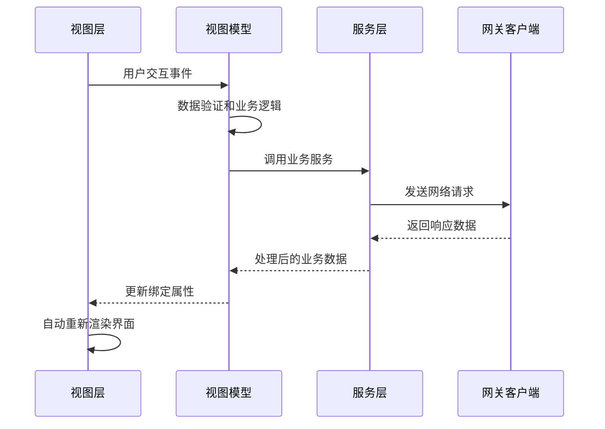

**图表来源**
- [MainWindowViewModel.cs:485-520](file://src/OpenClaw.Companion/ViewModels/MainWindowViewModel.cs#L485-L520)
- [MainWindowViewModel.ManagedGateway.cs:75-85](file://src/OpenClaw.Companion/ViewModels/MainWindowViewModel.ManagedGateway.cs#L75-L85)

### 数据绑定机制

系统实现了多层次的数据绑定，支持单向和双向绑定：

```mermaid
graph TB
subgraph "绑定类型"
OneWay[单向绑定<br/>{Binding Path}]
TwoWay[双向绑定<br/>{Binding Path, Mode=TwoWay}]
OneTime[一次性绑定<br/>{Binding Path, Mode=OneTime}]
OneWayToSource[单向到源绑定<br/>{Binding Path, Mode=OneWayToSource}]
end
subgraph "绑定场景"
TextBinding[文本绑定<br/>TextBlock, TextBox]
VisibilityBinding[可见性绑定<br/>IsVisible, IsEnabled]
CommandBinding[命令绑定<br/>Button.Command]
CollectionBinding[集合绑定<br/>ItemsControl.ItemsSource]
end
subgraph "转换器"
InverseBool[反布尔转换器<br/>InverseBooleanConverter]
CustomConverters[自定义转换器]
end
```

**图表来源**
- [MainWindow.axaml:36-46](file://src/OpenClaw.Companion/Views/MainWindow.axaml#L36-L46)
- [App.axaml:10](file://src/OpenClaw.Companion/App.axaml#L10)

**章节来源**
- [MainWindowViewModel.cs:13-115](file://src/OpenClaw.Companion/ViewModels/MainWindowViewModel.cs#L13-L115)
- [MainWindowViewModel.cs:485-689](file://src/OpenClaw.Companion/ViewModels/MainWindowViewModel.cs#L485-L689)

## 详细组件分析

### 主窗口类实现

MainWindow 类作为视图层的核心，负责窗口状态管理和用户交互：

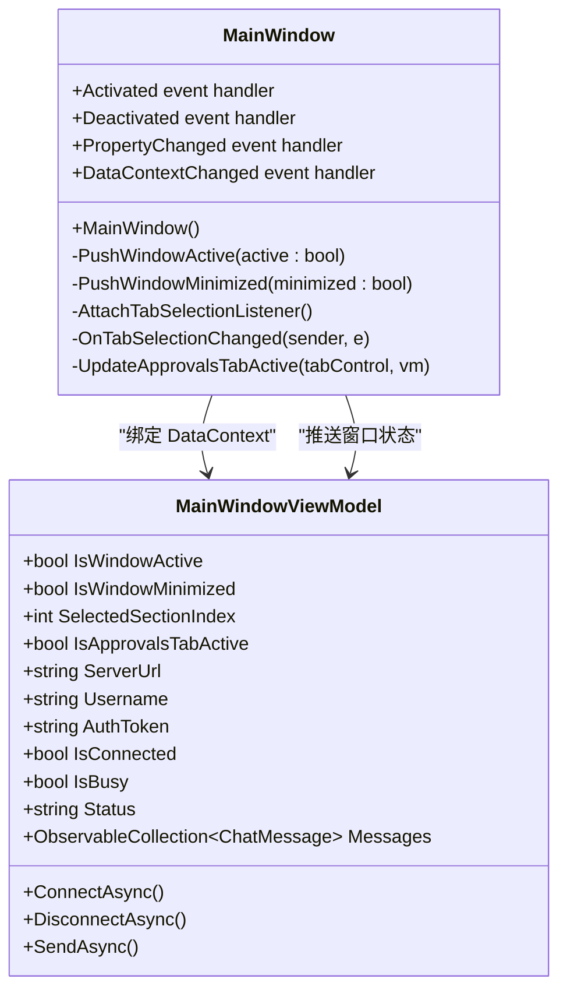

**图表来源**
- [MainWindow.axaml.cs:7-66](file://src/OpenClaw.Companion/Views/MainWindow.axaml.cs#L7-L66)
- [MainWindowViewModel.cs:13-115](file://src/OpenClaw.Companion/ViewModels/MainWindowViewModel.cs#L13-L115)

#### 窗口状态管理

MainWindow 实现了完整的窗口状态跟踪机制：

| 状态属性 | 描述 | 触发条件 |
|---------|------|----------|
| IsWindowActive | 窗口是否处于激活状态 | Activated/Deactivated 事件 |
| IsWindowMinimized | 窗口是否最小化 | WindowState 变更事件 |
| IsApprovalsTabActive | 审批标签页是否当前激活 | TabSelectionChanged 事件 |

**章节来源**
- [MainWindow.axaml.cs:30-65](file://src/OpenClaw.Companion/Views/MainWindow.axaml.cs#L30-L65)

### 视图模型层设计

MainWindowViewModel 作为核心业务逻辑容器，实现了复杂的命令处理和状态管理：

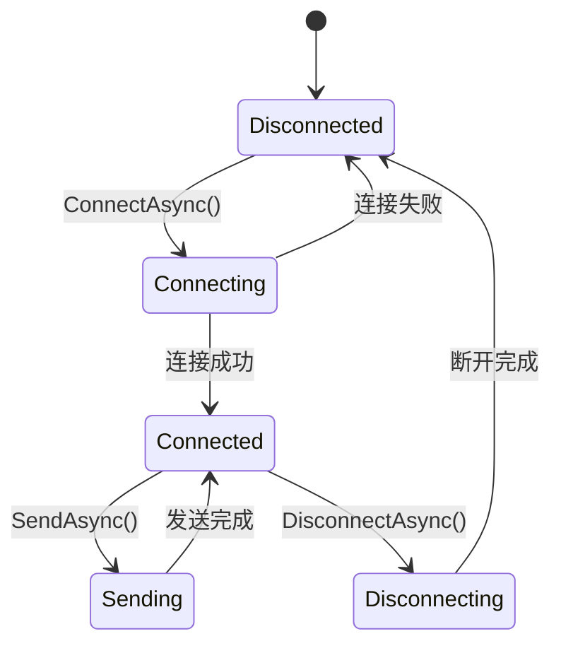

**图表来源**
- [MainWindowViewModel.cs:485-544](file://src/OpenClaw.Companion/ViewModels/MainWindowViewModel.cs#L485-L544)

#### 命令处理机制

系统采用 CommunityToolkit.Mvvm 的 RelayCommand 实现命令模式：

| 命令类别 | 命令方法 | 功能描述 | 参数 |
|---------|----------|----------|------|
| 连接管理 | ConnectAsync | 建立网关连接 | CancellationToken |
| 连接管理 | DisconnectAsync | 断开网关连接 | CancellationToken |
| 聊天功能 | SendAsync | 发送用户消息 | 无 |
| 管理功能 | IssueOperatorTokenAsync | 颁发操作员认证令牌 | 无 |
| 管理功能 | LoadAdminStatusAsync | 加载管理员状态 | 无 |
| Canvas功能 | ClearCanvas | 清空Canvas内容 | 无 |
| 会话管理 | LoadSessionsAsync | 加载会话列表 | 无 |
| 审批管理 | ApproveApprovalAsync | 批准审批请求 | PendingApprovalItem |
| 审批管理 | DenyApprovalAsync | 拒绝审批请求 | PendingApprovalItem |

**章节来源**
- [MainWindowViewModel.cs:485-689](file://src/OpenClaw.Companion/ViewModels/MainWindowViewModel.cs#L485-L689)

### Canvas 系统实现

Canvas 子系统是系统的核心创新之一，实现了 A2UI 协议的完整支持：

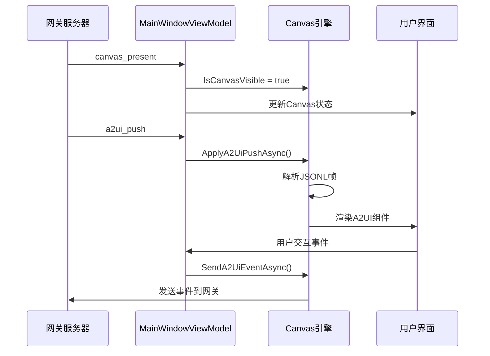

**图表来源**
- [MainWindowViewModel.Canvas.cs:86-158](file://src/OpenClaw.Companion/ViewModels/MainWindowViewModel.Canvas.cs#L86-L158)
- [MainWindowViewModel.Canvas.cs:410-443](file://src/OpenClaw.Companion/ViewModels/MainWindowViewModel.Canvas.cs#L410-L443)

#### Canvas 数据模型

Canvas 系统支持多种组件类型和数据模型：

| 组件类型 | 描述 | 属性 |
|---------|------|------|
| Button | 按钮组件 | Label, ActivateCommand |
| Input | 输入组件 | ValueText, CommitValueCommand |
| Options | 选项组件 | Options, IsSelected |
| Table | 表格组件 | Columns, Rows |
| Progress | 进度条组件 | ProgressValue |
| Image | 图像组件 | Url |
| Text | 文本组件 | Text, Body, DisplayText |

**章节来源**
- [MainWindowViewModel.Canvas.cs:286-350](file://src/OpenClaw.Companion/ViewModels/MainWindowViewModel.Canvas.cs#L286-L350)

### 审批管理系统

审批系统实现了智能轮询和通知机制：

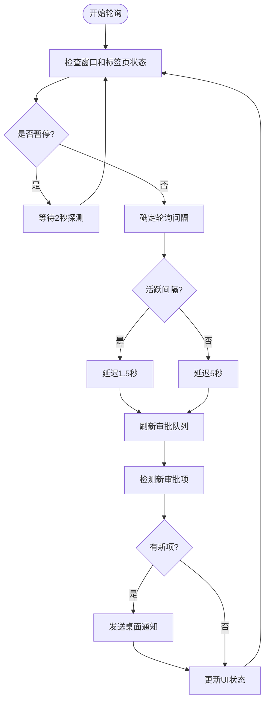

**图表来源**
- [MainWindowViewModel.Approvals.cs:148-197](file://src/OpenClaw.Companion/ViewModels/MainWindowViewModel.Approvals.cs#L148-L197)
- [MainWindowViewModel.Approvals.cs:221-291](file://src/OpenClaw.Companion/ViewModels/MainWindowViewModel.Approvals.cs#L221-L291)

#### 审批队列严重程度

系统根据待处理审批数量动态调整界面提示：

| 数量范围 | 严重程度 | 颜色 | 提示方式 |
|---------|----------|------|----------|
| 0 | 无 | 绿色 | 无徽章 |
| 1-2 | 轻微 | 黄色 | 小徽章 |
| 3+ | 严重 | 红色 | 大徽章闪烁 |

**章节来源**
- [MainWindowViewModel.Approvals.cs:78-87](file://src/OpenClaw.Companion/ViewModels/MainWindowViewModel.Approvals.cs#L78-L87)

### 本地网关管理

本地网关子系统提供了完整的本地运行时管理能力：

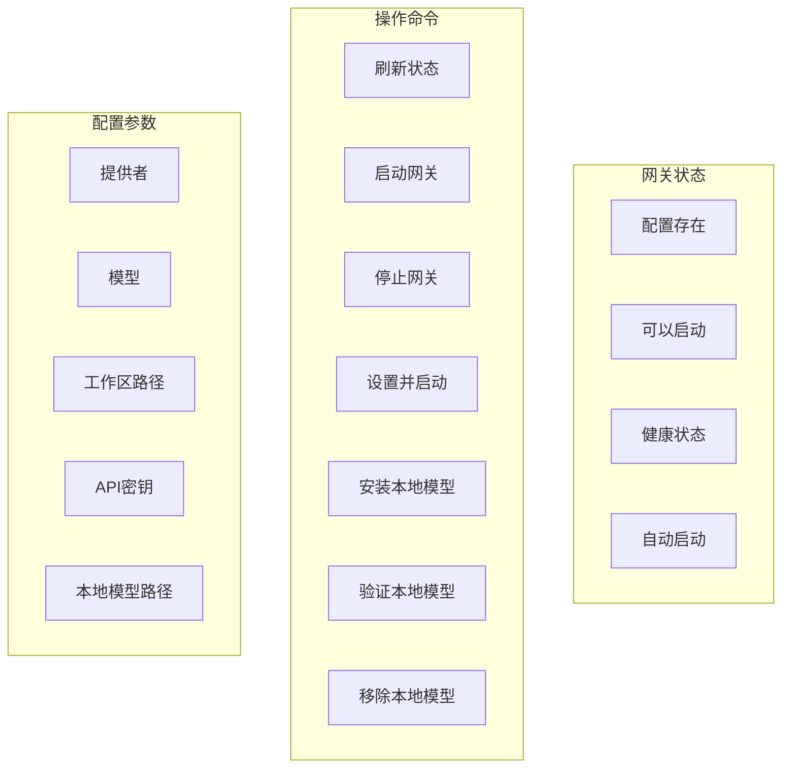

**图表来源**
- [MainWindowViewModel.ManagedGateway.cs:10-66](file://src/OpenClaw.Companion/ViewModels/MainWindowViewModel.ManagedGateway.cs#L10-L66)
- [MainWindowViewModel.ManagedGateway.cs:218-258](file://src/OpenClaw.Companion/ViewModels/MainWindowViewModel.ManagedGateway.cs#L218-L258)

**章节来源**
- [MainWindowViewModel.ManagedGateway.cs:68-329](file://src/OpenClaw.Companion/ViewModels/MainWindowViewModel.ManagedGateway.cs#L68-L329)

### WhatsApp 集成

WhatsApp 子系统实现了完整的通信渠道管理：

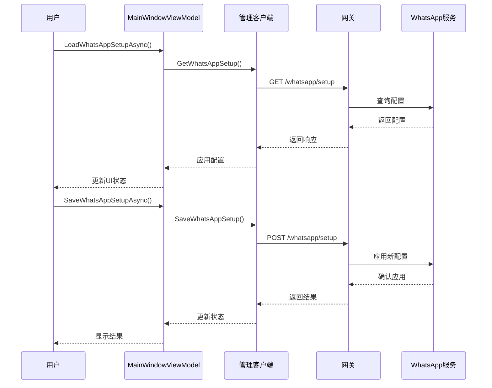

**图表来源**
- [MainWindowViewModel.WhatsApp.cs:127-194](file://src/OpenClaw.Companion/ViewModels/MainWindowViewModel.WhatsApp.cs#L127-L194)
- [MainWindowViewModel.WhatsApp.cs:233-273](file://src/OpenClaw.Companion/ViewModels/MainWindowViewModel.WhatsApp.cs#L233-L273)

**章节来源**
- [MainWindowViewModel.WhatsApp.cs:127-412](file://src/OpenClaw.Companion/ViewModels/MainWindowViewModel.WhatsApp.cs#L127-L412)

## 依赖关系分析

### 组件耦合度分析

系统在设计上实现了良好的内聚性和低耦合：

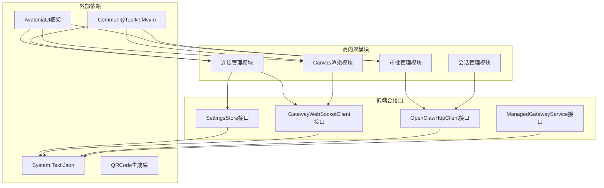

**图表来源**
- [MainWindowViewModel.cs:15-102](file://src/OpenClaw.Companion/ViewModels/MainWindowViewModel.cs#L15-L102)
- [MainWindowViewModel.WhatsApp.cs:17](file://src/OpenClaw.Companion/ViewModels/MainWindowViewModel.WhatsApp.cs#L17)

### 错误处理策略

系统实现了多层次的错误处理机制：

| 错误级别 | 处理策略 | 用户反馈 |
|---------|----------|----------|
| 连接错误 | 自动重连机制 | 系统消息提示 |
| 业务逻辑错误 | 具体错误描述 | 错误横幅显示 |
| 网络超时 | 重试机制 | 进度指示器 |
| 配置错误 | 默认值回退 | 设置警告 |
| 系统异常 | 日志记录 | 应用程序重启 |

**章节来源**
- [MainWindowViewModel.cs:440-448](file://src/OpenClaw.Companion/ViewModels/MainWindowViewModel.cs#L440-L448)
- [MainWindowViewModel.Approvals.cs:275-285](file://src/OpenClaw.Companion/ViewModels/MainWindowViewModel.Approvals.cs#L275-L285)

## 性能考虑

### 内存管理优化

系统采用了多项内存优化策略：

1. **集合替换机制**：使用 ReplaceItems 方法避免不必要的集合重建
2. **对象池模式**：复用 A2UI 组件对象减少 GC 压力
3. **延迟加载**：按需加载 Canvas 组件和会话数据
4. **弱引用**：对大型对象使用弱引用避免内存泄漏

### 异步处理优化

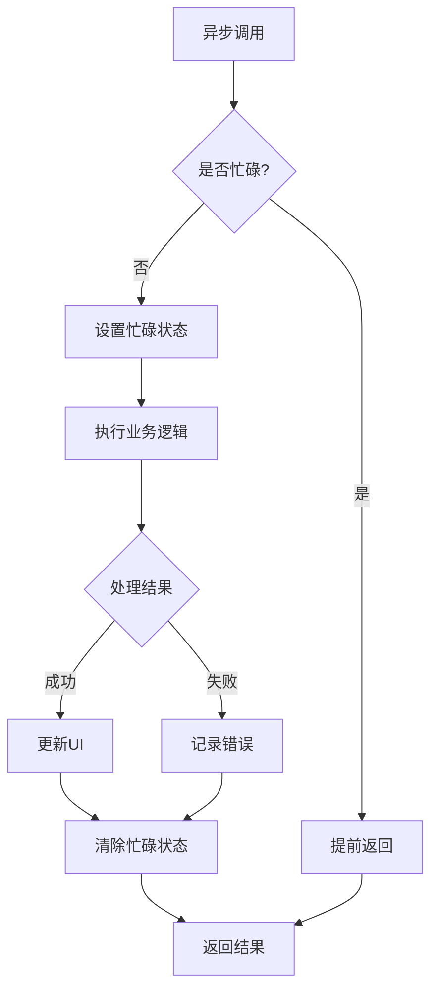

**图表来源**
- [MainWindowViewModel.Approvals.cs:120-124](file://src/OpenClaw.Companion/ViewModels/MainWindowViewModel.Approvals.cs#L120-L124)
- [MainWindowViewModel.Sessions.cs:72-76](file://src/OpenClaw.Companion/ViewModels/MainWindowViewModel.Sessions.cs#L72-L76)

### UI 响应性保证

系统通过以下机制确保 UI 响应性：

1. **Dispatcher 线程切换**：所有 UI 更新都在主线程执行
2. **后台任务隔离**：长时间运行的操作在后台线程执行
3. **进度指示器**：忙碌状态下的用户反馈
4. **取消令牌**：支持操作取消和中断

## 故障排除指南

### 常见问题诊断

| 问题症状 | 可能原因 | 解决方案 |
|---------|----------|----------|
| 无法连接网关 | 网络连接问题 | 检查服务器URL和防火墙设置 |
| Canvas不显示 | A2UI协议不兼容 | 更新到支持的A2UI版本 |
| 审批通知不工作 | 桌面通知权限 | 检查系统通知设置 |
| 本地网关启动失败 | 权限不足 | 以管理员身份运行或修复权限 |
| WhatsApp配置错误 | 凭据无效 | 验证API密钥和端点URL |

### 调试技巧

1. **启用调试模式**：设置 DebugMode 属性查看原始消息
2. **检查系统消息**：关注 Messages 集合中的系统消息
3. **监控网络流量**：使用浏览器开发者工具查看WebSocket通信
4. **日志分析**：查看应用程序日志文件定位问题

### 性能监控

系统提供了多种性能监控指标：

- **连接状态**：实时显示连接健康状况
- **Canvas渲染**：统计组件渲染时间和帧率
- **内存使用**：监控应用程序内存占用
- **网络延迟**：测量WebSocket往返时间

**章节来源**
- [MainWindowViewModel.cs:460-469](file://src/OpenClaw.Companion/ViewModels/MainWindowViewModel.cs#L460-L469)
- [MainWindowViewModel.Canvas.cs:476-530](file://src/OpenClaw.Companion/ViewModels/MainWindowViewModel.Canvas.cs#L476-L530)

## 结论

OpenClaw.NET Companion 的主窗口界面展现了现代桌面应用程序的最佳实践，通过精心设计的 MVVM 架构、完善的样式系统和强大的功能模块，为用户提供了丰富而直观的交互体验。

系统的主要优势包括：

1. **架构清晰**：MVVM 模式实现了良好的关注点分离
2. **扩展性强**：模块化设计便于功能扩展和维护
3. **用户体验优秀**：响应式设计和智能状态管理
4. **可靠性高**：完善的错误处理和恢复机制
5. **性能优异**：异步处理和内存优化策略

未来可以考虑的改进方向：
- 添加更多主题选项和自定义样式支持
- 实现窗口大小和位置的持久化存储
- 增强多实例支持和窗口管理
- 优化大数据集的虚拟化渲染
- 扩展插件系统和第三方集成能力