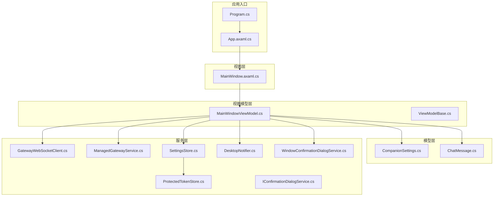
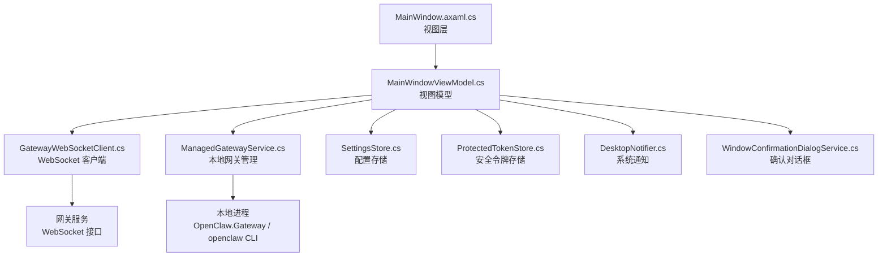
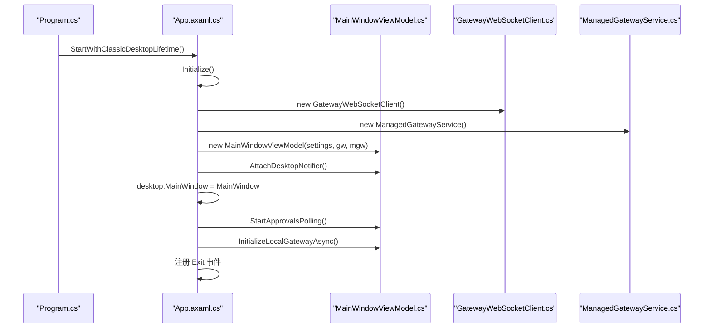
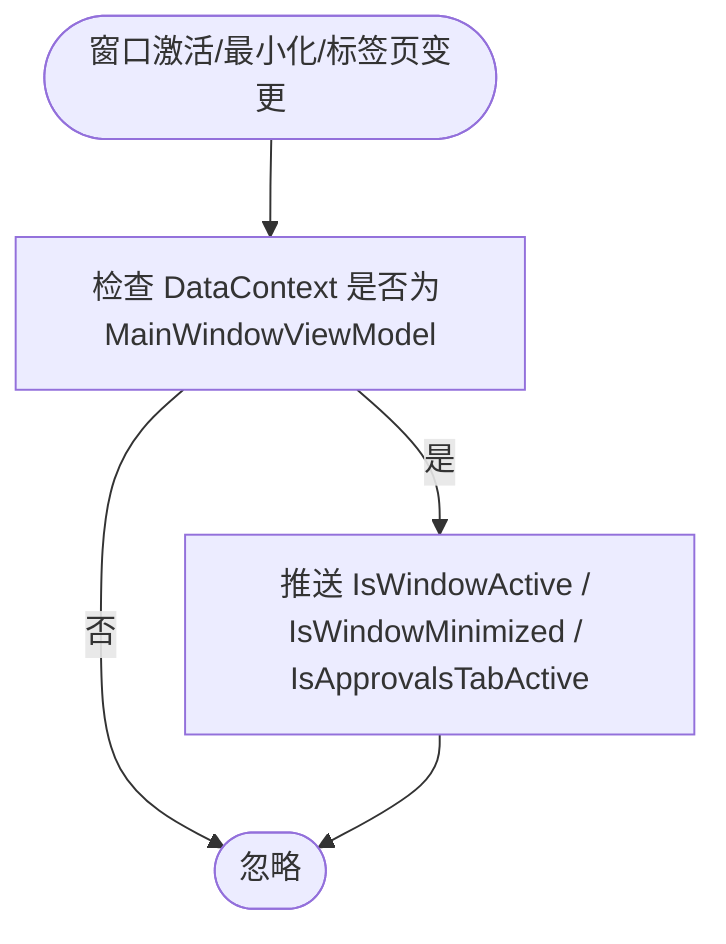
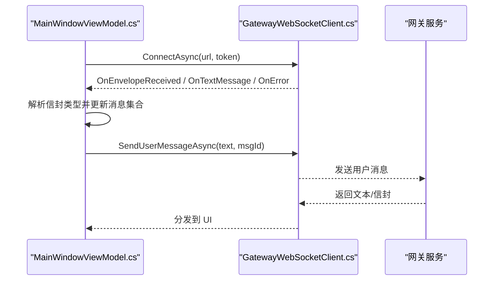
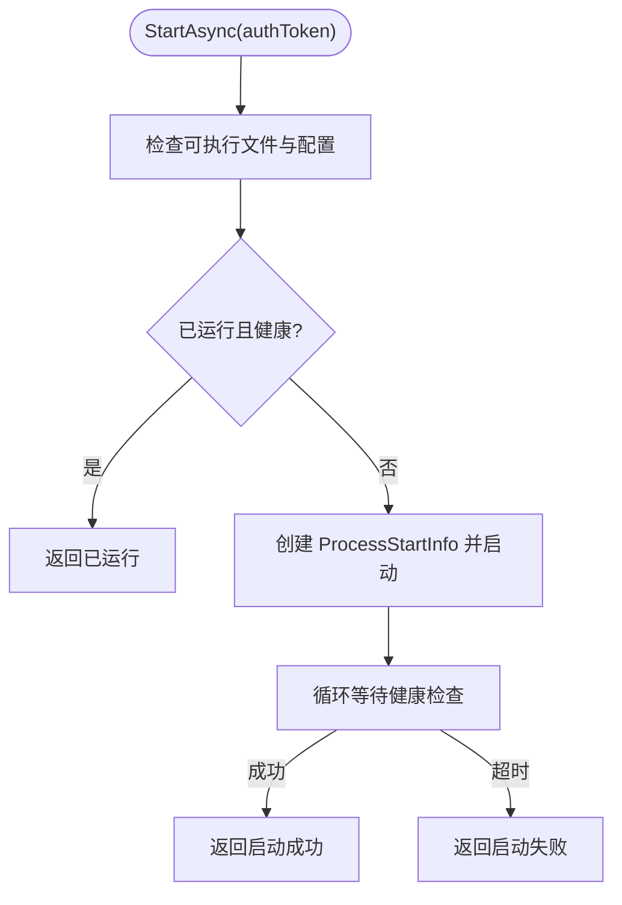
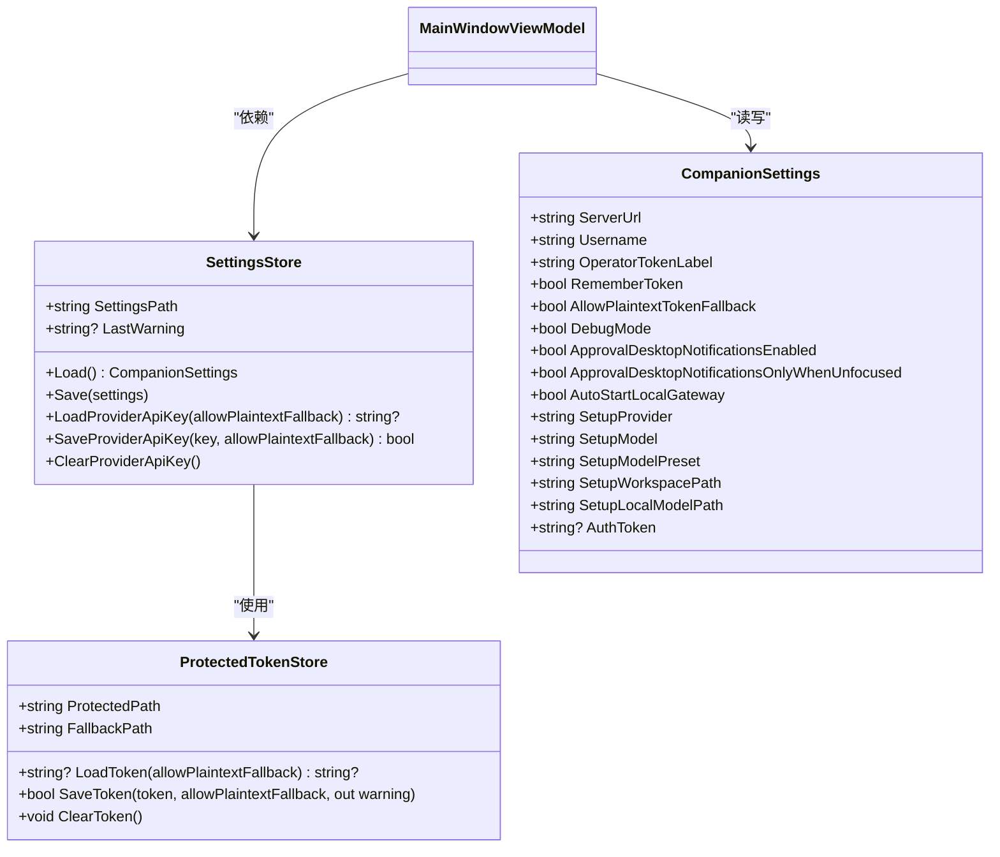
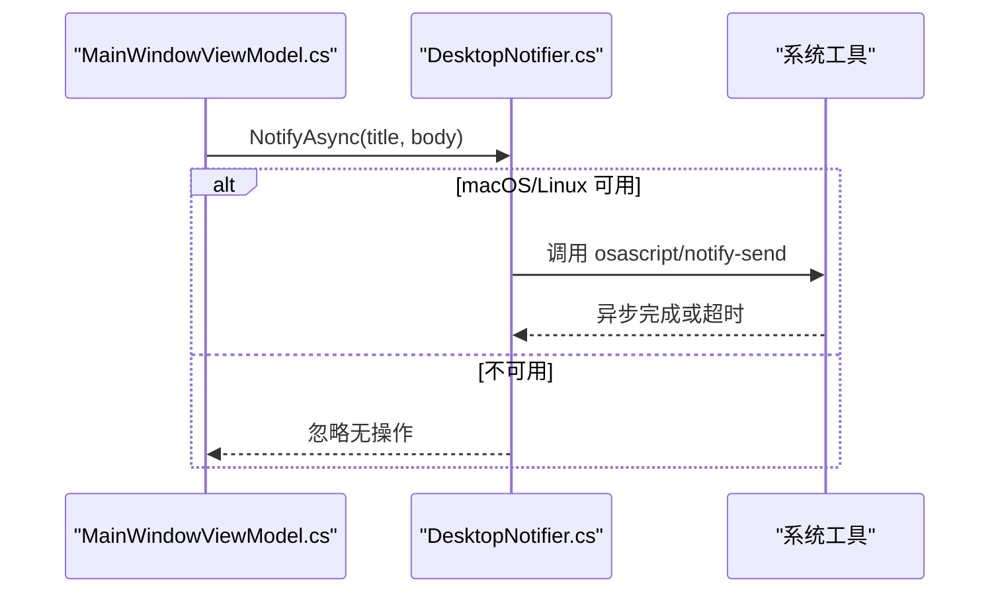
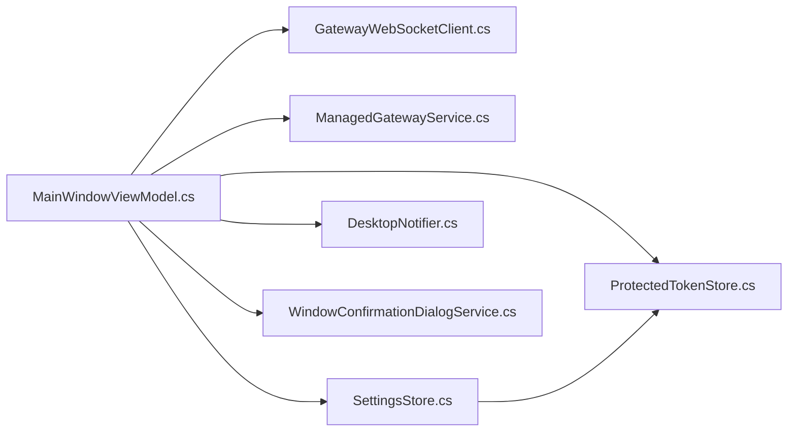

# 桌面应用

<cite>
**本文引用的文件**
- [App.axaml.cs](file://src/OpenClaw.Companion/App.axaml.cs)
- [Program.cs](file://src/OpenClaw.Companion/Program.cs)
- [MainWindow.axaml.cs](file://src/OpenClaw.Companion/Views/MainWindow.axaml.cs)
- [MainWindowViewModel.cs](file://src/OpenClaw.Companion/ViewModels/MainWindowViewModel.cs)
- [SettingsStore.cs](file://src/OpenClaw.Companion/Services/SettingsStore.cs)
- [GatewayWebSocketClient.cs](file://src/OpenClaw.Companion/Services/GatewayWebSocketClient.cs)
- [ManagedGatewayService.cs](file://src/OpenClaw.Companion/Services/ManagedGatewayService.cs)
- [DesktopNotifier.cs](file://src/OpenClaw.Companion/Services/DesktopNotifier.cs)
- [CompanionSettings.cs](file://src/OpenClaw.Companion/Models/CompanionSettings.cs)
- [ViewModelBase.cs](file://src/OpenClaw.Companion/ViewModels/ViewModelBase.cs)
- [ProtectedTokenStore.cs](file://src/OpenClaw.Companion/Services/ProtectedTokenStore.cs)
- [ChatMessage.cs](file://src/OpenClaw.Companion/Models/ChatMessage.cs)
- [IConfirmationDialogService.cs](file://src/OpenClaw.Companion/Services/IConfirmationDialogService.cs)
- [WindowConfirmationDialogService.cs](file://src/OpenClaw.Companion/Services/WindowConfirmationDialogService.cs)
</cite>

## 目录
1. [简介](#简介)
2. [项目结构](#项目结构)
3. [核心组件](#核心组件)
4. [架构总览](#架构总览)
5. [详细组件分析](#详细组件分析)
6. [依赖关系分析](#依赖关系分析)
7. [性能考虑](#性能考虑)
8. [故障排查指南](#故障排查指南)
9. [结论](#结论)
10. [附录](#附录)

## 简介
本文件面向桌面应用“Companion”的技术文档，聚焦于其基于 Avalonia UI 的实现、本地配置与安全令牌管理、与网关服务的通信机制、通知系统、跨平台支持与部署要点。文档同时提供开发指南、调试方法与性能优化建议，帮助开发者快速理解并扩展该应用。

## 项目结构
Companion 应用位于 src/OpenClaw.Companion 目录下，采用 MVVM 架构与 Avalonia UI，核心模块包括：
- 应用入口与生命周期：Program.cs、App.axaml.cs
- 视图层：MainWindow.axaml 及 MainWindow.axaml.cs
- 视图模型层：MainWindowViewModel.cs、ViewModelBase.cs
- 模型层：CompanionSettings.cs、ChatMessage.cs
- 服务层：GatewayWebSocketClient.cs、ManagedGatewayService.cs、SettingsStore.cs、DesktopNotifier.cs、ProtectedTokenStore.cs、IConfirmationDialogService.cs、WindowConfirmationDialogService.cs

**图表来源**
- [Program.cs:1-22](file://src/OpenClaw.Companion/Program.cs#L1-L22)
- [App.axaml.cs:1-78](file://src/OpenClaw.Companion/App.axaml.cs#L1-L78)
- [MainWindow.axaml.cs:1-66](file://src/OpenClaw.Companion/Views/MainWindow.axaml.cs#L1-L66)
- [MainWindowViewModel.cs:1-701](file://src/OpenClaw.Companion/ViewModels/MainWindowViewModel.cs#L1-L701)
- [SettingsStore.cs:1-204](file://src/OpenClaw.Companion/Services/SettingsStore.cs#L1-L204)
- [GatewayWebSocketClient.cs:1-49](file://src/OpenClaw.Companion/Services/GatewayWebSocketClient.cs#L1-L49)
- [ManagedGatewayService.cs:1-674](file://src/OpenClaw.Companion/Services/ManagedGatewayService.cs#L1-L674)
- [DesktopNotifier.cs:1-176](file://src/OpenClaw.Companion/Services/DesktopNotifier.cs#L1-L176)
- [CompanionSettings.cs:1-25](file://src/OpenClaw.Companion/Models/CompanionSettings.cs#L1-L25)
- [ViewModelBase.cs:1-8](file://src/OpenClaw.Companion/ViewModels/ViewModelBase.cs#L1-L8)
- [ProtectedTokenStore.cs:1-587](file://src/OpenClaw.Companion/Services/ProtectedTokenStore.cs#L1-L587)
- [ChatMessage.cs:1-41](file://src/OpenClaw.Companion/Models/ChatMessage.cs#L1-L41)
- [IConfirmationDialogService.cs:1-13](file://src/OpenClaw.Companion/Services/IConfirmationDialogService.cs#L1-L13)
- [WindowConfirmationDialogService.cs:1-108](file://src/OpenClaw.Companion/Services/WindowConfirmationDialogService.cs#L1-L108)

**章节来源**
- [Program.cs:1-22](file://src/OpenClaw.Companion/Program.cs#L1-L22)
- [App.axaml.cs:1-78](file://src/OpenClaw.Companion/App.axaml.cs#L1-L78)
- [MainWindow.axaml.cs:1-66](file://src/OpenClaw.Companion/Views/MainWindow.axaml.cs#L1-L66)
- [MainWindowViewModel.cs:1-701](file://src/OpenClaw.Companion/ViewModels/MainWindowViewModel.cs#L1-L701)

## 核心组件
- 应用入口与平台检测：Program.cs 使用 Avalonia 的 BuildAvaloniaApp 并通过 PlatformDetect 自动适配平台字体与日志；App.axaml.cs 初始化 Avalonia 资源加载、禁用重复数据验证插件，并在桌面生命周期中创建视图模型、通知器与网关客户端。
- 主窗口与交互：MainWindow.axaml.cs 监听窗口激活/最小化状态与标签页切换，向视图模型推送状态以驱动 UI 行为。
- 视图模型：MainWindowViewModel.cs 负责设置加载/保存、连接/断开、消息收发、工具调用反馈、管理员状态查询、WhatsApp 设置加载、审批轮询等；内部封装 GatewayWebSocketClient 与 ManagedGatewayService。
- 配置与令牌：SettingsStore.cs 负责 settings.json 的读写与警告聚合；ProtectedTokenStore.cs 提供跨平台安全令牌存储（macOS Keychain、Windows DPAPI、Linux Secret-tool 或明文回退）。
- 通知系统：DesktopNotifier.cs 基于平台工具（osascript/notify-send）异步发送系统通知，带超时与资源清理。
- 对话确认：WindowConfirmationDialogService.cs 在 Avalonia 窗口上弹出确认对话框，支持取消令牌与 UI 线程安全。

**章节来源**
- [Program.cs:1-22](file://src/OpenClaw.Companion/Program.cs#L1-L22)
- [App.axaml.cs:18-77](file://src/OpenClaw.Companion/App.axaml.cs#L18-L77)
- [MainWindow.axaml.cs:30-65](file://src/OpenClaw.Companion/Views/MainWindow.axaml.cs#L30-L65)
- [MainWindowViewModel.cs:88-115](file://src/OpenClaw.Companion/ViewModels/MainWindowViewModel.cs#L88-L115)
- [SettingsStore.cs:37-118](file://src/OpenClaw.Companion/Services/SettingsStore.cs#L37-L118)
- [ProtectedTokenStore.cs:45-113](file://src/OpenClaw.Companion/Services/ProtectedTokenStore.cs#L45-L113)
- [DesktopNotifier.cs:41-52](file://src/OpenClaw.Companion/Services/DesktopNotifier.cs#L41-L52)
- [WindowConfirmationDialogService.cs:9-106](file://src/OpenClaw.Companion/Services/WindowConfirmationDialogService.cs#L9-L106)

## 架构总览
Companion 采用 MVVM + 服务分层：
- 视图层仅负责状态绑定与事件转发；
- 视图模型协调业务逻辑、UI 状态与服务交互；
- 服务层封装网络、进程、配置与安全细节；
- 客户端与网关通过 WebSocket 通信，支持文本消息与信封协议。

**图表来源**
- [MainWindowViewModel.cs:104-111](file://src/OpenClaw.Companion/ViewModels/MainWindowViewModel.cs#L104-L111)
- [GatewayWebSocketClient.cs:24-34](file://src/OpenClaw.Companion/Services/GatewayWebSocketClient.cs#L24-L34)
- [ManagedGatewayService.cs:161-202](file://src/OpenClaw.Companion/Services/ManagedGatewayService.cs#L161-L202)
- [SettingsStore.cs:79-118](file://src/OpenClaw.Companion/Services/SettingsStore.cs#L79-L118)
- [ProtectedTokenStore.cs:78-106](file://src/OpenClaw.Companion/Services/ProtectedTokenStore.cs#L78-L106)
- [DesktopNotifier.cs:41-52](file://src/OpenClaw.Companion/Services/DesktopNotifier.cs#L41-L52)
- [WindowConfirmationDialogService.cs:9-106](file://src/OpenClaw.Companion/Services/WindowConfirmationDialogService.cs#L9-L106)

## 详细组件分析

### 应用入口与生命周期
- 入口程序通过 BuildAvaloniaApp 启用平台检测与字体加载，并以经典桌面生命周期启动。
- 应用初始化阶段禁用 Avalonia 数据注解验证插件，避免与 CommunityToolkit 重复校验。
- 创建 GatewayWebSocketClient、ManagedGatewayService、SettingsStore，构建 MainWindowViewModel 并注入通知器与确认对话框服务。
- 注册退出事件，确保释放 WebSocket 与本地网关资源。

**图表来源**
- [Program.cs:11-21](file://src/OpenClaw.Companion/Program.cs#L11-L21)
- [App.axaml.cs:23-62](file://src/OpenClaw.Companion/App.axaml.cs#L23-L62)
- [MainWindowViewModel.cs:88-115](file://src/OpenClaw.Companion/ViewModels/MainWindowViewModel.cs#L88-L115)
- [GatewayWebSocketClient.cs:9-15](file://src/OpenClaw.Companion/Services/GatewayWebSocketClient.cs#L9-L15)
- [ManagedGatewayService.cs:16-36](file://src/OpenClaw.Companion/Services/ManagedGatewayService.cs#L16-L36)

**章节来源**
- [Program.cs:11-21](file://src/OpenClaw.Companion/Program.cs#L11-L21)
- [App.axaml.cs:23-62](file://src/OpenClaw.Companion/App.axaml.cs#L23-L62)

### 主窗口与状态同步
- 监听窗口激活/失活与最小化状态，向视图模型推送，用于控制后台行为（如审批通知策略）。
- 监听标签页选择变化，识别“审批”标签是否当前激活，以便在合适时机触发审批轮询或 UI 更新。

**图表来源**
- [MainWindow.axaml.cs:30-64](file://src/OpenClaw.Companion/Views/MainWindow.axaml.cs#L30-L64)

**章节来源**
- [MainWindow.axaml.cs:30-64](file://src/OpenClaw.Companion/Views/MainWindow.axaml.cs#L30-L64)

### 视图模型：设置管理、连接与消息处理
- 设置加载/保存：从 SettingsStore 读取配置，支持环境变量覆盖；保存时区分明文令牌回退策略。
- 连接/断开：校验 URL，发起 WebSocket 连接，设置连接状态与消息；断开时清理状态。
- 消息处理：解析入站信封类型，分别处理打字开始/停止、助手片段/完整消息、错误、工具调用与审批提示等；支持调试模式直通显示原始文本。
- 管理员状态：通过 Admin 客户端查询认证会话与部署状态，动态更新 UI 展示。
- 发送消息：生成消息 ID，调用 WebSocket 客户端发送用户消息。

**图表来源**
- [MainWindowViewModel.cs:198-265](file://src/OpenClaw.Companion/ViewModels/MainWindowViewModel.cs#L198-L265)
- [GatewayWebSocketClient.cs:24-34](file://src/OpenClaw.Companion/Services/GatewayWebSocketClient.cs#L24-L34)

**章节来源**
- [MainWindowViewModel.cs:117-172](file://src/OpenClaw.Companion/ViewModels/MainWindowViewModel.cs#L117-L172)
- [MainWindowViewModel.cs:486-520](file://src/OpenClaw.Companion/ViewModels/MainWindowViewModel.cs#L486-L520)
- [MainWindowViewModel.cs:662-689](file://src/OpenClaw.Companion/ViewModels/MainWindowViewModel.cs#L662-L689)
- [MainWindowViewModel.cs:198-265](file://src/OpenClaw.Companion/ViewModels/MainWindowViewModel.cs#L198-L265)

### 本地网关管理与启动流程
- 可执行文件解析：优先在资源目录查找 gateway 与 openclaw CLI，否则回退到 dotnet run 指向对应项目。
- 启动：根据配置文件与工作空间路径启动网关进程，注入模型提供商密钥环境变量；等待健康检查成功。
- 停止：终止进程树并等待退出，异常情况记录并清理。
- 命令：提供本地模型安装/卸载等子命令执行能力。

**图表来源**
- [ManagedGatewayService.cs:161-202](file://src/OpenClaw.Companion/Services/ManagedGatewayService.cs#L161-L202)
- [ManagedGatewayService.cs:314-328](file://src/OpenClaw.Companion/Services/ManagedGatewayService.cs#L314-L328)

**章节来源**
- [ManagedGatewayService.cs:16-36](file://src/OpenClaw.Companion/Services/ManagedGatewayService.cs#L16-L36)
- [ManagedGatewayService.cs:238-264](file://src/OpenClaw.Companion/Services/ManagedGatewayService.cs#L238-L264)
- [ManagedGatewayService.cs:330-387](file://src/OpenClaw.Companion/Services/ManagedGatewayService.cs#L330-L387)

### 本地配置存储与安全令牌管理
- 配置文件：settings.json 存放通用设置；令牌单独由 ProtectedTokenStore 管理，优先使用平台安全存储（macOS Keychain、Windows DPAPI、Linux Secret-tool），否则回退到明文文件。
- 提供商密钥：独立的 provider-key 目录与标记文件，支持明文回退策略。
- 加载策略：SettingsStore 读取配置后，尝试从安全存储加载令牌；若允许明文回退且存在明文文件则使用；最后汇总 LastWarning 用于 UI 提示。

**图表来源**
- [SettingsStore.cs:37-146](file://src/OpenClaw.Companion/Services/SettingsStore.cs#L37-L146)
- [ProtectedTokenStore.cs:45-113](file://src/OpenClaw.Companion/Services/ProtectedTokenStore.cs#L45-L113)
- [CompanionSettings.cs:5-24](file://src/OpenClaw.Companion/Models/CompanionSettings.cs#L5-L24)
- [MainWindowViewModel.cs:117-172](file://src/OpenClaw.Companion/ViewModels/MainWindowViewModel.cs#L117-L172)

**章节来源**
- [SettingsStore.cs:37-146](file://src/OpenClaw.Companion/Services/SettingsStore.cs#L37-L146)
- [ProtectedTokenStore.cs:45-113](file://src/OpenClaw.Companion/Services/ProtectedTokenStore.cs#L45-L113)
- [CompanionSettings.cs:5-24](file://src/OpenClaw.Companion/Models/CompanionSettings.cs#L5-L24)

### 通知系统与对话确认
- 系统通知：DesktopNotifier 根据平台选择 osascript（macOS）或 notify-send（Linux）异步发送通知，带超时与输出清理；Windows 当前不支持。
- 确认对话框：WindowConfirmationDialogService 在 Avalonia 窗口上弹出确认对话框，支持取消令牌与 UI 线程安全关闭。

**图表来源**
- [DesktopNotifier.cs:41-52](file://src/OpenClaw.Companion/Services/DesktopNotifier.cs#L41-L52)
- [MainWindowViewModel.cs:40-41](file://src/OpenClaw.Companion/ViewModels/MainWindowViewModel.cs#L40-L41)

**章节来源**
- [DesktopNotifier.cs:41-52](file://src/OpenClaw.Companion/Services/DesktopNotifier.cs#L41-L52)
- [WindowConfirmationDialogService.cs:9-106](file://src/OpenClaw.Companion/Services/WindowConfirmationDialogService.cs#L9-L106)

## 依赖关系分析
- 组件耦合：视图模型对服务层有直接依赖，但通过接口抽象（如 IConfirmationDialogService）降低耦合度。
- 外部依赖：Avalonia UI、CommunityToolkit.Mvvm、System.Net.WebSockets、进程执行与平台工具（osascript/notify-send/secret-tool/dpapi）。
- 潜在风险：WebSocket 与本地进程的异常需在 UI 线程外处理并回传 UI，避免阻塞；令牌存储失败应降级为明文回退并提示。

**图表来源**
- [MainWindowViewModel.cs:104-111](file://src/OpenClaw.Companion/ViewModels/MainWindowViewModel.cs#L104-L111)
- [SettingsStore.cs:13-35](file://src/OpenClaw.Companion/Services/SettingsStore.cs#L13-L35)
- [ProtectedTokenStore.cs:24-43](file://src/OpenClaw.Companion/Services/ProtectedTokenStore.cs#L24-L43)
- [GatewayWebSocketClient.cs:7-15](file://src/OpenClaw.Companion/Services/GatewayWebSocketClient.cs#L7-L15)
- [ManagedGatewayService.cs:8-36](file://src/OpenClaw.Companion/Services/ManagedGatewayService.cs#L8-L36)
- [DesktopNotifier.cs:15-27](file://src/OpenClaw.Companion/Services/DesktopNotifier.cs#L15-L27)
- [WindowConfirmationDialogService.cs:7-14](file://src/OpenClaw.Companion/Services/WindowConfirmationDialogService.cs#L7-L14)

**章节来源**
- [MainWindowViewModel.cs:104-111](file://src/OpenClaw.Companion/ViewModels/MainWindowViewModel.cs#L104-L111)
- [SettingsStore.cs:13-35](file://src/OpenClaw.Companion/Services/SettingsStore.cs#L13-L35)
- [ProtectedTokenStore.cs:24-43](file://src/OpenClaw.Companion/Services/ProtectedTokenStore.cs#L24-L43)

## 性能考虑
- UI 线程调度：所有 UI 更新通过 Dispatcher.UIThread.Post 执行，避免跨线程访问 UI 导致异常。
- WebSocket 流水线：按消息类型分流处理，避免在 UI 线程进行重计算；调试模式下直接显示文本减少解析开销。
- 进程与网络超时：本地网关启动与命令执行设置超时，防止卡死；健康检查采用短超时轮询。
- 通知异步化：系统通知异步执行并限制超时，避免阻塞主线程。
- 配置写入原子性：临时文件写入后移动替换，降低损坏风险。

[本节为通用指导，无需特定文件来源]

## 故障排查指南
- 连接失败：检查 ServerUrl 是否为有效 WebSocket 地址；查看 OnError 回调中的错误信息；确认令牌是否正确加载。
- 本地网关无法启动：确认配置文件存在且可读；检查可执行文件解析结果；查看健康检查失败原因；必要时手动运行 CLI 进行诊断。
- 令牌加载问题：若安全存储不可用，系统会回退到明文存储；检查 AllowPlaintextTokenFallback 设置；查看 LastWarning 获取具体提示。
- 通知无效：确认平台工具是否存在（macOS 的 osascript、Linux 的 notify-send）；Windows 当前不支持。
- 确认对话框无响应：检查取消令牌与 UI 线程关闭逻辑；确保窗口可见时才进行交互。

**章节来源**
- [MainWindowViewModel.cs:500-520](file://src/OpenClaw.Companion/ViewModels/MainWindowViewModel.cs#L500-L520)
- [ManagedGatewayService.cs:238-264](file://src/OpenClaw.Companion/Services/ManagedGatewayService.cs#L238-L264)
- [SettingsStore.cs:45-76](file://src/OpenClaw.Companion/Services/SettingsStore.cs#L45-L76)
- [DesktopNotifier.cs:41-52](file://src/OpenClaw.Companion/Services/DesktopNotifier.cs#L41-L52)
- [WindowConfirmationDialogService.cs:74-106](file://src/OpenClaw.Companion/Services/WindowConfirmationDialogService.cs#L74-L106)

## 结论
Companion 应用通过清晰的 MVVM 分层与服务抽象，实现了与网关服务的稳定通信、本地网关的自举管理、跨平台的安全令牌存储与系统通知。其设计兼顾易用性与安全性，适合在多平台上部署与扩展。后续可在自动化测试、错误恢复与性能监控方面进一步完善。

[本节为总结，无需特定文件来源]

## 附录
- 开发指南
  - 使用 Avalonia Designer 与 XAML 编辑器进行界面开发，保持 ViewModel 与视图解耦。
  - 新增设置项时，同步更新 CompanionSettings 与 SettingsStore 的读写逻辑。
  - 新增网关命令时，复用 ManagedGatewayService 的命令执行框架。
- 调试方法
  - 启用 DebugMode 查看原始消息；通过 LastWarning 获取配置加载警告。
  - 使用环境变量 OPENCLAW_BASE_URL 与 OPENCLAW_AUTH_TOKEN 快速覆盖默认值。
- 跨平台部署
  - macOS：依赖 Keychain；Linux：依赖 libsecret/secret-tool；Windows：依赖 DPAPI。
  - 打包时确保 Resources 目录包含 gateway 与 openclaw CLI 可执行文件，或在运行时通过 dotnet run 启动。

[本节为通用指导，无需特定文件来源]