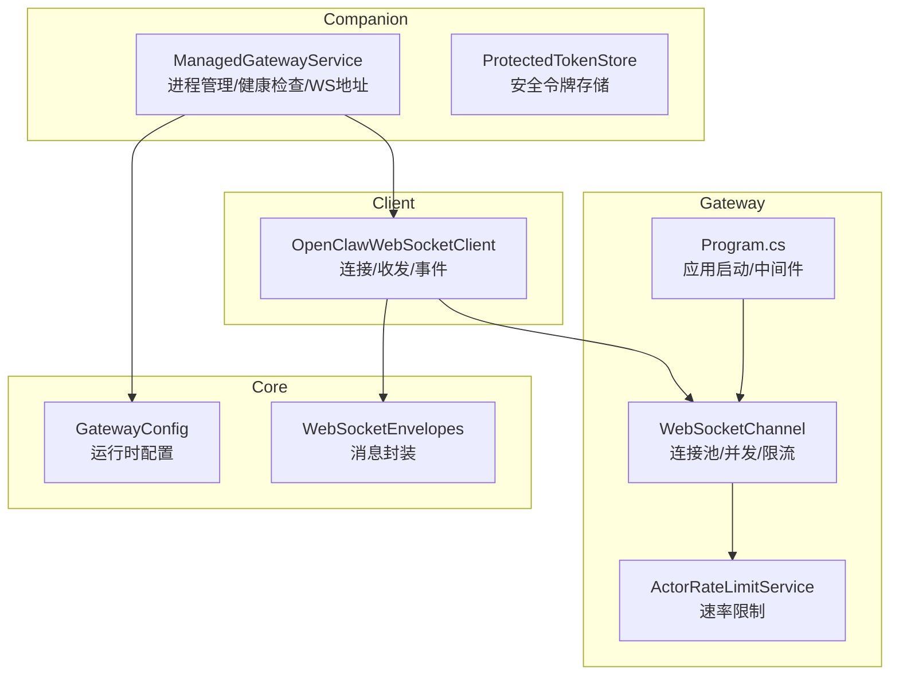
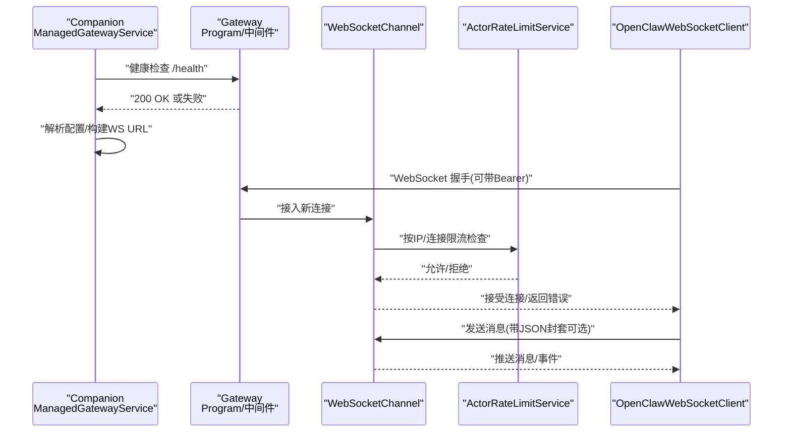
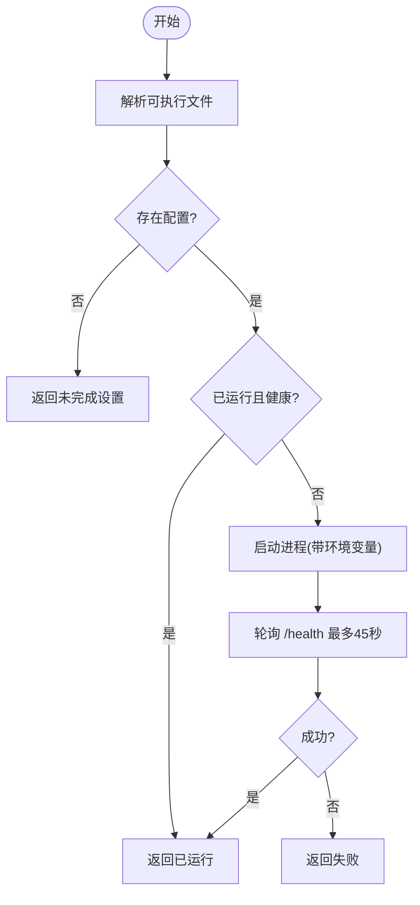
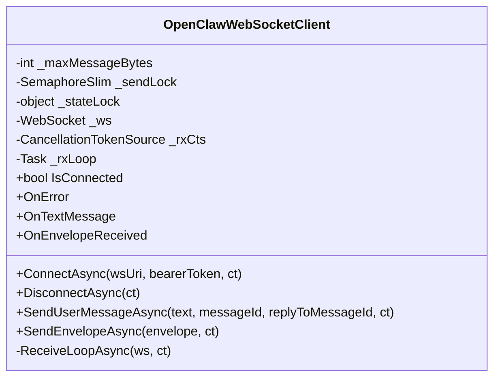
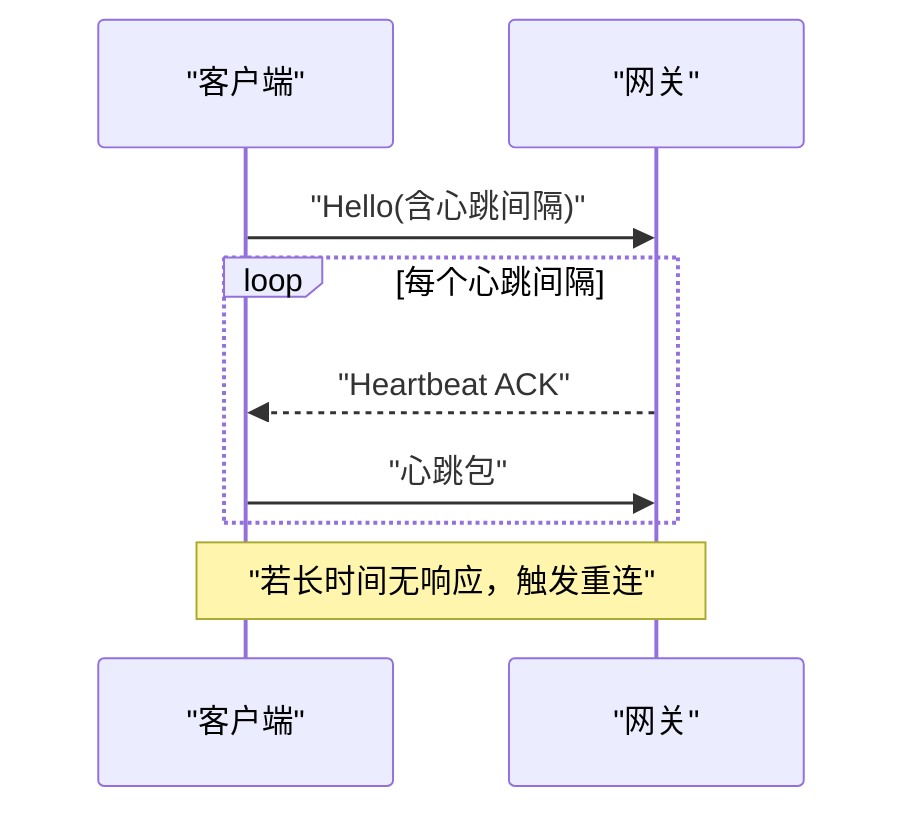
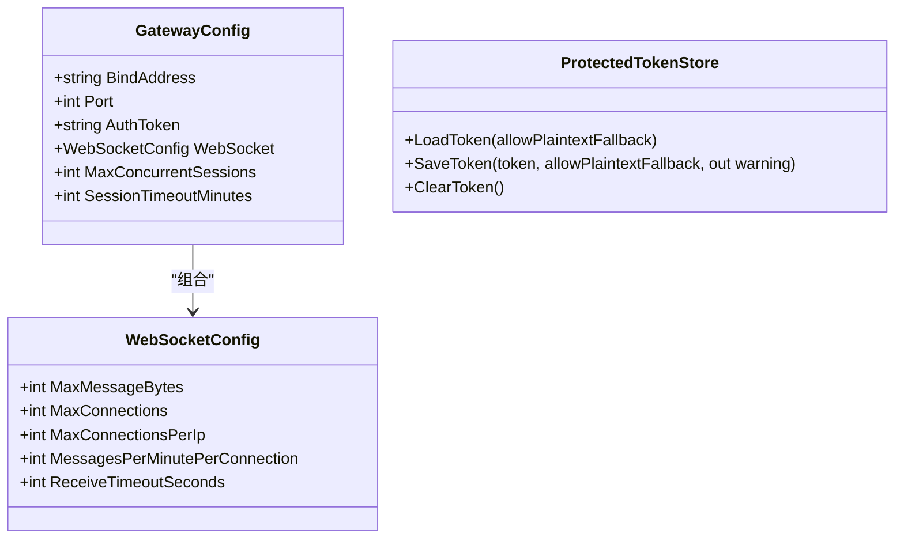
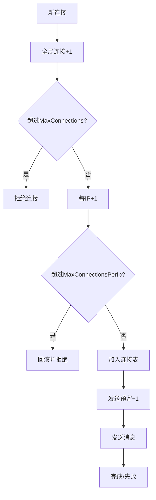
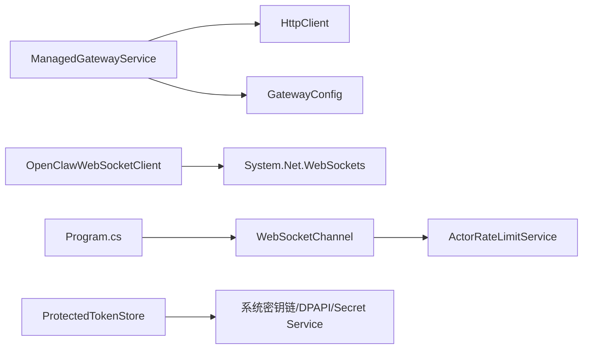

# 网关连接服务

<cite>
**本文档引用的文件**
- [ManagedGatewayService.cs](file://src/OpenClaw.Companion/Services/ManagedGatewayService.cs)
- [OpenClawWebSocketClient.cs](file://src/OpenClaw.Client/OpenClawWebSocketClient.cs)
- [GatewayConfig.cs](file://src/OpenClaw.Core/Models/GatewayConfig.cs)
- [WebSocketEnvelopes.cs](file://src/OpenClaw.Core/Models/WebSocketEnvelopes.cs)
- [ProtectedTokenStore.cs](file://src/OpenClaw.Companion/Services/ProtectedTokenStore.cs)
- [Program.cs](file://src/OpenClaw.Gateway/Program.cs)
- [WebSocketChannel.cs](file://src/OpenClaw.Channels/WebSocketChannel.cs)
- [DiscordChannel.cs](file://src/OpenClaw.Channels/DiscordChannel.cs)
- [WeComChannel.cs](file://src/OpenClaw.Channels/WeComChannel.cs)
- [ManagedGatewayServiceTests.cs](file://src/OpenClaw.Tests/ManagedGatewayServiceTests.cs)
- [SessionManager.cs](file://src/OpenClaw.Core/Sessions/SessionManager.cs)
- [ActorRateLimitService.cs](file://src/OpenClaw.Gateway/ActorRateLimitService.cs)
</cite>

## 目录
1. [简介](#简介)
2. [项目结构](#项目结构)
3. [核心组件](#核心组件)
4. [架构总览](#架构总览)
5. [详细组件分析](#详细组件分析)
6. [依赖关系分析](#依赖关系分析)
7. [性能考量](#性能考量)
8. [故障排除指南](#故障排除指南)
9. [结论](#结论)
10. [附录](#附录)

## 简介
本文件面向“网关连接服务”的技术文档，聚焦于 ManagedGatewayService 的设计与实现、网关生命周期管理、连接状态监控、WebSocket 客户端实现、连接建立、心跳检测与断线重连机制、配置管理与凭据存储、安全连接建立流程、实时消息处理与事件订阅、状态同步、连接池与并发控制、错误恢复策略，并提供配置选项、性能调优与故障排除建议。

## 项目结构
围绕网关连接服务的关键模块包括：
- 启动与生命周期管理：Companion 中的 ManagedGatewayService（负责本地网关进程启动、健康检查、配置解析、WebSocket 地址构建）
- 客户端连接：OpenClaw.Client 中的 OpenClawWebSocketClient（负责 WebSocket 连接、收发消息、事件分发）
- 网关侧通道与限流：Channels 中的 WebSocketChannel（连接池、并发控制、速率限制）、ActorRateLimitService（全局速率限制）
- 配置模型：Core.Models 中的 GatewayConfig（运行时配置、WebSocket 参数、会话与内存配置等）
- 凭据与令牌：Companion 中的 ProtectedTokenStore（跨平台安全存储）
- 网关入口：Gateway.Program（ASP.NET Core 应用启动、中间件与端点注册）

图表来源
- [ManagedGatewayService.cs:1-674](file://src/OpenClaw.Companion/Services/ManagedGatewayService.cs#L1-L674)
- [OpenClawWebSocketClient.cs:1-248](file://src/OpenClaw.Client/OpenClawWebSocketClient.cs#L1-L248)
- [Program.cs:1-124](file://src/OpenClaw.Gateway/Program.cs#L1-L124)
- [WebSocketChannel.cs:313-394](file://src/OpenClaw.Channels/WebSocketChannel.cs#L313-L394)
- [ActorRateLimitService.cs:165-199](file://src/OpenClaw.Gateway/ActorRateLimitService.cs#L165-L199)
- [GatewayConfig.cs:1-800](file://src/OpenClaw.Core/Models/GatewayConfig.cs#L1-L800)
- [WebSocketEnvelopes.cs:1-109](file://src/OpenClaw.Core/Models/WebSocketEnvelopes.cs#L1-L109)

章节来源
- [ManagedGatewayService.cs:1-674](file://src/OpenClaw.Companion/Services/ManagedGatewayService.cs#L1-L674)
- [OpenClawWebSocketClient.cs:1-248](file://src/OpenClaw.Client/OpenClawWebSocketClient.cs#L1-L248)
- [Program.cs:1-124](file://src/OpenClaw.Gateway/Program.cs#L1-L124)
- [GatewayConfig.cs:1-800](file://src/OpenClaw.Core/Models/GatewayConfig.cs#L1-L800)
- [WebSocketEnvelopes.cs:1-109](file://src/OpenClaw.Core/Models/WebSocketEnvelopes.cs#L1-L109)

## 核心组件
- ManagedGatewayService：负责网关进程的发现、启动、停止、健康检查、配置读取与 WebSocket URL 构建；支持通过环境变量注入提供商 API Key；提供安装/卸载本地模型命令。
- OpenClawWebSocketClient：轻量级 WebSocket 客户端，支持授权头、消息大小限制、并发发送锁、事件回调、错误处理与优雅断开。
- WebSocketChannel：网关侧 WebSocket 通道，维护连接池、按 IP 的连接数限制、每连接每分钟速率限制、消息大小限制、连接生命周期管理。
- ActorRateLimitService：基于窗口的突发/持续速率限制策略，支持按 Actor 类型与端点作用域的独立策略。
- GatewayConfig：集中式运行时配置，包含 WebSocket、会话、内存、工具治理、支付、插件、技能等子配置。
- ProtectedTokenStore：跨平台安全令牌存储抽象，优先使用系统密钥链/DPAPI/Secret Service，回退到明文文件存储（可选）。

章节来源
- [ManagedGatewayService.cs:1-674](file://src/OpenClaw.Companion/Services/ManagedGatewayService.cs#L1-L674)
- [OpenClawWebSocketClient.cs:1-248](file://src/OpenClaw.Client/OpenClawWebSocketClient.cs#L1-L248)
- [WebSocketChannel.cs:313-394](file://src/OpenClaw.Channels/WebSocketChannel.cs#L313-L394)
- [ActorRateLimitService.cs:165-199](file://src/OpenClaw.Gateway/ActorRateLimitService.cs#L165-L199)
- [GatewayConfig.cs:1-800](file://src/OpenClaw.Core/Models/GatewayConfig.cs#L1-L800)
- [ProtectedTokenStore.cs:1-587](file://src/OpenClaw.Companion/Services/ProtectedTokenStore.cs#L1-L587)

## 架构总览
下图展示从 Companion 到网关再到客户端的整体交互流程，以及关键控制点（健康检查、WS URL 构建、速率限制、会话容量控制）：

图表来源
- [ManagedGatewayService.cs:238-264](file://src/OpenClaw.Companion/Services/ManagedGatewayService.cs#L238-L264)
- [Program.cs:89-96](file://src/OpenClaw.Gateway/Program.cs#L89-L96)
- [WebSocketChannel.cs:334-394](file://src/OpenClaw.Channels/WebSocketChannel.cs#L334-L394)
- [ActorRateLimitService.cs:165-199](file://src/OpenClaw.Gateway/ActorRateLimitService.cs#L165-L199)
- [OpenClawWebSocketClient.cs:38-57](file://src/OpenClaw.Client/OpenClawWebSocketClient.cs#L38-L57)

## 详细组件分析

### ManagedGatewayService 设计与生命周期管理
- 进程解析与启动
  - 自动解析网关与 CLI 可执行文件位置，支持发布布局与仓库根布局回退。
  - 启动时注入提供商 API Key 环境变量，确保网关进程可见。
  - 支持健康检查（/health），超时短（默认 3 秒），避免阻塞。
- 配置与 WS URL
  - 从用户配置读取绑定地址与端口，生成 http/https 基础 URL。
  - 将基础 URL 规范化为 ws/wss + /ws 路径，避免重复路径与 scheme 错误。
- 健康检查与等待就绪
  - 循环检查 /health，最多等待 45 秒，期间若进程退出则返回失败。
- 连接管理
  - 提供 Start/Stop/IsHealthy/Dispose 等方法，内部处理进程生命周期与异常清理。
- 安全与凭据
  - 通过 SetProviderApiKey 注入 API Key，用于后续启动或 CLI 调用。
  - CLI 调用通过环境变量传递敏感信息，避免明文参数泄露。

图表来源
- [ManagedGatewayService.cs:161-202](file://src/OpenClaw.Companion/Services/ManagedGatewayService.cs#L161-L202)
- [ManagedGatewayService.cs:314-328](file://src/OpenClaw.Companion/Services/ManagedGatewayService.cs#L314-L328)
- [ManagedGatewayService.cs:412-453](file://src/OpenClaw.Companion/Services/ManagedGatewayService.cs#L412-L453)
- [ManagedGatewayService.cs:455-492](file://src/OpenClaw.Companion/Services/ManagedGatewayService.cs#L455-L492)

章节来源
- [ManagedGatewayService.cs:161-202](file://src/OpenClaw.Companion/Services/ManagedGatewayService.cs#L161-L202)
- [ManagedGatewayService.cs:314-328](file://src/OpenClaw.Companion/Services/ManagedGatewayService.cs#L314-L328)
- [ManagedGatewayService.cs:412-453](file://src/OpenClaw.Companion/Services/ManagedGatewayService.cs#L412-L453)
- [ManagedGatewayService.cs:455-492](file://src/OpenClaw.Companion/Services/ManagedGatewayService.cs#L455-L492)
- [ManagedGatewayServiceTests.cs:38-87](file://src/OpenClaw.Tests/ManagedGatewayServiceTests.cs#L38-L87)

### WebSocket 客户端实现与连接建立
- 连接建立
  - 支持在握手时设置 Authorization 头（Bearer 令牌）。
  - 内部使用 ClientWebSocket，连接后启动接收循环任务。
- 发送与接收
  - 发送前加锁，确保并发安全；发送前校验消息大小上限。
  - 接收循环使用 ArrayBufferWriter 与共享缓冲池，按帧聚合完整消息；超过上限抛出异常。
  - 解析文本消息为 JSON，触发 OnTextMessage 与 OnEnvelopeReceived 事件。
- 断开与清理
  - 支持优雅断开：取消接收任务、关闭 socket、释放资源；异常被吞并但记录错误。
- 错误处理
  - 捕获 OperationCanceledException 与通用异常，统一通过 OnError 回调通知。

图表来源
- [OpenClawWebSocketClient.cs:1-248](file://src/OpenClaw.Client/OpenClawWebSocketClient.cs#L1-L248)

章节来源
- [OpenClawWebSocketClient.cs:1-248](file://src/OpenClaw.Client/OpenClawWebSocketClient.cs#L1-L248)

### 心跳检测与断线重连机制
- Discord 通道示例
  - Hello 消息中获取心跳间隔；启动周期性心跳任务；收到 Heartbeat ACK 不做额外动作。
  - 在连接空闲或异常时进行指数退避与重连尝试。
- 企业微信通道示例
  - 使用固定心跳间隔定时发送 Ping，若接收超时则主动发送 Ping 并刷新时间戳，避免永久阻塞。
- 通用建议
  - 客户端应在接收循环中检测 Close 帧并及时退出。
  - 心跳间隔应设置为可配置项，结合网络质量动态调整。
  - 断线重连应包含指数退避与最大重试次数，避免雪崩。

图表来源
- [DiscordChannel.cs:192-249](file://src/OpenClaw.Channels/DiscordChannel.cs#L192-L249)
- [WeComChannel.cs:272-305](file://src/OpenClaw.Channels/WeComChannel.cs#L272-L305)

章节来源
- [DiscordChannel.cs:192-249](file://src/OpenClaw.Channels/DiscordChannel.cs#L192-L249)
- [WeComChannel.cs:272-305](file://src/OpenClaw.Channels/WeComChannel.cs#L272-L305)

### 网关配置管理与凭据存储
- 配置模型
  - GatewayConfig 包含 BindAddress、Port、AuthToken、WebSocket、会话、内存、工具治理、支付、插件、技能等子配置。
  - WebSocketConfig 控制消息大小、最大连接数、每 IP 最大连接数、每连接每分钟消息数与接收超时。
- 凭据存储
  - ProtectedTokenStore 优先使用系统安全存储（macOS Keychain、Windows DPAPI、Linux Secret Service），失败时可选择明文回退。
  - 支持加载、保存、清除令牌，并输出警告信息。

图表来源
- [GatewayConfig.cs:1-800](file://src/OpenClaw.Core/Models/GatewayConfig.cs#L1-L800)
- [ProtectedTokenStore.cs:1-587](file://src/OpenClaw.Companion/Services/ProtectedTokenStore.cs#L1-L587)

章节来源
- [GatewayConfig.cs:1-800](file://src/OpenClaw.Core/Models/GatewayConfig.cs#L1-L800)
- [ProtectedTokenStore.cs:1-587](file://src/OpenClaw.Companion/Services/ProtectedTokenStore.cs#L1-L587)

### 实时消息处理、事件订阅与状态同步
- 消息封装
  - WsClientEnvelope/WsServerEnvelope 提供统一的消息封套，支持类型、会话、消息 ID、回复 ID、能力声明、工具审批等字段。
- 事件订阅
  - 网关侧通道维护连接集合与每 IP 连接计数，按配置进行准入控制。
  - 客户端侧事件回调 OnTextMessage/OnEnvelopeReceived 分发消息。
- 状态同步
  - 通过消息封套中的会话与消息 ID 字段实现请求-响应与上下文关联。

章节来源
- [WebSocketEnvelopes.cs:1-109](file://src/OpenClaw.Core/Models/WebSocketEnvelopes.cs#L1-L109)
- [WebSocketChannel.cs:334-394](file://src/OpenClaw.Channels/WebSocketChannel.cs#L334-L394)
- [OpenClawWebSocketClient.cs:158-227](file://src/OpenClaw.Client/OpenClawWebSocketClient.cs#L158-L227)

### 连接池管理、并发控制与错误恢复
- 连接池与并发控制
  - WebSocketChannel 维护连接字典、每 IP 连接计数与全局连接计数，超过阈值拒绝新连接。
  - 每连接维护发送保留位与发送锁，避免并发写入。
- 速率限制
  - ActorRateLimitService 基于突发/持续窗口统计，支持按 Actor 类型与端点范围的策略。
- 错误恢复
  - 进程启动失败、健康检查失败、接收超时、发送失败均被转换为可诊断的错误与日志。
  - 客户端断开时清理资源并释放锁，避免资源泄漏。

图表来源
- [WebSocketChannel.cs:334-394](file://src/OpenClaw.Channels/WebSocketChannel.cs#L334-L394)
- [ActorRateLimitService.cs:165-199](file://src/OpenClaw.Gateway/ActorRateLimitService.cs#L165-L199)

章节来源
- [WebSocketChannel.cs:334-394](file://src/OpenClaw.Channels/WebSocketChannel.cs#L334-L394)
- [ActorRateLimitService.cs:165-199](file://src/OpenClaw.Gateway/ActorRateLimitService.cs#L165-L199)

## 依赖关系分析
- 组件耦合
  - ManagedGatewayService 依赖 HttpClient、进程启动器与配置文件；对外暴露健康检查与 WS URL。
  - OpenClawWebSocketClient 仅依赖标准库 WebSocket 与 JSON 序列化，低耦合。
  - WebSocketChannel 与 ActorRateLimitService 协作实现网关侧并发与限流。
- 外部依赖
  - 系统安全存储（macOS Keychain/Windows DPAPI/Linux Secret Service）用于令牌持久化。
  - ASP.NET Core 生命周期与中间件用于网关启动与路由。

图表来源
- [ManagedGatewayService.cs:1-674](file://src/OpenClaw.Companion/Services/ManagedGatewayService.cs#L1-L674)
- [OpenClawWebSocketClient.cs:1-248](file://src/OpenClaw.Client/OpenClawWebSocketClient.cs#L1-L248)
- [Program.cs:1-124](file://src/OpenClaw.Gateway/Program.cs#L1-L124)
- [WebSocketChannel.cs:313-394](file://src/OpenClaw.Channels/WebSocketChannel.cs#L313-L394)
- [ActorRateLimitService.cs:165-199](file://src/OpenClaw.Gateway/ActorRateLimitService.cs#L165-L199)
- [ProtectedTokenStore.cs:1-587](file://src/OpenClaw.Companion/Services/ProtectedTokenStore.cs#L1-L587)

章节来源
- [ManagedGatewayService.cs:1-674](file://src/OpenClaw.Companion/Services/ManagedGatewayService.cs#L1-L674)
- [OpenClawWebSocketClient.cs:1-248](file://src/OpenClaw.Client/OpenClawWebSocketClient.cs#L1-L248)
- [Program.cs:1-124](file://src/OpenClaw.Gateway/Program.cs#L1-L124)
- [WebSocketChannel.cs:313-394](file://src/OpenClaw.Channels/WebSocketChannel.cs#L313-L394)
- [ActorRateLimitService.cs:165-199](file://src/OpenClaw.Gateway/ActorRateLimitService.cs#L165-L199)
- [ProtectedTokenStore.cs:1-587](file://src/OpenClaw.Companion/Services/ProtectedTokenStore.cs#L1-L587)

## 性能考量
- 连接与消息大小
  - WebSocketConfig 的 MaxMessageBytes 限制单次消息大小，防止内存暴涨。
  - MaxConnections/MaxConnectionsPerIp 控制并发连接，避免资源耗尽。
- 速率限制
  - MessagesPerMinutePerConnection 与 ActorRateLimitService 的突发/持续窗口共同抑制热点攻击与滥用。
- 缓冲与序列化
  - 接收侧使用共享缓冲池与 ArrayBufferWriter，减少 GC 压力。
  - JSON 解析采用流式文档，降低内存占用。
- 会话容量
  - SessionManager 的容量控制与驱逐策略避免会话风暴导致的内存压力。

章节来源
- [GatewayConfig.cs:386-393](file://src/OpenClaw.Core/Models/GatewayConfig.cs#L386-L393)
- [WebSocketChannel.cs:334-394](file://src/OpenClaw.Channels/WebSocketChannel.cs#L334-L394)
- [ActorRateLimitService.cs:165-199](file://src/OpenClaw.Gateway/ActorRateLimitService.cs#L165-L199)
- [OpenClawWebSocketClient.cs:158-227](file://src/OpenClaw.Client/OpenClawWebSocketClient.cs#L158-L227)
- [SessionManager.cs:443-460](file://src/OpenClaw.Core/Sessions/SessionManager.cs#L443-L460)

## 故障排除指南
- 健康检查失败
  - 检查 /health 是否可达、认证令牌是否正确、绑定地址是否可达。
  - 使用 IsHealthyAsync 的取消传播特性定位调用方取消问题。
- 连接无法建立
  - 确认 WebSocket URL 构建正确（BuildWebSocketUrl），scheme 与路径规范化。
  - 检查防火墙、代理与证书问题。
- 心跳与断线
  - 若出现长时间无响应，检查心跳间隔与接收超时配置，启用指数退避与重连。
- 速率限制与并发
  - 当出现连接被拒绝或消息被限流，检查 MaxConnections/PerIp 与 ActorRateLimitPolicy 配置。
- 令牌与凭据
  - 使用 ProtectedTokenStore 的回退策略，确认系统安全存储可用性与权限。
- 进程与资源
  - 关注进程退出码、资源清理与异常吞并，必要时开启更详细的日志。

章节来源
- [ManagedGatewayService.cs:238-264](file://src/OpenClaw.Companion/Services/ManagedGatewayService.cs#L238-L264)
- [ManagedGatewayService.cs:455-492](file://src/OpenClaw.Companion/Services/ManagedGatewayService.cs#L455-L492)
- [OpenClawWebSocketClient.cs:158-227](file://src/OpenClaw.Client/OpenClawWebSocketClient.cs#L158-L227)
- [WebSocketChannel.cs:334-394](file://src/OpenClaw.Channels/WebSocketChannel.cs#L334-L394)
- [ActorRateLimitService.cs:165-199](file://src/OpenClaw.Gateway/ActorRateLimitService.cs#L165-L199)
- [ProtectedTokenStore.cs:1-587](file://src/OpenClaw.Companion/Services/ProtectedTokenStore.cs#L1-L587)
- [ManagedGatewayServiceTests.cs:89-98](file://src/OpenClaw.Tests/ManagedGatewayServiceTests.cs#L89-L98)

## 结论
本文档系统梳理了网关连接服务的设计与实现，涵盖进程生命周期管理、健康检查、WebSocket 客户端与服务端交互、心跳与重连、配置与凭据安全、并发与限流、错误恢复与性能优化。通过标准化的消息封套、严格的速率限制与连接池控制，以及跨平台的安全令牌存储，系统在易用性与安全性之间取得平衡。建议在生产环境中结合监控指标与告警策略，持续优化连接与会话参数以获得最佳体验。

## 附录
- 配置选项速查
  - GatewayConfig：BindAddress、Port、AuthToken、WebSocket、会话、内存、工具治理、支付、插件、技能等。
  - WebSocketConfig：MaxMessageBytes、MaxConnections、MaxConnectionsPerIp、MessagesPerMinutePerConnection、ReceiveTimeoutSeconds。
- 性能调优建议
  - 合理设置 MaxConnections 与 MaxConnectionsPerIp，避免过载。
  - 为高并发场景启用 ActorRateLimitService 并细化策略。
  - 使用共享缓冲池与流式 JSON 解析，降低内存峰值。
- 安全建议
  - 优先使用系统安全存储保护令牌与密钥。
  - 严格限制公网绑定与工具执行范围，启用鉴权与签名验证。
  - 对外暴露的 Webhook/通道启用签名与白名单策略。