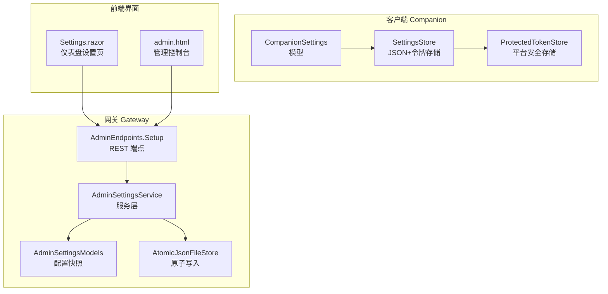
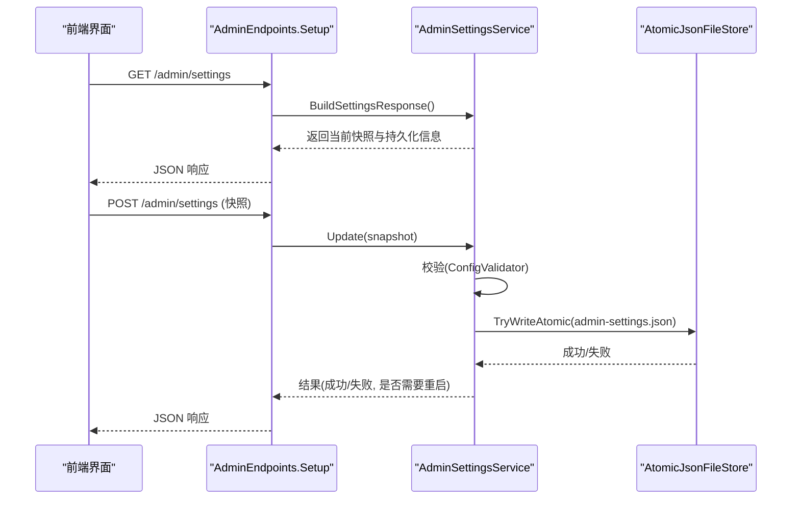
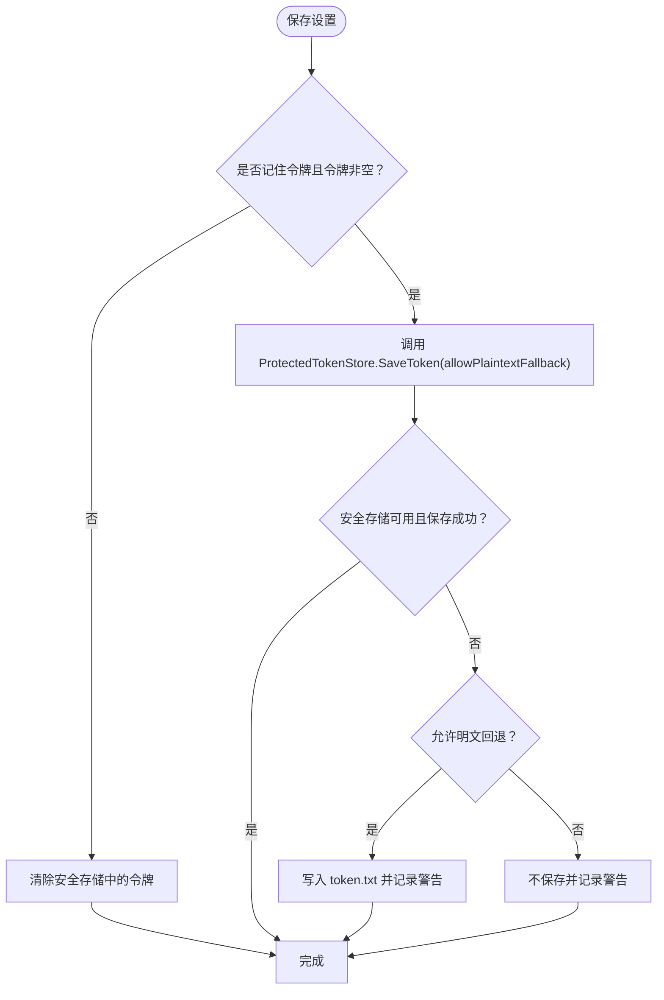
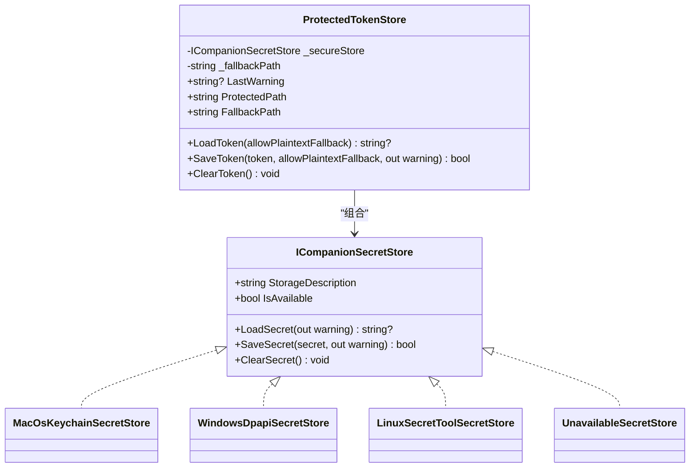
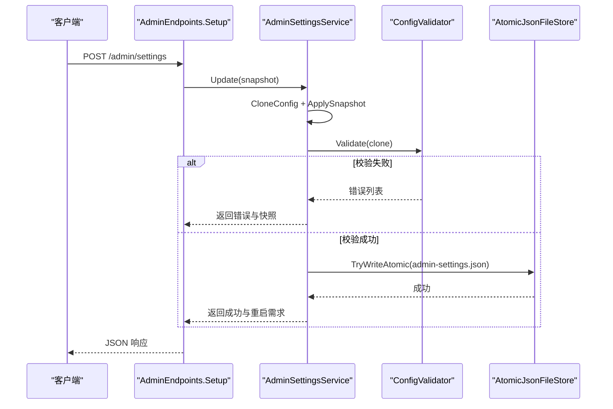
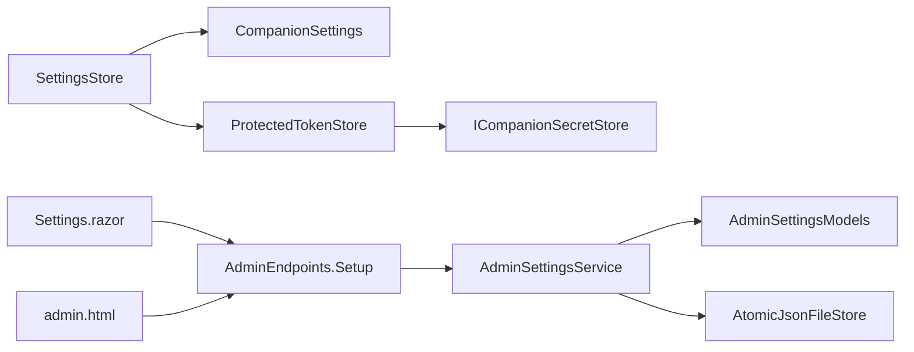

# 设置管理

<cite>
**本文引用的文件**
- [SettingsStore.cs](file://src/OpenClaw.Companion/Services/SettingsStore.cs)
- [CompanionSettings.cs](file://src/OpenClaw.Companion/Models/CompanionSettings.cs)
- [ProtectedTokenStore.cs](file://src/OpenClaw.Companion/Services/ProtectedTokenStore.cs)
- [AdminSettingsService.cs](file://src/OpenClaw.Gateway/AdminSettingsService.cs)
- [AdminSettingsModels.cs](file://src/OpenClaw.Core/Models/AdminSettingsModels.cs)
- [AdminEndpoints.Setup.cs](file://src/OpenClaw.Gateway/Endpoints/AdminEndpoints.Setup.cs)
- [AtomicJsonFileStore.cs](file://src/OpenClaw.Gateway/AtomicJsonFileStore.cs)
- [CompanionSettingsStoreTests.cs](file://src/OpenClaw.Tests/CompanionSettingsStoreTests.cs)
- [admin.html](file://src/OpenClaw.Gateway/wwwroot/admin.html)
- [Settings.razor](file://src/OpenClaw.Dashboard/Pages/Settings.razor)
</cite>

## 目录
1. [简介](#简介)
2. [项目结构](#项目结构)
3. [核心组件](#核心组件)
4. [架构总览](#架构总览)
5. [详细组件分析](#详细组件分析)
6. [依赖关系分析](#依赖关系分析)
7. [性能考量](#性能考量)
8. [故障排查指南](#故障排查指南)
9. [结论](#结论)
10. [附录](#附录)

## 简介
本文件系统性地阐述设置管理系统的实现与设计，重点覆盖以下方面：
- SettingsStore 的架构、配置数据持久化与设置项管理机制
- CompanionSettings 模型定义、默认值配置与配置验证逻辑
- 受保护令牌存储、敏感信息加密与安全存储策略
- 设置同步机制、配置热更新与版本兼容性处理
- 设置导入导出、备份恢复与批量配置管理能力
- 配置迁移、模板与用户偏好定制方法
- 配置文件格式、存储位置与权限管理细节

## 项目结构
设置管理涉及三个层面：
- 客户端设置（Companion）：本地 JSON 文件 + 平台安全存储（Keychain/Dpapi/Secret Service）
- 网关设置（Gateway）：服务端 JSON 文件 + 原子写入 + 端点接口
- 控制台/仪表盘：前端页面与后端端点交互

图表来源
- [SettingsStore.cs:1-204](file://src/OpenClaw.Companion/Services/SettingsStore.cs#L1-L204)
- [ProtectedTokenStore.cs:1-587](file://src/OpenClaw.Companion/Services/ProtectedTokenStore.cs#L1-L587)
- [AdminSettingsService.cs:1-589](file://src/OpenClaw.Gateway/AdminSettingsService.cs#L1-L589)
- [AdminSettingsModels.cs:1-99](file://src/OpenClaw.Core/Models/AdminSettingsModels.cs#L1-L99)
- [AdminEndpoints.Setup.cs:359-439](file://src/OpenClaw.Gateway/Endpoints/AdminEndpoints.Setup.cs#L359-L439)
- [AtomicJsonFileStore.cs:1-89](file://src/OpenClaw.Gateway/AtomicJsonFileStore.cs#L1-L89)
- [Settings.razor:279-374](file://src/OpenClaw.Dashboard/Pages/Settings.razor#L279-L374)
- [admin.html:1719-3542](file://src/OpenClaw.Gateway/wwwroot/admin.html#L1719-L3542)

章节来源
- [SettingsStore.cs:1-204](file://src/OpenClaw.Companion/Services/SettingsStore.cs#L1-L204)
- [AdminSettingsService.cs:1-589](file://src/OpenClaw.Gateway/AdminSettingsService.cs#L1-L589)

## 核心组件
- CompanionSettings：定义客户端设置项与默认值，包含服务器地址、用户名、令牌标签、是否记住令牌、是否允许明文回退、调试模式、桌面通知开关、自动启动网关、模型与工作区路径等。
- SettingsStore：负责将设置序列化到 settings.json，并通过 ProtectedTokenStore 管理 AuthToken 的安全存储；支持明文回退策略与遗留字段兼容。
- ProtectedTokenStore：抽象平台安全存储接口，按操作系统选择 Keychain、DPAPI 或 Secret Service；提供加载、保存、清理与回退策略。
- AdminSettingsService：服务端设置快照与持久化，提供校验、应用、重置、重启需求判定与原子写入。
- AdminSettingsModels：服务端配置快照模型，涵盖工具链、内存、通道等大量配置项。
- AdminEndpoints.Setup：提供获取、更新、重置设置的 REST 接口。
- AtomicJsonFileStore：通用原子 JSON 写入工具，避免竞态与损坏。

章节来源
- [CompanionSettings.cs:1-25](file://src/OpenClaw.Companion/Models/CompanionSettings.cs#L1-L25)
- [SettingsStore.cs:1-204](file://src/OpenClaw.Companion/Services/SettingsStore.cs#L1-L204)
- [ProtectedTokenStore.cs:1-587](file://src/OpenClaw.Companion/Services/ProtectedTokenStore.cs#L1-L587)
- [AdminSettingsService.cs:1-589](file://src/OpenClaw.Gateway/AdminSettingsService.cs#L1-L589)
- [AdminSettingsModels.cs:1-99](file://src/OpenClaw.Core/Models/AdminSettingsModels.cs#L1-L99)
- [AdminEndpoints.Setup.cs:359-439](file://src/OpenClaw.Gateway/Endpoints/AdminEndpoints.Setup.cs#L359-L439)
- [AtomicJsonFileStore.cs:1-89](file://src/OpenClaw.Gateway/AtomicJsonFileStore.cs#L1-L89)

## 架构总览
客户端与服务端设置管理采用“分层 + 原子写入”的设计，确保一致性与安全性。

图表来源
- [AdminEndpoints.Setup.cs:359-439](file://src/OpenClaw.Gateway/Endpoints/AdminEndpoints.Setup.cs#L359-L439)
- [AdminSettingsService.cs:220-279](file://src/OpenClaw.Gateway/AdminSettingsService.cs#L220-L279)
- [AtomicJsonFileStore.cs:34-59](file://src/OpenClaw.Gateway/AtomicJsonFileStore.cs#L34-L59)

## 详细组件分析

### SettingsStore 组件分析
- 职责
  - 将设置对象序列化到 settings.json，仅持久化非敏感字段
  - 通过 ProtectedTokenStore 管理 AuthToken 的安全存储与回退策略
  - 支持遗留字段兼容（从旧版 JSON 中读取 AuthToken）
- 关键行为
  - 保存时：写入 settings.json；若未勾选记住或令牌为空，则清除安全存储中的令牌
  - 加载时：先解析 settings.json，再从安全存储加载 AuthToken；若启用明文回退且安全存储不可用则使用 token.txt
  - 明文回退：当 AllowPlaintextTokenFallback 为 true 且安全存储不可用时，写入 token.txt 并记录警告
  - 遗留兼容：尝试解析旧字段名（大小写不敏感），用于向后兼容
- 错误处理
  - 捕获 JSON 解析异常、IO 异常、权限异常等，统一记录并返回默认设置
- 存储位置
  - settings.json 默认位于用户应用数据目录下的 OpenClaw/Companion
  - 令牌存储由平台安全存储决定（macOS Keychain、Windows DPAPI、Linux Secret Service）
  - 明文回退文件 token.txt 位于同一目录

图表来源
- [SettingsStore.cs:79-118](file://src/OpenClaw.Companion/Services/SettingsStore.cs#L79-L118)
- [ProtectedTokenStore.cs:78-106](file://src/OpenClaw.Companion/Services/ProtectedTokenStore.cs#L78-L106)

章节来源
- [SettingsStore.cs:1-204](file://src/OpenClaw.Companion/Services/SettingsStore.cs#L1-L204)
- [CompanionSettingsStoreTests.cs:1-237](file://src/OpenClaw.Tests/CompanionSettingsStoreTests.cs#L1-L237)

### CompanionSettings 模型分析
- 字段与默认值
  - 服务器地址、用户名、令牌标签、记住令牌、允许明文回退、调试模式、桌面通知开关、自动启动网关、模型提供商与模型名称、模型预设、工作区路径、本地模型路径
- 敏感字段
  - AuthToken 使用 [JsonIgnore] 标记，不参与 settings.json 序列化
- 默认值策略
  - 多数字段提供合理默认值，便于首次运行即用
- 兼容性
  - 通过 TryReadLegacyAuthToken 支持旧版 JSON 中的 AuthToken 字段

章节来源
- [CompanionSettings.cs:1-25](file://src/OpenClaw.Companion/Models/CompanionSettings.cs#L1-L25)
- [SettingsStore.cs:154-178](file://src/OpenClaw.Companion/Services/SettingsStore.cs#L154-L178)

### ProtectedTokenStore 安全存储策略
- 抽象接口 ICompanionSecretStore：统一加载、保存、清理与可用性判断
- 工厂选择策略
  - macOS：Keychain
  - Windows：DPAPI
  - Linux：Secret Service（通过 secret-tool 命令）
  - 不可用：返回不可用实现
- 回退策略
  - 当安全存储不可用或保存失败时，根据 AllowPlaintextTokenFallback 决定是否写入 token.txt
  - 加载时优先安全存储，否则在允许回退的情况下读取 token.txt
- 警告与可观测性
  - 所有操作均维护 LastWarning，便于上层感知状态

图表来源
- [ProtectedTokenStore.cs:9-119](file://src/OpenClaw.Companion/Services/ProtectedTokenStore.cs#L9-L119)
- [ProtectedTokenStore.cs:121-587](file://src/OpenClaw.Companion/Services/ProtectedTokenStore.cs#L121-L587)

章节来源
- [ProtectedTokenStore.cs:1-587](file://src/OpenClaw.Companion/Services/ProtectedTokenStore.cs#L1-L587)

### 网关设置服务（AdminSettingsService）
- 快照与持久化
  - CreateSnapshot：从 GatewayConfig 生成 AdminSettingsSnapshot
  - ApplySnapshot：将快照应用回 GatewayConfig
  - PersistSnapshot：原子写入 admin-settings.json
- 校验与变更检测
  - 使用 ConfigValidator 进行配置校验
  - 记录需要重启的服务字段集合，便于前端提示
- 重置与审计
  - Reset 删除覆盖文件并恢复基线快照
  - 更新与重置均记录审计事件
- 端点集成
  - /admin/settings 提供获取、更新、重置接口
  - /admin/heartbeat 用于健康检查

图表来源
- [AdminEndpoints.Setup.cs:375-439](file://src/OpenClaw.Gateway/Endpoints/AdminEndpoints.Setup.cs#L375-L439)
- [AdminSettingsService.cs:220-279](file://src/OpenClaw.Gateway/AdminSettingsService.cs#L220-L279)
- [AtomicJsonFileStore.cs:34-59](file://src/OpenClaw.Gateway/AtomicJsonFileStore.cs#L34-L59)

章节来源
- [AdminSettingsService.cs:1-589](file://src/OpenClaw.Gateway/AdminSettingsService.cs#L1-L589)
- [AdminSettingsModels.cs:1-99](file://src/OpenClaw.Core/Models/AdminSettingsModels.cs#L1-L99)
- [AdminEndpoints.Setup.cs:359-439](file://src/OpenClaw.Gateway/Endpoints/AdminEndpoints.Setup.cs#L359-L439)

### 前端设置页面与仪表盘
- 仪表盘 Settings.razor
  - 加载设置：GET /admin/settings，解析 JSON 并填充表单
  - 保存设置：POST /admin/settings，提交快照，处理成功/失败与提示
  - 重置设置：DELETE /admin/settings，清空覆盖并重新加载
- 管理控制台 admin.html
  - 展示与编辑大量配置项，显示持久化文件存在状态与最后修改时间

章节来源
- [Settings.razor:279-374](file://src/OpenClaw.Dashboard/Pages/Settings.razor#L279-L374)
- [admin.html:1719-3542](file://src/OpenClaw.Gateway/wwwroot/admin.html#L1719-L3542)

## 依赖关系分析
- 客户端
  - SettingsStore 依赖 CompanionSettings 与 ProtectedTokenStore
  - ProtectedTokenStore 依赖平台命令或系统 API（macOS Keychain、Windows DPAPI、Linux Secret Service）
- 服务端
  - AdminSettingsService 依赖 AdminSettingsModels、ConfigValidator、AtomicJsonFileStore
  - AdminEndpoints.Setup 依赖 AdminSettingsService
- 前端
  - Settings.razor 与 admin.html 依赖 AdminEndpoints.Setup

图表来源
- [SettingsStore.cs:1-204](file://src/OpenClaw.Companion/Services/SettingsStore.cs#L1-L204)
- [ProtectedTokenStore.cs:1-587](file://src/OpenClaw.Companion/Services/ProtectedTokenStore.cs#L1-L587)
- [AdminSettingsService.cs:1-589](file://src/OpenClaw.Gateway/AdminSettingsService.cs#L1-L589)
- [AdminEndpoints.Setup.cs:359-439](file://src/OpenClaw.Gateway/Endpoints/AdminEndpoints.Setup.cs#L359-L439)
- [Settings.razor:279-374](file://src/OpenClaw.Dashboard/Pages/Settings.razor#L279-L374)
- [admin.html:1719-3542](file://src/OpenClaw.Gateway/wwwroot/admin.html#L1719-L3542)

## 性能考量
- 原子写入
  - 服务端使用临时文件 + 移动的方式写入配置，避免部分写入导致损坏
- 序列化优化
  - 使用 System.Text.Json，Web 默认选项开启缩进以提升可读性
- 平台安全存储
  - Keychain/Dpapi/Secret Service 通常具备缓存与快速访问特性，减少频繁 IO
- 并发控制
  - 服务端对配置更新加锁，避免并发写入冲突

章节来源
- [AtomicJsonFileStore.cs:34-59](file://src/OpenClaw.Gateway/AtomicJsonFileStore.cs#L34-L59)
- [AdminSettingsService.cs:220-279](file://src/OpenClaw.Gateway/AdminSettingsService.cs#L220-L279)

## 故障排查指南
- 客户端令牌无法加载
  - 检查 LastWarning 是否提示安全存储不可用或明文回退被禁用
  - 若 AllowPlaintextTokenFallback 为 false，不会使用 token.txt
  - 参考测试用例验证行为
- 服务端配置更新失败
  - 查看响应中的错误列表，确认哪些字段校验失败
  - 检查是否需要重启服务（RestartRequiredFields）
- 配置文件损坏
  - 服务端采用原子写入，若出现损坏，可删除 admin-settings.json 后重试
- 权限问题
  - 确认进程对配置文件所在目录具有读写权限

章节来源
- [CompanionSettingsStoreTests.cs:1-237](file://src/OpenClaw.Tests/CompanionSettingsStoreTests.cs#L1-L237)
- [AdminSettingsService.cs:220-279](file://src/OpenClaw.Gateway/AdminSettingsService.cs#L220-L279)

## 结论
该设置管理系统在客户端与服务端分别实现了安全、可靠与易用的配置管理：
- 客户端通过 SettingsStore 与 ProtectedTokenStore 实现敏感信息的安全存储与回退策略
- 服务端通过 AdminSettingsService 与原子写入保障配置变更的一致性与可观测性
- 前端提供直观的设置页面，配合端点实现导入导出、备份恢复与批量配置管理的基础能力

## 附录

### 配置文件格式与存储位置
- 客户端
  - settings.json：普通设置项（不包含 AuthToken）
  - 平台安全存储：macOS Keychain、Windows DPAPI、Linux Secret Service
  - 明文回退：token.txt（仅在允许回退时使用）
- 服务端
  - admin-settings.json：服务端配置快照，位于存储根目录下

章节来源
- [SettingsStore.cs:17-35](file://src/OpenClaw.Companion/Services/SettingsStore.cs#L17-L35)
- [ProtectedTokenStore.cs:33-43](file://src/OpenClaw.Companion/Services/ProtectedTokenStore.cs#L33-L43)
- [AdminSettingsService.cs:29-36](file://src/OpenClaw.Gateway/AdminSettingsService.cs#L29-L36)

### 设置同步与热更新
- 客户端
  - 通过 SettingsStore 的 Load/Save 实现本地同步；令牌通过安全存储独立管理
- 服务端
  - 通过 /admin/settings 端点进行同步；更新后立即应用并持久化
  - 通过 RestartRequiredFields 与 ImmediateFieldKeys 区分即时生效与需重启的配置

章节来源
- [AdminEndpoints.Setup.cs:359-439](file://src/OpenClaw.Gateway/Endpoints/AdminEndpoints.Setup.cs#L359-L439)
- [AdminSettingsService.cs:290-361](file://src/OpenClaw.Gateway/AdminSettingsService.cs#L290-L361)

### 导入导出、备份恢复与批量管理
- 导入/导出
  - 仪表盘 Settings.razor 与管理控制台 admin.html 支持将当前设置导出为 JSON 并导入
- 备份恢复
  - 服务端配置文件 admin-settings.json 即为备份；删除即可恢复基线
- 批量管理
  - 通过快照（snapshot）一次性提交多个配置项，原子写入保证一致性

章节来源
- [Settings.razor:279-374](file://src/OpenClaw.Dashboard/Pages/Settings.razor#L279-L374)
- [admin.html:1719-3542](file://src/OpenClaw.Gateway/wwwroot/admin.html#L1719-L3542)
- [AdminEndpoints.Setup.cs:375-439](file://src/OpenClaw.Gateway/Endpoints/AdminEndpoints.Setup.cs#L375-L439)

### 版本兼容性与迁移
- 客户端
  - 通过 TryReadLegacyAuthToken 兼容旧版 JSON 中的 AuthToken 字段
- 服务端
  - 通过 AdminSettingsModels 的字段集合与校验器保持向后兼容
  - 通过 RestartRequiredFields 识别需要重启的变更，指导用户操作

章节来源
- [SettingsStore.cs:154-178](file://src/OpenClaw.Companion/Services/SettingsStore.cs#L154-L178)
- [AdminSettingsModels.cs:1-99](file://src/OpenClaw.Core/Models/AdminSettingsModels.cs#L1-L99)
- [AdminSettingsService.cs:290-361](file://src/OpenClaw.Gateway/AdminSettingsService.cs#L290-L361)