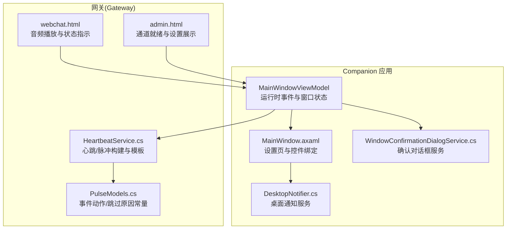
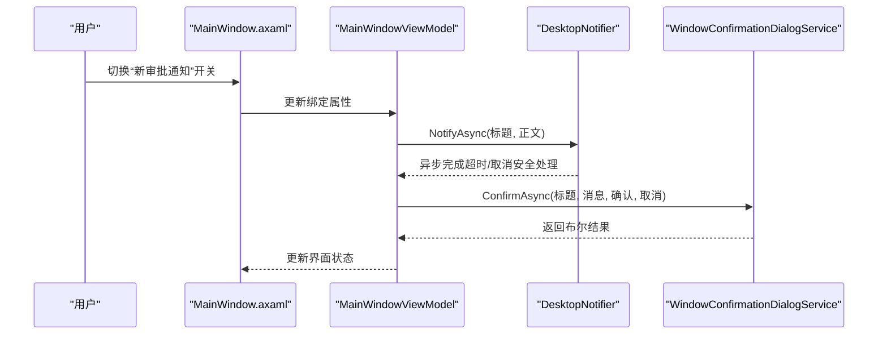
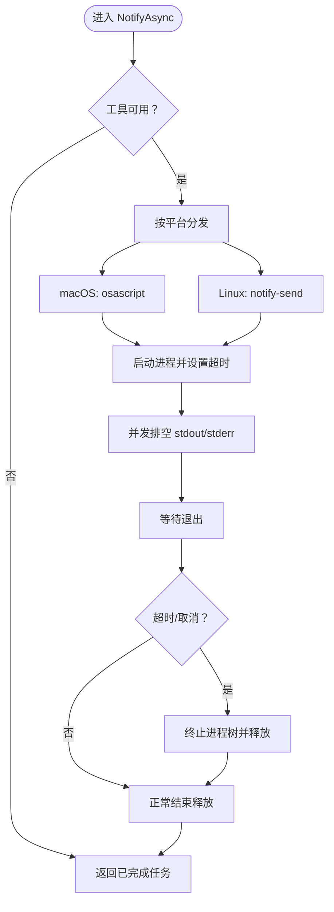
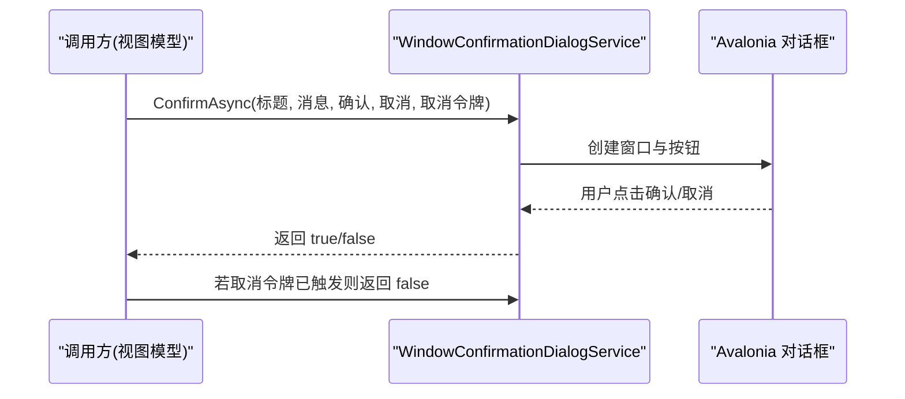
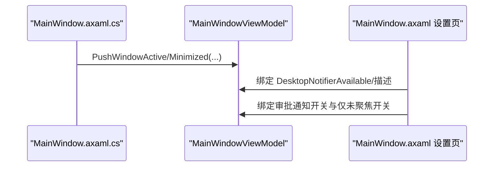
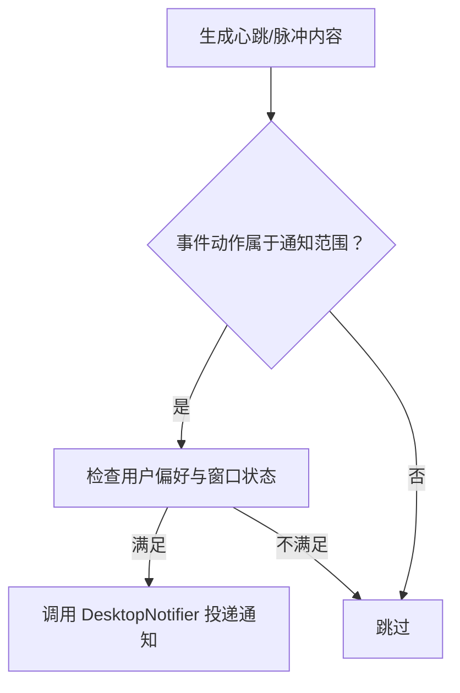
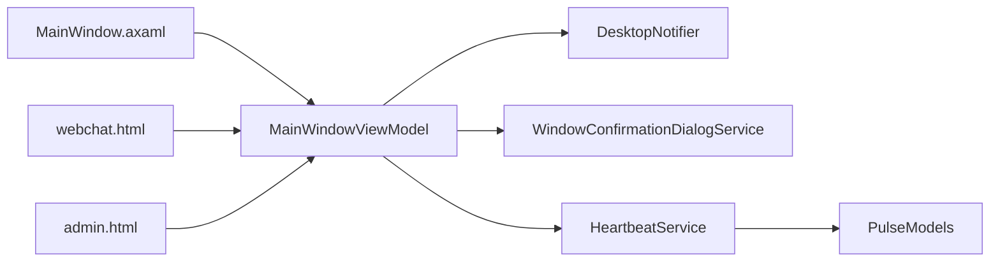

# 通知系统

<cite>
**本文引用的文件**
- [DesktopNotifier.cs](file://src/OpenClaw.Companion/Services/DesktopNotifier.cs)
- [IConfirmationDialogService.cs](file://src/OpenClaw.Companion/Services/IConfirmationDialogService.cs)
- [WindowConfirmationDialogService.cs](file://src/OpenClaw.Companion/Services/WindowConfirmationDialogService.cs)
- [MainWindow.axaml](file://src/OpenClaw.Companion/Views/MainWindow.axaml)
- [MainWindowViewModel.RuntimeEvents.cs](file://src/OpenClaw.Companion/ViewModels/MainWindowViewModel.RuntimeEvents.cs)
- [MainWindow.axaml.cs](file://src/OpenClaw.Companion/Views/MainWindow.axaml.cs)
- [PulseModels.cs](file://src/OpenClaw.Core/Models/PulseModels.cs)
- [HeartbeatService.cs](file://src/OpenClaw.Gateway/HeartbeatService.cs)
- [webchat.html](file://src/OpenClaw.Gateway/wwwroot/webchat.html)
- [admin.html](file://src/OpenClaw.Gateway/wwwroot/admin.html)
- [CompanionSettings.cs](file://src/OpenClaw.Companion/Models/CompanionSettings.cs)
- [SettingsStore.cs](file://src/OpenClaw.Companion/Services/SettingsStore.cs)
</cite>

## 目录
1. [引言](#引言)
2. [项目结构](#项目结构)
3. [核心组件](#核心组件)
4. [架构总览](#架构总览)
5. [组件详解](#组件详解)
6. [依赖关系分析](#依赖关系分析)
7. [性能与优化](#性能与优化)
8. [故障排查指南](#故障排查指南)
9. [结论](#结论)
10. [附录](#附录)

## 引言
本文件面向“通知系统”的技术文档，聚焦于桌面通知集成、确认对话框服务、用户交互与响应式通知机制。文档覆盖通知类型与显示策略、用户偏好设置、系统托盘与声音提示的现状与扩展建议、通知优先级管理与批量处理思路、以及跨平台（macOS/Linux）通知实现细节与平台特定行为、权限与隐私注意事项。

## 项目结构
通知系统在 Companion 桌面应用中以服务形式存在，并与界面层（Avalonia）及网关侧的心跳/脉冲机制协同工作。主要涉及以下模块：
- 桌面通知服务：负责跨平台桌面通知投递
- 确认对话框服务：提供阻塞式确认交互
- 界面层绑定：将通知能力暴露到设置页
- 心跳/脉冲模型：定义事件动作与跳过原因，支撑通知触发条件
- 设置存储与偏好：持久化用户通知偏好
- 声音提示与可视化：网关前端页面中的音频播放与状态指示

图表来源
- [DesktopNotifier.cs:15-52](file://src/OpenClaw.Companion/Services/DesktopNotifier.cs#L15-L52)
- [WindowConfirmationDialogService.cs:7-106](file://src/OpenClaw.Companion/Services/WindowConfirmationDialogService.cs#L7-L106)
- [MainWindow.axaml:463-464](file://src/OpenClaw.Companion/Views/MainWindow.axaml#L463-L464)
- [HeartbeatService.cs:372-399](file://src/OpenClaw.Gateway/HeartbeatService.cs#L372-L399)
- [PulseModels.cs:106-131](file://src/OpenClaw.Core/Models/PulseModels.cs#L106-L131)
- [webchat.html:3151-3190](file://src/OpenClaw.Gateway/wwwroot/webchat.html#L3151-L3190)
- [admin.html:3472-3497](file://src/OpenClaw.Gateway/wwwroot/admin.html#L3472-L3497)

章节来源
- [DesktopNotifier.cs:15-52](file://src/OpenClaw.Companion/Services/DesktopNotifier.cs#L15-L52)
- [MainWindow.axaml:463-464](file://src/OpenClaw.Companion/Views/MainWindow.axaml#L463-L464)

## 核心组件
- 桌面通知服务（IDesktopNotifier/ DesktopNotifier）
  - 负责检测平台并调用系统工具投递通知；当前支持 macOS 和 Linux，Windows 在本版本不支持
  - 提供可用性判断与平台描述，便于 UI 展示
- 确认对话框服务（IConfirmationDialogService/ WindowConfirmationDialogService）
  - 提供阻塞式确认交互，支持取消令牌；默认拒绝实现用于测试或禁用场景
- 界面层（MainWindow.axaml）
  - 将通知可用性与偏好项绑定到设置页，如“新审批通知”“仅在未聚焦时通知”
- 心跳/脉冲模型（PulseModels.cs）
  - 定义事件动作与跳过原因，作为通知触发策略的基础
- 心跳服务（HeartbeatService.cs）
  - 构建管理型提示与任务清单，结合事件动作决定是否需要通知
- 设置存储与偏好（CompanionSettings.cs/ SettingsStore.cs）
  - 持久化用户偏好的通知开关与行为
- 声音提示与可视化（webchat.html）
  - 前端音频队列与播放逻辑，配合通知形成多模态反馈

章节来源
- [DesktopNotifier.cs:6-13](file://src/OpenClaw.Companion/Services/DesktopNotifier.cs#L6-L13)
- [DesktopNotifier.cs:15-52](file://src/OpenClaw.Companion/Services/DesktopNotifier.cs#L15-L52)
- [IConfirmationDialogService.cs:3-6](file://src/OpenClaw.Companion/Services/IConfirmationDialogService.cs#L3-L6)
- [WindowConfirmationDialogService.cs:7-106](file://src/OpenClaw.Companion/Services/WindowConfirmationDialogService.cs#L7-L106)
- [MainWindow.axaml:463-464](file://src/OpenClaw.Companion/Views/MainWindow.axaml#L463-L464)
- [PulseModels.cs:106-131](file://src/OpenClaw.Core/Models/PulseModels.cs#L106-L131)
- [HeartbeatService.cs:372-399](file://src/OpenClaw.Gateway/HeartbeatService.cs#L372-L399)
- [CompanionSettings.cs](file://src/OpenClaw.Companion/Models/CompanionSettings.cs)
- [SettingsStore.cs](file://src/OpenClaw.Companion/Services/SettingsStore.cs)
- [webchat.html:3151-3190](file://src/OpenClaw.Gateway/wwwroot/webchat.html#L3151-L3190)

## 架构总览
桌面通知与确认对话框在 Companion 中通过 MVVM 绑定到设置页，由视图模型驱动服务调用；网关侧的心跳/脉冲模型为通知触发提供语义基础；前端 webchat 页面提供声音提示与状态可视化，增强用户感知。

图表来源
- [MainWindow.axaml:463-464](file://src/OpenClaw.Companion/Views/MainWindow.axaml#L463-L464)
- [DesktopNotifier.cs:41-52](file://src/OpenClaw.Companion/Services/DesktopNotifier.cs#L41-L52)
- [WindowConfirmationDialogService.cs:9-106](file://src/OpenClaw.Companion/Services/WindowConfirmationDialogService.cs#L9-L106)

## 组件详解

### 桌面通知服务（DesktopNotifier）
- 平台检测与可用性
  - 通过运行时平台检测确定目标路径；当前仅对 macOS 与 Linux 解析系统工具
  - 工具解析：macOS 使用 osascript，Linux 使用 notify-send；若工具不在 PATH，则标记不可用
- 通知投递
  - macOS：通过 AppleScript 执行系统通知
  - Linux：通过 notify-send 发送系统通知
  - 超时与取消：每次投递限制最长时间，同时并发排空标准输出/错误流，避免管道缓冲区阻塞
- 错误与泄漏防护
  - 任何异常均被吞掉，避免影响主流程；超时或取消时尽力终止子进程树并释放资源

图表来源
- [DesktopNotifier.cs:41-52](file://src/OpenClaw.Companion/Services/DesktopNotifier.cs#L41-L52)
- [DesktopNotifier.cs:114-163](file://src/OpenClaw.Companion/Services/DesktopNotifier.cs#L114-L163)

章节来源
- [DesktopNotifier.cs:15-52](file://src/OpenClaw.Companion/Services/DesktopNotifier.cs#L15-L52)
- [DesktopNotifier.cs:114-163](file://src/OpenClaw.Companion/Services/DesktopNotifier.cs#L114-L163)

### 确认对话框服务（IConfirmationDialogService/ WindowConfirmationDialogService）
- 接口契约
  - 提供 ConfirmAsync(title, message, confirmText, cancelText, cancellationToken)
- 默认实现（DenyConfirmationDialogService）
  - 总是返回 false，适合测试或禁用场景
- 窗口实现（WindowConfirmationDialogService）
  - 基于 Avalonia 控件构建对话框，支持取消令牌与 UI 线程调度
  - 点击确认/取消分别设置结果并关闭窗口
  - 支持在打开前注册取消回调，确保取消时及时关闭窗口

图表来源
- [WindowConfirmationDialogService.cs:9-106](file://src/OpenClaw.Companion/Services/WindowConfirmationDialogService.cs#L9-L106)
- [IConfirmationDialogService.cs:3-6](file://src/OpenClaw.Companion/Services/IConfirmationDialogService.cs#L3-L6)

章节来源
- [IConfirmationDialogService.cs:3-12](file://src/OpenClaw.Companion/Services/IConfirmationDialogService.cs#L3-L12)
- [WindowConfirmationDialogService.cs:7-106](file://src/OpenClaw.Companion/Services/WindowConfirmationDialogService.cs#L7-L106)

### 界面层绑定与窗口状态
- 设置页绑定
  - 设置页包含“桌面通知”区域，显示平台描述与可用性，并提供“新审批通知”“仅在未聚焦时通知”等选项
- 窗口状态推送
  - 主窗口在激活/失活、最小化/还原时向视图模型推送状态，用于控制通知策略（例如“仅在未聚焦时通知”）

图表来源
- [MainWindow.axaml.cs:30-40](file://src/OpenClaw.Companion/Views/MainWindow.axaml.cs#L30-L40)
- [MainWindow.axaml:463-464](file://src/OpenClaw.Companion/Views/MainWindow.axaml#L463-L464)

章节来源
- [MainWindow.axaml:463-464](file://src/OpenClaw.Companion/Views/MainWindow.axaml#L463-L464)
- [MainWindow.axaml.cs:30-40](file://src/OpenClaw.Companion/Views/MainWindow.axaml.cs#L30-L40)

### 心跳/脉冲与通知触发策略
- 事件动作与跳过原因
  - PulseModels 定义了 run_started/run_completed/skipped/alert/ok_suppressed/delivery_skipped/error/manual_wake 等动作
  - 跳过原因包括 disabled/outside-active-hours/busy/visibility-disabled 等
- 心跳服务
  - 构建管理型提示与任务清单，结合模板与条件生成可读文本，作为通知内容来源
- 通知策略建议
  - 基于动作选择性通知（如 alert、error、delivery_skipped）
  - 结合窗口状态（未聚焦时）与用户偏好（启用新审批通知）决定是否投递

图表来源
- [PulseModels.cs:106-131](file://src/OpenClaw.Core/Models/PulseModels.cs#L106-L131)
- [HeartbeatService.cs:372-399](file://src/OpenClaw.Gateway/HeartbeatService.cs#L372-L399)

章节来源
- [PulseModels.cs:106-131](file://src/OpenClaw.Core/Models/PulseModels.cs#L106-L131)
- [HeartbeatService.cs:372-399](file://src/OpenClaw.Gateway/HeartbeatService.cs#L372-L399)

### 设置存储与用户偏好
- 偏好模型与存储
  - CompanionSettings 定义通知相关字段
  - SettingsStore 负责读写与持久化
- 设置页联动
  - 设置页将可用性与描述绑定到 UI，开关项与窗口状态联动

章节来源
- [CompanionSettings.cs](file://src/OpenClaw.Companion/Models/CompanionSettings.cs)
- [SettingsStore.cs](file://src/OpenClaw.Companion/Services/SettingsStore.cs)
- [MainWindow.axaml:463-464](file://src/OpenClaw.Companion/Views/MainWindow.axaml#L463-L464)

### 声音提示与视觉反馈
- 音频播放
  - webchat.html 提供音频队列与播放逻辑，支持从 base64 构造音频并串行播放
- 状态可视化
  - admin.html 展示通道就绪卡片，webchat.html 展示连接状态指示与动画效果

章节来源
- [webchat.html:3151-3190](file://src/OpenClaw.Gateway/wwwroot/webchat.html#L3151-L3190)
- [admin.html:3472-3497](file://src/OpenClaw.Gateway/wwwroot/admin.html#L3472-L3497)

## 依赖关系分析
- 组件耦合
  - DesktopNotifier 与平台工具强耦合（osascript/notify-send），但通过接口隔离了上层调用
  - WindowConfirmationDialogService 依赖 Avalonia UI 框架
  - 设置页与视图模型双向绑定，视图模型再驱动服务
- 外部依赖
  - macOS：osascript
  - Linux：libnotify（notify-send）
- 潜在循环依赖
  - 当前文件间无直接循环依赖，通知服务与对话框服务均通过视图模型间接使用

图表来源
- [MainWindow.axaml:463-464](file://src/OpenClaw.Companion/Views/MainWindow.axaml#L463-L464)
- [DesktopNotifier.cs:15-52](file://src/OpenClaw.Companion/Services/DesktopNotifier.cs#L15-L52)
- [WindowConfirmationDialogService.cs:7-106](file://src/OpenClaw.Companion/Services/WindowConfirmationDialogService.cs#L7-L106)
- [HeartbeatService.cs:372-399](file://src/OpenClaw.Gateway/HeartbeatService.cs#L372-L399)
- [PulseModels.cs:106-131](file://src/OpenClaw.Core/Models/PulseModels.cs#L106-L131)
- [webchat.html:3151-3190](file://src/OpenClaw.Gateway/wwwroot/webchat.html#L3151-L3190)
- [admin.html:3472-3497](file://src/OpenClaw.Gateway/wwwroot/admin.html#L3472-L3497)

## 性能与优化
- 进程与 I/O 并发
  - 通知投递采用并发读取标准输出/错误流与等待退出，避免因管道缓冲区满导致死锁
- 超时与取消
  - 统一设置超时时间，超时或取消时主动终止子进程树，防止僵尸进程
- 取消令牌传播
  - 所有异步调用均接受取消令牌，保证长耗时操作可中断
- 批量与节流
  - 建议在上层引入节流/去抖策略，避免短时间内大量通知刷屏
- 跨平台差异
  - Windows 当前不支持桌面通知，应避免在 UI 上误导用户；可在设置页明确提示

章节来源
- [DesktopNotifier.cs:114-163](file://src/OpenClaw.Companion/Services/DesktopNotifier.cs#L114-L163)
- [DesktopNotifier.cs:41-52](file://src/OpenClaw.Companion/Services/DesktopNotifier.cs#L41-L52)

## 故障排查指南
- 通知不可用
  - 检查平台与工具：macOS 是否安装 osascript；Linux 是否安装 libnotify（notify-send）
  - 查看设置页“平台描述”，确认工具是否在 PATH 中
- 通知未弹出
  - 确认“新审批通知”开关已开启
  - 若启用“仅在未聚焦时通知”，请在 Companion 未聚焦时触发
- 对话框无响应
  - 检查取消令牌是否提前触发
  - 确认 Avalonia 窗口未被其他对话框遮挡
- 前端音频无法播放
  - 检查浏览器权限与网络状态
  - 确认音频数据格式与采样率参数正确

章节来源
- [DesktopNotifier.cs:31-39](file://src/OpenClaw.Companion/Services/DesktopNotifier.cs#L31-L39)
- [MainWindow.axaml:463-464](file://src/OpenClaw.Companion/Views/MainWindow.axaml#L463-L464)
- [WindowConfirmationDialogService.cs:16-106](file://src/OpenClaw.Companion/Services/WindowConfirmationDialogService.cs#L16-L106)
- [webchat.html:3151-3190](file://src/OpenClaw.Gateway/wwwroot/webchat.html#L3151-L3190)

## 结论
该通知系统以简洁可靠为核心设计原则：桌面通知通过平台工具实现跨平台兼容，确认对话框提供一致的用户交互体验，设置页与窗口状态联动确保策略可控。心跳/脉冲模型为通知触发提供了清晰的语义边界。未来可在 Windows 平台补充通知实现、完善通知优先级与批量处理策略，并进一步整合系统托盘与声音提示，提升多模态通知体验。

## 附录
- 术语
  - 事件动作：pulse_run_started/pulse_run_completed/pulse_alert/pulse_error 等
  - 跳过原因：disabled/outside-active-hours/busy/visibility-disabled 等
- 平台支持现状
  - macOS：osascript
  - Linux：libnotify（notify-send）
  - Windows：本版本不支持桌面通知