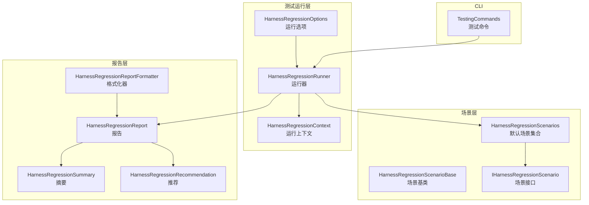
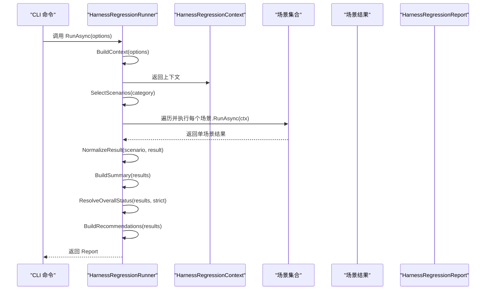
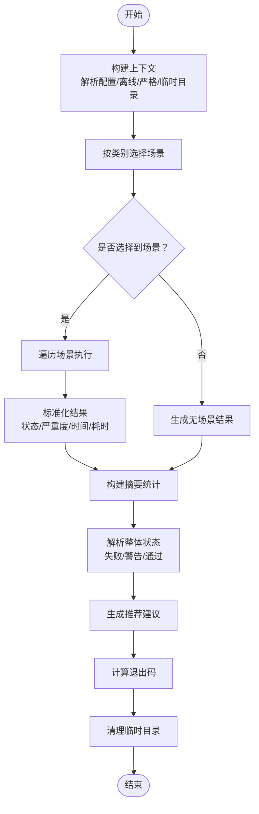
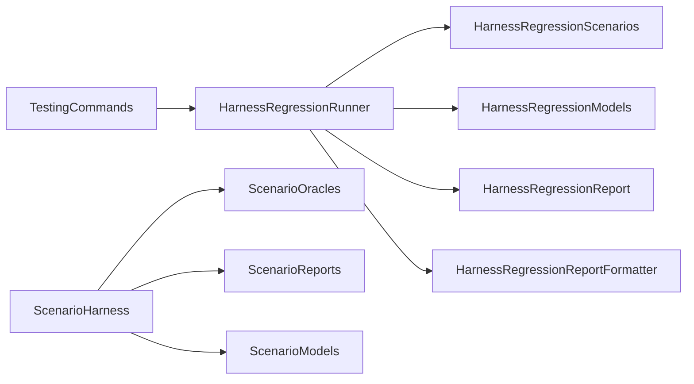

# 回归测试

<cite>
**本文引用的文件**
- [HarnessRegressionRunner.cs](file://src/OpenClaw.Testing/HarnessRegressionRunner.cs)
- [HarnessRegressionScenarios.cs](file://src/OpenClaw.Testing/HarnessRegressionScenarios.cs)
- [HarnessRegressionModels.cs](file://src/OpenClaw.Testing/HarnessRegressionModels.cs)
- [ScenarioHarness.cs](file://src/OpenClaw.Testing/ScenarioHarness.cs)
- [ScenarioInterfaces.cs](file://src/OpenClaw.Testing/ScenarioInterfaces.cs)
- [ScenarioOracles.cs](file://src/OpenClaw.Testing/ScenarioOracles.cs)
- [ScenarioQualityGate.cs](file://src/OpenClaw.Testing/ScenarioQualityGate.cs)
- [ScenarioReports.cs](file://src/OpenClaw.Testing/ScenarioReports.cs)
- [TestingCommands.cs](file://src/OpenClaw.Cli/TestingCommands.cs)
- [HarnessRegressionTests.cs](file://src/OpenClaw.Tests/HarnessRegressionTests.cs)
</cite>

## 目录
1. [简介](#简介)
2. [项目结构](#项目结构)
3. [核心组件](#核心组件)
4. [架构总览](#架构总览)
5. [详细组件分析](#详细组件分析)
6. [依赖关系分析](#依赖关系分析)
7. [性能考量](#性能考量)
8. [故障排查指南](#故障排查指南)
9. [结论](#结论)
10. [附录](#附录)

## 简介
本文件面向回归测试子系统，系统性阐述回归测试运行器的实现原理、场景选择与执行流程、报告生成与摘要统计、状态解析与严格模式、退出码计算、场景分类筛选、结果标准化与推荐系统等机制。同时提供配置方法、执行策略、报告解读与问题排查的实用指南，帮助开发者与运维人员高效开展回归测试工作。

## 项目结构
回归测试相关代码主要位于 OpenClaw.Testing 命名空间中，围绕“运行器 + 场景集合 + 报告输出 + CLI 命令”组织，形成清晰的分层与职责分离：
- 运行器：负责构建上下文、选择场景、执行场景、标准化结果、汇总统计、计算整体状态与退出码、生成推荐建议。
- 场景集合：内置多类回归场景（配置加载、安全加固、工具审批策略、内存/会话持久化、序列化一致性、MCP/兼容请求形状、学习策略、托管技能校验、部署配置、文档存在性等）。
- 报告与输出：提供文本与 JSON 格式报告；支持按运行 ID 写入磁盘并生成 Markdown 报告。
- CLI 命令：提供初始化、运行、报告重生成、质量门禁等子命令，支持失败策略控制。

图表来源
- [HarnessRegressionRunner.cs:18-68](file://src/OpenClaw.Testing/HarnessRegressionRunner.cs#L18-L68)
- [HarnessRegressionScenarios.cs:17-36](file://src/OpenClaw.Testing/HarnessRegressionScenarios.cs#L17-L36)
- [HarnessRegressionModels.cs:39-77](file://src/OpenClaw.Testing/HarnessRegressionModels.cs#L39-L77)
- [TestingCommands.cs:12-82](file://src/OpenClaw.Cli/TestingCommands.cs#L12-L82)

章节来源
- [HarnessRegressionRunner.cs:1-383](file://src/OpenClaw.Testing/HarnessRegressionRunner.cs#L1-L383)
- [HarnessRegressionScenarios.cs:1-786](file://src/OpenClaw.Testing/HarnessRegressionScenarios.cs#L1-L786)
- [HarnessRegressionModels.cs:1-115](file://src/OpenClaw.Testing/HarnessRegressionModels.cs#L1-L115)
- [TestingCommands.cs:1-271](file://src/OpenClaw.Cli/TestingCommands.cs#L1-L271)

## 核心组件
- 运行器（HarnessRegressionRunner）
  - 构建运行上下文（配置路径解析、配置加载、离线模式、临时工作区），选择场景（按类别过滤），执行场景并标准化结果，汇总统计与整体状态解析，生成推荐建议，计算退出码。
- 场景集合（HarnessRegressionScenarios）
  - 默认注册多个回归场景，覆盖“入门引导、安全、审批、内存、提供方、工具、MCP、OpenAI 兼容、会话、Harness 自检、部署、文档”等类别。
- 报告与格式化（HarnessRegressionReport、HarnessRegressionReportFormatter）
  - 提供 JSON 与文本两种输出格式，文本报告包含每条结果与摘要统计，以及可选的“下一步”建议。
- CLI 命令（TestingCommands）
  - 提供 init/run/report/gates 子命令，支持失败策略（any/high）、输出目录、场景目录等参数。

章节来源
- [HarnessRegressionRunner.cs:18-88](file://src/OpenClaw.Testing/HarnessRegressionRunner.cs#L18-L88)
- [HarnessRegressionScenarios.cs:17-36](file://src/OpenClaw.Testing/HarnessRegressionScenarios.cs#L17-L36)
- [HarnessRegressionModels.cs:63-115](file://src/OpenClaw.Testing/HarnessRegressionModels.cs#L63-L115)
- [TestingCommands.cs:12-171](file://src/OpenClaw.Cli/TestingCommands.cs#L12-L171)

## 架构总览
下图展示从 CLI 到运行器再到场景与报告的整体调用链路与数据流：

图表来源
- [TestingCommands.cs:60-82](file://src/OpenClaw.Cli/TestingCommands.cs#L60-L82)
- [HarnessRegressionRunner.cs:18-68](file://src/OpenClaw.Testing/HarnessRegressionRunner.cs#L18-L68)
- [HarnessRegressionScenarios.cs:17-36](file://src/OpenClaw.Testing/HarnessRegressionScenarios.cs#L17-L36)

## 详细组件分析

### 运行器：HarnessRegressionRunner
- 上下文构建
  - 解析配置路径（支持显式与默认路径），尝试加载 GatewayConfig，记录错误信息；根据 Offline 与 Strict 参数设置上下文属性；创建临时工作区目录。
- 场景选择
  - 支持按 Category 过滤，默认返回全部场景；过滤时进行大小写与空白规范化。
- 执行流程
  - 逐个场景执行，支持取消；每个结果先标准化（状态/严重度归一、时间戳与耗时修正、必填字段回退）；收集结果后构建摘要（总数、通过/失败/跳过/警告/不适用）。
- 整体状态解析
  - 任一 Required 场景失败 → 整体失败；Strict 模式下，Required 的 Warning 或 Skipped → 视为失败；否则若存在 Warning → 整体 Warning；否则整体 Passed。
- 推荐系统
  - 基于结果特征生成“下一步”建议，如快速开始配置检查、安全态势审查、模型配置校验、查看跳过项说明等。
- 退出码
  - 若存在 Required 且失败的场景 → 退出码 1；Strict 模式下，Required 的 Warning/Skipped → 退出码 1；否则 0。
- 清理
  - 无论成功与否，最终清理临时工作区目录（忽略 IO/权限异常）。

图表来源
- [HarnessRegressionRunner.cs:90-127](file://src/OpenClaw.Testing/HarnessRegressionRunner.cs#L90-L127)
- [HarnessRegressionRunner.cs:129-156](file://src/OpenClaw.Testing/HarnessRegressionRunner.cs#L129-L156)
- [HarnessRegressionRunner.cs:158-187](file://src/OpenClaw.Testing/HarnessRegressionRunner.cs#L158-L187)
- [HarnessRegressionRunner.cs:189-229](file://src/OpenClaw.Testing/HarnessRegressionRunner.cs#L189-L229)
- [HarnessRegressionRunner.cs:231-292](file://src/OpenClaw.Testing/HarnessRegressionRunner.cs#L231-L292)
- [HarnessRegressionRunner.cs:70-88](file://src/OpenClaw.Testing/HarnessRegressionRunner.cs#L70-L88)
- [HarnessRegressionRunner.cs:307-322](file://src/OpenClaw.Testing/HarnessRegressionRunner.cs#L307-L322)

章节来源
- [HarnessRegressionRunner.cs:18-88](file://src/OpenClaw.Testing/HarnessRegressionRunner.cs#L18-L88)
- [HarnessRegressionRunner.cs:90-127](file://src/OpenClaw.Testing/HarnessRegressionRunner.cs#L90-L127)
- [HarnessRegressionRunner.cs:129-156](file://src/OpenClaw.Testing/HarnessRegressionRunner.cs#L129-L156)
- [HarnessRegressionRunner.cs:158-187](file://src/OpenClaw.Testing/HarnessRegressionRunner.cs#L158-L187)
- [HarnessRegressionRunner.cs:189-229](file://src/OpenClaw.Testing/HarnessRegressionRunner.cs#L189-L229)
- [HarnessRegressionRunner.cs:231-292](file://src/OpenClaw.Testing/HarnessRegressionRunner.cs#L231-L292)
- [HarnessRegressionRunner.cs:307-322](file://src/OpenClaw.Testing/HarnessRegressionRunner.cs#L307-L322)

### 场景集合：HarnessRegressionScenarios
- 默认场景清单
  - 快速开始配置加载、提供方配置形状、公共绑定加固、URL 安全默认、工具审批策略、内存/会话存取往返、合约/证据/治理序列化、MCP 初始化形状、OpenAI 兼容请求形状、学习提案审查优先、托管技能验证、Tailscale Serve 非公网、Harness 文档存在性等。
- 场景基类与路径安全
  - 场景基类提供 Passed/Skipped/Failed/Warning/NotApplicable 等便捷构造方法；HarnessRegressionPaths.Child 提供临时工作区内的路径安全限制，防止逃逸。

章节来源
- [HarnessRegressionScenarios.cs:17-36](file://src/OpenClaw.Testing/HarnessRegressionScenarios.cs#L17-L36)
- [HarnessRegressionScenarios.cs:38-69](file://src/OpenClaw.Testing/HarnessRegressionScenarios.cs#L38-L69)
- [HarnessRegressionScenarios.cs:71-141](file://src/OpenClaw.Testing/HarnessRegressionScenarios.cs#L71-L141)
- [HarnessRegressionScenarios.cs:143-244](file://src/OpenClaw.Testing/HarnessRegressionScenarios.cs#L143-L244)
- [HarnessRegressionScenarios.cs:246-285](file://src/OpenClaw.Testing/HarnessRegressionScenarios.cs#L246-L285)
- [HarnessRegressionScenarios.cs:287-340](file://src/OpenClaw.Testing/HarnessRegressionScenarios.cs#L287-L340)
- [HarnessRegressionScenarios.cs:342-402](file://src/OpenClaw.Testing/HarnessRegressionScenarios.cs#L342-L402)
- [HarnessRegressionScenarios.cs:404-539](file://src/OpenClaw.Testing/HarnessRegressionScenarios.cs#L404-L539)
- [HarnessRegressionScenarios.cs:541-579](file://src/OpenClaw.Testing/HarnessRegressionScenarios.cs#L541-L579)
- [HarnessRegressionScenarios.cs:581-611](file://src/OpenClaw.Testing/HarnessRegressionScenarios.cs#L581-L611)
- [HarnessRegressionScenarios.cs:613-638](file://src/OpenClaw.Testing/HarnessRegressionScenarios.cs#L613-L638)
- [HarnessRegressionScenarios.cs:640-671](file://src/OpenClaw.Testing/HarnessRegressionScenarios.cs#L640-L671)
- [HarnessRegressionScenarios.cs:673-704](file://src/OpenClaw.Testing/HarnessRegressionScenarios.cs#L673-L704)
- [HarnessRegressionScenarios.cs:706-762](file://src/OpenClaw.Testing/HarnessRegressionScenarios.cs#L706-L762)
- [HarnessRegressionScenarios.cs:770-786](file://src/OpenClaw.Testing/HarnessRegressionScenarios.cs#L770-L786)

### 报告与输出：HarnessRegressionReport 与格式化器
- 报告结构
  - 包含运行标识、起止时间、持续毫秒数、配置路径、提案 ID、离线/严格标志、整体状态、结果列表、摘要、推荐列表。
- 文本与 JSON 输出
  - 文本格式：逐条列出结果状态、ID 与摘要，打印摘要统计，并在有推荐时列出“下一步”。
  - JSON 格式：使用源生成的 JSON 上下文序列化报告对象，便于自动化消费。

章节来源
- [HarnessRegressionModels.cs:63-115](file://src/OpenClaw.Testing/HarnessRegressionModels.cs#L63-L115)
- [HarnessRegressionRunner.cs:334-382](file://src/OpenClaw.Testing/HarnessRegressionRunner.cs#L334-L382)

### CLI 命令：TestingCommands
- 子命令
  - init：初始化场景与文档目录，必要时写入示例场景文件。
  - run：加载场景、执行质量门禁、运行场景集合并写出报告，支持失败策略（any/high）。
  - report：基于最新运行目录重新生成 Markdown 报告。
  - gates：仅执行质量门禁，不运行场景。
- 参数
  - --scenarios/--scenario-dir：场景目录
  - --output：输出根目录
  - --fail-on：失败策略（any/high）
  - --json：输出 JSON（在运行器内部由格式化器控制）

章节来源
- [TestingCommands.cs:12-171](file://src/OpenClaw.Cli/TestingCommands.cs#L12-L171)
- [TestingCommands.cs:60-82](file://src/OpenClaw.Cli/TestingCommands.cs#L60-L82)
- [TestingCommands.cs:84-99](file://src/OpenClaw.Cli/TestingCommands.cs#L84-L99)
- [TestingCommands.cs:101-114](file://src/OpenClaw.Cli/TestingCommands.cs#L101-L114)

### 场景运行与质量门禁（Agent 场景）
- 场景运行器（ScriptedScenarioRunner）
  - 要求提供脚本化轨迹（scriptedTrace），否则判定失败；遍历场景中的所有 Oracle，对轨迹进行断言评估，汇总结果并生成报告。
- 场景质量门禁（ScenarioQualityGate）
  - 校验场景 JSON 的完整性与规范性：必须包含 id/title、明确的期望行为、高危/严重风险场景需至少一个安全/审批类 Oracle、工具使用场景需声明 mustCallTools/mustNotCallTools、不允许重复 id 等。
- 报告与追踪
  - 生成 Markdown 报告与 JSON 结果文件，支持按运行 ID 查找最新目录并重生成报告。

章节来源
- [ScenarioHarness.cs:3-57](file://src/OpenClaw.Testing/ScenarioHarness.cs#L3-L57)
- [ScenarioHarness.cs:123-179](file://src/OpenClaw.Testing/ScenarioHarness.cs#L123-L179)
- [ScenarioQualityGate.cs:25-74](file://src/OpenClaw.Testing/ScenarioQualityGate.cs#L25-L74)
- [ScenarioReports.cs:6-51](file://src/OpenClaw.Testing/ScenarioReports.cs#L6-L51)
- [ScenarioReports.cs:98-216](file://src/OpenClaw.Testing/ScenarioReports.cs#L98-L216)

### Oracle 断言体系（Agent 场景）
- Oracle 类型
  - 工具调用/未调用、最大工具调用次数、最终答案包含/不包含、需要/不需要审批、无高危工具使用等。
- 注册与工厂
  - 通过 ScenarioOracleRegistry 统一创建不同类型的 Oracle，未知类型返回 UnknownScenarioOracle 并标记失败。
- 断言规则
  - 基于脚本化轨迹（TraceStep）进行断言，支持从定义或期望中提取阈值与工具名，稳定排序与去重以保证断言可复现。

章节来源
- [ScenarioOracles.cs:6-16](file://src/OpenClaw.Testing/ScenarioOracles.cs#L6-L16)
- [ScenarioOracles.cs:33-62](file://src/OpenClaw.Testing/ScenarioOracles.cs#L33-L62)
- [ScenarioOracles.cs:183-348](file://src/OpenClaw.Testing/ScenarioOracles.cs#L183-L348)
- [ScenarioOracles.cs:350-409](file://src/OpenClaw.Testing/ScenarioOracles.cs#L350-L409)

## 依赖关系分析
- 运行器依赖场景集合与模型定义，输出报告与推荐；CLI 命令驱动运行器并控制输出。
- 场景集合内部依赖 Core 与 Validation 等模块进行配置解析与安全策略判断。
- Agent 场景运行器依赖 Oracle 注册表与断言规则，输出统一的运行报告。

图表来源
- [TestingCommands.cs:60-82](file://src/OpenClaw.Cli/TestingCommands.cs#L60-L82)
- [HarnessRegressionRunner.cs:18-68](file://src/OpenClaw.Testing/HarnessRegressionRunner.cs#L18-L68)
- [HarnessRegressionScenarios.cs:17-36](file://src/OpenClaw.Testing/HarnessRegressionScenarios.cs#L17-L36)
- [HarnessRegressionModels.cs:39-115](file://src/OpenClaw.Testing/HarnessRegressionModels.cs#L39-L115)
- [ScenarioHarness.cs:123-179](file://src/OpenClaw.Testing/ScenarioHarness.cs#L123-L179)
- [ScenarioOracles.cs:33-62](file://src/OpenClaw.Testing/ScenarioOracles.cs#L33-L62)
- [ScenarioReports.cs:98-216](file://src/OpenClaw.Testing/ScenarioReports.cs#L98-L216)

章节来源
- [TestingCommands.cs:1-271](file://src/OpenClaw.Cli/TestingCommands.cs#L1-L271)
- [HarnessRegressionRunner.cs:1-383](file://src/OpenClaw.Testing/HarnessRegressionRunner.cs#L1-L383)
- [HarnessRegressionScenarios.cs:1-786](file://src/OpenClaw.Testing/HarnessRegressionScenarios.cs#L1-L786)
- [HarnessRegressionModels.cs:1-115](file://src/OpenClaw.Testing/HarnessRegressionModels.cs#L1-L115)
- [ScenarioHarness.cs:1-179](file://src/OpenClaw.Testing/ScenarioHarness.cs#L1-L179)
- [ScenarioOracles.cs:1-409](file://src/OpenClaw.Testing/ScenarioOracles.cs#L1-L409)
- [ScenarioReports.cs:1-219](file://src/OpenClaw.Testing/ScenarioReports.cs#L1-L219)

## 性能考量
- 场景执行并发
  - 当前实现为顺序执行，避免共享资源竞争；若场景间无依赖，可在扩展点引入并行执行以提升吞吐。
- 临时工作区管理
  - 使用独立临时目录隔离场景数据，结束后删除；注意磁盘 IO 与权限开销。
- 序列化与报告
  - JSON 序列化采用源生成上下文，性能较优；文本报告构建为一次性字符串拼接，适合中小规模结果集。
- 离线模式
  - Offline 模式跳过网络与凭证检查，显著降低外部依赖带来的不确定性与耗时。

## 故障排查指南
- 无场景匹配
  - 若指定 Category 但没有匹配场景，运行器会生成一条“未选择到场景”的失败结果，建议检查类别名称大小写与拼写。
- 配置加载失败
  - 配置文件不存在或解析异常时，上下文会记录错误信息；建议确认配置路径与格式正确。
- 严格模式导致失败
  - 在 Strict 模式下，Required 的 Warning/Skipped 会被视为失败；可通过关闭严格模式或修复场景来解决。
- 临时目录清理失败
  - 运行器在 finally 中尝试删除临时目录，若被占用或权限不足可能失败；可手动清理或调整权限。
- Agent 场景质量门禁失败
  - 若场景缺少 id/title、无明确期望、高危场景缺少安全/审批 Oracle、工具使用场景缺少工具声明等，将触发门禁失败；请根据错误提示补齐场景定义。
- 退出码非零
  - 由运行器根据 Required 场景状态与严格模式决定；建议结合报告摘要与推荐建议定位问题。

章节来源
- [HarnessRegressionRunner.cs:139-156](file://src/OpenClaw.Testing/HarnessRegressionRunner.cs#L139-L156)
- [HarnessRegressionRunner.cs:90-127](file://src/OpenClaw.Testing/HarnessRegressionRunner.cs#L90-L127)
- [HarnessRegressionRunner.cs:70-88](file://src/OpenClaw.Testing/HarnessRegressionRunner.cs#L70-L88)
- [HarnessRegressionRunner.cs:307-322](file://src/OpenClaw.Testing/HarnessRegressionRunner.cs#L307-L322)
- [ScenarioQualityGate.cs:25-74](file://src/OpenClaw.Testing/ScenarioQualityGate.cs#L25-L74)
- [HarnessRegressionTests.cs:102-114](file://src/OpenClaw.Tests/HarnessRegressionTests.cs#L102-L114)

## 结论
回归测试运行器通过“上下文构建—场景选择—执行与标准化—汇总与状态解析—推荐与退出码”的完整闭环，提供了稳定可靠的回归保障能力。配合 CLI 命令与质量门禁，能够快速定位问题并指导修复。建议在 CI/CD 中启用严格模式与离线模式，结合推荐建议与报告摘要，确保回归质量与效率双提升。

## 附录

### 配置方法与执行策略
- 配置文件
  - 通过 --config 指定配置路径；若未显式指定且默认路径不存在，部分场景会跳过（如“快速开始配置加载”）。
- 类别筛选
  - 使用 --category 指定场景类别，支持大小写与空白规范化。
- 严格模式
  - 启用 --strict 使 Warning/Skipped 的 Required 场景被视为失败。
- 失败策略
  - 测试命令支持 --fail-on any/high，控制运行退出码。
- 输出
  - 文本报告与 JSON 报告均可获得；CLI 可直接输出 JSON（在运行器内部由格式化器控制）。

章节来源
- [HarnessRegressionRunner.cs:90-127](file://src/OpenClaw.Testing/HarnessRegressionRunner.cs#L90-L127)
- [HarnessRegressionRunner.cs:129-137](file://src/OpenClaw.Testing/HarnessRegressionRunner.cs#L129-L137)
- [TestingCommands.cs:134-141](file://src/OpenClaw.Cli/TestingCommands.cs#L134-L141)
- [TestingCommands.cs:15-82](file://src/OpenClaw.Cli/TestingCommands.cs#L15-L82)

### 报告解读要点
- 摘要统计
  - Total/Passed/Failed/Skipped/Warning/NotApplicable，用于快速掌握整体质量。
- 整体状态
  - Passed/Warning/Failed，受严格模式影响。
- 推荐建议
  - 针对特定场景组合给出“下一步”操作指引，如安全态势审查、模型配置校验、查看跳过项说明等。

章节来源
- [HarnessRegressionRunner.cs:189-198](file://src/OpenClaw.Testing/HarnessRegressionRunner.cs#L189-L198)
- [HarnessRegressionRunner.cs:203-229](file://src/OpenClaw.Testing/HarnessRegressionRunner.cs#L203-L229)
- [HarnessRegressionRunner.cs:231-292](file://src/OpenClaw.Testing/HarnessRegressionRunner.cs#L231-L292)