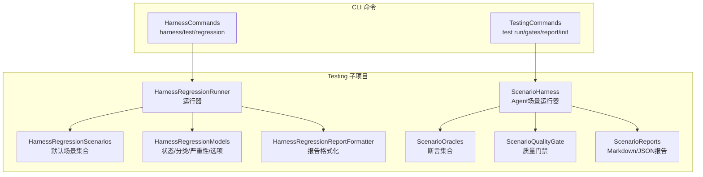
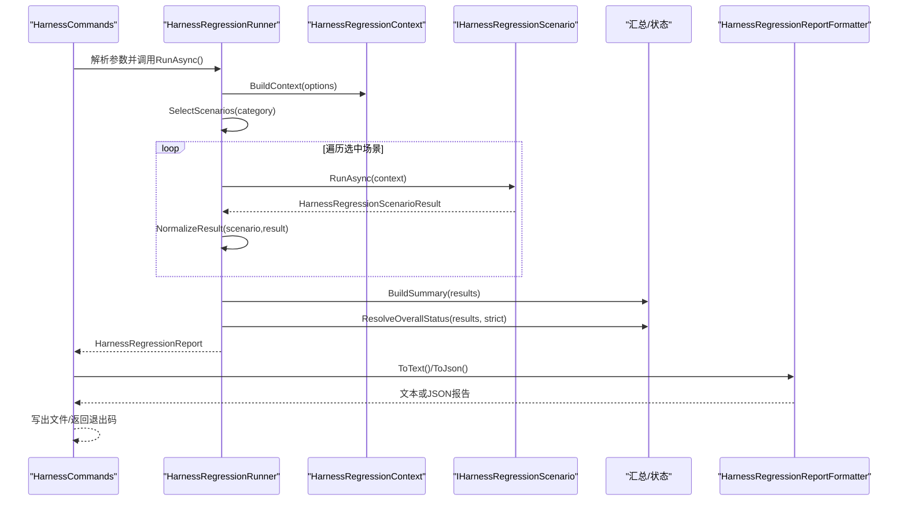
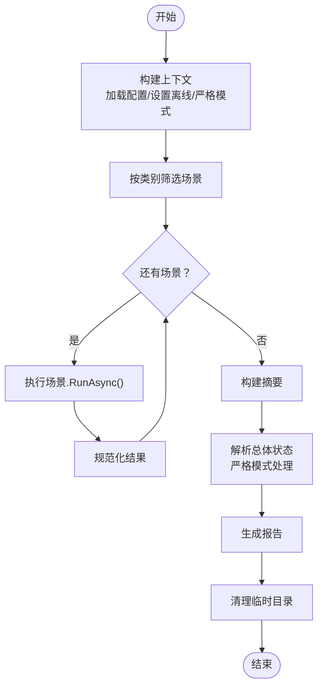
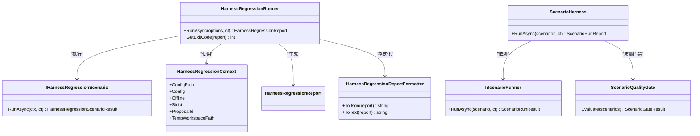

# 回归测试系统

<cite>
**本文档引用的文件**
- [HarnessRegressionRunner.cs](file://src/OpenClaw.Testing/HarnessRegressionRunner.cs)
- [HarnessRegressionScenarios.cs](file://src/OpenClaw.Testing/HarnessRegressionScenarios.cs)
- [HarnessRegressionModels.cs](file://src/OpenClaw.Testing/HarnessRegressionModels.cs)
- [HarnessRegressionInterfaces.cs](file://src/OpenClaw.Testing/HarnessRegressionInterfaces.cs)
- [HarnessRegressionJsonContext.cs](file://src/OpenClaw.Testing/HarnessRegressionJsonContext.cs)
- [ScenarioHarness.cs](file://src/OpenClaw.Testing/ScenarioHarness.cs)
- [ScenarioInterfaces.cs](file://src/OpenClaw.Testing/ScenarioInterfaces.cs)
- [ScenarioModels.cs](file://src/OpenClaw.Testing/ScenarioModels.cs)
- [ScenarioOracles.cs](file://src/OpenClaw.Testing/ScenarioOracles.cs)
- [ScenarioQualityGate.cs](file://src/OpenClaw.Testing/ScenarioQualityGate.cs)
- [ScenarioReports.cs](file://src/OpenClaw.Testing/ScenarioReports.cs)
- [HarnessCommands.cs](file://src/OpenClaw.Cli/HarnessCommands.cs)
- [TestingCommands.cs](file://src/OpenClaw.Cli/TestingCommands.cs)
- [HarnessRegressionTests.cs](file://src/OpenClaw.Tests/HarnessRegressionTests.cs)
- [OpenClaw.Testing.csproj](file://src/OpenClaw.Testing/OpenClaw.Testing.csproj)
</cite>

## 目录
1. [简介](#简介)
2. [项目结构](#项目结构)
3. [核心组件](#核心组件)
4. [架构总览](#架构总览)
5. [详细组件分析](#详细组件分析)
6. [依赖关系分析](#依赖关系分析)
7. [性能考虑](#性能考虑)
8. [故障排除指南](#故障排除指南)
9. [结论](#结论)
10. [附录](#附录)

## 简介
本文件为回归测试系统的完整技术文档，聚焦于Harness回归测试框架的设计与实现。内容涵盖回归测试的执行机制、质量门禁、报告生成与输出格式、质量标准与失败处理策略，以及配置参数与监控指标。文档同时详解HarnessRegressionRunner的工作流程、场景执行顺序与结果验证，并提供CLI命令使用说明与最佳实践。

## 项目结构
回归测试系统主要由Testing子项目与CLI命令组成，Testing子项目提供回归测试运行器、场景与断言（Oracle）、报告生成等能力；CLI命令提供便捷的测试执行入口与参数解析。

**图表来源**
- [HarnessRegressionRunner.cs:7-68](file://src/OpenClaw.Testing/HarnessRegressionRunner.cs#L7-L68)
- [HarnessRegressionScenarios.cs:15-36](file://src/OpenClaw.Testing/HarnessRegressionScenarios.cs#L15-L36)
- [HarnessRegressionModels.cs:39-77](file://src/OpenClaw.Testing/HarnessRegressionModels.cs#L39-L77)
- [HarnessRegressionReportFormatter.cs:334-382](file://src/OpenClaw.Testing/HarnessRegressionRunner.cs#L334-L382)
- [ScenarioHarness.cs:123-171](file://src/OpenClaw.Testing/ScenarioHarness.cs#L123-L171)
- [ScenarioOracles.cs:33-62](file://src/OpenClaw.Testing/ScenarioOracles.cs#L33-L62)
- [ScenarioQualityGate.cs:16-74](file://src/OpenClaw.Testing/ScenarioQualityGate.cs#L16-L74)
- [ScenarioReports.cs:6-96](file://src/OpenClaw.Testing/ScenarioReports.cs#L6-L96)
- [HarnessCommands.cs:14-100](file://src/OpenClaw.Cli/HarnessCommands.cs#L14-L100)
- [TestingCommands.cs:12-82](file://src/OpenClaw.Cli/TestingCommands.cs#L12-L82)

**章节来源**
- [OpenClaw.Testing.csproj:1-15](file://src/OpenClaw.Testing/OpenClaw.Testing.csproj#L1-L15)

## 核心组件
- HarnessRegressionRunner：回归测试主运行器，负责构建上下文、选择场景、执行、汇总统计、计算总体状态与退出码。
- HarnessRegressionScenarios：内置默认场景集合，覆盖引导、安全、审批、内存、会话、合约序列化、MCP/兼容请求形状、学习策略、托管技能、部署与文档等类别。
- HarnessRegressionReportFormatter：文本与JSON两种报告格式化器，支持标准化输出与可读性报告。
- ScenarioHarness：面向Agent场景的运行器，按脚本化轨迹执行并用多种Oracle进行断言。
- ScenarioOracles：工具调用、最终答案、审批请求、无危险工具等断言实现。
- ScenarioQualityGate：对Agent场景集进行质量门禁检查，确保场景完整性与安全性要求。
- ScenarioReports：Markdown与JSON报告生成、追踪写入与最新报告加载。
- CLI命令：HarnessCommands提供harness/test/regression子命令；TestingCommands提供test run/gates/report/init子命令。

**章节来源**
- [HarnessRegressionRunner.cs:7-68](file://src/OpenClaw.Testing/HarnessRegressionRunner.cs#L7-L68)
- [HarnessRegressionScenarios.cs:15-36](file://src/OpenClaw.Testing/HarnessRegressionScenarios.cs#L15-L36)
- [HarnessRegressionReportFormatter.cs:334-382](file://src/OpenClaw.Testing/HarnessRegressionRunner.cs#L334-L382)
- [ScenarioHarness.cs:123-171](file://src/OpenClaw.Testing/ScenarioHarness.cs#L123-L171)
- [ScenarioOracles.cs:33-62](file://src/OpenClaw.Testing/ScenarioOracles.cs#L33-L62)
- [ScenarioQualityGate.cs:16-74](file://src/OpenClaw.Testing/ScenarioQualityGate.cs#L16-L74)
- [ScenarioReports.cs:6-96](file://src/OpenClaw.Testing/ScenarioReports.cs#L6-L96)
- [HarnessCommands.cs:14-100](file://src/OpenClaw.Cli/HarnessCommands.cs#L14-L100)
- [TestingCommands.cs:12-82](file://src/OpenClaw.Cli/TestingCommands.cs#L12-L82)

## 架构总览
下图展示Harness回归测试从CLI到运行器再到场景与报告的整体交互：

**图表来源**
- [HarnessCommands.cs:67-100](file://src/OpenClaw.Cli/HarnessCommands.cs#L67-L100)
- [HarnessRegressionRunner.cs:18-68](file://src/OpenClaw.Testing/HarnessRegressionRunner.cs#L18-L68)
- [HarnessRegressionRunner.cs:90-127](file://src/OpenClaw.Testing/HarnessRegressionRunner.cs#L90-L127)
- [HarnessRegressionRunner.cs:129-137](file://src/OpenClaw.Testing/HarnessRegressionRunner.cs#L129-L137)
- [HarnessRegressionRunner.cs:158-187](file://src/OpenClaw.Testing/HarnessRegressionRunner.cs#L158-L187)
- [HarnessRegressionRunner.cs:189-229](file://src/OpenClaw.Testing/HarnessRegressionRunner.cs#L189-L229)
- [HarnessRegressionReportFormatter.cs:334-382](file://src/OpenClaw.Testing/HarnessRegressionRunner.cs#L334-L382)

## 详细组件分析

### HarnessRegressionRunner 工作流与执行机制
- 上下文构建：根据传入的配置路径、离线模式、严格模式等选项构建上下文，尝试加载GatewayConfig并记录错误信息。
- 场景选择：支持按类别过滤，默认返回全部内置场景。
- 执行顺序：按选择后的顺序依次执行，支持取消令牌中断；每个场景返回的结果都会被规范化（状态、严重性、时间戳、证据等）。
- 汇总与总体状态：统计总数、通过、失败、跳过、警告、不适用；严格模式下将“警告”和“跳过”的必需项视为失败。
- 退出码：若存在必需失败项则返回非零；严格模式下存在必需警告或跳过也返回非零。
- 清理：无论成功与否，最终清理临时工作目录。

**图表来源**
- [HarnessRegressionRunner.cs:18-68](file://src/OpenClaw.Testing/HarnessRegressionRunner.cs#L18-L68)
- [HarnessRegressionRunner.cs:90-127](file://src/OpenClaw.Testing/HarnessRegressionRunner.cs#L90-L127)
- [HarnessRegressionRunner.cs:129-137](file://src/OpenClaw.Testing/HarnessRegressionRunner.cs#L129-L137)
- [HarnessRegressionRunner.cs:158-187](file://src/OpenClaw.Testing/HarnessRegressionRunner.cs#L158-L187)
- [HarnessRegressionRunner.cs:189-229](file://src/OpenClaw.Testing/HarnessRegressionRunner.cs#L189-L229)
- [HarnessRegressionRunner.cs:307-322](file://src/OpenClaw.Testing/HarnessRegressionRunner.cs#L307-L322)

**章节来源**
- [HarnessRegressionRunner.cs:7-68](file://src/OpenClaw.Testing/HarnessRegressionRunner.cs#L7-L68)
- [HarnessRegressionRunner.cs:70-88](file://src/OpenClaw.Testing/HarnessRegressionRunner.cs#L70-L88)

### 场景执行顺序与结果验证
- 场景顺序：按选择后的顺序逐一执行，保证可重复性与可追踪性。
- 结果验证：每个场景返回HarnessRegressionScenarioResult，Runner在收集后统一规范化，确保字段一致性（如状态大小写归一化、时长非负、必要字段填充）。
- 总体状态：严格模式下，必需场景的“警告”和“跳过”会被判定为失败；否则以“失败优先、警告次之、通过最后”的规则确定整体状态。

**章节来源**
- [HarnessRegressionRunner.cs:36-42](file://src/OpenClaw.Testing/HarnessRegressionRunner.cs#L36-L42)
- [HarnessRegressionRunner.cs:158-187](file://src/OpenClaw.Testing/HarnessRegressionRunner.cs#L158-L187)
- [HarnessRegressionRunner.cs:203-229](file://src/OpenClaw.Testing/HarnessRegressionRunner.cs#L203-L229)

### 质量门禁与推荐建议
- 质量门禁（Harness级别）：校验场景集合是否为空、场景ID/标题是否存在、是否声明了明确的期望行为、高危/关键场景是否至少声明一个断言、工具使用场景是否声明了必须/禁止调用的工具、涉及审批/安全的场景是否声明了相应断言；并检测重复ID。
- 推荐建议：基于结果自动给出后续操作建议，如验证配置、审查安全态势、检查模型配置、复核跳过/不适用项等。

**章节来源**
- [ScenarioQualityGate.cs:25-74](file://src/OpenClaw.Testing/ScenarioQualityGate.cs#L25-L74)
- [HarnessRegressionRunner.cs:231-292](file://src/OpenClaw.Testing/HarnessRegressionRunner.cs#L231-L292)

### 报告生成与格式
- 文本报告：包含每条结果的状态标记、ID与摘要，以及总结行与建议列表。
- JSON报告：使用源生成的JsonContext序列化，便于自动化消费与二次处理。
- 运行器退出码：用于CI流水线判断测试成败。

**章节来源**
- [HarnessRegressionReportFormatter.cs:334-382](file://src/OpenClaw.Testing/HarnessRegressionRunner.cs#L334-L382)
- [HarnessRegressionRunner.cs:70-88](file://src/OpenClaw.Testing/HarnessRegressionRunner.cs#L70-L88)

### Agent 场景测试（补充）
- 场景运行器：按脚本化轨迹执行，逐个断言评估，生成运行报告与Markdown摘要。
- 断言类型：工具调用/未调用、最大调用次数、最终答案包含/不包含、审批请求存在/不存在、无危险工具等。
- 质量门禁：对Agent场景集进行完整性与安全性检查。

**章节来源**
- [ScenarioHarness.cs:123-171](file://src/OpenClaw.Testing/ScenarioHarness.cs#L123-L171)
- [ScenarioOracles.cs:33-62](file://src/OpenClaw.Testing/ScenarioOracles.cs#L33-L62)
- [ScenarioOracles.cs:183-307](file://src/OpenClaw.Testing/ScenarioOracles.cs#L183-L307)
- [ScenarioOracles.cs:309-347](file://src/OpenClaw.Testing/ScenarioOracles.cs#L309-L347)
- [ScenarioOracles.cs:350-408](file://src/OpenClaw.Testing/ScenarioOracles.cs#L350-L408)
- [ScenarioQualityGate.cs:16-74](file://src/OpenClaw.Testing/ScenarioQualityGate.cs#L16-L74)

## 依赖关系分析
- 运行器依赖场景集合与上下文模型，输出报告与退出码。
- 场景集合包含多个领域场景（引导、安全、审批、内存、会话、合约/证据/治理序列化、MCP/兼容请求、学习策略、托管技能、部署、文档）。
- CLI命令封装运行器与场景运行器，提供参数解析与输出控制。
- 测试项目包含针对运行器行为的单元测试，覆盖状态归一化、严格模式、离线模式、类别过滤、输出格式等。

**图表来源**
- [HarnessRegressionRunner.cs:7-68](file://src/OpenClaw.Testing/HarnessRegressionRunner.cs#L7-L68)
- [HarnessRegressionModels.cs:49-61](file://src/OpenClaw.Testing/HarnessRegressionModels.cs#L49-L61)
- [HarnessRegressionScenarios.cs:15-36](file://src/OpenClaw.Testing/HarnessRegressionScenarios.cs#L15-L36)
- [HarnessRegressionReportFormatter.cs:334-382](file://src/OpenClaw.Testing/HarnessRegressionRunner.cs#L334-L382)
- [ScenarioHarness.cs:123-171](file://src/OpenClaw.Testing/ScenarioHarness.cs#L123-L171)
- [ScenarioInterfaces.cs:3-6](file://src/OpenClaw.Testing/ScenarioInterfaces.cs#L3-L6)
- [ScenarioQualityGate.cs:16-25](file://src/OpenClaw.Testing/ScenarioQualityGate.cs#L16-L25)

**章节来源**
- [HarnessRegressionRunner.cs:7-68](file://src/OpenClaw.Testing/HarnessRegressionRunner.cs#L7-L68)
- [HarnessRegressionScenarios.cs:15-36](file://src/OpenClaw.Testing/HarnessRegressionScenarios.cs#L15-L36)
- [HarnessRegressionReportFormatter.cs:334-382](file://src/OpenClaw.Testing/HarnessRegressionRunner.cs#L334-L382)
- [ScenarioHarness.cs:123-171](file://src/OpenClaw.Testing/ScenarioHarness.cs#L123-L171)
- [ScenarioInterfaces.cs:3-6](file://src/OpenClaw.Testing/ScenarioInterfaces.cs#L3-L6)
- [ScenarioQualityGate.cs:16-25](file://src/OpenClaw.Testing/ScenarioQualityGate.cs#L16-L25)

## 性能考虑
- 并发与取消：运行器在遍历场景时支持取消令牌，避免长时间阻塞；场景内部应尽快响应取消。
- I/O最小化：临时工作目录仅在运行期间存在，结束后清理，减少磁盘占用。
- 序列化开销：报告使用源生成的JsonContext，提升序列化/反序列化性能与准确性。
- 离线模式：默认离线执行，避免网络与凭证检查带来的不确定性与延迟。

[本节为通用指导，无需特定文件引用]

## 故障排除指南
- 无场景匹配：当指定类别无匹配场景时，运行器会生成一条“未选择到场景”的失败结果，便于快速定位问题。
- 严格模式失败：严格模式下，必需场景的警告或跳过会被视为失败，需检查配置或场景设计。
- 离线模式提示：离线模式会跳过凭证与网络检查，并在结果详情中提示。
- 临时目录清理：若中途取消，运行器会尝试删除临时目录，确保资源回收。
- CLI参数错误：未知子命令或缺少必要参数时，CLI会打印帮助信息并返回非零退出码。

**章节来源**
- [HarnessRegressionRunner.cs:139-156](file://src/OpenClaw.Testing/HarnessRegressionRunner.cs#L139-L156)
- [HarnessRegressionRunner.cs:203-229](file://src/OpenClaw.Testing/HarnessRegressionRunner.cs#L203-L229)
- [HarnessRegressionRunner.cs:307-322](file://src/OpenClaw.Testing/HarnessRegressionRunner.cs#L307-L322)
- [HarnessRegressionTests.cs:90-99](file://src/OpenClaw.Tests/HarnessRegressionTests.cs#L90-L99)
- [HarnessRegressionTests.cs:146-178](file://src/OpenClaw.Tests/HarnessRegressionTests.cs#L146-L178)

## 结论
Harness回归测试系统通过模块化的运行器、丰富的场景集合与严格的门禁机制，提供了稳定可靠的自动化回归保障。其离线执行、可读报告与清晰的退出码策略，使其非常适合集成到CI/CD流水线中，作为发布前的质量门禁。配合CLI命令，用户可以灵活地选择场景类别、输出格式与严格模式，满足不同环境下的测试需求。

[本节为总结性内容，无需特定文件引用]

## 附录

### 回归测试配置与执行参数
- CLI命令：openclaw harness test / regression
  - 参数：
    - --config：配置文件路径
    - --category：场景类别（如onboarding/security/approvals等）
    - --json：输出JSON格式
    - --offline：离线模式（默认开启）
    - --strict：严格模式（将警告/跳过视为失败）
    - --proposal：提案ID
    - --output：输出文件路径
  - 行为：解析参数后调用运行器，渲染文本或JSON报告，返回退出码

**章节来源**
- [HarnessCommands.cs:67-100](file://src/OpenClaw.Cli/HarnessCommands.cs#L67-L100)
- [HarnessRegressionModels.cs:39-47](file://src/OpenClaw.Testing/HarnessRegressionModels.cs#L39-L47)

### 测试报告格式
- 文本格式：包含每条结果的状态标记、ID与摘要、总结行与建议列表。
- JSON格式：使用源生成的JsonContext序列化，字段包含报告ID、起止时间、持续时间、配置路径、提案ID、离线/严格标志、总体状态、结果列表、摘要与建议。

**章节来源**
- [HarnessRegressionReportFormatter.cs:334-382](file://src/OpenClaw.Testing/HarnessRegressionRunner.cs#L334-L382)
- [HarnessRegressionModels.cs:63-114](file://src/OpenClaw.Testing/HarnessRegressionModels.cs#L63-L114)

### 质量标准与失败处理策略
- 质量标准：
  - 场景集合不能为空
  - 场景需具备ID与标题
  - 必须声明明确的期望行为
  - 高危/关键场景需声明断言
  - 工具使用场景需声明必须/禁止调用的工具
  - 审批/安全场景需声明相应断言
  - 不得出现重复ID
- 失败处理：
  - 严格模式下，必需场景的警告/跳过视为失败
  - 任何必需失败项直接导致非零退出码
  - 自动推荐下一步行动（如验证配置、审查安全态势、检查模型配置等）

**章节来源**
- [ScenarioQualityGate.cs:25-74](file://src/OpenClaw.Testing/ScenarioQualityGate.cs#L25-L74)
- [HarnessRegressionRunner.cs:203-229](file://src/OpenClaw.Testing/HarnessRegressionRunner.cs#L203-L229)
- [HarnessRegressionRunner.cs:231-292](file://src/OpenClaw.Testing/HarnessRegressionRunner.cs#L231-L292)

### 监控指标与建议
- 关键指标：
  - 总数、通过、失败、跳过、警告、不适用
  - 高危/关键失败数量
  - 运行时长（毫秒）
- 建议：
  - 在CI中启用严格模式以提高质量门槛
  - 对高危/关键场景增加断言覆盖率
  - 使用JSON报告对接自动化分析工具

**章节来源**
- [ScenarioReports.cs:6-96](file://src/OpenClaw.Testing/ScenarioReports.cs#L6-L96)
- [ScenarioHarness.cs:144-146](file://src/OpenClaw.Testing/ScenarioHarness.cs#L144-L146)