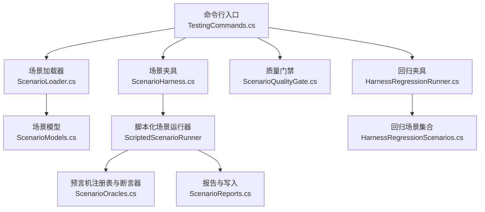
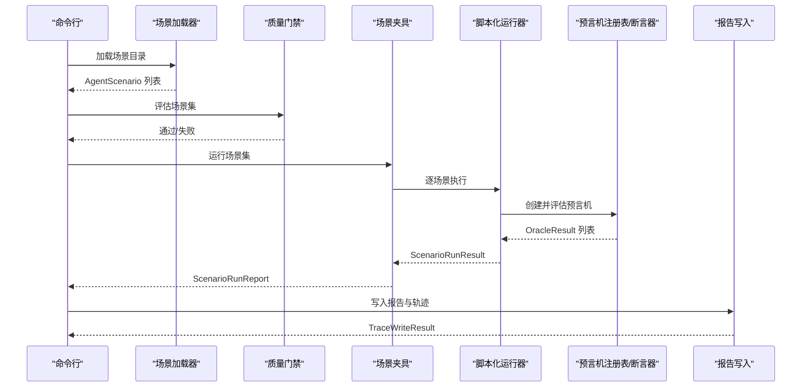
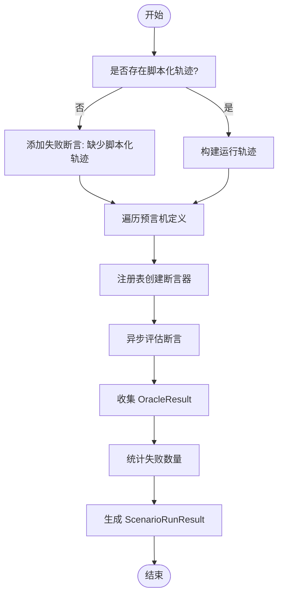
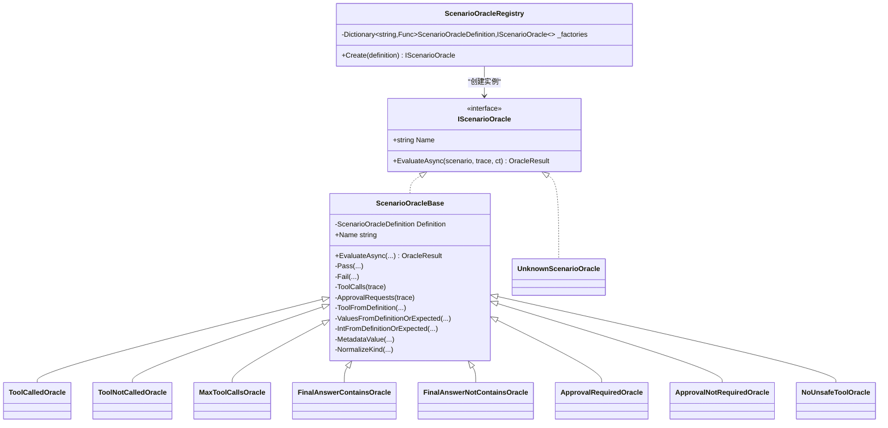
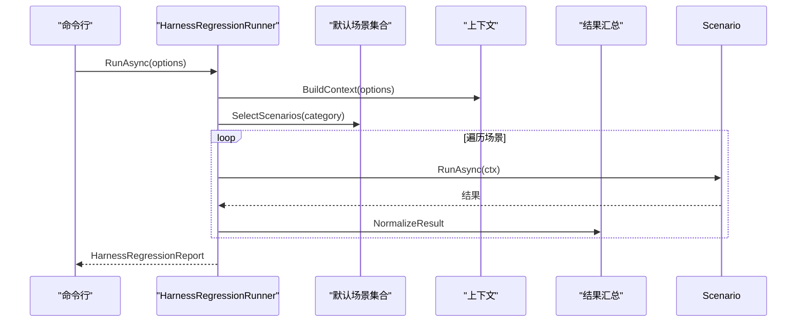
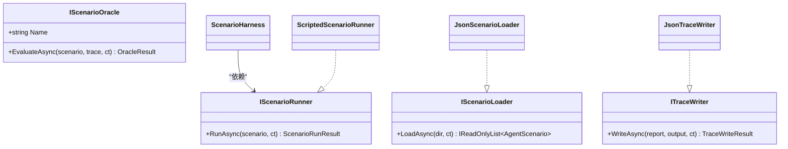

# 场景测试

<cite>
**本文引用的文件列表**
- [ScenarioLoader.cs](file://src/OpenClaw.Testing/ScenarioLoader.cs)
- [ScenarioModels.cs](file://src/OpenClaw.Testing/ScenarioModels.cs)
- [ScenarioHarness.cs](file://src/OpenClaw.Testing/ScenarioHarness.cs)
- [ScenarioInterfaces.cs](file://src/OpenClaw.Testing/ScenarioInterfaces.cs)
- [ScenarioOracles.cs](file://src/OpenClaw.Testing/ScenarioOracles.cs)
- [ScenarioReports.cs](file://src/OpenClaw.Testing/ScenarioReports.cs)
- [ScenarioQualityGate.cs](file://src/OpenClaw.Testing/ScenarioQualityGate.cs)
- [HarnessRegressionRunner.cs](file://src/OpenClaw.Testing/HarnessRegressionRunner.cs)
- [HarnessRegressionScenarios.cs](file://src/OpenClaw.Testing/HarnessRegressionScenarios.cs)
- [TestingCommands.cs](file://src/OpenClaw.Cli/TestingCommands.cs)
- [ScenarioJsonContext.cs](file://src/OpenClaw.Testing/ScenarioJsonContext.cs)
</cite>

## 目录
1. [简介](#简介)
2. [项目结构](#项目结构)
3. [核心组件](#核心组件)
4. [架构总览](#架构总览)
5. [详细组件分析](#详细组件分析)
6. [依赖关系分析](#依赖关系分析)
7. [性能考量](#性能考量)
8. [故障排查指南](#故障排查指南)
9. [结论](#结论)
10. [附录：编写指南与最佳实践](#附录编写指南与最佳实践)

## 简介
本文件面向“场景测试”子系统，系统性阐述场景加载器、场景模型、夹具（Harness）与预言机（Oracle）的设计与实现，以及场景分类、场景选择器、执行流程、断言与预言机设计、配置管理、参数传递与结果验证等机制。同时提供编写指南、最佳实践、调试技巧与性能优化建议，帮助开发者高效构建可维护、可扩展的场景测试体系。

## 项目结构
场景测试位于 OpenClaw.Testing 命名空间下，围绕以下关键模块组织：
- 场景加载与模型：负责从 JSON 文件加载场景，标准化数据结构，生成运行时模型。
- 执行夹具：负责按顺序执行场景，收集运行轨迹与断言结果，并输出报告。
- 预言机体系：通过类型化的断言器对运行轨迹进行判定，覆盖工具调用、最终答案、审批与安全等维度。
- 报告与归档：生成 Markdown 报告与 JSON 结果，支持最新报告重生成与归档读取。
- 质量门禁：对场景集进行质量检查，确保必要字段与风险级别匹配。
- 回归夹具：针对网关与平台能力的回归场景集合，支持分类选择与严格模式。

图表来源
- [TestingCommands.cs:12-82](file://src/OpenClaw.Cli/TestingCommands.cs#L12-L82)
- [ScenarioLoader.cs:5-40](file://src/OpenClaw.Testing/ScenarioLoader.cs#L5-L40)
- [ScenarioHarness.cs:123-178](file://src/OpenClaw.Testing/ScenarioHarness.cs#L123-L178)
- [ScenarioOracles.cs:33-62](file://src/OpenClaw.Testing/ScenarioOracles.cs#L33-L62)
- [ScenarioReports.cs:98-151](file://src/OpenClaw.Testing/ScenarioReports.cs#L98-L151)
- [ScenarioQualityGate.cs:25-74](file://src/OpenClaw.Testing/ScenarioQualityGate.cs#L25-L74)
- [HarnessRegressionRunner.cs:7-68](file://src/OpenClaw.Testing/HarnessRegressionRunner.cs#L7-L68)
- [HarnessRegressionScenarios.cs:17-35](file://src/OpenClaw.Testing/HarnessRegressionScenarios.cs#L17-L35)

章节来源
- [TestingCommands.cs:12-82](file://src/OpenClaw.Cli/TestingCommands.cs#L12-L82)
- [ScenarioLoader.cs:5-40](file://src/OpenClaw.Testing/ScenarioLoader.cs#L5-L40)
- [ScenarioHarness.cs:123-178](file://src/OpenClaw.Testing/ScenarioHarness.cs#L123-L178)
- [ScenarioOracles.cs:33-62](file://src/OpenClaw.Testing/ScenarioOracles.cs#L33-L62)
- [ScenarioReports.cs:98-151](file://src/OpenClaw.Testing/ScenarioReports.cs#L98-L151)
- [ScenarioQualityGate.cs:25-74](file://src/OpenClaw.Testing/ScenarioQualityGate.cs#L25-L74)
- [HarnessRegressionRunner.cs:7-68](file://src/OpenClaw.Testing/HarnessRegressionRunner.cs#L7-L68)
- [HarnessRegressionScenarios.cs:17-35](file://src/OpenClaw.Testing/HarnessRegressionScenarios.cs#L17-L35)

## 核心组件
- 场景加载器：递归扫描目录，解析 JSON 数组或对象，标准化空值与默认值，生成统一 AgentScenario 列表。
- 场景模型：定义场景、输入、期望、预言机定义、脚本化轨迹、运行轨迹、断言结果、运行报告与摘要等数据结构。
- 场景夹具：顺序执行场景，汇总预言机结果，生成运行报告与 Markdown 报告。
- 预言机注册表：根据类型创建具体断言器，内置工具调用、最终答案、审批与安全等断言器。
- 报告与写入：将运行轨迹与报告序列化到磁盘，支持最新报告重生成。
- 质量门禁：校验场景集完整性与风险级别一致性，避免低质量场景进入执行。
- 回归夹具：提供平台级回归场景集合，支持按类别筛选与严格模式退出码控制。

章节来源
- [ScenarioLoader.cs:5-40](file://src/OpenClaw.Testing/ScenarioLoader.cs#L5-L40)
- [ScenarioModels.cs:15-159](file://src/OpenClaw.Testing/ScenarioModels.cs#L15-L159)
- [ScenarioHarness.cs:123-178](file://src/OpenClaw.Testing/ScenarioHarness.cs#L123-L178)
- [ScenarioOracles.cs:33-62](file://src/OpenClaw.Testing/ScenarioOracles.cs#L33-L62)
- [ScenarioReports.cs:98-151](file://src/OpenClaw.Testing/ScenarioReports.cs#L98-L151)
- [ScenarioQualityGate.cs:25-74](file://src/OpenClaw.Testing/ScenarioQualityGate.cs#L25-L74)
- [HarnessRegressionRunner.cs:7-68](file://src/OpenClaw.Testing/HarnessRegressionRunner.cs#L7-L68)
- [HarnessRegressionScenarios.cs:17-35](file://src/OpenClaw.Testing/HarnessRegressionScenarios.cs#L17-L35)

## 架构总览
场景测试采用“命令行驱动 + 模型驱动 + 预言机判定”的分层架构：
- 命令行层：解析参数、初始化样例、执行场景、生成报告、运行质量门禁。
- 加载与模型层：统一场景数据结构，保证空值与默认值规范化。
- 执行层：脚本化运行器基于脚本化轨迹构建运行轨迹，逐条预言机断言。
- 报告层：生成 JSON 结果与 Markdown 报告，支持归档与重生成。
- 回归层：提供平台级回归场景集合，支持分类选择与严格模式。

图表来源
- [TestingCommands.cs:60-82](file://src/OpenClaw.Cli/TestingCommands.cs#L60-L82)
- [ScenarioHarness.cs:129-171](file://src/OpenClaw.Testing/ScenarioHarness.cs#L129-L171)
- [ScenarioOracles.cs:58-61](file://src/OpenClaw.Testing/ScenarioOracles.cs#L58-L61)
- [ScenarioReports.cs:98-151](file://src/OpenClaw.Testing/ScenarioReports.cs#L98-L151)

## 详细组件分析

### 场景加载器（JsonScenarioLoader）
职责
- 递归扫描目录，枚举所有 .json 文件，按字典序排序。
- 支持数组与对象两种根节点格式，分别反序列化为列表或单个场景。
- 对场景、输入、期望、预言机、脚本化轨迹与步骤进行空值与默认值标准化。
- 使用源生成上下文进行高性能 JSON 反序列化。

关键点
- 目录不存在时返回空列表，避免异常。
- 归一化逻辑确保字段一致性，便于后续断言与报告。
- 使用 System.Text.Json.SourceGeneration 提升性能与稳定性。

章节来源
- [ScenarioLoader.cs:5-40](file://src/OpenClaw.Testing/ScenarioLoader.cs#L5-L40)
- [ScenarioLoader.cs:42-153](file://src/OpenClaw.Testing/ScenarioLoader.cs#L42-L153)
- [ScenarioJsonContext.cs:5-26](file://src/OpenClaw.Testing/ScenarioJsonContext.cs#L5-L26)

### 场景模型（AgentScenario 与相关类型）
数据结构
- AgentScenario：场景标识、标题、描述、风险、类型、标签、输入、期望、预言机、脚本化轨迹、元数据。
- ScenarioInput：用户消息、上下文、变量。
- ScenarioExpected：必须调用/禁止调用工具、最终答案包含/不包含、最大工具调用次数、是否需要审批、期望状态、事件等。
- ScenarioOracleDefinition：预言机类型、工具名、值、上限、工具列表、元数据。
- ScriptedTrace/AgentRunTrace/TraceStep：脚本化轨迹与运行轨迹，包含步骤、时间戳、消息、工具名、参数、结果、错误、状态路径、来源/去向、审批 ID、元数据。
- OracleResult/ScenarioRunResult/ScenarioRunReport/ScenarioRunSummary：断言结果、运行结果、运行报告与摘要。
- TraceStepKinds/ScenarioRunStatuses：轨迹步骤类型与运行状态常量。

复杂度与性能
- 字段均为只读初始化，便于并发访问与不可变语义。
- 元数据字典使用大小写不敏感比较器，提升键查找稳定性。

章节来源
- [ScenarioModels.cs:15-159](file://src/OpenClaw.Testing/ScenarioModels.cs#L15-L159)

### 场景夹具与运行器（ScenarioHarness 与 ScriptedScenarioRunner）
职责
- ScenarioHarness：顺序执行多个场景，聚合结果，生成运行报告与 Markdown 报告。
- ScriptedScenarioRunner：基于脚本化轨迹构建 AgentRunTrace，逐条预言机断言，产出 OracleResult 列表与最终通过/失败状态。

执行流程
- 若未提供脚本化轨迹，直接添加一条失败的断言。
- 若场景未声明任何预言机，添加一条失败断言，强调“仅有执行无断言的场景不具备意义”。
- 遍历预言机定义，通过注册表创建断言器并异步评估，累积证据与消息。
- 统计失败数量，生成失败摘要与最终通过/失败标记。

图表来源
- [ScenarioHarness.cs:7-57](file://src/OpenClaw.Testing/ScenarioHarness.cs#L7-L57)
- [ScenarioHarness.cs:59-115](file://src/OpenClaw.Testing/ScenarioHarness.cs#L59-L115)
- [ScenarioOracles.cs:58-61](file://src/OpenClaw.Testing/ScenarioOracles.cs#L58-L61)

章节来源
- [ScenarioHarness.cs:123-178](file://src/OpenClaw.Testing/ScenarioHarness.cs#L123-L178)
- [ScenarioHarness.cs:7-57](file://src/OpenClaw.Testing/ScenarioHarness.cs#L7-L57)
- [ScenarioHarness.cs:59-115](file://src/OpenClaw.Testing/ScenarioHarness.cs#L59-L115)

### 预言机体系（ScenarioOracleRegistry 与断言器）
职责
- 注册表：根据类型映射工厂函数，创建具体断言器；未知类型返回 UnknownScenarioOracle。
- 断言器基类：提供通用工具（断言通过/失败、步骤过滤、工具名提取、元数据与值解析、稳定字符串拼接、种类规范化等）。
- 内置断言器：
  - 工具调用/未调用：校验必须/禁止调用的工具集合。
  - 最大工具调用次数：限制工具调用上限。
  - 最终答案包含/不包含：校验最终回答文本。
  - 审批请求/无需审批：校验审批请求存在与否。
  - 无危险工具：校验危险工具调用是否获得审批，支持默认危险工具列表与场景元数据扩展。

图表来源
- [ScenarioOracles.cs:33-62](file://src/OpenClaw.Testing/ScenarioOracles.cs#L33-L62)
- [ScenarioOracles.cs:64-165](file://src/OpenClaw.Testing/ScenarioOracles.cs#L64-L165)
- [ScenarioOracles.cs:183-239](file://src/OpenClaw.Testing/ScenarioOracles.cs#L183-L239)
- [ScenarioOracles.cs:241-259](file://src/OpenClaw.Testing/ScenarioOracles.cs#L241-L259)
- [ScenarioOracles.cs:261-307](file://src/OpenClaw.Testing/ScenarioOracles.cs#L261-L307)
- [ScenarioOracles.cs:309-348](file://src/OpenClaw.Testing/ScenarioOracles.cs#L309-L348)
- [ScenarioOracles.cs:350-408](file://src/OpenClaw.Testing/ScenarioOracles.cs#L350-L408)
- [ScenarioOracles.cs:167-181](file://src/OpenClaw.Testing/ScenarioOracles.cs#L167-L181)

章节来源
- [ScenarioOracles.cs:33-62](file://src/OpenClaw.Testing/ScenarioOracles.cs#L33-L62)
- [ScenarioOracles.cs:64-165](file://src/OpenClaw.Testing/ScenarioOracles.cs#L64-L165)
- [ScenarioOracles.cs:183-239](file://src/OpenClaw.Testing/ScenarioOracles.cs#L183-L239)
- [ScenarioOracles.cs:241-259](file://src/OpenClaw.Testing/ScenarioOracles.cs#L241-L259)
- [ScenarioOracles.cs:261-307](file://src/OpenClaw.Testing/ScenarioOracles.cs#L261-L307)
- [ScenarioOracles.cs:309-348](file://src/OpenClaw.Testing/ScenarioOracles.cs#L309-L348)
- [ScenarioOracles.cs:350-408](file://src/OpenClaw.Testing/ScenarioOracles.cs#L350-L408)
- [ScenarioOracles.cs:167-181](file://src/OpenClaw.Testing/ScenarioOracles.cs#L167-L181)

### 报告与写入（ScenarioMarkdownReport 与 JsonTraceWriter）
职责
- Markdown 报告：按场景生成表格与失败详情，内联代码转义与表格转义。
- JSON 写入：将运行报告与每个场景的运行轨迹写入磁盘，支持最新报告重生成与读取。

关键流程
- 写入前校验 runId 合法性（相对路径、不含路径分隔符）。
- 为每个场景生成独立轨迹文件，汇总到 results.json 与 report.md。
- 提供最新报告目录查找与反序列化辅助方法。

章节来源
- [ScenarioReports.cs:6-96](file://src/OpenClaw.Testing/ScenarioReports.cs#L6-L96)
- [ScenarioReports.cs:98-151](file://src/OpenClaw.Testing/ScenarioReports.cs#L98-L151)
- [ScenarioReports.cs:153-218](file://src/OpenClaw.Testing/ScenarioReports.cs#L153-L218)

### 质量门禁（ScenarioQualityGate）
职责
- 校验场景集：缺失 id/title、无显式期望行为、高危/关键场景缺少预言机、工具使用场景缺少 mustCall/mustNotCall、审批/安全场景缺少对应预言机、重复 id 等。
- 返回问题清单与整体通过状态。

章节来源
- [ScenarioQualityGate.cs:25-74](file://src/OpenClaw.Testing/ScenarioQualityGate.cs#L25-L74)
- [ScenarioQualityGate.cs:76-110](file://src/OpenClaw.Testing/ScenarioQualityGate.cs#L76-L110)

### 回归夹具与场景集合（HarnessRegressionRunner 与 HarnessRegressionScenarios）
职责
- HarnessRegressionRunner：构建上下文（配置路径、临时工作区、离线模式等），按类别选择场景，执行并汇总结果，计算总体状态与推荐项。
- HarnessRegressionScenarios：提供默认回归场景集合，涵盖引导、提供商、安全、工具、内存、会话、治理、MCP、OpenAI 兼容、学习策略、部署与文档等类别。

图表来源
- [HarnessRegressionRunner.cs:18-68](file://src/OpenClaw.Testing/HarnessRegressionRunner.cs#L18-L68)
- [HarnessRegressionRunner.cs:129-137](file://src/OpenClaw.Testing/HarnessRegressionRunner.cs#L129-L137)
- [HarnessRegressionScenarios.cs:17-35](file://src/OpenClaw.Testing/HarnessRegressionScenarios.cs#L17-L35)

章节来源
- [HarnessRegressionRunner.cs:7-68](file://src/OpenClaw.Testing/HarnessRegressionRunner.cs#L7-L68)
- [HarnessRegressionRunner.cs:129-137](file://src/OpenClaw.Testing/HarnessRegressionRunner.cs#L129-L137)
- [HarnessRegressionScenarios.cs:17-35](file://src/OpenClaw.Testing/HarnessRegressionScenarios.cs#L17-L35)

## 依赖关系分析
- 接口契约：IScenarioRunner、IScenarioOracle、IScenarioLoader、ITraceWriter 明确了各组件职责边界。
- 源生成上下文：ScenarioJsonContext 为场景相关类型提供源生成序列化上下文，提升性能与类型安全。
- 命令行集成：TestingCommands 将加载、质量门禁、执行、报告写入串联为完整流水线。

图表来源
- [ScenarioInterfaces.cs:3-29](file://src/OpenClaw.Testing/ScenarioInterfaces.cs#L3-L29)
- [ScenarioHarness.cs:123-127](file://src/OpenClaw.Testing/ScenarioHarness.cs#L123-L127)
- [ScenarioLoader.cs:5-10](file://src/OpenClaw.Testing/ScenarioLoader.cs#L5-L10)
- [ScenarioReports.cs:98-99](file://src/OpenClaw.Testing/ScenarioReports.cs#L98-L99)

章节来源
- [ScenarioInterfaces.cs:3-29](file://src/OpenClaw.Testing/ScenarioInterfaces.cs#L3-L29)
- [ScenarioHarness.cs:123-127](file://src/OpenClaw.Testing/ScenarioHarness.cs#L123-L127)
- [ScenarioLoader.cs:5-10](file://src/OpenClaw.Testing/ScenarioLoader.cs#L5-L10)
- [ScenarioReports.cs:98-99](file://src/OpenClaw.Testing/ScenarioReports.cs#L98-L99)

## 性能考量
- 源生成 JSON：通过 ScenarioJsonContext 与 System.Text.Json.SourceGeneration 减少反射开销，提升序列化/反序列化性能与内存占用。
- 异步与取消：大量异步操作与 CancellationToken 的使用，确保长任务可中断，避免阻塞。
- 数据结构不可变：模型字段只读初始化，减少锁竞争，提升并发安全性。
- 轻量断言：断言器内部使用集合与 LINQ 查询，注意在大规模轨迹上可能成为瓶颈，建议在场景设计中控制轨迹规模或分页处理。

[本节为通用性能讨论，不直接分析具体文件]

## 故障排查指南
常见问题与定位
- 场景文件缺失或格式错误：检查目录路径与 JSON 格式，确认根节点为对象或数组。
- 质量门禁失败：查看门禁报告中的具体问题（如缺失 id/title、高危场景缺少预言机等）。
- 无脚本化轨迹导致运行失败：为需要断言的场景提供 ScriptedTrace。
- 预言机类型未知：检查预言机类型拼写，或在注册表中添加新类型。
- 报告写入失败：检查输出目录权限与 runId 合法性（相对路径、不含非法字符）。

定位手段
- 命令行输出：TestingCommands 在失败时打印详细信息与建议。
- 门禁报告：ScenarioQualityGate 提供问题清单。
- 运行轨迹：JsonTraceWriter 输出每个场景的轨迹文件，便于人工核验。
- 最新报告重生成：JsonTraceWriter 支持从最新运行目录重建 Markdown 报告。

章节来源
- [TestingCommands.cs:101-114](file://src/OpenClaw.Cli/TestingCommands.cs#L101-L114)
- [TestingCommands.cs:143-153](file://src/OpenClaw.Cli/TestingCommands.cs#L143-L153)
- [ScenarioQualityGate.cs:25-74](file://src/OpenClaw.Testing/ScenarioQualityGate.cs#L25-L74)
- [ScenarioReports.cs:153-178](file://src/OpenClaw.Testing/ScenarioReports.cs#L153-L178)

## 结论
场景测试子系统以清晰的接口契约、规范化的数据模型、可扩展的预言机体系与完善的报告机制为核心，提供了从场景加载、断言执行到报告输出的完整闭环。通过质量门禁与回归夹具，进一步提升了场景集的质量与平台能力的稳定性。建议在实际使用中遵循最佳实践，合理设计场景与预言机，充分利用报告与门禁工具，持续改进测试质量与效率。

[本节为总结性内容，不直接分析具体文件]

## 附录：编写指南与最佳实践

- 场景编写指南
  - 必填字段：id、title、risk、type、tags、input.userMessage、expected。
  - 期望行为：至少声明一种显式期望（工具调用/禁止、最终答案包含/不包含、最大调用次数、审批需求、状态或事件）。
  - 高危/关键场景：必须声明至少一个预言机，优先覆盖审批与安全场景。
  - 工具使用场景：必须声明 mustCallTools 或 mustNotCallTools。
  - 脚本化轨迹：为可断言场景提供 ScriptedTrace，包含最终答案、状态与步骤序列。
  - 元数据：使用 Metadata 传递额外上下文，如自定义危险工具列表。

- 参数传递与配置
  - 命令行参数：--scenarios/--scenario-dir 指定场景目录；--output 指定输出根目录；--fail-on 控制失败策略（any/high）。
  - 质量门禁：先运行 gates 子命令，修复问题后再执行 run。
  - 回归夹具：通过 --category 选择场景类别，--strict 使跳过/警告触发非零退出码。

- 断言与预言机设计
  - 优先使用内置预言机类型：tool-called、tool-not-called、max-tool-calls、final-answer-contains、final-answer-not-contains、approval-required、approval-not-required、no-unsafe-tool。
  - 自定义危险工具：在预言机定义的 Tools 中添加，或在场景 Metadata 中设置 unsafeTools 键。
  - 复杂断言：通过组合多个预言机实现，避免单一预言机过于复杂。

- 调试技巧
  - 查看最新报告：使用 report 子命令重生成 Markdown 报告。
  - 检查轨迹文件：每个场景对应一个轨迹文件，便于人工核验。
  - 分类执行：使用 --category 仅运行特定类别，快速定位问题。

- 性能优化
  - 使用源生成 JSON 上下文，避免反射。
  - 控制场景轨迹规模，减少断言器扫描范围。
  - 并行化场景执行（当前顺序执行，未来可扩展）。

- 示例参考
  - 命令行样例：TestingCommands 提供 init、run、report、gates 子命令示例。
  - 场景样例：TestingCommands 内置样例场景 JSON，展示工具使用与审批安全场景。

章节来源
- [TestingCommands.cs:36-58](file://src/OpenClaw.Cli/TestingCommands.cs#L36-L58)
- [TestingCommands.cs:123-133](file://src/OpenClaw.Cli/TestingCommands.cs#L123-L133)
- [TestingCommands.cs:173-270](file://src/OpenClaw.Cli/TestingCommands.cs#L173-L270)
- [ScenarioOracles.cs:18-31](file://src/OpenClaw.Testing/ScenarioOracles.cs#L18-L31)
- [ScenarioOracles.cs:350-395](file://src/OpenClaw.Testing/ScenarioOracles.cs#L350-L395)