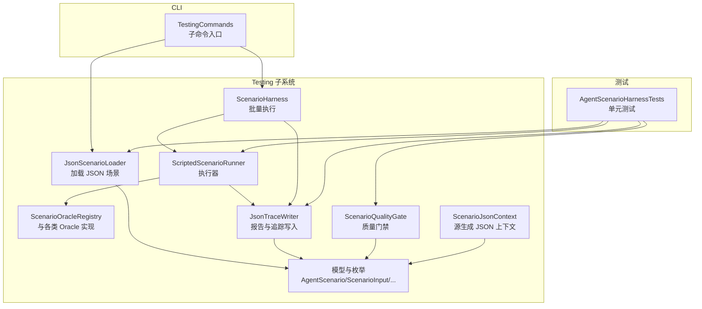
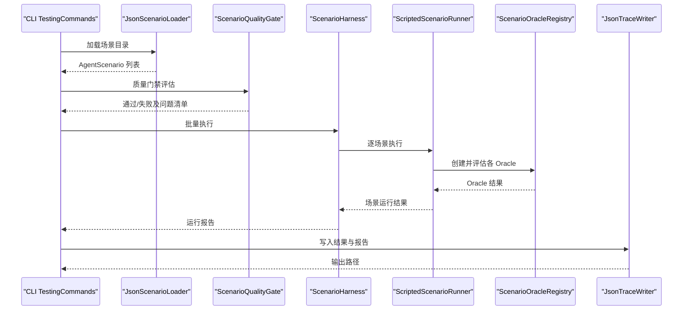
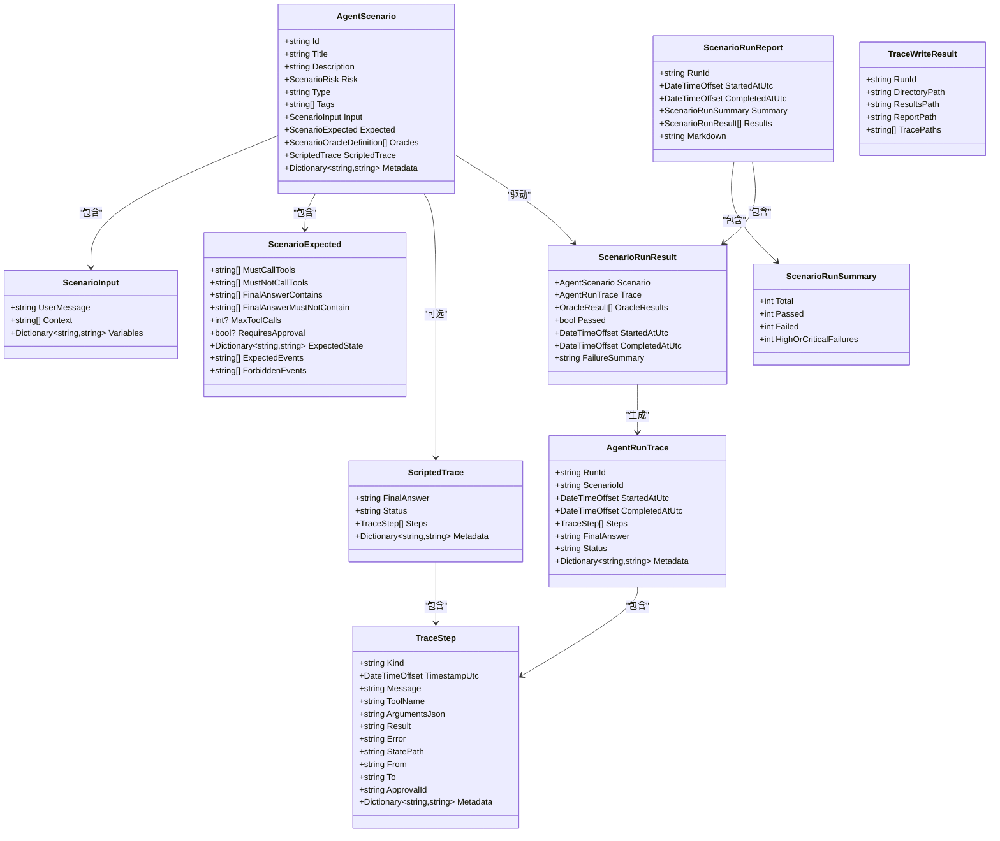
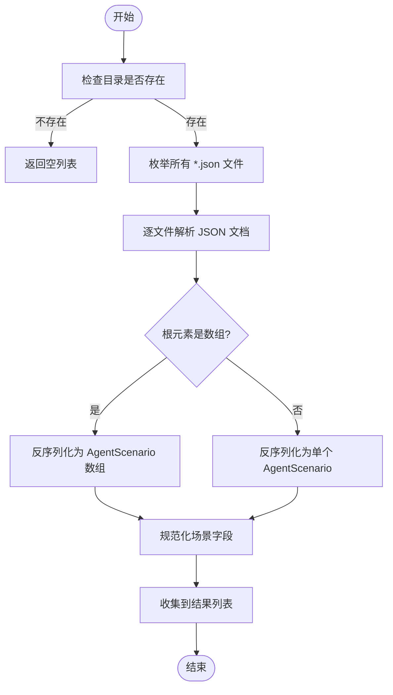
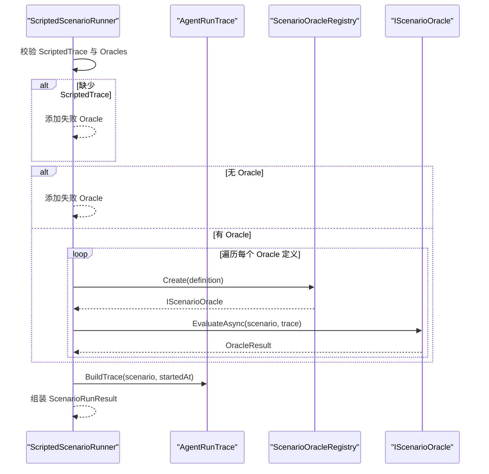
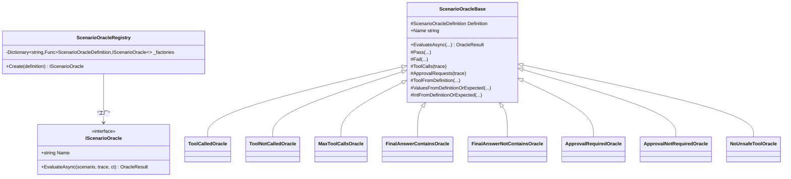
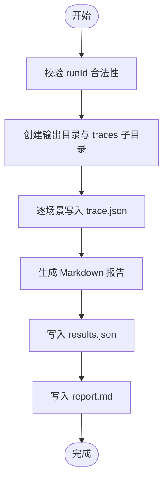
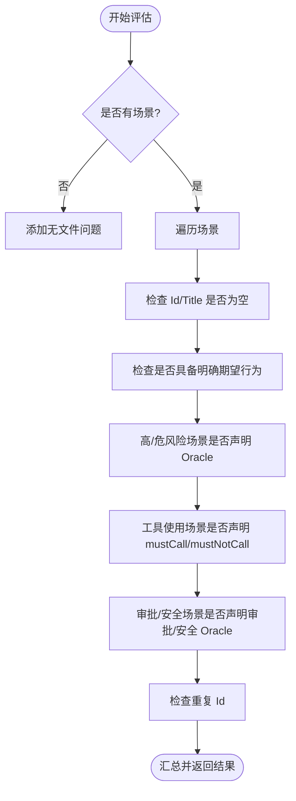
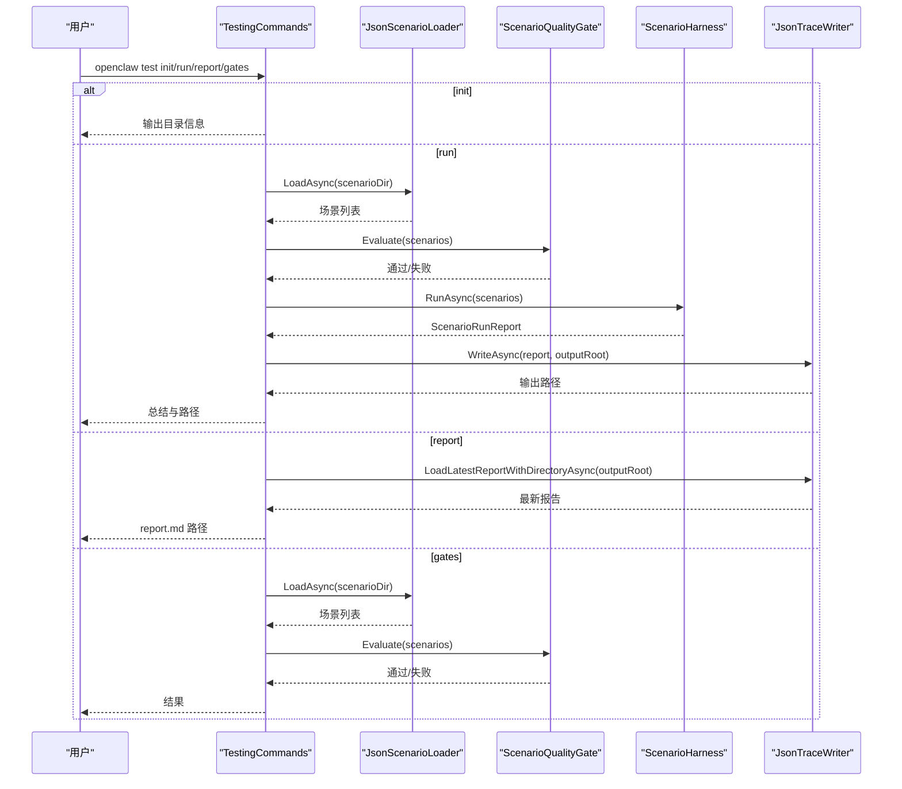
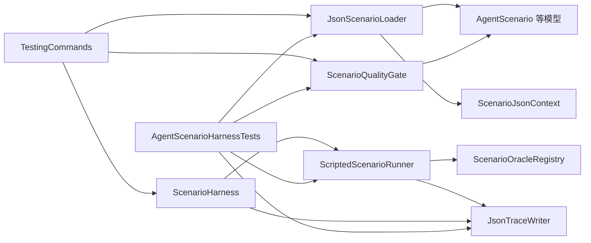

# 场景测试框架

<cite>
**本文档引用的文件**
- [ScenarioModels.cs](file://src/OpenClaw.Testing/ScenarioModels.cs)
- [ScenarioInterfaces.cs](file://src/OpenClaw.Testing/ScenarioInterfaces.cs)
- [ScenarioLoader.cs](file://src/OpenClaw.Testing/ScenarioLoader.cs)
- [ScenarioHarness.cs](file://src/OpenClaw.Testing/ScenarioHarness.cs)
- [ScenarioOracles.cs](file://src/OpenClaw.Testing/ScenarioOracles.cs)
- [ScenarioReports.cs](file://src/OpenClaw.Testing/ScenarioReports.cs)
- [ScenarioQualityGate.cs](file://src/OpenClaw.Testing/ScenarioQualityGate.cs)
- [ScenarioJsonContext.cs](file://src/OpenClaw.Testing/ScenarioJsonContext.cs)
- [TestingCommands.cs](file://src/OpenClaw.Cli/TestingCommands.cs)
- [AgentScenarioHarnessTests.cs](file://src/OpenClaw.Tests/AgentScenarioHarnessTests.cs)
</cite>

## 目录
1. [简介](#简介)
2. [项目结构](#项目结构)
3. [核心组件](#核心组件)
4. [架构总览](#架构总览)
5. [详细组件分析](#详细组件分析)
6. [依赖关系分析](#依赖关系分析)
7. [性能考量](#性能考量)
8. [故障排查指南](#故障排查指南)
9. [结论](#结论)
10. [附录：场景编写规范与示例](#附录场景编写规范与示例)

## 简介
本框架用于“场景测试”，通过可确定性的脚本化运行轨迹（ScriptedTrace）与“金标准”期望（Expected）结合，对智能体行为进行可重复、可审计的验证。场景以 JSON 文件形式描述，包含输入、期望、判定规则（Oracle）、以及脚本化执行轨迹。框架提供加载器、执行器、报告生成器、质量门禁等模块，支持 CLI 命令行工具链，便于在 CI 或本地进行自动化回归与安全校验。

## 项目结构
场景测试相关代码集中在 Testing 子系统中，并通过 CLI 提供命令入口：
- Testing 子系统：定义场景模型、加载器、执行器、报告、质量门禁、JSON 序列化上下文等
- CLI 子系统：提供初始化、运行、报告重生成、质量门禁检查等子命令
- 测试：覆盖加载、执行、报告、CLI 行为等关键路径

图表来源
- [ScenarioModels.cs:15-159](file://src/OpenClaw.Testing/ScenarioModels.cs#L15-L159)
- [ScenarioLoader.cs:5-154](file://src/OpenClaw.Testing/ScenarioLoader.cs#L5-L154)
- [ScenarioHarness.cs:3-179](file://src/OpenClaw.Testing/ScenarioHarness.cs#L3-L179)
- [ScenarioOracles.cs:33-409](file://src/OpenClaw.Testing/ScenarioOracles.cs#L33-L409)
- [ScenarioReports.cs:98-219](file://src/OpenClaw.Testing/ScenarioReports.cs#L98-L219)
- [ScenarioQualityGate.cs:16-110](file://src/OpenClaw.Testing/ScenarioQualityGate.cs#L16-L110)
- [ScenarioJsonContext.cs:1-26](file://src/OpenClaw.Testing/ScenarioJsonContext.cs#L1-L26)
- [TestingCommands.cs:6-271](file://src/OpenClaw.Cli/TestingCommands.cs#L6-L271)
- [AgentScenarioHarnessTests.cs:1-348](file://src/OpenClaw.Tests/AgentScenarioHarnessTests.cs#L1-L348)

章节来源
- [ScenarioModels.cs:1-159](file://src/OpenClaw.Testing/ScenarioModels.cs#L1-L159)
- [ScenarioLoader.cs:1-154](file://src/OpenClaw.Testing/ScenarioLoader.cs#L1-L154)
- [ScenarioHarness.cs:1-179](file://src/OpenClaw.Testing/ScenarioHarness.cs#L1-L179)
- [ScenarioOracles.cs:1-409](file://src/OpenClaw.Testing/ScenarioOracles.cs#L1-L409)
- [ScenarioReports.cs:1-219](file://src/OpenClaw.Testing/ScenarioReports.cs#L1-L219)
- [ScenarioQualityGate.cs:1-110](file://src/OpenClaw.Testing/ScenarioQualityGate.cs#L1-L110)
- [ScenarioJsonContext.cs:1-26](file://src/OpenClaw.Testing/ScenarioJsonContext.cs#L1-L26)
- [TestingCommands.cs:1-271](file://src/OpenClaw.Cli/TestingCommands.cs#L1-L271)
- [AgentScenarioHarnessTests.cs:1-348](file://src/OpenClaw.Tests/AgentScenarioHarnessTests.cs#L1-L348)

## 核心组件
- AgentScenario：场景主体，包含标识、标题、描述、风险、类型、标签、输入、期望、判定规则、脚本化轨迹、元数据
- ScenarioInput：用户消息、上下文、变量
- ScenarioExpected：期望行为集合（工具调用、最终答案、审批需求、状态/事件等）
- ScriptedTrace：脚本化执行轨迹，包含步骤列表与最终答案
- AgentRunTrace：实际运行时构建的可比较轨迹
- TraceStep：单步事件（推理、工具调用、结果、状态变更、事件、审批请求、错误等）
- IScenarioRunner：场景执行接口
- ScriptedScenarioRunner：基于脚本化轨迹的执行器
- ScenarioHarness：批量执行器，产出报告
- ScenarioOracleRegistry：Oracle 工厂，内置多种判定规则
- JsonTraceWriter：将结果写入 JSON 与 Markdown 报告
- ScenarioQualityGate：质量门禁，检查场景完整性与合规性
- ScenarioJsonContext：源生成 JSON 序列化上下文
- TestingCommands：CLI 子命令入口（init/run/report/gates）

章节来源
- [ScenarioModels.cs:15-159](file://src/OpenClaw.Testing/ScenarioModels.cs#L15-L159)
- [ScenarioInterfaces.cs:3-30](file://src/OpenClaw.Testing/ScenarioInterfaces.cs#L3-L30)
- [ScenarioHarness.cs:3-179](file://src/OpenClaw.Testing/ScenarioHarness.cs#L3-L179)
- [ScenarioOracles.cs:33-409](file://src/OpenClaw.Testing/ScenarioOracles.cs#L33-L409)
- [ScenarioReports.cs:98-219](file://src/OpenClaw.Testing/ScenarioReports.cs#L98-L219)
- [ScenarioQualityGate.cs:16-110](file://src/OpenClaw.Testing/ScenarioQualityGate.cs#L16-L110)
- [ScenarioJsonContext.cs:1-26](file://src/OpenClaw.Testing/ScenarioJsonContext.cs#L1-L26)
- [TestingCommands.cs:6-271](file://src/OpenClaw.Cli/TestingCommands.cs#L6-L271)

## 架构总览
场景测试从 JSON 文件加载开始，经过质量门禁检查，进入执行阶段，最后生成报告与追踪文件。

图表来源
- [TestingCommands.cs:60-82](file://src/OpenClaw.Cli/TestingCommands.cs#L60-L82)
- [ScenarioLoader.cs:5-40](file://src/OpenClaw.Testing/ScenarioLoader.cs#L5-L40)
- [ScenarioQualityGate.cs:25-74](file://src/OpenClaw.Testing/ScenarioQualityGate.cs#L25-L74)
- [ScenarioHarness.cs:123-171](file://src/OpenClaw.Testing/ScenarioHarness.cs#L123-L171)
- [ScenarioHarness.cs:7-57](file://src/OpenClaw.Testing/ScenarioHarness.cs#L7-L57)
- [ScenarioOracles.cs:33-62](file://src/OpenClaw.Testing/ScenarioOracles.cs#L33-L62)
- [ScenarioReports.cs:98-151](file://src/OpenClaw.Testing/ScenarioReports.cs#L98-L151)

## 详细组件分析

### 模型与数据结构
- AgentScenario：场景主干，包含 Id、Title、Description、Risk、Type、Tags、Input、Expected、Oracles、ScriptedTrace、Metadata
- ScenarioInput：UserMessage、Context、Variables
- ScenarioExpected：MustCallTools、MustNotCallTools、FinalAnswerContains、FinalAnswerMustNotContain、MaxToolCalls、RequiresApproval、ExpectedState、ExpectedEvents、ForbiddenEvents
- ScriptedTrace：FinalAnswer、Status、Steps、Metadata
- AgentRunTrace：RunId、ScenarioId、StartedAtUtc、CompletedAtUtc、Steps、FinalAnswer、Status、Metadata
- TraceStep：Kind、TimestampUtc、Message、ToolName、ArgumentsJson、Result、Error、StatePath、From、To、ApprovalId、Metadata
- OracleResult：Passed、Name、Message、Evidence
- ScenarioRunResult：Scenario、Trace、OracleResults、Passed、StartedAtUtc、CompletedAtUtc、FailureSummary
- ScenarioRunReport：RunId、StartedAtUtc、CompletedAtUtc、Summary、Results、Markdown
- ScenarioRunSummary：Total、Passed、Failed、HighOrCriticalFailures
- TraceWriteResult：RunId、DirectoryPath、ResultsPath、ReportPath、TracePaths

图表来源
- [ScenarioModels.cs:15-159](file://src/OpenClaw.Testing/ScenarioModels.cs#L15-L159)

章节来源
- [ScenarioModels.cs:15-159](file://src/OpenClaw.Testing/ScenarioModels.cs#L15-L159)

### 场景加载机制（JSON）
- 支持单个 JSON 文件或数组形式的 JSON 文件
- 自动遍历目录递归查找 *.json
- 使用源生成的 JSON 上下文进行反序列化
- 对场景字段进行规范化（空值填充、大小写不敏感字典、空列表等）

图表来源
- [ScenarioLoader.cs:5-40](file://src/OpenClaw.Testing/ScenarioLoader.cs#L5-L40)
- [ScenarioLoader.cs:42-154](file://src/OpenClaw.Testing/ScenarioLoader.cs#L42-L154)
- [ScenarioJsonContext.cs:5-26](file://src/OpenClaw.Testing/ScenarioJsonContext.cs#L5-L26)

章节来源
- [ScenarioLoader.cs:1-154](file://src/OpenClaw.Testing/ScenarioLoader.cs#L1-L154)
- [ScenarioJsonContext.cs:1-26](file://src/OpenClaw.Testing/ScenarioJsonContext.cs#L1-L26)

### 执行流程（ScriptedScenarioRunner）
- 必须提供 ScriptedTrace，否则直接失败
- 必须至少声明一个 Oracle，否则失败
- 逐个创建 Oracle 并评估，汇总结果
- 构建 AgentRunTrace，包含时间戳偏移、最终答案、状态等

图表来源
- [ScenarioHarness.cs:7-57](file://src/OpenClaw.Testing/ScenarioHarness.cs#L7-L57)
- [ScenarioHarness.cs:59-115](file://src/OpenClaw.Testing/ScenarioHarness.cs#L59-L115)
- [ScenarioOracles.cs:33-62](file://src/OpenClaw.Testing/ScenarioOracles.cs#L33-L62)

章节来源
- [ScenarioHarness.cs:1-179](file://src/OpenClaw.Testing/ScenarioHarness.cs#L1-L179)
- [ScenarioOracles.cs:1-409](file://src/OpenClaw.Testing/ScenarioOracles.cs#L1-L409)

### Oracle 判定体系
- 工具调用类：tool-called、tool-not-called、max-tool-calls
- 最终答案类：final-answer-contains、final-answer-not-contains
- 审批与安全类：approval-required、approval-not-required、no-unsafe-tool
- 注册表按类型工厂化创建，未知类型返回 unknown:* 的失败结果
- 安全工具白名单默认包含 shell、write_file、code_exec、git、process、home_assistant_write、mqtt_publish、notion_write，可通过配置扩展

图表来源
- [ScenarioOracles.cs:33-62](file://src/OpenClaw.Testing/ScenarioOracles.cs#L33-L62)
- [ScenarioOracles.cs:64-165](file://src/OpenClaw.Testing/ScenarioOracles.cs#L64-L165)
- [ScenarioOracles.cs:183-307](file://src/OpenClaw.Testing/ScenarioOracles.cs#L183-L307)
- [ScenarioOracles.cs:309-347](file://src/OpenClaw.Testing/ScenarioOracles.cs#L309-L347)
- [ScenarioOracles.cs:350-409](file://src/OpenClaw.Testing/ScenarioOracles.cs#L350-L409)

章节来源
- [ScenarioOracles.cs:1-409](file://src/OpenClaw.Testing/ScenarioOracles.cs#L1-L409)

### 报告与输出（JsonTraceWriter）
- 将每个场景的 AgentRunTrace 写入独立 trace.json
- 生成 results.json 与 report.md
- 支持查找最新运行目录并重新生成报告
- 文件名安全处理，运行 ID 校验

图表来源
- [ScenarioReports.cs:98-151](file://src/OpenClaw.Testing/ScenarioReports.cs#L98-L151)
- [ScenarioReports.cs:153-219](file://src/OpenClaw.Testing/ScenarioReports.cs#L153-L219)

章节来源
- [ScenarioReports.cs:1-219](file://src/OpenClaw.Testing/ScenarioReports.cs#L1-L219)

### 质量门禁（ScenarioQualityGate）
- 检查场景是否缺失 Id/Title
- 检查是否具备明确的期望行为
- 高/危风险场景必须声明至少一个 Oracle
- 工具使用场景必须声明 mustCallTools 或 mustNotCallTools
- 审批/安全场景必须声明审批或安全类 Oracle
- 检查重复 Id

图表来源
- [ScenarioQualityGate.cs:25-74](file://src/OpenClaw.Testing/ScenarioQualityGate.cs#L25-L74)
- [ScenarioQualityGate.cs:83-109](file://src/OpenClaw.Testing/ScenarioQualityGate.cs#L83-L109)

章节来源
- [ScenarioQualityGate.cs:1-110](file://src/OpenClaw.Testing/ScenarioQualityGate.cs#L1-L110)

### CLI 命令与工作流
- init：初始化场景与文档目录，必要时写入示例场景
- run：加载场景 -> 质量门禁 -> 执行 -> 写报告 -> 可选失败策略
- report：根据最新运行目录重新生成报告
- gates：仅质量门禁检查

图表来源
- [TestingCommands.cs:12-171](file://src/OpenClaw.Cli/TestingCommands.cs#L12-L171)
- [TestingCommands.cs:123-141](file://src/OpenClaw.Cli/TestingCommands.cs#L123-L141)

章节来源
- [TestingCommands.cs:1-271](file://src/OpenClaw.Cli/TestingCommands.cs#L1-L271)

## 依赖关系分析
- 组件内聚与耦合
  - ScriptedScenarioRunner 依赖 ScenarioOracleRegistry 与 AgentRunTrace 构建
  - ScenarioHarness 作为编排器，聚合 Runner、Writer、Report
  - JsonScenarioLoader 与 ScenarioJsonContext 解耦 JSON 解析细节
  - TestingCommands 作为 CLI 入口，协调 Loader/Gate/Harness/Writer
- 外部依赖
  - System.Text.Json 源生成上下文
  - 文件系统 IO（目录枚举、文件读写）
- 循环依赖
  - 未发现循环依赖；各模块职责清晰

图表来源
- [ScenarioLoader.cs:5-40](file://src/OpenClaw.Testing/ScenarioLoader.cs#L5-L40)
- [ScenarioHarness.cs:123-171](file://src/OpenClaw.Testing/ScenarioHarness.cs#L123-L171)
- [ScenarioHarness.cs:3-57](file://src/OpenClaw.Testing/ScenarioHarness.cs#L3-L57)
- [ScenarioOracles.cs:33-62](file://src/OpenClaw.Testing/ScenarioOracles.cs#L33-L62)
- [ScenarioReports.cs:98-151](file://src/OpenClaw.Testing/ScenarioReports.cs#L98-L151)
- [TestingCommands.cs:60-82](file://src/OpenClaw.Cli/TestingCommands.cs#L60-L82)
- [AgentScenarioHarnessTests.cs:10-18](file://src/OpenClaw.Tests/AgentScenarioHarnessTests.cs#L10-L18)

章节来源
- [ScenarioLoader.cs:1-154](file://src/OpenClaw.Testing/ScenarioLoader.cs#L1-L154)
- [ScenarioHarness.cs:1-179](file://src/OpenClaw.Testing/ScenarioHarness.cs#L1-L179)
- [ScenarioOracles.cs:1-409](file://src/OpenClaw.Testing/ScenarioOracles.cs#L1-L409)
- [ScenarioReports.cs:1-219](file://src/OpenClaw.Testing/ScenarioReports.cs#L1-L219)
- [TestingCommands.cs:1-271](file://src/OpenClaw.Cli/TestingCommands.cs#L1-L271)
- [AgentScenarioHarnessTests.cs:1-348](file://src/OpenClaw.Tests/AgentScenarioHarnessTests.cs#L1-L348)

## 性能考量
- JSON 解析采用异步流式解析，避免大文件内存峰值
- 源生成 JSON 上下文减少反射开销
- 批量执行时按顺序串行，便于调试；如需并发可在上层封装
- 报告写入按场景逐一写入，避免单次 IO 峰值
- 建议在 CI 中缓存场景目录，减少磁盘扫描

## 故障排查指南
- 场景缺失 ScriptedTrace：执行器会添加失败的 Oracle，提示需要脚本化轨迹
- 场景无 Oracle：高风险或工具使用场景必须声明至少一个 Oracle
- 质量门禁失败：检查 Id/Title、期望行为、标签与类型是否匹配
- CLI 失败：根据输出路径定位 results.json 与 report.md，查看详细失败摘要
- 安全工具违规：确保 unsafe 工具在被调用前获得审批，或在期望中禁止调用

章节来源
- [ScenarioHarness.cs:15-33](file://src/OpenClaw.Testing/ScenarioHarness.cs#L15-L33)
- [ScenarioQualityGate.cs:47-58](file://src/OpenClaw.Testing/ScenarioQualityGate.cs#L47-L58)
- [TestingCommands.cs:134-141](file://src/OpenClaw.Cli/TestingCommands.cs#L134-L141)
- [AgentScenarioHarnessTests.cs:65-83](file://src/OpenClaw.Tests/AgentScenarioHarnessTests.cs#L65-L83)

## 结论
该场景测试框架以 JSON 场景为中心，通过脚本化轨迹与 Oracle 判定实现可重复、可审计的智能体行为验证。其模块化设计便于扩展新的 Oracle 类型与执行后端，CLI 工具链完善了从开发到 CI 的全流程支持。建议在团队内推广统一的场景编写规范与质量门禁策略，持续提升回归与安全测试的覆盖面与稳定性。

## 附录：场景编写规范与示例

### JSON 场景文件格式与字段说明
- id：场景唯一标识，质量门禁要求非空
- title：场景标题，质量门禁要求非空
- description：场景描述（可选）
- risk：风险等级（Low/Medium/High/Critical）
- type：场景类型（如 agent），影响分类与标签识别
- tags：标签集合，用于分类与筛选
- input.userMessage：用户输入消息
- input.context：上下文资源列表（可选）
- input.variables：键值变量（可选）
- expected.mustCallTools：必须调用的工具列表（可选）
- expected.mustNotCallTools：禁止调用的工具列表（可选）
- expected.finalAnswerContains：最终答案应包含的关键字列表（可选）
- expected.finalAnswerMustNotContain：最终答案不得包含的关键字列表（可选）
- expected.maxToolCalls：最大工具调用次数（可选）
- expected.requiresApproval：是否需要审批（可选）
- expected.expectedState：期望状态键值（可选）
- expected.expectedEvents：期望事件列表（可选）
- expected.forbiddenEvents：禁止事件列表（可选）
- oracles：Oracle 列表，每项包含 type、tool/value/limit/tools/metadata
- scriptedTrace.finalAnswer：最终答案文本（可选）
- scriptedTrace.status：运行状态（completed/failed/unknown，默认 completed）
- scriptedTrace.steps：脚本化步骤列表，包含 kind、timestampUtc、message、toolName、argumentsJson、result、error、statePath、from、to、approvalId、metadata
- metadata：场景元数据（可选）

章节来源
- [ScenarioModels.cs:15-159](file://src/OpenClaw.Testing/ScenarioModels.cs#L15-L159)
- [TestingCommands.cs:173-269](file://src/OpenClaw.Cli/TestingCommands.cs#L173-L269)

### 测试用例组织方式
- 单场景文件：每个场景保存为独立 JSON 文件
- 目录结构：tests/agent-scenarios 下按功能/风险分层组织
- 标签与类型：通过 tags 与 type 辅助筛选与质量门禁判断
- 示例场景：CLI init 会在首次运行时生成基础示例

章节来源
- [TestingCommands.cs:36-58](file://src/OpenClaw.Cli/TestingCommands.cs#L36-L58)
- [AgentScenarioHarnessTests.cs:10-18](file://src/OpenClaw.Tests/AgentScenarioHarnessTests.cs#L10-L18)

### 执行流程与最佳实践
- 编写步骤
  1) 设计场景：明确目标、风险、输入与期望
  2) 编写 JSON：按规范填写字段，确保 Id/Title/expected 完整
  3) 编写 Oracle：选择合适的判定规则，必要时组合多个 Oracle
  4) 编写脚本化轨迹：确保 steps 能复现预期行为与最终答案
  5) 质量门禁：使用 gates 子命令检查场景完整性
  6) 执行与报告：使用 run 子命令生成报告与追踪文件
- 最佳实践
  - 高/危风险场景必须声明至少一个 Oracle
  - 工具使用场景必须声明 mustCallTools 或 mustNotCallTools
  - 审批/安全场景必须声明审批或安全 Oracle
  - 使用标准化标签（如 tool-use、approval、safety）便于筛选
  - 保持 scriptedTrace 的步骤顺序与时间戳合理，便于审计
  - 在 CI 中设置 --fail-on high|any 控制失败策略

章节来源
- [ScenarioQualityGate.cs:47-58](file://src/OpenClaw.Testing/ScenarioQualityGate.cs#L47-L58)
- [TestingCommands.cs:134-141](file://src/OpenClaw.Cli/TestingCommands.cs#L134-L141)
- [AgentScenarioHarnessTests.cs:200-242](file://src/OpenClaw.Tests/AgentScenarioHarnessTests.cs#L200-L242)