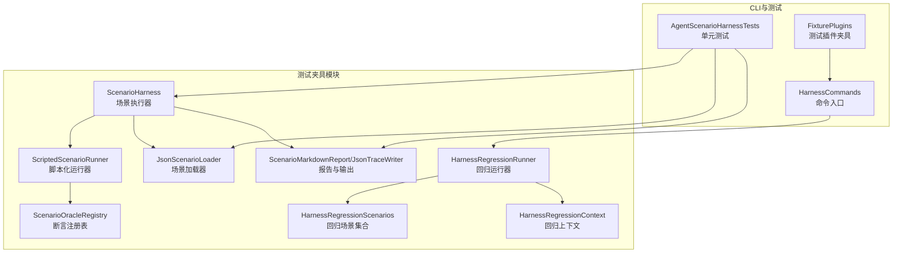
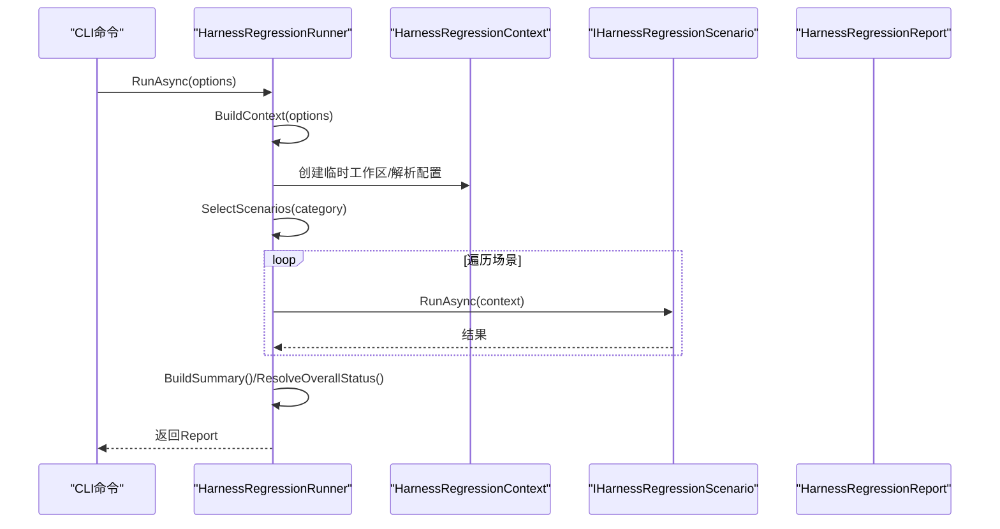
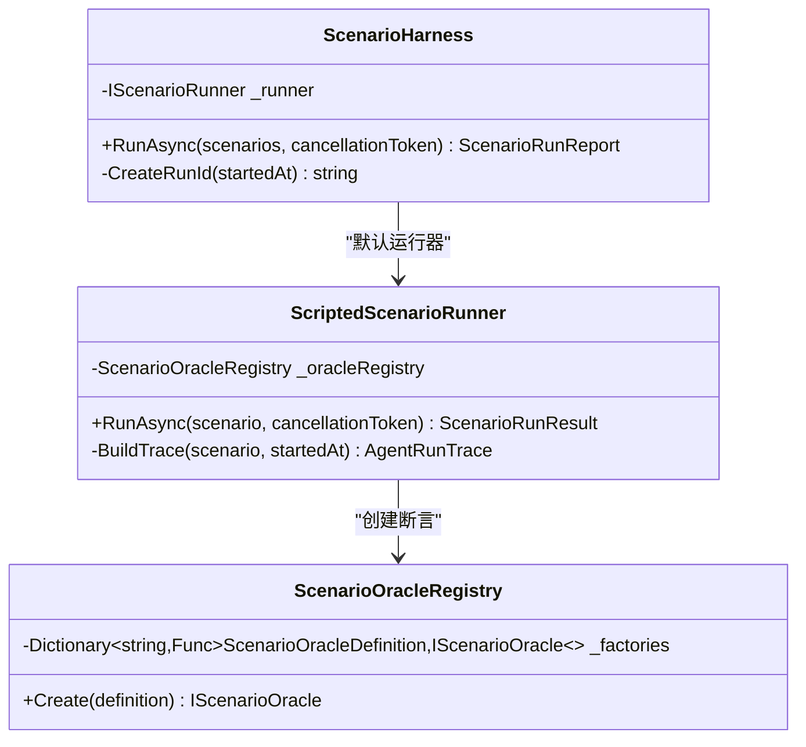
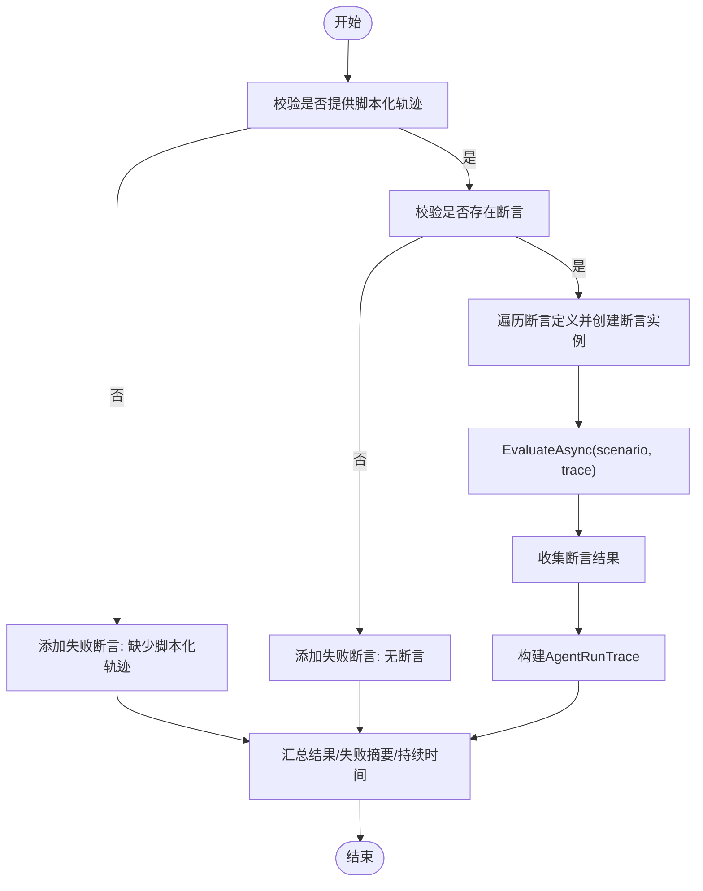
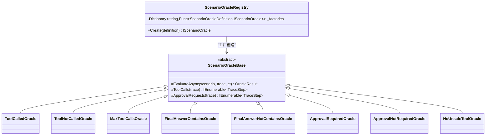
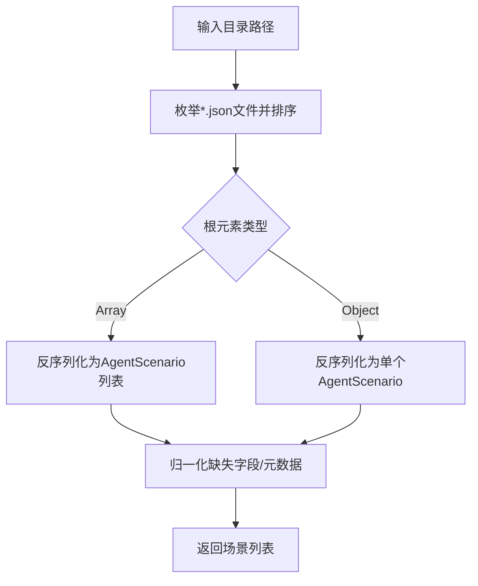
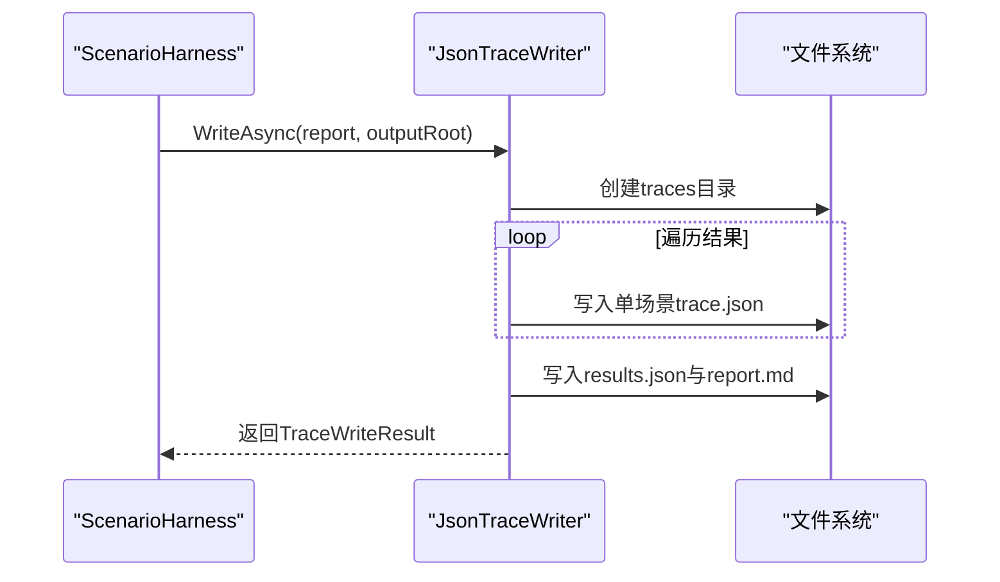
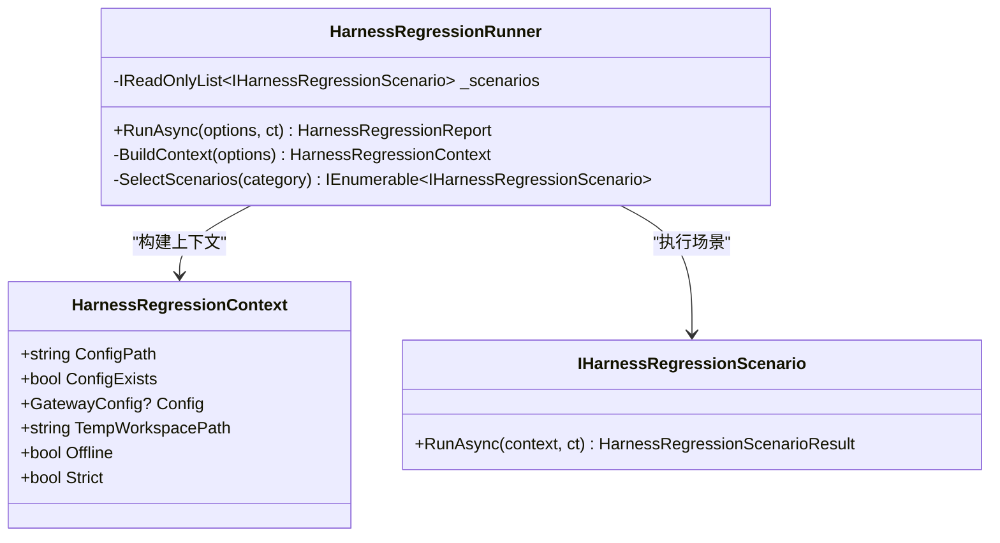
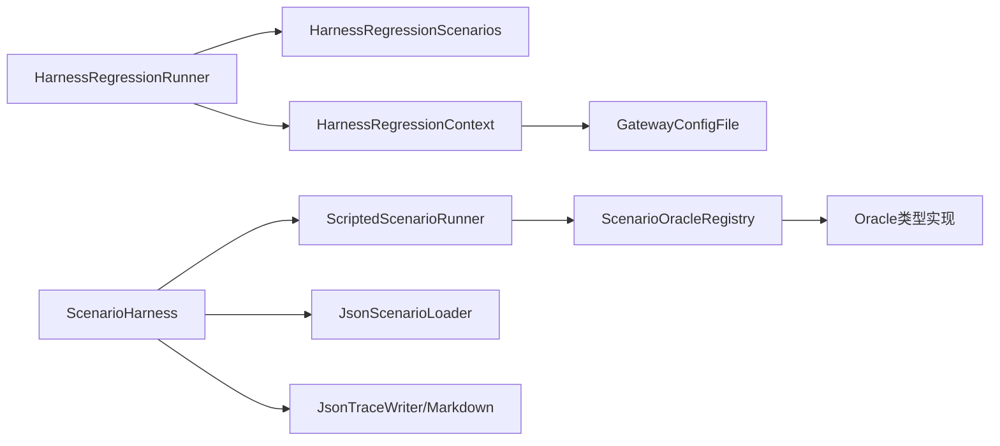

# 测试夹具

<cite>
**本文档引用的文件**
- [ScenarioHarness.cs](file://src/OpenClaw.Testing/ScenarioHarness.cs)
- [ScenarioInterfaces.cs](file://src/OpenClaw.Testing/ScenarioInterfaces.cs)
- [ScenarioModels.cs](file://src/OpenClaw.Testing/ScenarioModels.cs)
- [ScenarioLoader.cs](file://src/OpenClaw.Testing/ScenarioLoader.cs)
- [ScenarioOracles.cs](file://src/OpenClaw.Testing/ScenarioOracles.cs)
- [ScenarioReports.cs](file://src/OpenClaw.Testing/ScenarioReports.cs)
- [HarnessRegressionRunner.cs](file://src/OpenClaw.Testing/HarnessRegressionRunner.cs)
- [HarnessRegressionInterfaces.cs](file://src/OpenClaw.Testing/HarnessRegressionInterfaces.cs)
- [HarnessRegressionScenarios.cs](file://src/OpenClaw.Testing/HarnessRegressionScenarios.cs)
- [HarnessRegressionModels.cs](file://src/OpenClaw.Testing/HarnessRegressionModels.cs)
- [ScenarioJsonContext.cs](file://src/OpenClaw.Testing/ScenarioJsonContext.cs)
- [HarnessCommands.cs](file://src/OpenClaw.Cli/HarnessCommands.cs)
- [AgentScenarioHarnessTests.cs](file://src/OpenClaw.Tests/AgentScenarioHarnessTests.cs)
- [FixturePlugins.cs](file://src/OpenClaw.TestPluginFixtures/FixturePlugins.cs)
</cite>

## 目录
1. [简介](#简介)
2. [项目结构](#项目结构)
3. [核心组件](#核心组件)
4. [架构总览](#架构总览)
5. [详细组件分析](#详细组件分析)
6. [依赖关系分析](#依赖关系分析)
7. [性能考虑](#性能考虑)
8. [故障排除指南](#故障排除指南)
9. [结论](#结论)
10. [附录](#附录)

## 简介
本文件系统性阐述测试夹具的设计与实现，重点覆盖以下方面：
- 测试夹具的作用：通过场景化执行与多类型断言（Oracle）验证代理行为与系统回归质量，支持离线与在线混合模式。
- 生命周期管理与资源分配：统一的运行期上下文、临时工作区、清理策略与异常处理。
- ScenarioHarness 初始化流程：从场景加载到执行再到报告生成的完整链路。
- 代理运行时配置与测试环境准备：基于配置文件与临时目录的隔离式测试环境构建。
- 夹具配置选项：命令行参数、运行模式与严格模式等。
- 资源清理与异常处理：确保测试结束后资源回收与错误信息可诊断。
- 扩展与自定义：如何新增自定义 Oracle、扩展回归场景与插件集成。

## 项目结构
测试夹具相关代码主要位于 OpenClaw.Testing 模块，并与 CLI、测试用例及插件夹具协同工作：
- 场景与断言：场景模型、脚本化跟踪、断言注册表与各类 Oracle 实现。
- 回归测试：回归运行器、场景集合、上下文与报告格式化。
- 输出与工具：JSON/Markdown 报告写入、CLI 命令入口。
- 测试与夹具：单元测试对夹具行为进行验证；测试插件夹具用于动态插件能力验证。

**图表来源**
- [ScenarioHarness.cs:123-178](file://src/OpenClaw.Testing/ScenarioHarness.cs#L123-L178)
- [ScenarioOracles.cs:33-62](file://src/OpenClaw.Testing/ScenarioOracles.cs#L33-L62)
- [ScenarioLoader.cs:5-40](file://src/OpenClaw.Testing/ScenarioLoader.cs#L5-L40)
- [ScenarioReports.cs:6-96](file://src/OpenClaw.Testing/ScenarioReports.cs#L6-L96)
- [HarnessRegressionRunner.cs:7-68](file://src/OpenClaw.Testing/HarnessRegressionRunner.cs#L7-L68)
- [HarnessRegressionScenarios.cs:15-36](file://src/OpenClaw.Testing/HarnessRegressionScenarios.cs#L15-L36)
- [HarnessRegressionModels.cs:49-61](file://src/OpenClaw.Testing/HarnessRegressionModels.cs#L49-L61)
- [HarnessCommands.cs:67-100](file://src/OpenClaw.Cli/HarnessCommands.cs#L67-L100)
- [AgentScenarioHarnessTests.cs:10-198](file://src/OpenClaw.Tests/AgentScenarioHarnessTests.cs#L10-L198)
- [FixturePlugins.cs:8-33](file://src/OpenClaw.TestPluginFixtures/FixturePlugins.cs#L8-L33)

**章节来源**
- [ScenarioHarness.cs:123-178](file://src/OpenClaw.Testing/ScenarioHarness.cs#L123-L178)
- [HarnessRegressionRunner.cs:90-127](file://src/OpenClaw.Testing/HarnessRegressionRunner.cs#L90-L127)

## 核心组件
- 场景与断言模型：定义场景输入、期望、脚本化跟踪、断言结果与运行摘要。
- 场景执行器：负责批量执行场景并生成报告。
- 断言注册表：集中管理不同类型的断言（Oracle），支持扩展。
- 场景加载器：从 JSON 文件加载场景，支持数组与单对象两种格式。
- 报告与输出：生成 Markdown 报告与 JSON/追踪文件，支持最新报告读取。
- 回归运行器：加载配置、选择场景、执行并汇总结果，提供退出码判定。
- CLI 命令：提供 harness 子命令，支持测试与回归运行、状态查询与映射生成。

**章节来源**
- [ScenarioModels.cs:15-159](file://src/OpenClaw.Testing/ScenarioModels.cs#L15-L159)
- [ScenarioHarness.cs:123-178](file://src/OpenClaw.Testing/ScenarioHarness.cs#L123-L178)
- [ScenarioOracles.cs:33-62](file://src/OpenClaw.Testing/ScenarioOracles.cs#L33-L62)
- [ScenarioLoader.cs:5-40](file://src/OpenClaw.Testing/ScenarioLoader.cs#L5-L40)
- [ScenarioReports.cs:6-219](file://src/OpenClaw.Testing/ScenarioReports.cs#L6-L219)
- [HarnessRegressionRunner.cs:7-68](file://src/OpenClaw.Testing/HarnessRegressionRunner.cs#L7-L68)
- [HarnessCommands.cs:67-100](file://src/OpenClaw.Cli/HarnessCommands.cs#L67-L100)

## 架构总览
测试夹具采用“场景驱动 + 断言注册”的架构：
- 场景驱动：通过 JsonScenarioLoader 加载场景，由 ScriptedScenarioRunner 或自定义 IScenarioRunner 执行。
- 断言注册：ScenarioOracleRegistry 统一创建断言实例，按类型分发评估逻辑。
- 报告输出：生成 Markdown 与 JSON 报告，支持追踪文件落盘。
- 回归测试：HarnessRegressionRunner 构建上下文（含临时工作区），按类别筛选场景执行，最终汇总并给出推荐。

**图表来源**
- [HarnessRegressionRunner.cs:18-68](file://src/OpenClaw.Testing/HarnessRegressionRunner.cs#L18-L68)
- [HarnessRegressionInterfaces.cs:15-51](file://src/OpenClaw.Testing/HarnessRegressionInterfaces.cs#L15-L51)
- [HarnessRegressionModels.cs:63-77](file://src/OpenClaw.Testing/HarnessRegressionModels.cs#L63-L77)

**章节来源**
- [HarnessRegressionRunner.cs:18-68](file://src/OpenClaw.Testing/HarnessRegressionRunner.cs#L18-L68)
- [HarnessRegressionScenarios.cs:15-36](file://src/OpenClaw.Testing/HarnessRegressionScenarios.cs#L15-L36)

## 详细组件分析

### ScenarioHarness 分析
- 作用：批量执行 AgentScenario 列表，聚合结果并生成 Markdown 报告。
- 关键点：
  - 支持注入自定义 IScenarioRunner，默认使用 ScriptedScenarioRunner。
  - 生成 RunId 并统计高危/严重失败数量。
  - 将报告转换为 Markdown 字符串并返回完整报告对象。

**图表来源**
- [ScenarioHarness.cs:123-178](file://src/OpenClaw.Testing/ScenarioHarness.cs#L123-L178)
- [ScenarioInterfaces.cs:3-6](file://src/OpenClaw.Testing/ScenarioInterfaces.cs#L3-L6)
- [ScenarioOracles.cs:33-62](file://src/OpenClaw.Testing/ScenarioOracles.cs#L33-L62)

**章节来源**
- [ScenarioHarness.cs:129-171](file://src/OpenClaw.Testing/ScenarioHarness.cs#L129-L171)

### ScriptedScenarioRunner 执行流程
- 校验场景：要求存在 ScriptedTrace 与至少一个 Oracle。
- 构建 AgentRunTrace：将脚本化步骤转换为运行轨迹，填充时间戳与元数据。
- 逐个断言评估：通过注册表创建断言实例并执行，收集结果。
- 汇总结果：计算通过/失败、失败摘要与持续时间。

**图表来源**
- [ScenarioHarness.cs:7-57](file://src/OpenClaw.Testing/ScenarioHarness.cs#L7-L57)
- [ScenarioHarness.cs:59-121](file://src/OpenClaw.Testing/ScenarioHarness.cs#L59-L121)

**章节来源**
- [ScenarioHarness.cs:7-57](file://src/OpenClaw.Testing/ScenarioHarness.cs#L7-L57)

### 断言注册表与断言类型
- 注册表：根据断言类型映射到具体实现，支持扩展新类型。
- 内置断言类型：工具调用、最大调用次数、最终答案包含/不包含、审批需求、无危险工具等。
- 安全策略：默认危险工具清单可通过构造函数注入，支持在场景元数据中追加。

**图表来源**
- [ScenarioOracles.cs:33-62](file://src/OpenClaw.Testing/ScenarioOracles.cs#L33-L62)
- [ScenarioOracles.cs:183-210](file://src/OpenClaw.Testing/ScenarioOracles.cs#L183-L210)
- [ScenarioOracles.cs:212-239](file://src/OpenClaw.Testing/ScenarioOracles.cs#L212-L239)
- [ScenarioOracles.cs:241-259](file://src/OpenClaw.Testing/ScenarioOracles.cs#L241-L259)
- [ScenarioOracles.cs:261-283](file://src/OpenClaw.Testing/ScenarioOracles.cs#L261-L283)
- [ScenarioOracles.cs:285-307](file://src/OpenClaw.Testing/ScenarioOracles.cs#L285-L307)
- [ScenarioOracles.cs:309-332](file://src/OpenClaw.Testing/ScenarioOracles.cs#L309-L332)
- [ScenarioOracles.cs:334-348](file://src/OpenClaw.Testing/ScenarioOracles.cs#L334-L348)
- [ScenarioOracles.cs:350-409](file://src/OpenClaw.Testing/ScenarioOracles.cs#L350-L409)

**章节来源**
- [ScenarioOracles.cs:33-62](file://src/OpenClaw.Testing/ScenarioOracles.cs#L33-L62)

### 场景加载器与模型序列化
- 加载策略：扫描目录下所有 .json 文件，支持数组与单对象两种根类型。
- 归一化：对缺失字段进行默认值填充，保证后续断言一致性。
- 序列化上下文：使用 ScenarioJsonContext 进行驼峰命名、忽略空值与缩进控制。

**图表来源**
- [ScenarioLoader.cs:5-40](file://src/OpenClaw.Testing/ScenarioLoader.cs#L5-L40)
- [ScenarioLoader.cs:42-153](file://src/OpenClaw.Testing/ScenarioLoader.cs#L42-L153)
- [ScenarioJsonContext.cs:21-26](file://src/OpenClaw.Testing/ScenarioJsonContext.cs#L21-L26)

**章节来源**
- [ScenarioLoader.cs:5-40](file://src/OpenClaw.Testing/ScenarioLoader.cs#L5-L40)

### 报告与输出
- Markdown 报告：表格展示每个场景的 ID、风险、状态与失败断言；失败场景展开详细断言与证据。
- JSON/追踪输出：按 RunId 创建目录，写入每个场景的 AgentRunTrace 与汇总报告，支持查找最新运行目录。

**图表来源**
- [ScenarioReports.cs:98-151](file://src/OpenClaw.Testing/ScenarioReports.cs#L98-L151)

**章节来源**
- [ScenarioReports.cs:6-96](file://src/OpenClaw.Testing/ScenarioReports.cs#L6-L96)
- [ScenarioReports.cs:98-151](file://src/OpenClaw.Testing/ScenarioReports.cs#L98-L151)

### 回归运行器与上下文
- 上下文构建：解析配置路径、尝试加载配置、记录错误、创建临时工作区。
- 场景选择：按类别过滤场景集合；若无匹配则返回“未选择场景”的失败结果。
- 总结与推荐：统计各状态数量，严格模式下将警告/跳过视为失败；生成建议命令。

**图表来源**
- [HarnessRegressionRunner.cs:7-68](file://src/OpenClaw.Testing/HarnessRegressionRunner.cs#L7-L68)
- [HarnessRegressionRunner.cs:90-127](file://src/OpenClaw.Testing/HarnessRegressionRunner.cs#L90-L127)
- [HarnessRegressionInterfaces.cs:3-13](file://src/OpenClaw.Testing/HarnessRegressionInterfaces.cs#L3-L13)
- [HarnessRegressionModels.cs:49-61](file://src/OpenClaw.Testing/HarnessRegressionModels.cs#L49-L61)

**章节来源**
- [HarnessRegressionRunner.cs:18-68](file://src/OpenClaw.Testing/HarnessRegressionRunner.cs#L18-L68)
- [HarnessRegressionRunner.cs:90-127](file://src/OpenClaw.Testing/HarnessRegressionRunner.cs#L90-L127)

### CLI 命令与使用
- 子命令：harness test/regression、state、map。
- 参数：--config、--category、--json、--offline、--strict、--proposal、--output。
- 行为：离线默认开启，严格模式将警告/跳过视为失败；输出文本或 JSON，并可写入文件。

**章节来源**
- [HarnessCommands.cs:67-100](file://src/OpenClaw.Cli/HarnessCommands.cs#L67-L100)
- [HarnessCommands.cs:384-404](file://src/OpenClaw.Cli/HarnessCommands.cs#L384-L404)

## 依赖关系分析
- 组件耦合：
  - ScenarioHarness 依赖 IScenarioRunner；默认实现为 ScriptedScenarioRunner。
  - ScriptedScenarioRunner 依赖 ScenarioOracleRegistry 与断言类型。
  - 回归运行器依赖场景集合与上下文，最终生成报告。
- 外部依赖：
  - 配置加载：GatewayConfigFile（用于回归运行器）。
  - 文件系统：临时工作区与输出目录。
  - JSON 序列化：ScenarioJsonContext 与 HarnessRegressionJsonContext。

**图表来源**
- [ScenarioHarness.cs:123-178](file://src/OpenClaw.Testing/ScenarioHarness.cs#L123-L178)
- [ScenarioOracles.cs:33-62](file://src/OpenClaw.Testing/ScenarioOracles.cs#L33-L62)
- [HarnessRegressionRunner.cs:90-127](file://src/OpenClaw.Testing/HarnessRegressionRunner.cs#L90-L127)
- [ScenarioLoader.cs:5-40](file://src/OpenClaw.Testing/ScenarioLoader.cs#L5-L40)
- [ScenarioReports.cs:98-151](file://src/OpenClaw.Testing/ScenarioReports.cs#L98-L151)

**章节来源**
- [HarnessRegressionRunner.cs:90-127](file://src/OpenClaw.Testing/HarnessRegressionRunner.cs#L90-L127)

## 性能考虑
- 异步执行：所有运行器均采用 ValueTask/async 设计，避免阻塞。
- 轻量序列化：使用源生成上下文，减少反射开销。
- 路径与文件操作：仅在必要时创建目录与写入文件，避免重复 IO。
- 临时工作区：回归运行器在 finally 中删除临时目录，降低磁盘占用。

[本节为通用指导，无需特定文件来源]

## 故障排除指南
- 配置加载失败：检查配置路径与权限；回归运行器会捕获异常并记录错误信息。
- 无场景可选：当指定类别无匹配场景时，返回“未选择场景”的失败结果。
- 严格模式退出码：严格模式下，若存在必需场景的警告或跳过，返回非零退出码。
- 报告写入校验：RunId 必须为相对路径片段，否则抛出参数异常；文件名需安全处理。

**章节来源**
- [HarnessRegressionRunner.cs:90-127](file://src/OpenClaw.Testing/HarnessRegressionRunner.cs#L90-L127)
- [HarnessRegressionRunner.cs:307-322](file://src/OpenClaw.Testing/HarnessRegressionRunner.cs#L307-L322)
- [ScenarioReports.cs:191-207](file://src/OpenClaw.Testing/ScenarioReports.cs#L191-L207)

## 结论
测试夹具通过“场景驱动 + 断言注册”的设计，提供了可扩展、可验证的测试框架。其生命周期管理完善、资源清理可靠、异常处理明确，并支持离线与在线混合模式。借助 CLI 命令与丰富的断言类型，用户可以快速构建高质量的回归与场景化测试套件。

[本节为总结，无需特定文件来源]

## 附录

### 配置选项与运行模式
- CLI 选项
  - --config：配置文件路径（可省略时自动解析默认路径）
  - --category：场景类别（如 onboarding/security/approvals/memory/providers/tools/mcp/openai_compat/sessions/harness/deployment/docs）
  - --json：输出 JSON 格式
  - --offline：离线模式（默认开启）
  - --strict：严格模式（将警告/跳过视为失败）
  - --proposal：提案 ID
  - --output：输出路径（文本或 JSON 文件）

- 回归运行器选项
  - ConfigPath/Category/Offline/Strict/ProposalId/OutputPath

**章节来源**
- [HarnessCommands.cs:384-404](file://src/OpenClaw.Cli/HarnessCommands.cs#L384-L404)
- [HarnessRegressionModels.cs:39-47](file://src/OpenClaw.Testing/HarnessRegressionModels.cs#L39-L47)

### 生命周期与资源管理
- 临时工作区：创建唯一目录，测试完成后删除。
- 配置加载：尝试加载并缓存配置，记录错误原因。
- 报告输出：按 RunId 建立目录，写入结果与 Markdown 报告。

**章节来源**
- [HarnessRegressionRunner.cs:300-322](file://src/OpenClaw.Testing/HarnessRegressionRunner.cs#L300-L322)
- [HarnessRegressionRunner.cs:90-127](file://src/OpenClaw.Testing/HarnessRegressionRunner.cs#L90-L127)
- [ScenarioReports.cs:98-151](file://src/OpenClaw.Testing/ScenarioReports.cs#L98-L151)

### 扩展与自定义
- 新增断言类型
  - 在 ScenarioOracleRegistry 工厂字典中注册新类型到实现的映射。
  - 实现 IScenarioOracle 接口，遵循 EvaluateAsync 约定。
- 新增回归场景
  - 继承 HarnessRegressionScenarioBase，实现 EvaluateAsync。
  - 在 HarnessRegressionScenarios 中注册场景。
- 插件集成
  - 使用测试插件夹具（如 ToolAndCommandPlugin）注册工具、命令与服务。
  - 通过配置项传递路径与内存提供者 ID 等参数。

**章节来源**
- [ScenarioOracles.cs:33-62](file://src/OpenClaw.Testing/ScenarioOracles.cs#L33-L62)
- [HarnessRegressionScenarios.cs:15-36](file://src/OpenClaw.Testing/HarnessRegressionScenarios.cs#L15-L36)
- [FixturePlugins.cs:8-33](file://src/OpenClaw.TestPluginFixtures/FixturePlugins.cs#L8-L33)