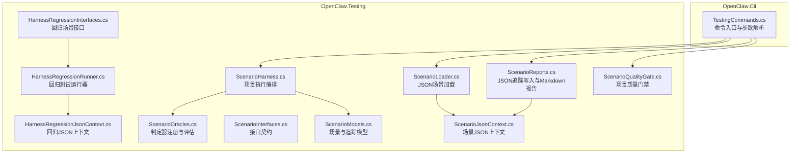
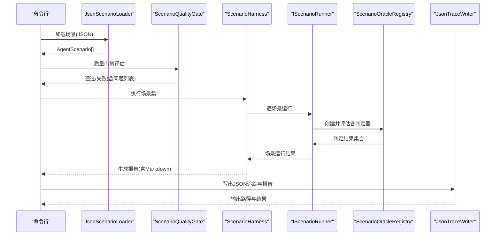
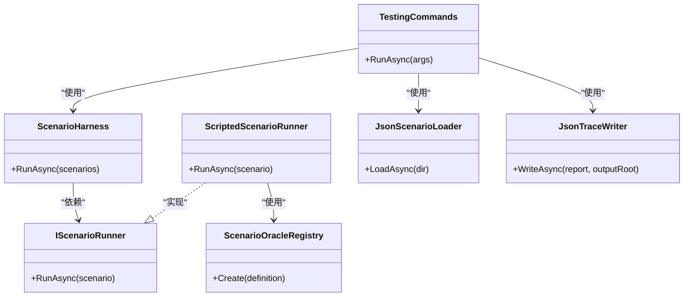

# 测试工具

<cite>
**本文引用的文件**
- [HarnessRegressionRunner.cs](file://src/OpenClaw.Testing/HarnessRegressionRunner.cs)
- [HarnessRegressionInterfaces.cs](file://src/OpenClaw.Testing/HarnessRegressionInterfaces.cs)
- [HarnessRegressionJsonContext.cs](file://src/OpenClaw.Testing/HarnessRegressionJsonContext.cs)
- [ScenarioHarness.cs](file://src/OpenClaw.Testing/ScenarioHarness.cs)
- [ScenarioLoader.cs](file://src/OpenClaw.Testing/ScenarioLoader.cs)
- [ScenarioModels.cs](file://src/OpenClaw.Testing/ScenarioModels.cs)
- [ScenarioInterfaces.cs](file://src/OpenClaw.Testing/ScenarioInterfaces.cs)
- [ScenarioOracles.cs](file://src/OpenClaw.Testing/ScenarioOracles.cs)
- [ScenarioReports.cs](file://src/OpenClaw.Testing/ScenarioReports.cs)
- [ScenarioQualityGate.cs](file://src/OpenClaw.Testing/ScenarioQualityGate.cs)
- [TestingCommands.cs](file://src/OpenClaw.Cli/TestingCommands.cs)
- [DocsConsistencyTests.cs](file://src/OpenClaw.Tests/DocsConsistencyTests.cs)
</cite>

## 目录
1. [简介](#简介)
2. [项目结构](#项目结构)
3. [核心组件](#核心组件)
4. [架构总览](#架构总览)
5. [组件详解](#组件详解)
6. [依赖关系分析](#依赖关系分析)
7. [性能考量](#性能考量)
8. [故障排除指南](#故障排除指南)
9. [结论](#结论)
10. [附录](#附录)

## 简介
本文件系统性地文档化了测试工具模块，覆盖以下方面：
- 测试相关的序列化上下文与 JSON 处理工具
- 场景化测试与回归测试的执行流程、质量门禁与报告生成
- CLI 命令行工具的使用方法、配置选项与扩展机制
- 与核心测试框架的集成方式、数据转换与格式化输出
- 在持续集成中的应用、自动化测试流程与结果分析
- 安装配置、使用示例、故障排除与性能优化建议

## 项目结构
测试工具位于 OpenClaw.Testing 与 OpenClaw.Cli 两个子系统中，前者提供场景化测试、回归测试、质量门禁与报告生成能力；后者通过命令行封装这些能力，并提供初始化、运行、报告重生成与质量门禁检查等子命令。

图表来源
- [TestingCommands.cs:12-171](file://src/OpenClaw.Cli/TestingCommands.cs#L12-L171)
- [ScenarioHarness.cs:123-179](file://src/OpenClaw.Testing/ScenarioHarness.cs#L123-L179)
- [ScenarioLoader.cs:5-40](file://src/OpenClaw.Testing/ScenarioLoader.cs#L5-L40)
- [ScenarioOracles.cs:33-62](file://src/OpenClaw.Testing/ScenarioOracles.cs#L33-L62)
- [ScenarioReports.cs:98-151](file://src/OpenClaw.Testing/ScenarioReports.cs#L98-L151)
- [ScenarioQualityGate.cs:16-74](file://src/OpenClaw.Testing/ScenarioQualityGate.cs#L16-L74)
- [ScenarioModels.cs:15-94](file://src/OpenClaw.Testing/ScenarioModels.cs#L15-L94)
- [ScenarioInterfaces.cs:3-29](file://src/OpenClaw.Testing/ScenarioInterfaces.cs#L3-L29)
- [HarnessRegressionRunner.cs:7-68](file://src/OpenClaw.Testing/HarnessRegressionRunner.cs#L7-L68)
- [HarnessRegressionInterfaces.cs:3-13](file://src/OpenClaw.Testing/HarnessRegressionInterfaces.cs#L3-L13)
- [HarnessRegressionJsonContext.cs:6-21](file://src/OpenClaw.Testing/HarnessRegressionJsonContext.cs#L6-L21)
- [ScenarioJsonContext.cs:5-26](file://src/OpenClaw.Testing/ScenarioJsonContext.cs#L5-L26)

章节来源
- [TestingCommands.cs:12-171](file://src/OpenClaw.Cli/TestingCommands.cs#L12-L171)
- [ScenarioHarness.cs:123-179](file://src/OpenClaw.Testing/ScenarioHarness.cs#L123-L179)
- [ScenarioLoader.cs:5-40](file://src/OpenClaw.Testing/ScenarioLoader.cs#L5-L40)
- [ScenarioOracles.cs:33-62](file://src/OpenClaw.Testing/ScenarioOracles.cs#L33-L62)
- [ScenarioReports.cs:98-151](file://src/OpenClaw.Testing/ScenarioReports.cs#L98-L151)
- [ScenarioQualityGate.cs:16-74](file://src/OpenClaw.Testing/ScenarioQualityGate.cs#L16-L74)
- [ScenarioModels.cs:15-94](file://src/OpenClaw.Testing/ScenarioModels.cs#L15-L94)
- [ScenarioInterfaces.cs:3-29](file://src/OpenClaw.Testing/ScenarioInterfaces.cs#L3-L29)
- [HarnessRegressionRunner.cs:7-68](file://src/OpenClaw.Testing/HarnessRegressionRunner.cs#L7-L68)
- [HarnessRegressionInterfaces.cs:3-13](file://src/OpenClaw.Testing/HarnessRegressionInterfaces.cs#L3-L13)
- [HarnessRegressionJsonContext.cs:6-21](file://src/OpenClaw.Testing/HarnessRegressionJsonContext.cs#L6-L21)
- [ScenarioJsonContext.cs:5-26](file://src/OpenClaw.Testing/ScenarioJsonContext.cs#L5-L26)

## 核心组件
- 场景化测试执行器：负责加载场景、执行脚本化追踪、运行判定器、汇总结果并生成报告。
- JSON 场景加载器：从目录递归扫描 JSON 文件，支持数组或对象根节点，统一规范化字段。
- 判定器体系：内置多种判定器类型（工具调用、最终答案包含/不包含、审批需求、最大调用次数、无危险工具等），支持扩展。
- 质量门禁：对场景集进行结构性与语义性校验，确保高风险与安全相关场景具备必要断言。
- 报告与追踪：以 JSON 追踪文件与 Markdown 报告形式输出，便于 CI 存档与审阅。
- 回归测试运行器：面向网关/运行时回归场景，构建上下文、选择场景、汇总统计与推荐。
- CLI 命令：提供初始化、运行、报告重生成、质量门禁检查等子命令，支持失败策略与输出路径控制。

章节来源
- [ScenarioHarness.cs:123-179](file://src/OpenClaw.Testing/ScenarioHarness.cs#L123-L179)
- [ScenarioLoader.cs:5-40](file://src/OpenClaw.Testing/ScenarioLoader.cs#L5-L40)
- [ScenarioOracles.cs:33-62](file://src/OpenClaw.Testing/ScenarioOracles.cs#L33-L62)
- [ScenarioQualityGate.cs:16-74](file://src/OpenClaw.Testing/ScenarioQualityGate.cs#L16-L74)
- [ScenarioReports.cs:98-151](file://src/OpenClaw.Testing/ScenarioReports.cs#L98-L151)
- [HarnessRegressionRunner.cs:7-68](file://src/OpenClaw.Testing/HarnessRegressionRunner.cs#L7-L68)
- [TestingCommands.cs:12-171](file://src/OpenClaw.Cli/TestingCommands.cs#L12-L171)

## 架构总览
下图展示了 CLI 如何驱动测试工具链，以及测试工具内部的数据流与关键组件交互。

图表来源
- [TestingCommands.cs:60-82](file://src/OpenClaw.Cli/TestingCommands.cs#L60-L82)
- [ScenarioLoader.cs:7-40](file://src/OpenClaw.Testing/ScenarioLoader.cs#L7-L40)
- [ScenarioQualityGate.cs:25-74](file://src/OpenClaw.Testing/ScenarioQualityGate.cs#L25-L74)
- [ScenarioHarness.cs:129-171](file://src/OpenClaw.Testing/ScenarioHarness.cs#L129-L171)
- [ScenarioOracles.cs:58-61](file://src/OpenClaw.Testing/ScenarioOracles.cs#L58-L61)
- [ScenarioReports.cs:100-151](file://src/OpenClaw.Testing/ScenarioReports.cs#L100-L151)

## 组件详解

### 序列化上下文与 JSON 处理
- 场景 JSON 上下文：定义场景模型的序列化元数据，启用驼峰命名、大小写不敏感与空值忽略，提升跨语言互操作性。
- 回归 JSON 上下文：定义回归报告、结果、摘要与推荐的序列化元数据，支持 MCP 请求模型的序列化。
- JSON 解析与反序列化：场景加载器使用异步 JSON 文档解析，兼容数组与对象根节点，随后通过源生成上下文进行强类型反序列化。
- 追踪写入：将单个场景追踪与完整报告以 JSON 写出，同时生成 Markdown 报告；提供最新报告加载与目录定位能力。

章节来源
- [ScenarioJsonContext.cs:5-26](file://src/OpenClaw.Testing/ScenarioJsonContext.cs#L5-L26)
- [HarnessRegressionJsonContext.cs:6-21](file://src/OpenClaw.Testing/HarnessRegressionJsonContext.cs#L6-L21)
- [ScenarioLoader.cs:22-37](file://src/OpenClaw.Testing/ScenarioLoader.cs#L22-L37)
- [ScenarioReports.cs:100-151](file://src/OpenClaw.Testing/ScenarioReports.cs#L100-L151)

### 场景化测试执行与判定器
- 场景执行编排：按顺序运行每个场景，收集判定器结果，计算通过/失败与失败摘要。
- 脚本化追踪构建：基于场景中的脚本化追踪，生成可被判定器消费的统一追踪结构。
- 判定器注册表：根据类型创建具体判定器实例，支持未知类型的容错处理。
- 判定器类型：
  - 工具调用/未调用：验证必须调用/禁止调用的工具集合。
  - 最大工具调用次数：限制工具调用上限。
  - 最终答案包含/不包含：校验最终回答文本。
  - 审批需求/无需审批：验证审批请求的存在与否。
  - 无危险工具：基于默认与自定义危险工具集，结合审批历史进行校验。

章节来源
- [ScenarioHarness.cs:7-57](file://src/OpenClaw.Testing/ScenarioHarness.cs#L7-L57)
- [ScenarioHarness.cs:59-115](file://src/OpenClaw.Testing/ScenarioHarness.cs#L59-L115)
- [ScenarioOracles.cs:33-62](file://src/OpenClaw.Testing/ScenarioOracles.cs#L33-L62)
- [ScenarioOracles.cs:183-239](file://src/OpenClaw.Testing/ScenarioOracles.cs#L183-L239)
- [ScenarioOracles.cs:241-258](file://src/OpenClaw.Testing/ScenarioOracles.cs#L241-L258)
- [ScenarioOracles.cs:261-307](file://src/OpenClaw.Testing/ScenarioOracles.cs#L261-L307)
- [ScenarioOracles.cs:309-347](file://src/OpenClaw.Testing/ScenarioOracles.cs#L309-L347)
- [ScenarioOracles.cs:350-408](file://src/OpenClaw.Testing/ScenarioOracles.cs#L350-L408)

### 质量门禁与文档一致性检查
- 场景质量门禁：检查场景是否缺失 id/title、是否声明明确期望行为、高危/关键场景是否至少声明一个判定器、工具使用场景是否声明工具集合、审批/安全场景是否声明相应判定器；并检测重复 id。
- 文档一致性测试：验证 README、Quickstart、User Guide、Docker Hub 等文档是否包含关键命令与链接，确保文档与 CLI 行为一致。

章节来源
- [ScenarioQualityGate.cs:25-74](file://src/OpenClaw.Testing/ScenarioQualityGate.cs#L25-L74)
- [DocsConsistencyTests.cs:7-81](file://src/OpenClaw.Tests/DocsConsistencyTests.cs#L7-L81)

### 回归测试运行器与报告
- 回归场景接口：定义场景标识、名称、类别、是否必需及运行方法。
- 回归运行器：构建上下文（含配置路径、离线模式、提案 ID、临时工作区）、选择场景、运行并归一化结果、汇总统计、计算整体状态、生成推荐与退出码。
- 报告格式化：提供 JSON 与文本两种输出格式，文本格式包含每条结果的状态标签、摘要与错误信息，以及统计与后续步骤建议。

章节来源
- [HarnessRegressionInterfaces.cs:3-13](file://src/OpenClaw.Testing/HarnessRegressionInterfaces.cs#L3-L13)
- [HarnessRegressionRunner.cs:18-68](file://src/OpenClaw.Testing/HarnessRegressionRunner.cs#L18-L68)
- [HarnessRegressionRunner.cs:334-382](file://src/OpenClaw.Testing/HarnessRegressionRunner.cs#L334-L382)

### CLI 命令与使用指南
- 子命令：
  - init：初始化场景与文档目录，必要时写入示例场景 JSON。
  - run：加载场景、质量门禁、执行场景、写出 JSON 追踪与 Markdown 报告，并根据失败策略决定退出码。
  - report：基于最新运行目录重新生成 Markdown 报告。
  - gates：仅执行质量门禁检查。
- 关键选项：
  - --scenarios/--scenario-dir：场景目录路径。
  - --output：输出根目录。
  - --fail-on：失败策略（high|any）。
- 示例输出：
  - run 子命令会输出 run_id、results、report、summary、high_critical_failures 等键值对，便于 CI 提取。

章节来源
- [TestingCommands.cs:12-171](file://src/OpenClaw.Cli/TestingCommands.cs#L12-L171)
- [TestingCommands.cs:134-141](file://src/OpenClaw.Cli/TestingCommands.cs#L134-L141)

### 数据模型与接口契约
- 场景模型：包含场景元数据、输入、期望行为、判定器定义、脚本化追踪与元数据字典。
- 追踪模型：统一的步骤结构，涵盖推理、工具调用、工具结果、状态变更、事件、审批请求与错误等。
- 接口契约：场景运行器、判定器、场景加载器与追踪写入器的职责分离，便于替换与扩展。

章节来源
- [ScenarioModels.cs:15-94](file://src/OpenClaw.Testing/ScenarioModels.cs#L15-L94)
- [ScenarioInterfaces.cs:3-29](file://src/OpenClaw.Testing/ScenarioInterfaces.cs#L3-L29)

## 依赖关系分析
- 组件耦合：
  - ScenarioHarness 依赖 IScenarioRunner，默认使用 ScriptedScenarioRunner。
  - ScriptedScenarioRunner 依赖 ScenarioOracleRegistry 与场景模型。
  - ScenarioLoader 依赖 ScenarioJsonContext 与 System.Text.Json。
  - JsonTraceWriter 依赖 ScenarioJsonContext 与文件系统。
  - TestingCommands 串联 Loader、Gate、Harness、Writer 并处理 CLI 参数。
- 潜在循环依赖：当前设计通过接口解耦，未见直接循环依赖。
- 外部依赖：System.Text.Json 源生成上下文、文件系统 IO、可取消令牌。

图表来源
- [ScenarioHarness.cs:123-179](file://src/OpenClaw.Testing/ScenarioHarness.cs#L123-L179)
- [ScenarioInterfaces.cs:3-6](file://src/OpenClaw.Testing/ScenarioInterfaces.cs#L3-L6)
- [ScenarioOracles.cs:33-62](file://src/OpenClaw.Testing/ScenarioOracles.cs#L33-L62)
- [ScenarioLoader.cs:5-40](file://src/OpenClaw.Testing/ScenarioLoader.cs#L5-L40)
- [ScenarioReports.cs:98-151](file://src/OpenClaw.Testing/ScenarioReports.cs#L98-L151)
- [TestingCommands.cs:60-82](file://src/OpenClaw.Cli/TestingCommands.cs#L60-L82)

章节来源
- [ScenarioHarness.cs:123-179](file://src/OpenClaw.Testing/ScenarioHarness.cs#L123-L179)
- [ScenarioInterfaces.cs:3-6](file://src/OpenClaw.Testing/ScenarioInterfaces.cs#L3-L6)
- [ScenarioOracles.cs:33-62](file://src/OpenClaw.Testing/ScenarioOracles.cs#L33-L62)
- [ScenarioLoader.cs:5-40](file://src/OpenClaw.Testing/ScenarioLoader.cs#L5-L40)
- [ScenarioReports.cs:98-151](file://src/OpenClaw.Testing/ScenarioReports.cs#L98-L151)
- [TestingCommands.cs:60-82](file://src/OpenClaw.Cli/TestingCommands.cs#L60-L82)

## 性能考量
- 异步 I/O：场景加载与报告写出均采用异步文件读写，避免阻塞主线程。
- 源生成 JSON：通过 [JsonSerializable]/[JsonSourceGenerationOptions] 预编译序列化代码，减少反射开销，提升吞吐。
- 结果归一化与统计：在内存中聚合结果与统计，复杂度与场景数量线性相关。
- 可取消运行：所有长时间运行的操作接受取消令牌，便于在 CI 中中断超时任务。
- 临时工作区清理：运行结束后尝试删除临时目录，降低磁盘占用。

章节来源
- [ScenarioLoader.cs:22-37](file://src/OpenClaw.Testing/ScenarioLoader.cs#L22-L37)
- [ScenarioReports.cs:116-141](file://src/OpenClaw.Testing/ScenarioReports.cs#L116-L141)
- [HarnessRegressionRunner.cs:307-322](file://src/OpenClaw.Testing/HarnessRegressionRunner.cs#L307-L322)

## 故障排除指南
- 场景质量门禁失败：
  - 缺少 id 或 title：请为每个场景补充唯一 id 与标题。
  - 无明确期望行为：至少声明 mustCallTools/mustNotCallTools/finalAnswerContains/finalAnswerMustNotContain/maxToolCalls/requiresApproval/state/events 中的一项。
  - 高危/关键场景缺少判定器：请添加至少一个判定器。
  - 工具使用场景缺少工具集合：必须声明 mustCallTools 或 mustNotCallTools。
  - 审批/安全场景缺少对应判定器：请添加 approval-required/approval-not-required/no-unsafe-tool。
- 运行失败：
  - 使用 --fail-on=any 将使任一失败导致退出码非零；若希望仅高危/关键失败才失败，请使用 --fail-on=high。
  - 查看输出中的 run_id、results、report、summary、high_critical_failures，定位失败原因。
- 报告重生成：
  - 若找不到最新运行目录，将提示未找到场景测试结果；请确认输出根目录与运行顺序。
- 文档一致性：
  - 若文档一致性测试失败，检查相关文档是否包含必要的命令片段与链接。

章节来源
- [ScenarioQualityGate.cs:25-74](file://src/OpenClaw.Testing/ScenarioQualityGate.cs#L25-L74)
- [TestingCommands.cs:134-141](file://src/OpenClaw.Cli/TestingCommands.cs#L134-L141)
- [TestingCommands.cs:84-99](file://src/OpenClaw.Cli/TestingCommands.cs#L84-L99)
- [DocsConsistencyTests.cs:7-81](file://src/OpenClaw.Tests/DocsConsistencyTests.cs#L7-L81)

## 结论
测试工具模块通过清晰的接口分层、强类型的 JSON 源生成与可扩展的判定器体系，提供了从场景加载、执行、判定到报告输出的完整闭环。CLI 将这些能力整合为易用的子命令，适合在本地开发与 CI 环境中稳定运行。配合质量门禁与文档一致性检查，有助于提升测试质量与文档可信度。

## 附录

### 安装与配置
- 安装：使用 .NET SDK 构建与运行 CLI。
- 初始化场景目录：运行 openclaw test init，将在指定目录生成示例场景 JSON 与文档目录。
- 默认路径：
  - 场景目录：tests/agent-scenarios
  - 文档目录：docs/testing
  - 输出根目录：artifacts/testing/agent-scenarios

章节来源
- [TestingCommands.cs:36-58](file://src/OpenClaw.Cli/TestingCommands.cs#L36-L58)

### 使用示例
- 初始化：openclaw test init [--scenarios <path>] [--docs <path>]
- 运行：openclaw test run [--scenarios <path>] [--output <path>] [--fail-on <high|any>]
- 报告重生成：openclaw test report [--output <path>]
- 质量门禁：openclaw test gates [--scenarios <path>]

章节来源
- [TestingCommands.cs:155-171](file://src/OpenClaw.Cli/TestingCommands.cs#L155-L171)

### 扩展机制
- 新增判定器：
  - 实现 IScenarioOracle 接口，注册到 ScenarioOracleRegistry 的工厂字典中。
  - 在场景 JSON 的 oracles 数组中使用新类型。
- 自定义场景运行器：
  - 实现 IScenarioRunner 接口，注入到 ScenarioHarness 构造函数以替换默认行为。
- 自定义追踪写入器：
  - 实现 ITraceWriter 接口，用于输出到不同介质或格式。

章节来源
- [ScenarioInterfaces.cs:8-29](file://src/OpenClaw.Testing/ScenarioInterfaces.cs#L8-L29)
- [ScenarioOracles.cs:33-62](file://src/OpenClaw.Testing/ScenarioOracles.cs#L33-L62)
- [ScenarioHarness.cs:123-127](file://src/OpenClaw.Testing/ScenarioHarness.cs#L123-L127)
- [ScenarioReports.cs:23-29](file://src/OpenClaw.Testing/ScenarioReports.cs#L23-L29)

### 持续集成实践
- 步骤建议：
  - 使用 gates 子命令在 PR 阶段快速拦截低质量场景。
  - 使用 run 子命令执行完整场景集合并产出 JSON 追踪与 Markdown 报告。
  - 将输出根目录 artifacts 作为 CI 资产存档。
  - 根据 --fail-on 设置决定流水线是否失败。
- 结果分析：
  - 通过 summary 与 high_critical_failures 快速定位风险。
  - 通过 report.md 与 results.json 进行人工复核与审计。

章节来源
- [TestingCommands.cs:101-114](file://src/OpenClaw.Cli/TestingCommands.cs#L101-L114)
- [TestingCommands.cs:60-82](file://src/OpenClaw.Cli/TestingCommands.cs#L60-L82)