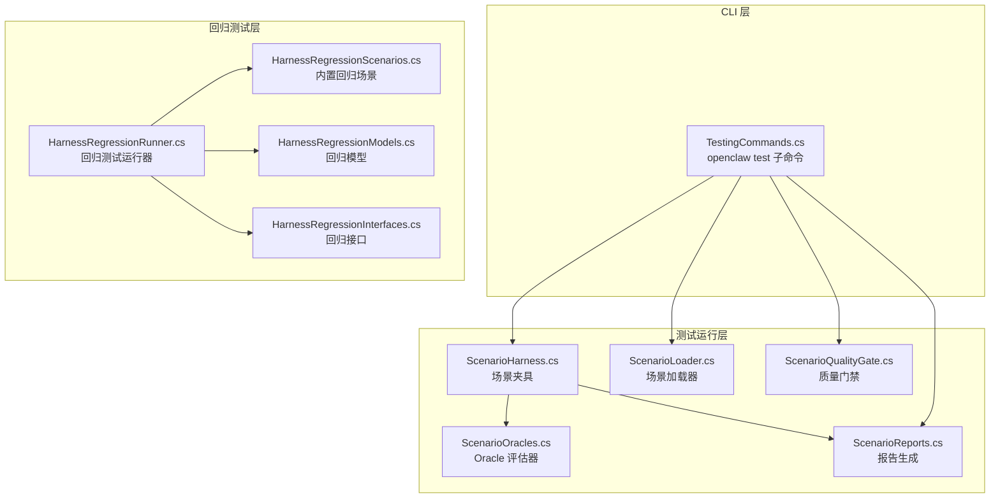
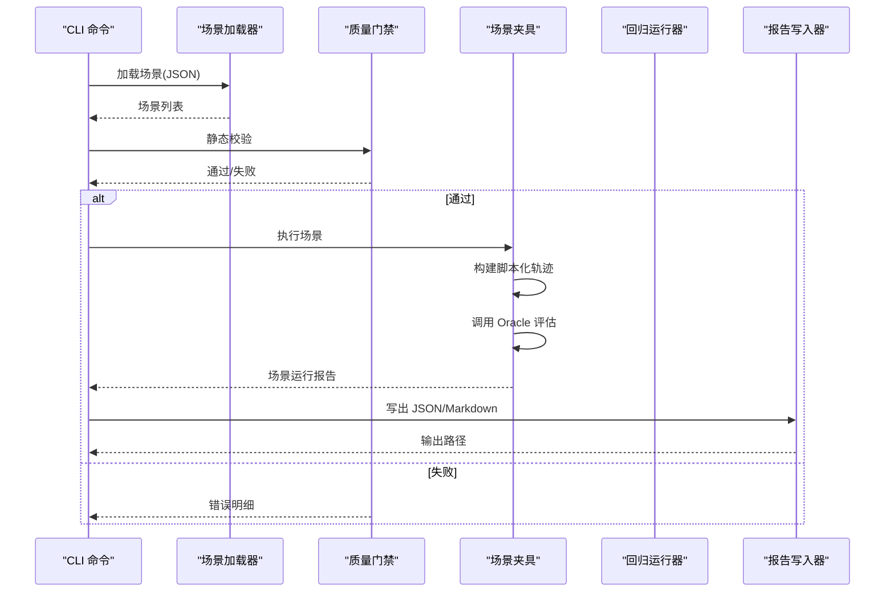
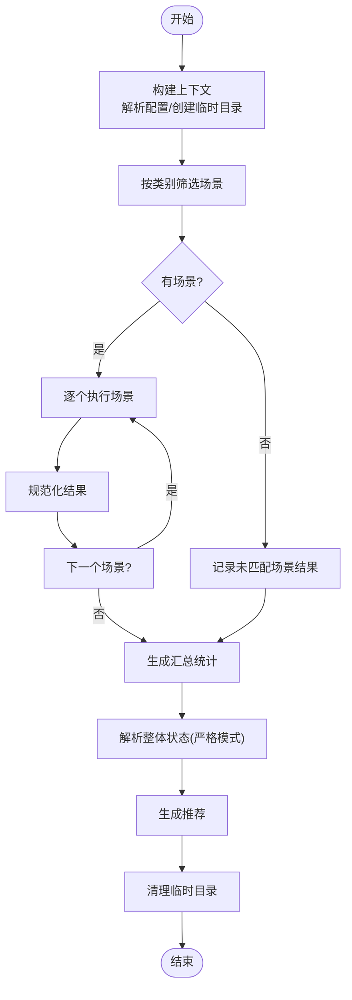
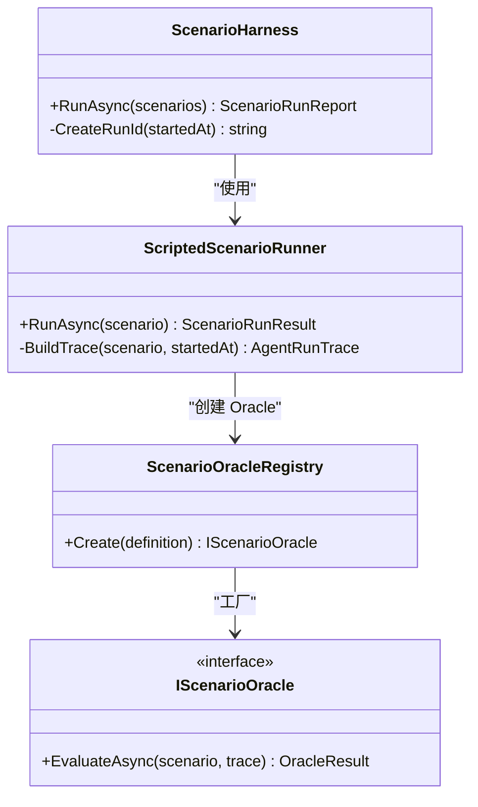
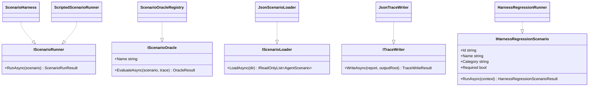

# 测试架构设计

<cite>
**本文引用的文件**
- [HarnessRegressionRunner.cs](file://src/OpenClaw.Testing/HarnessRegressionRunner.cs)
- [HarnessRegressionInterfaces.cs](file://src/OpenClaw.Testing/HarnessRegressionInterfaces.cs)
- [HarnessRegressionModels.cs](file://src/OpenClaw.Testing/HarnessRegressionModels.cs)
- [HarnessRegressionScenarios.cs](file://src/OpenClaw.Testing/HarnessRegressionScenarios.cs)
- [ScenarioHarness.cs](file://src/OpenClaw.Testing/ScenarioHarness.cs)
- [ScenarioInterfaces.cs](file://src/OpenClaw.Testing/ScenarioInterfaces.cs)
- [ScenarioModels.cs](file://src/OpenClaw.Testing/ScenarioModels.cs)
- [ScenarioLoader.cs](file://src/OpenClaw.Testing/ScenarioLoader.cs)
- [ScenarioOracles.cs](file://src/OpenClaw.Testing/ScenarioOracles.cs)
- [ScenarioReports.cs](file://src/OpenClaw.Testing/ScenarioReports.cs)
- [ScenarioQualityGate.cs](file://src/OpenClaw.Testing/ScenarioQualityGate.cs)
- [TestingCommands.cs](file://src/OpenClaw.Cli/TestingCommands.cs)
</cite>

## 目录
1. [引言](#引言)
2. [项目结构](#项目结构)
3. [核心组件](#核心组件)
4. [架构总览](#架构总览)
5. [详细组件分析](#详细组件分析)
6. [依赖关系分析](#依赖关系分析)
7. [性能考量](#性能考量)
8. [故障排查指南](#故障排查指南)
9. [结论](#结论)
10. [附录](#附录)

## 引言
本技术文档面向测试架构设计，系统性阐述测试框架的整体架构与实现原理，重点覆盖以下方面：
- 回归测试运行器：如何加载场景、执行测试、汇总结果与退出码判定
- 场景夹具与接口：Agent 场景模型、脚本化轨迹、运行报告与质量门禁
- 接口定义：场景加载器、运行器、Oracle 评估器、追踪写入器等
- 执行流程：从 CLI 命令到场景加载、运行、报告生成与输出
- 上下文管理：配置解析、离线模式、临时工作空间清理
- 结果收集与质量评估：统计、严重级别、推荐系统
- 配置项与扩展点：可插拔的场景与 Oracle 类型、可定制的推荐策略
- 性能优化与最佳实践：异步执行、取消令牌、最小化 IO、路径安全

## 项目结构
测试相关代码集中在 OpenClaw.Testing 与 OpenClaw.Cli 两个子系统中：
- OpenClaw.Testing：提供回归测试运行器、场景夹具、Oracle 评估器、报告生成、质量门禁等能力
- OpenClaw.Cli：提供 openclaw test 子命令，封装场景初始化、运行、报告重生成与质量门禁检查

图表来源
- [TestingCommands.cs:12-171](file://src/OpenClaw.Cli/TestingCommands.cs#L12-L171)
- [ScenarioHarness.cs:123-179](file://src/OpenClaw.Testing/ScenarioHarness.cs#L123-L179)
- [ScenarioOracles.cs:33-62](file://src/OpenClaw.Testing/ScenarioOracles.cs#L33-L62)
- [ScenarioLoader.cs:5-40](file://src/OpenClaw.Testing/ScenarioLoader.cs#L5-L40)
- [ScenarioQualityGate.cs:16-74](file://src/OpenClaw.Testing/ScenarioQualityGate.cs#L16-L74)
- [ScenarioReports.cs:6-96](file://src/OpenClaw.Testing/ScenarioReports.cs#L6-L96)
- [HarnessRegressionRunner.cs:7-68](file://src/OpenClaw.Testing/HarnessRegressionRunner.cs#L7-L68)
- [HarnessRegressionScenarios.cs:15-36](file://src/OpenClaw.Testing/HarnessRegressionScenarios.cs#L15-L36)
- [HarnessRegressionModels.cs:39-77](file://src/OpenClaw.Testing/HarnessRegressionModels.cs#L39-L77)
- [HarnessRegressionInterfaces.cs:3-13](file://src/OpenClaw.Testing/HarnessRegressionInterfaces.cs#L3-L13)

章节来源
- [TestingCommands.cs:12-171](file://src/OpenClaw.Cli/TestingCommands.cs#L12-L171)
- [HarnessRegressionRunner.cs:7-68](file://src/OpenClaw.Testing/HarnessRegressionRunner.cs#L7-L68)

## 核心组件
- 回归测试运行器（HarnessRegressionRunner）
  - 负责构建上下文、选择场景、执行并汇总结果、生成报告与推荐、计算退出码
  - 支持严格模式与离线模式，自动清理临时工作空间
- 场景夹具（ScenarioHarness）
  - 将 Agent 场景转换为可执行的脚本化轨迹，驱动 Oracle 评估器逐条验证
  - 产出 Markdown 报告与 JSON 结果集
- 场景加载器（JsonScenarioLoader）
  - 递归扫描目录，解析 JSON 场景文件，标准化缺失字段
- Oracle 评估器（ScenarioOracles）
  - 提供工具调用、最终答案、审批请求、无 unsafe 工具等评估类型
  - 可注册自定义 Oracle 类型
- 质量门禁（ScenarioQualityGate）
  - 检查场景 ID/标题、期望行为、高风险场景的 Oracle 必备性等
- 报告与追踪（ScenarioReports）
  - 生成 Markdown 报告；将单个场景轨迹与报告持久化到磁盘
- CLI 命令（TestingCommands）
  - openclaw test init/run/report/gates 子命令，统一入口与参数解析

章节来源
- [HarnessRegressionRunner.cs:7-68](file://src/OpenClaw.Testing/HarnessRegressionRunner.cs#L7-L68)
- [ScenarioHarness.cs:123-179](file://src/OpenClaw.Testing/ScenarioHarness.cs#L123-L179)
- [ScenarioLoader.cs:5-40](file://src/OpenClaw.Testing/ScenarioLoader.cs#L5-L40)
- [ScenarioOracles.cs:33-62](file://src/OpenClaw.Testing/ScenarioOracles.cs#L33-L62)
- [ScenarioQualityGate.cs:16-74](file://src/OpenClaw.Testing/ScenarioQualityGate.cs#L16-L74)
- [ScenarioReports.cs:6-96](file://src/OpenClaw.Testing/ScenarioReports.cs#L6-L96)
- [TestingCommands.cs:12-171](file://src/OpenClaw.Cli/TestingCommands.cs#L12-L171)

## 架构总览
测试架构采用“分层+插件化”设计：
- CLI 层负责用户交互与参数传递
- 运行层负责场景加载、执行与报告生成
- 回归层负责系统级回归场景与上下文管理
- Oracle 层提供可扩展的评估策略
- 质量门禁在运行前进行静态校验，降低无效执行成本

图表来源
- [TestingCommands.cs:60-82](file://src/OpenClaw.Cli/TestingCommands.cs#L60-L82)
- [ScenarioLoader.cs:5-40](file://src/OpenClaw.Testing/ScenarioLoader.cs#L5-L40)
- [ScenarioQualityGate.cs:25-74](file://src/OpenClaw.Testing/ScenarioQualityGate.cs#L25-L74)
- [ScenarioHarness.cs:129-171](file://src/OpenClaw.Testing/ScenarioHarness.cs#L129-L171)
- [ScenarioReports.cs:98-151](file://src/OpenClaw.Testing/ScenarioReports.cs#L98-L151)

## 详细组件分析

### 回归测试运行器（HarnessRegressionRunner）
- 上下文构建
  - 解析配置路径、检测存在性、尝试加载 GatewayConfig
  - 创建临时工作空间，支持离线模式与严格模式
- 场景选择与执行
  - 支持按类别筛选场景
  - 并发友好：逐个执行，尊重取消令牌
- 结果规范化与汇总
  - 规范化状态/严重级别，填充时间戳与耗时
  - 统计总数、通过数、失败数、跳过数、警告数、不适用数
- 整体状态与退出码
  - 严格模式下，警告或跳过也会导致失败
  - 仅当必选场景失败才失败
- 推荐系统
  - 基于场景结果与类别，生成下一步建议命令
- 清理策略
  - 无论成功与否，最终清理临时工作空间

图表来源
- [HarnessRegressionRunner.cs:18-68](file://src/OpenClaw.Testing/HarnessRegressionRunner.cs#L18-L68)
- [HarnessRegressionRunner.cs:129-137](file://src/OpenClaw.Testing/HarnessRegressionRunner.cs#L129-L137)
- [HarnessRegressionRunner.cs:158-187](file://src/OpenClaw.Testing/HarnessRegressionRunner.cs#L158-L187)
- [HarnessRegressionRunner.cs:189-229](file://src/OpenClaw.Testing/HarnessRegressionRunner.cs#L189-L229)
- [HarnessRegressionRunner.cs:231-292](file://src/OpenClaw.Testing/HarnessRegressionRunner.cs#L231-L292)
- [HarnessRegressionRunner.cs:300-322](file://src/OpenClaw.Testing/HarnessRegressionRunner.cs#L300-L322)

章节来源
- [HarnessRegressionRunner.cs:7-68](file://src/OpenClaw.Testing/HarnessRegressionRunner.cs#L7-L68)
- [HarnessRegressionRunner.cs:90-127](file://src/OpenClaw.Testing/HarnessRegressionRunner.cs#L90-L127)
- [HarnessRegressionRunner.cs:129-137](file://src/OpenClaw.Testing/HarnessRegressionRunner.cs#L129-L137)
- [HarnessRegressionRunner.cs:158-187](file://src/OpenClaw.Testing/HarnessRegressionRunner.cs#L158-L187)
- [HarnessRegressionRunner.cs:189-229](file://src/OpenClaw.Testing/HarnessRegressionRunner.cs#L189-L229)
- [HarnessRegressionRunner.cs:231-292](file://src/OpenClaw.Testing/HarnessRegressionRunner.cs#L231-L292)
- [HarnessRegressionRunner.cs:300-322](file://src/OpenClaw.Testing/HarnessRegressionRunner.cs#L300-L322)

### 场景夹具（ScenarioHarness）与脚本化轨迹
- 脚本化轨迹
  - 将场景中的 scriptedTrace 步骤复制为可验证的 AgentRunTrace
  - 缺失脚本时自动注入事件步骤
- Oracle 评估
  - 逐条评估，聚合失败消息
  - 产出通过/失败、证据清单与摘要
- 报告生成
  - 生成 Markdown 报告，包含失败详情与证据
  - 限制 RunId 最大长度，确保文件系统兼容

图表来源
- [ScenarioHarness.cs:123-179](file://src/OpenClaw.Testing/ScenarioHarness.cs#L123-L179)
- [ScenarioHarness.cs:3-57](file://src/OpenClaw.Testing/ScenarioHarness.cs#L3-L57)
- [ScenarioHarness.cs:59-121](file://src/OpenClaw.Testing/ScenarioHarness.cs#L59-L121)
- [ScenarioOracles.cs:33-62](file://src/OpenClaw.Testing/ScenarioOracles.cs#L33-L62)

章节来源
- [ScenarioHarness.cs:123-179](file://src/OpenClaw.Testing/ScenarioHarness.cs#L123-L179)
- [ScenarioHarness.cs:3-57](file://src/OpenClaw.Testing/ScenarioHarness.cs#L3-L57)
- [ScenarioHarness.cs:59-121](file://src/OpenClaw.Testing/ScenarioHarness.cs#L59-L121)
- [ScenarioOracles.cs:33-62](file://src/OpenClaw.Testing/ScenarioOracles.cs#L33-L62)

### 场景加载器（JsonScenarioLoader）
- 递归枚举目录下的 JSON 文件，支持数组与对象两种根结构
- 标准化缺失字段（如 Id/Title、输入、期望、Oracle、脚本化轨迹）
- 元数据字典统一大小写敏感策略

章节来源
- [ScenarioLoader.cs:5-40](file://src/OpenClaw.Testing/ScenarioLoader.cs#L5-L40)
- [ScenarioLoader.cs:42-153](file://src/OpenClaw.Testing/ScenarioLoader.cs#L42-L153)

### Oracle 评估器（ScenarioOracles）
- 注册表支持多种评估类型：工具调用/未调用、最大调用次数、最终答案包含/不包含、审批需求、无 unsafe 工具等
- 支持从定义或场景期望中提取阈值与值
- 提供通用基类，便于扩展新类型

章节来源
- [ScenarioOracles.cs:33-62](file://src/OpenClaw.Testing/ScenarioOracles.cs#L33-L62)
- [ScenarioOracles.cs:183-210](file://src/OpenClaw.Testing/ScenarioOracles.cs#L183-L210)
- [ScenarioOracles.cs:212-239](file://src/OpenClaw.Testing/ScenarioOracles.cs#L212-L239)
- [ScenarioOracles.cs:241-259](file://src/OpenClaw.Testing/ScenarioOracles.cs#L241-L259)
- [ScenarioOracles.cs:261-283](file://src/OpenClaw.Testing/ScenarioOracles.cs#L261-L283)
- [ScenarioOracles.cs:285-307](file://src/OpenClaw.Testing/ScenarioOracles.cs#L285-L307)
- [ScenarioOracles.cs:309-348](file://src/OpenClaw.Testing/ScenarioOracles.cs#L309-L348)
- [ScenarioOracles.cs:350-408](file://src/OpenClaw.Testing/ScenarioOracles.cs#L350-L408)

### 质量门禁（ScenarioQualityGate）
- 校验场景 ID/标题、是否声明明确期望行为
- 高风险与关键风险场景必须声明至少一个 Oracle
- 工具使用/审批/安全场景需声明相应 Oracle
- 检测重复 ID

章节来源
- [ScenarioQualityGate.cs:25-74](file://src/OpenClaw.Testing/ScenarioQualityGate.cs#L25-L74)
- [ScenarioQualityGate.cs:83-109](file://src/OpenClaw.Testing/ScenarioQualityGate.cs#L83-L109)

### 报告与追踪（ScenarioReports）
- Markdown 报告：表格汇总、失败详情、证据清单
- JSON 追踪写入：按场景写出独立 trace.json，同时写出 results.json 与 report.md
- 最新报告读取：按目录时间排序，定位最新运行目录

章节来源
- [ScenarioReports.cs:6-96](file://src/OpenClaw.Testing/ScenarioReports.cs#L6-L96)
- [ScenarioReports.cs:98-151](file://src/OpenClaw.Testing/ScenarioReports.cs#L98-L151)
- [ScenarioReports.cs:153-189](file://src/OpenClaw.Testing/ScenarioReports.cs#L153-L189)

### CLI 命令（TestingCommands）
- 子命令：init、run、report、gates
- 初始化：创建示例场景与文档目录
- 运行：加载场景、质量门禁、执行、写出报告、根据失败策略决定退出码
- 报告重生成：基于最新运行目录重建 Markdown 报告
- 质量门禁：仅做静态校验

章节来源
- [TestingCommands.cs:12-171](file://src/OpenClaw.Cli/TestingCommands.cs#L12-L171)
- [TestingCommands.cs:60-82](file://src/OpenClaw.Cli/TestingCommands.cs#L60-L82)
- [TestingCommands.cs:84-99](file://src/OpenClaw.Cli/TestingCommands.cs#L84-L99)
- [TestingCommands.cs:101-114](file://src/OpenClaw.Cli/TestingCommands.cs#L101-L114)

## 依赖关系分析
- 接口契约
  - IScenarioRunner：定义场景运行接口
  - IScenarioOracle：定义 Oracle 评估接口
  - IScenarioLoader：定义场景加载接口
  - ITraceWriter：定义追踪写入接口
- 回归接口
  - IHarnessRegressionScenario：定义回归场景接口
  - HarnessRegressionScenarioBase：提供统一的执行骨架与异常捕获
- 模型与上下文
  - HarnessRegressionOptions/Context/Report 等模型贯穿运行器与 CLI
  - 场景模型（AgentScenario、AgentRunTrace、OracleResult 等）支撑夹具与报告

图表来源
- [ScenarioInterfaces.cs:3-29](file://src/OpenClaw.Testing/ScenarioInterfaces.cs#L3-L29)
- [HarnessRegressionInterfaces.cs:3-13](file://src/OpenClaw.Testing/HarnessRegressionInterfaces.cs#L3-L13)
- [ScenarioHarness.cs:123-127](file://src/OpenClaw.Testing/ScenarioHarness.cs#L123-L127)
- [ScenarioOracles.cs:33-62](file://src/OpenClaw.Testing/ScenarioOracles.cs#L33-L62)
- [ScenarioLoader.cs:5-20](file://src/OpenClaw.Testing/ScenarioLoader.cs#L5-L20)
- [ScenarioReports.cs:98-104](file://src/OpenClaw.Testing/ScenarioReports.cs#L98-L104)
- [HarnessRegressionRunner.cs:11-14](file://src/OpenClaw.Testing/HarnessRegressionRunner.cs#L11-L14)

章节来源
- [ScenarioInterfaces.cs:3-29](file://src/OpenClaw.Testing/ScenarioInterfaces.cs#L3-L29)
- [HarnessRegressionInterfaces.cs:3-13](file://src/OpenClaw.Testing/HarnessRegressionInterfaces.cs#L3-L13)

## 性能考量
- 异步与取消
  - 所有长耗时操作均支持 CancellationToken，避免阻塞
- IO 最小化
  - 场景加载采用流式解析，避免一次性加载大文件
  - 追踪写入按场景拆分，便于增量处理
- 路径安全
  - 临时工作空间路径解析与边界检查，防止路径逃逸
- 并发友好
  - 回归运行器逐个执行场景，避免竞争条件；可扩展为并发池以提升吞吐
- 序列化开销
  - 使用源生成的 JSON 上下文，减少反射与装箱

## 故障排查指南
- 配置加载失败
  - 检查配置路径是否存在与可读；查看 ConfigLoadError 字段
- 场景未匹配
  - 使用 --category 精确筛选；确认场景 Id 与 Category 是否正确
- 严格模式失败
  - 严格模式下警告或跳过也会导致整体失败；可关闭严格模式或修复问题
- 临时目录清理失败
  - IO 或权限异常会被静默忽略；可在退出后手动清理
- 质量门禁失败
  - 按错误提示补齐场景 ID/标题、期望行为、高风险场景的 Oracle 等
- 追踪写入失败
  - 检查输出根目录可写；RunId 必须为相对路径且合法

章节来源
- [HarnessRegressionRunner.cs:90-127](file://src/OpenClaw.Testing/HarnessRegressionRunner.cs#L90-L127)
- [HarnessRegressionRunner.cs:307-322](file://src/OpenClaw.Testing/HarnessRegressionRunner.cs#L307-L322)
- [ScenarioQualityGate.cs:25-74](file://src/OpenClaw.Testing/ScenarioQualityGate.cs#L25-L74)
- [ScenarioReports.cs:191-207](file://src/OpenClaw.Testing/ScenarioReports.cs#L191-L207)

## 结论
该测试架构以“可插拔的场景与 Oracle、严格的上下文与清理、完善的报告与推荐”为核心，既满足回归测试的稳定性要求，又具备良好的扩展性与可观测性。通过质量门禁前置校验与 CLI 统一入口，显著降低了测试门槛与误用风险。

## 附录

### 测试选项配置
- 回归测试运行器选项
  - ConfigPath：显式配置路径
  - Category：按类别筛选场景
  - Offline：离线模式（跳过网络/凭证检查）
  - Strict：严格模式（警告/跳过即失败）
  - ProposalId：提案标识
  - OutputPath：报告输出路径
- 场景运行 CLI 选项
  - --scenarios/--scenario-dir：场景目录
  - --output：输出根目录
  - --fail-on：失败策略（any/high）

章节来源
- [HarnessRegressionModels.cs:39-47](file://src/OpenClaw.Testing/HarnessRegressionModels.cs#L39-L47)
- [TestingCommands.cs:131-141](file://src/OpenClaw.Cli/TestingCommands.cs#L131-L141)

### 测试分类体系与严重级别
- 分类（Category）
  - Onboarding、Security、Approvals、Memory、Providers、Tools、Mcp、OpenAiCompat、Sessions、Harness、Deployment、Docs
- 严重级别（Severity）
  - Info、Low、Medium、High、Critical
- 状态（Status）
  - Passed、Failed、Skipped、Warning、NotApplicable

章节来源
- [HarnessRegressionModels.cs:14-37](file://src/OpenClaw.Testing/HarnessRegressionModels.cs#L14-L37)

### 推荐系统
- 基于场景结果与类别，生成下一步命令建议
  - 示例：快速入门配置问题 -> openclaw setup verify --offline
  - 示例：安全/提供商问题 -> openclaw admin posture 或 openclaw models doctor
  - 示例：跳过/不适用检查 -> openclaw harness test --strict

章节来源
- [HarnessRegressionRunner.cs:231-292](file://src/OpenClaw.Testing/HarnessRegressionRunner.cs#L231-L292)