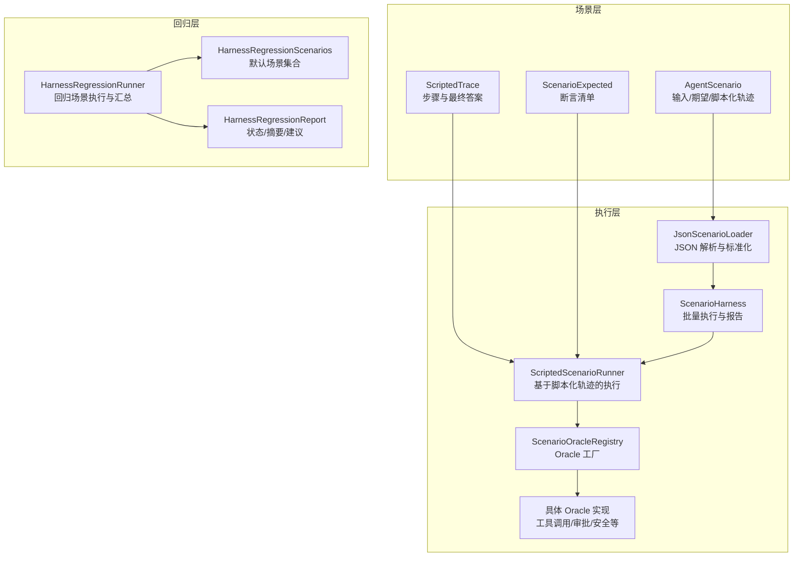
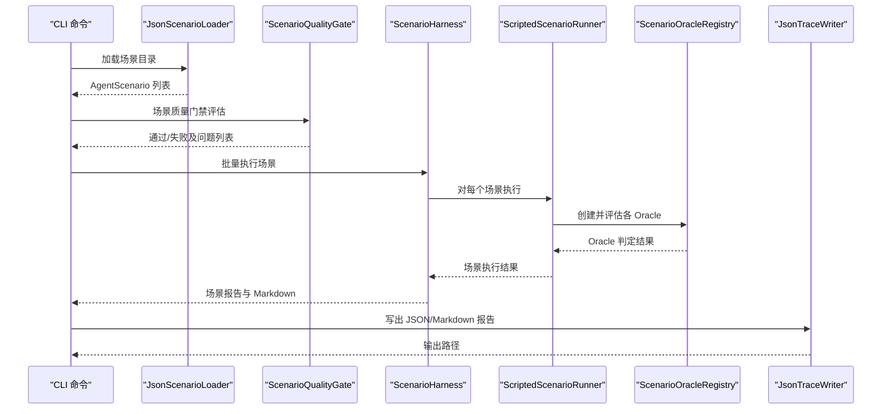
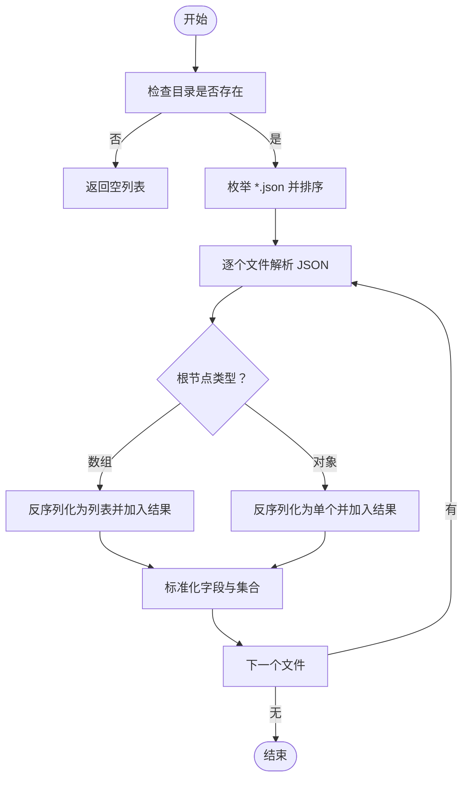
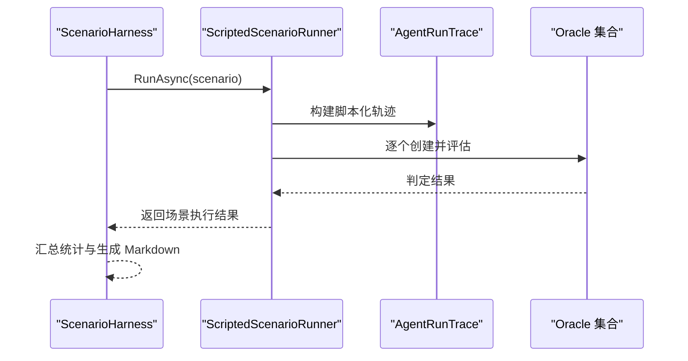
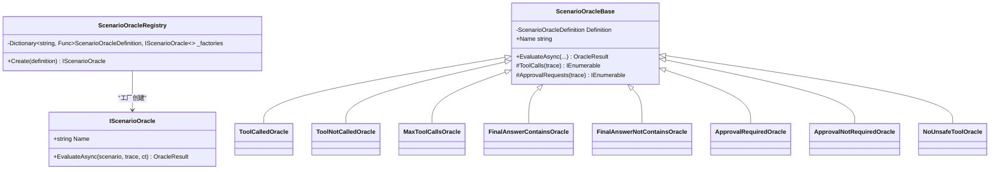
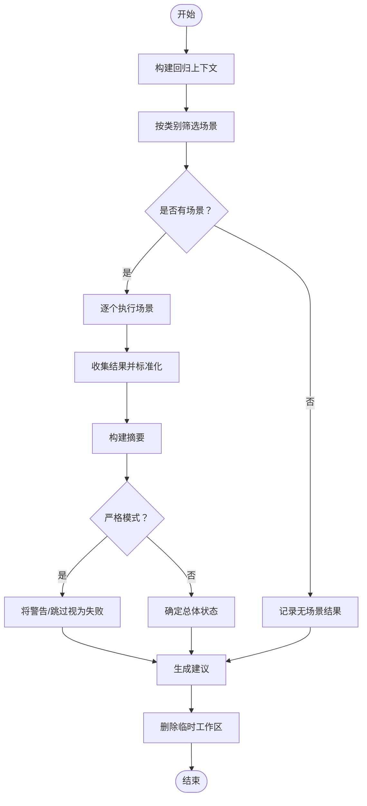
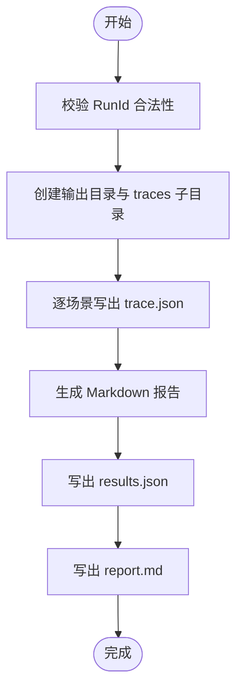
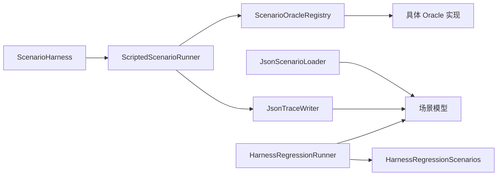

# 测试架构设计

<cite>
**本文档引用的文件**
- [ScenarioLoader.cs](file://src/OpenClaw.Testing/ScenarioLoader.cs)
- [ScenarioHarness.cs](file://src/OpenClaw.Testing/ScenarioHarness.cs)
- [HarnessRegressionRunner.cs](file://src/OpenClaw.Testing/HarnessRegressionRunner.cs)
- [ScenarioInterfaces.cs](file://src/OpenClaw.Testing/ScenarioInterfaces.cs)
- [HarnessRegressionInterfaces.cs](file://src/OpenClaw.Testing/HarnessRegressionInterfaces.cs)
- [ScenarioModels.cs](file://src/OpenClaw.Testing/ScenarioModels.cs)
- [HarnessRegressionModels.cs](file://src/OpenClaw.Testing/HarnessRegressionModels.cs)
- [ScenarioOracles.cs](file://src/OpenClaw.Testing/ScenarioOracles.cs)
- [ScenarioReports.cs](file://src/OpenClaw.Testing/ScenarioReports.cs)
- [HarnessRegressionScenarios.cs](file://src/OpenClaw.Testing/HarnessRegressionScenarios.cs)
- [ScenarioQualityGate.cs](file://src/OpenClaw.Testing/ScenarioQualityGate.cs)
- [TestingCommands.cs](file://src/OpenClaw.Cli/TestingCommands.cs)
- [OpenClaw.Testing.csproj](file://src/OpenClaw.Testing/OpenClaw.Testing.csproj)
</cite>

## 目录
1. [简介](#简介)
2. [项目结构](#项目结构)
3. [核心组件](#核心组件)
4. [架构总览](#架构总览)
5. [详细组件分析](#详细组件分析)
6. [依赖关系分析](#依赖关系分析)
7. [性能考量](#性能考量)
8. [故障排除指南](#故障排除指南)
9. [结论](#结论)
10. [附录](#附录)

## 简介
本文件系统性阐述 OpenClaw 测试架构的设计与实现，覆盖场景加载器、测试执行器、模型定义、回归测试接口以及 CLI 命令层。文档重点解释以下方面：
- 场景加载器如何从 JSON 文件解析并标准化 Agent 场景与脚本化轨迹
- 场景执行器如何基于“金标准”脚本化轨迹与“探针式”判定规则（Oracle）进行断言
- 回归测试运行器如何组织多类运行场景（如安全、工具、内存、部署等），并生成可操作的报告与建议
- 架构决策的技术背景与设计权衡，包括可扩展性、可维护性与可审计性

## 项目结构
OpenClaw 的测试子系统位于 src/OpenClaw.Testing，围绕“场景驱动 + 探针判定 + 回归检查”的三层结构展开：
- 场景层：AgentScenario 及其输入、期望、脚本化轨迹与元数据
- 执行层：场景加载器、场景执行器与 Oracle 判定集
- 回归层：回归场景集合、上下文构建、结果汇总与推荐

**图表来源**
- [ScenarioLoader.cs:5-40](file://src/OpenClaw.Testing/ScenarioLoader.cs#L5-L40)
- [ScenarioHarness.cs:123-179](file://src/OpenClaw.Testing/ScenarioHarness.cs#L123-L179)
- [ScenarioOracles.cs:33-62](file://src/OpenClaw.Testing/ScenarioOracles.cs#L33-L62)
- [HarnessRegressionRunner.cs:7-68](file://src/OpenClaw.Testing/HarnessRegressionRunner.cs#L7-L68)
- [HarnessRegressionScenarios.cs:15-36](file://src/OpenClaw.Testing/HarnessRegressionScenarios.cs#L15-L36)

**章节来源**
- [OpenClaw.Testing.csproj:1-15](file://src/OpenClaw.Testing/OpenClaw.Testing.csproj#L1-L15)

## 核心组件
- 场景加载器：从目录递归扫描 JSON 文件，支持数组或对象两种根节点格式，统一标准化字段（空值填充、大小写不敏感字典、脚本化轨迹规范化）
- 场景执行器：以脚本化轨迹为“金标准”，通过 Oracle 集合对工具调用、最终答案、审批请求、安全策略等维度进行判定
- 模型定义：涵盖 AgentScenario、ScriptedTrace、AgentRunTrace、Oracle 结果、回归场景上下文与报告等
- 回归测试运行器：按类别筛选回归场景，构建临时工作区，执行并汇总结果，输出 JSON 文本报告与建议
- 质量门禁：在执行前对场景完整性与风险级别进行静态校验，避免低质量场景污染测试结果

**章节来源**
- [ScenarioLoader.cs:5-40](file://src/OpenClaw.Testing/ScenarioLoader.cs#L5-L40)
- [ScenarioHarness.cs:123-179](file://src/OpenClaw.Testing/ScenarioHarness.cs#L123-L179)
- [ScenarioModels.cs:15-94](file://src/OpenClaw.Testing/ScenarioModels.cs#L15-L94)
- [HarnessRegressionRunner.cs:7-68](file://src/OpenClaw.Testing/HarnessRegressionRunner.cs#L7-L68)
- [HarnessRegressionModels.cs:39-95](file://src/OpenClaw.Testing/HarnessRegressionModels.cs#L39-L95)
- [ScenarioQualityGate.cs:16-74](file://src/OpenClaw.Testing/ScenarioQualityGate.cs#L16-L74)

## 架构总览
下图展示测试框架从 CLI 到执行再到报告的端到端流程。

**图表来源**
- [TestingCommands.cs:60-82](file://src/OpenClaw.Cli/TestingCommands.cs#L60-L82)
- [ScenarioLoader.cs:7-40](file://src/OpenClaw.Testing/ScenarioLoader.cs#L7-L40)
- [ScenarioQualityGate.cs:25-74](file://src/OpenClaw.Testing/ScenarioQualityGate.cs#L25-L74)
- [ScenarioHarness.cs:129-171](file://src/OpenClaw.Testing/ScenarioHarness.cs#L129-L171)
- [ScenarioOracles.cs:33-62](file://src/OpenClaw.Testing/ScenarioOracles.cs#L33-L62)
- [ScenarioReports.cs:98-151](file://src/OpenClaw.Testing/ScenarioReports.cs#L98-L151)

## 详细组件分析

### 场景加载器（JsonScenarioLoader）
- 功能要点
  - 递归扫描目录，枚举 *.json 文件并排序
  - 支持数组与对象两种根节点，分别反序列化为列表或单个场景
  - 标准化 AgentScenario 字段：空字符串默认值、空集合默认值、大小写不敏感元数据字典、脚本化轨迹与步骤规范化
- 设计权衡
  - 使用 System.Text.Json 与源生成上下文，兼顾性能与类型安全
  - 规范化逻辑集中于单点，确保后续执行与报告一致性
- 错误处理
  - 目录不存在时返回空列表；解析失败不影响其他文件

**图表来源**
- [ScenarioLoader.cs:7-40](file://src/OpenClaw.Testing/ScenarioLoader.cs#L7-L40)
- [ScenarioModels.cs:15-94](file://src/OpenClaw.Testing/ScenarioModels.cs#L15-L94)

**章节来源**
- [ScenarioLoader.cs:5-40](file://src/OpenClaw.Testing/ScenarioLoader.cs#L5-L40)

### 场景执行器与脚本化运行器（ScenarioHarness / ScriptedScenarioRunner）
- 功能要点
  - ScriptedScenarioRunner 基于脚本化轨迹构建 AgentRunTrace，并逐条执行 Oracle 判定
  - 若未提供脚本化轨迹或未声明 Oracle，则直接判定失败
  - ScenarioHarness 批量执行场景，汇总统计并生成 Markdown 报告
- 设计权衡
  - 将“脚本化轨迹”作为“金标准”，确保测试可重复、可审计
  - Oracle 注册表解耦不同断言类型，便于扩展
- 性能与并发
  - 支持取消令牌；顺序执行保证可重现性

**图表来源**
- [ScenarioHarness.cs:3-57](file://src/OpenClaw.Testing/ScenarioHarness.cs#L3-L57)
- [ScenarioHarness.cs:123-179](file://src/OpenClaw.Testing/ScenarioHarness.cs#L123-L179)
- [ScenarioOracles.cs:33-62](file://src/OpenClaw.Testing/ScenarioOracles.cs#L33-L62)

**章节来源**
- [ScenarioHarness.cs:3-121](file://src/OpenClaw.Testing/ScenarioHarness.cs#L3-L121)
- [ScenarioHarness.cs:123-179](file://src/OpenClaw.Testing/ScenarioHarness.cs#L123-L179)

### Oracle 判定体系（ScenarioOracleRegistry 与具体实现）
- 功能要点
  - 注册表根据类型工厂化创建 Oracle 实例
  - 提供通用工具：工具调用提取、审批请求提取、证据收集、键名归一化
  - 具体 Oracle 包含：工具调用/未调用、最大调用次数、最终答案包含/不包含、审批需求/无需审批、禁止危险工具等
- 设计权衡
  - 将断言逻辑模块化，便于新增类型与组合使用
  - 危险工具策略可通过构造函数注入，支持自定义扩展
- 复杂度分析
  - 工具调用与审批请求提取为 O(n) 遍历；证据拼接采用稳定排序与去重，时间复杂度受步骤数影响

**图表来源**
- [ScenarioOracles.cs:33-62](file://src/OpenClaw.Testing/ScenarioOracles.cs#L33-L62)
- [ScenarioOracles.cs:183-210](file://src/OpenClaw.Testing/ScenarioOracles.cs#L183-L210)
- [ScenarioOracles.cs:212-239](file://src/OpenClaw.Testing/ScenarioOracles.cs#L212-L239)
- [ScenarioOracles.cs:241-259](file://src/OpenClaw.Testing/ScenarioOracles.cs#L241-L259)
- [ScenarioOracles.cs:261-283](file://src/OpenClaw.Testing/ScenarioOracles.cs#L261-L283)
- [ScenarioOracles.cs:285-307](file://src/OpenClaw.Testing/ScenarioOracles.cs#L285-L307)
- [ScenarioOracles.cs:309-332](file://src/OpenClaw.Testing/ScenarioOracles.cs#L309-L332)
- [ScenarioOracles.cs:334-348](file://src/OpenClaw.Testing/ScenarioOracles.cs#L334-L348)
- [ScenarioOracles.cs:350-409](file://src/OpenClaw.Testing/ScenarioOracles.cs#L350-L409)

**章节来源**
- [ScenarioOracles.cs:33-62](file://src/OpenClaw.Testing/ScenarioOracles.cs#L33-L62)
- [ScenarioOracles.cs:167-181](file://src/OpenClaw.Testing/ScenarioOracles.cs#L167-L181)
- [ScenarioOracles.cs:183-409](file://src/OpenClaw.Testing/ScenarioOracles.cs#L183-L409)

### 回归测试运行器（HarnessRegressionRunner）
- 功能要点
  - 默认场景集合覆盖引导、安全、工具、内存、部署、文档等多个类别
  - 构建上下文：解析配置文件、检测离线模式、创建临时工作区
  - 执行选择：按类别过滤场景；异常捕获并转为失败结果
  - 汇总与建议：统计状态分布，严格模式下将警告/跳过视为失败，生成可执行建议
- 设计权衡
  - 严格模式用于发布前门禁；非严格模式用于日常回归
  - 临时工作区自动清理，避免磁盘占用
- 复杂度分析
  - 场景执行为 O(n)，汇总统计 O(n)，建议生成 O(n)

**图表来源**
- [HarnessRegressionRunner.cs:18-68](file://src/OpenClaw.Testing/HarnessRegressionRunner.cs#L18-L68)
- [HarnessRegressionRunner.cs:129-137](file://src/OpenClaw.Testing/HarnessRegressionRunner.cs#L129-L137)
- [HarnessRegressionRunner.cs:158-187](file://src/OpenClaw.Testing/HarnessRegressionRunner.cs#L158-L187)
- [HarnessRegressionRunner.cs:189-198](file://src/OpenClaw.Testing/HarnessRegressionRunner.cs#L189-L198)
- [HarnessRegressionRunner.cs:203-229](file://src/OpenClaw.Testing/HarnessRegressionRunner.cs#L203-L229)
- [HarnessRegressionRunner.cs:231-292](file://src/OpenClaw.Testing/HarnessRegressionRunner.cs#L231-L292)

**章节来源**
- [HarnessRegressionRunner.cs:7-68](file://src/OpenClaw.Testing/HarnessRegressionRunner.cs#L7-L68)
- [HarnessRegressionRunner.cs:89-127](file://src/OpenClaw.Testing/HarnessRegressionRunner.cs#L89-L127)
- [HarnessRegressionRunner.cs:129-137](file://src/OpenClaw.Testing/HarnessRegressionRunner.cs#L129-L137)
- [HarnessRegressionRunner.cs:158-187](file://src/OpenClaw.Testing/HarnessRegressionRunner.cs#L158-L187)
- [HarnessRegressionRunner.cs:189-229](file://src/OpenClaw.Testing/HarnessRegressionRunner.cs#L189-L229)
- [HarnessRegressionRunner.cs:231-292](file://src/OpenClaw.Testing/HarnessRegressionRunner.cs#L231-L292)

### 模型定义与接口
- 场景模型：AgentScenario、ScenarioInput、ScenarioExpected、ScriptedTrace、AgentRunTrace、TraceStep、OracleResult、ScenarioRunResult、ScenarioRunReport、ScenarioRunSummary、TraceWriteResult
- 回归模型：HarnessRegressionOptions、HarnessRegressionContext、HarnessRegressionReport、HarnessRegressionScenarioResult、HarnessRegressionSummary、HarnessRegressionRecommendation
- 接口契约：IScenarioLoader、IScenarioRunner、IScenarioOracle、ITraceWriter、IHarnessRegressionScenario

```mermaid
classDiagram
class AgentScenario {
+string Id
+string Title
+string? Description
+ScenarioRisk Risk
+string Type
+string[] Tags
+ScenarioInput Input
+ScenarioExpected Expected
+ScenarioOracleDefinition[] Oracles
+ScriptedTrace? ScriptedTrace
+Dictionary~string,string~ Metadata
}
class ScenarioInput {
+string UserMessage
+string[] Context
+Dictionary~string,string~ Variables
}
class ScenarioExpected {
+string[] MustCallTools
+string[] MustNotCallTools
+string[] FinalAnswerContains
+string[] FinalAnswerMustNotContain
+int? MaxToolCalls
+bool? RequiresApproval
+Dictionary~string,string~ ExpectedState
+string[] ExpectedEvents
+string[] ForbiddenEvents
}
class ScriptedTrace {
+string? FinalAnswer
+string Status
+TraceStep[] Steps
+Dictionary~string,string~ Metadata
}
class AgentRunTrace {
+string RunId
+string ScenarioId
+DateTimeOffset StartedAtUtc
+DateTimeOffset CompletedAtUtc
+TraceStep[] Steps
+string? FinalAnswer
+string Status
+Dictionary~string,string~ Metadata
}
class TraceStep {
+string Kind
+DateTimeOffset TimestampUtc
+string? Message
+string? ToolName
+string? ArgumentsJson
+string? Result
+string? Error
+string? StatePath
+string? From
+string? To
+string? ApprovalId
+Dictionary~string,string~ Metadata
}
class OracleResult {
+bool Passed
+string Name
+string Message
+string[] Evidence
}
class ScenarioRunResult {
+AgentScenario Scenario
+AgentRunTrace Trace
+OracleResult[] OracleResults
+bool Passed
+DateTimeOffset StartedAtUtc
+DateTimeOffset CompletedAtUtc
+string? FailureSummary
}
class ScenarioRunReport {
+string RunId
+DateTimeOffset StartedAtUtc
+DateTimeOffset CompletedAtUtc
+ScenarioRunSummary Summary
+ScenarioRunResult[] Results
+string? Markdown
}
class ScenarioRunSummary {
+int Total
+int Passed
+int Failed
+int HighOrCriticalFailures
}
class TraceWriteResult {
+string RunId
+string DirectoryPath
+string ResultsPath
+string ReportPath
+string[] TracePaths
}
```

**图表来源**
- [ScenarioModels.cs:15-140](file://src/OpenClaw.Testing/ScenarioModels.cs#L15-L140)

**章节来源**
- [ScenarioModels.cs:6-159](file://src/OpenClaw.Testing/ScenarioModels.cs#L6-L159)
- [HarnessRegressionModels.cs:5-115](file://src/OpenClaw.Testing/HarnessRegressionModels.cs#L5-L115)
- [ScenarioInterfaces.cs:3-30](file://src/OpenClaw.Testing/ScenarioInterfaces.cs#L3-L30)
- [HarnessRegressionInterfaces.cs:3-13](file://src/OpenClaw.Testing/HarnessRegressionInterfaces.cs#L3-L13)

### 报告与输出（JsonTraceWriter 与 Markdown 报告）
- JsonTraceWriter：将每个场景的 AgentRunTrace 序列化为独立文件，同时写出 results.json 与 report.md；支持查找最新报告与反序列化
- Markdown 报告：按场景汇总通过/失败与失败 Oracle，对失败场景展开详细证据
- 设计权衡：分离结构化数据与人类可读报告，便于自动化与人工审阅

**图表来源**
- [ScenarioReports.cs:98-151](file://src/OpenClaw.Testing/ScenarioReports.cs#L98-L151)
- [ScenarioReports.cs:6-96](file://src/OpenClaw.Testing/ScenarioReports.cs#L6-L96)

**章节来源**
- [ScenarioReports.cs:98-219](file://src/OpenClaw.Testing/ScenarioReports.cs#L98-L219)

### CLI 命令集成（TestingCommands）
- 子命令：init、run、report、gates
- run：初始化场景目录、加载场景、质量门禁、执行场景、写出报告
- report：基于最新结果重新生成 Markdown 报告
- gates：仅执行质量门禁评估
- 设计权衡：将测试生命周期命令化，便于 CI 集成与本地调试

**章节来源**
- [TestingCommands.cs:12-171](file://src/OpenClaw.Cli/TestingCommands.cs#L12-L171)
- [TestingCommands.cs:173-271](file://src/OpenClaw.Cli/TestingCommands.cs#L173-L271)

## 依赖关系分析
- 组件内聚与耦合
  - 场景加载器与执行器通过标准化模型解耦；执行器通过注册表与 Oracle 解耦
  - 回归运行器与场景运行器职责清晰：前者负责环境与上下文，后者负责具体执行
- 外部依赖
  - System.Text.Json 与源生成上下文用于高性能序列化
  - OpenClaw.Core 与 OpenClaw.Client 提供模型与客户端能力支撑
- 循环依赖
  - 未发现循环依赖；接口与模型分层明确

**图表来源**
- [ScenarioLoader.cs:1-154](file://src/OpenClaw.Testing/ScenarioLoader.cs#L1-L154)
- [ScenarioHarness.cs:1-179](file://src/OpenClaw.Testing/ScenarioHarness.cs#L1-L179)
- [ScenarioOracles.cs:1-409](file://src/OpenClaw.Testing/ScenarioOracles.cs#L1-L409)
- [ScenarioReports.cs:1-219](file://src/OpenClaw.Testing/ScenarioReports.cs#L1-L219)
- [HarnessRegressionRunner.cs:1-383](file://src/OpenClaw.Testing/HarnessRegressionRunner.cs#L1-L383)
- [HarnessRegressionScenarios.cs:1-786](file://src/OpenClaw.Testing/HarnessRegressionScenarios.cs#L1-L786)

**章节来源**
- [OpenClaw.Testing.csproj:10-13](file://src/OpenClaw.Testing/OpenClaw.Testing.csproj#L10-L13)

## 性能考量
- JSON 解析与序列化
  - 使用 System.Text.Json 与源生成上下文，减少反射开销，提升吞吐
- 并发与取消
  - 支持取消令牌；当前执行器为顺序执行，保证可重现性
- I/O 与磁盘
  - 临时工作区与输出目录需注意磁盘空间；建议在 CI 中清理旧产物
- 数据规模
  - 场景与轨迹规模较大时，建议分批执行与增量输出

## 故障排除指南
- 场景加载失败
  - 检查目录路径是否正确；确认 JSON 格式合法；查看标准化后的字段是否为空
- 质量门禁失败
  - 关注缺失 id/title、无显式期望行为、高风险场景缺少 Oracle、工具使用场景缺少工具约束、安全/审批场景缺少对应 Oracle
- 执行失败
  - 检查脚本化轨迹是否提供；确认 Oracle 类型是否正确；核对工具名称大小写与元数据键值
- 回归执行失败
  - 查看严格模式下的警告/跳过是否导致失败；关注建议中的下一步命令
- 报告生成失败
  - 确认输出目录权限；检查最新报告是否存在；必要时重新生成

**章节来源**
- [ScenarioQualityGate.cs:25-109](file://src/OpenClaw.Testing/ScenarioQualityGate.cs#L25-L109)
- [ScenarioHarness.cs:15-57](file://src/OpenClaw.Testing/ScenarioHarness.cs#L15-L57)
- [HarnessRegressionRunner.cs:70-88](file://src/OpenClaw.Testing/HarnessRegressionRunner.cs#L70-L88)
- [ScenarioReports.cs:153-178](file://src/OpenClaw.Testing/ScenarioReports.cs#L153-L178)

## 结论
该测试架构以“脚本化轨迹 + 探针式 Oracle + 回归场景集合”为核心，实现了可重复、可审计、可扩展的测试体系。通过清晰的分层与接口设计，既满足了日常回归验证，也支持发布前的严格门禁。未来可在以下方向持续演进：
- 并发执行与缓存机制，提升大规模场景执行效率
- 更丰富的 Oracle 类型与可视化报告
- 与 CI/CD 平台深度集成，形成闭环质量保障

## 附录
- 场景质量门禁规则
  - 必须包含 id 与 title
  - 至少有一项显式期望行为
  - 高风险与关键风险场景必须声明至少一个 Oracle
  - 工具使用场景必须声明 mustCallTools 或 mustNotCallTools
  - 安全/审批场景必须声明对应的 Oracle 类型
- 回归场景类别
  - 引导、安全、审批、内存、提供方、工具、MCP、OpenAI 兼容、会话、Harness、部署、文档

**章节来源**
- [ScenarioQualityGate.cs:16-109](file://src/OpenClaw.Testing/ScenarioQualityGate.cs#L16-L109)
- [HarnessRegressionModels.cs:14-28](file://src/OpenClaw.Testing/HarnessRegressionModels.cs#L14-L28)
- [HarnessRegressionScenarios.cs:17-35](file://src/OpenClaw.Testing/HarnessRegressionScenarios.cs#L17-L35)