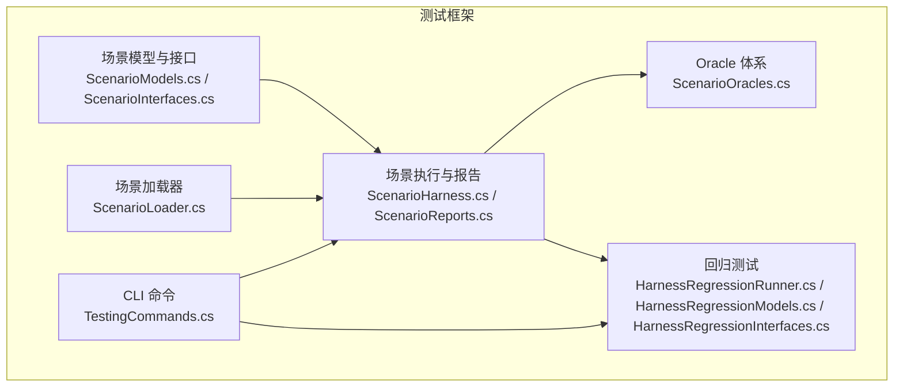
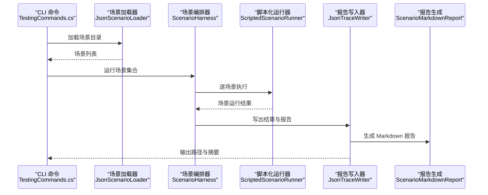
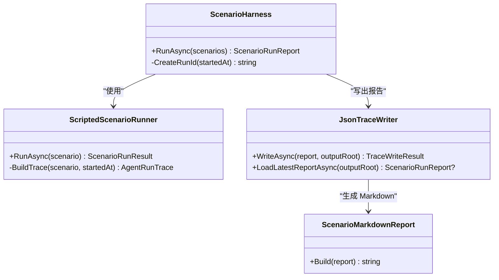
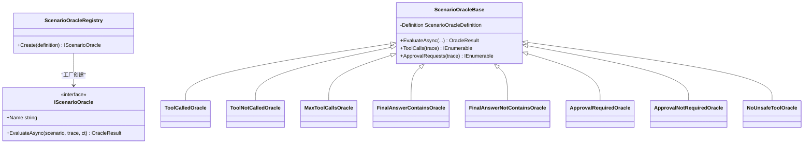
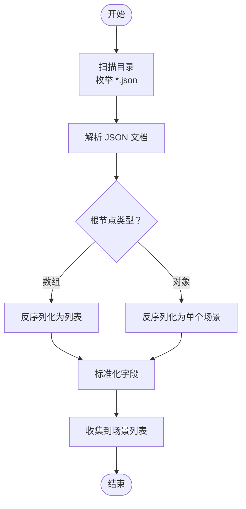
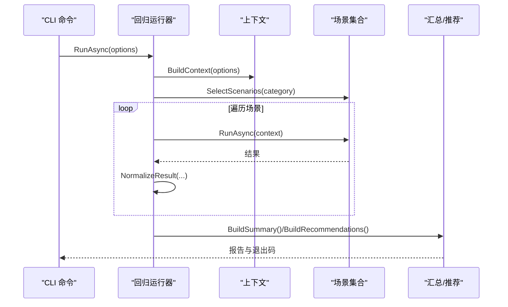
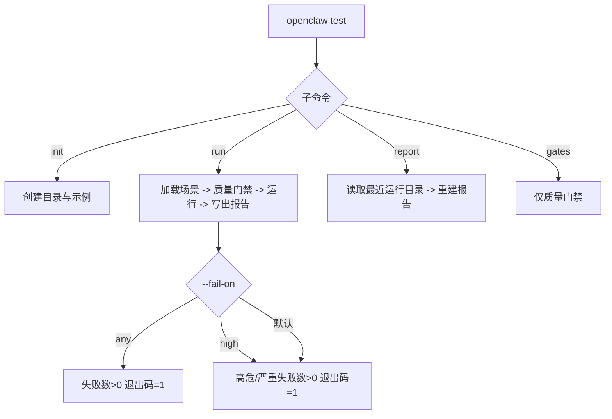
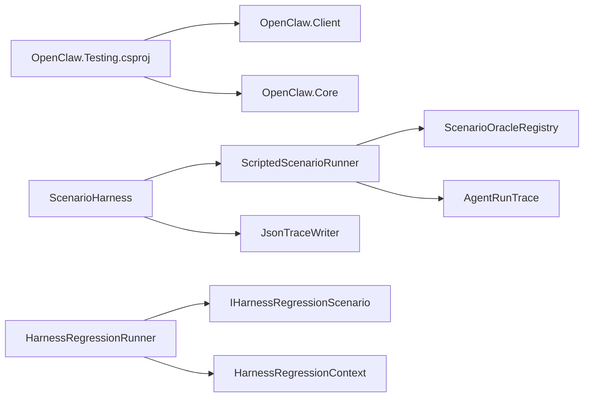

# 测试框架

<cite>
**本文引用的文件**
- [ScenarioHarness.cs](file://src/OpenClaw.Testing/ScenarioHarness.cs)
- [HarnessRegressionRunner.cs](file://src/OpenClaw.Testing/HarnessRegressionRunner.cs)
- [ScenarioLoader.cs](file://src/OpenClaw.Testing/ScenarioLoader.cs)
- [ScenarioReports.cs](file://src/OpenClaw.Testing/ScenarioReports.cs)
- [ScenarioOracles.cs](file://src/OpenClaw.Testing/ScenarioOracles.cs)
- [ScenarioModels.cs](file://src/OpenClaw.Testing/ScenarioModels.cs)
- [HarnessRegressionModels.cs](file://src/OpenClaw.Testing/HarnessRegressionModels.cs)
- [ScenarioInterfaces.cs](file://src/OpenClaw.Testing/ScenarioInterfaces.cs)
- [HarnessRegressionInterfaces.cs](file://src/OpenClaw.Testing/HarnessRegressionInterfaces.cs)
- [TestingCommands.cs](file://src/OpenClaw.Cli/TestingCommands.cs)
- [AgentScenarioHarnessTests.cs](file://src/OpenClaw.Tests/AgentScenarioHarnessTests.cs)
- [HarnessRegressionTests.cs](file://src/OpenClaw.Tests/HarnessRegressionTests.cs)
- [OpenClaw.Testing.csproj](file://src/OpenClaw.Testing/OpenClaw.Testing.csproj)
</cite>

## 目录
1. [简介](#简介)
2. [项目结构](#项目结构)
3. [核心组件](#核心组件)
4. [架构总览](#架构总览)
5. [详细组件分析](#详细组件分析)
6. [依赖关系分析](#依赖关系分析)
7. [性能考量](#性能考量)
8. [故障排查指南](#故障排查指南)
9. [结论](#结论)
10. [附录](#附录)

## 简介
本测试框架围绕“场景驱动”的测试理念，提供两类测试能力：
- 场景测试框架：以脚本化运行轨迹（Scripted Trace）与“金标准”（Oracles）为核心，对智能体行为进行可重复、可验证的判定。
- 回归测试系统：面向运行时配置、安全策略、模型提供方、工具链等维度，形成可分类、可严格模式控制的回归检查集。

同时，框架提供测试用例编写规范、CLI 执行流程、报告生成与持久化、以及质量门禁（Quality Gate）等工程化能力，并配套丰富的单元测试用于验证核心逻辑。

## 项目结构
测试框架位于 src/OpenClaw.Testing，核心由以下模块组成：
- 场景模型与接口：定义 AgentScenario、ScriptedTrace、TraceStep、Oracles 类型与接口。
- 场景执行器：脚本化场景运行器与场景编排器，负责加载、执行、评估与报告生成。
- Oracle 体系：内置多种 Oracle 类型（工具调用、最终答案、审批、安全策略等），支持扩展注册表。
- 回归测试：提供回归场景接口、上下文、运行器、报告格式化与推荐建议。
- CLI 命令：openclaw test 子命令，支持初始化样例、质量门禁、执行场景与重新生成报告。
- 单元测试：覆盖场景加载、执行、报告、回归运行器、CLI 行为等。

图表来源
- [ScenarioModels.cs:15-94](file://src/OpenClaw.Testing/ScenarioModels.cs#L15-L94)
- [ScenarioHarness.cs:123-179](file://src/OpenClaw.Testing/ScenarioHarness.cs#L123-L179)
- [ScenarioOracles.cs:33-62](file://src/OpenClaw.Testing/ScenarioOracles.cs#L33-L62)
- [ScenarioLoader.cs:5-41](file://src/OpenClaw.Testing/ScenarioLoader.cs#L5-L41)
- [HarnessRegressionRunner.cs:7-68](file://src/OpenClaw.Testing/HarnessRegressionRunner.cs#L7-L68)
- [HarnessRegressionModels.cs:39-95](file://src/OpenClaw.Testing/HarnessRegressionModels.cs#L39-L95)
- [HarnessRegressionInterfaces.cs:3-13](file://src/OpenClaw.Testing/HarnessRegressionInterfaces.cs#L3-L13)
- [TestingCommands.cs:6-34](file://src/OpenClaw.Cli/TestingCommands.cs#L6-L34)

章节来源
- [OpenClaw.Testing.csproj:1-15](file://src/OpenClaw.Testing/OpenClaw.Testing.csproj#L1-L15)

## 核心组件
- 场景模型与接口
  - AgentScenario、ScriptedTrace、TraceStep、Oracle 定义与枚举类型，支撑脚本化验证。
- 场景执行器
  - ScriptedScenarioRunner：基于脚本化轨迹与 Oracle 集合进行逐条评估，输出结果与摘要。
  - ScenarioHarness：批量场景运行、聚合统计、生成 Markdown 报告。
- Oracle 体系
  - 内置工具调用、最终答案、审批、安全策略等 Oracle；支持通过注册表扩展。
- 场景加载器
  - 从目录递归解析 JSON 场景文件，标准化缺失字段。
- 回归测试
  - 回归运行器：按类别筛选、严格模式、临时工作区清理、汇总与推荐。
  - 报告格式化：文本与 JSON 输出，支持推荐下一步操作。
- CLI 命令
  - openclaw test init/run/report/gates，支持失败策略（any/high）、输出路径、文档模板生成。

章节来源
- [ScenarioModels.cs:15-159](file://src/OpenClaw.Testing/ScenarioModels.cs#L15-L159)
- [ScenarioHarness.cs:3-179](file://src/OpenClaw.Testing/ScenarioHarness.cs#L3-L179)
- [ScenarioOracles.cs:6-409](file://src/OpenClaw.Testing/ScenarioOracles.cs#L6-L409)
- [ScenarioLoader.cs:5-154](file://src/OpenClaw.Testing/ScenarioLoader.cs#L5-L154)
- [HarnessRegressionRunner.cs:7-383](file://src/OpenClaw.Testing/HarnessRegressionRunner.cs#L7-L383)
- [HarnessRegressionModels.cs:5-115](file://src/OpenClaw.Testing/HarnessRegressionModels.cs#L5-L115)
- [HarnessRegressionInterfaces.cs:3-130](file://src/OpenClaw.Testing/HarnessRegressionInterfaces.cs#L3-L130)
- [TestingCommands.cs:6-271](file://src/OpenClaw.Cli/TestingCommands.cs#L6-L271)

## 架构总览
下图展示从 CLI 到场景执行再到报告输出的整体流程：

图表来源
- [TestingCommands.cs:60-82](file://src/OpenClaw.Cli/TestingCommands.cs#L60-L82)
- [ScenarioLoader.cs:7-41](file://src/OpenClaw.Testing/ScenarioLoader.cs#L7-L41)
- [ScenarioHarness.cs:129-171](file://src/OpenClaw.Testing/ScenarioHarness.cs#L129-L171)
- [ScenarioHarness.cs:7-57](file://src/OpenClaw.Testing/ScenarioHarness.cs#L7-L57)
- [ScenarioReports.cs:98-151](file://src/OpenClaw.Testing/ScenarioReports.cs#L98-L151)
- [ScenarioReports.cs:6-51](file://src/OpenClaw.Testing/ScenarioReports.cs#L6-L51)

## 详细组件分析

### 场景执行与报告组件
- ScriptedScenarioRunner
  - 负责构建 AgentRunTrace（含时间戳、步骤、状态），遍历 Oracle 注册表评估每个场景。
  - 对缺少脚本化轨迹或未声明 Oracle 的场景给出明确失败提示。
- ScenarioHarness
  - 批量运行场景，统计总数、通过数、失败数与高危/严重失败数，生成 Markdown 报告。
  - 生成唯一 RunId，确保输出目录隔离。
- JsonTraceWriter
  - 将单场景 Trace 序列化为独立 trace.json，整体结果与报告写入统一目录。
  - 提供最新报告读取与目录定位能力。
- ScenarioMarkdownReport
  - 生成表格化摘要与失败详情，对特殊字符进行转义与安全处理。

图表来源
- [ScenarioHarness.cs:3-179](file://src/OpenClaw.Testing/ScenarioHarness.cs#L3-L179)
- [ScenarioReports.cs:98-219](file://src/OpenClaw.Testing/ScenarioReports.cs#L98-L219)

章节来源
- [ScenarioHarness.cs:3-179](file://src/OpenClaw.Testing/ScenarioHarness.cs#L3-L179)
- [ScenarioReports.cs:6-219](file://src/OpenClaw.Testing/ScenarioReports.cs#L6-L219)

### Oracle 体系组件
- 注册表与类型
  - 通过注册表工厂创建不同类型的 Oracle，支持扩展自定义类型。
  - 内置类型包括：工具被调用/未被调用、最大调用次数、最终答案包含/不包含、需要/不需要审批、无危险工具等。
- 评估基类
  - 提供通用工具函数（如提取工具调用、审批请求、从定义或期望中解析值/限制）。
- 安全策略
  - NoUnsafeToolOracle 支持默认危险工具清单与场景级自定义，要求在调用前获得审批。

图表来源
- [ScenarioOracles.cs:33-409](file://src/OpenClaw.Testing/ScenarioOracles.cs#L33-L409)
- [ScenarioInterfaces.cs:8-16](file://src/OpenClaw.Testing/ScenarioInterfaces.cs#L8-L16)

章节来源
- [ScenarioOracles.cs:6-409](file://src/OpenClaw.Testing/ScenarioOracles.cs#L6-L409)
- [ScenarioInterfaces.cs:3-29](file://src/OpenClaw.Testing/ScenarioInterfaces.cs#L3-L29)

### 场景加载与质量门禁
- JsonScenarioLoader
  - 递归扫描目录，解析数组或对象形式的 JSON 场景，标准化缺失字段（空列表、空字典、默认值）。
- 质量门禁（单元测试覆盖）
  - 检测重复 ID、高风险场景缺少 Oracle 等问题，阻止后续执行。

图表来源
- [ScenarioLoader.cs:7-41](file://src/OpenClaw.Testing/ScenarioLoader.cs#L7-L41)

章节来源
- [ScenarioLoader.cs:5-154](file://src/OpenClaw.Testing/ScenarioLoader.cs#L5-L154)
- [AgentScenarioHarnessTests.cs:21-46](file://src/OpenClaw.Tests/AgentScenarioHarnessTests.cs#L21-L46)

### 回归测试系统
- 回归运行器
  - 构建上下文（配置路径、是否离线、临时工作区），按类别筛选场景，逐个运行并规范化结果。
  - 严格模式下，将警告或跳过（在必选场景上）视为失败。
  - 生成汇总、总体状态与推荐建议。
- 报告格式化
  - 文本输出包含 PASS/FAIL/SKIP/WARN/N/A 标记与摘要；JSON 输出便于自动化集成。
- CLI 命令
  - openclaw harness test 支持 category、strict、offline、json 等参数；提供别名命令。

图表来源
- [HarnessRegressionRunner.cs:18-68](file://src/OpenClaw.Testing/HarnessRegressionRunner.cs#L18-L68)
- [HarnessRegressionRunner.cs:90-127](file://src/OpenClaw.Testing/HarnessRegressionRunner.cs#L90-L127)
- [HarnessRegressionRunner.cs:158-187](file://src/OpenClaw.Testing/HarnessRegressionRunner.cs#L158-L187)
- [HarnessRegressionRunner.cs:203-229](file://src/OpenClaw.Testing/HarnessRegressionRunner.cs#L203-L229)
- [HarnessRegressionRunner.cs:231-292](file://src/OpenClaw.Testing/HarnessRegressionRunner.cs#L231-L292)
- [HarnessRegressionRunner.cs:334-382](file://src/OpenClaw.Testing/HarnessRegressionRunner.cs#L334-L382)

章节来源
- [HarnessRegressionRunner.cs:7-383](file://src/OpenClaw.Testing/HarnessRegressionRunner.cs#L7-L383)
- [HarnessRegressionModels.cs:39-115](file://src/OpenClaw.Testing/HarnessRegressionModels.cs#L39-L115)
- [HarnessRegressionInterfaces.cs:15-130](file://src/OpenClaw.Testing/HarnessRegressionInterfaces.cs#L15-L130)
- [HarnessRegressionTests.cs:12-270](file://src/OpenClaw.Tests/HarnessRegressionTests.cs#L12-L270)

### CLI 测试命令
- 子命令
  - init：创建场景与文档目录，必要时注入示例场景。
  - run：加载场景、执行质量门禁、运行场景、写出报告与摘要。
  - report：根据最近一次运行目录重建报告。
  - gates：仅执行质量门禁。
- 失败策略
  - --fail-on 可选 any 或 high，默认 high；any 模式下任一失败即返回非零退出码。

图表来源
- [TestingCommands.cs:12-34](file://src/OpenClaw.Cli/TestingCommands.cs#L12-L34)
- [TestingCommands.cs:60-82](file://src/OpenClaw.Cli/TestingCommands.cs#L60-L82)
- [TestingCommands.cs:84-99](file://src/OpenClaw.Cli/TestingCommands.cs#L84-L99)
- [TestingCommands.cs:101-114](file://src/OpenClaw.Cli/TestingCommands.cs#L101-L114)
- [TestingCommands.cs:134-141](file://src/OpenClaw.Cli/TestingCommands.cs#L134-L141)

章节来源
- [TestingCommands.cs:6-271](file://src/OpenClaw.Cli/TestingCommands.cs#L6-L271)
- [AgentScenarioHarnessTests.cs:172-198](file://src/OpenClaw.Tests/AgentScenarioHarnessTests.cs#L172-L198)

## 依赖关系分析
- 组件耦合
  - ScenarioHarness 依赖 IScenarioRunner（默认 ScriptedScenarioRunner）与 ITraceWriter（默认 JsonTraceWriter）。
  - ScriptedScenarioRunner 依赖 ScenarioOracleRegistry 与 AgentRunTrace 构建。
  - 回归运行器依赖 IHarnessRegressionScenario 接口族与上下文。
- 外部依赖
  - 项目引用 OpenClaw.Client 与 OpenClaw.Core，用于客户端与核心模型支持。
- 循环依赖
  - 未见循环引用迹象；接口与实现分层清晰。

图表来源
- [OpenClaw.Testing.csproj:10-13](file://src/OpenClaw.Testing/OpenClaw.Testing.csproj#L10-L13)
- [ScenarioHarness.cs:123-127](file://src/OpenClaw.Testing/ScenarioHarness.cs#L123-L127)
- [HarnessRegressionRunner.cs:9-14](file://src/OpenClaw.Testing/HarnessRegressionRunner.cs#L9-L14)

章节来源
- [OpenClaw.Testing.csproj:1-15](file://src/OpenClaw.Testing/OpenClaw.Testing.csproj#L1-L15)
- [ScenarioHarness.cs:123-127](file://src/OpenClaw.Testing/ScenarioHarness.cs#L123-L127)
- [HarnessRegressionRunner.cs:9-14](file://src/OpenClaw.Testing/HarnessRegressionRunner.cs#L9-L14)

## 性能考量
- 异步与取消
  - 所有长耗时操作均采用异步与 CancellationToken，避免阻塞。
- I/O 优化
  - 场景加载使用流式 JSON 解析；报告写出采用一次性写入，减少磁盘碎片。
- 并发执行
  - 当前场景运行器逐场景串行执行；若需提升吞吐，可在保证可重复性前提下引入并发（需谨慎处理共享状态与输出目录）。
- 临时资源
  - 回归运行器在 finally 中清理临时工作区，避免磁盘占用。

章节来源
- [ScenarioHarness.cs:129-140](file://src/OpenClaw.Testing/ScenarioHarness.cs#L129-L140)
- [HarnessRegressionRunner.cs:64-67](file://src/OpenClaw.Testing/HarnessRegressionRunner.cs#L64-L67)
- [ScenarioLoader.cs:22-37](file://src/OpenClaw.Testing/ScenarioLoader.cs#L22-L37)

## 故障排查指南
- 场景加载失败
  - 检查场景目录是否存在、JSON 是否合法、根节点是否为对象或数组。
  - 使用 gates 子命令先验证场景质量。
- 运行失败
  - 查看失败摘要与每条 Oracle 的证据列表，定位具体断言失败项。
  - 若缺少脚本化轨迹，运行器会显式标记“scripted-trace-present”失败。
- 报告生成
  - 使用 report 子命令从最近运行目录重建报告；确认输出目录存在 results.json。
- 回归运行器
  - 严格模式下，警告或跳过（在必选场景上）会导致总体失败与非零退出码。
  - 离线模式会跳过网络与凭证检查，注意查看详情信息。
- CLI 参数
  - --fail-on 控制失败策略；--output 指定报告输出根目录；--scenarios 指定场景目录。

章节来源
- [TestingCommands.cs:134-141](file://src/OpenClaw.Cli/TestingCommands.cs#L134-L141)
- [ScenarioHarness.cs:14-33](file://src/OpenClaw.Testing/ScenarioHarness.cs#L14-L33)
- [HarnessRegressionRunner.cs:203-229](file://src/OpenClaw.Testing/HarnessRegressionRunner.cs#L203-L229)
- [HarnessRegressionTests.cs:236-257](file://src/OpenClaw.Tests/HarnessRegressionTests.cs#L236-L257)

## 结论
该测试框架以“脚本化轨迹 + Oracle 断言”的方式，提供了高可重复性与强可验证性的场景测试能力；同时通过回归测试系统与 CLI 工具链，实现了从用例编写到报告产出的完整闭环。其模块化设计与接口抽象便于扩展新的 Oracle 与回归场景，适合在持续集成与发布流程中作为质量保障的关键环节。

## 附录

### 测试用例编写示例（路径指引）
- 示例场景文件
  - 工具调用示例：[SampleToolScenarioJson:173-218](file://src/OpenClaw.Cli/TestingCommands.cs#L173-L218)
  - 审批与安全示例：[SampleApprovalScenarioJson:220-269](file://src/OpenClaw.Cli/TestingCommands.cs#L220-L269)
- 场景模型字段参考
  - 场景定义：[AgentScenario:15-28](file://src/OpenClaw.Testing/ScenarioModels.cs#L15-L28)
  - 输入与期望：[ScenarioInput/ScenarioExpected:30-48](file://src/OpenClaw.Testing/ScenarioModels.cs#L30-L48)
  - 脚本化轨迹：[ScriptedTrace/TraceStep:60-94](file://src/OpenClaw.Testing/ScenarioModels.cs#L60-L94)
- Oracle 类型参考
  - 内置类型常量：[ScenarioOracleTypes:6-16](file://src/OpenClaw.Testing/ScenarioOracles.cs#L6-L16)
  - 安全工具清单：[UnsafeToolPolicy:18-31](file://src/OpenClaw.Testing/ScenarioOracles.cs#L18-L31)

章节来源
- [TestingCommands.cs:173-269](file://src/OpenClaw.Cli/TestingCommands.cs#L173-L269)
- [ScenarioModels.cs:15-94](file://src/OpenClaw.Testing/ScenarioModels.cs#L15-L94)
- [ScenarioOracles.cs:6-31](file://src/OpenClaw.Testing/ScenarioOracles.cs#L6-L31)

### 测试执行流程（CLI）
- 初始化与生成样例
  - openclaw test init [--scenarios <path>] [--docs <path>]
- 质量门禁
  - openclaw test gates [--scenarios <path>]
- 执行场景并生成报告
  - openclaw test run [--scenarios <path>] [--output <path>] [--fail-on <high|any>]
- 重新生成报告
  - openclaw test report [--output <path>]

章节来源
- [TestingCommands.cs:155-171](file://src/OpenClaw.Cli/TestingCommands.cs#L155-L171)
- [TestingCommands.cs:60-99](file://src/OpenClaw.Cli/TestingCommands.cs#L60-L99)

### 测试报告格式
- Markdown 报告
  - 自动生成表格摘要与失败详情，支持转义与安全处理。
- JSON 报告
  - 便于自动化消费与二次加工。

章节来源
- [ScenarioReports.cs:6-51](file://src/OpenClaw.Testing/ScenarioReports.cs#L6-L51)
- [ScenarioReports.cs:98-151](file://src/OpenClaw.Testing/ScenarioReports.cs#L98-L151)
- [HarnessRegressionRunner.cs:334-382](file://src/OpenClaw.Testing/HarnessRegressionRunner.cs#L334-L382)

### 最佳实践
- 场景编写
  - 明确 risk 与 tags，确保高风险场景至少声明一个 Oracle。
  - 提供脚本化轨迹（ScriptedTrace）以保证可重复性。
- Oracle 设计
  - 使用最小必要断言组合覆盖关键行为；对安全场景优先启用 no-unsafe-tool。
- 执行与报告
  - 在 CI 中使用 --fail-on any 或 high 控制退出码；定期清理 artifacts 目录。
  - 使用 regression 的 strict 模式在关键分支强制通过所有必选检查。

章节来源
- [AgentScenarioHarnessTests.cs:21-46](file://src/OpenClaw.Tests/AgentScenarioHarnessTests.cs#L21-L46)
- [HarnessRegressionTests.cs:58-66](file://src/OpenClaw.Tests/HarnessRegressionTests.cs#L58-L66)

### 调试方法
- 单元测试
  - 场景加载与执行：[AgentScenarioHarnessTests.cs:10-19](file://src/OpenClaw.Tests/AgentScenarioHarnessTests.cs#L10-L19)
  - 回归运行器行为：[HarnessRegressionTests.cs:12-21](file://src/OpenClaw.Tests/HarnessRegressionTests.cs#L12-L21)
- 日志与输出
  - CLI 输出 run_id、results、report、summary 等关键信息，便于定位问题。
- 临时工作区
  - 回归运行器在异常或取消时清理临时目录，避免残留影响后续执行。

章节来源
- [AgentScenarioHarnessTests.cs:172-198](file://src/OpenClaw.Tests/AgentScenarioHarnessTests.cs#L172-L198)
- [HarnessRegressionTests.cs:89-99](file://src/OpenClaw.Tests/HarnessRegressionTests.cs#L89-L99)
- [HarnessRegressionRunner.cs:307-322](file://src/OpenClaw.Testing/HarnessRegressionRunner.cs#L307-L322)