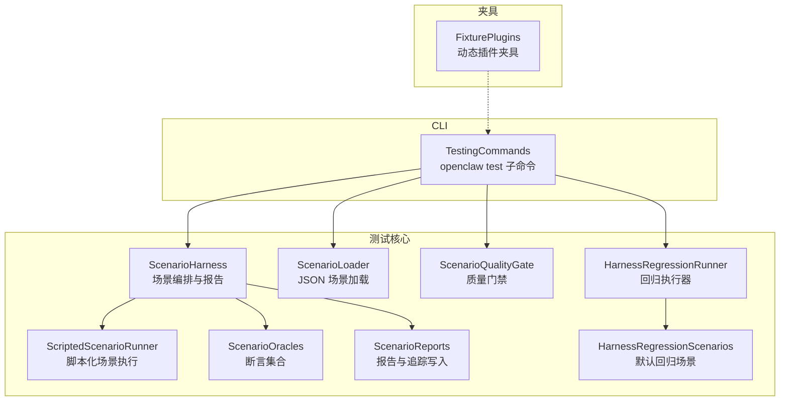
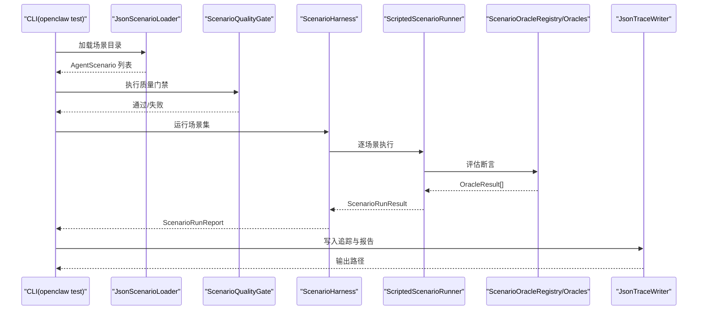
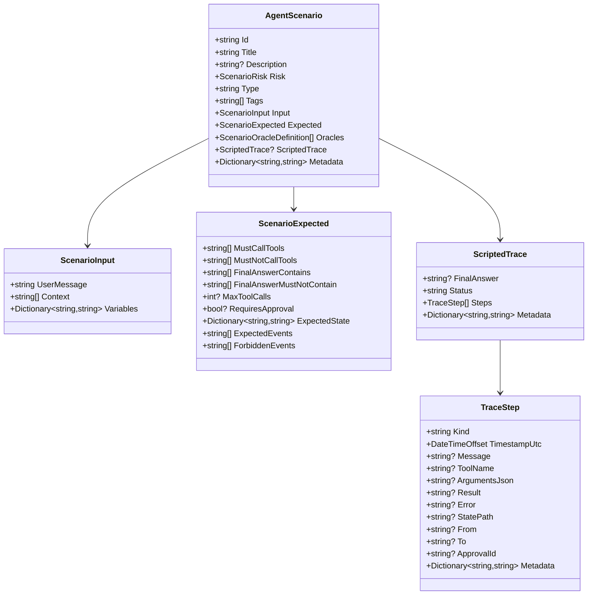
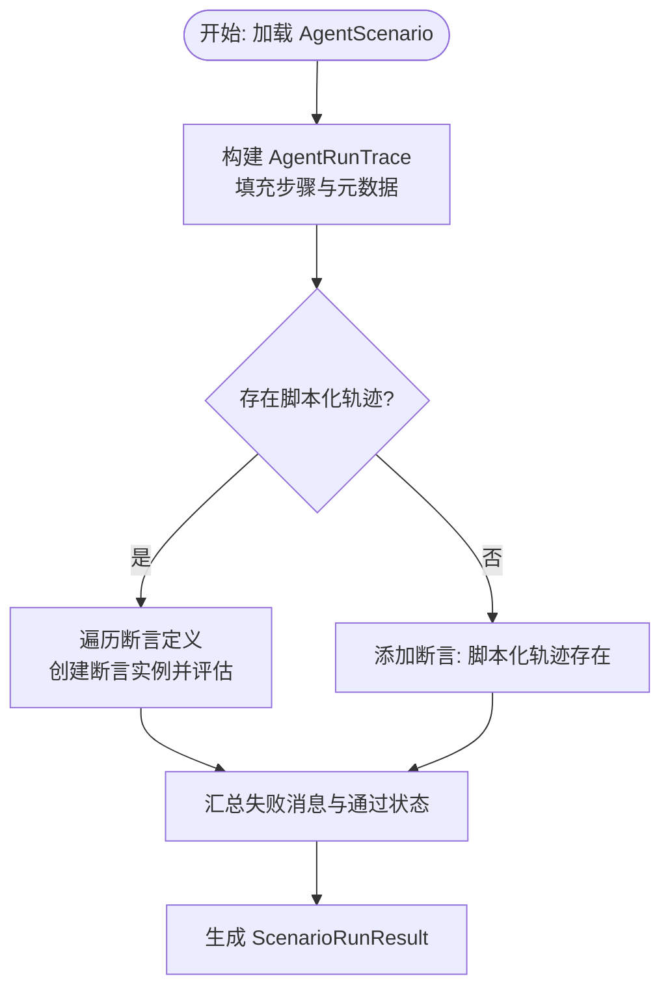
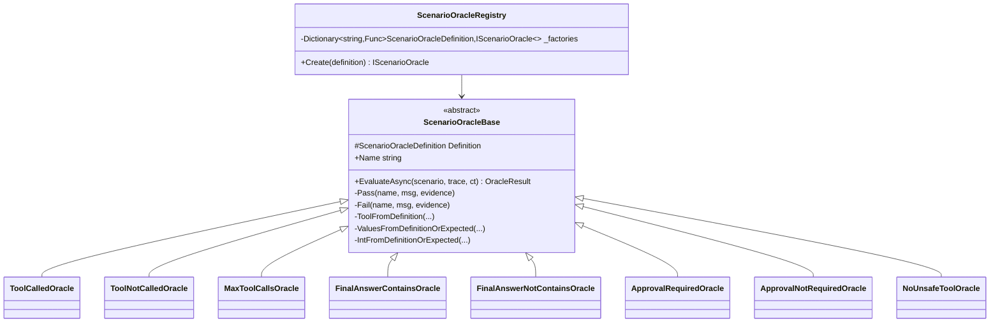
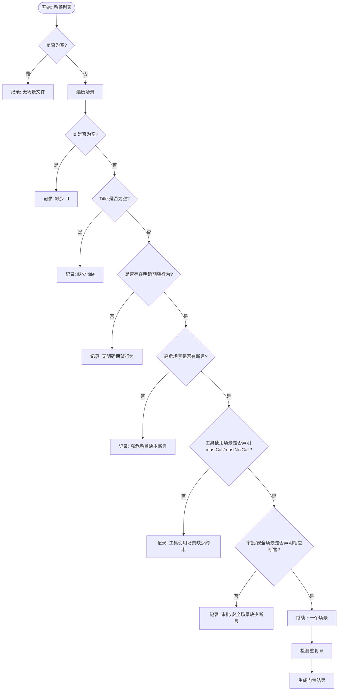
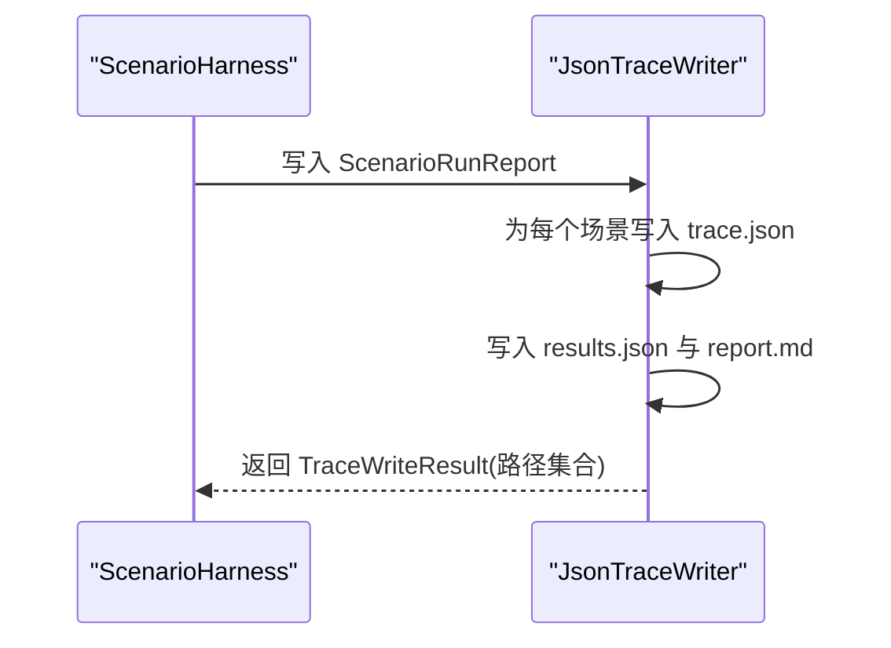
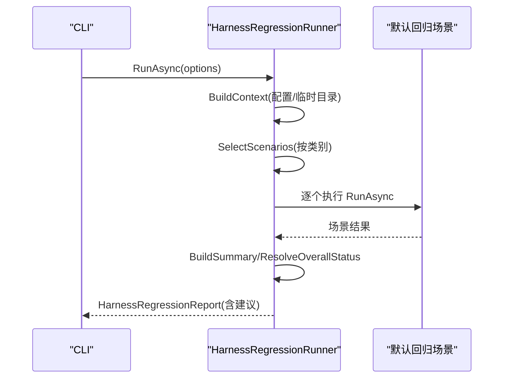
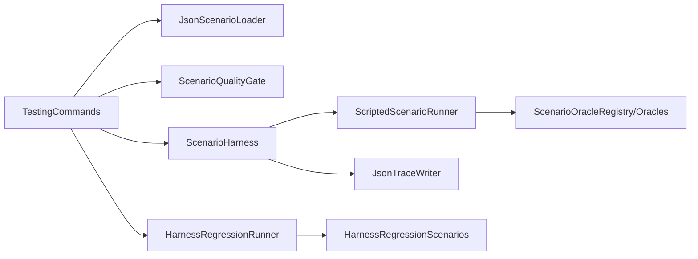

# 测试框架

<cite>
**本文引用的文件**
- [ScenarioHarness.cs](file://src/OpenClaw.Testing/ScenarioHarness.cs)
- [HarnessRegressionRunner.cs](file://src/OpenClaw.Testing/HarnessRegressionRunner.cs)
- [ScenarioLoader.cs](file://src/OpenClaw.Testing/ScenarioLoader.cs)
- [ScenarioQualityGate.cs](file://src/OpenClaw.Testing/ScenarioQualityGate.cs)
- [ScenarioModels.cs](file://src/OpenClaw.Testing/ScenarioModels.cs)
- [ScenarioInterfaces.cs](file://src/OpenClaw.Testing/ScenarioInterfaces.cs)
- [ScenarioOracles.cs](file://src/OpenClaw.Testing/ScenarioOracles.cs)
- [ScenarioReports.cs](file://src/OpenClaw.Testing/ScenarioReports.cs)
- [HarnessRegressionScenarios.cs](file://src/OpenClaw.Testing/HarnessRegressionScenarios.cs)
- [HarnessRegressionInterfaces.cs](file://src/OpenClaw.Testing/HarnessRegressionInterfaces.cs)
- [HarnessRegressionModels.cs](file://src/OpenClaw.Testing/HarnessRegressionModels.cs)
- [FixturePlugins.cs](file://src/OpenClaw.TestPluginFixtures/FixturePlugins.cs)
- [TestingCommands.cs](file://src/OpenClaw.Cli/TestingCommands.cs)
</cite>

## 更新摘要
**所做更改**
- 增强了 RepoWiki 文档迁移后的回归测试文档结构
- 完善了 ScenarioModels、ScenarioLoader 和 FixturePlugins 组件的详细说明
- 更新了测试框架的文档结构和内容组织
- 新增了回归测试场景的详细分类和文档验证机制

## 目录
1. [简介](#简介)
2. [项目结构](#项目结构)
3. [核心组件](#核心组件)
4. [架构总览](#架构总览)
5. [详细组件分析](#详细组件分析)
6. [依赖关系分析](#依赖关系分析)
7. [性能考量](#性能考量)
8. [故障排查指南](#故障排查指南)
9. [结论](#结论)
10. [附录](#附录)

## 简介
本测试框架围绕"场景驱动 + 质量门禁 + 回归检查"的理念构建，支持：
- 场景测试：以 JSON 场景定义 + 可重现的脚本化运行轨迹（Scripted Trace）进行断言。
- 质量门禁：在执行前对场景集进行静态校验，确保可测试性与安全性。
- 回归测试：针对网关配置、安全策略、工具治理、序列化契约等关键面进行系统性回归。
- 报告与输出：生成 Markdown 报告与 JSON 结果，并支持离线重生成。

该框架通过 CLI 命令统一入口，便于本地开发与 CI 集成。经过 RepoWiki 文档迁移后，回归测试文档得到显著增强，特别加强了对核心组件的详细说明。

## 项目结构
测试相关代码主要位于以下模块：
- OpenClaw.Testing：测试核心（场景、回归、断言、报告）
- OpenClaw.TestPluginFixtures：测试夹具（示例插件）
- OpenClaw.Cli：CLI 命令入口（openclaw test）

**图表来源**
- [ScenarioHarness.cs:123-179](file://src/OpenClaw.Testing/ScenarioHarness.cs#L123-L179)
- [HarnessRegressionRunner.cs:7-68](file://src/OpenClaw.Testing/HarnessRegressionRunner.cs#L7-L68)
- [ScenarioLoader.cs:5-40](file://src/OpenClaw.Testing/ScenarioLoader.cs#L5-L40)
- [ScenarioQualityGate.cs:16-74](file://src/OpenClaw.Testing/ScenarioQualityGate.cs#L16-L74)
- [ScenarioOracles.cs:33-62](file://src/OpenClaw.Testing/ScenarioOracles.cs#L33-L62)
- [ScenarioReports.cs:6-96](file://src/OpenClaw.Testing/ScenarioReports.cs#L6-L96)
- [HarnessRegressionScenarios.cs:15-36](file://src/OpenClaw.Testing/HarnessRegressionScenarios.cs#L15-L36)
- [TestingCommands.cs:6-34](file://src/OpenClaw.Cli/TestingCommands.cs#L6-L34)

**章节来源**
- [TestingCommands.cs:12-34](file://src/OpenClaw.Cli/TestingCommands.cs#L12-L34)
- [ScenarioHarness.cs:123-179](file://src/OpenClaw.Testing/ScenarioHarness.cs#L123-L179)
- [HarnessRegressionRunner.cs:7-68](file://src/OpenClaw.Testing/HarnessRegressionRunner.cs#L7-L68)

## 核心组件
- 场景加载器：从目录递归解析 JSON 场景，标准化缺失字段，支持数组或单对象根节点。
- 场景执行器：基于脚本化轨迹与断言集合评估每个场景，产出运行结果与摘要。
- 断言引擎：内置多种断言类型（工具调用、最大调用次数、最终答案包含/排除、审批要求、无危险工具等），支持扩展注册表。
- 质量门禁：在执行前对场景集进行静态校验，确保必要字段、风险级别与断言匹配。
- 报告与追踪：生成 Markdown 报告、写入 JSON 追踪文件，支持离线重生成。
- 回归执行器：加载默认回归场景，按类别筛选，产出整体状态与建议。
- CLI 命令：提供初始化、运行、报告重生成、门禁检查等子命令。

**章节来源**
- [ScenarioLoader.cs:5-40](file://src/OpenClaw.Testing/ScenarioLoader.cs#L5-L40)
- [ScenarioHarness.cs:123-179](file://src/OpenClaw.Testing/ScenarioHarness.cs#L123-L179)
- [ScenarioOracles.cs:33-62](file://src/OpenClaw.Testing/ScenarioOracles.cs#L33-L62)
- [ScenarioQualityGate.cs:16-74](file://src/OpenClaw.Testing/ScenarioQualityGate.cs#L16-L74)
- [ScenarioReports.cs:98-151](file://src/OpenClaw.Testing/ScenarioReports.cs#L98-L151)
- [HarnessRegressionRunner.cs:7-68](file://src/OpenClaw.Testing/HarnessRegressionRunner.cs#L7-L68)
- [TestingCommands.cs:12-34](file://src/OpenClaw.Cli/TestingCommands.cs#L12-L34)

## 架构总览
下图展示从 CLI 到场景执行与报告生成的端到端流程：

**图表来源**
- [TestingCommands.cs:60-82](file://src/OpenClaw.Cli/TestingCommands.cs#L60-L82)
- [ScenarioLoader.cs:5-40](file://src/OpenClaw.Testing/ScenarioLoader.cs#L5-L40)
- [ScenarioQualityGate.cs:25-74](file://src/OpenClaw.Testing/ScenarioQualityGate.cs#L25-L74)
- [ScenarioHarness.cs:129-171](file://src/OpenClaw.Testing/ScenarioHarness.cs#L129-L171)
- [ScenarioOracles.cs:33-62](file://src/OpenClaw.Testing/ScenarioOracles.cs#L33-L62)
- [ScenarioReports.cs:98-151](file://src/OpenClaw.Testing/ScenarioReports.cs#L98-L151)

## 详细组件分析

### 场景模型与接口
- AgentScenario：场景定义（标识、标题、描述、风险、类型、标签、输入、期望、断言、脚本化轨迹、元数据）。
- TraceStep/AgentRunTrace：运行轨迹与步骤（时间戳、种类、工具名、参数、结果、错误、状态变更、审批信息等）。
- 接口族：IScenarioRunner、IScenarioOracle、IScenarioLoader、ITraceWriter。

**图表来源**
- [ScenarioModels.cs:15-94](file://src/OpenClaw.Testing/ScenarioModels.cs#L15-L94)

**章节来源**
- [ScenarioModels.cs:15-94](file://src/OpenClaw.Testing/ScenarioModels.cs#L15-L94)
- [ScenarioInterfaces.cs:3-29](file://src/OpenClaw.Testing/ScenarioInterfaces.cs#L3-L29)

### 场景执行器与脚本化运行
- ScriptedScenarioRunner：基于脚本化轨迹构建 AgentRunTrace，遍历断言注册表执行评估，汇总 OracleResult 并生成 ScenarioRunResult。
- ScenarioHarness：批量运行场景，聚合统计与 Markdown 报告，生成唯一 RunId。

**图表来源**
- [ScenarioHarness.cs:3-57](file://src/OpenClaw.Testing/ScenarioHarness.cs#L3-L57)
- [ScenarioHarness.cs:59-115](file://src/OpenClaw.Testing/ScenarioHarness.cs#L59-L115)

**章节来源**
- [ScenarioHarness.cs:3-57](file://src/OpenClaw.Testing/ScenarioHarness.cs#L3-L57)
- [ScenarioHarness.cs:59-115](file://src/OpenClaw.Testing/ScenarioHarness.cs#L59-L115)

### 断言机制与扩展
- ScenarioOracleRegistry：根据断言类型工厂化创建断言实例（工具调用/未调用、最大调用数、最终答案包含/不包含、审批要求、无危险工具等）。
- 断言基类：提供通用工具（提取工具名、从定义或期望中取值、稳定字符串拼接、规范化种类等）。
- 危险工具策略：默认黑名单工具可通过配置扩展。

**图表来源**
- [ScenarioOracles.cs:33-62](file://src/OpenClaw.Testing/ScenarioOracles.cs#L33-L62)
- [ScenarioOracles.cs:167-181](file://src/OpenClaw.Testing/ScenarioOracles.cs#L167-L181)
- [ScenarioOracles.cs:183-210](file://src/OpenClaw.Testing/ScenarioOracles.cs#L183-L210)
- [ScenarioOracles.cs:212-239](file://src/OpenClaw.Testing/ScenarioOracles.cs#L212-L239)
- [ScenarioOracles.cs:241-259](file://src/OpenClaw.Testing/ScenarioOracles.cs#L241-L259)
- [ScenarioOracles.cs:261-283](file://src/OpenClaw.Testing/ScenarioOracles.cs#L261-L283)
- [ScenarioOracles.cs:285-307](file://src/OpenClaw.Testing/ScenarioOracles.cs#L285-L307)
- [ScenarioOracles.cs:309-332](file://src/OpenClaw.Testing/ScenarioOracles.cs#L309-L332)
- [ScenarioOracles.cs:334-348](file://src/OpenClaw.Testing/ScenarioOracles.cs#L334-L348)
- [ScenarioOracles.cs:350-409](file://src/OpenClaw.Testing/ScenarioOracles.cs#L350-L409)

**章节来源**
- [ScenarioOracles.cs:33-62](file://src/OpenClaw.Testing/ScenarioOracles.cs#L33-L62)
- [ScenarioOracles.cs:18-31](file://src/OpenClaw.Testing/ScenarioOracles.cs#L18-L31)

### 质量门禁
- 门禁规则：校验场景 id/title/期望行为/高危场景断言/工具使用场景约束/审批/安全场景断言等；重复 id 检测。
- 门禁结果：收集所有问题，暴露给 CLI 输出。

**图表来源**
- [ScenarioQualityGate.cs:25-74](file://src/OpenClaw.Testing/ScenarioQualityGate.cs#L25-L74)

**章节来源**
- [ScenarioQualityGate.cs:16-74](file://src/OpenClaw.Testing/ScenarioQualityGate.cs#L16-L74)

### 报告与追踪写入
- Markdown 报告：按场景汇总通过/失败与失败断言，展开失败详情与证据。
- JSON 追踪写入：为每个场景写入独立 trace 文件，同时写入 results.json 与 report.md；提供最新报告加载能力。

**图表来源**
- [ScenarioReports.cs:98-151](file://src/OpenClaw.Testing/ScenarioReports.cs#L98-L151)

**章节来源**
- [ScenarioReports.cs:6-96](file://src/OpenClaw.Testing/ScenarioReports.cs#L6-L96)
- [ScenarioReports.cs:98-151](file://src/OpenClaw.Testing/ScenarioReports.cs#L98-L151)

### 回归测试执行器与场景
- HarnessRegressionRunner：构建上下文（配置路径、临时工作区）、选择场景（按类别）、执行并汇总结果、计算整体状态、生成建议。
- 默认回归场景：覆盖引导配置、提供商形状、安全加固、URL 安全、工具审批策略、内存/会话存储、序列化契约、MCP 请求形状、OpenAI 兼容请求、学习提案、托管技能验证、部署配置、文档索引等。

**图表来源**
- [HarnessRegressionRunner.cs:18-68](file://src/OpenClaw.Testing/HarnessRegressionRunner.cs#L18-L68)
- [HarnessRegressionScenarios.cs:17-36](file://src/OpenClaw.Testing/HarnessRegressionScenarios.cs#L17-L36)

**章节来源**
- [HarnessRegressionRunner.cs:7-68](file://src/OpenClaw.Testing/HarnessRegressionRunner.cs#L7-L68)
- [HarnessRegressionScenarios.cs:15-36](file://src/OpenClaw.Testing/HarnessRegressionScenarios.cs#L15-L36)

### 测试夹具
- 动态插件夹具：示例插件注册工具、命令、内存提供者与服务生命周期标记，用于回归场景中验证插件桥接与资源管理。

**章节来源**
- [FixturePlugins.cs:8-80](file://src/OpenClaw.TestPluginFixtures/FixturePlugins.cs#L8-L80)

### 场景加载器增强
- 支持数组和单对象 JSON 场景格式
- 自动标准化缺失字段和空值
- 递归目录扫描和有序处理

**章节来源**
- [ScenarioLoader.cs:1-72](file://src/OpenClaw.Testing/ScenarioLoader.cs#L1-L72)

### 回归测试场景分类
- 引导配置（onboarding）
- 安全加固（security）
- 工具审批（approvals）
- 内存存储（memory）
- 提供商配置（providers）
- 工具验证（tools）
- MCP 协议（mcp）
- OpenAI 兼容（openai_compat）
- 会话管理（sessions）
- 测试夹具（harness）
- 部署配置（deployment）
- 文档验证（docs）

**章节来源**
- [HarnessRegressionModels.cs:14-28](file://src/OpenClaw.Testing/HarnessRegressionModels.cs#L14-L28)

## 依赖关系分析
- 组件耦合
  - CLI 仅依赖加载器、门禁、执行器与写入器接口，保持低耦合。
  - 场景执行器依赖断言注册表与断言实现，断言实现依赖通用基类与工具函数。
  - 回归执行器依赖默认场景集合与上下文构建，输出报告与建议。
- 外部依赖
  - JSON 序列化/反序列化（System.Text.Json）贯穿场景、轨迹与报告。
  - 文件系统用于场景加载、追踪写入与最新报告查找。
- 循环依赖
  - 未发现循环依赖；各模块职责清晰，接口边界明确。

**图表来源**
- [TestingCommands.cs:60-82](file://src/OpenClaw.Cli/TestingCommands.cs#L60-L82)
- [ScenarioHarness.cs:129-171](file://src/OpenClaw.Testing/ScenarioHarness.cs#L129-L171)
- [HarnessRegressionRunner.cs:18-68](file://src/OpenClaw.Testing/HarnessRegressionRunner.cs#L18-L68)

**章节来源**
- [TestingCommands.cs:60-82](file://src/OpenClaw.Cli/TestingCommands.cs#L60-L82)
- [ScenarioHarness.cs:129-171](file://src/OpenClaw.Testing/ScenarioHarness.cs#L129-L171)
- [HarnessRegressionRunner.cs:18-68](file://src/OpenClaw.Testing/HarnessRegressionRunner.cs#L18-L68)

## 性能考量
- 场景加载：递归枚举目录并解析 JSON，注意大目录下的 IO 开销；建议分层组织场景文件。
- 断言评估：多数断言为线性扫描轨迹步骤，复杂度与步骤数线性相关；避免过长的脚本化轨迹。
- 报告生成：Markdown 构建为一次性操作；追踪写入为顺序 IO，建议在 SSD 上设置输出目录。
- 回归执行：场景数量较多时，建议按类别并行执行（当前实现为串行，可作为优化点）。

## 故障排查指南
- 门禁失败
  - 现象：CLI 输出"Scenario gates failed"及具体问题。
  - 排查：检查场景 id/title/期望行为/断言声明是否完整；确认高危场景必须声明断言；工具使用场景需声明 mustCall/mustNotCall。
- 运行失败
  - 现象：报告中出现失败场景与断言名称、消息与证据。
  - 排查：核对脚本化轨迹是否与断言一致；检查最终答案包含/排除条件；确认审批请求与工具调用是否满足要求。
- 报告重生成
  - 现象：找不到最新报告。
  - 排查：确认输出根目录与 run_id；使用"report"子命令重新生成。
- 回归报告
  - 现象：整体状态为 Warning 或 Failed。
  - 排查：根据建议命令修复配置或策略；严格模式下 Warning/跳过也会导致退出码 1。

**章节来源**
- [TestingCommands.cs:101-114](file://src/OpenClaw.Cli/TestingCommands.cs#L101-L114)
- [TestingCommands.cs:143-153](file://src/OpenClaw.Cli/TestingCommands.cs#L143-L153)
- [ScenarioReports.cs:158-178](file://src/OpenClaw.Testing/ScenarioReports.cs#L158-L178)
- [HarnessRegressionRunner.cs:70-88](file://src/OpenClaw.Testing/HarnessRegressionRunner.cs#L70-L88)

## 结论
该测试框架通过"可重现的脚本化轨迹 + 多维度断言 + 质量门禁 + 系统性回归"的组合，提供了从单场景到整体质量保障的完整能力。CLI 将这些能力整合为统一入口，适合本地开发与 CI 集成。经过 RepoWiki 文档迁移后，回归测试文档得到显著增强，特别是对核心组件的详细说明更加完善。后续可在回归执行器中引入并行化与更丰富的覆盖率指标，进一步提升效率与可观测性。

## 附录

### 使用方法与最佳实践
- 初始化场景目录与示例场景
  - 使用 openclaw test init 创建 tests/agent-scenarios 与 docs/testing 目录，并注入示例场景。
- 编写场景
  - 在场景中明确 risk、expected（工具调用、最终答案、审批需求、事件/状态期望等），并在 oracles 中声明断言类型与参数。
  - 对高危场景务必声明断言；工具使用场景需声明 mustCall/mustNotCall。
- 执行与报告
  - openclaw test run：加载场景 → 门禁 → 执行 → 写入追踪与报告 → 输出摘要。
  - openclaw test report：从最新 run 目录重生成 Markdown 报告。
  - openclaw test gates：仅执行门禁检查。
- 退出码
  - 严格模式下，若存在高危失败或严格模式警告/跳过，返回码为 1；否则为 0。

**章节来源**
- [TestingCommands.cs:36-58](file://src/OpenClaw.Cli/TestingCommands.cs#L36-L58)
- [TestingCommands.cs:60-82](file://src/OpenClaw.Cli/TestingCommands.cs#L60-L82)
- [TestingCommands.cs:84-99](file://src/OpenClaw.Cli/TestingCommands.cs#L84-L99)
- [TestingCommands.cs:101-114](file://src/OpenClaw.Cli/TestingCommands.cs#L101-L114)
- [TestingCommands.cs:134-141](file://src/OpenClaw.Cli/TestingCommands.cs#L134-L141)

### 测试模型与断言一览
- 场景模型：AgentScenario、ScenarioInput、ScenarioExpected、ScriptedTrace、TraceStep。
- 断言类型：工具调用/未调用、最大调用次数、最终答案包含/不包含、审批要求/无需审批、无危险工具。
- 回归场景类别：引导、安全、审批、内存、提供商、工具、MCP、OpenAI 兼容、会话、夹具、部署、文档。

**章节来源**
- [ScenarioModels.cs:15-94](file://src/OpenClaw.Testing/ScenarioModels.cs#L15-L94)
- [ScenarioOracles.cs:6-16](file://src/OpenClaw.Testing/ScenarioOracles.cs#L6-L16)
- [HarnessRegressionModels.cs:14-28](file://src/OpenClaw.Testing/HarnessRegressionModels.cs#L14-L28)

### 文档验证机制
- 回归测试包含专门的文档验证场景，确保测试框架文档的完整性
- 自动检查关键文档文件的存在性和链接有效性
- 提供详细的文档索引验证和缺失项报告

**章节来源**
- [HarnessRegressionScenarios.cs:706-762](file://src/OpenClaw.Testing/HarnessRegressionScenarios.cs#L706-L762)