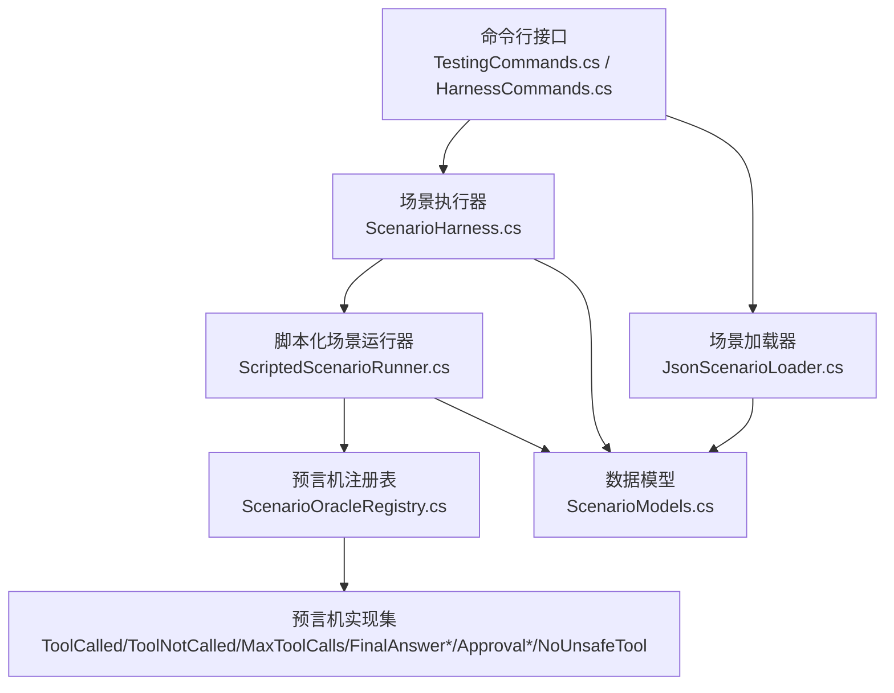
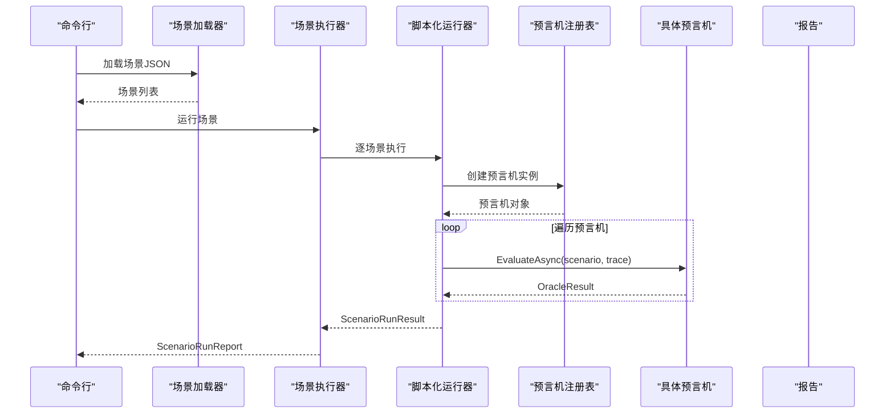
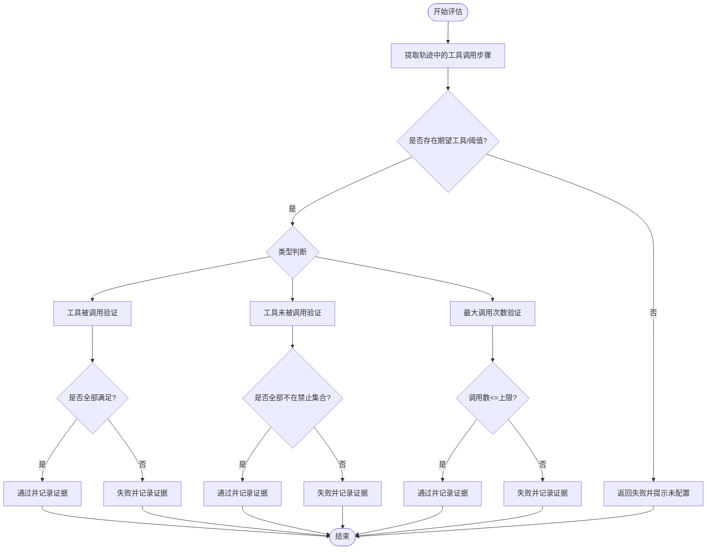
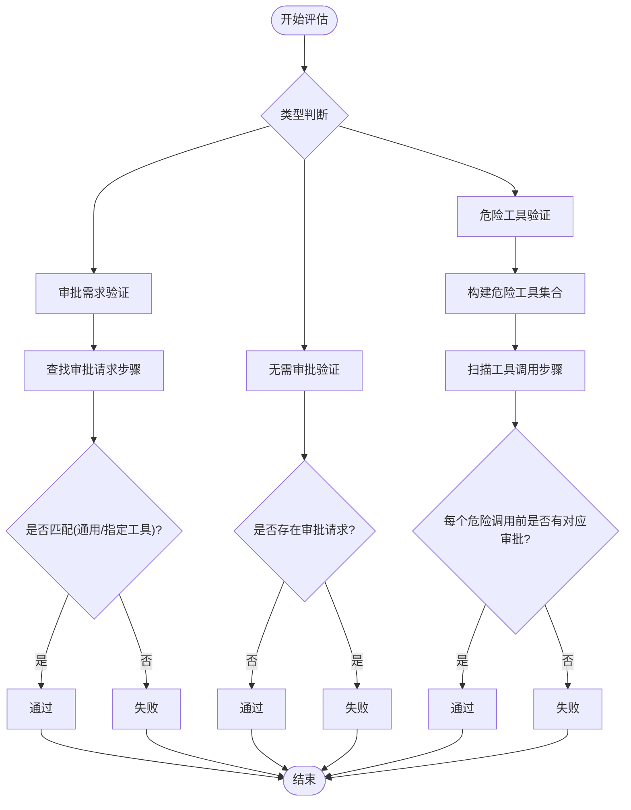
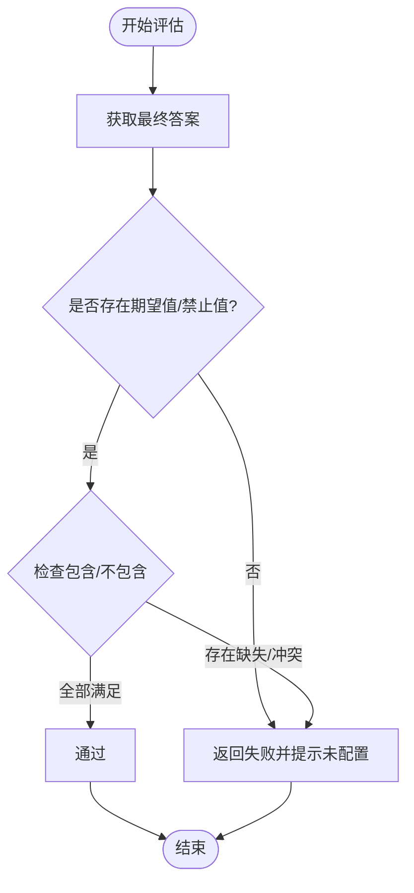
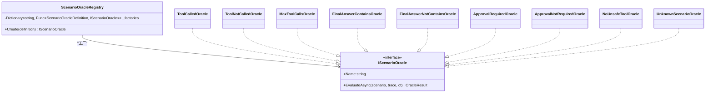
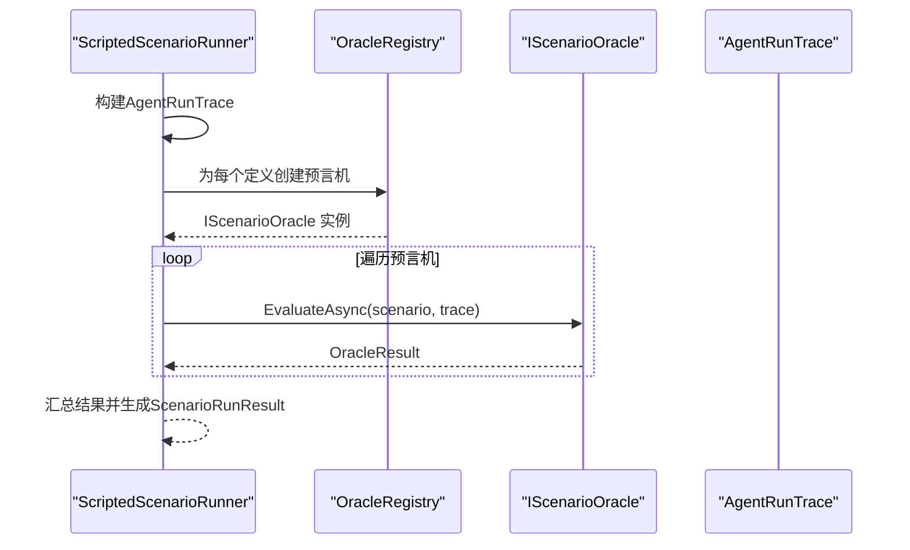
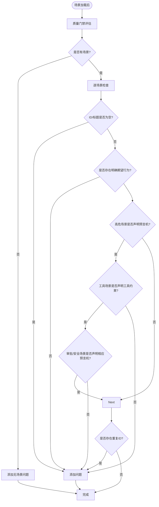
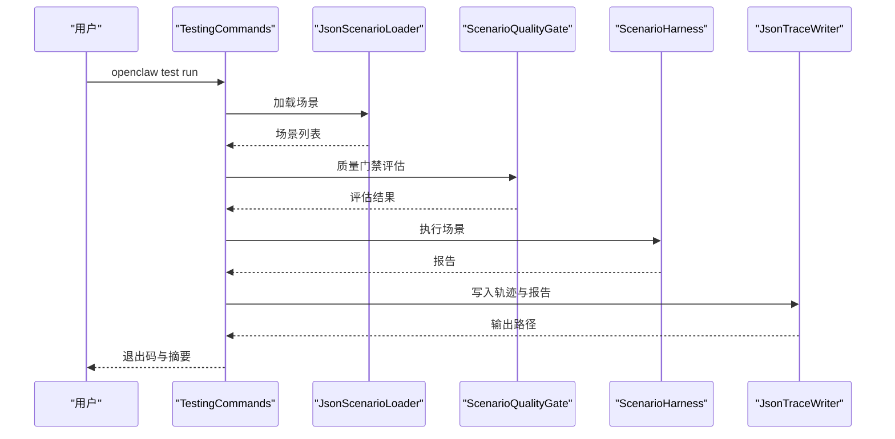
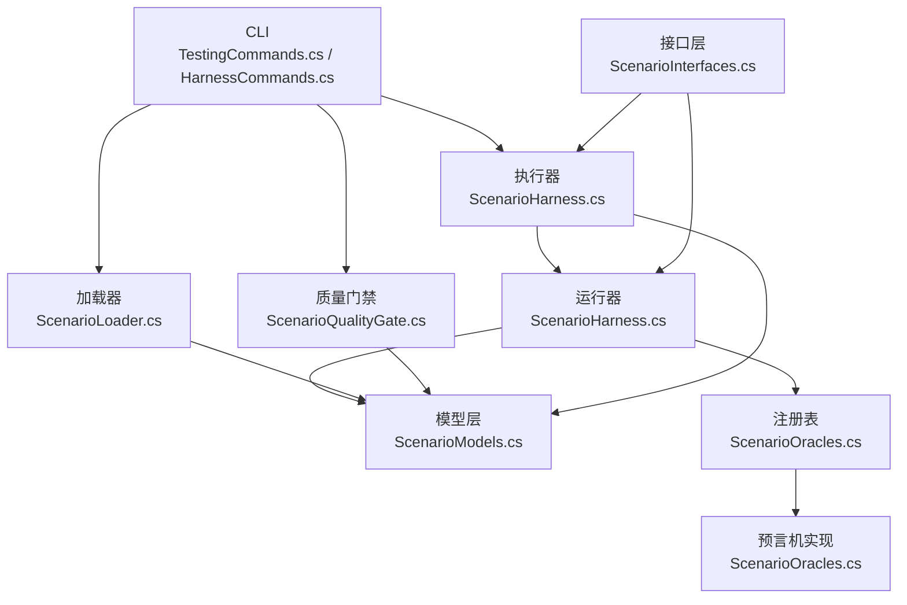

# 测试预言机

<cite>
**本文档引用的文件**
- [ScenarioOracles.cs](file://src/OpenClaw.Testing/ScenarioOracles.cs)
- [ScenarioModels.cs](file://src/OpenClaw.Testing/ScenarioModels.cs)
- [ScenarioHarness.cs](file://src/OpenClaw.Testing/ScenarioHarness.cs)
- [ScenarioInterfaces.cs](file://src/OpenClaw.Testing/ScenarioInterfaces.cs)
- [ScenarioLoader.cs](file://src/OpenClaw.Testing/ScenarioLoader.cs)
- [ScenarioQualityGate.cs](file://src/OpenClaw.Testing/ScenarioQualityGate.cs)
- [TestingCommands.cs](file://src/OpenClaw.Cli/TestingCommands.cs)
- [HarnessCommands.cs](file://src/OpenClaw.Cli/HarnessCommands.cs)
- [HarnessRegressionRunner.cs](file://src/OpenClaw.Testing/HarnessRegressionRunner.cs)
- [HarnessRegressionInterfaces.cs](file://src/OpenClaw.Testing/HarnessRegressionInterfaces.cs)
- [AgentScenarioHarnessTests.cs](file://src/OpenClaw.Tests/AgentScenarioHarnessTests.cs)
</cite>

## 目录
1. [简介](#简介)
2. [项目结构](#项目结构)
3. [核心组件](#核心组件)
4. [架构总览](#架构总览)
5. [详细组件分析](#详细组件分析)
6. [依赖关系分析](#依赖关系分析)
7. [性能考虑](#性能考虑)
8. [故障排除指南](#故障排除指南)
9. [结论](#结论)
10. [附录](#附录)

## 简介
本文件系统性阐述测试预言机（Scenario Oracles）的设计与实现，覆盖其在测试中的作用、类型与验证机制，并深入解析工具调用预言机、状态预言机与事件预言机的验证逻辑。同时提供预言机配置、验证规则与错误检测机制说明，以及扩展开发与自定义验证器的实现指南。

## 项目结构
测试预言机位于 OpenClaw.Testing 命名空间下，围绕场景（AgentScenario）、脚本化运行轨迹（ScriptedTrace/AgentRunTrace）、预言机定义（ScenarioOracleDefinition）与具体预言机实现展开；CLI 层通过 TestingCommands 和 HarnessCommands 提供命令行入口，支持场景执行、报告生成与回归测试。

**图表来源**
- [TestingCommands.cs:12-82](file://src/OpenClaw.Cli/TestingCommands.cs#L12-L82)
- [HarnessCommands.cs:67-79](file://src/OpenClaw.Cli/HarnessCommands.cs#L67-L79)
- [ScenarioHarness.cs:123-179](file://src/OpenClaw.Testing/ScenarioHarness.cs#L123-L179)
- [ScenarioHarness.cs:3-57](file://src/OpenClaw.Testing/ScenarioHarness.cs#L3-L57)
- [ScenarioOracles.cs:33-62](file://src/OpenClaw.Testing/ScenarioOracles.cs#L33-L62)
- [ScenarioModels.cs:15-78](file://src/OpenClaw.Testing/ScenarioModels.cs#L15-L78)

**章节来源**
- [TestingCommands.cs:12-82](file://src/OpenClaw.Cli/TestingCommands.cs#L12-L82)
- [HarnessCommands.cs:67-79](file://src/OpenClaw.Cli/HarnessCommands.cs#L67-L79)
- [ScenarioHarness.cs:123-179](file://src/OpenClaw.Testing/ScenarioHarness.cs#L123-L179)
- [ScenarioHarness.cs:3-57](file://src/OpenClaw.Testing/ScenarioHarness.cs#L3-L57)
- [ScenarioOracles.cs:33-62](file://src/OpenClaw.Testing/ScenarioOracles.cs#L33-L62)
- [ScenarioModels.cs:15-78](file://src/OpenClaw.Testing/ScenarioModels.cs#L15-L78)

## 核心组件
- 场景与期望行为：AgentScenario、ScenarioExpected 定义了测试场景的输入、期望输出与断言集合。
- 脚本化轨迹：ScriptedTrace/AgentRunTrace 描述一次确定性运行的步骤序列与最终答案。
- 预言机定义：ScenarioOracleDefinition 描述单个断言规则的类型、工具、阈值与元数据。
- 预言机注册与工厂：ScenarioOracleRegistry 将类型映射到具体实现，UnknownScenarioOracle 处理未知类型。
- 具体预言机：工具调用类（ToolCalled/ToolNotCalled/MaxToolCalls）、最终答案类（FinalAnswerContains/FinalAnswerNotContains）、审批与安全类（ApprovalRequired/ApprovalNotRequired/NoUnsafeTool）。
- 执行器：ScriptedScenarioRunner 按场景构建 AgentRunTrace 并逐条评估预言机；ScenarioHarness 组织多场景执行并生成报告。
- 质量门禁：ScenarioQualityGate 对场景进行基础校验（ID/标题/期望行为/风险与预言机匹配等）。
- 加载器：JsonScenarioLoader 支持从目录批量加载场景 JSON 文件。
- CLI 接口：TestingCommands 提供 init/run/report/gates 子命令；HarnessCommands 提供回归测试入口。

**章节来源**
- [ScenarioModels.cs:15-78](file://src/OpenClaw.Testing/ScenarioModels.cs#L15-L78)
- [ScenarioModels.cs:50-94](file://src/OpenClaw.Testing/ScenarioModels.cs#L50-L94)
- [ScenarioOracles.cs:33-62](file://src/OpenClaw.Testing/ScenarioOracles.cs#L33-L62)
- [ScenarioHarness.cs:3-57](file://src/OpenClaw.Testing/ScenarioHarness.cs#L3-L57)
- [ScenarioHarness.cs:123-179](file://src/OpenClaw.Testing/ScenarioHarness.cs#L123-L179)
- [ScenarioQualityGate.cs:25-74](file://src/OpenClaw.Testing/ScenarioQualityGate.cs#L25-L74)
- [ScenarioLoader.cs:5-40](file://src/OpenClaw.Testing/ScenarioLoader.cs#L5-L40)
- [TestingCommands.cs:12-82](file://src/OpenClaw.Cli/TestingCommands.cs#L12-L82)
- [HarnessCommands.cs:67-79](file://src/OpenClaw.Cli/HarnessCommands.cs#L67-L79)

## 架构总览
测试预言机采用“场景驱动 + 脚本化轨迹 + 可插拔预言机”的架构。CLI 将用户意图转化为场景加载与执行，执行器将场景转换为可验证的运行轨迹，预言机注册表根据类型选择具体验证策略，最终汇总为报告与建议。

**图表来源**
- [TestingCommands.cs:60-82](file://src/OpenClaw.Cli/TestingCommands.cs#L60-L82)
- [ScenarioHarness.cs:129-171](file://src/OpenClaw.Testing/ScenarioHarness.cs#L129-L171)
- [ScenarioHarness.cs:7-57](file://src/OpenClaw.Testing/ScenarioHarness.cs#L7-L57)
- [ScenarioOracles.cs:58-62](file://src/OpenClaw.Testing/ScenarioOracles.cs#L58-L62)

**章节来源**
- [TestingCommands.cs:60-82](file://src/OpenClaw.Cli/TestingCommands.cs#L60-L82)
- [ScenarioHarness.cs:129-171](file://src/OpenClaw.Testing/ScenarioHarness.cs#L129-L171)
- [ScenarioHarness.cs:7-57](file://src/OpenClaw.Testing/ScenarioHarness.cs#L7-L57)
- [ScenarioOracles.cs:58-62](file://src/OpenClaw.Testing/ScenarioOracles.cs#L58-L62)

## 详细组件分析

### 工具调用预言机
- 类型与用途
  - 工具被调用：ToolCalled
  - 工具未被调用：ToolNotCalled
  - 最大工具调用次数：MaxToolCalls
- 验证逻辑
  - ToolCalled：从脚本化轨迹提取所有工具调用步骤，比对期望必须调用的工具集合，若全部满足则通过，否则失败并记录证据。
  - ToolNotCalled：从轨迹提取工具调用步骤，比对禁止调用集合，若无冲突则通过，否则失败并记录证据。
  - MaxToolCalls：统计工具调用数量并与上限比较，不超过则通过，否则失败并记录证据。
- 关键实现点
  - 使用工具名称规范化与大小写不敏感比较。
  - 从定义或场景期望中解析工具名与阈值，支持从元数据读取。
  - 返回 OracleResult，包含 Passed、Name、Message 与 Evidence。

**图表来源**
- [ScenarioOracles.cs:183-209](file://src/OpenClaw.Testing/ScenarioOracles.cs#L183-L209)
- [ScenarioOracles.cs:212-238](file://src/OpenClaw.Testing/ScenarioOracles.cs#L212-L238)
- [ScenarioOracles.cs:241-258](file://src/OpenClaw.Testing/ScenarioOracles.cs#L241-L258)

**章节来源**
- [ScenarioOracles.cs:183-209](file://src/OpenClaw.Testing/ScenarioOracles.cs#L183-L209)
- [ScenarioOracles.cs:212-238](file://src/OpenClaw.Testing/ScenarioOracles.cs#L212-L238)
- [ScenarioOracles.cs:241-258](file://src/OpenClaw.Testing/ScenarioOracles.cs#L241-L258)

### 审批与安全预言机
- 类型与用途
  - 需要审批：ApprovalRequired
  - 不需要审批：ApprovalNotRequired
  - 无危险工具：NoUnsafeTool
- 验证逻辑
  - ApprovalRequired：检查审批请求步骤，若存在通用或针对特定工具的审批则通过，否则失败。
  - ApprovalNotRequired：若无任何审批请求则通过，否则失败。
  - NoUnsafeTool：基于默认危险工具清单与场景元数据合并得到危险工具集合；遍历工具调用步骤，要求每个危险调用之前必须有对应工具的审批请求，否则失败。
- 关键实现点
  - NoUnsafeTool 通过索引扫描确保审批发生在调用之前，避免顺序违规。
  - 危险工具集合支持从定义的 Tools 字段与场景 Metadata 的 unsafeTools 合并。

**图表来源**
- [ScenarioOracles.cs:309-331](file://src/OpenClaw.Testing/ScenarioOracles.cs#L309-L331)
- [ScenarioOracles.cs:334-347](file://src/OpenClaw.Testing/ScenarioOracles.cs#L334-L347)
- [ScenarioOracles.cs:350-407](file://src/OpenClaw.Testing/ScenarioOracles.cs#L350-L407)

**章节来源**
- [ScenarioOracles.cs:309-331](file://src/OpenClaw.Testing/ScenarioOracles.cs#L309-L331)
- [ScenarioOracles.cs:334-347](file://src/OpenClaw.Testing/ScenarioOracles.cs#L334-L347)
- [ScenarioOracles.cs:350-407](file://src/OpenClaw.Testing/ScenarioOracles.cs#L350-L407)

### 最终答案预言机
- 类型与用途
  - 包含文本：FinalAnswerContains
  - 不包含文本：FinalAnswerNotContains
- 验证逻辑
  - 从脚本化轨迹获取最终答案，分别检查期望包含与禁止包含的子串，大小写不敏感匹配，未命中则失败。

**图表来源**
- [ScenarioOracles.cs:261-282](file://src/OpenClaw.Testing/ScenarioOracles.cs#L261-L282)
- [ScenarioOracles.cs:285-306](file://src/OpenClaw.Testing/ScenarioOracles.cs#L285-L306)

**章节来源**
- [ScenarioOracles.cs:261-282](file://src/OpenClaw.Testing/ScenarioOracles.cs#L261-L282)
- [ScenarioOracles.cs:285-306](file://src/OpenClaw.Testing/ScenarioOracles.cs#L285-L306)

### 预言机注册与工厂
- 注册表负责将类型字符串映射到具体预言机构造函数，支持 UnknownScenarioOracle 处理未知类型。
- 默认危险工具清单可通过构造函数注入，允许外部定制。

**图表来源**
- [ScenarioOracles.cs:33-62](file://src/OpenClaw.Testing/ScenarioOracles.cs#L33-L62)
- [ScenarioOracles.cs:167-181](file://src/OpenClaw.Testing/ScenarioOracles.cs#L167-L181)
- [ScenarioOracles.cs:183-209](file://src/OpenClaw.Testing/ScenarioOracles.cs#L183-L209)
- [ScenarioOracles.cs:212-238](file://src/OpenClaw.Testing/ScenarioOracles.cs#L212-L238)
- [ScenarioOracles.cs:241-258](file://src/OpenClaw.Testing/ScenarioOracles.cs#L241-L258)
- [ScenarioOracles.cs:261-306](file://src/OpenClaw.Testing/ScenarioOracles.cs#L261-L306)
- [ScenarioOracles.cs:309-347](file://src/OpenClaw.Testing/ScenarioOracles.cs#L309-L347)
- [ScenarioOracles.cs:350-407](file://src/OpenClaw.Testing/ScenarioOracles.cs#L350-L407)

**章节来源**
- [ScenarioOracles.cs:33-62](file://src/OpenClaw.Testing/ScenarioOracles.cs#L33-L62)
- [ScenarioOracles.cs:167-181](file://src/OpenClaw.Testing/ScenarioOracles.cs#L167-L181)

### 脚本化场景运行器与执行器
- ScriptedScenarioRunner
  - 必须提供 ScriptedTrace，否则直接失败。
  - 逐条创建预言机并评估，聚合 OracleResult，最终生成 ScenarioRunResult。
- ScenarioHarness
  - 组织多个场景执行，计算高危/严重失败数量，生成 Markdown 报告。

**图表来源**
- [ScenarioHarness.cs:3-57](file://src/OpenClaw.Testing/ScenarioHarness.cs#L3-L57)
- [ScenarioHarness.cs:129-171](file://src/OpenClaw.Testing/ScenarioHarness.cs#L129-L171)
- [ScenarioOracles.cs:58-62](file://src/OpenClaw.Testing/ScenarioOracles.cs#L58-L62)

**章节来源**
- [ScenarioHarness.cs:3-57](file://src/OpenClaw.Testing/ScenarioHarness.cs#L3-L57)
- [ScenarioHarness.cs:129-171](file://src/OpenClaw.Testing/ScenarioHarness.cs#L129-L171)

### 预言机配置与验证规则
- 配置项
  - 类型：必填，对应预言机类型常量。
  - 工具：可选，用于工具相关预言机。
  - 值/限制：可选，如字符串值或整数上限。
  - 工具列表：可选，NoUnsafeTool 的额外危险工具集合。
  - 元数据：可选，键值对，支持从元数据读取 limit/value 等。
- 验证规则
  - Unknown 类型：返回失败并提示未知类型。
  - 缺少必要参数：如工具调用/最终答案/最大调用数等未配置时返回失败。
  - 规范化：工具名与种类字段大小写不敏感，空值清理与稳定排序。

**章节来源**
- [ScenarioModels.cs:50-58](file://src/OpenClaw.Testing/ScenarioModels.cs#L50-L58)
- [ScenarioOracles.cs:167-181](file://src/OpenClaw.Testing/ScenarioOracles.cs#L167-L181)
- [ScenarioOracles.cs:183-209](file://src/OpenClaw.Testing/ScenarioOracles.cs#L183-L209)
- [ScenarioOracles.cs:212-238](file://src/OpenClaw.Testing/ScenarioOracles.cs#L212-L238)
- [ScenarioOracles.cs:241-258](file://src/OpenClaw.Testing/ScenarioOracles.cs#L241-L258)
- [ScenarioOracles.cs:261-306](file://src/OpenClaw.Testing/ScenarioOracles.cs#L261-L306)
- [ScenarioOracles.cs:309-347](file://src/OpenClaw.Testing/ScenarioOracles.cs#L309-L347)
- [ScenarioOracles.cs:350-407](file://src/OpenClaw.Testing/ScenarioOracles.cs#L350-L407)

### 错误检测机制
- Unknown 类型：直接返回失败并携带错误消息。
- 缺失必需信息：如工具调用预言机缺少工具、最终答案预言机缺少值、最大调用数预言机缺少上限等。
- 质量门禁：ScenarioQualityGate 在执行前对场景进行基础校验，包括 ID/标题/期望行为、高危场景必须声明预言机、工具使用场景必须声明 mustCallTools/mustNotCallTools、审批/安全场景必须声明相应预言机等。

**图表来源**
- [ScenarioQualityGate.cs:25-74](file://src/OpenClaw.Testing/ScenarioQualityGate.cs#L25-L74)
- [ScenarioQualityGate.cs:94-109](file://src/OpenClaw.Testing/ScenarioQualityGate.cs#L94-L109)

**章节来源**
- [ScenarioQualityGate.cs:25-74](file://src/OpenClaw.Testing/ScenarioQualityGate.cs#L25-L74)
- [ScenarioQualityGate.cs:94-109](file://src/OpenClaw.Testing/ScenarioQualityGate.cs#L94-L109)

### 回归测试与命令行集成
- TestingCommands
  - init：初始化场景与文档目录并生成示例场景。
  - run：加载场景、质量门禁、执行场景、写入 JSON 轨迹与报告、根据 fail-on 控制退出码。
  - report：基于最新 JSON 报告重新生成 Markdown 报告。
  - gates：仅执行质量门禁检查。
- HarnessCommands
  - 提供回归测试入口，支持分类过滤、严格模式、提案 ID、输出路径等选项。

**图表来源**
- [TestingCommands.cs:60-82](file://src/OpenClaw.Cli/TestingCommands.cs#L60-L82)
- [TestingCommands.cs:84-99](file://src/OpenClaw.Cli/TestingCommands.cs#L84-L99)
- [TestingCommands.cs:101-114](file://src/OpenClaw.Cli/TestingCommands.cs#L101-L114)
- [ScenarioLoader.cs:5-40](file://src/OpenClaw.Testing/ScenarioLoader.cs#L5-L40)
- [ScenarioQualityGate.cs:25-74](file://src/OpenClaw.Testing/ScenarioQualityGate.cs#L25-L74)
- [ScenarioHarness.cs:129-171](file://src/OpenClaw.Testing/ScenarioHarness.cs#L129-L171)

**章节来源**
- [TestingCommands.cs:60-82](file://src/OpenClaw.Cli/TestingCommands.cs#L60-L82)
- [TestingCommands.cs:84-99](file://src/OpenClaw.Cli/TestingCommands.cs#L84-L99)
- [TestingCommands.cs:101-114](file://src/OpenClaw.Cli/TestingCommands.cs#L101-L114)
- [ScenarioLoader.cs:5-40](file://src/OpenClaw.Testing/ScenarioLoader.cs#L5-L40)
- [ScenarioQualityGate.cs:25-74](file://src/OpenClaw.Testing/ScenarioQualityGate.cs#L25-L74)
- [ScenarioHarness.cs:129-171](file://src/OpenClaw.Testing/ScenarioHarness.cs#L129-L171)

## 依赖关系分析
- 组件耦合
  - ScriptedScenarioRunner 依赖 ScenarioOracleRegistry 与 AgentRunTrace。
  - ScenarioHarness 依赖 IScenarioRunner，默认使用 ScriptedScenarioRunner。
  - TestingCommands 依赖 JsonScenarioLoader、ScenarioQualityGate、ScenarioHarness、JsonTraceWriter。
  - ScenarioOracleRegistry 依赖 ScenarioOracleTypes 常量与 UnsafeToolPolicy 默认危险工具列表。
- 外部依赖
  - System.Text.Json 用于场景与报告的序列化/反序列化。
  - CLI 层通过命令行参数与环境变量控制行为。

**图表来源**
- [ScenarioInterfaces.cs:3-29](file://src/OpenClaw.Testing/ScenarioInterfaces.cs#L3-L29)
- [ScenarioModels.cs:15-78](file://src/OpenClaw.Testing/ScenarioModels.cs#L15-L78)
- [ScenarioLoader.cs:5-40](file://src/OpenClaw.Testing/ScenarioLoader.cs#L5-L40)
- [ScenarioQualityGate.cs:25-74](file://src/OpenClaw.Testing/ScenarioQualityGate.cs#L25-L74)
- [ScenarioHarness.cs:3-57](file://src/OpenClaw.Testing/ScenarioHarness.cs#L3-L57)
- [ScenarioHarness.cs:123-179](file://src/OpenClaw.Testing/ScenarioHarness.cs#L123-L179)
- [ScenarioOracles.cs:33-62](file://src/OpenClaw.Testing/ScenarioOracles.cs#L33-L62)

**章节来源**
- [ScenarioInterfaces.cs:3-29](file://src/OpenClaw.Testing/ScenarioInterfaces.cs#L3-L29)
- [ScenarioModels.cs:15-78](file://src/OpenClaw.Testing/ScenarioModels.cs#L15-L78)
- [ScenarioLoader.cs:5-40](file://src/OpenClaw.Testing/ScenarioLoader.cs#L5-L40)
- [ScenarioQualityGate.cs:25-74](file://src/OpenClaw.Testing/ScenarioQualityGate.cs#L25-L74)
- [ScenarioHarness.cs:3-57](file://src/OpenClaw.Testing/ScenarioHarness.cs#L3-L57)
- [ScenarioHarness.cs:123-179](file://src/OpenClaw.Testing/ScenarioHarness.cs#L123-L179)
- [ScenarioOracles.cs:33-62](file://src/OpenClaw.Testing/ScenarioOracles.cs#L33-L62)

## 性能考虑
- 场景加载：按目录递归枚举 JSON 文件并解析，注意磁盘 I/O 与内存占用；建议分批处理或缓存已解析场景。
- 预言机评估：工具调用与审批请求扫描为线性复杂度，通常可忽略；NoUnsafeTool 的顺序检查为 O(n)。
- 报告生成：Markdown 构建在内存中进行，建议在大规模场景时控制并发与输出格式。

## 故障排除指南
- 无场景文件：质量门禁会提示未找到场景 JSON 文件。
- 场景缺失关键字段：如 ID、标题、明确期望行为、重复 ID 等，需按问题消息修正。
- 预言机未知类型：检查类型拼写或确认是否在注册表中注册。
- 工具调用/最终答案/最大调用数未配置：根据失败消息补充相应配置。
- 审批/安全场景缺少相应预言机：为高风险场景添加 ApprovalRequired/ApprovalNotRequired/NoUnsafeTool 预言机。

**章节来源**
- [ScenarioQualityGate.cs:25-74](file://src/OpenClaw.Testing/ScenarioQualityGate.cs#L25-L74)
- [ScenarioOracles.cs:167-181](file://src/OpenClaw.Testing/ScenarioOracles.cs#L167-L181)
- [TestingCommands.cs:143-153](file://src/OpenClaw.Cli/TestingCommands.cs#L143-L153)

## 结论
测试预言机通过清晰的场景-轨迹-预言机三元模型，提供了可组合、可扩展的验证能力。工具调用、最终答案、审批与安全等预言机覆盖了常见测试诉求；质量门禁与 CLI 工具链保证了场景的规范性与可重复性。通过本文档的配置与扩展指南，团队可以快速构建高质量的自动化测试体系。

## 附录

### 预言机类型与配置要点
- 工具调用类
  - tool-called：配置 tool 或从场景期望 mustCallTools 获取。
  - tool-not-called：配置 tool 或从场景期望 mustNotCallTools 获取。
  - max-tool-calls：配置 limit 或从场景期望 maxToolCalls 获取。
- 最终答案类
  - final-answer-contains：配置 value 或从场景期望 finalAnswerContains 获取。
  - final-answer-not-contains：配置 value 或从场景期望 finalAnswerMustNotContain 获取。
- 审批与安全类
  - approval-required：可选配置 tool 指定工具；若场景期望 requiresApproval 为 true 则更严格。
  - approval-not-required：无审批请求则通过。
  - no-unsafe-tool：默认危险工具集合来自 UnsafeToolPolicy，可扩展至定义的 tools 与场景 metadata 的 unsafeTools。

**章节来源**
- [ScenarioModels.cs:37-48](file://src/OpenClaw.Testing/ScenarioModels.cs#L37-L48)
- [ScenarioModels.cs:50-58](file://src/OpenClaw.Testing/ScenarioModels.cs#L50-L58)
- [ScenarioOracles.cs:6-31](file://src/OpenClaw.Testing/ScenarioOracles.cs#L6-L31)
- [ScenarioOracles.cs:183-209](file://src/OpenClaw.Testing/ScenarioOracles.cs#L183-L209)
- [ScenarioOracles.cs:212-238](file://src/OpenClaw.Testing/ScenarioOracles.cs#L212-L238)
- [ScenarioOracles.cs:241-258](file://src/OpenClaw.Testing/ScenarioOracles.cs#L241-L258)
- [ScenarioOracles.cs:261-306](file://src/OpenClaw.Testing/ScenarioOracles.cs#L261-L306)
- [ScenarioOracles.cs:309-347](file://src/OpenClaw.Testing/ScenarioOracles.cs#L309-L347)
- [ScenarioOracles.cs:350-407](file://src/OpenClaw.Testing/ScenarioOracles.cs#L350-L407)

### 自定义验证器扩展指南
- 实现步骤
  - 新建类实现 IScenarioOracle 接口，定义 Name 与 EvaluateAsync。
  - 在 ScenarioOracleBase 中复用工具方法（如 ToolCalls、ApprovalRequests、工具/值解析等）。
  - 在 ScenarioOracleRegistry 的工厂字典中注册新类型到构造函数的映射。
  - 在场景 JSON 的 oracles 数组中添加新类型的定义。
- 注意事项
  - 保持 Name 唯一且语义清晰。
  - 正确处理大小写不敏感与空值情况。
  - 返回 OracleResult 时提供简洁的 Message 与可选 Evidence。

**章节来源**
- [ScenarioInterfaces.cs:8-16](file://src/OpenClaw.Testing/ScenarioInterfaces.cs#L8-L16)
- [ScenarioOracles.cs:64-165](file://src/OpenClaw.Testing/ScenarioOracles.cs#L64-L165)
- [ScenarioOracles.cs:33-62](file://src/OpenClaw.Testing/ScenarioOracles.cs#L33-L62)

### 示例场景参考
- 工具使用场景：包含工具调用、最终答案包含、最大调用数与无需审批等断言。
- 审批/安全场景：包含审批请求、危险工具调用与无危险工具断言。

**章节来源**
- [TestingCommands.cs:173-269](file://src/OpenClaw.Cli/TestingCommands.cs#L173-L269)