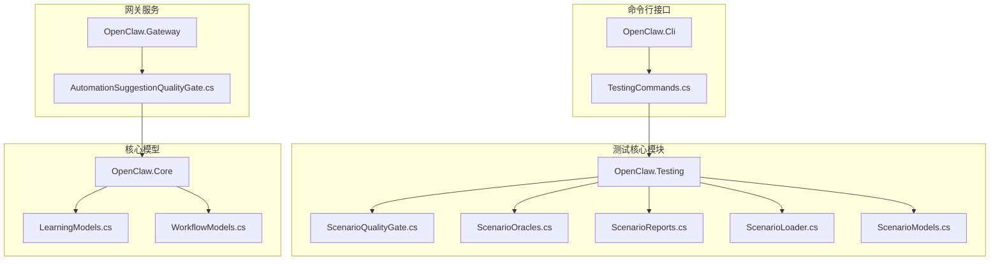
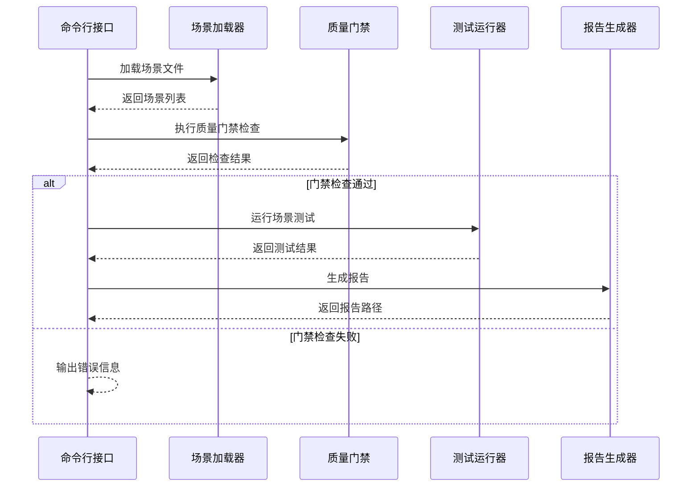
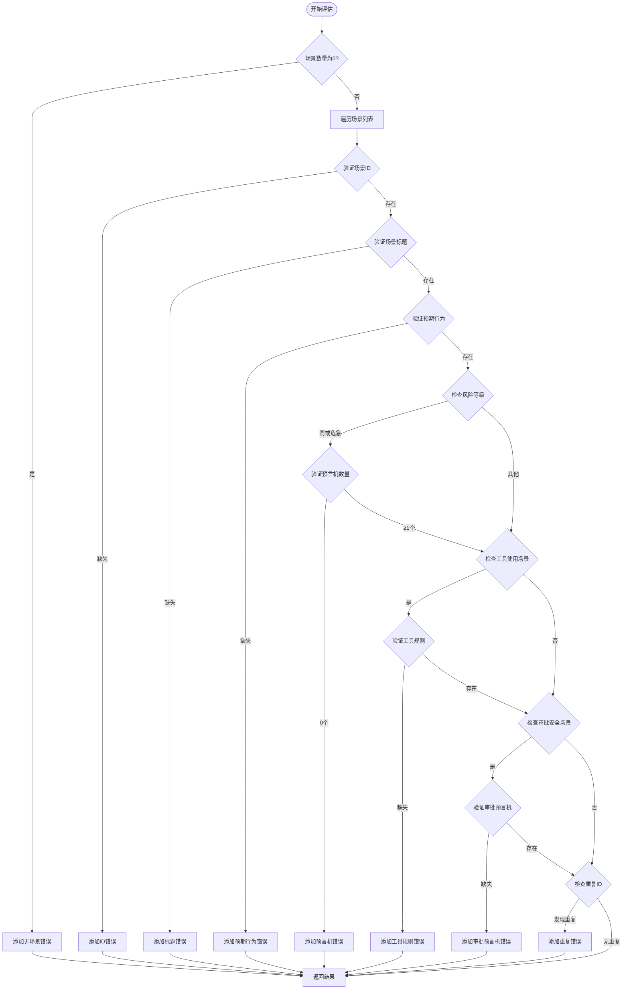
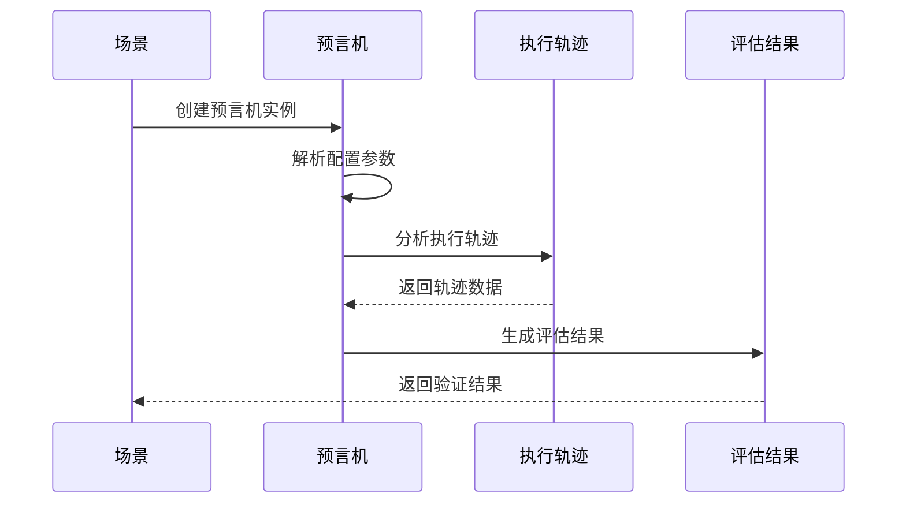
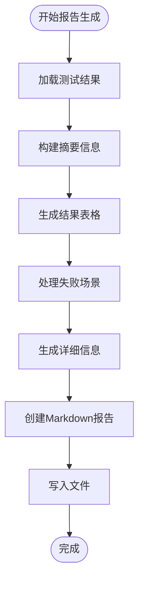
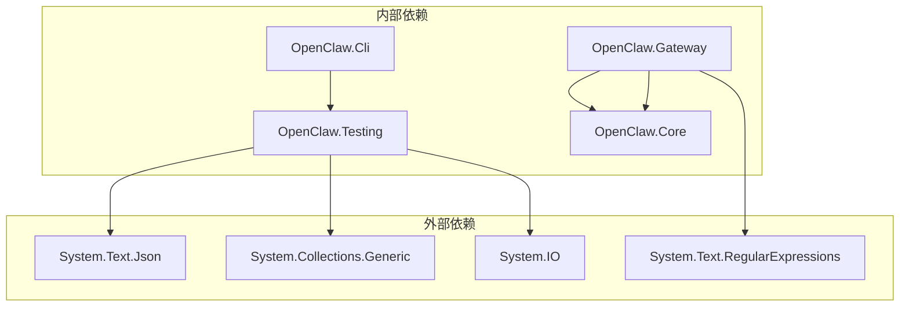

# 质量门禁

<cite>
**本文档引用的文件**
- [ScenarioQualityGate.cs](file://src/OpenClaw.Testing/ScenarioQualityGate.cs)
- [TestingCommands.cs](file://src/OpenClaw.Cli/TestingCommands.cs)
- [ScenarioReports.cs](file://src/OpenClaw.Testing/ScenarioReports.cs)
- [ScenarioModels.cs](file://src/OpenClaw.Testing/ScenarioModels.cs)
- [ScenarioLoader.cs](file://src/OpenClaw.Testing/ScenarioLoader.cs)
- [ScenarioOracles.cs](file://src/OpenClaw.Testing/ScenarioOracles.cs)
- [AutomationSuggestionQualityGate.cs](file://src/OpenClaw.Gateway/AutomationSuggestionQualityGate.cs)
- [LearningModels.cs](file://src/OpenClaw.Core/Models/LearningModels.cs)
- [WorkflowModels.cs](file://src/OpenClaw.Core/Models/WorkflowModels.cs)
</cite>

## 目录
1. [简介](#简介)
2. [项目结构](#项目结构)
3. [核心组件](#核心组件)
4. [架构概览](#架构概览)
5. [详细组件分析](#详细组件分析)
6. [依赖关系分析](#依赖关系分析)
7. [性能考虑](#性能考虑)
8. [故障排除指南](#故障排除指南)
9. [结论](#结论)
10. [附录](#附录)

## 简介

质量门禁是 OpenClaw 项目中用于确保场景测试质量和可靠性的核心机制。它通过多层验证和断言机制，确保场景测试在进入执行阶段之前满足所有必要的质量标准。

质量门禁系统主要包含两个核心组件：

1. **场景质量门禁**：验证场景测试的完整性和正确性
2. **自动化建议质量门禁**：评估自动化建议的质量和安全性

该系统提供了完整的错误检测、报告生成和状态判断功能，确保只有高质量的场景测试能够被执行。

## 项目结构

质量门禁相关的代码分布在以下模块中：



**图表来源**
- [ScenarioQualityGate.cs:1-110](file://src/OpenClaw.Testing/ScenarioQualityGate.cs#L1-L110)
- [TestingCommands.cs:1-271](file://src/OpenClaw.Cli/TestingCommands.cs#L1-L271)
- [AutomationSuggestionQualityGate.cs:1-146](file://src/OpenClaw.Gateway/AutomationSuggestionQualityGate.cs#L1-L146)

**章节来源**
- [ScenarioQualityGate.cs:1-110](file://src/OpenClaw.Testing/ScenarioQualityGate.cs#L1-L110)
- [TestingCommands.cs:1-271](file://src/OpenClaw.Cli/TestingCommands.cs#L1-L271)
- [AutomationSuggestionQualityGate.cs:1-146](file://src/OpenClaw.Gateway/AutomationSuggestionQualityGate.cs#L1-L146)

## 核心组件

### 场景质量门禁 (ScenarioQualityGate)

场景质量门禁是质量门禁系统的核心组件，负责验证场景测试的完整性和正确性。它检查场景文件的各种属性和要求，确保场景测试符合预定义的质量标准。

#### 主要功能特性

1. **场景完整性验证**
   - 检查场景 ID 和标题的存在性
   - 验证风险等级的有效性
   - 确保场景类型和标签的正确性

2. **预期行为验证**
   - 验证显式预期行为的存在
   - 检查工具调用限制
   - 确保最终答案内容的完整性

3. **安全和审批验证**
   - 高风险场景必须声明至少一个预言机
   - 工具使用场景必须声明工具调用规则
   - 审批或安全场景必须声明相应的预言机

4. **重复性检查**
   - 检测重复的场景 ID
   - 提供详细的错误报告

**章节来源**
- [ScenarioQualityGate.cs:16-74](file://src/OpenClaw.Testing/ScenarioQualityGate.cs#L16-L74)

### 自动化建议质量门禁 (AutomationSuggestionQualityGate)

自动化建议质量门禁专门用于评估自动化建议的质量和安全性，通过多维度评分系统来判断建议是否适合部署。

#### 评估维度

1. **意图清晰度**：评估自动化建议的目标是否明确
2. **输入范围稳定性**：检查输入数据的时间范围是否稳定
3. **输出清晰度**：验证期望输出格式的明确性
4. **调度匹配度**：评估执行频率与任务价值的匹配程度
5. **安全性**：检查外部副作用的控制情况
6. **噪声风险**：评估产生低价值输出的可能性
7. **用户价值**：衡量减少重复工作的能力
8. **重复风险**：检查是否与现有自动化重复

**章节来源**
- [AutomationSuggestionQualityGate.cs:6-81](file://src/OpenClaw.Gateway/AutomationSuggestionQualityGate.cs#L6-L81)

### 命令行接口 (TestingCommands)

TestingCommands 提供了完整的命令行界面，支持初始化、运行、报告生成和门禁检查等功能。

#### 支持的子命令

1. **init**：初始化场景测试目录和示例文件
2. **run**：运行场景测试并生成报告
3. **report**：重新生成报告
4. **gates**：仅运行门禁检查

**章节来源**
- [TestingCommands.cs:12-34](file://src/OpenClaw.Cli/TestingCommands.cs#L12-L34)

## 架构概览

质量门禁系统的整体架构采用分层设计，确保各个组件职责明确且相互独立。



**图表来源**
- [TestingCommands.cs:60-82](file://src/OpenClaw.Cli/TestingCommands.cs#L60-L82)
- [ScenarioQualityGate.cs:25-74](file://src/OpenClaw.Testing/ScenarioQualityGate.cs#L25-L74)

### 组件交互流程

质量门禁系统的核心交互流程如下：

1. **场景加载**：从指定目录加载所有 JSON 格式的场景文件
2. **门禁检查**：对每个场景执行多层验证规则
3. **结果处理**：根据检查结果决定后续操作
4. **报告生成**：生成详细的测试报告和可视化结果

**章节来源**
- [ScenarioLoader.cs:5-40](file://src/OpenClaw.Testing/ScenarioLoader.cs#L5-L40)
- [TestingCommands.cs:60-82](file://src/OpenClaw.Cli/TestingCommands.cs#L60-L82)

## 详细组件分析

### 场景质量门禁实现分析

#### 评估逻辑详解

场景质量门禁的评估逻辑基于以下核心原则：



**图表来源**
- [ScenarioQualityGate.cs:25-74](file://src/OpenClaw.Testing/ScenarioQualityGate.cs#L25-L74)

#### 断言机制实现

质量门禁系统实现了多层次的断言机制：

1. **必需字段断言**：确保场景的基本信息完整
2. **业务规则断言**：验证场景符合业务逻辑要求
3. **安全约束断言**：检查高风险场景的安全措施
4. **一致性断言**：确保场景之间的逻辑一致性

**章节来源**
- [ScenarioQualityGate.cs:36-71](file://src/OpenClaw.Testing/ScenarioQualityGate.cs#L36-L71)

### 预言机系统分析

预言机系统是质量门禁的核心验证组件，提供了多种类型的预言机来验证不同的测试场景。

#### 预言机类型分类

```mermaid
classDiagram
class ScenarioOracleBase {
+ScenarioOracleDefinition Definition
+string Name
+EvaluateAsync(scenario, trace) OracleResult
+Pass(name, message, evidence) OracleResult
+Fail(name, message, evidence) OracleResult
}
class ToolCalledOracle {
+EvaluateAsync(scenario, trace) OracleResult
}
class ToolNotCalledOracle {
+EvaluateAsync(scenario, trace) OracleResult
}
class MaxToolCallsOracle {
+EvaluateAsync(scenario, trace) OracleResult
}
class FinalAnswerContainsOracle {
+EvaluateAsync(scenario, trace) OracleResult
}
class FinalAnswerNotContainsOracle {
+EvaluateAsync(scenario, trace) OracleResult
}
class ApprovalRequiredOracle {
+EvaluateAsync(scenario, trace) OracleResult
}
class ApprovalNotRequiredOracle {
+EvaluateAsync(scenario, trace) OracleResult
}
class NoUnsafeToolOracle {
+EvaluateAsync(scenario, trace) OracleResult
}
class UnknownScenarioOracle {
+EvaluateAsync(scenario, trace) OracleResult
}
ScenarioOracleBase <|-- ToolCalledOracle
ScenarioOracleBase <|-- ToolNotCalledOracle
ScenarioOracleBase <|-- MaxToolCallsOracle
ScenarioOracleBase <|-- FinalAnswerContainsOracle
ScenarioOracleBase <|-- FinalAnswerNotContainsOracle
ScenarioOracleBase <|-- ApprovalRequiredOracle
ScenarioOracleBase <|-- ApprovalNotRequiredOracle
ScenarioOracleBase <|-- NoUnsafeToolOracle
ScenarioOracleBase <|-- UnknownScenarioOracle
```



**图表来源**
- [ScenarioOracles.cs:64-165](file://src/OpenClaw.Testing/ScenarioOracles.cs#L64-L165)

#### 预言机评估流程



**图表来源**
- [ScenarioOracles.cs:69-72](file://src/OpenClaw.Testing/ScenarioOracles.cs#L69-L72)

**章节来源**
- [ScenarioOracles.cs:33-62](file://src/OpenClaw.Testing/ScenarioOracles.cs#L33-L62)

### 报告生成系统

报告生成系统负责将测试结果转换为易于理解的格式，并提供详细的分析信息。

#### 报告生成流程



**图表来源**
- [ScenarioReports.cs:8-51](file://src/OpenClaw.Testing/ScenarioReports.cs#L8-L51)

#### 报告格式规范

报告系统支持多种输出格式：

1. **Markdown 格式**：用于人类可读的报告
2. **JSON 格式**：用于机器可读的数据
3. **轨迹文件**：保存详细的执行轨迹

**章节来源**
- [ScenarioReports.cs:98-151](file://src/OpenClaw.Testing/ScenarioReports.cs#L98-L151)

### 自动化建议质量评估

自动化建议质量门禁提供了更复杂的评估机制，通过多维度评分来判断自动化建议的质量。

#### 质量评估维度

| 维度名称 | 权重 | 评估标准 | 最低分数 |
|---------|------|----------|----------|
| 意图清晰度 | 12.5% | 目标明确性 | 55 |
| 输入范围稳定性 | 12.5% | 时间范围确定性 | 25 |
| 输出清晰度 | 12.5% | 格式明确性 | 25 |
| 调度匹配度 | 12.5% | 频率与价值匹配 | 65 |
| 安全性 | 12.5% | 外部副作用控制 | 20 |
| 噪声风险 | 12.5% | 低价值输出可能性 | 35 |
| 用户价值 | 12.5% | 减少重复工作能力 | 55 |
| 重复风险 | 12.5% | 与现有自动化重复 | 15 |

**章节来源**
- [AutomationSuggestionQualityGate.cs:60-71](file://src/OpenClaw.Gateway/AutomationSuggestionQualityGate.cs#L60-L71)

## 依赖关系分析

质量门禁系统的依赖关系相对简单，主要依赖于核心模型和工具类。



**图表来源**
- [ScenarioQualityGate.cs:1-1](file://src/OpenClaw.Testing/ScenarioQualityGate.cs#L1-L1)
- [AutomationSuggestionQualityGate.cs:1-2](file://src/OpenClaw.Gateway/AutomationSuggestionQualityGate.cs#L1-L2)

### 关键依赖关系

1. **序列化依赖**：使用 System.Text.Json 进行数据序列化
2. **集合操作依赖**：使用 LINQ 进行数据过滤和聚合
3. **文件系统依赖**：直接操作文件系统进行场景加载和报告生成
4. **正则表达式依赖**：用于文本模式匹配和规范化

**章节来源**
- [ScenarioLoader.cs:1-3](file://src/OpenClaw.Testing/ScenarioLoader.cs#L1-L3)
- [ScenarioReports.cs:1-3](file://src/OpenClaw.Testing/ScenarioReports.cs#L1-L3)

## 性能考虑

质量门禁系统在设计时充分考虑了性能优化：

### 时间复杂度分析

1. **场景加载**：O(n) - n 为场景文件数量
2. **门禁检查**：O(m×k) - m 为场景数量，k 为平均场景复杂度
3. **预言机评估**：O(t) - t 为轨迹步骤数量
4. **报告生成**：O(r) - r 为结果数量

### 内存使用优化

1. **流式处理**：场景文件采用流式解析，避免一次性加载大文件
2. **延迟计算**：使用 LINQ 的延迟执行特性
3. **对象复用**：重用字符串和集合对象以减少内存分配

### 并发处理

质量门禁系统支持并发场景处理，但当前实现采用同步模式以简化复杂度。

## 故障排除指南

### 常见问题及解决方案

#### 场景文件加载失败

**问题症状**：
- "No scenario JSON files were found."
- 场景目录为空

**解决方法**：
1. 检查场景目录路径是否正确
2. 确认目录中存在 .json 文件
3. 验证文件权限是否正确

#### 门禁检查失败

**问题症状**：
- 场景缺少必要字段
- 预期行为不完整
- 安全约束未满足

**解决方法**：
1. 检查场景 JSON 文件格式
2. 验证必需字段是否填写
3. 确认风险等级与场景要求匹配

#### 预言机评估错误

**问题症状**：
- Unknown oracle type 错误
- 预言机配置无效

**解决方法**：
1. 检查预言机类型拼写
2. 验证预言机参数配置
3. 确认工具名称正确性

**章节来源**
- [TestingCommands.cs:143-153](file://src/OpenClaw.Cli/TestingCommands.cs#L143-L153)
- [ScenarioOracles.cs:167-181](file://src/OpenClaw.Testing/ScenarioOracles.cs#L167-L181)

### 调试技巧

1. **启用详细日志**：使用调试模式查看详细的执行信息
2. **逐步验证**：逐个检查场景文件的各个部分
3. **单元测试**：编写针对特定场景的测试用例

## 结论

质量门禁系统为 OpenClaw 项目提供了强大的测试保障机制。通过多层次的验证和断言，确保只有高质量的场景测试能够被执行。

### 主要优势

1. **全面性**：覆盖场景测试的所有关键方面
2. **灵活性**：支持自定义预言机和评估规则
3. **可扩展性**：模块化设计便于功能扩展
4. **易用性**：提供友好的命令行接口和报告系统

### 未来改进方向

1. **性能优化**：实现异步处理以提高大规模场景测试的效率
2. **可视化增强**：提供更丰富的可视化报告和分析工具
3. **智能建议**：基于历史数据提供场景改进建议
4. **集成扩展**：支持更多第三方测试框架和工具

## 附录

### 使用示例

#### 初始化场景测试

```bash
openclaw test init --scenarios ./tests --docs ./docs
```

#### 运行场景测试

```bash
openclaw test run --scenarios ./tests --output ./artifacts
```

#### 仅运行门禁检查

```bash
openclaw test gates --scenarios ./tests
```

### 配置选项

| 选项 | 默认值 | 描述 |
|------|--------|------|
| --scenarios | tests/agent-scenarios | 场景文件目录 |
| --output | artifacts/testing/agent-scenarios | 输出目录 |
| --fail-on | high | 失败策略（any/high） |

### 最佳实践

1. **场景设计**：确保场景具有明确的预期行为和验证规则
2. **安全考虑**：高风险场景必须包含适当的安全验证
3. **文档维护**：保持场景描述和文档的同步更新
4. **持续集成**：将质量门禁集成到 CI/CD 流程中