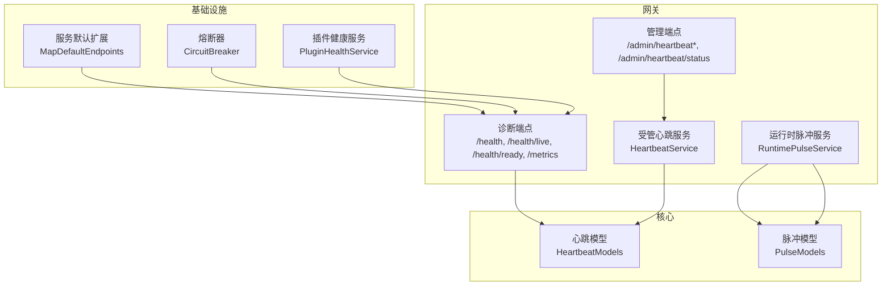
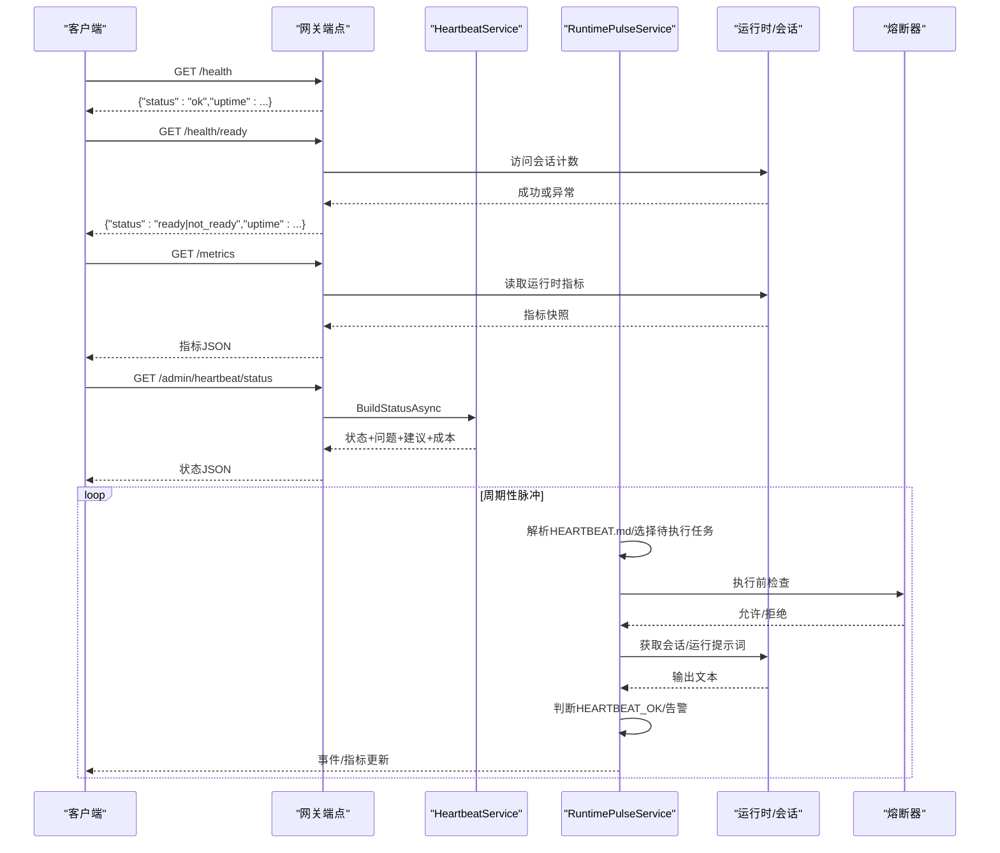
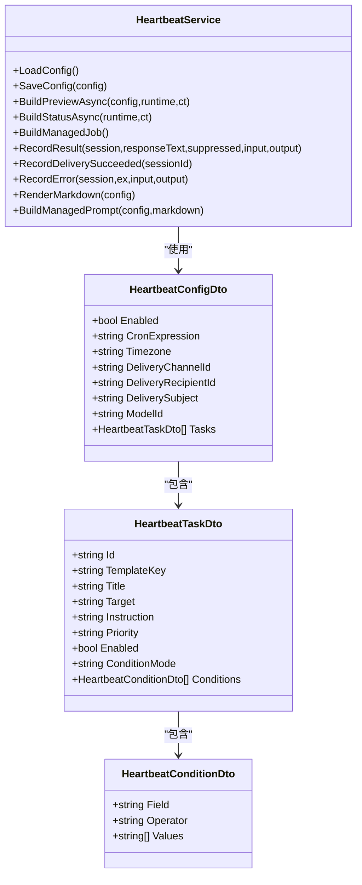
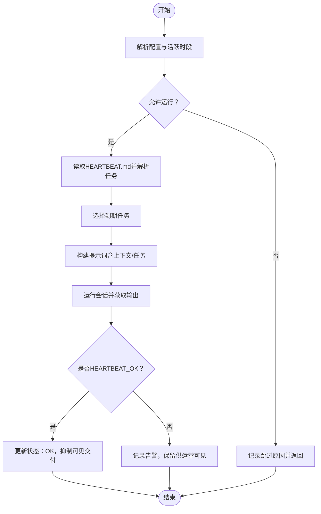
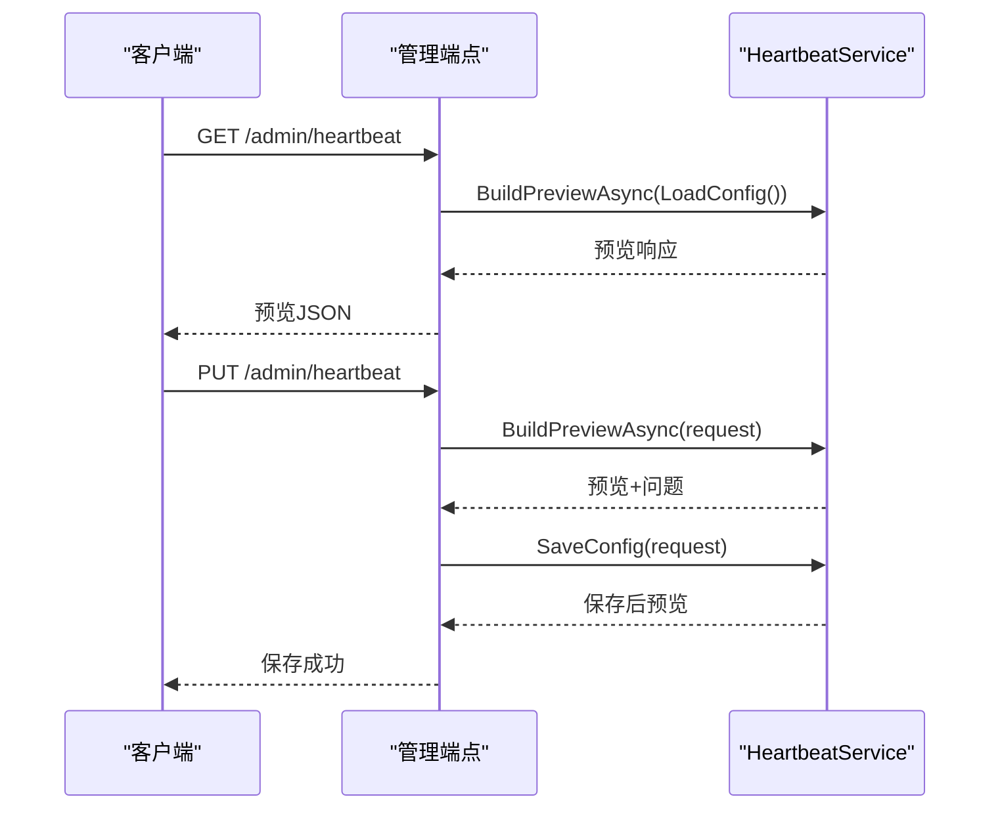
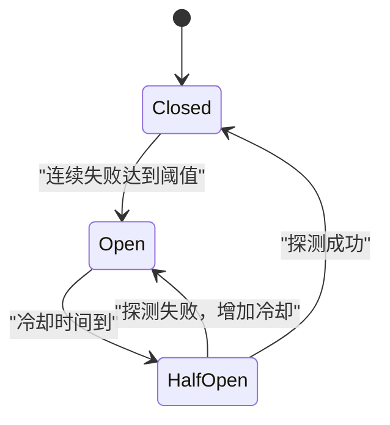
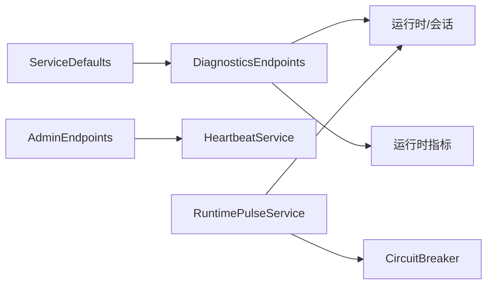

# 健康检查

<cite>
**本文引用的文件**
- [HeartbeatService.cs](file://src/OpenClaw.Gateway/HeartbeatService.cs)
- [RuntimePulseService.cs](file://src/OpenClaw.Gateway/RuntimePulseService.cs)
- [HeartbeatModels.cs](file://src/OpenClaw.Core/Models/HeartbeatModels.cs)
- [PulseModels.cs](file://src/OpenClaw.Core/Models/PulseModels.cs)
- [DiagnosticsEndpoints.cs](file://src/OpenClaw.Gateway/Endpoints/DiagnosticsEndpoints.cs)
- [AdminEndpoints.Setup.cs](file://src/OpenClaw.Gateway/Endpoints/AdminEndpoints.Setup.cs)
- [Extensions.cs](file://Kingcrab.ServiceDefaults/Extensions.cs)
- [CircuitBreaker.cs](file://src/OpenClaw.Agent/CircuitBreaker.cs)
- [PluginHealthService.cs](file://src/OpenClaw.Gateway/PluginHealthService.cs)
- [EndpointConformanceTests.cs](file://src/OpenClaw.Tests/EndpointConformanceTests.cs)
- [OpenClawHttpClient.cs](file://src/OpenClaw.Client/OpenClawHttpClient.cs)
</cite>

## 目录
1. [简介](#简介)
2. [项目结构](#项目结构)
3. [核心组件](#核心组件)
4. [架构总览](#架构总览)
5. [详细组件分析](#详细组件分析)
6. [依赖关系分析](#依赖关系分析)
7. [性能考量](#性能考量)
8. [故障排查指南](#故障排查指南)
9. [结论](#结论)
10. [附录](#附录)

## 简介
本技术文档围绕健康检查系统展开，重点覆盖以下方面：
- 运行时心跳机制：包括“受管心跳”（managed heartbeat）与“运行时脉冲”（runtime pulse）两类健康检查能力。
- 组件健康状态监控与故障检测策略：通过端点、状态文件、运行时指标与熔断器联动实现。
- 健康检查端点、状态报告格式与响应时间测量：统一的 JSON 模型与端点设计。
- 自动恢复机制、降级策略与容错处理：基于熔断器、跳过策略与可观测事件。
- 外部服务依赖检查、数据库连接监控与缓存状态跟踪：通过诊断端点与通道就绪评估实现。
- 配置、自定义检查器开发与告警集成：模板化任务、条件表达式与预览/保存流程。
- 健康状态分析、趋势预测与容量规划建议：成本估算、令牌用量与运行间隔优化。

## 项目结构
健康检查相关代码主要分布在以下模块：
- 网关端点与运行时：健康检查端点、诊断端点、受管心跳与运行时脉冲服务。
- 核心模型：心跳与脉冲的配置、状态、预览与成本估算等数据结构。
- 服务默认扩展：ASP.NET Core 健康检查端点映射。
- 容错与熔断：Agent 层熔断器，用于保护下游调用。
- 插件健康：插件加载、信任与兼容性健康快照。
- 客户端与测试：客户端封装健康检查端点访问，测试验证响应格式。

**图表来源**
- [DiagnosticsEndpoints.cs:32-66](file://src/OpenClaw.Gateway/Endpoints/DiagnosticsEndpoints.cs#L32-L66)
- [AdminEndpoints.Setup.cs:434-512](file://src/OpenClaw.Gateway/Endpoints/AdminEndpoints.Setup.cs#L434-L512)
- [HeartbeatService.cs:14-135](file://src/OpenClaw.Gateway/HeartbeatService.cs#L14-L135)
- [RuntimePulseService.cs:16-59](file://src/OpenClaw.Gateway/RuntimePulseService.cs#L16-L59)
- [Extensions.cs:128-145](file://Kingcrab.ServiceDefaults/Extensions.cs#L128-L145)
- [CircuitBreaker.cs:34-208](file://src/OpenClaw.Agent/CircuitBreaker.cs#L34-L208)
- [PluginHealthService.cs:67-141](file://src/OpenClaw.Gateway/PluginHealthService.cs#L67-L141)

**章节来源**
- [DiagnosticsEndpoints.cs:18-66](file://src/OpenClaw.Gateway/Endpoints/DiagnosticsEndpoints.cs#L18-L66)
- [AdminEndpoints.Setup.cs:434-512](file://src/OpenClaw.Gateway/Endpoints/AdminEndpoints.Setup.cs#L434-L512)
- [Extensions.cs:128-145](file://Kingcrab.ServiceDefaults/Extensions.cs#L128-L145)

## 核心组件
- 受管心跳（HeartbeatService）
  - 负责加载/保存心跳配置、构建预览与状态、渲染 Markdown 规范、生成提示词、记录运行结果与投递状态。
  - 支持模板化任务（邮件、日历、网站监控、API 健康检查、文件夹监控）、条件表达式与成本估算。
- 运行时脉冲（RuntimePulseService）
  - 周期性读取工作区中的 HEARTBEAT.md，解析待执行任务，按活跃时段与会话占用情况调度运行。
  - 支持隔离会话、轻量上下文、Fractal 内存上下文附加，识别“HEARTBEAT_OK”并抑制可见交付。
- 健康检查端点
  - /health（认证）、/health/live（未认证存活探针）、/health/ready（未认证就绪探针）、/metrics、/metrics/providers、/metrics/tools 等。
- 服务默认健康检查
  - 在开发环境自动映射 /health 与 /alive（仅 live 标签），生产环境需谨慎启用以避免安全风险。
- 熔断器（CircuitBreaker）
  - 对下游失败进行快速失败与指数退避探测，防止级联故障；在运行时脉冲中用于模型/提供方不可用场景。
- 插件健康（PluginHealthService）
  - 维护插件加载、禁用、隔离与兼容性摘要，支持持久化状态与信任级别判定。

**章节来源**
- [HeartbeatService.cs:14-281](file://src/OpenClaw.Gateway/HeartbeatService.cs#L14-L281)
- [RuntimePulseService.cs:16-299](file://src/OpenClaw.Gateway/RuntimePulseService.cs#L16-L299)
- [DiagnosticsEndpoints.cs:32-84](file://src/OpenClaw.Gateway/Endpoints/DiagnosticsEndpoints.cs#L32-L84)
- [Extensions.cs:128-145](file://Kingcrab.ServiceDefaults/Extensions.cs#L128-L145)
- [CircuitBreaker.cs:34-208](file://src/OpenClaw.Agent/CircuitBreaker.cs#L34-L208)
- [PluginHealthService.cs:67-141](file://src/OpenClaw.Gateway/PluginHealthService.cs#L67-L141)

## 架构总览
健康检查系统由“端点层—服务层—模型层—基础设施层”构成，形成闭环的监控、评估与反馈机制。

**图表来源**
- [DiagnosticsEndpoints.cs:32-84](file://src/OpenClaw.Gateway/Endpoints/DiagnosticsEndpoints.cs#L32-L84)
- [AdminEndpoints.Setup.cs:504-512](file://src/OpenClaw.Gateway/Endpoints/AdminEndpoints.Setup.cs#L504-L512)
- [RuntimePulseService.cs:136-299](file://src/OpenClaw.Gateway/RuntimePulseService.cs#L136-L299)
- [CircuitBreaker.cs:91-147](file://src/OpenClaw.Agent/CircuitBreaker.cs#L91-L147)

## 详细组件分析

### 受管心跳（HeartbeatService）
- 配置与存储
  - 配置文件 heartbeat.json 与生成的 HEARTBEAT.md 文件路径管理，原子写入与缓存一致性。
- 预览与校验
  - 构建预览响应，包含渲染后的 Markdown、可用模板、建议与成本估算；对任务 ID、模板键、目标、优先级、条件等进行严格校验。
- 任务模板与条件
  - 内置模板：邮件检查、日历提醒、网站监控、API 健康检查、文件/文件夹监控；支持自定义模板字段集合与操作符约束。
- 提示词与投递
  - 生成受管提示词，遵循“无动作返回 HEARTBEAT_OK，有动作返回简要告警摘要”的契约；支持多种投递渠道与收件人校验。
- 运行结果记录
  - 记录运行时间、输入输出令牌、会话 ID、是否抑制投递与消息预览；支持后续投递成功回填。

**图表来源**
- [HeartbeatService.cs:14-281](file://src/OpenClaw.Gateway/HeartbeatService.cs#L14-L281)
- [HeartbeatModels.cs:3-118](file://src/OpenClaw.Core/Models/HeartbeatModels.cs#L3-L118)

**章节来源**
- [HeartbeatService.cs:142-281](file://src/OpenClaw.Gateway/HeartbeatService.cs#L142-L281)
- [HeartbeatModels.cs:3-118](file://src/OpenClaw.Core/Models/HeartbeatModels.cs#L3-L118)

### 运行时脉冲（RuntimePulseService）
- 运行控制
  - 解析配置的 every 字段（支持 s/m/h/d 或绝对时间），按活跃时段与会话占用情况调度；支持手动唤醒与下一次脉冲排队。
- 上下文与提示词
  - 从工作区读取 HEARTBEAT.md 并解析任务块，可选附加 Fractal 内存上下文；构建提示词并截断以控制成本。
- 结果判定与事件
  - 识别“HEARTBEAT_OK”并抑制可见交付；否则记录告警事件与最近告警列表；统计脉冲运行次数、告警次数与错误次数。
- 错误与跳过
  - 模型不可用、运行时忙、空心跳文件、可见性关闭、无会话等场景均记录跳过原因并发出事件。

**图表来源**
- [RuntimePulseService.cs:136-299](file://src/OpenClaw.Gateway/RuntimePulseService.cs#L136-L299)
- [PulseModels.cs:54-91](file://src/OpenClaw.Core/Models/PulseModels.cs#L54-L91)

**章节来源**
- [RuntimePulseService.cs:64-299](file://src/OpenClaw.Gateway/RuntimePulseService.cs#L64-L299)
- [PulseModels.cs:3-91](file://src/OpenClaw.Core/Models/PulseModels.cs#L3-L91)

### 健康检查端点与状态报告
- /health：返回健康状态与进程启动以来的毫秒数，需要操作员授权。
- /health/live：未认证存活探针，适合负载均衡或容器编排。
- /health/ready：未认证就绪探针，尝试访问会话计数，异常则返回 not_ready。
- /metrics：返回运行时指标快照，包含活动会话数与熔断器状态。
- /metrics/providers、/metrics/tools：提供供应商与工具使用快照。
- 管理端点
  - /admin/heartbeat：获取当前受管心跳配置预览。
  - /admin/heartbeat/preview：提交配置请求并返回预览。
  - /admin/heartbeat：保存配置并返回预览。
  - /admin/heartbeat/status：返回当前状态、问题、建议与成本估算。

**图表来源**
- [AdminEndpoints.Setup.cs:434-512](file://src/OpenClaw.Gateway/Endpoints/AdminEndpoints.Setup.cs#L434-L512)
- [OpenClawHttpClient.cs:926-954](file://src/OpenClaw.Client/OpenClawHttpClient.cs#L926-L954)

**章节来源**
- [DiagnosticsEndpoints.cs:32-84](file://src/OpenClaw.Gateway/Endpoints/DiagnosticsEndpoints.cs#L32-L84)
- [AdminEndpoints.Setup.cs:434-512](file://src/OpenClaw.Gateway/Endpoints/AdminEndpoints.Setup.cs#L434-L512)
- [OpenClawHttpClient.cs:926-954](file://src/OpenClaw.Client/OpenClawHttpClient.cs#L926-L954)

### 熔断器与容错
- 熔断器状态机：Closed → Open（失败阈值触发）→ HalfOpen（探测成功则回退 Closed，失败则延长冷却）。
- 在运行时脉冲中，当模型/提供方不可用时记录错误并返回跳过，避免阻塞主流程。
- 与健康端点结合：/metrics 中包含熔断器状态，便于观测。

**图表来源**
- [CircuitBreaker.cs:210-226](file://src/OpenClaw.Agent/CircuitBreaker.cs#L210-L226)

**章节来源**
- [CircuitBreaker.cs:34-208](file://src/OpenClaw.Agent/CircuitBreaker.cs#L34-L208)
- [RuntimePulseService.cs:282-294](file://src/OpenClaw.Gateway/RuntimePulseService.cs#L282-L294)

### 插件健康与外部依赖
- 插件健康服务维护插件的加载状态、禁用/隔离状态、审查与信任级别、兼容性摘要与重启计数等。
- 与通道就绪评估结合，确保投递渠道（如邮件/SMS/Telegram/WhatsApp）处于可用状态后再进行告警投递。

**章节来源**
- [PluginHealthService.cs:67-141](file://src/OpenClaw.Gateway/PluginHealthService.cs#L67-L141)

## 依赖关系分析
- 端点依赖
  - 诊断端点依赖运行时会话管理器与运行时指标；管理端点依赖受管心跳服务与运行时。
- 服务间耦合
  - HeartbeatService 与 RuntimePulseService 分别独立运行，但共享 HEARTBEAT.md 作为输入源。
- 外部依赖
  - ASP.NET Core 健康检查端点映射（开发环境）。
  - 熔断器保护下游调用，避免雪崩。

**图表来源**
- [DiagnosticsEndpoints.cs:32-84](file://src/OpenClaw.Gateway/Endpoints/DiagnosticsEndpoints.cs#L32-L84)
- [AdminEndpoints.Setup.cs:434-512](file://src/OpenClaw.Gateway/Endpoints/AdminEndpoints.Setup.cs#L434-L512)
- [Extensions.cs:128-145](file://Kingcrab.ServiceDefaults/Extensions.cs#L128-L145)
- [CircuitBreaker.cs:34-208](file://src/OpenClaw.Agent/CircuitBreaker.cs#L34-L208)

**章节来源**
- [DiagnosticsEndpoints.cs:18-84](file://src/OpenClaw.Gateway/Endpoints/DiagnosticsEndpoints.cs#L18-L84)
- [AdminEndpoints.Setup.cs:434-512](file://src/OpenClaw.Gateway/Endpoints/AdminEndpoints.Setup.cs#L434-L512)
- [Extensions.cs:128-145](file://Kingcrab.ServiceDefaults/Extensions.cs#L128-L145)

## 性能考量
- 响应时间测量
  - /health 与 /health/ready 为轻量端点，不涉及复杂计算；/metrics 读取运行时指标，建议在低频轮询。
- 运行时脉冲
  - 通过“HEARTBEAT_OK”抑制可见交付，减少不必要的通知；可配置活跃时段与忙碌跳过，降低峰值负载。
- 成本控制
  - 受管心跳与运行时脉冲均提供成本估算（令牌用量、月度费用），建议根据任务数量与运行频率调整。
- 缓存与文件 IO
  - 心跳配置与状态采用原子写入与缓存，避免频繁 IO；HEARTBEAT.md 限制最大长度，防止过大内容影响解析。

[本节为通用指导，无需特定文件来源]

## 故障排查指南
- 健康端点返回 not_ready
  - 检查会话管理器初始化状态；确认 /metrics 能正常返回；查看熔断器状态。
- 运行时脉冲被跳过
  - 查看跳过原因（禁用、非活跃时段、忙碌、空心跳文件、可见性关闭、无会话、模型不可用等）；检查最近事件与状态文件。
- 受管心跳保存失败
  - 查看预览中的问题列表（模板未知、缺少目标、无效优先级/条件模式、条件字段/操作符不支持、渲染过大等）；修复后重试。
- 投递渠道不可用
  - 确认通道就绪评估结果与插件健康状态；检查收件人配置与渠道启用状态。
- 响应格式验证
  - 使用测试用例验证 /health 响应结构，确保 status 与 uptime 字段存在且类型正确。

**章节来源**
- [RuntimePulseService.cs:751-764](file://src/OpenClaw.Gateway/RuntimePulseService.cs#L751-L764)
- [HeartbeatService.cs:511-622](file://src/OpenClaw.Gateway/HeartbeatService.cs#L511-L622)
- [EndpointConformanceTests.cs:38-50](file://src/OpenClaw.Tests/EndpointConformanceTests.cs#L38-L50)

## 结论
健康检查系统通过“端点可观测—服务自动化—状态文件—熔断保护—插件治理”的闭环，实现了对运行时健康状况的全面监控与快速反馈。受管心跳与运行时脉冲分别面向“计划性检查”和“即时/周期性观察”，配合成本估算与跳过策略，既保证了可观测性，又兼顾了性能与资源消耗。建议在生产环境中谨慎启用 /health 与 /alive 端点，并结合熔断器与活跃时段策略，实现稳定可靠的健康保障。

[本节为总结，无需特定文件来源]

## 附录

### 健康检查端点一览
- /health：认证健康检查，返回状态与运行时长。
- /health/live：未认证存活探针。
- /health/ready：未认证就绪探针。
- /metrics：运行时指标快照。
- /metrics/providers：供应商使用快照。
- /metrics/tools：工具使用快照。
- /admin/heartbeat：获取受管心跳配置预览。
- /admin/heartbeat/preview：提交配置并返回预览。
- /admin/heartbeat：保存配置并返回预览。
- /admin/heartbeat/status：返回状态、问题、建议与成本估算。

**章节来源**
- [DiagnosticsEndpoints.cs:32-84](file://src/OpenClaw.Gateway/Endpoints/DiagnosticsEndpoints.cs#L32-L84)
- [AdminEndpoints.Setup.cs:434-512](file://src/OpenClaw.Gateway/Endpoints/AdminEndpoints.Setup.cs#L434-L512)

### 状态报告格式要点
- 健康响应：包含 status 与 uptime。
- 心跳预览/状态：包含配置、路径、渲染内容、问题、可用模板、建议与成本估算。
- 脉冲状态：包含配置、HEARTBEAT.md 存在性与空状态、最近运行与跳过原因、最近告警与 OK 计数、待处理手动文本等。

**章节来源**
- [EndpointConformanceTests.cs:38-50](file://src/OpenClaw.Tests/EndpointConformanceTests.cs#L38-L50)
- [HeartbeatModels.cs:88-118](file://src/OpenClaw.Core/Models/HeartbeatModels.cs#L88-L118)
- [PulseModels.cs:54-71](file://src/OpenClaw.Core/Models/PulseModels.cs#L54-L71)