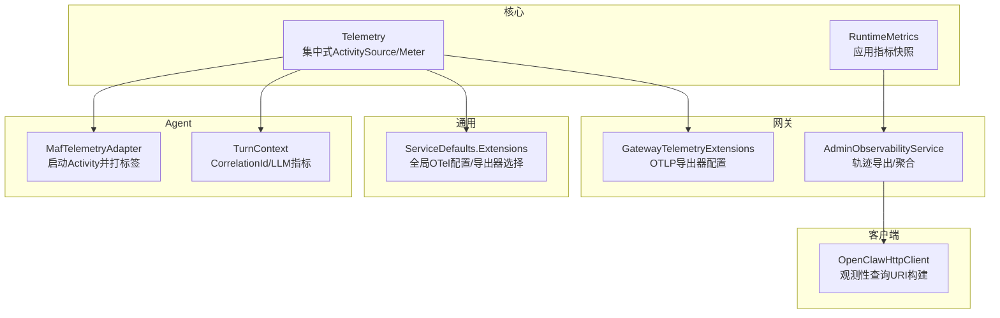
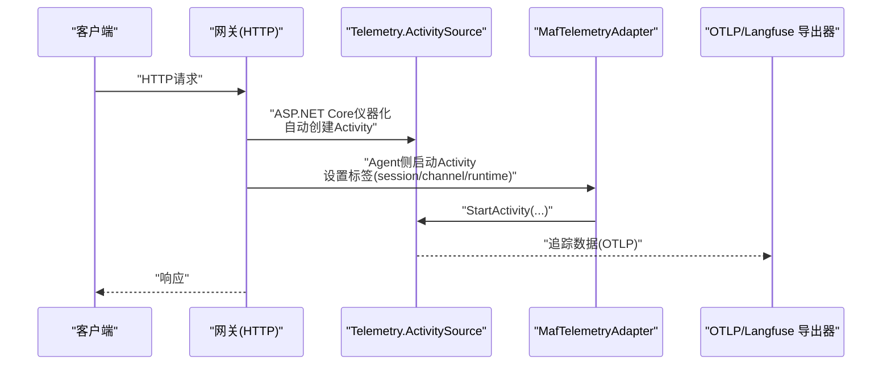
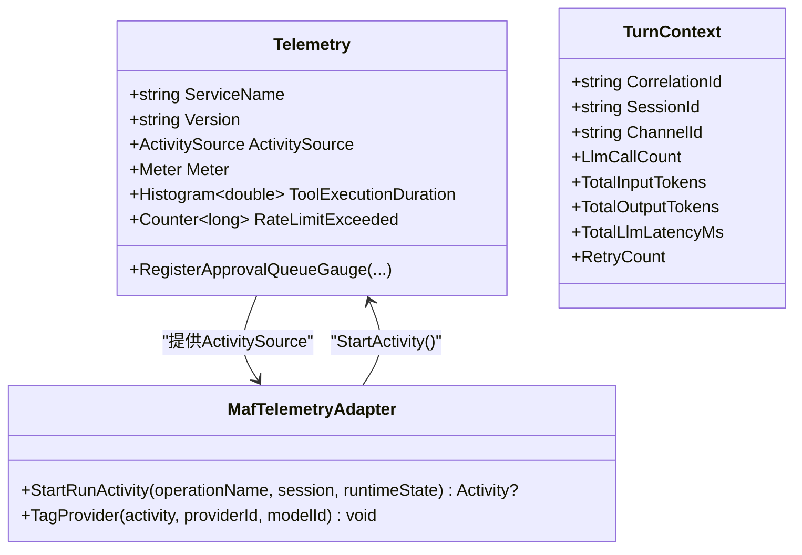
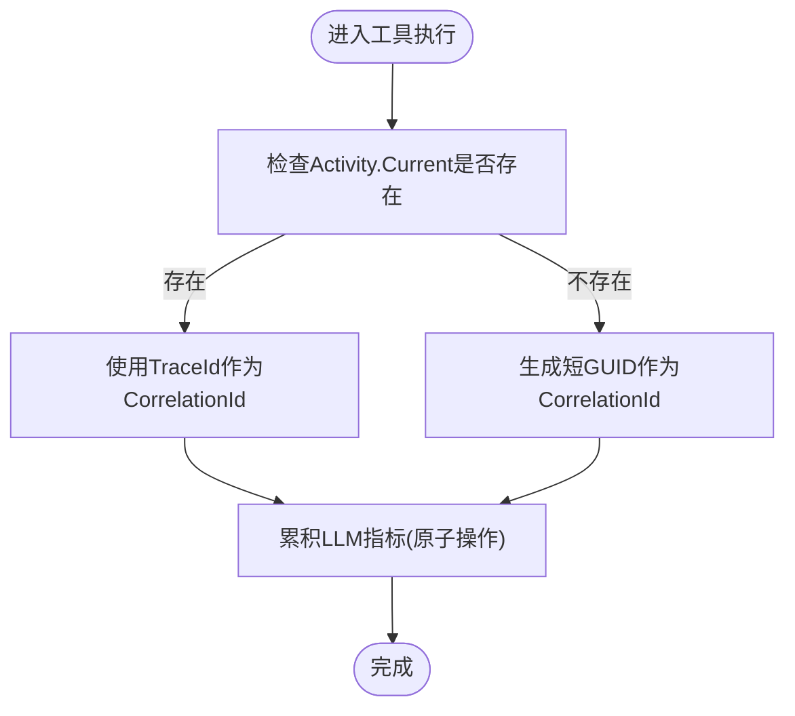
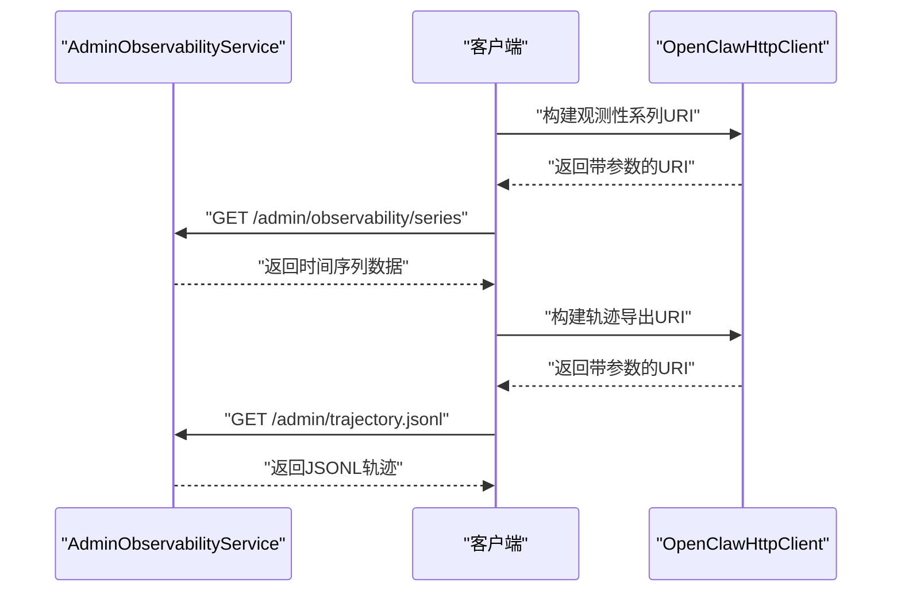
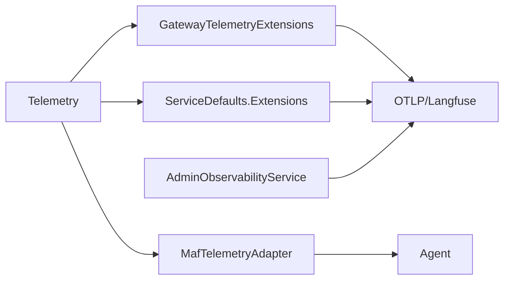

# 分布式追踪

<cite>
**本文引用的文件**
- [Telemetry.cs](file://src/OpenClaw.Core/Observability/Telemetry.cs)
- [GatewayTelemetryExtensions.cs](file://src/OpenClaw.Gateway/Extensions/GatewayTelemetryExtensions.cs)
- [Extensions.cs](file://Kingcrab.ServiceDefaults/Extensions.cs)
- [MafTelemetryAdapter.cs](file://src/OpenClaw.Agent/MafTelemetryAdapter.cs)
- [TurnContext.cs](file://src/OpenClaw.Core/Observability/TurnContext.cs)
- [AdminObservabilityService.cs](file://src/OpenClaw.Gateway/AdminObservabilityService.cs)
- [OpenClawHttpClient.cs](file://src/OpenClaw.Client/OpenClawHttpClient.cs)
- [ActorRateLimitService.cs](file://src/OpenClaw.Gateway/ActorRateLimitService.cs)
- [Program.cs](file://src/OpenClaw.Gateway/Program.cs)
- [RuntimeMetrics.cs](file://src/OpenClaw.Core/Observability/RuntimeMetrics.cs)
- [ObservabilityTests.cs](file://src/OpenClaw.Tests/ObservabilityTests.cs)
</cite>

## 目录
1. [简介](#简介)
2. [项目结构](#项目结构)
3. [核心组件](#核心组件)
4. [架构总览](#架构总览)
5. [详细组件分析](#详细组件分析)
6. [依赖分析](#依赖分析)
7. [性能考虑](#性能考虑)
8. [故障排查指南](#故障排查指南)
9. [结论](#结论)
10. [附录](#附录)

## 简介
本技术文档围绕分布式追踪系统展开，聚焦于请求链路追踪、跨服务调用关联与上下文传播、追踪ID生成与Span管理、分布式上下文传递、异步与并发场景下的追踪、追踪数据采集与导出、查询接口与可视化、配置选项与采样策略以及性能影响与优化建议。本文以仓库中的OpenTelemetry集成、自定义ActivitySource、追踪导出器配置、轨迹导出接口与指标体系为基础，结合实际代码实现进行系统化梳理。

## 项目结构
本项目在多个层面实现了可观测性与分布式追踪能力：
- 核心可观测性入口：集中式的Telemetry类提供ActivitySource与Meter，并注册关键指标（如工具执行时延、速率限制计数等）。
- 网关层遥测扩展：GatewayTelemetryExtensions统一配置日志、指标与追踪，启用ASP.NET Core与HTTP客户端仪器化，并通过OTLP导出器输出。
- 通用服务默认扩展：ServiceDefaults.Extensions提供全局OpenTelemetry配置与导出器选择（支持OTLP或Langfuse），并排除健康检查端点的追踪。
- 追踪适配器：MafTelemetryAdapter在Agent侧基于Telemetry.ActivitySource启动Activity并注入会话与运行时标签。
- 请求级上下文：TurnContext负责每轮请求的CorrelationId生成与LLM调用级指标累积，支持与Activity.Current联动。
- 轨迹导出与查询：AdminObservabilityService提供轨迹JSONL导出与时间序列聚合；OpenClawHttpClient提供观测性系列与轨迹导出的HTTP查询构建。
- 限流与追踪：ActorRateLimitService在触发速率限制时记录Telemetry.RateLimitExceeded指标，便于追踪与告警。

**图表来源**
- [Telemetry.cs:9-53](file://src/OpenClaw.Core/Observability/Telemetry.cs#L9-L53)
- [GatewayTelemetryExtensions.cs:18-51](file://src/OpenClaw.Gateway/Extensions/GatewayTelemetryExtensions.cs#L18-L51)
- [Extensions.cs:49-115](file://Kingcrab.ServiceDefaults/Extensions.cs#L49-L115)
- [MafTelemetryAdapter.cs:7-24](file://src/OpenClaw.Agent/MafTelemetryAdapter.cs#L7-L24)
- [TurnContext.cs:12-32](file://src/OpenClaw.Core/Observability/TurnContext.cs#L12-L32)
- [AdminObservabilityService.cs:16-53](file://src/OpenClaw.Gateway/AdminObservabilityService.cs#L16-L53)
- [OpenClawHttpClient.cs:1467-1490](file://src/OpenClaw.Client/OpenClawHttpClient.cs#L1467-L1490)

**章节来源**
- [Program.cs:66-91](file://src/OpenClaw.Gateway/Program.cs#L66-L91)
- [Telemetry.cs:9-53](file://src/OpenClaw.Core/Observability/Telemetry.cs#L9-L53)
- [GatewayTelemetryExtensions.cs:18-51](file://src/OpenClaw.Gateway/Extensions/GatewayTelemetryExtensions.cs#L18-L51)
- [Extensions.cs:49-115](file://Kingcrab.ServiceDefaults/Extensions.cs#L49-L115)
- [MafTelemetryAdapter.cs:7-24](file://src/OpenClaw.Agent/MafTelemetryAdapter.cs#L7-L24)
- [TurnContext.cs:12-32](file://src/OpenClaw.Core/Observability/TurnContext.cs#L12-L32)
- [AdminObservabilityService.cs:16-53](file://src/OpenClaw.Gateway/AdminObservabilityService.cs#L16-L53)
- [OpenClawHttpClient.cs:1467-1490](file://src/OpenClaw.Client/OpenClawHttpClient.cs#L1467-L1490)

## 核心组件
- 集中式遥测入口（Telemetry）
  - 提供服务名、版本与ActivitySource、Meter实例。
  - 注册工具执行时延直方图、速率限制计数器、待审批队列深度等指标。
- 网关遥测扩展（GatewayTelemetryExtensions）
  - 启用ASP.NET Core与HTTP客户端仪器化。
  - 添加自定义ActivitySource源（OpenClaw.Gateway），并通过OTLP导出器输出。
- 通用服务默认扩展（ServiceDefaults.Extensions）
  - 全局配置OTel日志、指标与追踪，排除健康检查端点。
  - 支持OTLP与Langfuse两种导出器选择。
- 追踪适配器（MafTelemetryAdapter）
  - 在Agent侧基于Telemetry.ActivitySource启动Activity，并设置运行时模式、会话ID、渠道ID等标签。
- 请求级上下文（TurnContext）
  - 自动从当前Activity提取TraceId作为CorrelationId，否则生成短ID。
  - 累积LLM调用次数、输入/输出token、延迟与重试次数等。
- 观测性服务（AdminObservabilityService）
  - 提供轨迹导出（JSONL）、时间序列聚合（ObservabilitySeries）与概览卡片。
- 客户端查询（OpenClawHttpClient）
  - 构建观测性系列与轨迹导出的查询URI，支持时间范围与参数过滤。
- 限流与追踪（ActorRateLimitService）
  - 在触发速率限制时记录Telemetry.RateLimitExceeded指标，便于追踪与告警。

**章节来源**
- [Telemetry.cs:9-53](file://src/OpenClaw.Core/Observability/Telemetry.cs#L9-L53)
- [GatewayTelemetryExtensions.cs:18-51](file://src/OpenClaw.Gateway/Extensions/GatewayTelemetryExtensions.cs#L18-L51)
- [Extensions.cs:49-115](file://Kingcrab.ServiceDefaults/Extensions.cs#L49-L115)
- [MafTelemetryAdapter.cs:7-24](file://src/OpenClaw.Agent/MafTelemetryAdapter.cs#L7-L24)
- [TurnContext.cs:12-32](file://src/OpenClaw.Core/Observability/TurnContext.cs#L12-L32)
- [AdminObservabilityService.cs:117-200](file://src/OpenClaw.Gateway/AdminObservabilityService.cs#L117-L200)
- [OpenClawHttpClient.cs:1467-1490](file://src/OpenClaw.Client/OpenClawHttpClient.cs#L1467-L1490)
- [ActorRateLimitService.cs:134-138](file://src/OpenClaw.Gateway/ActorRateLimitService.cs#L134-L138)

## 架构总览
下图展示了从请求进入网关，经由遥测扩展与ActivitySource生成追踪，到导出与查询的整体流程。

**图表来源**
- [GatewayTelemetryExtensions.cs:43-50](file://src/OpenClaw.Gateway/Extensions/GatewayTelemetryExtensions.cs#L43-L50)
- [MafTelemetryAdapter.cs:9-17](file://src/OpenClaw.Agent/MafTelemetryAdapter.cs#L9-L17)
- [Extensions.cs:84-115](file://Kingcrab.ServiceDefaults/Extensions.cs#L84-L115)

**章节来源**
- [Program.cs:89-91](file://src/OpenClaw.Gateway/Program.cs#L89-L91)
- [GatewayTelemetryExtensions.cs:18-51](file://src/OpenClaw.Gateway/Extensions/GatewayTelemetryExtensions.cs#L18-L51)
- [Extensions.cs:49-115](file://Kingcrab.ServiceDefaults/Extensions.cs#L49-L115)

## 详细组件分析

### 组件A：追踪ID生成与Span创建
- 追踪ID生成
  - 若存在当前Activity，则使用其TraceId作为CorrelationId；否则生成短GUID片段作为回退。
- Span创建
  - 网关层通过ASP.NET Core仪器化自动创建根Span。
  - Agent侧通过MafTelemetryAdapter显式启动子Activity，并设置运行时模式、会话ID、渠道ID等标签。
- 嵌套关系管理
  - Activity树形结构天然支持父子关系；通过Activity.Current在上下文中传播。

**图表来源**
- [Telemetry.cs:9-53](file://src/OpenClaw.Core/Observability/Telemetry.cs#L9-L53)
- [MafTelemetryAdapter.cs:7-24](file://src/OpenClaw.Agent/MafTelemetryAdapter.cs#L7-L24)
- [TurnContext.cs:12-32](file://src/OpenClaw.Core/Observability/TurnContext.cs#L12-L32)

**章节来源**
- [TurnContext.cs:12-32](file://src/OpenClaw.Core/Observability/TurnContext.cs#L12-L32)
- [MafTelemetryAdapter.cs:7-24](file://src/OpenClaw.Agent/MafTelemetryAdapter.cs#L7-L24)
- [Telemetry.cs:9-53](file://src/OpenClaw.Core/Observability/Telemetry.cs#L9-L53)

### 组件B：分布式上下文传播与异步/并发追踪
- 上下文传播
  - 通过Activity.Current在请求管线中自动传播TraceId与SpanId。
  - TurnContext在并发工具执行场景下使用原子操作累积LLM指标，保证线程安全。
- 异步与并发
  - 工具执行计数器采用Interlocked实现无锁累加。
  - 并发场景下的指标快照通过原子读取避免竞态。

**图表来源**
- [TurnContext.cs:12-32](file://src/OpenClaw.Core/Observability/TurnContext.cs#L12-L32)

**章节来源**
- [TurnContext.cs:12-32](file://src/OpenClaw.Core/Observability/TurnContext.cs#L12-L32)
- [RuntimeMetrics.cs:34-311](file://src/OpenClaw.Core/Observability/RuntimeMetrics.cs#L34-L311)

### 组件C：追踪数据收集、存储策略与查询接口
- 数据收集
  - ASP.NET Core与HTTP客户端仪器化自动采集请求与外部调用元数据。
  - 自定义ActivitySource（OpenClaw.Gateway）用于应用内部追踪事件。
- 存储策略
  - 通过OTLP导出器发送至外部追踪后端；支持Langfuse作为替代导出器。
- 查询接口
  - AdminObservabilityService提供：
    - 轨迹导出（JSONL）：按会话或时间范围导出完整轨迹。
    - 时间序列聚合（ObservabilitySeries）：按时间桶聚合指标。
  - OpenClawHttpClient提供观测性系列与轨迹导出的URI构建方法，支持时间范围与筛选参数。

**图表来源**
- [AdminObservabilityService.cs:170-200](file://src/OpenClaw.Gateway/AdminObservabilityService.cs#L170-L200)
- [OpenClawHttpClient.cs:1467-1490](file://src/OpenClaw.Client/OpenClawHttpClient.cs#L1467-L1490)

**章节来源**
- [AdminObservabilityService.cs:170-200](file://src/OpenClaw.Gateway/AdminObservabilityService.cs#L170-L200)
- [OpenClawHttpClient.cs:1467-1490](file://src/OpenClaw.Client/OpenClawHttpClient.cs#L1467-L1490)

### 组件D：采样策略与性能影响
- 采样策略
  - 项目未显式配置采样器，采用OpenTelemetry默认策略；可通过添加Sampler扩展实现自定义采样。
- 性能影响
  - 仪器化与导出会带来CPU与网络开销；建议仅在生产环境按需开启导出器。
  - Langfuse导出器需要额外认证头，注意其对请求头大小与网络往返的影响。

**章节来源**
- [Extensions.cs:84-115](file://Kingcrab.ServiceDefaults/Extensions.cs#L84-L115)

## 依赖分析
- 组件耦合
  - Telemetry作为中心枢纽被GatewayTelemetryExtensions与ServiceDefaults.Extensions共同使用。
  - MafTelemetryAdapter依赖Telemetry.ActivitySource，Agent侧所有追踪均由此发起。
  - AdminObservabilityService依赖运行时状态与工具使用统计，用于轨迹导出与聚合。
- 外部依赖
  - OTLP导出协议与Langfuse公开API作为追踪后端。
  - ASP.NET Core与HttpClient仪器化提供基础追踪数据。

**图表来源**
- [Telemetry.cs:9-53](file://src/OpenClaw.Core/Observability/Telemetry.cs#L9-L53)
- [GatewayTelemetryExtensions.cs:18-51](file://src/OpenClaw.Gateway/Extensions/GatewayTelemetryExtensions.cs#L18-L51)
- [Extensions.cs:84-115](file://Kingcrab.ServiceDefaults/Extensions.cs#L84-L115)
- [MafTelemetryAdapter.cs:7-24](file://src/OpenClaw.Agent/MafTelemetryAdapter.cs#L7-L24)
- [AdminObservabilityService.cs:16-53](file://src/OpenClaw.Gateway/AdminObservabilityService.cs#L16-L53)

**章节来源**
- [Telemetry.cs:9-53](file://src/OpenClaw.Core/Observability/Telemetry.cs#L9-L53)
- [GatewayTelemetryExtensions.cs:18-51](file://src/OpenClaw.Gateway/Extensions/GatewayTelemetryExtensions.cs#L18-L51)
- [Extensions.cs:49-115](file://Kingcrab.ServiceDefaults/Extensions.cs#L49-L115)
- [MafTelemetryAdapter.cs:7-24](file://src/OpenClaw.Agent/MafTelemetryAdapter.cs#L7-L24)
- [AdminObservabilityService.cs:16-53](file://src/OpenClaw.Gateway/AdminObservabilityService.cs#L16-L53)

## 性能考虑
- 仪器化成本
  - ASP.NET Core与HTTP客户端仪器化会增加请求处理开销，建议在高吞吐场景下评估是否启用或降低采样率。
- 导出器选择
  - OTLP通常更通用且性能可控；Langfuse导出器需要额外认证头，注意其对请求头大小与网络往返的影响。
- 指标与追踪数据量
  - 高频工具调用会产生大量追踪事件，建议结合采样策略与后端限流策略控制数据量。
- 并发与原子操作
  - TurnContext与RuntimeMetrics使用Interlocked确保并发安全，减少锁竞争带来的额外开销。

## 故障排查指南
- 追踪未生效
  - 检查是否正确调用AddGatewayTelemetry或AddServiceDefaults.ConfigureOpenTelemetry。
  - 确认OTEL_EXPORTER_OTLP_ENDPOINT或LANGFUSE_*配置是否正确。
- 速率限制导致的追踪缺失
  - ActorRateLimitService在触发限流时会记录Telemetry.RateLimitExceeded指标，可用于定位高频请求源。
- 轨迹导出异常
  - 使用OpenClawHttpClient构建的URI应包含必要参数（fromUtc、toUtc、sessionId、anonymize等）。
  - AdminObservabilityService在时间范围不合法时会进行规范化处理，确保查询窗口合理。

**章节来源**
- [Extensions.cs:84-115](file://Kingcrab.ServiceDefaults/Extensions.cs#L84-L115)
- [ActorRateLimitService.cs:134-138](file://src/OpenClaw.Gateway/ActorRateLimitService.cs#L134-L138)
- [OpenClawHttpClient.cs:1467-1490](file://src/OpenClaw.Client/OpenClawHttpClient.cs#L1467-L1490)
- [AdminObservabilityService.cs:317-333](file://src/OpenClaw.Gateway/AdminObservabilityService.cs#L317-L333)

## 结论
本项目通过Telemetry集中式遥测入口、Gateway与ServiceDefaults的遥测扩展、Agent侧的Activity适配器以及AdminObservabilityService的轨迹导出与聚合，形成了完整的分布式追踪体系。结合TurnContext的请求级上下文与RuntimeMetrics的应用指标，能够有效支撑跨服务调用关联、上下文传播、异步与并发追踪、数据采集与查询。建议在生产环境中根据流量规模与后端承载能力，合理选择导出器与采样策略，以平衡可观测性与性能。

## 附录
- 配置选项
  - OTEL_EXPORTER_OTLP_ENDPOINT：OTLP导出端点。
  - LANGFUSE_HOST/LANGFUSE_PUBLIC_KEY/LANGFUSE_SECRET_KEY：Langfuse导出器认证。
- 采样策略
  - 默认采用OpenTelemetry采样器；可通过扩展实现自定义采样。
- 性能优化建议
  - 仅在必要端点启用仪器化；在高并发场景下评估导出频率与批量大小；使用原子操作减少锁竞争；结合后端限流策略控制数据量。