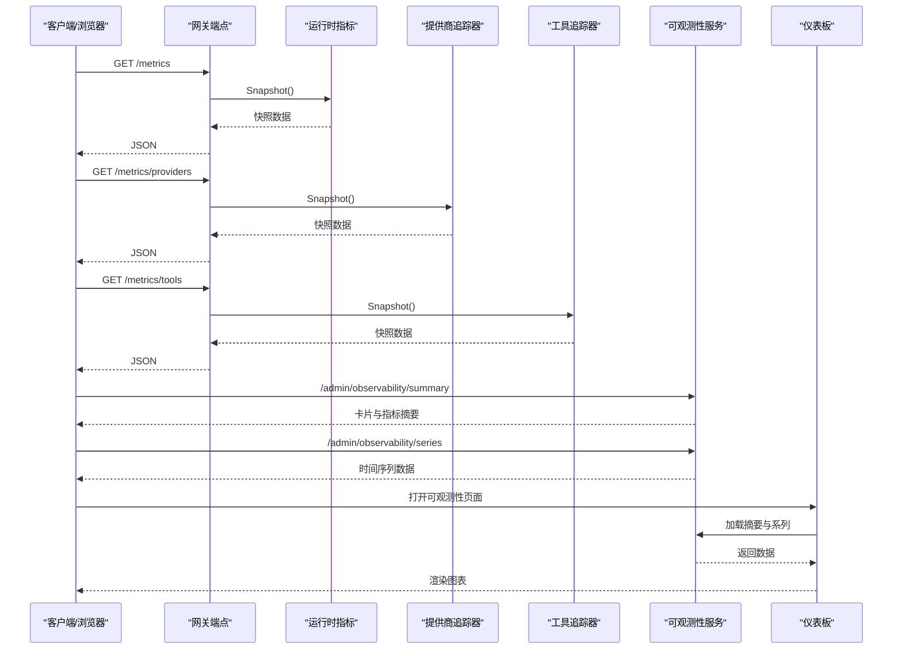
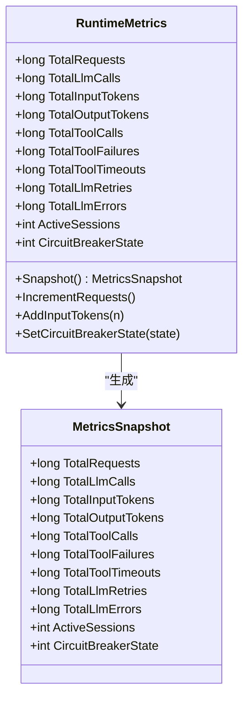
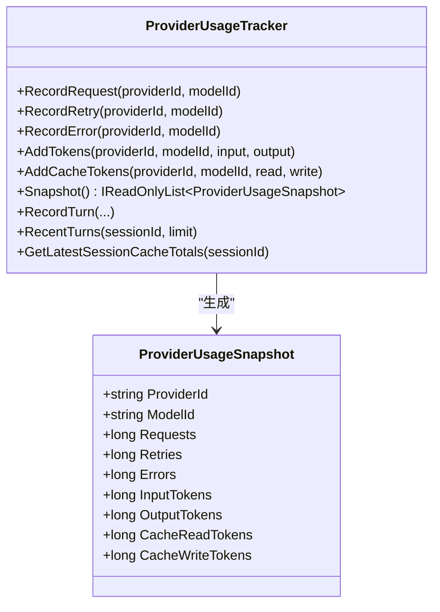
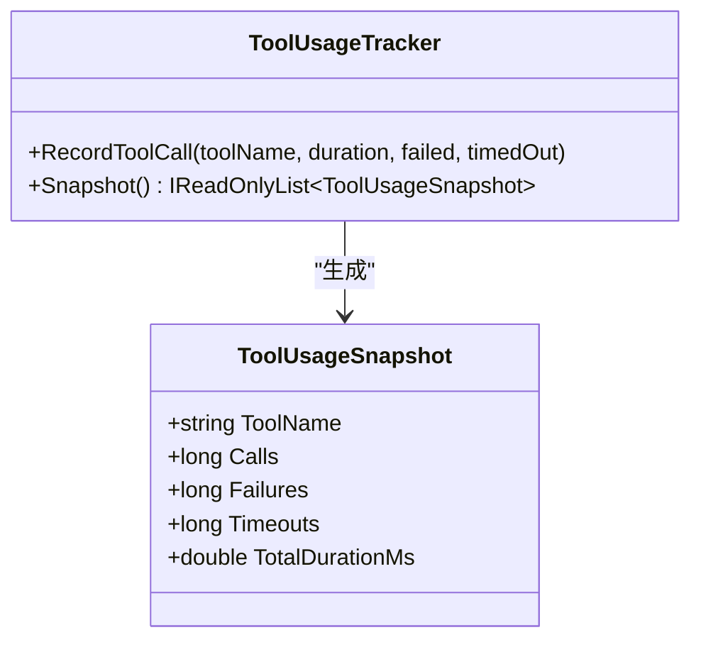
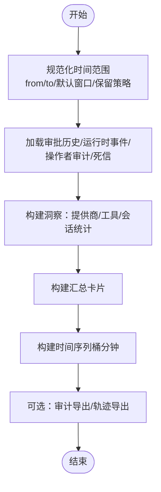
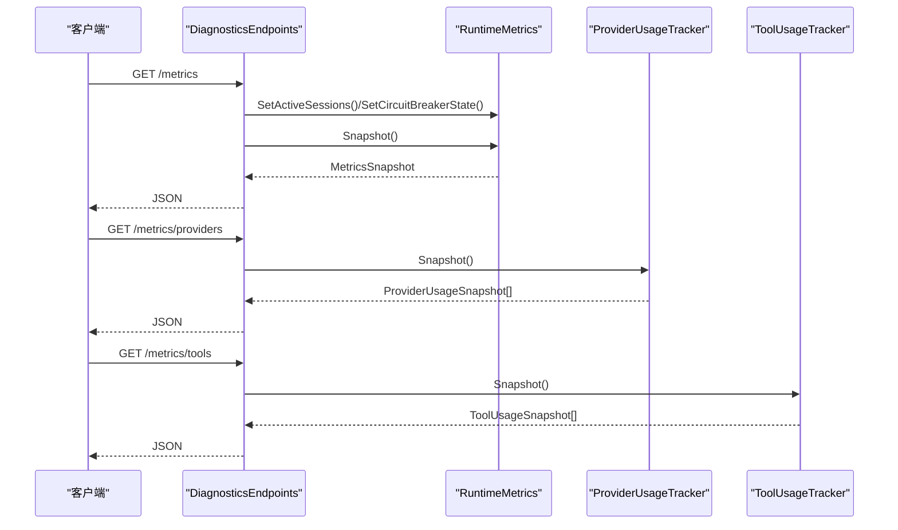
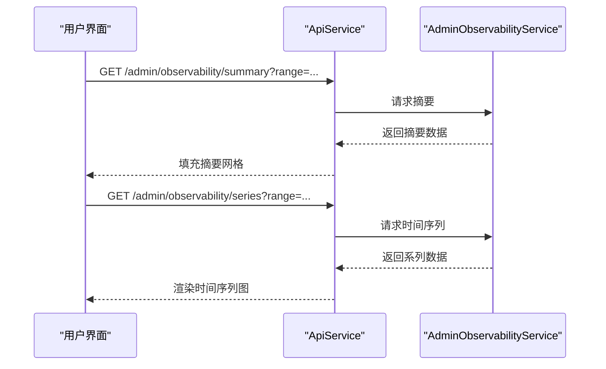
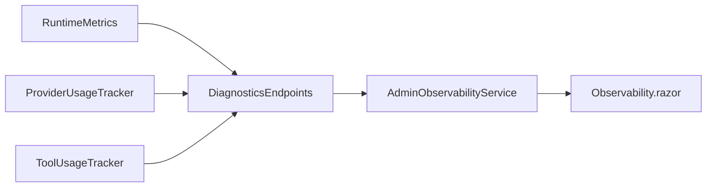

# 性能指标

<cite>
**本文档引用的文件**
- [RuntimeMetrics.cs](file://src/OpenClaw.Core/Observability/RuntimeMetrics.cs)
- [ProviderUsageTracker.cs](file://src/OpenClaw.Core/Observability/ProviderUsageTracker.cs)
- [ToolUsageTracker.cs](file://src/OpenClaw.Core/Observability/ToolUsageTracker.cs)
- [AdminObservabilityService.cs](file://src/OpenClaw.Gateway/AdminObservabilityService.cs)
- [DiagnosticsEndpoints.cs](file://src/OpenClaw.Gateway/Endpoints/DiagnosticsEndpoints.cs)
- [Observability.razor](file://src/OpenClaw.Dashboard/Pages/Observability.razor)
- [ObservabilityTests.cs](file://src/OpenClaw.Tests/ObservabilityTests.cs)
- [Program.cs](file://src/OpenClaw.Cli/Program.cs)
</cite>

## 目录
1. [简介](#简介)
2. [项目结构](#项目结构)
3. [核心组件](#核心组件)
4. [架构总览](#架构总览)
5. [详细组件分析](#详细组件分析)
6. [依赖关系分析](#依赖关系分析)
7. [性能考量](#性能考量)
8. [故障排查指南](#故障排查指南)
9. [结论](#结论)
10. [附录](#附录)

## 简介
本技术文档围绕性能指标系统进行深入解析，覆盖运行时指标采集机制、工具使用统计与提供商使用跟踪，明确指标定义、采集频率与存储策略，并提供性能基准测试、瓶颈识别与优化建议。同时，说明指标可视化、阈值设置与告警配置方法，给出指标查询语法、聚合函数与时间序列分析思路，并提供自定义指标开发指南、指标导出配置与监控仪表板设置。

## 项目结构
性能指标系统主要分布在以下模块：
- 核心观测（OpenClaw.Core）：运行时指标、提供商与工具使用追踪器
- 网关（OpenClaw.Gateway）：可观测性服务与诊断端点
- 仪表板（OpenClaw.Dashboard）：前端可视化页面
- CLI（OpenClaw.Cli）：命令行输出示例
- 测试（OpenClaw.Tests）：指标行为验证

```mermaid
graph TB
subgraph "核心观测(Core)"
RM["RuntimeMetrics<br/>运行时指标"]
PUT["ProviderUsageTracker<br/>提供商使用追踪"]
TUT["ToolUsageTracker<br/>工具使用追踪"]
end
subgraph "网关(Gateway)"
AOS["AdminObservabilityService<br/>可观测性服务"]
DE["DiagnosticsEndpoints<br/>诊断端点"]
end
subgraph "仪表板(Dashboard)"
OBS["Observability.razor<br/>可观测性页面"]
end
subgraph "CLI"
CLI["Program.cs<br/>命令行输出示例"]
end
RM --> DE
PUT --> DE
TUT --> DE
AOS --> OBS
DE --> OBS
CLI --> OBS
```

图表来源
- [RuntimeMetrics.cs:10-311](file://src/OpenClaw.Core/Observability/RuntimeMetrics.cs#L10-L311)
- [ProviderUsageTracker.cs:7-176](file://src/OpenClaw.Core/Observability/ProviderUsageTracker.cs#L7-L176)
- [ToolUsageTracker.cs:5-59](file://src/OpenClaw.Core/Observability/ToolUsageTracker.cs#L5-L59)
- [AdminObservabilityService.cs:16-1124](file://src/OpenClaw.Gateway/AdminObservabilityService.cs#L16-L1124)
- [DiagnosticsEndpoints.cs:11-194](file://src/OpenClaw.Gateway/Endpoints/DiagnosticsEndpoints.cs#L11-L194)
- [Observability.razor:1-599](file://src/OpenClaw.Dashboard/Pages/Observability.razor#L1-L599)
- [Program.cs:1822-1853](file://src/OpenClaw.Cli/Program.cs#L1822-L1853)

章节来源
- [RuntimeMetrics.cs:10-311](file://src/OpenClaw.Core/Observability/RuntimeMetrics.cs#L10-L311)
- [ProviderUsageTracker.cs:7-176](file://src/OpenClaw.Core/Observability/ProviderUsageTracker.cs#L7-L176)
- [ToolUsageTracker.cs:5-59](file://src/OpenClaw.Core/Observability/ToolUsageTracker.cs#L5-L59)
- [AdminObservabilityService.cs:16-1124](file://src/OpenClaw.Gateway/AdminObservabilityService.cs#L16-L1124)
- [DiagnosticsEndpoints.cs:11-194](file://src/OpenClaw.Gateway/Endpoints/DiagnosticsEndpoints.cs#L11-L194)
- [Observability.razor:1-599](file://src/OpenClaw.Dashboard/Pages/Observability.razor#L1-L599)
- [Program.cs:1822-1853](file://src/OpenClaw.Cli/Program.cs#L1822-L1853)

## 核心组件
- 运行时指标（RuntimeMetrics）
  - 提供锁无竞争的计数器与仪表盘数值，支持快照序列化
  - 包含请求总量、LLM调用、令牌用量、工具调用、会话与沙箱状态等
- 提供商使用追踪（ProviderUsageTracker）
  - 基于并发字典记录提供商/模型维度的请求、重试、错误与令牌用量
  - 支持最近回合明细与缓存命中统计
- 工具使用追踪（ToolUsageTracker）
  - 记录工具调用次数、失败与超时，累计耗时（双精度位模式）
- 可观测性服务（AdminObservabilityService）
  - 构建洞察、汇总卡片与时序系列，支持审计导出与轨迹导出
- 诊断端点（DiagnosticsEndpoints）
  - 暴露健康检查、指标快照、提供商/工具使用统计与内存保留状态
- 仪表板页面（Observability.razor）
  - 展示指标摘要网格与时间序列图，支持范围切换与导出

章节来源
- [RuntimeMetrics.cs:10-311](file://src/OpenClaw.Core/Observability/RuntimeMetrics.cs#L10-L311)
- [ProviderUsageTracker.cs:7-176](file://src/OpenClaw.Core/Observability/ProviderUsageTracker.cs#L7-L176)
- [ToolUsageTracker.cs:5-59](file://src/OpenClaw.Core/Observability/ToolUsageTracker.cs#L5-L59)
- [AdminObservabilityService.cs:55-227](file://src/OpenClaw.Gateway/AdminObservabilityService.cs#L55-L227)
- [DiagnosticsEndpoints.cs:68-104](file://src/OpenClaw.Gateway/Endpoints/DiagnosticsEndpoints.cs#L68-L104)
- [Observability.razor:178-280](file://src/OpenClaw.Dashboard/Pages/Observability.razor#L178-L280)

## 架构总览
性能指标系统采用“采集-聚合-暴露-可视化的分层架构”：
- 采集层：在运行时对请求、LLM调用、工具调用、提供商使用与内存保留等事件进行原子计数
- 聚合层：由可观测性服务按时间桶聚合，生成卡片与时间序列
- 暴露层：通过诊断端点与仪表板页面提供JSON与可视化
- 存储层：部分历史事件以JSONL文件形式持久化，支持审计导出



图表来源
- [DiagnosticsEndpoints.cs:68-104](file://src/OpenClaw.Gateway/Endpoints/DiagnosticsEndpoints.cs#L68-L104)
- [AdminObservabilityService.cs:117-227](file://src/OpenClaw.Gateway/AdminObservabilityService.cs#L117-L227)
- [Observability.razor:190-280](file://src/OpenClaw.Dashboard/Pages/Observability.razor#L190-L280)

## 详细组件分析

### 运行时指标（RuntimeMetrics）
- 数据结构
  - 计数器：请求、LLM调用、令牌用量、工具调用、失败与超时、重试与错误、会话与插件桥状态、进程与沙箱租约、保留策略执行、缓存与脉冲状态等
  - 仪表盘：活动会话数、熔断器状态、保留任务状态等
- 并发模型
  - 使用原子操作实现无锁计数，保证高并发下的正确性
- 快照
  - 提供不可变快照用于序列化与对外暴露



图表来源
- [RuntimeMetrics.cs:10-311](file://src/OpenClaw.Core/Observability/RuntimeMetrics.cs#L10-L311)

章节来源
- [RuntimeMetrics.cs:10-311](file://src/OpenClaw.Core/Observability/RuntimeMetrics.cs#L10-L311)
- [ObservabilityTests.cs:105-206](file://src/OpenClaw.Tests/ObservabilityTests.cs#L105-L206)

### 提供商使用追踪（ProviderUsageTracker）
- 功能
  - 按提供商/模型维度统计请求、重试、错误与输入/输出/缓存令牌用量
  - 维护最近回合明细队列，支持按会话检索与最新缓存统计
- 并发模型
  - 使用并发字典与原子加法，保障多线程安全
- 输出
  - 快照列表，按提供商与模型排序



图表来源
- [ProviderUsageTracker.cs:7-176](file://src/OpenClaw.Core/Observability/ProviderUsageTracker.cs#L7-L176)

章节来源
- [ProviderUsageTracker.cs:7-176](file://src/OpenClaw.Core/Observability/ProviderUsageTracker.cs#L7-L176)
- [ObservabilityTests.cs:236-252](file://src/OpenClaw.Tests/ObservabilityTests.cs#L236-L252)

### 工具使用追踪（ToolUsageTracker）
- 功能
  - 记录工具调用次数、失败与超时，并累计耗时（双精度位模式）
- 并发模型
  - 使用原子操作与CAS循环确保累计耗时的线程安全
- 输出
  - 快照列表，按调用次数降序排列



图表来源
- [ToolUsageTracker.cs:5-59](file://src/OpenClaw.Core/Observability/ToolUsageTracker.cs#L5-L59)

章节来源
- [ToolUsageTracker.cs:5-59](file://src/OpenClaw.Core/Observability/ToolUsageTracker.cs#L5-L59)

### 可观测性服务（AdminObservabilityService）
- 能力
  - 构建运营洞察：提供商与工具使用统计、会话计数、估算成本
  - 生成汇总卡片：审批决策、自动化失败、提供商错误、死信、通道漂移、操作者活动
  - 生成时间序列：按时间桶聚合指标，支持范围与桶大小配置
  - 审计导出：打包导出运营审计、运行时事件、审批历史、提供商使用、路由健康、死信与会话元数据
- 数据来源
  - 运行时指标、提供商追踪器、工具追踪器、会话管理器、通道就绪评估、自动化服务、证据与治理记录



图表来源
- [AdminObservabilityService.cs:55-227](file://src/OpenClaw.Gateway/AdminObservabilityService.cs#L55-L227)

章节来源
- [AdminObservabilityService.cs:55-227](file://src/OpenClaw.Gateway/AdminObservabilityService.cs#L55-L227)

### 诊断端点（DiagnosticsEndpoints）
- 暴露的指标接口
  - GET /metrics：运行时指标快照（含活动会话与熔断器状态）
  - GET /metrics/providers：提供商使用快照
  - GET /metrics/tools：工具使用快照
  - GET /admin/audit/tools：工具审计日志最近条目
- 权限控制
  - 需要操作员授权，部分端点要求CSRF保护



图表来源
- [DiagnosticsEndpoints.cs:68-104](file://src/OpenClaw.Gateway/Endpoints/DiagnosticsEndpoints.cs#L68-L104)

章节来源
- [DiagnosticsEndpoints.cs:68-104](file://src/OpenClaw.Gateway/Endpoints/DiagnosticsEndpoints.cs#L68-L104)

### 仪表板页面（Observability.razor）
- 功能
  - 指标摘要网格：展示关键指标与趋势
  - 时间序列图：按时间范围渲染折线图
  - 导出：支持审计导出与轨迹导出
- 交互
  - 切换时间范围、刷新、下载文件



图表来源
- [Observability.razor:190-280](file://src/OpenClaw.Dashboard/Pages/Observability.razor#L190-L280)
- [AdminObservabilityService.cs:117-227](file://src/OpenClaw.Gateway/AdminObservabilityService.cs#L117-L227)

章节来源
- [Observability.razor:178-280](file://src/OpenClaw.Dashboard/Pages/Observability.razor#L178-L280)

## 依赖关系分析
- 组件耦合
  - 运行时指标与诊断端点强耦合：端点直接读取运行时指标并写入活动会话与熔断器状态
  - 可观测性服务依赖运行时指标、提供商追踪器、工具追踪器与会话管理器
  - 仪表板依赖可观测性服务提供的摘要与系列接口
- 外部依赖
  - JSON序列化上下文（CoreJsonContext）用于指标与审计数据的序列化
  - 文件系统用于审计导出与轨迹导出（JSONL）



图表来源
- [DiagnosticsEndpoints.cs:68-104](file://src/OpenClaw.Gateway/Endpoints/DiagnosticsEndpoints.cs#L68-L104)
- [AdminObservabilityService.cs:16-1124](file://src/OpenClaw.Gateway/AdminObservabilityService.cs#L16-L1124)
- [Observability.razor:1-599](file://src/OpenClaw.Dashboard/Pages/Observability.razor#L1-L599)

章节来源
- [DiagnosticsEndpoints.cs:68-104](file://src/OpenClaw.Gateway/Endpoints/DiagnosticsEndpoints.cs#L68-L104)
- [AdminObservabilityService.cs:16-1124](file://src/OpenClaw.Gateway/AdminObservabilityService.cs#L16-L1124)

## 性能考量
- 并发与原子性
  - 运行时指标与工具追踪使用原子操作，避免锁竞争，适合高并发场景
- 内存与分配
  - 快照采用结构体以减少堆分配；工具累计耗时使用位模式避免浮点累加误差
- I/O与导出
  - 审计导出与轨迹导出为压缩包，注意磁盘空间与网络带宽
- 时间序列聚合
  - 时间桶大小影响序列长度与图表渲染性能，建议根据监控粒度选择合适桶大小

## 故障排查指南
- 指标不更新
  - 检查诊断端点是否返回200，确认运行时指标是否被设置（活动会话与熔断器状态）
- 指标异常
  - 使用单元测试验证默认值、增量与快照一致性
- 导出失败
  - 检查导出范围是否超出保留期，确认文件路径与权限
- 仪表板空白
  - 检查API响应格式与网络连接，确认时间范围与系列数据解析

章节来源
- [ObservabilityTests.cs:105-233](file://src/OpenClaw.Tests/ObservabilityTests.cs#L105-L233)
- [AdminObservabilityService.cs:989-1020](file://src/OpenClaw.Gateway/AdminObservabilityService.cs#L989-L1020)

## 结论
该性能指标系统通过轻量级原子计数与快照机制，在高并发下提供稳定可靠的运行时观测能力。结合可观测性服务的时间序列聚合与仪表板可视化，能够快速定位瓶颈并指导优化。建议持续完善阈值与告警策略，扩展自定义指标与导出能力，以满足生产环境的深度运维需求。

## 附录

### 指标定义与含义
- 运行时指标（节选）
  - 请求总量、LLM调用、令牌用量、工具调用、失败与超时、重试与错误、会话与插件桥状态、进程与沙箱租约、保留策略执行、缓存与脉冲状态
- 提供商使用
  - 请求、重试、错误、输入/输出/缓存令牌用量
- 工具使用
  - 调用次数、失败、超时、累计耗时

章节来源
- [RuntimeMetrics.cs:12-127](file://src/OpenClaw.Core/Observability/RuntimeMetrics.cs#L12-L127)
- [ProviderUsageTracker.cs:13-38](file://src/OpenClaw.Core/Observability/ProviderUsageTracker.cs#L13-L38)
- [ToolUsageTracker.cs:9-26](file://src/OpenClaw.Core/Observability/ToolUsageTracker.cs#L9-L26)

### 数据采集频率与存储策略
- 采集频率
  - 实时：在请求处理过程中即时递增计数器
  - 每次健康检查：更新活动会话与熔断器状态
- 存储策略
  - 指标快照：内存中快照，JSON序列化后短期暴露
  - 历史事件：JSONL文件持久化，支持审计导出与轨迹导出

章节来源
- [DiagnosticsEndpoints.cs:73-75](file://src/OpenClaw.Gateway/Endpoints/DiagnosticsEndpoints.cs#L73-L75)
- [AdminObservabilityService.cs:229-307](file://src/OpenClaw.Gateway/AdminObservabilityService.cs#L229-L307)

### 性能基准测试与优化建议
- 基准测试
  - 使用并发任务对计数器进行大量递增，验证原子性与正确性
- 优化建议
  - 控制时间序列桶大小，避免过密导致渲染压力
  - 对工具耗时累计使用位模式，减少浮点误差
  - 合理设置保留期与导出范围，平衡存储与合规需求

章节来源
- [ObservabilityTests.cs:209-233](file://src/OpenClaw.Tests/ObservabilityTests.cs#L209-L233)
- [ToolUsageTracker.cs:16-25](file://src/OpenClaw.Core/Observability/ToolUsageTracker.cs#L16-L25)

### 指标可视化、阈值与告警
- 可视化
  - 仪表板摘要网格与时间序列图，支持范围切换与导出
- 阈值与告警
  - 建议基于时间序列设置阈值（如错误率、延迟、吞吐），结合熔断器与通道就绪状态触发告警

章节来源
- [Observability.razor:178-280](file://src/OpenClaw.Dashboard/Pages/Observability.razor#L178-L280)
- [AdminObservabilityService.cs:137-167](file://src/OpenClaw.Gateway/AdminObservabilityService.cs#L137-L167)

### 指标查询语法、聚合与时间序列分析
- 查询语法
  - GET /metrics：运行时指标快照
  - GET /metrics/providers：提供商使用快照
  - GET /metrics/tools：工具使用快照
  - GET /admin/observability/summary：摘要卡片
  - GET /admin/observability/series：时间序列（支持范围与桶大小）
- 聚合函数
  - 求和：提供商/工具使用统计
  - 分组：按通道、状态、动作类型等维度聚合
  - 平均：工具平均耗时（调用次数非零时）
- 时间序列分析
  - 按桶分钟聚合错误、重试、会话数、通道漂移等指标

章节来源
- [DiagnosticsEndpoints.cs:68-104](file://src/OpenClaw.Gateway/Endpoints/DiagnosticsEndpoints.cs#L68-L104)
- [AdminObservabilityService.cs:170-227](file://src/OpenClaw.Gateway/AdminObservabilityService.cs#L170-L227)

### 自定义指标开发指南
- 新增计数器
  - 在运行时指标类中添加字段与原子操作方法
- 快照映射
  - 在快照结构体中添加对应字段
- 暴露端点
  - 在诊断端点中新增GET接口，返回新快照
- 可视化集成
  - 在仪表板页面中添加摘要与系列渲染逻辑

章节来源
- [RuntimeMetrics.cs:129-187](file://src/OpenClaw.Core/Observability/RuntimeMetrics.cs#L129-L187)
- [DiagnosticsEndpoints.cs:68-76](file://src/OpenClaw.Gateway/Endpoints/DiagnosticsEndpoints.cs#L68-L76)

### 指标导出配置与监控仪表板设置
- 导出配置
  - 审计导出：包含运营审计、运行时事件、审批历史、提供商使用、路由健康、死信与会话元数据
  - 轨迹导出：按会话或时间范围导出消息、工具调用与结果、证据与治理记录
- 仪表板设置
  - 设置时间范围与刷新策略，启用导出按钮，配置语言与主题

章节来源
- [AdminObservabilityService.cs:229-380](file://src/OpenClaw.Gateway/AdminObservabilityService.cs#L229-L380)
- [Observability.razor:178-280](file://src/OpenClaw.Dashboard/Pages/Observability.razor#L178-L280)
- [Program.cs:1822-1853](file://src/OpenClaw.Cli/Program.cs#L1822-L1853)