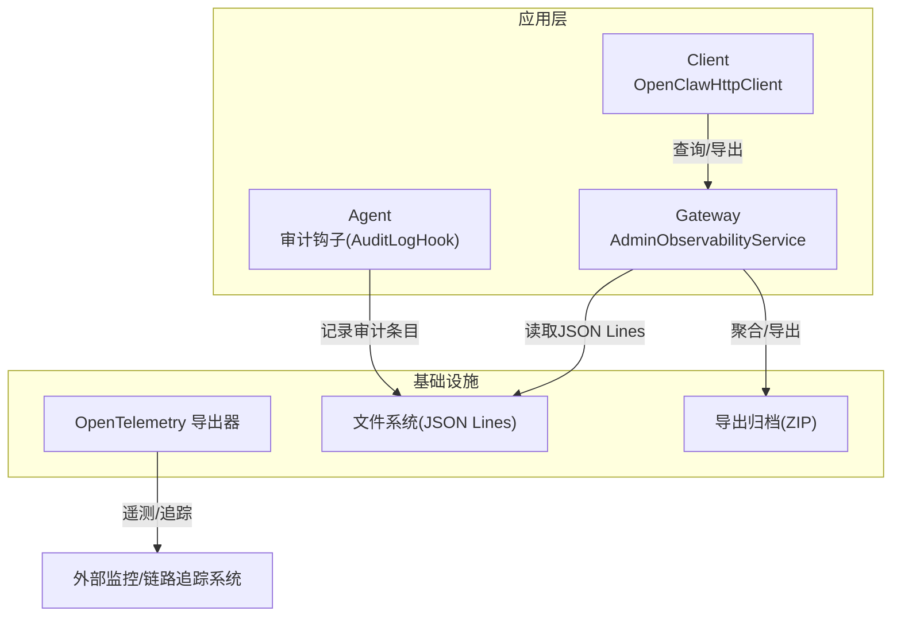
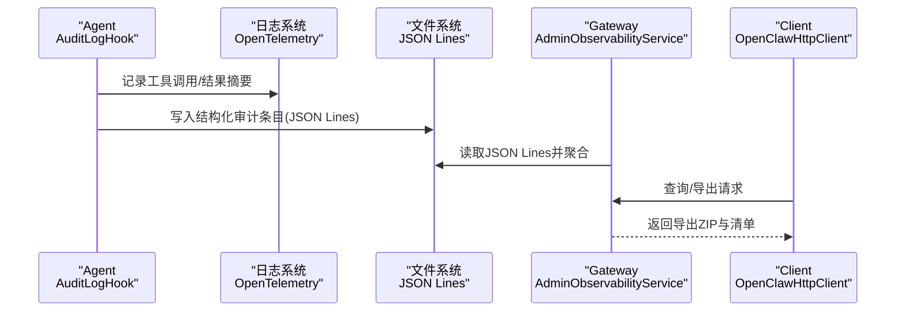
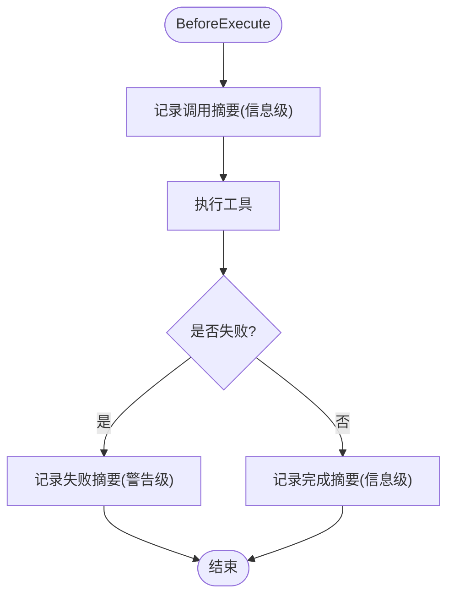
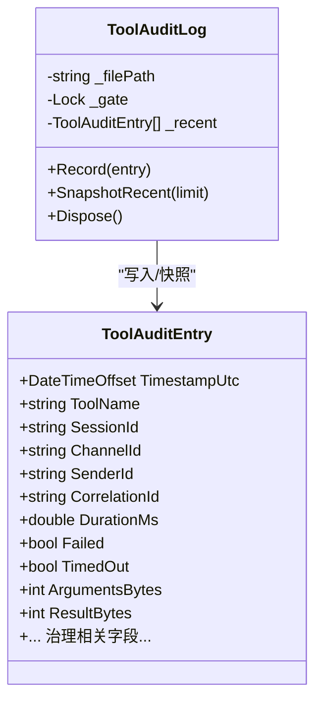
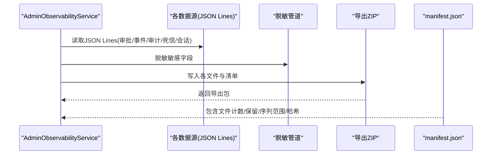
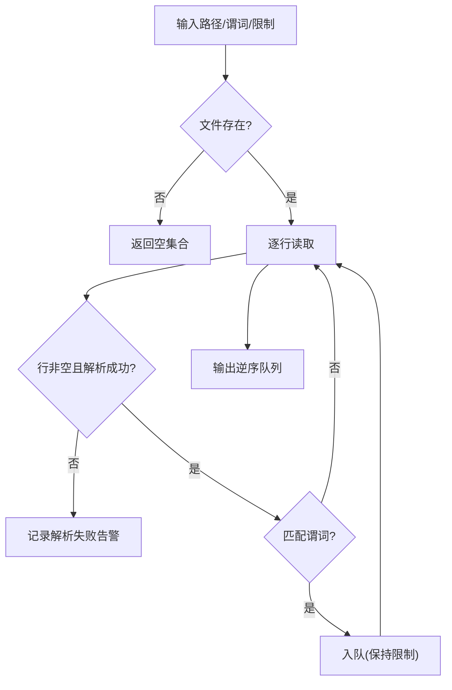
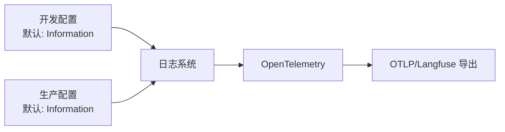
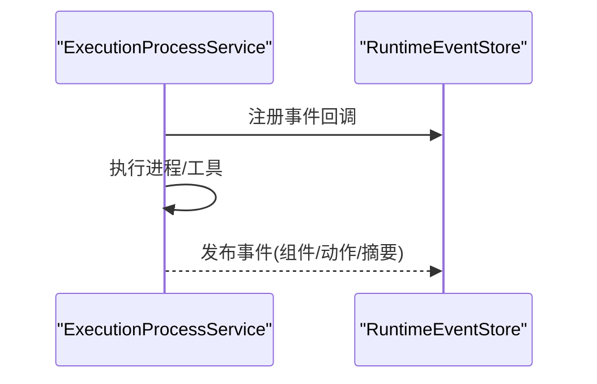
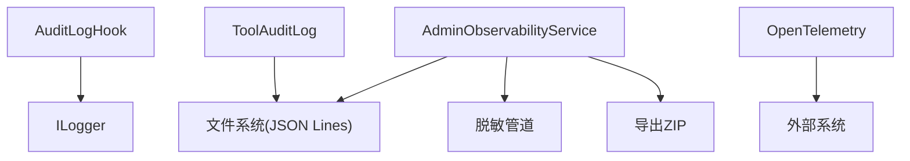

# 日志记录

<cite>
**本文引用的文件**   
- [AuditLogHook.cs](file://src/OpenClaw.Agent/AuditLogHook.cs)
- [ToolAuditLog.cs](file://src/OpenClaw.Core/Observability/ToolAuditLog.cs)
- [Extensions.cs](file://Kingcrab.ServiceDefaults/Extensions.cs)
- [appsettings.Development.json](file://Kingcrab.AppHost/appsettings.Development.json)
- [appsettings.json](file://Kingcrab.AppHost/appsettings.json)
- [appsettings.Production.json](file://src/OpenClaw.Gateway/appsettings.Production.json)
- [AdminObservabilityService.cs](file://src/OpenClaw.Gateway/AdminObservabilityService.cs)
- [JsonlQueryBuffer.cs](file://src/OpenClaw.Gateway/JsonlQueryBuffer.cs)
- [OperatorGovernanceModels.cs](file://src/OpenClaw.Core/Models/OperatorGovernanceModels.cs)
- [GatewayAdminEndpointTests.cs](file://src/OpenClaw.Tests/GatewayAdminEndpointTests.cs)
- [OpenClawHttpClient.cs](file://src/OpenClaw.Client/OpenClawHttpClient.cs)
- [ExecutionProcessService.cs](file://src/OpenClaw.Agent/Execution/ExecutionProcessService.cs)
</cite>

## 目录
1. [简介](#简介)
2. [项目结构](#项目结构)
3. [核心组件](#核心组件)
4. [架构总览](#架构总览)
5. [详细组件分析](#详细组件分析)
6. [依赖关系分析](#依赖关系分析)
7. [性能考量](#性能考量)
8. [故障排查指南](#故障排查指南)
9. [结论](#结论)
10. [附录](#附录)

## 简介
本技术文档聚焦于系统的日志记录体系，涵盖日志级别分类、结构化日志格式、日志轮转与导出策略，以及审计日志、工具调用日志、系统事件日志的生成与消费。文档还阐述了日志聚合、搜索与过滤规则，日志导出与外部系统集成方式，合规性与数据保留要求，并给出配置选项、性能影响与存储优化建议，以及日志分析工具使用、错误追踪与调试技巧。

## 项目结构
日志相关能力由多处模块协同实现：
- 应用默认日志与遥测：通过服务默认扩展启用 OpenTelemetry 日志、指标与追踪，并支持 OTLP/Langfuse 导出。
- 审计日志钩子：在工具执行前后记录审计条目，用于合规与审计。
- 结构化 JSON Lines 审计日志：持久化工具调用审计，避免敏感载荷泄露。
- 运行时事件与运营可观测性：记录系统事件、审批决策、自动化运行等，支持聚合与导出。
- 配置与环境：开发/生产配置定义日志级别与行为差异。
- 客户端与测试：提供查询与导出接口，验证导出文件清单与内容。

**图表来源**
- [Extensions.cs:49-82](file://Kingcrab.ServiceDefaults/Extensions.cs#L49-L82)
- [AuditLogHook.cs:10-63](file://src/OpenClaw.Agent/AuditLogHook.cs#L10-L63)
- [ToolAuditLog.cs:39-114](file://src/OpenClaw.Core/Observability/ToolAuditLog.cs#L39-L114)
- [AdminObservabilityService.cs:16-53](file://src/OpenClaw.Gateway/AdminObservabilityService.cs#L16-L53)

**章节来源**
- [Extensions.cs:49-82](file://Kingcrab.ServiceDefaults/Extensions.cs#L49-L82)
- [appsettings.Development.json:1-8](file://Kingcrab.AppHost/appsettings.Development.json#L1-L8)
- [appsettings.json:1-9](file://Kingcrab.AppHost/appsettings.json#L1-L9)
- [appsettings.Production.json:56-63](file://src/OpenClaw.Gateway/appsettings.Production.json#L56-L63)

## 核心组件
- 审计钩子（AuditLogHook）：在工具执行前记录调用摘要，在失败或成功后记录结果摘要，便于快速审计。
- 工具审计日志（ToolAuditLog）：线程安全的 JSON Lines 写入器，记录结构化审计条目，避免直接写入原始参数与结果，仅记录字节数与治理字段。
- 观测性服务（AdminObservabilityService）：聚合审批历史、运行时事件、操作员审计、死信队列、自动化运行等，支持时间序列聚合与导出清单生成。
- JSON Lines 查询缓冲（JsonlQueryBuffer）：按条件从 JSON Lines 文件中读取最新 N 条记录，支持解析失败告警。
- 配置与环境（appsettings）：定义日志级别、遥测导出目标（OTLP/Langfuse），以及生产环境下的安全与性能约束。
- 客户端与测试（OpenClawHttpClient、GatewayAdminEndpointTests）：提供查询与导出接口，验证导出文件清单与内容。

**章节来源**
- [AuditLogHook.cs:10-63](file://src/OpenClaw.Agent/AuditLogHook.cs#L10-L63)
- [ToolAuditLog.cs:39-114](file://src/OpenClaw.Core/Observability/ToolAuditLog.cs#L39-L114)
- [AdminObservabilityService.cs:16-53](file://src/OpenClaw.Gateway/AdminObservabilityService.cs#L16-L53)
- [JsonlQueryBuffer.cs:7-50](file://src/OpenClaw.Gateway/JsonlQueryBuffer.cs#L7-L50)
- [appsettings.Production.json:56-63](file://src/OpenClaw.Gateway/appsettings.Production.json#L56-L63)
- [OpenClawHttpClient.cs:110, 119, 511, 821, 964:110-119](file://src/OpenClaw.Client/OpenClawHttpClient.cs#L110-L119)
- [GatewayAdminEndpointTests.cs:1265-1301](file://src/OpenClaw.Tests/GatewayAdminEndpointTests.cs#L1265-L1301)

## 架构总览
系统采用“钩子记录 + 结构化持久化 + 观测性聚合 + 可选遥测导出”的架构。审计钩子负责在 Agent 层即时记录；ToolAuditLog 将审计条目以 JSON Lines 形式落盘；AdminObservabilityService 聚合多源数据并生成导出清单；客户端可查询实时事件与导出包；遥测通过 OpenTelemetry 统一采集并可导出至外部系统。

**图表来源**
- [AuditLogHook.cs:17-61](file://src/OpenClaw.Agent/AuditLogHook.cs#L17-L61)
- [ToolAuditLog.cs:72-95](file://src/OpenClaw.Core/Observability/ToolAuditLog.cs#L72-L95)
- [AdminObservabilityService.cs:117-168](file://src/OpenClaw.Gateway/AdminObservabilityService.cs#L117-L168)
- [OpenClawHttpClient.cs:511, 821, 964:511-512](file://src/OpenClaw.Client/OpenClawHttpClient.cs#L511-L512)

## 详细组件分析

### 审计钩子（AuditLogHook）
- 功能：在工具执行前后记录摘要信息，包括会话、通道、发送者、参数长度、耗时与结果长度等，失败时使用警告级别。
- 日志级别：信息级（成功）、警告级（失败）。
- 适用场景：快速审计、合规留痕、问题定位。

**图表来源**
- [AuditLogHook.cs:17-61](file://src/OpenClaw.Agent/AuditLogHook.cs#L17-L61)

**章节来源**
- [AuditLogHook.cs:10-63](file://src/OpenClaw.Agent/AuditLogHook.cs#L10-L63)

### 工具审计日志（ToolAuditLog）
- 数据模型：ToolAuditEntry，包含时间戳、工具名、会话/通道/发送者标识、关联ID、耗时、失败/超时标记、治理字段、字节统计等。
- 持久化：线程安全追加写入 JSON Lines 文件，初始化时确保目录存在，异常时降级禁用文件写入。
- 性能：内存最近缓冲，避免频繁 IO；仅记录字节数，不写入原始载荷，降低敏感数据风险。
- 使用：提供快照方法获取最近条目，便于前端或内部服务展示。

**图表来源**
- [ToolAuditLog.cs:10-32](file://src/OpenClaw.Core/Observability/ToolAuditLog.cs#L10-L32)
- [ToolAuditLog.cs:39-114](file://src/OpenClaw.Core/Observability/ToolAuditLog.cs#L39-L114)

**章节来源**
- [ToolAuditLog.cs:39-114](file://src/OpenClaw.Core/Observability/ToolAuditLog.cs#L39-L114)

### 观测性服务与导出（AdminObservabilityService）
- 聚合维度：审批历史、运行时事件、操作员审计、死信队列、自动化运行、提供商路由与错误、通道就绪度、活动会话数等。
- 时间序列：按分钟桶聚合指标，支持跨维度分组与统计。
- 导出清单：生成包含文件名、条目计数、策略快照、保留天数、序列范围与哈希等元信息的清单。
- 合规：内置敏感信息正则与脱敏管道，导出 ZIP 包含 manifest.json 与多个 JSON Lines 文件。

**图表来源**
- [AdminObservabilityService.cs:117-168](file://src/OpenClaw.Gateway/AdminObservabilityService.cs#L117-L168)
- [AdminObservabilityService.cs:252-283](file://src/OpenClaw.Gateway/AdminObservabilityService.cs#L252-L283)
- [OperatorGovernanceModels.cs:435-449](file://src/OpenClaw.Core/Models/OperatorGovernanceModels.cs#L435-L449)

**章节来源**
- [AdminObservabilityService.cs:16-53](file://src/OpenClaw.Gateway/AdminObservabilityService.cs#L16-L53)
- [AdminObservabilityService.cs:117-168](file://src/OpenClaw.Gateway/AdminObservabilityService.cs#L117-L168)
- [AdminObservabilityService.cs:252-283](file://src/OpenClaw.Gateway/AdminObservabilityService.cs#L252-L283)
- [OperatorGovernanceModels.cs:435-449](file://src/OpenClaw.Core/Models/OperatorGovernanceModels.cs#L435-L449)

### JSON Lines 查询缓冲（JsonlQueryBuffer）
- 功能：从 JSON Lines 文件中按条件筛选并返回最新 N 条记录，逐行解析，解析失败记录告警日志。
- 适用：运行时事件、审计、死信等文件的增量查询与回溯。

**图表来源**
- [JsonlQueryBuffer.cs:7-50](file://src/OpenClaw.Gateway/JsonlQueryBuffer.cs#L7-L50)

**章节来源**
- [JsonlQueryBuffer.cs:7-50](file://src/OpenClaw.Gateway/JsonlQueryBuffer.cs#L7-L50)

### 遥测与日志级别（OpenTelemetry 与配置）
- OpenTelemetry：启用日志、指标与追踪，支持 OTLP 或 Langfuse 导出，过滤健康检查路径，包含作用域与格式化消息。
- 配置：开发与生产环境分别设置默认日志级别与特定组件级别，生产环境强调安全与性能约束。

**图表来源**
- [Extensions.cs:49-82](file://Kingcrab.ServiceDefaults/Extensions.cs#L49-L82)
- [appsettings.Development.json:1-8](file://Kingcrab.AppHost/appsettings.Development.json#L1-L8)
- [appsettings.json:1-9](file://Kingcrab.AppHost/appsettings.json#L1-L9)
- [appsettings.Production.json:56-63](file://src/OpenClaw.Gateway/appsettings.Production.json#L56-L63)

**章节来源**
- [Extensions.cs:49-82](file://Kingcrab.ServiceDefaults/Extensions.cs#L49-L82)
- [appsettings.Development.json:1-8](file://Kingcrab.AppHost/appsettings.Development.json#L1-L8)
- [appsettings.json:1-9](file://Kingcrab.AppHost/appsettings.json#L1-L9)
- [appsettings.Production.json:56-63](file://src/OpenClaw.Gateway/appsettings.Production.json#L56-L63)

### 运行时事件与系统事件日志
- 事件来源：执行后端、进程生命周期、外部 CLI 工具等，通过回调注入到运行时事件存储。
- 事件类型：如进程启动、输入写出、孤儿进程、退出码等，用于系统健康与排障。

**图表来源**
- [ExecutionProcessService.cs:289, 360, 417, 444, 470, 513:289-513](file://src/OpenClaw.Agent/Execution/ExecutionProcessService.cs#L289-L513)

**章节来源**
- [ExecutionProcessService.cs:289, 360, 417, 444, 470, 513:289-513](file://src/OpenClaw.Agent/Execution/ExecutionProcessService.cs#L289-L513)

## 依赖关系分析
- 组件耦合：
  - AuditLogHook 依赖 ILogger，轻量无状态，耦合度低。
  - ToolAuditLog 依赖文件系统与 JSON 序列化上下文，具备有限的容错与降级逻辑。
  - AdminObservabilityService 聚合多数据源，依赖脱敏管道与组织策略，导出依赖压缩与清单生成。
- 外部依赖：
  - OpenTelemetry 导出器（OTLP/Langfuse）。
  - JSON Lines 文件系统（审计、事件、死信等）。
- 潜在循环依赖：未见直接循环；服务聚合层通过接口与只读快照避免强耦合。

**图表来源**
- [AuditLogHook.cs:12](file://src/OpenClaw.Agent/AuditLogHook.cs#L12)
- [ToolAuditLog.cs:47-70](file://src/OpenClaw.Core/Observability/ToolAuditLog.cs#L47-L70)
- [AdminObservabilityService.cs:33-53](file://src/OpenClaw.Gateway/AdminObservabilityService.cs#L33-L53)
- [Extensions.cs:84-115](file://Kingcrab.ServiceDefaults/Extensions.cs#L84-L115)

**章节来源**
- [AuditLogHook.cs:12](file://src/OpenClaw.Agent/AuditLogHook.cs#L12)
- [ToolAuditLog.cs:47-70](file://src/OpenClaw.Core/Observability/ToolAuditLog.cs#L47-L70)
- [AdminObservabilityService.cs:33-53](file://src/OpenClaw.Gateway/AdminObservabilityService.cs#L33-L53)
- [Extensions.cs:84-115](file://Kingcrab.ServiceDefaults/Extensions.cs#L84-L115)

## 性能考量
- 日志级别与开销：生产配置默认信息级，避免过量 Debug/Warn；OTEL 包含作用域与格式化消息，适度开启以平衡可观测性与性能。
- JSON Lines 写入：ToolAuditLog 采用追加写入与目录预创建，异常时降级禁用文件写入，减少阻塞风险。
- 查询效率：JsonlQueryBuffer 逐行扫描并限制队列大小，适合增量查询；建议配合时间范围与谓词过滤。
- 导出体积：导出包包含多个文件与清单，注意磁盘空间与网络带宽；可通过缩短时间窗口与选择性包含治理数据控制体积。
- 追踪过滤：OTEL 过滤健康检查路径，减少无关追踪开销。

**章节来源**
- [appsettings.Production.json:56-63](file://src/OpenClaw.Gateway/appsettings.Production.json#L56-L63)
- [ToolAuditLog.cs:72-95](file://src/OpenClaw.Core/Observability/ToolAuditLog.cs#L72-L95)
- [JsonlQueryBuffer.cs:17-48](file://src/OpenClaw.Gateway/JsonlQueryBuffer.cs#L17-L48)
- [Extensions.cs:64-77](file://Kingcrab.ServiceDefaults/Extensions.cs#L64-L77)

## 故障排查指南
- 审计日志不可写：
  - 现象：文件路径不存在或权限不足导致初始化失败，写入时告警。
  - 排查：确认目录存在、权限正确；若异常，系统将降级禁用文件写入。
- JSON Lines 解析失败：
  - 现象：读取时出现解析异常，记录告警。
  - 排查：检查文件完整性与编码；确认 JSON Lines 行格式正确。
- 导出清单缺失文件：
  - 现象：导出 ZIP 中缺少某些文件。
  - 排查：核对时间窗口与包含项；确认对应数据源文件存在且可读。
- 遥测导出失败：
  - 现象：OTLP/Langfuse 导出失败。
  - 排查：检查端点、凭据与网络连通性；确认配置值清理后的有效性。

**章节来源**
- [ToolAuditLog.cs:54-67](file://src/OpenClaw.Core/Observability/ToolAuditLog.cs#L54-L67)
- [ToolAuditLog.cs:91-94](file://src/OpenClaw.Core/Observability/ToolAuditLog.cs#L91-L94)
- [JsonlQueryBuffer.cs:41-44](file://src/OpenClaw.Gateway/JsonlQueryBuffer.cs#L41-L44)
- [Extensions.cs:86-114](file://Kingcrab.ServiceDefaults/Extensions.cs#L86-L114)

## 结论
该日志记录体系通过钩子与结构化 JSON Lines 实现高合规性的审计与可观测性，结合 AdminObservabilityService 的聚合与导出能力，满足运营监控、合规审计与外部系统集成需求。配合 OpenTelemetry 的遥测导出与严格的生产配置，系统在保证性能的同时实现了全面的日志覆盖与可追溯性。

## 附录

### 日志级别分类与用途
- 默认：信息级（生产环境默认），用于一般运行状态与关键事件。
- 警告：失败或异常情况，便于快速定位。
- 错误：严重故障，需立即处理。
- 调试：开发阶段用于深入诊断（可通过配置提升）。

**章节来源**
- [appsettings.Development.json:3-6](file://Kingcrab.AppHost/appsettings.Development.json#L3-L6)
- [appsettings.Production.json:57-62](file://src/OpenClaw.Gateway/appsettings.Production.json#L57-L62)

### 结构化日志格式与字段
- 工具审计条目（ToolAuditEntry）：包含时间戳、工具名、会话/通道/发送者标识、关联ID、耗时、失败/超时标记、治理字段、字节统计等。
- 运行时事件：包含组件、动作、摘要、元数据等，支持脱敏。

**章节来源**
- [ToolAuditLog.cs:10-32](file://src/OpenClaw.Core/Observability/ToolAuditLog.cs#L10-L32)
- [ExecutionProcessService.cs:360, 417, 444, 470, 513:360-513](file://src/OpenClaw.Agent/Execution/ExecutionProcessService.cs#L360-L513)

### 日志轮转策略
- 当前实现：基于 JSON Lines 追加写入，未见内置轮转逻辑。
- 建议：结合外部日志收集与归档系统（如 logrotate、集中式日志平台）进行轮转与保留管理。

**章节来源**
- [ToolAuditLog.cs:72-95](file://src/OpenClaw.Core/Observability/ToolAuditLog.cs#L72-L95)

### 审计日志、工具调用日志与系统事件日志
- 审计日志：由 AuditLogHook 与 ToolAuditLog 共同构成，记录工具调用与结果摘要，避免敏感载荷。
- 工具调用日志：ToolAuditLog 的 JSON Lines 文件，供导出与分析。
- 系统事件日志：运行时事件（如进程生命周期）经 AdminObservabilityService 聚合，支持导出。

**章节来源**
- [AuditLogHook.cs:17-61](file://src/OpenClaw.Agent/AuditLogHook.cs#L17-L61)
- [ToolAuditLog.cs:72-95](file://src/OpenClaw.Core/Observability/ToolAuditLog.cs#L72-L95)
- [ExecutionProcessService.cs:360, 417, 444, 470, 513:360-513](file://src/OpenClaw.Agent/Execution/ExecutionProcessService.cs#L360-L513)

### 日志聚合、搜索与过滤规则
- 聚合：AdminObservabilityService 支持按分钟桶聚合指标，按审批、事件、审计、通道等维度分组。
- 搜索与过滤：JsonlQueryBuffer 提供谓词过滤与限制数量的查询；导出清单包含文件计数与序列范围，便于定位。

**章节来源**
- [AdminObservabilityService.cs:170-227](file://src/OpenClaw.Gateway/AdminObservabilityService.cs#L170-L227)
- [JsonlQueryBuffer.cs:9-49](file://src/OpenClaw.Gateway/JsonlQueryBuffer.cs#L9-L49)

### 日志导出、外部系统集成与合规
- 导出：AdminObservabilityService 生成包含 manifest.json 与多个 JSON Lines 文件的 ZIP 包，支持包含治理数据。
- 外部系统：通过 OTLP/Langfuse 导出遥测；客户端提供查询接口对接集成。
- 合规：内置敏感信息正则与脱敏管道，导出清单包含策略快照与保留天数。

**章节来源**
- [AdminObservabilityService.cs:252-283](file://src/OpenClaw.Gateway/AdminObservabilityService.cs#L252-L283)
- [Extensions.cs:86-114](file://Kingcrab.ServiceDefaults/Extensions.cs#L86-L114)
- [OpenClawHttpClient.cs:511, 821, 964:511-512](file://src/OpenClaw.Client/OpenClawHttpClient.cs#L511-L512)

### 日志配置选项与环境差异
- 开发：默认信息级，便于调试。
- 生产：默认信息级，强调安全与性能；限制工具集与插件启用，严格绑定地址与代理信任。

**章节来源**
- [appsettings.Development.json:1-8](file://Kingcrab.AppHost/appsettings.Development.json#L1-L8)
- [appsettings.json:1-9](file://Kingcrab.AppHost/appsettings.json#L1-L9)
- [appsettings.Production.json:3-54](file://src/OpenClaw.Gateway/appsettings.Production.json#L3-L54)

### 性能影响与存储优化
- 性能：合理设置日志级别与 OTLP 导出频率；避免过度 Debug；使用 JSON Lines 追加写入与目录预创建。
- 存储：导出前评估文件大小与保留策略；结合外部轮转与归档；控制导出时间窗口与包含项。

**章节来源**
- [ToolAuditLog.cs:54-67](file://src/OpenClaw.Core/Observability/ToolAuditLog.cs#L54-L67)
- [AdminObservabilityService.cs:252-283](file://src/OpenClaw.Gateway/AdminObservabilityService.cs#L252-L283)

### 日志分析工具使用、错误追踪与调试技巧
- 分析工具：结合导出的 JSON Lines 文件与清单，使用文本编辑器或脚本进行过滤与统计。
- 错误追踪：利用 OpenTelemetry 追踪与日志关联，定位请求链路中的异常节点。
- 调试技巧：在开发环境提升日志级别；使用客户端查询接口验证事件与审计数据；通过导出包进行离线分析。

**章节来源**
- [Extensions.cs:49-82](file://Kingcrab.ServiceDefaults/Extensions.cs#L49-L82)
- [OpenClawHttpClient.cs:511, 821, 964:511-512](file://src/OpenClaw.Client/OpenClawHttpClient.cs#L511-L512)
- [GatewayAdminEndpointTests.cs:1265-1301](file://src/OpenClaw.Tests/GatewayAdminEndpointTests.cs#L1265-L1301)