# 监控和可观测性

<cite>
**本文引用的文件**
- [Telemetry.cs](file://src/OpenClaw.Core/Observability/Telemetry.cs)
- [RuntimeMetrics.cs](file://src/OpenClaw.Core/Observability/RuntimeMetrics.cs)
- [ToolUsageTracker.cs](file://src/OpenClaw.Core/Observability/ToolUsageTracker.cs)
- [ProviderUsageTracker.cs](file://src/OpenClaw.Core/Observability/ProviderUsageTracker.cs)
- [ToolAuditLog.cs](file://src/OpenClaw.Core/Observability/ToolAuditLog.cs)
- [TurnContext.cs](file://src/OpenClaw.Core/Observability/TurnContext.cs)
- [AdminObservabilityService.cs](file://src/OpenClaw.Gateway/AdminObservabilityService.cs)
- [AuditLogHook.cs](file://src/OpenClaw.Agent/AuditLogHook.cs)
- [Extensions.cs](file://Kingcrab.ServiceDefaults/Extensions.cs)
- [HeartbeatService.cs](file://src/OpenClaw.Gateway/HeartbeatService.cs)
- [Observability.razor](file://src/OpenClaw.Dashboard/Pages/Observability.razor)
- [admin.html](file://src/OpenClaw.Gateway/wwwroot/admin.html)
- [OperatorApiModels.cs](file://src/OpenClaw.Core/Models/OperatorApiModels.cs)
- [Session.cs](file://src/OpenClaw.Core/Models/Session.cs)
</cite>

## 目录
1. [简介](#简介)
2. [项目结构](#项目结构)
3. [核心组件](#核心组件)
4. [架构总览](#架构总览)
5. [详细组件分析](#详细组件分析)
6. [依赖关系分析](#依赖关系分析)
7. [性能考量](#性能考量)
8. [故障排查指南](#故障排查指南)
9. [结论](#结论)
10. [附录](#附录)

## 简介
本文件面向监控与可观测性系统，聚焦于性能监控指标、日志审计、健康检查与告警、OpenTelemetry 集成、分布式追踪与指标采集、运行时指标与工具使用统计、会话分析、仪表板与趋势分析、最佳实践与性能调优、故障诊断方法以及工具集成与自定义指标开发。文档基于代码库中的实际实现进行说明，并提供可视化图示帮助理解。

## 项目结构
可观测性相关能力主要分布在以下模块：
- 核心观测层（OpenClaw.Core/Observability）：集中式 Telemetry、运行时指标、工具与供应商使用统计、审计日志、每轮次上下文等。
- 网关可观测服务（OpenClaw.Gateway/AdminObservabilityService）：聚合各类观测数据，构建摘要卡片、时间序列、审计导出与轨迹导出。
- 健康检查与 OpenTelemetry 扩展（Kingcrab.ServiceDefaults/Extensions.cs）：默认健康检查、OTLP 导出器配置（支持 Langfuse）。
- 心跳与告警（OpenClaw.Gateway/HeartbeatService）：自动化健康巡检任务模板与成本估算。
- 前端仪表板（OpenClaw.Dashboard/Pages/Observability.razor 与 OpenClaw.Gateway/wwwroot/admin.html）：观测数据展示与交互。
- 模型契约（OpenClaw.Core/Models）：观测数据模型、API 响应模型等。

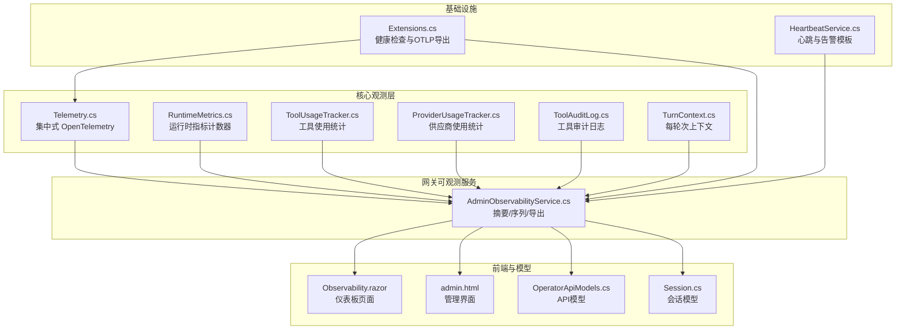

图表来源
- [Telemetry.cs:1-54](file://src/OpenClaw.Core/Observability/Telemetry.cs#L1-L54)
- [RuntimeMetrics.cs:1-312](file://src/OpenClaw.Core/Observability/RuntimeMetrics.cs#L1-L312)
- [ToolUsageTracker.cs:1-59](file://src/OpenClaw.Core/Observability/ToolUsageTracker.cs#L1-L59)
- [ProviderUsageTracker.cs:1-176](file://src/OpenClaw.Core/Observability/ProviderUsageTracker.cs#L1-L176)
- [ToolAuditLog.cs:1-125](file://src/OpenClaw.Core/Observability/ToolAuditLog.cs#L1-L125)
- [TurnContext.cs:1-76](file://src/OpenClaw.Core/Observability/TurnContext.cs#L1-L76)
- [AdminObservabilityService.cs:1-800](file://src/OpenClaw.Gateway/AdminObservabilityService.cs#L1-L800)
- [Extensions.cs:69-126](file://Kingcrab.ServiceDefaults/Extensions.cs#L69-L126)
- [HeartbeatService.cs:1-200](file://src/OpenClaw.Gateway/HeartbeatService.cs#L1-L200)
- [Observability.razor:87-240](file://src/OpenClaw.Dashboard/Pages/Observability.razor#L87-L240)
- [admin.html:1043-4283](file://src/OpenClaw.Gateway/wwwroot/admin.html#L1043-L4283)
- [OperatorApiModels.cs:763-769](file://src/OpenClaw.Core/Models/OperatorApiModels.cs#L763-L769)
- [Session.cs:972-996](file://src/OpenClaw.Core/Models/Session.cs#L972-L996)

章节来源
- [Telemetry.cs:1-54](file://src/OpenClaw.Core/Observability/Telemetry.cs#L1-L54)
- [Extensions.cs:69-126](file://Kingcrab.ServiceDefaults/Extensions.cs#L69-L126)

## 核心组件
- 集中式 Telemetry：提供 ActivitySource 与 Meter，注册工具执行时延直方图、速率限制超限计数器、待审批队列深度可观测性等。
- 运行时指标 RuntimeMetrics：无锁计数器与仪表盘可见的快照，覆盖请求、LLM 调用、令牌用量、工具调用、会话缓存命中、保留进程、脉冲运行等。
- 工具使用统计 ToolUsageTracker：按工具维度统计调用次数、失败次数、超时次数与总耗时，支持快照导出。
- 供应商使用统计 ProviderUsageTracker：按供应商/模型维度统计请求、重试、错误、输入/输出/缓存读写令牌，支持最近回合明细与会话缓存统计。
- 工具审计日志 ToolAuditLog：JSON Lines 审计记录，包含关键元信息与治理字段，支持最近缓冲快照与线程安全追加。
- 每轮次上下文 TurnContext：单请求关联 ID，汇总 LLM 与工具调用的并发度量，便于结构化日志与追踪。
- 网关可观测服务 AdminObservabilityService：聚合上述数据，生成摘要卡片、时间序列、审计导出包与轨迹导出，支持匿名化与证据/治理数据整合。
- 健康检查与 OTLP 导出 Extensions：默认健康检查、排除健康端点进入追踪、自动选择 OTLP 或 Langfuse 导出器。
- 前端仪表板：Blazor 页面与管理界面 HTML，提供观测数据加载、筛选与可视化。

章节来源
- [RuntimeMetrics.cs:1-312](file://src/OpenClaw.Core/Observability/RuntimeMetrics.cs#L1-L312)
- [ToolUsageTracker.cs:1-59](file://src/OpenClaw.Core/Observability/ToolUsageTracker.cs#L1-L59)
- [ProviderUsageTracker.cs:1-176](file://src/OpenClaw.Core/Observability/ProviderUsageTracker.cs#L1-L176)
- [ToolAuditLog.cs:1-125](file://src/OpenClaw.Core/Observability/ToolAuditLog.cs#L1-L125)
- [TurnContext.cs:1-76](file://src/OpenClaw.Core/Observability/TurnContext.cs#L1-L76)
- [AdminObservabilityService.cs:117-227](file://src/OpenClaw.Gateway/AdminObservabilityService.cs#L117-L227)
- [Extensions.cs:119-126](file://Kingcrab.ServiceDefaults/Extensions.cs#L119-L126)

## 架构总览
下图展示了从运行时到可观测服务再到前端仪表板的数据流与职责划分。

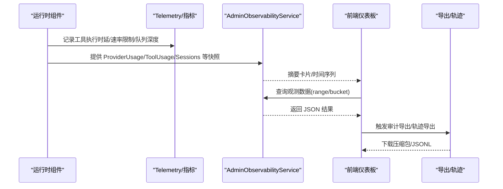

图表来源
- [Telemetry.cs:27-52](file://src/OpenClaw.Core/Observability/Telemetry.cs#L27-L52)
- [AdminObservabilityService.cs:117-227](file://src/OpenClaw.Gateway/AdminObservabilityService.cs#L117-L227)
- [Observability.razor:212-240](file://src/OpenClaw.Dashboard/Pages/Observability.razor#L212-L240)

## 详细组件分析

### 组件一：集中式 Telemetry 与指标
- ActivitySource 与 Meter：统一的服务名与版本标识，便于跨组件一致的追踪与指标命名。
- 工具执行时延直方图：以毫秒为单位，按工具名与成功状态打标，用于 P50/P95 时延分析。
- 速率限制超限计数器：按行为者类型与策略打标，用于识别限流热点。
- 待审批队列深度可观测性：通过可观察计数器暴露当前待审批数量，辅助容量规划。

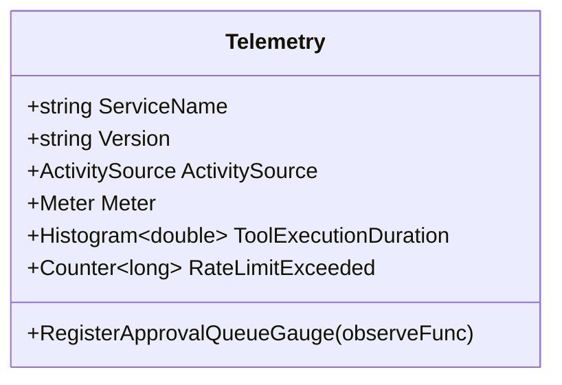

图表来源
- [Telemetry.cs:9-52](file://src/OpenClaw.Core/Observability/Telemetry.cs#L9-L52)

章节来源
- [Telemetry.cs:1-54](file://src/OpenClaw.Core/Observability/Telemetry.cs#L1-L54)

### 组件二：运行时指标 RuntimeMetrics
- 全部计数器采用 Interlocked/Volatile 实现无锁访问，保证高并发下的正确性与性能。
- 指标覆盖：请求总量、LLM 调用、令牌用量、工具调用/失败/超时、会话相关、进程生命周期、沙箱租约、保留清理、脉冲运行等。
- 快照结构：用于健康端点与外部系统消费，避免直接暴露内部原子变量。

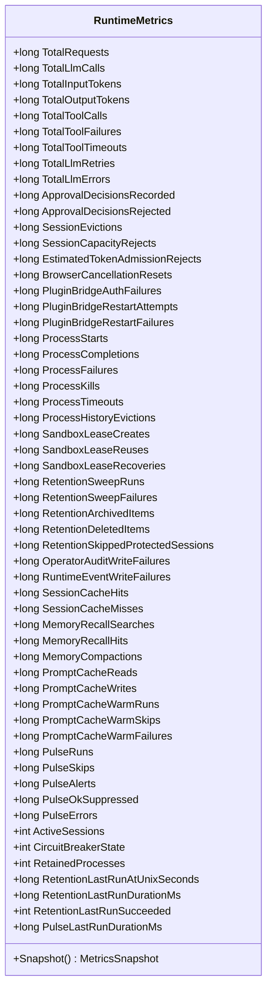

图表来源
- [RuntimeMetrics.cs:10-312](file://src/OpenClaw.Core/Observability/RuntimeMetrics.cs#L10-L312)

章节来源
- [RuntimeMetrics.cs:1-312](file://src/OpenClaw.Core/Observability/RuntimeMetrics.cs#L1-L312)

### 组件三：工具使用统计 ToolUsageTracker
- 按工具名聚合：调用次数、失败次数、超时次数、总耗时（双精度位模式存储以保证线程安全累加）。
- 快照排序：按调用次数降序，再按名称升序，便于快速定位“最活跃/失败最多”的工具。

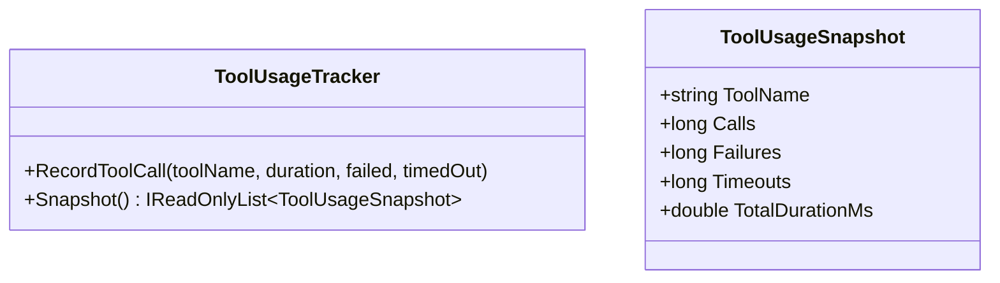

图表来源
- [ToolUsageTracker.cs:5-59](file://src/OpenClaw.Core/Observability/ToolUsageTracker.cs#L5-L59)

章节来源
- [ToolUsageTracker.cs:1-59](file://src/OpenClaw.Core/Observability/ToolUsageTracker.cs#L1-L59)

### 组件四：供应商使用统计 ProviderUsageTracker
- 按供应商/模型维度统计：请求、重试、错误、输入/输出/缓存读写令牌。
- 最近回合队列：固定容量，支持按会话过滤与最近 N 条查询；提供最新会话缓存读写总计。
- 快照排序：先按供应商后按模型，便于成本与用量分析。

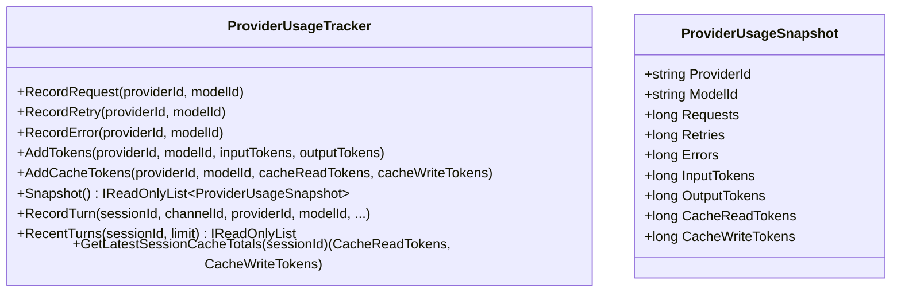

图表来源
- [ProviderUsageTracker.cs:7-176](file://src/OpenClaw.Core/Observability/ProviderUsageTracker.cs#L7-L176)

章节来源
- [ProviderUsageTracker.cs:1-176](file://src/OpenClaw.Core/Observability/ProviderUsageTracker.cs#L1-L176)

### 组件五：工具审计日志 ToolAuditLog
- JSON Lines 追加写入，线程安全，带最近缓冲快照。
- 默认不记录原始参数与结果，仅记录字节长度与治理评估字段，兼顾审计完整性与敏感信息保护。
- 支持初始化目录创建与异常降级处理。

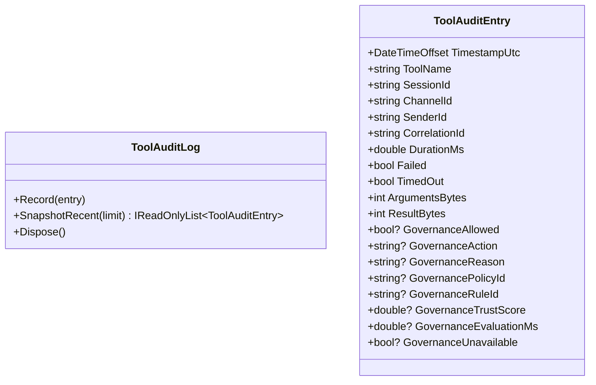

图表来源
- [ToolAuditLog.cs:10-125](file://src/OpenClaw.Core/Observability/ToolAuditLog.cs#L10-L125)

章节来源
- [ToolAuditLog.cs:1-125](file://src/OpenClaw.Core/Observability/ToolAuditLog.cs#L1-L125)

### 组件六：每轮次上下文 TurnContext
- 关联 ID：优先取自上游 Activity.TraceId，否则生成短 GUID 片段，确保一次用户轮次内日志与追踪一致。
- 并发安全：LLM 与工具调用均使用 Interlocked/Volatile，支持并行工具执行场景下的准确统计。

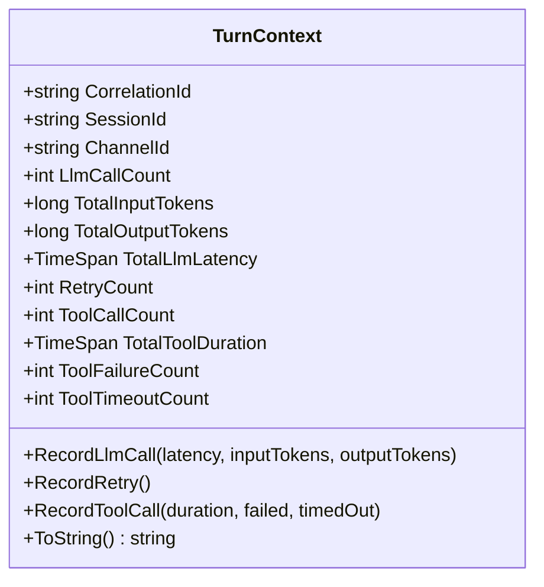

图表来源
- [TurnContext.cs:12-76](file://src/OpenClaw.Core/Observability/TurnContext.cs#L12-L76)

章节来源
- [TurnContext.cs:1-76](file://src/OpenClaw.Core/Observability/TurnContext.cs#L1-L76)

### 组件七：网关可观测服务 AdminObservabilityService
- 摘要卡片：审批决策、自动化失败、供应商错误、死信、通道漂移、操作员动作等。
- 时间序列：按桶分钟聚合，包含待审批、自动化运行/失败、供应商错误/重试、运行时警告/错误、死信、活动会话、通道漂移、操作员动作等。
- 导出能力：审计导出包（含清单、JSON Lines、JSON）、轨迹导出（消息、工具调用/结果、证据、治理），支持匿名化与证据/治理开关。
- 数据源：审批历史、运行时事件、操作员审计、死信、会话元数据、供应商使用与路由健康快照、通道就绪评估、待审批列表等。

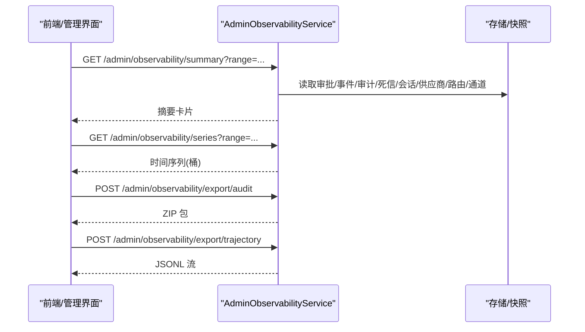

图表来源
- [AdminObservabilityService.cs:117-227](file://src/OpenClaw.Gateway/AdminObservabilityService.cs#L117-L227)
- [AdminObservabilityService.cs:229-307](file://src/OpenClaw.Gateway/AdminObservabilityService.cs#L229-L307)
- [AdminObservabilityService.cs:309-380](file://src/OpenClaw.Gateway/AdminObservabilityService.cs#L309-L380)

章节来源
- [AdminObservabilityService.cs:117-227](file://src/OpenClaw.Gateway/AdminObservabilityService.cs#L117-L227)
- [AdminObservabilityService.cs:229-307](file://src/OpenClaw.Gateway/AdminObservabilityService.cs#L229-L307)
- [AdminObservabilityService.cs:309-380](file://src/OpenClaw.Gateway/AdminObservabilityService.cs#L309-L380)

### 组件八：健康检查与 OpenTelemetry 导出
- 默认健康检查：添加“自检”健康探针，标签包含存活标记。
- 追踪过滤：排除健康与存活端点进入分布式追踪，降低噪音。
- 导出器选择：优先 Langfuse（基于配置的 Host/PublicKey/SecretKey），否则使用 OTLP Endpoint；均通过环境变量控制。

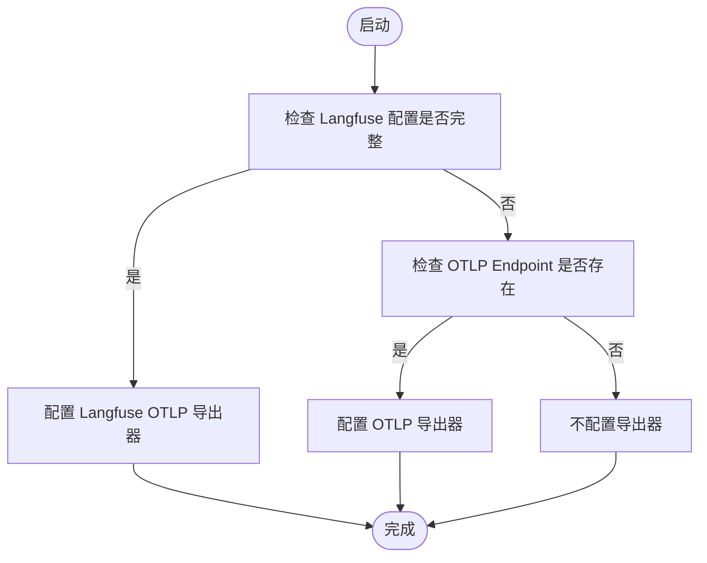

图表来源
- [Extensions.cs:84-117](file://Kingcrab.ServiceDefaults/Extensions.cs#L84-L117)
- [Extensions.cs:69-82](file://Kingcrab.ServiceDefaults/Extensions.cs#L69-L82)

章节来源
- [Extensions.cs:69-126](file://Kingcrab.ServiceDefaults/Extensions.cs#L69-L126)

### 组件九：心跳与告警模板（HeartbeatService）
- 模板目录：邮件检查、日历提醒、网站监控、API 健康检查、文件/目录监控、自定义任务。
- 成本估算：根据任务类型与输出预估估算成本，辅助运营预算控制。
- 预览与建议：生成 Markdown 文档、提示潜在漂移、给出改进建议。

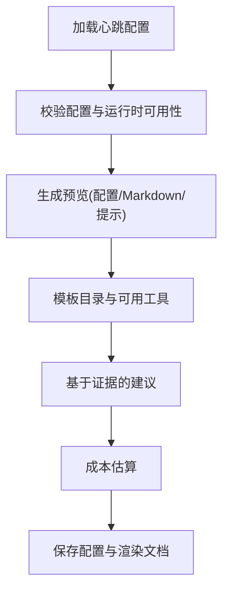

图表来源
- [HeartbeatService.cs:142-200](file://src/OpenClaw.Gateway/HeartbeatService.cs#L142-L200)
- [HeartbeatService.cs:175-200](file://src/OpenClaw.Gateway/HeartbeatService.cs#L175-L200)
- [HeartbeatService.cs:1026-1034](file://src/OpenClaw.Gateway/HeartbeatService.cs#L1026-L1034)

章节来源
- [HeartbeatService.cs:1-200](file://src/OpenClaw.Gateway/HeartbeatService.cs#L1-L200)

### 组件十：前端仪表板与数据模型
- Blazor 页面：Observability.razor 加载摘要与时间序列，支持范围与同步状态显示。
- 管理界面 HTML：提供观测卡片、过滤器与输出区域，便于快速查看与导出。
- API 模型：OperatorApiModels 中包含供应商路由、使用快照、运行时事件、死信、插件健康等集合，支撑后端聚合与前端渲染。

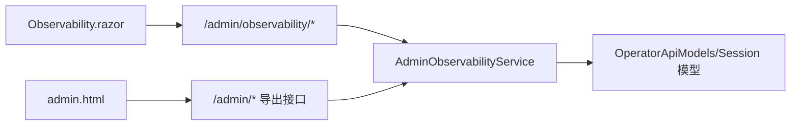

图表来源
- [Observability.razor:212-240](file://src/OpenClaw.Dashboard/Pages/Observability.razor#L212-L240)
- [admin.html:1043-1061](file://src/OpenClaw.Gateway/wwwroot/admin.html#L1043-L1061)
- [OperatorApiModels.cs:763-769](file://src/OpenClaw.Core/Models/OperatorApiModels.cs#L763-L769)
- [Session.cs:972-996](file://src/OpenClaw.Core/Models/Session.cs#L972-L996)

章节来源
- [Observability.razor:87-240](file://src/OpenClaw.Dashboard/Pages/Observability.razor#L87-L240)
- [admin.html:1043-4283](file://src/OpenClaw.Gateway/wwwroot/admin.html#L1043-L4283)
- [OperatorApiModels.cs:763-769](file://src/OpenClaw.Core/Models/OperatorApiModels.cs#L763-L769)
- [Session.cs:972-996](file://src/OpenClaw.Core/Models/Session.cs#L972-L996)

## 依赖关系分析
- Telemetry 与 AdminObservabilityService：前者提供指标与追踪，后者消费快照与事件数据进行聚合。
- RuntimeMetrics、ToolUsageTracker、ProviderUsageTracker：均为只读快照或轻量统计，被 AdminObservabilityService 读取。
- ToolAuditLog：作为审计数据源之一，配合最近缓冲用于实时回溯。
- TurnContext：贯穿请求生命周期，为日志与追踪提供统一关联 ID。
- Extensions：在应用启动阶段注入健康检查与 OTLP/Langfuse 导出器，影响全局追踪与指标出口。
- 前端与模型：Observability.razor 与 admin.html 通过 API 与 AdminObservabilityService 交互，OperatorApiModels/Session 模型承载数据契约。

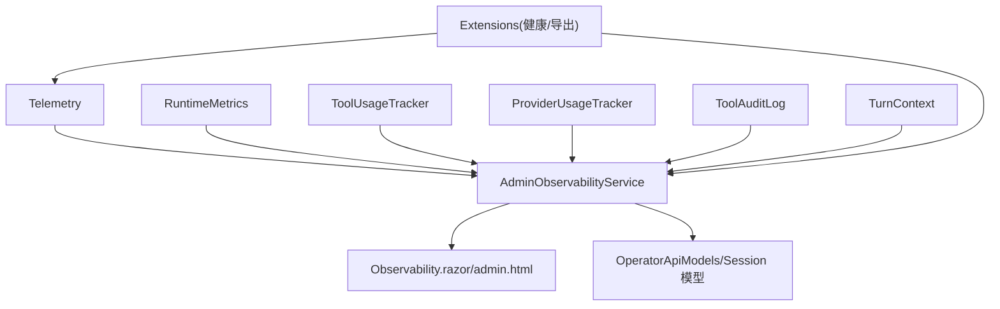

图表来源
- [Telemetry.cs:9-52](file://src/OpenClaw.Core/Observability/Telemetry.cs#L9-L52)
- [AdminObservabilityService.cs:117-227](file://src/OpenClaw.Gateway/AdminObservabilityService.cs#L117-L227)
- [Extensions.cs:69-126](file://Kingcrab.ServiceDefaults/Extensions.cs#L69-L126)
- [Observability.razor:212-240](file://src/OpenClaw.Dashboard/Pages/Observability.razor#L212-L240)
- [admin.html:1043-1061](file://src/OpenClaw.Gateway/wwwroot/admin.html#L1043-L1061)
- [OperatorApiModels.cs:763-769](file://src/OpenClaw.Core/Models/OperatorApiModels.cs#L763-L769)
- [Session.cs:972-996](file://src/OpenClaw.Core/Models/Session.cs#L972-L996)

章节来源
- [AdminObservabilityService.cs:117-227](file://src/OpenClaw.Gateway/AdminObservabilityService.cs#L117-L227)
- [Extensions.cs:69-126](file://Kingcrab.ServiceDefaults/Extensions.cs#L69-L126)

## 性能考量
- 无锁设计：RuntimeMetrics、ToolUsageTracker、TurnContext 使用 Interlocked/Volatile，减少锁竞争，适合高并发场景。
- 指标粒度：直方图与时延聚合、令牌用量与缓存统计，便于定位瓶颈与成本热点。
- 导出与渲染：前端分页/分桶加载，避免一次性传输大量数据；审计导出采用压缩包与 JSON Lines，兼顾体积与解析效率。
- 追踪噪音控制：健康端点排除追踪，降低无关 Span 数量，提升采样质量。

## 故障排查指南
- 审计与回溯
  - 使用 ToolAuditLog 的最近缓冲快照定位近期失败/超时工具调用，结合 CorrelationId 在日志中检索。
  - 通过 AdminObservabilityService 的轨迹导出获取完整会话轨迹，包括消息、工具调用与结果、证据与治理记录。
- 运行时异常
  - 查看 RuntimeMetrics 中的错误/失败/超时计数与脉冲运行状态，判断系统稳定性与恢复情况。
  - 关注会话缓存命中率与保留进程数量，评估内存与资源压力。
- 供应商与路由
  - 通过 ProviderUsageTracker 的错误/重试统计与路由健康快照，识别慢/不可用的供应商或模型。
- 健康检查与导出
  - 确认健康端点可达且未被追踪过滤；检查 OTLP/Langfuse 配置是否正确，确保指标与追踪正常上报。
- 前端问题
  - 若仪表板无数据，确认时间范围与桶大小合理；检查网络请求与返回状态码；必要时切换到管理界面 HTML 获取更详细的输出。

章节来源
- [ToolAuditLog.cs:97-108](file://src/OpenClaw.Core/Observability/ToolAuditLog.cs#L97-L108)
- [AdminObservabilityService.cs:309-380](file://src/OpenClaw.Gateway/AdminObservabilityService.cs#L309-L380)
- [RuntimeMetrics.cs:1-312](file://src/OpenClaw.Core/Observability/RuntimeMetrics.cs#L1-L312)
- [ProviderUsageTracker.cs:1-176](file://src/OpenClaw.Core/Observability/ProviderUsageTracker.cs#L1-L176)
- [Extensions.cs:69-126](file://Kingcrab.ServiceDefaults/Extensions.cs#L69-L126)
- [Observability.razor:212-240](file://src/OpenClaw.Dashboard/Pages/Observability.razor#L212-L240)

## 结论
该可观测性体系以轻量、无锁、可扩展为核心设计原则，结合集中式 Telemetry、运行时指标、工具与供应商统计、审计日志与前端仪表板，形成从指标到追踪再到可视化与导出的完整闭环。通过健康检查与 OTLP/Langfuse 导出器，系统具备良好的云原生可观测性基础；通过心跳模板与成本估算，进一步强化了自动化巡检与运营成本控制能力。

## 附录
- 健康检查与导出配置要点
  - 健康检查：确保“自检”探针可用，标签包含存活标记。
  - 追踪过滤：排除健康与存活端点，减少噪音。
  - 导出器：优先 Langfuse（Host/PublicKey/SecretKey），否则使用 OTLP Endpoint。
- 仪表板与导出
  - 摘要卡片：关注审批、自动化、供应商错误、死信、通道漂移与操作员动作。
  - 时间序列：按桶聚合，观察趋势变化与异常波动。
  - 导出：审计导出包包含清单与多类 JSON Lines 文件；轨迹导出支持匿名化与证据/治理数据整合。

章节来源
- [Extensions.cs:119-126](file://Kingcrab.ServiceDefaults/Extensions.cs#L119-L126)
- [AdminObservabilityService.cs:117-227](file://src/OpenClaw.Gateway/AdminObservabilityService.cs#L117-L227)
- [admin.html:1043-1061](file://src/OpenClaw.Gateway/wwwroot/admin.html#L1043-L1061)