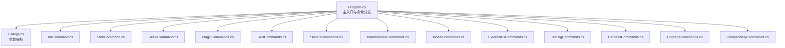
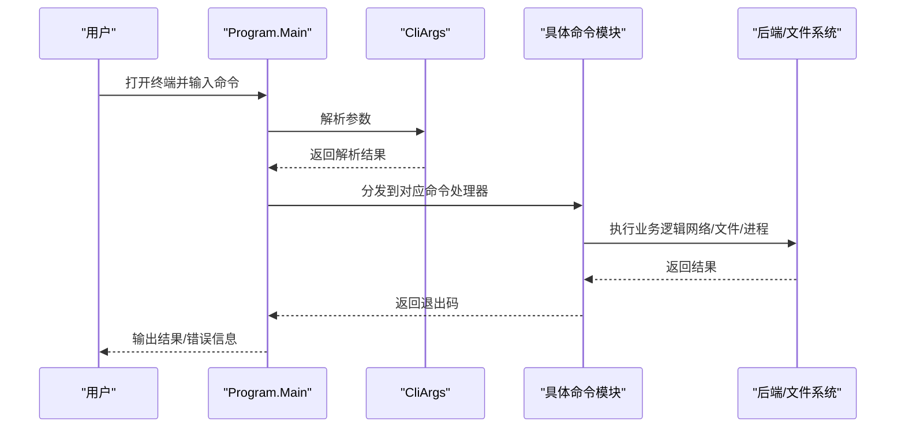
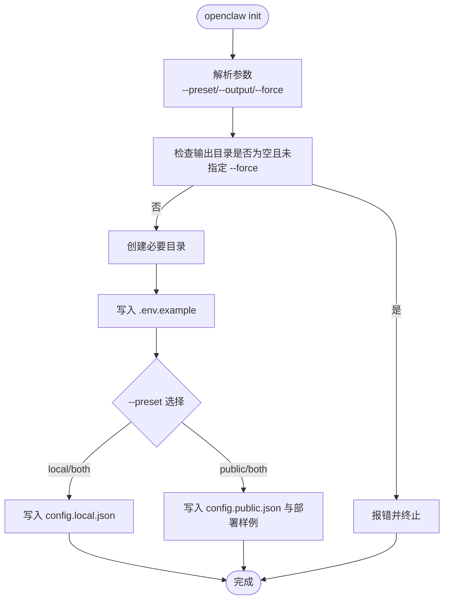
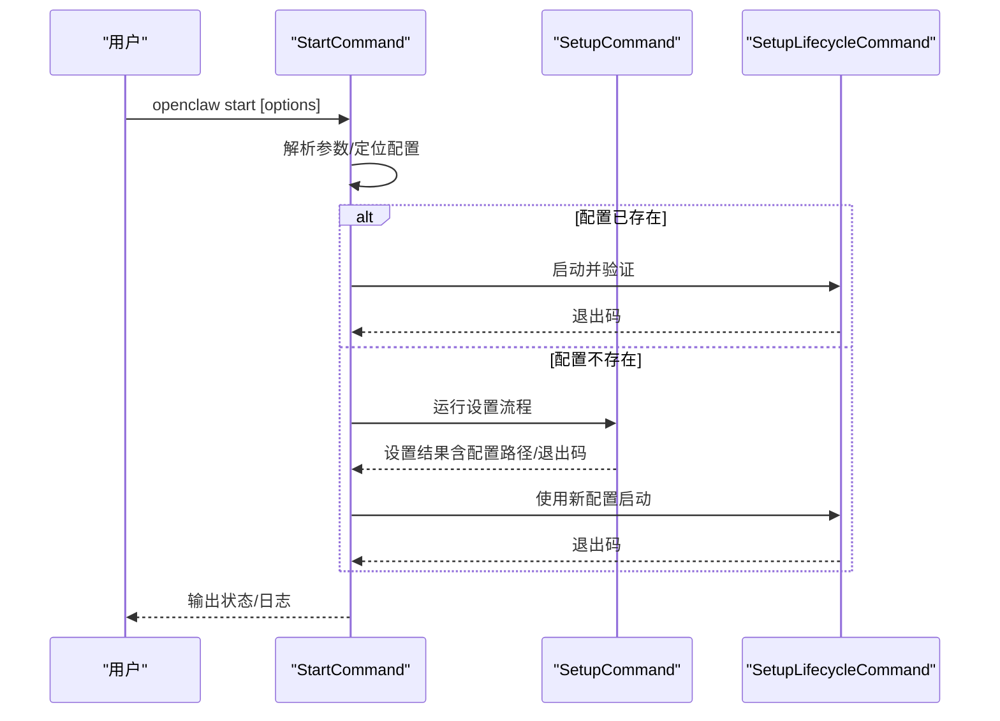
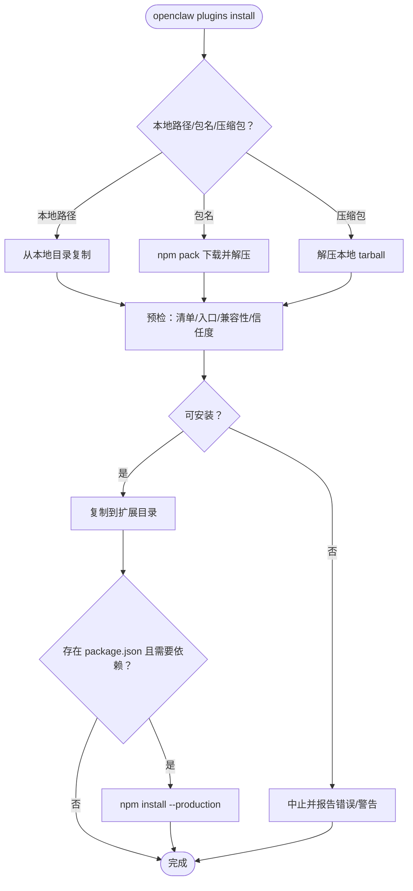
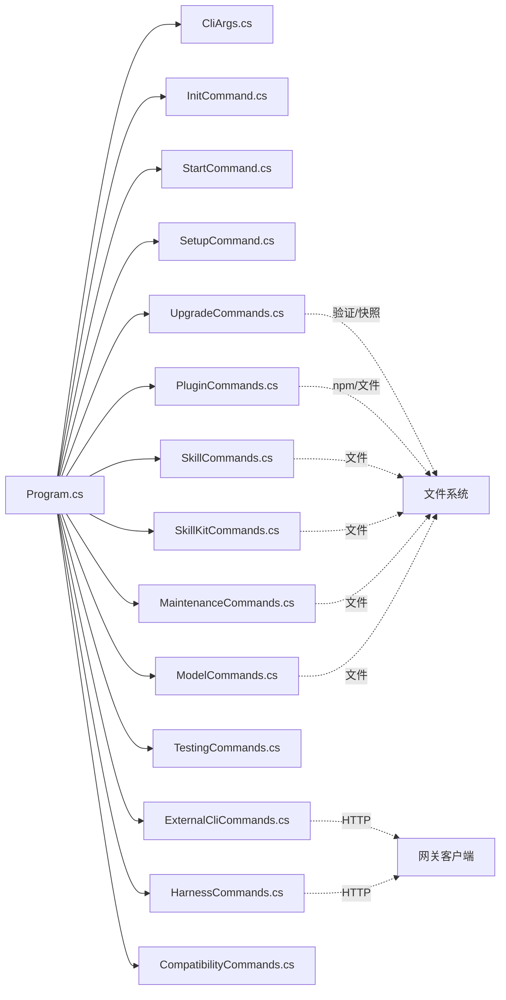

# 命令行工具

<cite>
**本文引用的文件**
- [Program.cs](file://src/OpenClaw.Cli/Program.cs)
- [CliArgs.cs](file://src/OpenClaw.Cli/CliArgs.cs)
- [InitCommand.cs](file://src/OpenClaw.Cli/InitCommand.cs)
- [StartCommand.cs](file://src/OpenClaw.Cli/StartCommand.cs)
- [SetupCommand.cs](file://src/OpenClaw.Cli/SetupCommand.cs)
- [PluginCommands.cs](file://src/OpenClaw.Cli/PluginCommands.cs)
- [SkillCommands.cs](file://src/OpenClaw.Cli/SkillCommands.cs)
- [SkillKitCommands.cs](file://src/OpenClaw.Cli/SkillKitCommands.cs)
- [MaintenanceCommands.cs](file://src/OpenClaw.Cli/MaintenanceCommands.cs)
- [ModelCommands.cs](file://src/OpenClaw.Cli/ModelCommands.cs)
- [ExternalCliCommands.cs](file://src/OpenClaw.Cli/ExternalCliCommands.cs)
- [TestingCommands.cs](file://src/OpenClaw.Cli/TestingCommands.cs)
- [HarnessCommands.cs](file://src/OpenClaw.Cli/HarnessCommands.cs)
- [UpgradeCommands.cs](file://src/OpenClaw.Cli/UpgradeCommands.cs)
- [CompatibilityCommands.cs](file://src/OpenClaw.Cli/CompatibilityCommands.cs)
</cite>

## 目录
1. [简介](#简介)
2. [项目结构](#项目结构)
3. [核心组件](#核心组件)
4. [架构总览](#架构总览)
5. [详细组件分析](#详细组件分析)
6. [依赖关系分析](#依赖关系分析)
7. [性能考虑](#性能考虑)
8. [故障排查指南](#故障排查指南)
9. [结论](#结论)
10. [附录](#附录)

## 简介
本文件面向使用者与开发者，系统性阐述命令行工具（CLI）的整体架构、命令分类与参数解析机制，并深入讲解初始化、启动、设置、插件管理、技能管理、维护等常用命令的功能与用法。同时提供脚本化操作、批处理任务与自动化集成的最佳实践，以及命令扩展开发指南与错误处理策略，帮助快速上手并安全高效地使用该 CLI。

## 项目结构
CLI 位于 src/OpenClaw.Cli，采用“主入口分发 + 子命令模块”的组织方式：
- 主入口 Program.cs 负责顶层命令分发与全局异常处理
- CliArgs.cs 提供统一的参数解析器
- 各功能子命令以独立静态类实现，如 InitCommand、StartCommand、SetupCommand、PluginCommands、SkillCommands、SkillKitCommands、MaintenanceCommands、ModelCommands、ExternalCliCommands、TestingCommands、HarnessCommands、UpgradeCommands、CompatibilityCommands

图表来源
- [Program.cs:12-69](file://src/OpenClaw.Cli/Program.cs#L12-L69)
- [CliArgs.cs:14-73](file://src/OpenClaw.Cli/CliArgs.cs#L14-L73)
- [InitCommand.cs:9-72](file://src/OpenClaw.Cli/InitCommand.cs#L9-L72)
- [StartCommand.cs:9-47](file://src/OpenClaw.Cli/StartCommand.cs#L9-L47)
- [SetupCommand.cs:22-139](file://src/OpenClaw.Cli/SetupCommand.cs#L22-L139)
- [PluginCommands.cs:18-37](file://src/OpenClaw.Cli/PluginCommands.cs#L18-L37)
- [SkillCommands.cs:10-28](file://src/OpenClaw.Cli/SkillCommands.cs#L10-L28)
- [SkillKitCommands.cs:11-42](file://src/OpenClaw.Cli/SkillKitCommands.cs#L11-L42)
- [MaintenanceCommands.cs:10-63](file://src/OpenClaw.Cli/MaintenanceCommands.cs#L10-L63)
- [ModelCommands.cs:7-86](file://src/OpenClaw.Cli/ModelCommands.cs#L7-L86)
- [ExternalCliCommands.cs:14-112](file://src/OpenClaw.Cli/ExternalCliCommands.cs#L14-L112)
- [TestingCommands.cs:12-34](file://src/OpenClaw.Cli/TestingCommands.cs#L12-L34)
- [HarnessCommands.cs:14-46](file://src/OpenClaw.Cli/HarnessCommands.cs#L14-L46)
- [UpgradeCommands.cs:12-28](file://src/OpenClaw.Cli/UpgradeCommands.cs#L12-L28)
- [CompatibilityCommands.cs:9-28](file://src/OpenClaw.Cli/CompatibilityCommands.cs#L9-L28)

章节来源
- [Program.cs:12-69](file://src/OpenClaw.Cli/Program.cs#L12-L69)
- [CliArgs.cs:14-73](file://src/OpenClaw.Cli/CliArgs.cs#L14-L73)

## 核心组件
- 主入口与命令分发：Program.Main 根据第一个参数选择对应命令处理器，统一捕获取消与异常，返回退出码
- 参数解析器：CliArgs.Parse 将命令行解析为位置参数、选项与标志位，支持 --help 自动帮助输出
- 子命令模块：各命令模块负责自身子命令解析、参数校验、调用后端服务或文件系统操作

章节来源
- [Program.cs:12-69](file://src/OpenClaw.Cli/Program.cs#L12-L69)
- [CliArgs.cs:14-73](file://src/OpenClaw.Cli/CliArgs.cs#L14-L73)

## 架构总览
命令执行链路从 Program 开始，经由 CliArgs 解析，再路由到具体命令模块；部分命令会进一步调用网关客户端或本地文件系统进行操作。

图表来源
- [Program.cs:12-69](file://src/OpenClaw.Cli/Program.cs#L12-L69)
- [CliArgs.cs:14-73](file://src/OpenClaw.Cli/CliArgs.cs#L14-L73)

## 详细组件分析

### 初始化命令（init）
用途：生成最小化引导文件与目录，便于快速开始本地开发与演示。

- 支持选项
  - --preset：生成本地/公共/两者配置（默认 both）
  - --output：输出目录（默认 ./.openclaw-init）
  - --force：覆盖非空输出目录
- 行为要点
  - 创建 workspace、memory、deploy 等目录
  - 写入示例环境变量文件与配置文件
  - 公共预设包含示例部署文件

图表来源
- [InitCommand.cs:9-72](file://src/OpenClaw.Cli/InitCommand.cs#L9-L72)

章节来源
- [InitCommand.cs:9-72](file://src/OpenClaw.Cli/InitCommand.cs#L9-L72)

### 启动命令（start）
用途：一键启动网关，若无配置则先运行设置流程再启动。

- 关键行为
  - 解析配置路径并确保 --config 参数存在
  - 若已有配置：直接启动并验证
  - 若无配置：进入交互式/非交互式设置流程，完成后启动
- 可选参数：配置路径、是否带 Companion、是否打开浏览器、跳过验证、离线模式、要求提供者、非交互模式等

图表来源
- [StartCommand.cs:9-47](file://src/OpenClaw.Cli/StartCommand.cs#L9-L47)
- [SetupCommand.cs:31-139](file://src/OpenClaw.Cli/SetupCommand.cs#L31-L139)

章节来源
- [StartCommand.cs:9-47](file://src/OpenClaw.Cli/StartCommand.cs#L9-L47)
- [SetupCommand.cs:31-139](file://src/OpenClaw.Cli/SetupCommand.cs#L31-L139)

### 设置命令（setup）
用途：引导式配置网关，支持本地/公共/私有暴露等多种部署形态。

- 子命令
  - launch：启动网关并验证
  - service：生成部署制品（systemd/launchd/Caddy）
  - status：查看当前状态
  - verify：仅验证不启动
  - channel：配置外部通道（Telegram/Slack/Discord/Teams/WhatsApp）
  - provider：配置特定提供商（如 Aperture）
  - tailscale：生成 Tailscale Serve 指南
- 通用参数
  - 非交互模式 + 显式参数用于自动化
  - 支持绑定地址、端口、鉴权令牌、执行后端（Docker/OpenSandbox/SSH）

章节来源
- [SetupCommand.cs:22-139](file://src/OpenClaw.Cli/SetupCommand.cs#L22-L139)

### 插件管理命令（plugins）
用途：安装、卸载、列出、搜索第三方插件；支持 npm 包与本地源码安装。

- 子命令
  - install：从 npm 或本地路径安装；支持 --dry-run 预检
  - remove/uninstall：卸载插件
  - list/ls：列出已安装插件
  - search：在 npm 中搜索
- 安装流程（概览）
  - 识别本地路径/包名
  - npm pack 下载 tarball 并解压
  - 解析 openclaw.plugin.json 或 package.json，决定入口
  - 预检兼容性与信任级别
  - 复制到扩展目录并可选安装依赖

图表来源
- [PluginCommands.cs:39-159](file://src/OpenClaw.Cli/PluginCommands.cs#L39-L159)
- [PluginCommands.cs:161-242](file://src/OpenClaw.Cli/PluginCommands.cs#L161-L242)
- [PluginCommands.cs:319-364](file://src/OpenClaw.Cli/PluginCommands.cs#L319-L364)

章节来源
- [PluginCommands.cs:18-37](file://src/OpenClaw.Cli/PluginCommands.cs#L18-L37)
- [PluginCommands.cs:39-159](file://src/OpenClaw.Cli/PluginCommands.cs#L39-L159)
- [PluginCommands.cs:161-242](file://src/OpenClaw.Cli/PluginCommands.cs#L161-L242)
- [PluginCommands.cs:319-364](file://src/OpenClaw.Cli/PluginCommands.cs#L319-L364)

### 技能管理命令（skills）
用途：检查、安装、列出本地技能包；支持从 tarball 安装与预览。

- 子命令
  - inspect：检查技能包内容与信任度
  - install：安装技能包（支持 --dry-run、--managed、--workdir）
  - list：列出已安装技能
- 安装流程（概览）
  - 解析源路径/压缩包
  - 预检并打印信任度与要求
  - 复制到目标目录（受控于 --managed 与 --workdir）

章节来源
- [SkillCommands.cs:10-28](file://src/OpenClaw.Cli/SkillCommands.cs#L10-L28)
- [SkillCommands.cs:42-92](file://src/OpenClaw.Cli/SkillCommands.cs#L42-L92)
- [SkillCommands.cs:94-129](file://src/OpenClaw.Cli/SkillCommands.cs#L94-L129)

### 技能套件命令（skill）
用途：基于 SkillKit 的技能全生命周期管理（新建、校验、评审、生成、打包、运行计划）。

- 子命令
  - new：新建技能模板
  - list：列出技能
  - validate：校验技能
  - critique：生成评审意见
  - generate：生成缺失文件
  - package：打包技能
  - run：干跑执行计划（--dry-run）
- 默认根目录：.openclaw/skills 与 .openclaw/packages

章节来源
- [SkillKitCommands.cs:11-42](file://src/OpenClaw.Cli/SkillKitCommands.cs#L11-L42)
- [SkillKitCommands.cs:44-67](file://src/OpenClaw.Cli/SkillKitCommands.cs#L44-L67)
- [SkillKitCommands.cs:90-102](file://src/OpenClaw.Cli/SkillKitCommands.cs#L90-L102)
- [SkillKitCommands.cs:118-130](file://src/OpenClaw.Cli/SkillKitCommands.cs#L118-L130)
- [SkillKitCommands.cs:132-146](file://src/OpenClaw.Cli/SkillKitCommands.cs#L132-L146)
- [SkillKitCommands.cs:148-173](file://src/OpenClaw.Cli/SkillKitCommands.cs#L148-L173)

### 维护命令（maintenance）
用途：扫描与修复运行时健康问题，生成可靠性与存储分析报告。

- 子命令
  - scan：扫描并输出报告（支持 --json）
  - fix：修复（支持 --dry-run 与 --apply）
- 输入：读取配置文件，构建状态与模型诊断

章节来源
- [MaintenanceCommands.cs:10-63](file://src/OpenClaw.Cli/MaintenanceCommands.cs#L10-L63)
- [MaintenanceCommands.cs:65-112](file://src/OpenClaw.Cli/MaintenanceCommands.cs#L65-L112)

### 模型命令（models）
用途：本地模型包的查询、状态、安装、校验与移除。

- 子命令
  - packages：列出可用本地模型包
  - status：查看模型包状态
  - install：安装模型包（支持许可证接受、下载、可选文件）
  - verify：校验模型包
  - remove：移除模型包
- 选项：--models-root 控制模型根目录

章节来源
- [ModelCommands.cs:7-86](file://src/OpenClaw.Cli/ModelCommands.cs#L7-L86)
- [ModelCommands.cs:88-151](file://src/OpenClaw.Cli/ModelCommands.cs#L88-L151)

### 外部 CLI 命令（external）
用途：列举、检查、预览与执行外部 CLI 连接器命令（需启用外部 CLI 功能）。

- 子命令
  - presets：本地预设列表
  - list/status/commands：连接器状态与命令
  - preview/execute：预览与执行命令（高风险命令需确认）
- 选项
  - --param key=value 多次传入参数
  - --dry-run 干跑
  - --yes 跳过确认（仅对需要批准的命令）
  - --reason 批准原因

章节来源
- [ExternalCliCommands.cs:14-112](file://src/OpenClaw.Cli/ExternalCliCommands.cs#L14-L112)
- [ExternalCliCommands.cs:114-179](file://src/OpenClaw.Cli/ExternalCliCommands.cs#L114-L179)
- [ExternalCliCommands.cs:180-268](file://src/OpenClaw.Cli/ExternalCliCommands.cs#L180-L268)

### 测试命令（test）
用途：运行场景测试、生成报告与质量门禁评估。

- 子命令
  - init：初始化示例场景与文档目录
  - run：运行场景并生成追踪与报告
  - report：基于最新追踪重生成 Markdown 报告
  - gates：评估场景质量门禁
- 选项
  - --scenarios/--scenario-dir：场景目录
  - --output：输出根目录
  - --fail-on：失败阈值（any/high）

章节来源
- [TestingCommands.cs:12-34](file://src/OpenClaw.Cli/TestingCommands.cs#L12-L34)
- [TestingCommands.cs:36-58](file://src/OpenClaw.Cli/TestingCommands.cs#L36-L58)
- [TestingCommands.cs:60-82](file://src/OpenClaw.Cli/TestingCommands.cs#L60-L82)
- [TestingCommands.cs:84-99](file://src/OpenClaw.Cli/TestingCommands.cs#L84-L99)
- [TestingCommands.cs:101-114](file://src/OpenClaw.Cli/TestingCommands.cs#L101-L114)

### 测试夹具命令（harness）
用途：离线运行回归测试、生成代码库映射图、查询共享夹具状态。

- 子命令
  - test/regression：运行回归测试（支持 --strict、--proposal、--output）
  - map：生成代码库映射（支持 --hashes、--recent-days、--max-files、--category）
  - state：list/show/session/conflicts（查询共享夹具状态与冲突）
- 选项
  - --config、--category、--json、--offline、--strict、--proposal、--output

章节来源
- [HarnessCommands.cs:14-46](file://src/OpenClaw.Cli/HarnessCommands.cs#L14-L46)
- [HarnessCommands.cs:48-65](file://src/OpenClaw.Cli/HarnessCommands.cs#L48-L65)
- [HarnessCommands.cs:102-142](file://src/OpenClaw.Cli/HarnessCommands.cs#L102-L142)
- [HarnessCommands.cs:144-246](file://src/OpenClaw.Cli/HarnessCommands.cs#L144-L246)

### 升级命令（upgrade）
用途：升级前预检、生成回滚快照、回滚恢复。

- 子命令
  - check：执行配置/提供商/插件/技能/迁移影响/回滚快照评估
  - rollback：恢复上次已知良好快照并重新验证
- 评估维度
  - 设置验证、插件兼容性、技能兼容性、迁移影响、回滚快照

章节来源
- [UpgradeCommands.cs:12-28](file://src/OpenClaw.Cli/UpgradeCommands.cs#L12-L28)
- [UpgradeCommands.cs:30-106](file://src/OpenClaw.Cli/UpgradeCommands.cs#L30-L106)
- [UpgradeCommands.cs:108-162](file://src/OpenClaw.Cli/UpgradeCommands.cs#L108-L162)

### 兼容性命令（compatibility）
用途：查看公开兼容性场景目录。

- 子命令
  - catalog/list：按状态/类型/类别过滤并输出（支持 --json）

章节来源
- [CompatibilityCommands.cs:9-28](file://src/OpenClaw.Cli/CompatibilityCommands.cs#L9-L28)
- [CompatibilityCommands.cs:30-72](file://src/OpenClaw.Cli/CompatibilityCommands.cs#L30-L72)

## 依赖关系分析
- Program 对所有命令模块进行集中分发
- 各命令模块依赖 CliArgs 进行参数解析
- 部分命令模块依赖后端客户端（如 ExternalCliCommands、HarnessCommands）或本地文件系统（如 InitCommand、PluginCommands、SkillCommands、SkillKitCommands、MaintenanceCommands、ModelCommands）
- 升级命令依赖 SetupLifecycleCommand 与多个验证服务

图表来源
- [Program.cs:12-69](file://src/OpenClaw.Cli/Program.cs#L12-L69)
- [ExternalCliCommands.cs:14-112](file://src/OpenClaw.Cli/ExternalCliCommands.cs#L14-L112)
- [HarnessCommands.cs:14-46](file://src/OpenClaw.Cli/HarnessCommands.cs#L14-L46)
- [UpgradeCommands.cs:12-28](file://src/OpenClaw.Cli/UpgradeCommands.cs#L12-L28)
- [PluginCommands.cs:18-37](file://src/OpenClaw.Cli/PluginCommands.cs#L18-L37)
- [SkillCommands.cs:10-28](file://src/OpenClaw.Cli/SkillCommands.cs#L10-L28)
- [SkillKitCommands.cs:11-42](file://src/OpenClaw.Cli/SkillKitCommands.cs#L11-L42)
- [MaintenanceCommands.cs:10-63](file://src/OpenClaw.Cli/MaintenanceCommands.cs#L10-L63)
- [ModelCommands.cs:7-86](file://src/OpenClaw.Cli/ModelCommands.cs#L7-L86)

章节来源
- [Program.cs:12-69](file://src/OpenClaw.Cli/Program.cs#L12-L69)

## 性能考虑
- 参数解析：CliArgs 采用单次遍历，时间复杂度 O(n)，空间 O(k)（k 为选项数量）
- 插件安装：npm pack 与 tar 解压为 IO 密集；建议在具备稳定网络与足够磁盘空间的环境中执行
- 维护扫描：扫描与诊断涉及文件系统与内存占用，建议在低负载时段执行
- 测试与夹具：场景运行与报告生成可能产生大量文件输出，注意磁盘空间与并发控制

## 故障排查指南
- 未知命令
  - 现象：提示 Unknown command 并显示帮助
  - 排查：确认命令拼写；使用 --help 查看可用命令
- 参数缺失或非法
  - 现象：抛出 ArgumentException 并返回退出码 2
  - 排查：检查必填选项与取值范围；参考各命令帮助
- 网络/权限问题
  - 现象：外部 CLI 执行失败、插件安装 npm 命令未找到、文件写入失败
  - 排查：确认网络连通性、npm 可用性、文件权限与路径正确性
- 升级阻断
  - 现象：升级预检失败，返回非零退出码
  - 排查：根据预检报告逐项修复；必要时使用 rollback 恢复

章节来源
- [Program.cs:78-83](file://src/OpenClaw.Cli/Program.cs#L78-L83)
- [PluginCommands.cs:425-458](file://src/OpenClaw.Cli/PluginCommands.cs#L425-L458)
- [HarnessCommands.cs:258-262](file://src/OpenClaw.Cli/HarnessCommands.cs#L258-L262)
- [UpgradeCommands.cs:516-521](file://src/OpenClaw.Cli/UpgradeCommands.cs#L516-L521)

## 结论
该 CLI 通过清晰的命令分层与统一的参数解析，提供了从初始化、启动、设置到插件与技能管理、维护、测试、升级与兼容性检查的完整能力矩阵。配合脚本化与自动化集成最佳实践，可在本地与生产环境中安全高效地运行与维护 OpenClaw.NET。

## 附录

### 常用命令速查
- 初始化：openclaw init [--preset local|public|both] [--output <dir>] [--force]
- 启动：openclaw start [--config <path>] [--with-companion] [--open-browser] [--skip-verify] [--offline] [--require-provider] [--profile local|public] [--non-interactive]
- 设置：openclaw setup [--non-interactive] [--config <path>] [--workspace <path>] [--provider <id>] [--model <id>] [--model-preset <id>] [--api-key <secret-or-envref>] [--bind <address>] [--port <n>] [--auth-token <token>] [--docker-image <image>] [--opensandbox-endpoint <url>] [--ssh-host <host>] [--ssh-user <user>] [--ssh-key <path>]
- 插件：openclaw plugins install|remove|list|search [options]
- 技能：openclaw skills inspect|install|list [options]
- 技能套件：openclaw skill new|list|validate|critique|generate|package|run [options]
- 维护：openclaw maintenance scan|fix [--config <path>] [--json] [--dry-run] [--apply <all|retention|metadata|artifacts>]
- 模型：openclaw models packages|status|install|verify|remove [--models-root <path>] [--accept-license] [--no-optional-files]
- 外部 CLI：openclaw external presets|list|status|commands|preview|execute [--param key=value] [--dry-run] [--yes] [--reason <text>] [--json]
- 测试：openclaw test init|run|report|gates [--scenarios <path>] [--output <path>] [--fail-on <high|any>]
- 夹具：openclaw harness test|regression|map|state [options]
- 升级：openclaw upgrade check|rollback [--config <path>] [--offline] [--require-provider]
- 兼容性：openclaw compatibility catalog [--status <compatible|incompatible>] [--kind <kind>] [--category <category>] [--json]

### 脚本化与自动化最佳实践
- 使用 --non-interactive 与显式参数进行 CI/CD 流水线
- 将敏感信息放入环境变量（如 OPENCLAW_AUTH_TOKEN），避免明文传参
- 使用 --json 输出机器可读结果，便于后续处理
- 在执行高风险命令（如 external execute、maintenance fix）前先 --dry-run
- 使用 openclaw upgrade check 生成回滚快照，保障升级安全