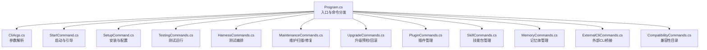
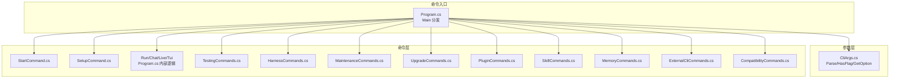
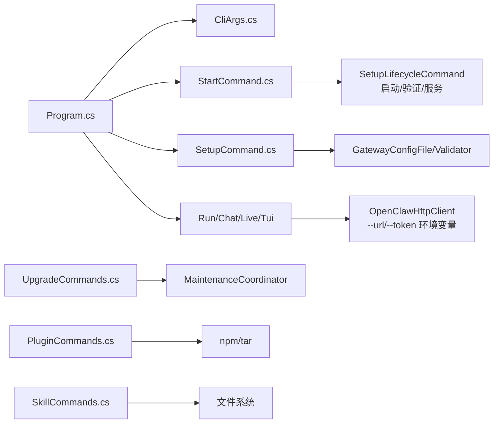

# 基础命令

<cite>
**本文引用的文件**
- [Program.cs](file://src/OpenClaw.Cli/Program.cs)
- [CliArgs.cs](file://src/OpenClaw.Cli/CliArgs.cs)
- [StartCommand.cs](file://src/OpenClaw.Cli/StartCommand.cs)
- [InitCommand.cs](file://src/OpenClaw.Cli/InitCommand.cs)
- [SetupCommand.cs](file://src/OpenClaw.Cli/SetupCommand.cs)
- [HarnessCommands.cs](file://src/OpenClaw.Cli/HarnessCommands.cs)
- [TestingCommands.cs](file://src/OpenClaw.Cli/TestingCommands.cs)
- [MaintenanceCommands.cs](file://src/OpenClaw.Cli/MaintenanceCommands.cs)
- [UpgradeCommands.cs](file://src/OpenClaw.Cli/UpgradeCommands.cs)
- [PluginCommands.cs](file://src/OpenClaw.Cli/PluginCommands.cs)
- [SkillCommands.cs](file://src/OpenClaw.Cli/SkillCommands.cs)
- [MemoryCommands.cs](file://src/OpenClaw.Cli/MemoryCommands.cs)
- [ExternalCliCommands.cs](file://src/OpenClaw.Cli/ExternalCliCommands.cs)
- [CompatibilityCommands.cs](file://src/OpenClaw.Cli/CompatibilityCommands.cs)
</cite>

## 目录
1. [简介](#简介)
2. [项目结构](#项目结构)
3. [核心组件](#核心组件)
4. [架构总览](#架构总览)
5. [详细组件分析](#详细组件分析)
6. [依赖分析](#依赖分析)
7. [性能考虑](#性能考虑)
8. [故障排除指南](#故障排除指南)
9. [结论](#结论)
10. [附录](#附录)

## 简介
本文件面向基础命令的使用者与运维人员，系统性梳理 openclaw 的核心命令：start、run、chat、live、tui，并深入讲解命令行参数解析机制、环境变量配置、认证方式、常见使用场景、脚本化与自动化集成方法，以及故障排除与性能优化建议。内容基于仓库中的 CLI 实现与帮助输出，确保可追溯到具体源码位置。

## 项目结构
OpenClaw 的 CLI 入口位于 Program.cs，负责解析顶层命令并分发到各子命令模块；参数解析由 CliArgs.cs 提供通用能力；其余命令以独立静态类组织，如 StartCommand.cs、SetupCommand.cs、TestingCommands.cs 等。

图表来源
- [Program.cs:12-69](file://src/OpenClaw.Cli/Program.cs#L12-L69)
- [CliArgs.cs:14-73](file://src/OpenClaw.Cli/CliArgs.cs#L14-L73)
- [StartCommand.cs:9-47](file://src/OpenClaw.Cli/StartCommand.cs#L9-L47)
- [SetupCommand.cs:22-139](file://src/OpenClaw.Cli/SetupCommand.cs#L22-L139)
- [TestingCommands.cs:12-34](file://src/OpenClaw.Cli/TestingCommands.cs#L12-L34)
- [HarnessCommands.cs:14-46](file://src/OpenClaw.Cli/HarnessCommands.cs#L14-L46)
- [MaintenanceCommands.cs:10-63](file://src/OpenClaw.Cli/MaintenanceCommands.cs#L10-L63)
- [UpgradeCommands.cs:12-28](file://src/OpenClaw.Cli/UpgradeCommands.cs#L12-L28)
- [PluginCommands.cs:18-37](file://src/OpenClaw.Cli/PluginCommands.cs#L18-L37)
- [SkillCommands.cs:10-28](file://src/OpenClaw.Cli/SkillCommands.cs#L10-L28)
- [MemoryCommands.cs:13-27](file://src/OpenClaw.Cli/MemoryCommands.cs#L13-L27)
- [ExternalCliCommands.cs:14-27](file://src/OpenClaw.Cli/ExternalCliCommands.cs#L14-L27)
- [CompatibilityCommands.cs:9-28](file://src/OpenClaw.Cli/CompatibilityCommands.cs#L9-L28)

章节来源
- [Program.cs:12-69](file://src/OpenClaw.Cli/Program.cs#L12-L69)
- [CliArgs.cs:14-73](file://src/OpenClaw.Cli/CliArgs.cs#L14-L73)

## 核心组件
- 命令入口与分发：Program.cs 解析顶层命令（start/run/chat/live/tui 等），调用对应命令处理器。
- 参数解析器：CliArgs.cs 提供统一的参数解析、标志位识别、位置参数收集与重复选项值处理。
- 启动命令：StartCommand.cs 负责“本地优先”的启动流程，自动引导 setup 或直接启动网关。
- 配置与初始化：SetupCommand.cs 与 InitCommand.cs 提供交互式/非交互式配置生成与验证。
- 测试与编排：TestingCommands.cs 与 HarnessCommands.cs 支持场景化测试与回归报告。
- 维护与升级：MaintenanceCommands.cs 与 UpgradeCommands.cs 提供扫描、修复与升级预检/回滚。
- 插件与技能：PluginCommands.cs 与 SkillCommands.cs 提供插件与技能包的安装/检查/列表等。
- 记忆体与外部CLI：MemoryCommands.cs 与 ExternalCliCommands.cs 提供记忆体与外部CLI桥接能力。
- 兼容性目录：CompatibilityCommands.cs 提供兼容性场景清单查询。

章节来源
- [Program.cs:25-58](file://src/OpenClaw.Cli/Program.cs#L25-L58)
- [CliArgs.cs:14-73](file://src/OpenClaw.Cli/CliArgs.cs#L14-L73)
- [StartCommand.cs:9-47](file://src/OpenClaw.Cli/StartCommand.cs#L9-L47)
- [SetupCommand.cs:22-139](file://src/OpenClaw.Cli/SetupCommand.cs#L22-L139)
- [InitCommand.cs:9-72](file://src/OpenClaw.Cli/InitCommand.cs#L9-L72)
- [TestingCommands.cs:12-34](file://src/OpenClaw.Cli/TestingCommands.cs#L12-L34)
- [HarnessCommands.cs:14-46](file://src/OpenClaw.Cli/HarnessCommands.cs#L14-L46)
- [MaintenanceCommands.cs:10-63](file://src/OpenClaw.Cli/MaintenanceCommands.cs#L10-L63)
- [UpgradeCommands.cs:12-28](file://src/OpenClaw.Cli/UpgradeCommands.cs#L12-L28)
- [PluginCommands.cs:18-37](file://src/OpenClaw.Cli/PluginCommands.cs#L18-L37)
- [SkillCommands.cs:10-28](file://src/OpenClaw.Cli/SkillCommands.cs#L10-L28)
- [MemoryCommands.cs:13-27](file://src/OpenClaw.Cli/MemoryCommands.cs#L13-L27)
- [ExternalCliCommands.cs:14-27](file://src/OpenClaw.Cli/ExternalCliCommands.cs#L14-L27)
- [CompatibilityCommands.cs:9-28](file://src/OpenClaw.Cli/CompatibilityCommands.cs#L9-L28)

## 架构总览
下图展示 openclaw 命令体系与关键模块的关系，以及命令到处理函数的映射。

图表来源
- [Program.cs:12-69](file://src/OpenClaw.Cli/Program.cs#L12-L69)
- [CliArgs.cs:14-73](file://src/OpenClaw.Cli/CliArgs.cs#L14-L73)
- [StartCommand.cs:9-47](file://src/OpenClaw.Cli/StartCommand.cs#L9-L47)
- [SetupCommand.cs:22-139](file://src/OpenClaw.Cli/SetupCommand.cs#L22-L139)
- [TestingCommands.cs:12-34](file://src/OpenClaw.Cli/TestingCommands.cs#L12-L34)
- [HarnessCommands.cs:14-46](file://src/OpenClaw.Cli/HarnessCommands.cs#L14-L46)
- [MaintenanceCommands.cs:10-63](file://src/OpenClaw.Cli/MaintenanceCommands.cs#L10-L63)
- [UpgradeCommands.cs:12-28](file://src/OpenClaw.Cli/UpgradeCommands.cs#L12-L28)
- [PluginCommands.cs:18-37](file://src/OpenClaw.Cli/PluginCommands.cs#L18-L37)
- [SkillCommands.cs:10-28](file://src/OpenClaw.Cli/SkillCommands.cs#L10-L28)
- [MemoryCommands.cs:13-27](file://src/OpenClaw.Cli/MemoryCommands.cs#L13-L27)
- [ExternalCliCommands.cs:14-27](file://src/OpenClaw.Cli/ExternalCliCommands.cs#L14-L27)
- [CompatibilityCommands.cs:9-28](file://src/OpenClaw.Cli/CompatibilityCommands.cs#L9-L28)

## 详细组件分析

### openclaw start
- 功能概述
  - “本地优先”的启动入口：若检测到配置文件则直接启动并验证；否则先执行 setup 并再启动。
  - 支持非交互模式（CI）与交互模式（终端内），自动注入默认路径与端口。
- 关键参数
  - --config：指定配置文件路径（未提供时使用默认路径）
  - --with-companion：同时启动 Companion 应用
  - --open-browser：启动后打开浏览器
  - --skip-verify：跳过启动前验证
  - --offline：离线模式
  - --require-provider：强制要求提供者可用
  - --profile/--non-interactive：选择部署配置与非交互模式
  - --workspace/--provider/--model/--model-preset/--api-key/--bind/--port/--auth-token/--docker-image/--opensandbox-endpoint/--ssh-host/--ssh-user/--ssh-key
- 使用示例
  - 交互式引导：openclaw start
  - 非交互式（CI）：openclaw start --non-interactive --profile local --workspace ./workspace --provider openai --model gpt-4o --api-key env:MODEL_PROVIDER_KEY
  - 指定配置并启动：openclaw start --config ~/.openclaw/config/openclaw.settings.json
- 处理流程
  - 解析参数 -> 判断配置是否存在 -> 若存在直接启动；若不存在执行 setup -> 返回启动结果

章节来源
- [StartCommand.cs:9-47](file://src/OpenClaw.Cli/StartCommand.cs#L9-L47)
- [StartCommand.cs:49-68](file://src/OpenClaw.Cli/StartCommand.cs#L49-L68)
- [Program.cs:702-718](file://src/OpenClaw.Cli/Program.cs#L702-L718)

### openclaw run
- 功能概述
  - 单次请求对话或工具调用，支持文件/图片附件、流式输出、温度与最大令牌数控制。
- 关键参数
  - --url/--token/--model/--system/--preset：基础连接与模型参数
  - --file/--image：附加输入（可多次）
  - --no-stream：关闭 SSE 流式输出
  - --temperature/--max-tokens：推理参数
- 使用示例
  - 文本输入：openclaw run "summarize this README" --file ./README.md
  - 环境变量认证：OPENCLAW_AUTH_TOKEN=... openclaw run "summarize this README" --file ./README.md
  - 标准输入管道：cat error.log | openclaw run "what went wrong?"
  - 图片+文本：openclaw run "describe this image" --image ./img.png
- 处理流程
  - 解析参数 -> 读取 stdin（若有） -> 组装消息 -> 发起请求 -> 输出结果（流式或一次性）

章节来源
- [Program.cs:481-539](file://src/OpenClaw.Cli/Program.cs#L481-L539)

### openclaw chat
- 功能概述
  - 交互式聊天，支持系统提示、多轮对话、图像输入与命令（/help、/exit、/reset、/system、/model、/image）。
- 关键参数
  - --url/--token/--model/--system/--preset：基础连接与模型参数
  - --temperature/--max-tokens：推理参数
- 使用示例
  - openclaw chat --system "Be concise."
  - /image ./img.png "describe this"
  - /model gpt-4o
- 处理流程
  - 解析参数 -> 初始化会话（可选系统消息）-> 循环读取用户输入 -> 命令解析 -> 发送请求 -> 输出流式回复

章节来源
- [Program.cs:541-611](file://src/OpenClaw.Cli/Program.cs#L541-L611)

### openclaw live
- 功能概述
  - 打开 Gemini Live 的 WebSocket 会话，支持语音、模态切换与交互命令（/interrupt、/audio-file、/exit）。
- 关键参数
  - --url/--token/--provider/--model/--system/--voice/--modality
- 使用示例
  - openclaw live --model gemini-2.0-flash-live-001 --system "Be concise."

章节来源
- [Program.cs:613-634](file://src/OpenClaw.Cli/Program.cs#L613-L634)
- [Program.cs:466-479](file://src/OpenClaw.Cli/Program.cs#L466-L479)

### openclaw tui
- 功能概述
  - 启动终端 UI（TUI），用于查看运行状态、会话、搜索、自动化、配置、学习提案、审批、直接聊天与直播会话。
- 关键参数
  - --url/--token/--preset
- 注意事项
  - 在某些构建中可能不可用（AOT 构建限制），会返回错误提示并建议使用非 AOT 构建或管理员 Web UI。

章节来源
- [Program.cs:636-662](file://src/OpenClaw.Cli/Program.cs#L636-L662)
- [Program.cs:436-449](file://src/OpenClaw.Cli/Program.cs#L436-L449)

### openclaw insights
- 功能概述
  - 获取运营洞察（提供者用量、估算 token 消耗、工具频率、会话数量统计），支持 JSON 输出。
- 关键参数
  - --from/--to/--json/--url/--token

章节来源
- [Program.cs:664-688](file://src/OpenClaw.Cli/Program.cs#L664-L688)

### openclaw setup
- 功能概述
  - 引导式安装与配置，支持本地/公开/私有服务、提供者选择、模型预设、执行后端（Docker/OpenSandbox/SSH）、认证令牌生成等。
- 子命令
  - launch/verify/status/service/channel/provider/tailscale
- 关键参数
  - --profile/--non-interactive/--config/--workspace/--provider/--model/--model-preset/--api-key/--bind/--port/--auth-token/--docker-image/--opensandbox-endpoint/--ssh-host/--ssh-user/--ssh-key
  - tailscale serve：--local-url/--non-interactive
- 使用示例
  - openclaw setup
  - openclaw setup --non-interactive --profile local --workspace ./workspace --provider openai --model gpt-4o --api-key env:MODEL_PROVIDER_KEY
  - openclaw setup tailscale serve

章节来源
- [Program.cs:690-700](file://src/OpenClaw.Cli/Program.cs#L690-L700)
- [SetupCommand.cs:31-139](file://src/OpenClaw.Cli/SetupCommand.cs#L31-L139)
- [SetupCommand.cs:506-680](file://src/OpenClaw.Cli/SetupCommand.cs#L506-L680)

### openclaw init
- 功能概述
  - 快速生成本地初始化文件（.openclaw-init），包含工作区、内存目录、示例环境变量与本地/公开配置模板。
- 关键参数
  - --preset（local|public|both）、--output、--force
- 使用示例
  - openclaw init --preset both --output ./my-openclaw

章节来源
- [InitCommand.cs:9-72](file://src/OpenClaw.Cli/InitCommand.cs#L9-L72)

### openclaw test
- 功能概述
  - 场景化测试运行与报告生成，支持初始化样例、运行场景、生成报告、质量门禁。
- 子命令
  - init/run/report/gates
- 关键参数
  - --scenarios/--docs/--output/--fail-on

章节来源
- [TestingCommands.cs:12-34](file://src/OpenClaw.Cli/TestingCommands.cs#L12-L34)
- [TestingCommands.cs:36-114](file://src/OpenClaw.Cli/TestingCommands.cs#L36-L114)

### openclaw harness
- 功能概述
  - 测试编排与回归，支持状态查询、冲突检测、代码库映射、离线扫描。
- 子命令
  - test/regression/map/state
- 关键参数
  - --config/--category/--json/--offline/--strict/--proposal/--output

章节来源
- [HarnessCommands.cs:14-46](file://src/OpenClaw.Cli/HarnessCommands.cs#L14-L46)
- [HarnessCommands.cs:102-142](file://src/OpenClaw.Cli/HarnessCommands.cs#L102-L142)
- [HarnessCommands.cs:144-246](file://src/OpenClaw.Cli/HarnessCommands.cs#L144-L246)

### openclaw maintenance
- 功能概述
  - 维护扫描与修复，输出可靠性评分、存储占用、预算与漂移指标，并给出修复建议。
- 子命令
  - scan/fix
- 关键参数
  - --config/--json/--dry-run/--apply

章节来源
- [MaintenanceCommands.cs:10-63](file://src/OpenClaw.Cli/MaintenanceCommands.cs#L10-L63)
- [MaintenanceCommands.cs:65-112](file://src/OpenClaw.Cli/MaintenanceCommands.cs#L65-L112)

### openclaw upgrade
- 功能概述
  - 升级预检与回滚：评估配置/插件/技能/迁移影响，生成回滚快照，失败时可一键回滚恢复。
- 子命令
  - check/rollback
- 关键参数
  - --config/--offline/--require-provider

章节来源
- [UpgradeCommands.cs:12-28](file://src/OpenClaw.Cli/UpgradeCommands.cs#L12-L28)
- [UpgradeCommands.cs:30-106](file://src/OpenClaw.Cli/UpgradeCommands.cs#L30-L106)
- [UpgradeCommands.cs:108-162](file://src/OpenClaw.Cli/UpgradeCommands.cs#L108-L162)

### openclaw plugins
- 功能概述
  - 插件安装/卸载/列表/搜索，支持从 npm/ClawHub 安装或从本地路径/压缩包安装。
- 关键参数
  - -g/--global、--dry-run
- 使用示例
  - openclaw plugins install @sliverp/qqbot
  - openclaw plugins install ./my-local-plugin
  - openclaw plugins list

章节来源
- [PluginCommands.cs:18-37](file://src/OpenClaw.Cli/PluginCommands.cs#L18-L37)
- [PluginCommands.cs:39-62](file://src/OpenClaw.Cli/PluginCommands.cs#L39-L62)
- [PluginCommands.cs:275-317](file://src/OpenClaw.Cli/PluginCommands.cs#L275-L317)

### openclaw skills
- 功能概述
  - 技能包检查/安装/列表，支持本地路径/压缩包安装，支持托管与工作区两种安装目录。
- 关键参数
  - --dry-run/--workdir/--managed
- 使用示例
  - openclaw skills inspect ./my-skill
  - openclaw skills install ./my-skill.tgz --managed
  - openclaw skills list --managed

章节来源
- [SkillCommands.cs:10-28](file://src/OpenClaw.Cli/SkillCommands.cs#L10-L28)
- [SkillCommands.cs:42-92](file://src/OpenClaw.Cli/SkillCommands.cs#L42-L92)
- [SkillCommands.cs:94-129](file://src/OpenClaw.Cli/SkillCommands.cs#L94-L129)

### openclaw memory fractal
- 功能概述
  - 记忆体状态查询、搜索、打开、导出、最近条目、校验、索引刷新、手柄创建。
- 关键参数
  - --url/--token/--json
  - search/recent/open/export/handoff/create/index refresh

章节来源
- [MemoryCommands.cs:13-27](file://src/OpenClaw.Cli/MemoryCommands.cs#L13-L27)
- [MemoryCommands.cs:33-106](file://src/OpenClaw.Cli/MemoryCommands.cs#L33-L106)

### openclaw external
- 功能概述
  - 外部 CLI 连接器列表、状态、命令、预览与执行，支持批准指纹与原因说明。
- 关键参数
  - --json/--dry-run/--yes/--reason
  - --param key=value（可多次）

章节来源
- [ExternalCliCommands.cs:14-27](file://src/OpenClaw.Cli/ExternalCliCommands.cs#L14-L27)
- [ExternalCliCommands.cs:114-144](file://src/OpenClaw.Cli/ExternalCliCommands.cs#L114-L144)

### openclaw compatibility
- 功能概述
  - 公共兼容性场景目录查询，支持按状态/类型/分类过滤与 JSON 输出。
- 关键参数
  - --status/--kind/--category/--json

章节来源
- [CompatibilityCommands.cs:9-28](file://src/OpenClaw.Cli/CompatibilityCommands.cs#L9-L28)
- [CompatibilityCommands.cs:30-72](file://src/OpenClaw.Cli/CompatibilityCommands.cs#L30-L72)

## 依赖分析
- 命令入口对参数解析的依赖：所有命令均通过 CliArgs.cs 的 Parse/HasFlag/GetOption 统一解析。
- 命令到处理函数的耦合：Program.cs 将命令字符串映射到具体处理函数，保持高内聚低耦合。
- 外部服务依赖：多数命令通过 OpenClawHttpClient 访问网关 API，依赖 --url 与 --token 或环境变量 OPENCLAW_BASE_URL/OPENCLAW_AUTH_TOKEN。
- 可选功能依赖：TUI 在特定构建中不可用；外部 CLI 需启用相应开关；插件/技能安装依赖 npm 与文件系统权限。

图表来源
- [Program.cs:12-69](file://src/OpenClaw.Cli/Program.cs#L12-L69)
- [CliArgs.cs:14-73](file://src/OpenClaw.Cli/CliArgs.cs#L14-L73)
- [StartCommand.cs:9-47](file://src/OpenClaw.Cli/StartCommand.cs#L9-L47)
- [SetupCommand.cs:22-139](file://src/OpenClaw.Cli/SetupCommand.cs#L22-L139)
- [UpgradeCommands.cs:12-28](file://src/OpenClaw.Cli/UpgradeCommands.cs#L12-L28)
- [PluginCommands.cs:18-37](file://src/OpenClaw.Cli/PluginCommands.cs#L18-L37)
- [SkillCommands.cs:10-28](file://src/OpenClaw.Cli/SkillCommands.cs#L10-L28)

## 性能考虑
- 流式输出：run/chat 默认启用流式输出，减少等待时间；可通过 --no-stream 关闭。
- 模型参数：合理设置 --temperature 与 --max-tokens，避免过度消耗 token 与超时。
- 离线模式：upgrade/maintenance 等命令支持 --offline，减少网络依赖与等待。
- 批量处理：结合标准输入管道与文件附件，减少重复请求；在 CI 中使用 --non-interactive 与明确参数，提升稳定性。
- TUI 限制：在 AOT 构建中 TUI 不可用，建议使用非 AOT 或 Web UI。

## 故障排除指南
- 未知命令
  - 现象：Unknown command: xxx
  - 处理：运行 openclaw --help 查看可用命令
- 缺少提示符或令牌
  - 现象：Missing setup inputs 和 no interactive terminal
  - 处理：使用 --non-interactive 并显式传入必要参数；或在终端中运行
- 环境变量未设置
  - 现象：无法连接网关
  - 处理：设置 OPENCLAW_BASE_URL 与 OPENCLAW_AUTH_TOKEN；或使用 --url/--token
- TUI 不可用
  - 现象：The TUI is not available in this build
  - 处理：改用非 AOT 构建或管理员 Web UI
- 外部 CLI 未启用
  - 现象：mutating/high-risk 命令需要 --yes
  - 处理：先 preview 再执行，或开启 OpenClaw:ExternalCli:Enabled
- 插件/技能安装失败
  - 现象：兼容性错误/信任级别不足
  - 处理：使用 --dry-run 检查声明表面与诊断；仅在受信来源安装
- 升级预检失败
  - 现象：阻塞性问题导致升级失败
  - 处理：根据建议修复后重新运行 openclaw upgrade check；必要时使用 openclaw upgrade rollback

章节来源
- [Program.cs:78-83](file://src/OpenClaw.Cli/Program.cs#L78-L83)
- [SetupCommand.cs:58-75](file://src/OpenClaw.Cli/SetupCommand.cs#L58-L75)
- [Program.cs:652-661](file://src/OpenClaw.Cli/Program.cs#L652-L661)
- [ExternalCliCommands.cs:88-93](file://src/OpenClaw.Cli/ExternalCliCommands.cs#L88-L93)
- [PluginCommands.cs:662-679](file://src/OpenClaw.Cli/PluginCommands.cs#L662-L679)
- [UpgradeCommands.cs:98-105](file://src/OpenClaw.Cli/UpgradeCommands.cs#L98-L105)

## 结论
openclaw 的基础命令围绕“本地优先”“可脚本化”“可观测”三大目标设计：start 作为主要入口，run/chat 提供交互与批处理能力，live/tui 增强实时体验，而 setup/init/test/harness/maintenance/upgrade/plugin/skill/memory/external/compatibility 等命令共同构成完整的生命周期管理闭环。通过统一的参数解析与环境变量机制，用户可在本地开发、CI/CD 与生产环境中稳定地使用这些命令。

## 附录
- 环境变量
  - OPENCLAW_BASE_URL：默认网关地址
  - OPENCLAW_AUTH_TOKEN：认证令牌（推荐优先于命令行 --token）
  - OPENCLAW_WORKSPACE：工作区路径（插件/技能安装时使用）
- 常见使用场景
  - 本地开发：openclaw start + openclaw chat
  - 自动化批处理：openclaw run --non-interactive
  - 回归测试：openclaw test run + openclaw harness regression
  - 维护巡检：openclaw maintenance scan/fix
  - 升级演练：openclaw upgrade check/rollback
  - 插件/技能管理：openclaw plugins/skills install
  - 记忆体与外部CLI：openclaw memory fractal/external