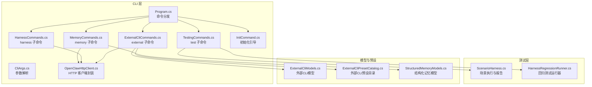
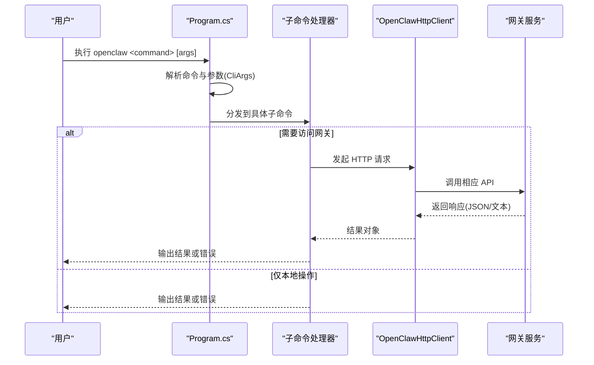
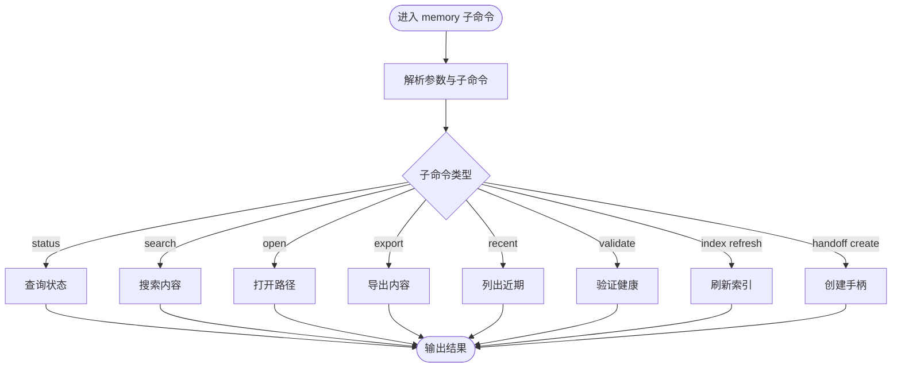
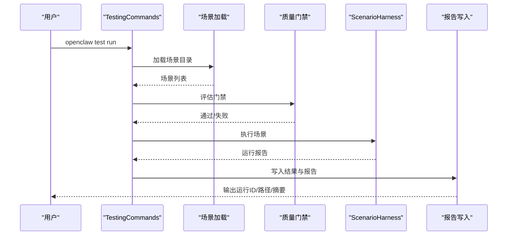
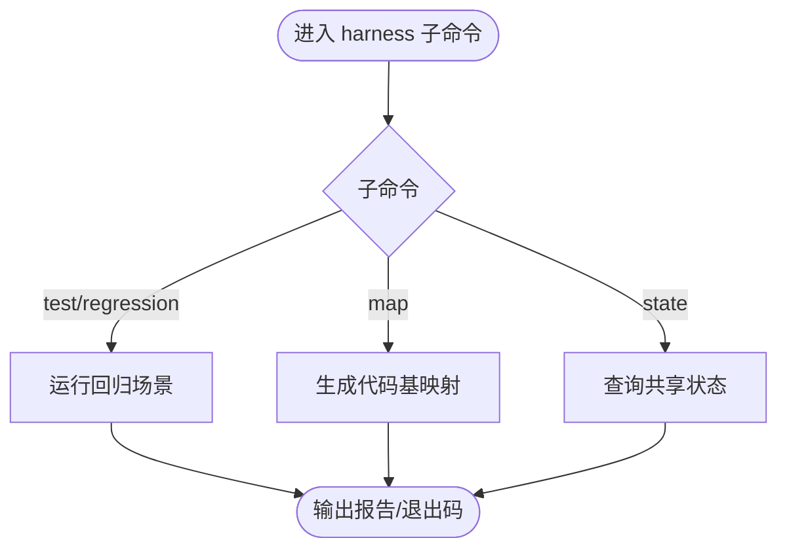
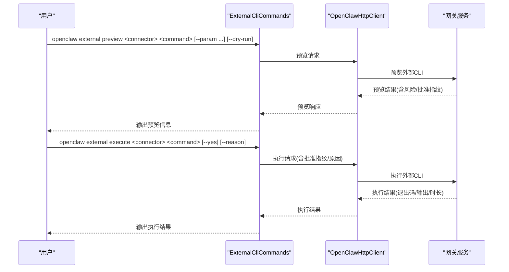
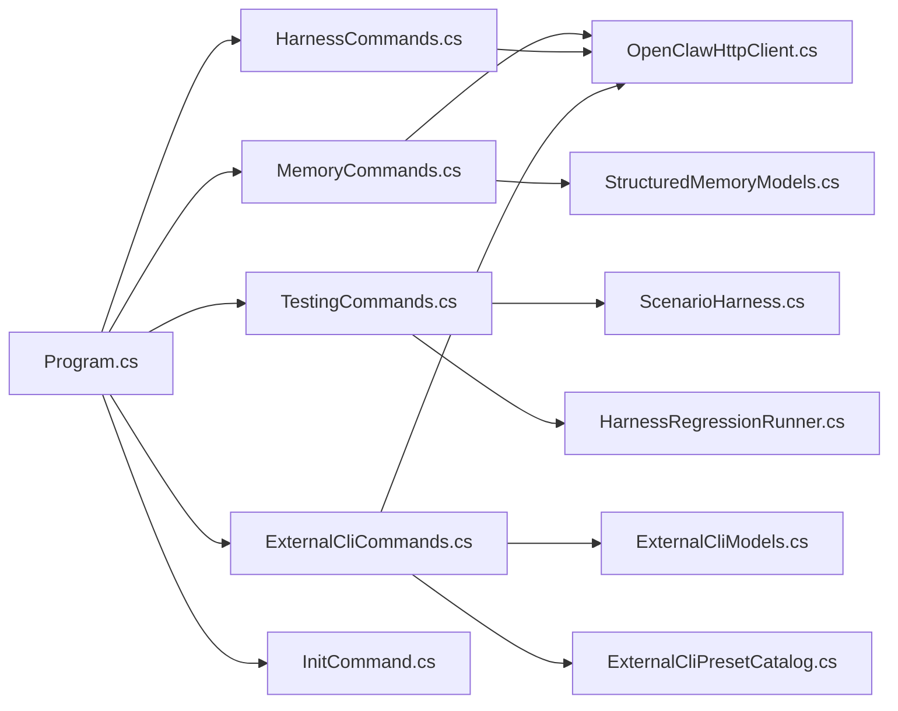

# 实用工具命令

<cite>
**本文引用的文件列表**
- [Program.cs](file://src/OpenClaw.Cli/Program.cs)
- [MemoryCommands.cs](file://src/OpenClaw.Cli/MemoryCommands.cs)
- [TestingCommands.cs](file://src/OpenClaw.Cli/TestingCommands.cs)
- [HarnessCommands.cs](file://src/OpenClaw.Cli/HarnessCommands.cs)
- [ExternalCliCommands.cs](file://src/OpenClaw.Cli/ExternalCliCommands.cs)
- [CliArgs.cs](file://src/OpenClaw.Cli/CliArgs.cs)
- [OpenClawHttpClient.cs](file://src/OpenClaw.Cli/OpenClawHttpClient.cs)
- [InitCommand.cs](file://src/OpenClaw.Cli/InitCommand.cs)
- [ScenarioHarness.cs](file://src/OpenClaw.Testing/ScenarioHarness.cs)
- [HarnessRegressionRunner.cs](file://src/OpenClaw.Testing/HarnessRegressionRunner.cs)
- [ExternalCliModels.cs](file://src/OpenClaw.Core/Models/ExternalCliModels.cs)
- [ExternalCliPresetCatalog.cs](file://src/OpenClaw.Core/ExternalCli/ExternalCliPresetCatalog.cs)
- [StructuredMemoryModels.cs](file://src/OpenClaw.Core/Models/StructuredMemoryModels.cs)
</cite>

## 目录
1. [简介](#简介)
2. [项目结构](#项目结构)
3. [核心组件](#核心组件)
4. [架构总览](#架构总览)
5. [详细组件分析](#详细组件分析)
6. [依赖关系分析](#依赖关系分析)
7. [性能考量](#性能考量)
8. [故障排查指南](#故障排查指南)
9. [结论](#结论)
10. [附录](#附录)

## 简介
本文件面向使用者与维护者，系统化介绍 OpenClaw 的实用工具命令，包括：
- openclaw memory：结构化记忆（Fractal Memory）的查询、打开、导出、最近条目、校验与索引刷新、手柄生成等能力
- openclaw test：基于场景的自动化测试执行、报告生成与质量门禁
- openclaw harness：回归测试、代码基映射与共享测试状态查询
- openclaw external：外部 CLI 连接器的预设、列举、状态、命令、预览与执行

文档覆盖命令入口、参数解析、数据流、错误处理、性能特征与调试诊断，并提供自动化测试框架与持续集成配置建议。

## 项目结构
OpenClaw.Cli 是命令行入口与各子命令实现所在，Testing 提供测试运行与报告能力，Core.Models/ExternalCli 提供外部 CLI 与结构化记忆的数据契约。

图表来源
- [Program.cs:12-69](file://src/OpenClaw.Cli/Program.cs#L12-L69)
- [MemoryCommands.cs:13-107](file://src/OpenClaw.Cli/MemoryCommands.cs#L13-L107)
- [TestingCommands.cs:12-34](file://src/OpenClaw.Cli/TestingCommands.cs#L12-L34)
- [HarnessCommands.cs:14-46](file://src/OpenClaw.Cli/HarnessCommands.cs#L14-L46)
- [ExternalCliCommands.cs:14-112](file://src/OpenClaw.Cli/ExternalCliCommands.cs#L14-L112)
- [CliArgs.cs:14-97](file://src/OpenClaw.Cli/CliArgs.cs#L14-L97)
- [OpenClawHttpClient.cs:6-184](file://src/OpenClaw.Cli/OpenClawHttpClient.cs#L6-L184)
- [ScenarioHarness.cs:123-179](file://src/OpenClaw.Testing/ScenarioHarness.cs#L123-L179)
- [HarnessRegressionRunner.cs:7-68](file://src/OpenClaw.Testing/HarnessRegressionRunner.cs#L7-L68)
- [ExternalCliModels.cs:6-301](file://src/OpenClaw.Core/Models/ExternalCliModels.cs#L6-L301)
- [ExternalCliPresetCatalog.cs:5-405](file://src/OpenClaw.Core/ExternalCli/ExternalCliPresetCatalog.cs#L5-L405)
- [StructuredMemoryModels.cs:3-134](file://src/OpenClaw.Core/Models/StructuredMemoryModels.cs#L3-L134)

章节来源
- [Program.cs:12-69](file://src/OpenClaw.Cli/Program.cs#L12-L69)
- [CliArgs.cs:14-97](file://src/OpenClaw.Cli/CliArgs.cs#L14-L97)

## 核心组件
- 命令分发与帮助输出：Program.cs 负责解析顶层命令并分发到具体子命令；内置 help 输出与版本打印。
- 参数解析：CliArgs.cs 统一解析 --option、--flag、--file、--image、位置参数与 --。
- HTTP 客户端：OpenClawHttpClient.cs 封装对网关 API 的调用，统一认证与基础 URL。
- 初始化：InitCommand.cs 生成本地/公共引导配置与工作区目录，便于快速起步。

章节来源
- [Program.cs:12-69](file://src/OpenClaw.Cli/Program.cs#L12-L69)
- [CliArgs.cs:14-97](file://src/OpenClaw.Cli/CliArgs.cs#L14-L97)
- [OpenClawHttpClient.cs:6-184](file://src/OpenClaw.Cli/OpenClawHttpClient.cs#L6-L184)
- [InitCommand.cs:9-72](file://src/OpenClaw.Cli/InitCommand.cs#L9-L72)

## 架构总览
命令从 Program.cs 进入，经由 CliArgs 解析后，路由到对应子命令模块；部分子命令通过 OpenClawHttpClient 访问网关服务端点，返回结构化结果或触发执行流程。

图表来源
- [Program.cs:25-58](file://src/OpenClaw.Cli/Program.cs#L25-L58)
- [OpenClawHttpClient.cs:68-180](file://src/OpenClaw.Cli/OpenClawHttpClient.cs#L68-L180)

## 详细组件分析

### openclaw memory
用于结构化记忆（Fractal Memory）的查询与管理，支持：
- status：查看启用状态、模式、仓库根、MCP 命令、自动上下文模式、写入可用性与警告/错误
- search：按查询词搜索，可限制数量与作用域
- open：打开指定路径，可选深度与视图（index/state/timeline/decisions/children）
- export：导出指定路径内容，支持多种导出模式
- recent：列出近期变更，默认最近 30 天与限制数量
- validate：验证结构化记忆健康状况
- index refresh：刷新索引
- handoff create：为指定路径创建手柄文件

参数与行为要点
- 支持 --url/--token 或环境变量 OPENCLAW_BASE_URL/OPENCLAW_AUTH_TOKEN
- 支持 --json 输出 JSON
- 按子命令进行必填参数校验与错误提示

图表来源
- [MemoryCommands.cs:13-107](file://src/OpenClaw.Cli/MemoryCommands.cs#L13-L107)

章节来源
- [MemoryCommands.cs:13-107](file://src/OpenClaw.Cli/MemoryCommands.cs#L13-L107)
- [StructuredMemoryModels.cs:3-134](file://src/OpenClaw.Core/Models/StructuredMemoryModels.cs#L3-L134)

### openclaw test
用于执行场景化测试，支持：
- init：初始化测试场景目录与样例场景
- run：加载场景、质量门禁评估、执行场景、生成报告与摘要
- report：基于最新运行结果重新生成 Markdown 报告
- gates：仅评估场景质量门禁，不执行

关键流程
- 场景加载：从 tests/agent-scenarios 目录加载 JSON 场景
- 质量门禁：评估场景完整性与风险等级
- 场景执行：通过 ScenarioHarness 执行脚本化轨迹并逐项 oracle 评估
- 报告生成：输出运行 ID、结果路径、报告路径、摘要统计与高危失败计数
- 失败策略：--fail-on=any 或 high 控制是否将任何失败或高危失败视为失败

图表来源
- [TestingCommands.cs:60-82](file://src/OpenClaw.Cli/TestingCommands.cs#L60-L82)
- [ScenarioHarness.cs:123-179](file://src/OpenClaw.Testing/ScenarioHarness.cs#L123-L179)

章节来源
- [TestingCommands.cs:12-171](file://src/OpenClaw.Cli/TestingCommands.cs#L12-L171)
- [ScenarioHarness.cs:3-179](file://src/OpenClaw.Testing/ScenarioHarness.cs#L3-L179)

### openclaw harness
用于回归测试、代码基映射与共享测试状态查询：
- test/regression：离线运行回归场景，支持分类过滤、严格模式、提案 ID、输出路径
- map：静态扫描代码库生成映射，支持类别、哈希、最近天数、最大文件数
- state：查询共享测试状态列表、详情、会话级状态、冲突检测

图表来源
- [HarnessCommands.cs:14-46](file://src/OpenClaw.Cli/HarnessCommands.cs#L14-L46)
- [HarnessRegressionRunner.cs:18-68](file://src/OpenClaw.Testing/HarnessRegressionRunner.cs#L18-L68)

章节来源
- [HarnessCommands.cs:14-46](file://src/OpenClaw.Cli/HarnessCommands.cs#L14-L46)
- [HarnessRegressionRunner.cs:7-383](file://src/OpenClaw.Testing/HarnessRegressionRunner.cs#L7-L383)

### openclaw external
用于外部 CLI 连接器的集成与安全执行：
- presets：本地列出预设连接器与命令清单
- list/status/commands：列举连接器、查询连接器状态、列出命令
- preview/execute：预览命令参数与风险级别、可选干跑、批准指纹、执行命令

参数解析与安全
- --param key=value 可多次传入，键值对被解析为 JSON 元素
- 高风险或需要批准的命令需 --yes 并在预览后确认
- 支持 --dry-run 进行干跑以评估输出

图表来源
- [ExternalCliCommands.cs:14-112](file://src/OpenClaw.Cli/ExternalCliCommands.cs#L14-L112)
- [OpenClawHttpClient.cs:68-180](file://src/OpenClaw.Cli/OpenClawHttpClient.cs#L68-L180)
- [ExternalCliModels.cs:105-245](file://src/OpenClaw.Core/Models/ExternalCliModels.cs#L105-L245)

章节来源
- [ExternalCliCommands.cs:14-269](file://src/OpenClaw.Cli/ExternalCliCommands.cs#L14-L269)
- [ExternalCliModels.cs:6-301](file://src/OpenClaw.Core/Models/ExternalCliModels.cs#L6-L301)
- [ExternalCliPresetCatalog.cs:5-405](file://src/OpenClaw.Core/ExternalCli/ExternalCliPresetCatalog.cs#L5-L405)

## 依赖关系分析
- Program.cs 作为唯一入口，依赖各子命令模块
- 各子命令依赖 CliArgs 进行参数解析
- 需要网关交互的子命令依赖 OpenClawHttpClient
- 测试相关依赖 Testing 层的 ScenarioHarness 与 HarnessRegressionRunner
- External CLI 与结构化记忆依赖 Core.Models 中的契约模型

图表来源
- [Program.cs:25-58](file://src/OpenClaw.Cli/Program.cs#L25-L58)
- [OpenClawHttpClient.cs:6-184](file://src/OpenClaw.Cli/OpenClawHttpClient.cs#L6-L184)
- [ScenarioHarness.cs:123-179](file://src/OpenClaw.Testing/ScenarioHarness.cs#L123-L179)
- [HarnessRegressionRunner.cs:7-68](file://src/OpenClaw.Testing/HarnessRegressionRunner.cs#L7-L68)
- [ExternalCliModels.cs:6-301](file://src/OpenClaw.Core/Models/ExternalCliModels.cs#L6-L301)
- [ExternalCliPresetCatalog.cs:5-405](file://src/OpenClaw.Core/ExternalCli/ExternalCliPresetCatalog.cs#L5-L405)
- [StructuredMemoryModels.cs:3-134](file://src/OpenClaw.Core/Models/StructuredMemoryModels.cs#L3-L134)

章节来源
- [Program.cs:25-58](file://src/OpenClaw.Cli/Program.cs#L25-L58)

## 性能考量
- 测试执行
  - 场景执行顺序串行，建议在 CI 中拆分矩阵并行运行不同场景集
  - 报告写入与 Markdown 生成为 I/O 密集，注意磁盘空间与并发写入
- 回归测试
  - 默认离线运行，避免网络抖动影响稳定性；严格模式下警告/跳过也会导致失败
  - 临时工作区清理在 finally 中执行，确保资源回收
- 外部 CLI
  - 预览阶段可选择 --dry-run 获取干跑结果，减少真实执行成本
  - 输出截断与超时控制，避免大体量输出造成内存压力
- 结构化记忆
  - search/recent 支持限制数量与作用域，降低检索开销
  - export 支持多种模式，按需选择以平衡体积与可读性

[本节为通用指导，无需特定文件来源]

## 故障排查指南
- 命令未知或参数错误
  - 使用 --help 查看帮助；检查命令拼写与子命令是否存在
  - 对于缺少值的选项，参数解析会抛出异常，检查 --option 后是否跟值
- 认证与连接
  - 未设置 OPENCLAW_BASE_URL 或 OPENCLAW_AUTH_TOKEN，或传参 --url/--token 不正确
  - 网络不通或服务未启动，检查服务端口与防火墙
- 测试失败
  - 使用 openclaw test gates 预先检查场景质量门禁
  - 使用 --fail-on=any 在任何失败时即刻失败，便于快速反馈
- 回归测试
  - 严格模式下警告/跳过也会导致失败，必要时调整 --strict
  - 检查推荐下一步命令，如 setup verify、admin posture、models doctor
- 外部 CLI
  - 高风险命令需 --yes 确认，预览中查看指纹与风险级别
  - 参数解析错误会提示 --param 必须为 key=value 形式
  - 输出截断时关注 stdoutTruncated/stderrTruncated 字段
- 结构化记忆
  - validate 与 index refresh 可定位索引与健康问题
  - search/recent 时使用 --scope 限定范围，提升命中率与性能

章节来源
- [Program.cs:78-83](file://src/OpenClaw.Cli/Program.cs#L78-L83)
- [CliArgs.cs:46-48](file://src/OpenClaw.Cli/CliArgs.cs#L46-L48)
- [TestingCommands.cs:101-114](file://src/OpenClaw.Cli/TestingCommands.cs#L101-L114)
- [HarnessRegressionRunner.cs:70-88](file://src/OpenClaw.Testing/HarnessRegressionRunner.cs#L70-L88)
- [ExternalCliCommands.cs:88-93](file://src/OpenClaw.Cli/ExternalCliCommands.cs#L88-L93)
- [MemoryCommands.cs:83-94](file://src/OpenClaw.Cli/MemoryCommands.cs#L83-L94)

## 结论
openclaw 工具链围绕“命令入口 + 参数解析 + 网关交互 + 测试与回归 + 外部 CLI 集成”构建，既满足日常开发与运维需求，又提供完善的自动化测试与诊断能力。通过 presets、离线回归、严格模式与质量门禁，可在 CI 中稳定落地。

[本节为总结性内容，无需特定文件来源]

## 附录

### 常用命令速查
- openclaw memory fractal status/search/open/export/recent/validate/index refresh/handoff create
- openclaw test init/run/report/gates
- openclaw harness test/regression/map/state
- openclaw external presets/list/status/commands/preview/execute

章节来源
- [Program.cs:85-237](file://src/OpenClaw.Cli/Program.cs#L85-L237)

### 自动化测试框架与 CI 配置建议
- 场景化测试
  - 使用 openclaw test init 生成样例场景与文档目录
  - 在 CI 中运行 openclaw test run，结合 --fail-on 控制失败策略
  - 使用 openclaw test report 生成 Markdown 报告并上传制品
- 回归测试
  - 使用 openclaw harness regression test 进行离线回归
  - 严格模式下 --strict 保证质量门槛
  - 通过推荐命令（setup verify、admin posture、models doctor）闭环问题
- 外部 CLI
  - 使用 openclaw external presets 列出可用预设
  - 使用 preview 评估风险与批准指纹，再以 --yes 执行
- 初始化与环境
  - 使用 openclaw init 生成本地/公共引导配置与工作区
  - 通过环境变量 OPENCLAW_BASE_URL/OPENCLAW_AUTH_TOKEN 或 --url/--token 注入凭据

章节来源
- [TestingCommands.cs:155-171](file://src/OpenClaw.Cli/TestingCommands.cs#L155-L171)
- [HarnessCommands.cs:384-404](file://src/OpenClaw.Cli/HarnessCommands.cs#L384-L404)
- [ExternalCliCommands.cs:248-267](file://src/OpenClaw.Cli/ExternalCliCommands.cs#L248-L267)
- [InitCommand.cs:74-87](file://src/OpenClaw.Cli/InitCommand.cs#L74-L87)