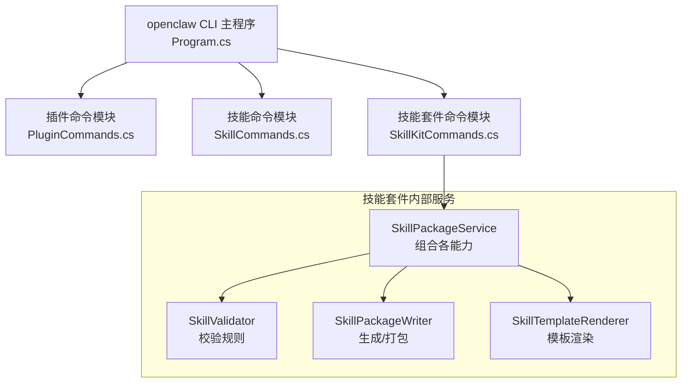
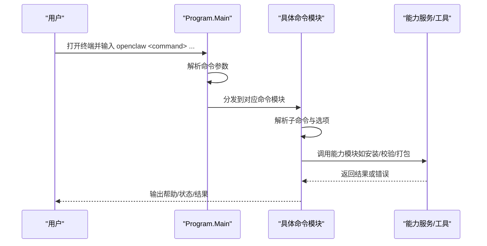
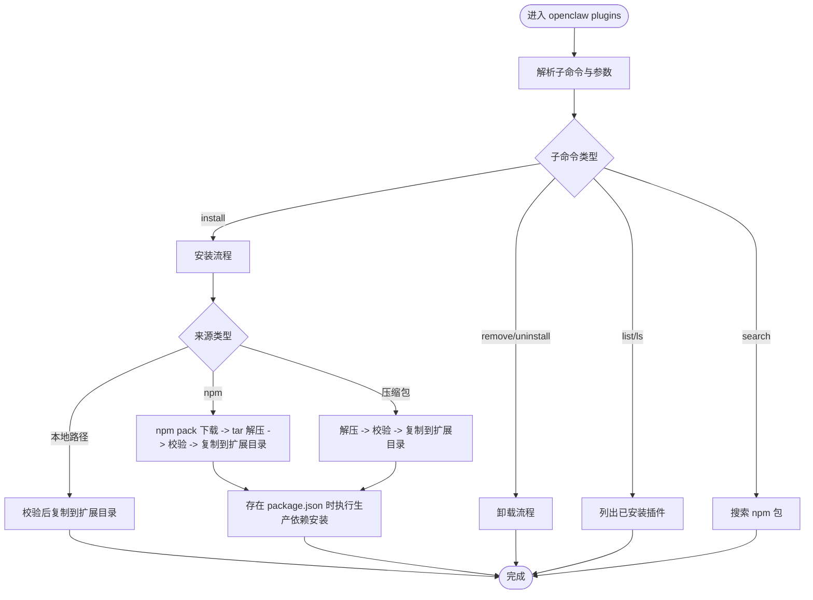
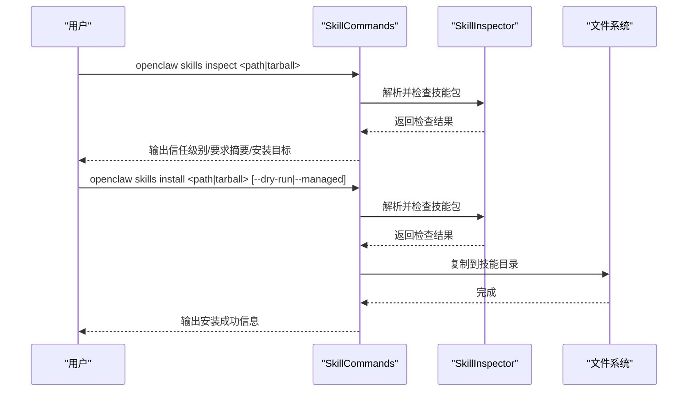
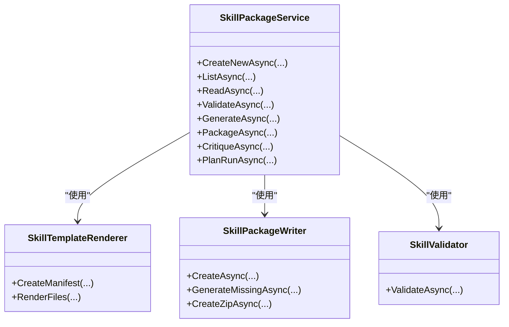
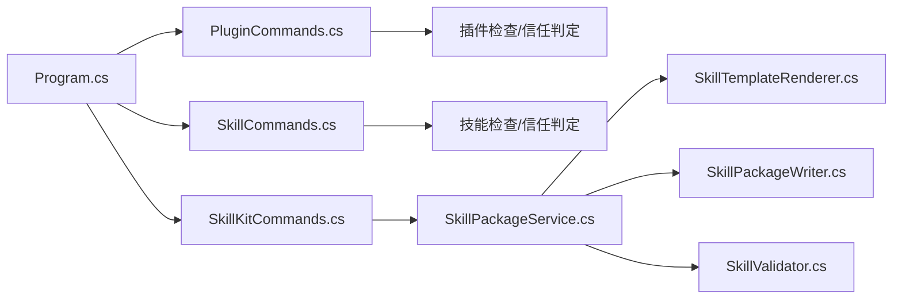

# 插件和技能命令

<cite>
**本文档引用的文件**
- [src/OpenClaw.Cli/Program.cs](file://src/OpenClaw.Cli/Program.cs)
- [src/OpenClaw.Cli/PluginCommands.cs](file://src/OpenClaw.Cli/PluginCommands.cs)
- [src/OpenClaw.Cli/SkillCommands.cs](file://src/OpenClaw.Cli/SkillCommands.cs)
- [src/OpenClaw.Cli/SkillKitCommands.cs](file://src/OpenClaw.Cli/SkillKitCommands.cs)
- [src/OpenClaw.SkillKit/SkillPackageService.cs](file://src/OpenClaw.SkillKit/SkillPackageService.cs)
- [src/OpenClaw.SkillKit/SkillValidator.cs](file://src/OpenClaw.SkillKit/SkillValidator.cs)
- [src/OpenClaw.SkillKit/SkillPackageWriter.cs](file://src/OpenClaw.SkillKit/SkillPackageWriter.cs)
- [src/OpenClaw.SkillKit/SkillTemplateRenderer.cs](file://src/OpenClaw.SkillKit/SkillTemplateRenderer.cs)
- [src/OpenClaw.SkillKit.Abstractions/SkillKitModels.cs](file://src/OpenClaw.SkillKit.Abstractions/SkillKitModels.cs)
- [README.md](file://README.md)
</cite>

## 目录
1. [简介](#简介)
2. [项目结构](#项目结构)
3. [核心组件](#核心组件)
4. [架构总览](#架构总览)
5. [详细组件分析](#详细组件分析)
6. [依赖关系分析](#依赖关系分析)
7. [性能考虑](#性能考虑)
8. [故障排除指南](#故障排除指南)
9. [结论](#结论)
10. [附录](#附录)

## 简介
本文件面向插件与技能的开发者与运维人员，系统化梳理 openclaw 命令行工具中与插件（plugins）和技能（skills/skill kit）相关的开发与管理工作流。内容覆盖：
- 插件安装、卸载、搜索与列表展示的完整流程
- 技能包的创建、校验、打包与发布的工作流
- 插件与技能开发模板、质量保证流程与最佳实践
- CLI 命令入口与子命令分发机制

## 项目结构
openclaw CLI 将不同领域的管理命令通过统一入口进行分发，插件与技能相关命令分别由独立的命令模块实现，并在主程序中注册。

图示来源
- [src/OpenClaw.Cli/Program.cs:52-54](file://src/OpenClaw.Cli/Program.cs#L52-L54)
- [src/OpenClaw.Cli/PluginCommands.cs:18-37](file://src/OpenClaw.Cli/PluginCommands.cs#L18-L37)
- [src/OpenClaw.Cli/SkillCommands.cs:10-28](file://src/OpenClaw.Cli/SkillCommands.cs#L10-L28)
- [src/OpenClaw.Cli/SkillKitCommands.cs:8-42](file://src/OpenClaw.Cli/SkillKitCommands.cs#L8-L42)
- [src/OpenClaw.SkillKit/SkillPackageService.cs:6-27](file://src/OpenClaw.SkillKit/SkillPackageService.cs#L6-L27)

章节来源
- [src/OpenClaw.Cli/Program.cs:52-54](file://src/OpenClaw.Cli/Program.cs#L52-L54)
- [src/OpenClaw.Cli/PluginCommands.cs:18-37](file://src/OpenClaw.Cli/PluginCommands.cs#L18-L37)
- [src/OpenClaw.Cli/SkillCommands.cs:10-28](file://src/OpenClaw.Cli/SkillCommands.cs#L10-L28)
- [src/OpenClaw.Cli/SkillKitCommands.cs:8-42](file://src/OpenClaw.Cli/SkillKitCommands.cs#L8-L42)

## 核心组件
- 插件命令模块：负责插件的安装、卸载、列表与搜索，支持从 npm/ClawHub 安装或从本地路径/压缩包安装，并内置安装前检查与信任级别判定。
- 技能命令模块：负责技能包的检查、安装与列表，支持从本地目录或压缩包安装，提供信任级别与要求摘要输出。
- 技能套件命令模块：提供技能包的创建、校验、生成缺失文件、打包与运行计划（dry-run）等能力，围绕 SkillKit 的服务层进行封装。
- 技能套件服务层：由 SkillPackageService 组合模板渲染、读取、写入、校验、评论与运行计划等能力，形成可复用的服务接口。

章节来源
- [src/OpenClaw.Cli/PluginCommands.cs:14-37](file://src/OpenClaw.Cli/PluginCommands.cs#L14-L37)
- [src/OpenClaw.Cli/SkillCommands.cs:6-28](file://src/OpenClaw.Cli/SkillCommands.cs#L6-L28)
- [src/OpenClaw.Cli/SkillKitCommands.cs:6-42](file://src/OpenClaw.Cli/SkillKitCommands.cs#L6-L42)
- [src/OpenClaw.SkillKit/SkillPackageService.cs:6-27](file://src/OpenClaw.SkillKit/SkillPackageService.cs#L6-L27)

## 架构总览
openclaw CLI 采用“主程序分发 + 子模块执行”的模式。主程序根据第一个参数选择具体命令模块；每个命令模块内部再解析子命令与参数，调用相应的能力模块完成任务。

图示来源
- [src/OpenClaw.Cli/Program.cs:12-69](file://src/OpenClaw.Cli/Program.cs#L12-L69)
- [src/OpenClaw.Cli/PluginCommands.cs:18-37](file://src/OpenClaw.Cli/PluginCommands.cs#L18-L37)
- [src/OpenClaw.Cli/SkillCommands.cs:10-28](file://src/OpenClaw.Cli/SkillCommands.cs#L10-L28)
- [src/OpenClaw.Cli/SkillKitCommands.cs:11-42](file://src/OpenClaw.Cli/SkillKitCommands.cs#L11-L42)

## 详细组件分析

### 插件命令模块（openclaw plugins）
职责与流程
- 支持子命令：install、remove/uninstall、list/ls、search
- 安装流程：支持从 npm/ClawHub 或本地路径/压缩包安装；安装前进行候选包检查（清单、入口文件、声明表面、配置校验），并计算信任级别与兼容性状态
- 卸载流程：删除扩展目录中的插件目录，提示重启网关生效
- 列表流程：扫描扩展目录，发现已安装插件并输出清单、信任级别与声明表面摘要
- 搜索流程：调用 npm search 查询插件包信息

图示来源
- [src/OpenClaw.Cli/PluginCommands.cs:18-37](file://src/OpenClaw.Cli/PluginCommands.cs#L18-L37)
- [src/OpenClaw.Cli/PluginCommands.cs:39-62](file://src/OpenClaw.Cli/PluginCommands.cs#L39-L62)
- [src/OpenClaw.Cli/PluginCommands.cs:244-273](file://src/OpenClaw.Cli/PluginCommands.cs#L244-L273)
- [src/OpenClaw.Cli/PluginCommands.cs:275-317](file://src/OpenClaw.Cli/PluginCommands.cs#L275-L317)
- [src/OpenClaw.Cli/PluginCommands.cs:319-364](file://src/OpenClaw.Cli/PluginCommands.cs#L319-L364)

章节来源
- [src/OpenClaw.Cli/PluginCommands.cs:14-37](file://src/OpenClaw.Cli/PluginCommands.cs#L14-L37)
- [src/OpenClaw.Cli/PluginCommands.cs:39-62](file://src/OpenClaw.Cli/PluginCommands.cs#L39-L62)
- [src/OpenClaw.Cli/PluginCommands.cs:244-273](file://src/OpenClaw.Cli/PluginCommands.cs#L244-L273)
- [src/OpenClaw.Cli/PluginCommands.cs:275-317](file://src/OpenClaw.Cli/PluginCommands.cs#L275-L317)
- [src/OpenClaw.Cli/PluginCommands.cs:319-364](file://src/OpenClaw.Cli/PluginCommands.cs#L319-L364)

### 技能命令模块（openclaw skills）
职责与流程
- 支持子命令：inspect、install、list/ls
- 检查流程：支持对本地目录或压缩包进行技能包检查，输出信任级别、来源标签、要求摘要等
- 安装流程：支持干运行（--dry-run）与托管安装（--managed），将技能包复制到目标目录
- 列表流程：扫描技能目录，输出已安装技能清单与信任级别

图示来源
- [src/OpenClaw.Cli/SkillCommands.cs:10-28](file://src/OpenClaw.Cli/SkillCommands.cs#L10-L28)
- [src/OpenClaw.Cli/SkillCommands.cs:30-92](file://src/OpenClaw.Cli/SkillCommands.cs#L30-L92)
- [src/OpenClaw.Cli/SkillCommands.cs:94-129](file://src/OpenClaw.Cli/SkillCommands.cs#L94-L129)
- [src/OpenClaw.Cli/SkillCommands.cs:131-187](file://src/OpenClaw.Cli/SkillCommands.cs#L131-L187)

章节来源
- [src/OpenClaw.Cli/SkillCommands.cs:6-28](file://src/OpenClaw.Cli/SkillCommands.cs#L6-L28)
- [src/OpenClaw.Cli/SkillCommands.cs:30-92](file://src/OpenClaw.Cli/SkillCommands.cs#L30-L92)
- [src/OpenClaw.Cli/SkillCommands.cs:94-129](file://src/OpenClaw.Cli/SkillCommands.cs#L94-L129)
- [src/OpenClaw.Cli/SkillCommands.cs:131-187](file://src/OpenClaw.Cli/SkillCommands.cs#L131-L187)

### 技能套件命令模块（openclaw skill）
职责与流程
- 支持子命令：new、list/ls、validate、critique、generate、package、run
- 创建：基于模板生成技能包骨架，自动填充清单与文档
- 校验：对技能包进行完整性与策略一致性检查
- 生成：按模板生成缺失文件
- 打包：将技能包压缩为 zip，便于发布
- 运行计划：在不实际执行的情况下生成运行计划与输入校验报告

图示来源
- [src/OpenClaw.SkillKit/SkillPackageService.cs:6-27](file://src/OpenClaw.SkillKit/SkillPackageService.cs#L6-L27)
- [src/OpenClaw.SkillKit/SkillTemplateRenderer.cs:21-57](file://src/OpenClaw.SkillKit/SkillTemplateRenderer.cs#L21-L57)
- [src/OpenClaw.SkillKit/SkillPackageWriter.cs:9-25](file://src/OpenClaw.SkillKit/SkillPackageWriter.cs#L9-L25)
- [src/OpenClaw.SkillKit/SkillValidator.cs:7-78](file://src/OpenClaw.SkillKit/SkillValidator.cs#L7-L78)

章节来源
- [src/OpenClaw.Cli/SkillKitCommands.cs:8-42](file://src/OpenClaw.Cli/SkillKitCommands.cs#L8-L42)
- [src/OpenClaw.SkillKit/SkillPackageService.cs:6-75](file://src/OpenClaw.SkillKit/SkillPackageService.cs#L6-L75)
- [src/OpenClaw.SkillKit/SkillTemplateRenderer.cs:21-73](file://src/OpenClaw.SkillKit/SkillTemplateRenderer.cs#L21-L73)
- [src/OpenClaw.SkillKit/SkillPackageWriter.cs:9-61](file://src/OpenClaw.SkillKit/SkillPackageWriter.cs#L9-L61)
- [src/OpenClaw.SkillKit/SkillValidator.cs:7-78](file://src/OpenClaw.SkillKit/SkillValidator.cs#L7-L78)

## 依赖关系分析
- 命令入口依赖：Program.cs 将 openclaw plugins/skill/skills 分发到对应模块
- 插件命令依赖：PluginCommands 依赖插件发现与清单解析能力，以及 npm/tar 工具调用
- 技能命令依赖：SkillCommands 依赖技能检查器与文件系统操作
- 技能套件服务依赖：SkillPackageService 组合模板渲染、读写、校验与运行计划能力

图示来源
- [src/OpenClaw.Cli/Program.cs:52-54](file://src/OpenClaw.Cli/Program.cs#L52-L54)
- [src/OpenClaw.Cli/PluginCommands.cs:511-660](file://src/OpenClaw.Cli/PluginCommands.cs#L511-L660)
- [src/OpenClaw.Cli/SkillCommands.cs:189-221](file://src/OpenClaw.Cli/SkillCommands.cs#L189-L221)
- [src/OpenClaw.SkillKit/SkillPackageService.cs:6-27](file://src/OpenClaw.SkillKit/SkillPackageService.cs#L6-L27)

章节来源
- [src/OpenClaw.Cli/Program.cs:52-54](file://src/OpenClaw.Cli/Program.cs#L52-L54)
- [src/OpenClaw.Cli/PluginCommands.cs:511-660](file://src/OpenClaw.Cli/PluginCommands.cs#L511-L660)
- [src/OpenClaw.Cli/SkillCommands.cs:189-221](file://src/OpenClaw.Cli/SkillCommands.cs#L189-L221)
- [src/OpenClaw.SkillKit/SkillPackageService.cs:6-27](file://src/OpenClaw.SkillKit/SkillPackageService.cs#L6-L27)

## 性能考虑
- 安装流程中的 npm pack 与 tar 解压可能产生临时目录与磁盘 IO，建议在空闲时段执行或确保磁盘空间充足
- 干运行（--dry-run）与检查（inspect）避免了实际安装与执行，适合在 CI/预发布阶段快速验证
- 技能包打包采用最小压缩以减少体积，建议在发布前进行二次校验

## 故障排除指南
常见问题与处理
- npm 命令未找到：检查系统是否安装 npm，或在 PATH 中可用
- 插件安装失败：查看安装前检查输出（错误计数/警告计数），修复清单或入口文件后再试
- 技能包安装失败：确认技能包根目录与清单 ID/别名一致，必要时使用 --force 强制覆盖
- 权限不足：确保对扩展目录与技能目录具有读写权限

章节来源
- [src/OpenClaw.Cli/PluginCommands.cs:425-458](file://src/OpenClaw.Cli/PluginCommands.cs#L425-L458)
- [src/OpenClaw.Cli/SkillCommands.cs:323-355](file://src/OpenClaw.Cli/SkillCommands.cs#L323-L355)

## 结论
openclaw CLI 提供了从插件到技能的全生命周期管理能力：从安装、检查、打包到发布，均以命令行形式提供清晰的流程与反馈。结合技能套件的服务层，开发者可以高效地构建、验证与发布高质量的技能包；同时，插件命令模块提供了安全可控的安装与信任评估机制，保障在不同运行模式下的兼容性与安全性。

## 附录

### 命令速查与最佳实践
- 插件管理
  - 安装：支持 npm/ClawHub 与本地路径/压缩包安装，建议先使用 --dry-run 预检
  - 卸载：删除扩展目录对应插件，重启网关生效
  - 列表：查看已安装插件与信任级别
  - 搜索：在 npm 上检索插件包
- 技能管理
  - 检查：inspect 用于预览技能包结构与要求
  - 安装：支持托管安装与干运行，便于在 CI 中验证
  - 列表：查看已安装技能与来源
- 技能套件
  - 创建：基于模板生成骨架，随后进行 validate/critique/generate/package/run
  - 校验：关注必填项与策略冲突，确保清单与工作流有效
  - 打包：生成 zip 便于分发与版本管理
  - 运行计划：dry-run 可提前暴露输入缺失与工具策略问题

章节来源
- [src/OpenClaw.Cli/Program.cs:209-224](file://src/OpenClaw.Cli/Program.cs#L209-L224)
- [src/OpenClaw.Cli/PluginCommands.cs:485-509](file://src/OpenClaw.Cli/PluginCommands.cs#L485-L509)
- [src/OpenClaw.Cli/SkillCommands.cs:374-388](file://src/OpenClaw.Cli/SkillCommands.cs#L374-L388)
- [src/OpenClaw.Cli/SkillKitCommands.cs:294-313](file://src/OpenClaw.Cli/SkillKitCommands.cs#L294-L313)