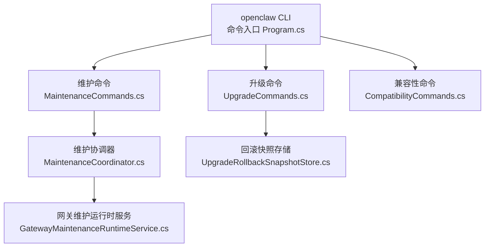
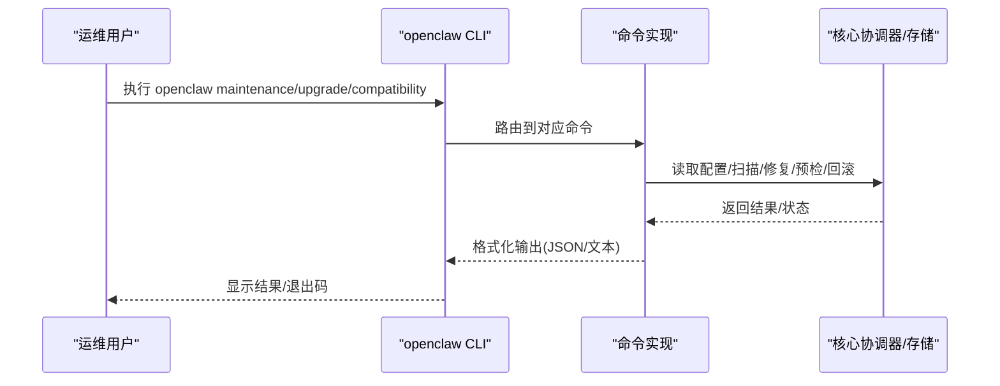
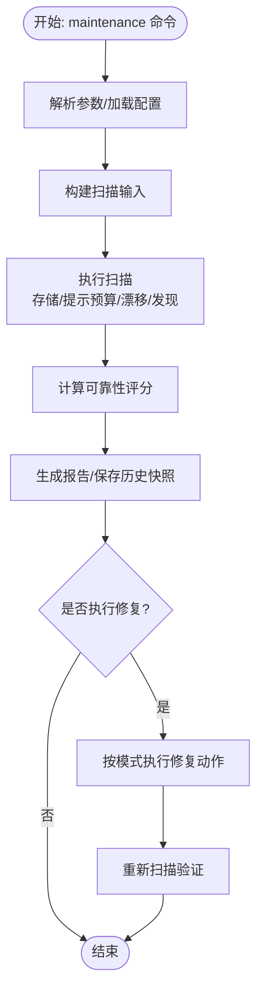
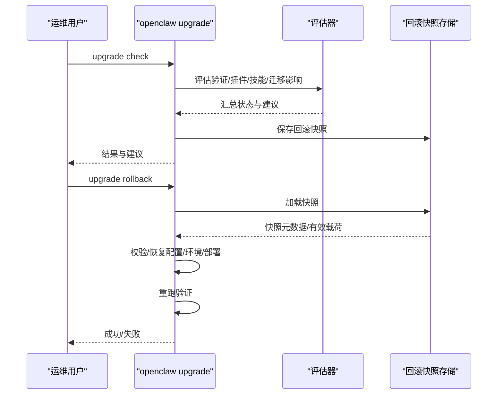
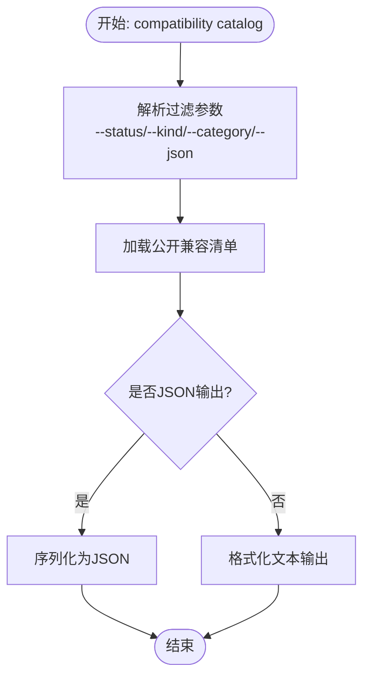
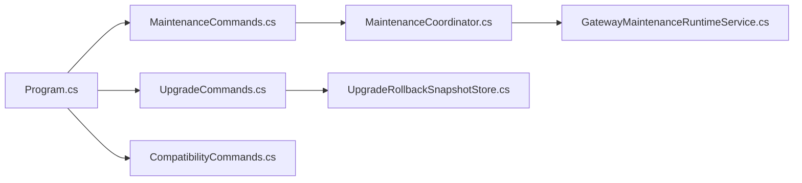

# 管理命令

<cite>
**本文档引用的文件**
- [Program.cs](file://src/OpenClaw.Cli/Program.cs)
- [MaintenanceCommands.cs](file://src/OpenClaw.Cli/MaintenanceCommands.cs)
- [UpgradeCommands.cs](file://src/OpenClaw.Cli/UpgradeCommands.cs)
- [CompatibilityCommands.cs](file://src/OpenClaw.Cli/CompatibilityCommands.cs)
- [MaintenanceCoordinator.cs](file://src/OpenClaw.Core/Setup/MaintenanceCoordinator.cs)
- [UpgradeRollbackSnapshotStore.cs](file://src/OpenClaw.Core/Setup/UpgradeRollbackSnapshotStore.cs)
- [GatewayMaintenanceRuntimeService.cs](file://src/OpenClaw.Gateway/GatewayMaintenanceRuntimeService.cs)
- [COMPATIBILITY.md](file://docs/COMPATIBILITY.md)
- [README.md](file://README.md)
- [scripts/README.md](file://scripts/README.md)
</cite>

## 目录
1. [简介](#简介)
2. [项目结构](#项目结构)
3. [核心组件](#核心组件)
4. [架构总览](#架构总览)
5. [详细组件分析](#详细组件分析)
6. [依赖关系分析](#依赖关系分析)
7. [性能考虑](#性能考虑)
8. [故障排查指南](#故障排查指南)
9. [结论](#结论)
10. [附录](#附录)

## 简介
本文件面向运维与维护工程师，系统化梳理 openclaw CLI 中的管理命令：openclaw maintenance、openclaw upgrade、openclaw compatibility。内容覆盖功能说明、使用方法、系统维护、版本升级、兼容性检查、故障诊断、备份恢复、性能优化与安全加固，并提供自动化运维脚本与监控告警配置示例，帮助在生产环境中稳定运行与演进。

## 项目结构
openclaw CLI 将各子命令分层组织：
- 命令入口与帮助：Program.cs
- 维护命令：MaintenanceCommands.cs
- 升级命令：UpgradeCommands.cs
- 兼容性命令：CompatibilityCommands.cs
- 核心实现：
  - 维护扫描与修复：MaintenanceCoordinator.cs
  - 升级回滚快照存储：UpgradeRollbackSnapshotStore.cs
  - 网关侧维护运行时服务：GatewayMaintenanceRuntimeService.cs
- 文档与脚本：
  - 插件兼容性指南：docs/COMPATIBILITY.md
  - 仓库脚本说明：scripts/README.md

**图表来源**
- [Program.cs:12-83](file://src/OpenClaw.Cli/Program.cs#L12-L83)
- [MaintenanceCommands.cs:10-63](file://src/OpenClaw.Cli/MaintenanceCommands.cs#L10-L63)
- [UpgradeCommands.cs:12-28](file://src/OpenClaw.Cli/UpgradeCommands.cs#L12-L28)
- [CompatibilityCommands.cs:9-28](file://src/OpenClaw.Cli/CompatibilityCommands.cs#L9-L28)
- [MaintenanceCoordinator.cs:27-100](file://src/OpenClaw.Core/Setup/MaintenanceCoordinator.cs#L27-L100)
- [UpgradeRollbackSnapshotStore.cs:8-27](file://src/OpenClaw.Core/Setup/UpgradeRollbackSnapshotStore.cs#L8-L27)
- [GatewayMaintenanceRuntimeService.cs:37-66](file://src/OpenClaw.Gateway/GatewayMaintenanceRuntimeService.cs#L37-L66)

**章节来源**
- [Program.cs:85-237](file://src/OpenClaw.Cli/Program.cs#L85-L237)

## 核心组件
- openclaw maintenance
  - scan：生成维护报告，包含可靠性评分、存储占用、提示预算、漂移指标与发现项
  - fix：按模式执行清理与修复（保留策略、元数据清理、模型评估与提示缓存痕迹清理）
- openclaw upgrade
  - check：升级预检，整合设置验证、插件兼容、技能兼容、迁移影响与回滚快照
  - rollback：恢复上次已知良好状态并重跑验证
- openclaw compatibility
  - catalog：列出公开兼容场景清单，支持过滤与 JSON 输出

**章节来源**
- [Program.cs:310-320](file://src/OpenClaw.Cli/Program.cs#L310-L320)
- [Program.cs:398-416](file://src/OpenClaw.Cli/Program.cs#L398-L416)
- [Program.cs:92-107](file://src/OpenClaw.Cli/Program.cs#L92-L107)

## 架构总览
openclaw CLI 通过 Program.cs 路由到具体命令实现；维护与升级命令进一步委托给核心协调器与存储模块，形成“命令层 → 协调器/存储层 → 系统状态”的清晰分层。

**图表来源**
- [Program.cs:25-58](file://src/OpenClaw.Cli/Program.cs#L25-L58)
- [MaintenanceCommands.cs:10-63](file://src/OpenClaw.Cli/MaintenanceCommands.cs#L10-L63)
- [UpgradeCommands.cs:12-28](file://src/OpenClaw.Cli/UpgradeCommands.cs#L12-L28)
- [CompatibilityCommands.cs:9-28](file://src/OpenClaw.Cli/CompatibilityCommands.cs#L9-L28)

## 详细组件分析

### openclaw maintenance 组件分析
- 功能要点
  - scan：聚合存储、提示预算、漂移与模型医生等指标，生成可靠性评分与发现项
  - fix：支持 dry-run，按 apply 模式选择性执行清理动作
- 关键流程
  - 维护扫描：读取配置与状态，构建扫描输入，计算存储快照、提示预算、漂移，汇总发现，计算可靠性
  - 维护修复：根据 apply 模式执行保留策略、元数据清理、模型评估与提示缓存痕迹清理

**图表来源**
- [MaintenanceCommands.cs:35-63](file://src/OpenClaw.Cli/MaintenanceCommands.cs#L35-L63)
- [MaintenanceCoordinator.cs:40-100](file://src/OpenClaw.Core/Setup/MaintenanceCoordinator.cs#L40-L100)
- [MaintenanceCoordinator.cs:102-173](file://src/OpenClaw.Core/Setup/MaintenanceCoordinator.cs#L102-L173)

**章节来源**
- [MaintenanceCommands.cs:10-113](file://src/OpenClaw.Cli/MaintenanceCommands.cs#L10-L113)
- [MaintenanceCoordinator.cs:27-100](file://src/OpenClaw.Core/Setup/MaintenanceCoordinator.cs#L27-L100)
- [MaintenanceCoordinator.cs:102-173](file://src/OpenClaw.Core/Setup/MaintenanceCoordinator.cs#L102-L173)
- [GatewayMaintenanceRuntimeService.cs:37-66](file://src/OpenClaw.Gateway/GatewayMaintenanceRuntimeService.cs#L37-L66)

### openclaw upgrade 组件分析
- 功能要点
  - check：综合设置验证、插件兼容、技能兼容、迁移风险与回滚快照生成
  - rollback：安全恢复上次已知良好状态，重跑验证
- 关键流程
  - 升级预检：加载配置与工作区，评估验证、插件、技能、迁移影响与回滚快照
  - 回滚恢复：校验快照有效性，逐项恢复配置、环境示例与部署目录

**图表来源**
- [UpgradeCommands.cs:30-106](file://src/OpenClaw.Cli/UpgradeCommands.cs#L30-L106)
- [UpgradeCommands.cs:108-162](file://src/OpenClaw.Cli/UpgradeCommands.cs#L108-L162)
- [UpgradeRollbackSnapshotStore.cs:39-89](file://src/OpenClaw.Core/Setup/UpgradeRollbackSnapshotStore.cs#L39-L89)

**章节来源**
- [UpgradeCommands.cs:10-28](file://src/OpenClaw.Cli/UpgradeCommands.cs#L10-L28)
- [UpgradeCommands.cs:30-106](file://src/OpenClaw.Cli/UpgradeCommands.cs#L30-L106)
- [UpgradeCommands.cs:108-162](file://src/OpenClaw.Cli/UpgradeCommands.cs#L108-L162)
- [UpgradeRollbackSnapshotStore.cs:8-27](file://src/OpenClaw.Core/Setup/UpgradeRollbackSnapshotStore.cs#L8-L27)

### openclaw compatibility 组件分析
- 功能要点
  - catalog：列出公开兼容场景清单，支持按状态、类型、分类过滤，支持 JSON 输出
- 使用场景
  - 在升级或集成新能力前，先查询兼容性清单，避免不支持的桥接面

**图表来源**
- [CompatibilityCommands.cs:30-72](file://src/OpenClaw.Cli/CompatibilityCommands.cs#L30-L72)

**章节来源**
- [CompatibilityCommands.cs:9-107](file://src/OpenClaw.Cli/CompatibilityCommands.cs#L9-L107)
- [COMPATIBILITY.md:1-131](file://docs/COMPATIBILITY.md#L1-L131)

## 依赖关系分析
- 命令层依赖
  - Program.cs 路由到各命令实现
  - 维护命令依赖 MaintenanceCoordinator 执行扫描与修复
  - 升级命令依赖 UpgradeRollbackSnapshotStore 进行快照持久化与恢复
- 运行时集成
  - GatewayMaintenanceRuntimeService 复用 MaintenanceCoordinator 提供网关侧维护能力

**图表来源**
- [Program.cs:25-58](file://src/OpenClaw.Cli/Program.cs#L25-L58)
- [MaintenanceCommands.cs:10-63](file://src/OpenClaw.Cli/MaintenanceCommands.cs#L10-L63)
- [UpgradeCommands.cs:12-28](file://src/OpenClaw.Cli/UpgradeCommands.cs#L12-L28)
- [CompatibilityCommands.cs:9-28](file://src/OpenClaw.Cli/CompatibilityCommands.cs#L9-L28)
- [MaintenanceCoordinator.cs:27-100](file://src/OpenClaw.Core/Setup/MaintenanceCoordinator.cs#L27-L100)
- [UpgradeRollbackSnapshotStore.cs:8-27](file://src/OpenClaw.Core/Setup/UpgradeRollbackSnapshotStore.cs#L8-L27)
- [GatewayMaintenanceRuntimeService.cs:37-66](file://src/OpenClaw.Gateway/GatewayMaintenanceRuntimeService.cs#L37-L66)

**章节来源**
- [Program.cs:85-237](file://src/OpenClaw.Cli/Program.cs#L85-L237)

## 性能考虑
- 维护扫描
  - 存储快照遍历目录统计大小，建议定期清理大体积日志与缓存
  - 提示预算基于近期回合估算，关注 AGENTS.md/SOUL.md 规模对上下文的影响
- 升级预检
  - 插件与技能检查可能涉及磁盘扫描与外部依赖探测，建议在低峰时段执行
- 回滚快照
  - 快照持久化采用临时目录替换策略，注意磁盘空间与权限

[本节为通用指导，无需特定文件引用]

## 故障排查指南
- 维护命令
  - scan/fix 失败：检查配置路径与权限，查看可靠性评分与发现项建议
  - 修复警告：关注返回的警告列表，确认 dry-run 后再执行实际修复
- 升级命令
  - check 失败：根据各检查项的建议先行处理（插件/技能/迁移风险）
  - rollback 失败：检查快照文件完整性与权限，必要时删除损坏快照后重新生成
- 兼容性命令
  - catalog 输出为空：调整过滤条件或使用 --json 获取完整清单

**章节来源**
- [MaintenanceCommands.cs:35-63](file://src/OpenClaw.Cli/MaintenanceCommands.cs#L35-L63)
- [MaintenanceCoordinator.cs:102-173](file://src/OpenClaw.Core/Setup/MaintenanceCoordinator.cs#L102-L173)
- [UpgradeCommands.cs:108-162](file://src/OpenClaw.Cli/UpgradeCommands.cs#L108-L162)
- [UpgradeRollbackSnapshotStore.cs:45-89](file://src/OpenClaw.Core/Setup/UpgradeRollbackSnapshotStore.cs#L45-L89)
- [CompatibilityCommands.cs:30-72](file://src/OpenClaw.Cli/CompatibilityCommands.cs#L30-L72)

## 结论
openclaw 的管理命令围绕“可观测—可诊断—可恢复”设计：通过维护命令持续优化运行状态，通过升级命令安全演进，通过兼容性命令降低集成风险。结合本文提供的流程、脚本与最佳实践，可在生产环境中实现稳健的运维与维护。

[本节为总结性内容，无需特定文件引用]

## 附录

### 常用命令速查
- openclaw maintenance
  - scan：生成维护报告
  - fix --dry-run：预演修复
  - fix --apply all/metadata/artifacts/retention：按类别执行修复
- openclaw upgrade
  - check：升级预检
  - rollback：回滚到上次已知良好状态
- openclaw compatibility
  - catalog [--status/--kind/--category/--json]：列出兼容场景

**章节来源**
- [Program.cs:310-320](file://src/OpenClaw.Cli/Program.cs#L310-L320)
- [Program.cs:398-416](file://src/OpenClaw.Cli/Program.cs#L398-L416)
- [Program.cs:92-107](file://src/OpenClaw.Cli/Program.cs#L92-L107)

### 自动化运维脚本与监控告警示例
- 镜像构建与校验脚本
  - 参考仓库脚本说明，按依赖变更与日常迭代分别使用基础镜像与应用镜像构建脚本
- 运维建议
  - 定期执行 openclaw maintenance scan，将结果纳入监控看板
  - 在升级窗口执行 openclaw upgrade check 并生成回滚快照
  - 使用 openclaw compatibility catalog 作为集成决策依据
  - 将关键命令输出与退出码接入监控告警（如 Reliability Score 低于阈值触发告警）

**章节来源**
- [scripts/README.md:1-255](file://scripts/README.md#L1-L255)
- [README.md](file://README.md)