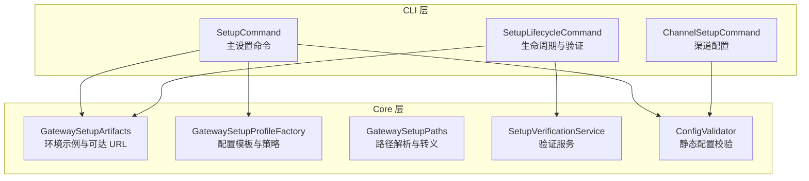
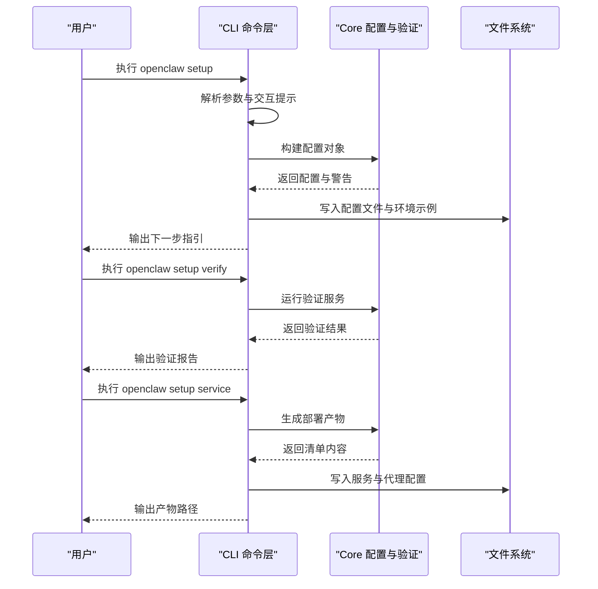
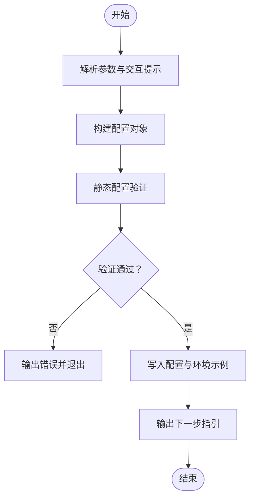
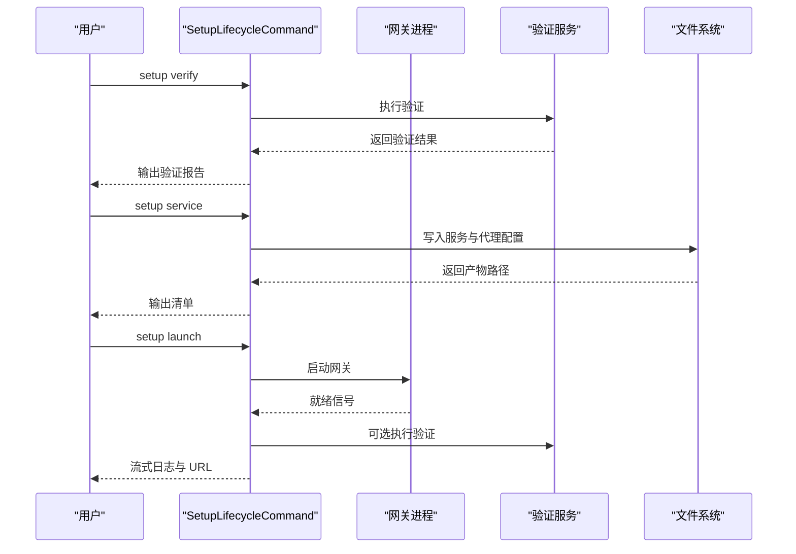
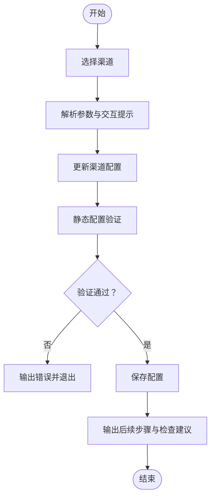
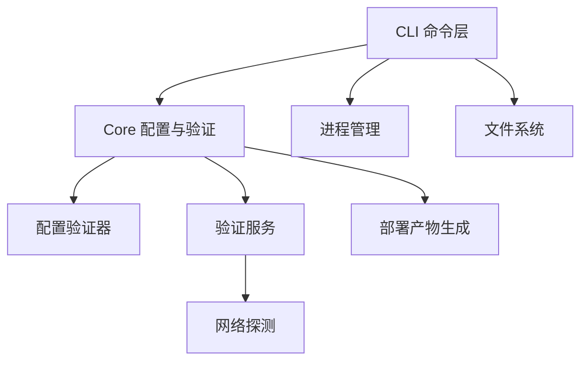

# 设置命令

<cite>
**本文档引用的文件**
- [SetupCommand.cs](file://src/OpenClaw.Cli/SetupCommand.cs)
- [SetupLifecycleCommand.cs](file://src/OpenClaw.Cli/SetupLifecycleCommand.cs)
- [ChannelSetupCommand.cs](file://src/OpenClaw.Cli/ChannelSetupCommand.cs)
- [GatewaySetupArtifacts.cs](file://src/OpenClaw.Core/Setup/GatewaySetupArtifacts.cs)
- [GatewaySetupPaths.cs](file://src/OpenClaw.Core/Setup/GatewaySetupPaths.cs)
- [GatewaySetupProfileFactory.cs](file://src/OpenClaw.Core/Setup/GatewaySetupProfileFactory.cs)
- [SetupVerificationService.cs](file://src/OpenClaw.Core/Validation/SetupVerificationService.cs)
- [ConfigValidator.cs](file://src/OpenClaw.Core/Validation/ConfigValidator.cs)
</cite>

## 目录
1. [简介](#简介)
2. [项目结构](#项目结构)
3. [核心组件](#核心组件)
4. [架构概览](#架构概览)
5. [详细组件分析](#详细组件分析)
6. [依赖关系分析](#依赖关系分析)
7. [性能考虑](#性能考虑)
8. [故障排除指南](#故障排除指南)
9. [结论](#结论)
10. [附录](#附录)

## 简介
本文件为 OpenClaw 设置命令的全面使用与配置文档，覆盖以下子命令的功能与用法：
- openclaw setup：主设置命令，生成基础配置、写入配置文件与环境示例
- openclaw setup launch：启动网关与配套应用，并进行首次运行验证
- openclaw setup service：生成系统服务与反向代理部署清单
- openclaw setup status：检查当前部署状态与健康状况
- openclaw setup verify：执行配置验证与连通性检查
- openclaw setup channel：配置各类通信渠道（Telegram、Slack、Discord、Teams、WhatsApp）
- openclaw setup provider：配置 Aperture 提供商接入
- openclaw setup tailscale：配置 Tailscale Serve 暴露方式

本指南同时提供非交互式安装、CI/CD 集成与生产环境部署的最佳实践建议。

## 项目结构
设置命令相关的核心实现位于 CLI 与 Core 两个项目中：
- CLI 层负责命令解析、用户交互、进程管理与输出格式化
- Core 层负责配置构建、验证、状态检查与部署产物生成

**图表来源**
- [SetupCommand.cs:12-139](file://src/OpenClaw.Cli/SetupCommand.cs#L12-L139)
- [SetupLifecycleCommand.cs:12-324](file://src/OpenClaw.Cli/SetupLifecycleCommand.cs#L12-L324)
- [ChannelSetupCommand.cs:6-104](file://src/OpenClaw.Cli/ChannelSetupCommand.cs#L6-L104)
- [GatewaySetupArtifacts.cs:5-50](file://src/OpenClaw.Core/Setup/GatewaySetupArtifacts.cs#L5-L50)
- [GatewaySetupProfileFactory.cs:6-89](file://src/OpenClaw.Core/Setup/GatewaySetupProfileFactory.cs#L6-L89)
- [GatewaySetupPaths.cs:3-31](file://src/OpenClaw.Core/Setup/GatewaySetupPaths.cs#L3-L31)
- [SetupVerificationService.cs:46-164](file://src/OpenClaw.Core/Validation/SetupVerificationService.cs#L46-L164)
- [ConfigValidator.cs:14-405](file://src/OpenClaw.Core/Validation/ConfigValidator.cs#L14-L405)

**章节来源**
- [SetupCommand.cs:12-139](file://src/OpenClaw.Cli/SetupCommand.cs#L12-L139)
- [SetupLifecycleCommand.cs:12-324](file://src/OpenClaw.Cli/SetupLifecycleCommand.cs#L12-L324)
- [ChannelSetupCommand.cs:6-104](file://src/OpenClaw.Cli/ChannelSetupCommand.cs#L6-L104)

## 核心组件
- 主设置命令（openclaw setup）
  - 支持交互式与非交互式两种模式
  - 自动发现本地模型（如 Ollama），并根据配置生成默认值
  - 生成配置文件与环境示例文件，输出下一步操作指引
  - 支持多种执行后端（无、Docker、OpenSandbox、SSH）

- 生命周期与验证（openclaw setup launch / status / verify / service）
  - 启动网关与配套应用，等待就绪并进行验证
  - 输出部署状态报告，包括安全基线、浏览器工具可用性、模型诊断等
  - 生成 systemd/launchd 服务与 Caddy 反向代理配置

- 渠道配置（openclaw setup channel）
  - 支持 Telegram、Slack、Discord、Teams、WhatsApp
  - 交互式或非交互式配置各渠道的令牌、密钥与路由参数
  - 写回配置并输出后续检查与调试建议

- 提供商配置（openclaw setup provider）
  - 专门支持 Aperture 提供商接入
  - 支持 bearer 与 tailnet-identity 两种鉴权模式
  - 可选择是否发送请求元数据

- Tailscale 配置（openclaw setup tailscale）
  - 生成 Tailscale Serve 的本地暴露配置与使用建议
  - 输出推荐命令、可用表面与安全注意事项

**章节来源**
- [SetupCommand.cs:22-139](file://src/OpenClaw.Cli/SetupCommand.cs#L22-L139)
- [SetupLifecycleCommand.cs:17-324](file://src/OpenClaw.Cli/SetupLifecycleCommand.cs#L17-L324)
- [ChannelSetupCommand.cs:8-104](file://src/OpenClaw.Cli/ChannelSetupCommand.cs#L8-L104)

## 架构概览
设置命令的处理流程分为“配置生成”、“验证检查”、“部署产物”三个阶段，贯穿 CLI 与 Core 组件：

**图表来源**
- [SetupCommand.cs:31-139](file://src/OpenClaw.Cli/SetupCommand.cs#L31-L139)
- [SetupLifecycleCommand.cs:37-100](file://src/OpenClaw.Cli/SetupLifecycleCommand.cs#L37-L100)
- [SetupVerificationService.cs:60-81](file://src/OpenClaw.Core/Validation/SetupVerificationService.cs#L60-L81)

## 详细组件分析

### 主设置命令（openclaw setup）
- 功能要点
  - 子命令分发：launch、service、status、verify、channel、provider、tailscale
  - 交互与非交互：根据 --non-interactive 与终端能力决定是否提示
  - 配置构建：基于配置模板工厂生成 profile 配置，应用执行后端策略
  - 文件写入：创建目录、保存配置与环境示例，输出可达 URL 与下一步指引
  - 静态校验：使用配置验证器对生成的配置进行静态检查

- 关键流程
  - 参数解析与提示决策
  - 生成配置与警告收集
  - 配置验证与错误输出
  - 写入配置与环境示例
  - 输出下一步操作与 Companion 启动建议

**图表来源**
- [SetupCommand.cs:31-139](file://src/OpenClaw.Cli/SetupCommand.cs#L31-L139)
- [ConfigValidator.cs:35-405](file://src/OpenClaw.Core/Validation/ConfigValidator.cs#L35-L405)

**章节来源**
- [SetupCommand.cs:22-139](file://src/OpenClaw.Cli/SetupCommand.cs#L22-L139)
- [GatewaySetupProfileFactory.cs:8-89](file://src/OpenClaw.Core/Setup/GatewaySetupProfileFactory.cs#L8-L89)
- [GatewaySetupArtifacts.cs:7-34](file://src/OpenClaw.Core/Setup/GatewaySetupArtifacts.cs#L7-L34)

### 生命周期与验证（openclaw setup launch / status / verify / service）
- 启动（launch）
  - 定位仓库根目录与项目路径
  - 启动网关进程并等待就绪
  - 可选执行验证与打开浏览器
  - 流式输出日志并处理 Ctrl-C 信号

- 状态（status）
  - 加载配置并构建状态报告
  - 包含安全基线、浏览器工具、模型诊断、可靠性评分等
  - 输出部署清单与建议操作

- 验证（verify）
  - 运行验证服务，支持离线与强制提供商检查
  - 保存快照并输出详细检查项与建议

- 服务（service）
  - 生成 systemd/launchd 服务与 Caddy 反向代理配置
  - 输出产物路径与使用建议

**图表来源**
- [SetupLifecycleCommand.cs:102-218](file://src/OpenClaw.Cli/SetupLifecycleCommand.cs#L102-L218)
- [SetupLifecycleCommand.cs:17-35](file://src/OpenClaw.Cli/SetupLifecycleCommand.cs#L17-L35)
- [SetupLifecycleCommand.cs:37-65](file://src/OpenClaw.Cli/SetupLifecycleCommand.cs#L37-L65)
- [SetupLifecycleCommand.cs:67-100](file://src/OpenClaw.Cli/SetupLifecycleCommand.cs#L67-L100)

**章节来源**
- [SetupLifecycleCommand.cs:102-218](file://src/OpenClaw.Cli/SetupLifecycleCommand.cs#L102-L218)
- [SetupLifecycleCommand.cs:17-65](file://src/OpenClaw.Cli/SetupLifecycleCommand.cs#L17-L65)
- [SetupLifecycleCommand.cs:67-100](file://src/OpenClaw.Cli/SetupLifecycleCommand.cs#L67-L100)

### 渠道配置（openclaw setup channel）
- 支持渠道：Telegram、Slack、Discord、Teams、WhatsApp
- 配置项：
  - 通用：启用开关、私聊策略（open/pairing/closed）
  - 渠道特定：令牌、密钥、应用 ID、公钥、签名验证等
- 工作流：
  - 解析参数与交互提示
  - 更新配置并进行静态校验
  - 写回配置并输出后续检查与调试建议

**图表来源**
- [ChannelSetupCommand.cs:8-104](file://src/OpenClaw.Cli/ChannelSetupCommand.cs#L8-L104)
- [ChannelSetupCommand.cs:106-173](file://src/OpenClaw.Cli/ChannelSetupCommand.cs#L106-L173)

**章节来源**
- [ChannelSetupCommand.cs:8-104](file://src/OpenClaw.Cli/ChannelSetupCommand.cs#L8-L104)
- [ChannelSetupCommand.cs:106-173](file://src/OpenClaw.Cli/ChannelSetupCommand.cs#L106-L173)

### 提供商配置（openclaw setup provider）
- 仅支持 Aperture 提供商
- 支持选项：
  - --endpoint：Aperture 端点
  - --model：模型路由
  - --auth-mode：bearer 或 tailnet-identity
  - --env-var：承载令牌的环境变量名
  - --send-request-metadata：是否发送请求元数据
- 工作流：
  - 解析参数与交互提示
  - 构建或更新配置，设置提供商参数
  - 写回配置并输出后续步骤

**章节来源**
- [SetupCommand.cs:682-805](file://src/OpenClaw.Cli/SetupCommand.cs#L682-L805)

### Tailscale 配置（openclaw setup tailscale）
- 子命令：serve
- 功能：
  - 生成 Tailscale Serve 的本地暴露配置
  - 输出推荐命令、可用表面与安全注意事项
  - 建议后续检查命令与健康检查 URL

**章节来源**
- [SetupCommand.cs:506-680](file://src/OpenClaw.Cli/SetupCommand.cs#L506-L680)

## 依赖关系分析
- 组件耦合
  - CLI 层依赖 Core 层的配置构建、验证与状态检查
  - 配置构建依赖路径解析与可达 URL 计算
  - 验证服务依赖模型诊断、提供商探测与组织策略

- 外部依赖
  - 进程管理：启动网关与配套应用
  - 文件系统：写入配置、环境示例与部署产物
  - 网络：验证提供商连通性与健康检查

**图表来源**
- [SetupCommand.cs:22-139](file://src/OpenClaw.Cli/SetupCommand.cs#L22-L139)
- [SetupLifecycleCommand.cs:102-218](file://src/OpenClaw.Cli/SetupLifecycleCommand.cs#L102-L218)
- [SetupVerificationService.cs:60-81](file://src/OpenClaw.Core/Validation/SetupVerificationService.cs#L60-L81)
- [ConfigValidator.cs:35-405](file://src/OpenClaw.Core/Validation/ConfigValidator.cs#L35-L405)

**章节来源**
- [SetupCommand.cs:22-139](file://src/OpenClaw.Cli/SetupCommand.cs#L22-L139)
- [SetupLifecycleCommand.cs:102-218](file://src/OpenClaw.Cli/SetupLifecycleCommand.cs#L102-L218)
- [SetupVerificationService.cs:60-81](file://src/OpenClaw.Core/Validation/SetupVerificationService.cs#L60-L81)
- [ConfigValidator.cs:35-405](file://src/OpenClaw.Core/Validation/ConfigValidator.cs#L35-L405)

## 性能考虑
- 非交互式安装
  - 使用 --non-interactive 与明确参数，避免等待输入
  - 在 CI/CD 中结合 --config 指定配置路径，减少交互依赖

- 验证与启动
  - 首次启动可使用 --skip-verify 跳过验证以加速，但建议在开发环境使用
  - 离线验证使用 --offline，避免网络依赖

- 执行后端
  - Docker/SSH/OpenSandbox 后端需要额外资源与网络，按需启用
  - 公共绑定建议配合反向代理与 TLS，提升安全性与性能

[本节为通用指导，无需具体文件分析]

## 故障排除指南
- 配置验证失败
  - 使用 setup verify 查看详细检查项与建议
  - 根据错误提示修正配置字段（端口、提供商、模型、路径等）

- 启动失败
  - 检查网关就绪状态与健康检查端点
  - 查看流式日志定位问题
  - 确认认证令牌与绑定地址正确

- 渠道配置问题
  - 确认令牌与密钥已正确设置
  - 检查签名验证与回调 URL
  - 使用 doctor 检查渠道路由与权限

- 生产环境部署
  - 使用 setup service 生成 systemd/launchd 与 Caddy 配置
  - 配置反向代理与 TLS，确保安全基线满足要求
  - 定期运行 setup status 与 verify 获取可靠性评分与建议

**章节来源**
- [SetupLifecycleCommand.cs:693-747](file://src/OpenClaw.Cli/SetupLifecycleCommand.cs#L693-L747)
- [SetupVerificationService.cs:166-199](file://src/OpenClaw.Core/Validation/SetupVerificationService.cs#L166-L199)
- [ConfigValidator.cs:35-405](file://src/OpenClaw.Core/Validation/ConfigValidator.cs#L35-L405)

## 结论
设置命令提供了从零到一的完整部署体验，涵盖配置生成、验证检查、服务部署与渠道集成。通过非交互式安装与 CI/CD 集成，可在自动化环境中快速完成生产级部署。建议在公共绑定场景下严格遵循安全基线与可靠性建议，确保系统的稳定性与安全性。

[本节为总结性内容，无需具体文件分析]

## 附录

### 常用命令速查
- 初始化配置：openclaw setup --non-interactive --profile local --provider ollama --model llama3.2
- 首次验证：openclaw setup verify --config ~/.openclaw/config/openclaw.settings.json
- 启动服务：openclaw setup launch --config ~/.openclaw/config/openclaw.settings.json --with-companion
- 生成服务清单：openclaw setup service --config ~/.openclaw/config/openclaw.settings.json --platform linux
- 渠道配置：openclaw setup channel telegram --config ~/.openclaw/config/openclaw.settings.json --non-interactive --bot-token-ref env:TELEGRAM_BOT_TOKEN --public-base-url https://your-domain.com
- Aperture 提供商：openclaw setup provider aperture --config ~/.openclaw/config/openclaw.settings.json --endpoint https://api.aperture.com --model default-route --auth-mode bearer --env-var OPENCLAW_APERTURE_TOKEN
- Tailscale 暴露：openclaw setup tailscale serve --config ~/.openclaw/config/openclaw.settings.json --local-url http://127.0.0.1:18789

### 最佳实践
- 开发环境
  - 使用 local 或 tailscale-serve profile，便于本地调试
  - 启用浏览器工具与 OpenSandbox 后端以提升开发效率

- 生产环境
  - 使用 public profile 并配置反向代理与 TLS
  - 启用安全基线（认证令牌、请求者匹配、沙箱策略）
  - 定期运行 setup status 与 verify 获取可靠性评分与改进建议

- CI/CD 集成
  - 使用 --non-interactive 与明确参数
  - 将配置文件与环境变量注入流水线
  - 在部署后执行 setup verify 与 doctor 检查

[本节为通用指导，无需具体文件分析]