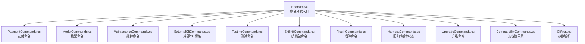
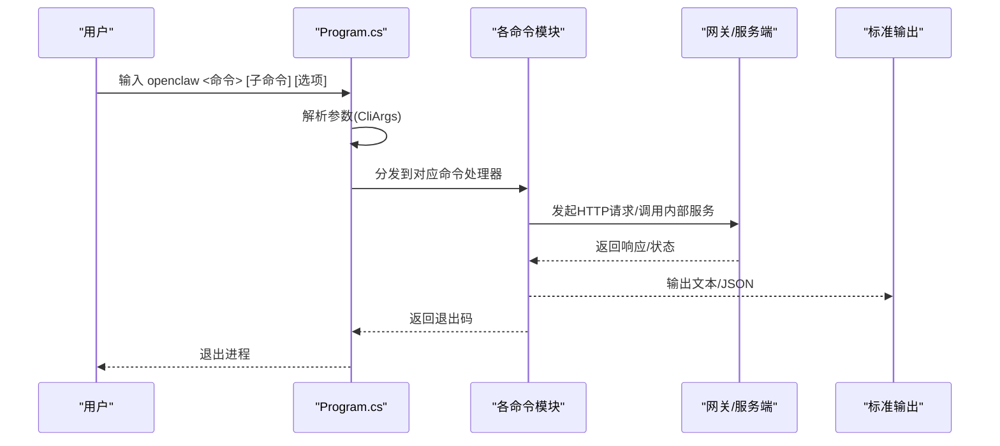
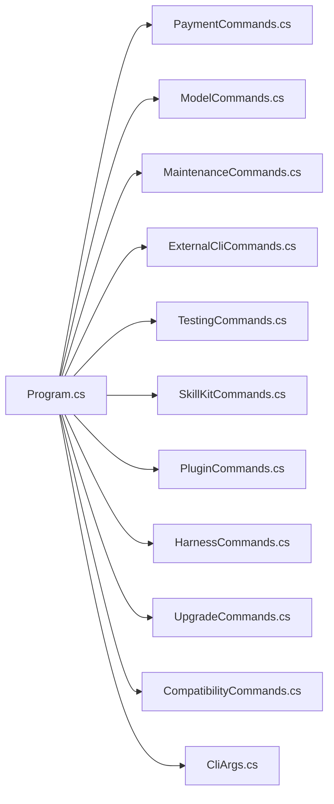

# 高级命令

<cite>
**本文引用的文件**
- [Program.cs](file://src/OpenClaw.Cli/Program.cs)
- [CliArgs.cs](file://src/OpenClaw.Cli/CliArgs.cs)
- [PaymentCommands.cs](file://src/OpenClaw.Cli/PaymentCommands.cs)
- [ModelCommands.cs](file://src/OpenClaw.Cli/ModelCommands.cs)
- [MaintenanceCommands.cs](file://src/OpenClaw.Cli/MaintenanceCommands.cs)
- [ExternalCliCommands.cs](file://src/OpenClaw.Cli/ExternalCliCommands.cs)
- [TestingCommands.cs](file://src/OpenClaw.Cli/TestingCommands.cs)
- [SkillKitCommands.cs](file://src/OpenClaw.Cli/SkillKitCommands.cs)
- [PluginCommands.cs](file://src/OpenClaw.Cli/PluginCommands.cs)
- [HarnessCommands.cs](file://src/OpenClaw.Cli/HarnessCommands.cs)
- [UpgradeCommands.cs](file://src/OpenClaw.Cli/UpgradeCommands.cs)
- [CompatibilityCommands.cs](file://src/OpenClaw.Cli/CompatibilityCommands.cs)
</cite>

## 目录
1. [简介](#简介)
2. [项目结构](#项目结构)
3. [核心组件](#核心组件)
4. [架构总览](#架构总览)
5. [详细组件分析](#详细组件分析)
6. [依赖关系分析](#依赖关系分析)
7. [性能考量](#性能考量)
8. [故障排查指南](#故障排查指南)
9. [结论](#结论)
10. [附录](#附录)

## 简介
本文件面向企业与运维用户，系统化梳理 OpenClaw.NET 的高级命令体系，重点覆盖以下领域：
- 管理员命令：openclaw admin（安全态势、事件导出、轨迹导出、审批模拟）
- 模型管理：openclaw models（本地模型包列表、状态检查、安装/验证/移除、预设与诊断）
- 支付处理：openclaw payment（设置检查、资金来源、虚拟卡签发、机器支付执行、状态查询）
- 账户管理：openclaw accounts（账户清单、新增、删除、探测）
- 外部CLI桥接：openclaw external（连接器、命令、预览与执行）
- 测试与回归：openclaw test、openclaw harness（场景测试、回归、代码基映射、共享Harness状态）
- 插件管理：openclaw plugins（安装/卸载/列出/搜索）
- 升级与维护：openclaw upgrade、openclaw maintenance（升级预检、回滚、扫描/修复）
- 兼容性目录：openclaw compatibility（兼容性场景清单）

同时，文档提供安全策略配置、权限管理与审计日志分析建议，并给出企业级部署与管理最佳实践。

## 项目结构
OpenClaw.Cli 是命令行入口与各子命令的聚合层，通过 Program.cs 的主分发逻辑将参数路由到具体命令模块；各命令模块负责解析参数、调用客户端或内部服务、输出结果或错误码。

图表来源
- [Program.cs:12-58](file://src/OpenClaw.Cli/Program.cs#L12-L58)
- [PaymentCommands.cs:12-105](file://src/OpenClaw.Cli/PaymentCommands.cs#L12-L105)
- [ModelCommands.cs:7-86](file://src/OpenClaw.Cli/ModelCommands.cs#L7-L86)
- [MaintenanceCommands.cs:10-63](file://src/OpenClaw.Cli/MaintenanceCommands.cs#L10-L63)
- [ExternalCliCommands.cs:14-112](file://src/OpenClaw.Cli/ExternalCliCommands.cs#L14-L112)
- [TestingCommands.cs:12-34](file://src/OpenClaw.Cli/TestingCommands.cs#L12-L34)
- [SkillKitCommands.cs:8-42](file://src/OpenClaw.Cli/SkillKitCommands.cs#L8-L42)
- [PluginCommands.cs:18-37](file://src/OpenClaw.Cli/PluginCommands.cs#L18-L37)
- [HarnessCommands.cs:14-46](file://src/OpenClaw.Cli/HarnessCommands.cs#L14-L46)
- [UpgradeCommands.cs:12-28](file://src/OpenClaw.Cli/UpgradeCommands.cs#L12-L28)
- [CompatibilityCommands.cs:9-28](file://src/OpenClaw.Cli/CompatibilityCommands.cs#L9-L28)
- [CliArgs.cs:14-97](file://src/OpenClaw.Cli/CliArgs.cs#L14-L97)

章节来源
- [Program.cs:12-58](file://src/OpenClaw.Cli/Program.cs#L12-L58)
- [CliArgs.cs:14-97](file://src/OpenClaw.Cli/CliArgs.cs#L14-L97)

## 核心组件
- 命令分发与帮助：Program.cs 提供统一入口、帮助输出与错误处理。
- 参数解析：CliArgs.cs 提供通用的选项/标志解析与位置参数提取。
- 子命令模块：各命令文件封装自身子命令族的参数、调用与输出格式。

章节来源
- [Program.cs:85-237](file://src/OpenClaw.Cli/Program.cs#L85-L237)
- [CliArgs.cs:14-97](file://src/OpenClaw.Cli/CliArgs.cs#L14-L97)

## 架构总览
下图展示 openclaw admin、models、payment、accounts 等高级命令在运行时的交互路径与数据流。

图表来源
- [Program.cs:12-69](file://src/OpenClaw.Cli/Program.cs#L12-L69)
- [CliArgs.cs:14-97](file://src/OpenClaw.Cli/CliArgs.cs#L14-L97)

## 详细组件分析

### openclaw admin（管理员命令）
- 功能概览
  - posture：查看安全态势
  - incident export：导出事件与审批数据（可限制条数）
  - trajectory export：按会话/时间范围导出轨迹，支持匿名化与输出路径
  - approvals simulate：模拟审批流程，支持指定工具、参数、自主度模式与审批要求

- 关键行为
  - 参数解析与认证：支持 --url 与 OPENCLAW_BASE_URL、--token 或 OPENCLAW_AUTH_TOKEN
  - 导出能力：轨迹导出支持匿名化与文件输出；事件导出支持审批上限与事件上限
  - 审批模拟：可注入工具与参数，评估审批策略与自主度影响

- 使用要点
  - 生产环境建议优先使用环境变量传递认证信息
  - 导出命令可能涉及大量数据，建议配合 --approval-limit/--event-limit 控制规模

章节来源
- [Program.cs:278-290](file://src/OpenClaw.Cli/Program.cs#L278-L290)

### openclaw models（模型管理）
- 功能概览
  - list：列出可用模型
  - doctor：诊断模型配置与可用性
  - presets：显示平台预设
  - packages：列出本地模型包定义
  - status：查看单个或全部包的状态
  - install：安装本地模型包（支持从路径/URL下载、令牌鉴权、接受许可、选择根目录）
  - verify：校验已安装包完整性
  - remove：移除已安装包

- 关键行为
  - 本地模型缓存与清单：基于 LocalModelPackageCatalog 与 LocalModelCache
  - 文件角色与校验：记录每个文件的角色、是否必需、SHA256 校验
  - 可选文件控制：--no-optional-files 可跳过非必需文件

- 使用要点
  - 安装前先 verify，确保完整性
  - 多模态/投影文件路径可通过 --mmproj-path、--draft-path 指定
  - 许可证接受需显式 --accept-license

章节来源
- [ModelCommands.cs:7-151](file://src/OpenClaw.Cli/ModelCommands.cs#L7-L151)

### openclaw payment（支付处理）
- 功能概览
  - setup：查询支付提供商设置状态
  - funding list：列出可用资金来源
  - virtual-card issue：签发虚拟卡（可指定商户、金额、币种、有效期、资金来源）
  - execute：执行机器支付（挑战协议、资源URL、商户、金额、币种）
  - status：查询支付/虚拟卡状态

- 关键行为
  - 环境控制：默认测试环境，live 需要 --environment live 与 --yes 显式确认
  - 安全约束：live 操作强制 --yes，但策略与审批检查仍会执行
  - 输出安全：仅输出白名单元数据，避免敏感信息泄露

- 使用要点
  - 测试优先：默认走测试环境，生产前务必在测试环境完成端到端验证
  - 资金来源：通过 --funding-source 指定，或使用 funding list 列表核对
  - 虚拟卡有效期：默认 30 分钟，可通过 --valid-minutes 调整

章节来源
- [PaymentCommands.cs:12-206](file://src/OpenClaw.Cli/PaymentCommands.cs#L12-L206)

### openclaw accounts（账户管理）
- 功能概览
  - list：列出账户
  - add：新增账户（支持 display-name、secret 引用/明文、token 文件、作用域、过期时间、元数据）
  - remove：删除账户
  - probe：探测账户/提供商状态（可指定后端）

- 关键行为
  - 认证与配置：支持 OPENCLAW_BASE_URL 与 OPENCLAW_AUTH_TOKEN
  - 探测能力：可验证提供商连通性与后端可用性

- 使用要点
  - secret 引用：推荐使用 env:VARNAME 形式，避免明文存储
  - 元数据：可用于标记用途、归属等辅助信息

章节来源
- [Program.cs:334-347](file://src/OpenClaw.Cli/Program.cs#L334-L347)

### openclaw external（外部CLI桥接）
- 功能概览
  - presets：列出本地预设
  - list/status/commands：枚举连接器、状态与命令
  - preview/execute：预览命令并执行（高风险/变更类命令需要 --yes）

- 关键行为
  - 参数解析：--param key=value 支持 JSON/字符串自动识别
  - 审批机制：预览阶段可生成指纹，批准后执行
  - 输出截断：stdout/stderr 截断会提示

- 使用要点
  - 高风险命令必须先 preview 再执行
  - 外部CLI开关受配置控制（默认禁用）

章节来源
- [ExternalCliCommands.cs:14-269](file://src/OpenClaw.Cli/ExternalCliCommands.cs#L14-L269)

### openclaw test 与 openclaw harness（测试与回归）
- openclaw test
  - init：初始化场景目录与文档目录
  - run/report/gates：运行场景、生成报告、质量门禁评估

- openclaw harness
  - test/regression：离线回归测试
  - map：生成代码基映射（支持哈希、最近天数、最大文件数、分类）
  - state：共享Harness状态查询（list/show/session/conflicts）

- 使用要点
  - 离线模式：默认不联网，仅做静态扫描
  - 严格模式：--strict 将警告/跳过视为失败
  - 报告输出：支持 --output 指定路径

章节来源
- [TestingCommands.cs:12-271](file://src/OpenClaw.Cli/TestingCommands.cs#L12-L271)
- [HarnessCommands.cs:14-450](file://src/OpenClaw.Cli/HarnessCommands.cs#L14-L450)

### openclaw plugins（插件管理）
- 功能概览
  - install：从 npm/ClawHub 或本地路径安装
  - remove：卸载插件
  - list：列出已安装插件
  - search：搜索 npm 包

- 关键行为
  - 扩展目录：支持全局与工作区两种安装路径
  - 安装检查：解析 openclaw.plugin.json/package.json，生成兼容性诊断
  - 信任等级：根据来源与声明表面确定信任级别

- 使用要点
  - 安装前建议 --dry-run 查看声明与诊断
  - 重启网关以加载新插件

章节来源
- [PluginCommands.cs:18-792](file://src/OpenClaw.Cli/PluginCommands.cs#L18-L792)

### openclaw upgrade 与 openclaw maintenance（升级与维护）
- openclaw upgrade
  - check：升级预检（配置/提供商就绪、插件兼容、技能兼容、迁移影响、快照）
  - rollback：回滚至上一个“已知良好”快照并重新验证

- openclaw maintenance
  - scan：扫描维护报告（可靠性、存储、预算、漂移）
  - fix：执行修复（dry-run/apply）

- 使用要点
  - 快照保护：预检成功后保存“已知良好”快照，便于回滚
  - 修复策略：--apply=all|retention|metadata|artifacts 控制修复范围

章节来源
- [UpgradeCommands.cs:12-800](file://src/OpenClaw.Cli/UpgradeCommands.cs#L12-L800)
- [MaintenanceCommands.cs:10-113](file://src/OpenClaw.Cli/MaintenanceCommands.cs#L10-L113)

### openclaw compatibility（兼容性目录）
- 功能概览
  - catalog：列出公开兼容性场景（支持按状态/类型/分类过滤，JSON 输出）

- 使用要点
  - 适合在升级/集成前快速核对兼容性与安装步骤

章节来源
- [CompatibilityCommands.cs:9-107](file://src/OpenClaw.Cli/CompatibilityCommands.cs#L9-L107)

## 依赖关系分析
- 命令间耦合
  - Program.cs 作为唯一入口，低耦合地分发到各命令模块
  - 各命令模块相对独立，仅共享 CliArgs 与通用客户端/服务接口
- 外部依赖
  - 支付命令依赖支付抽象与支付服务
  - 模型命令依赖本地模型包与缓存
  - 插件命令依赖 npm 工具链与插件发现
  - 升级/维护命令依赖配置文件与内部验证服务
- 循环依赖
  - 未见循环依赖迹象，命令模块之间无直接互相引用

图表来源
- [Program.cs:12-58](file://src/OpenClaw.Cli/Program.cs#L12-L58)
- [CliArgs.cs:14-97](file://src/OpenClaw.Cli/CliArgs.cs#L14-L97)

## 性能考量
- I/O 与网络
  - 支付/外部CLI/升级等命令可能涉及远程调用与大文件传输，建议在内网或带宽充足的环境中执行
- 扫描与映射
  - harness map 与 maintenance scan 为本地静态扫描，注意文件数量与最近天数参数对性能的影响
- 并发与批处理
  - 建议在 CI/CD 中串行执行关键命令，避免并发写入配置与快照
- 缓存与重试
  - 对于外部提供商/支付网关，建议在网络抖动环境下增加重试与超时配置

## 故障排查指南
- 常见错误与处理
  - 未知命令：检查命令拼写，参考 --help 输出
  - 参数缺失：根据提示补齐必填项（如 --id、--merchant、--amount-minor 等）
  - 权限不足：确认 OPENCLAW_AUTH_TOKEN 或 --token 设置正确
  - 外部CLI高风险命令：未加 --yes 会被拒绝，先 preview 再执行
  - 插件安装失败：查看兼容性诊断与信任级别，必要时降级或更换来源
  - 升级阻塞：根据预检报告逐项修复，再重新执行 check

- 审计与日志
  - 审批模拟与轨迹导出可用于事后审计
  - 维护扫描报告中的“发现”与“建议”是定位问题的关键线索

章节来源
- [Program.cs:78-83](file://src/OpenClaw.Cli/Program.cs#L78-L83)
- [ExternalCliCommands.cs:88-93](file://src/OpenClaw.Cli/ExternalCliCommands.cs#L88-L93)
- [PluginCommands.cs:662-679](file://src/OpenClaw.Cli/PluginCommands.cs#L662-L679)
- [UpgradeCommands.cs:516-521](file://src/OpenClaw.Cli/UpgradeCommands.cs#L516-L521)

## 结论
本文档系统梳理了 openclaw admin、models、payment、accounts 等高级命令的功能边界、参数与使用方式，并结合企业级需求提供了安全策略、权限管理与审计日志分析建议。通过维护扫描、升级预检与回滚快照等机制，可在生产环境中稳健地进行模型与支付管理、插件扩展与系统升级。

## 附录
- 最佳实践清单
  - 支付：测试优先、明确资金来源、严格控制有效期、启用审批模拟
  - 模型：安装前 verify，关注文件角色与校验，合理使用可选文件
  - 插件：--dry-run 审查声明与诊断，优先选择受信来源
  - 升级：执行 check 并保存快照，必要时 rollback，严格模式下谨慎放行
  - 外部CLI：高风险命令必须 preview 并 --yes，保留执行结果与指纹
  - 审计：定期导出 incident/trajectory，结合 gates/report 进行合规审查